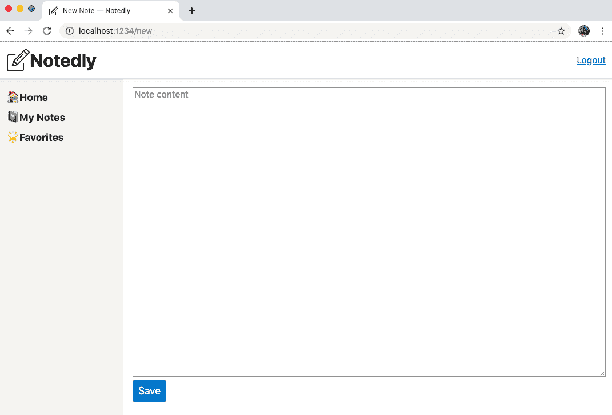
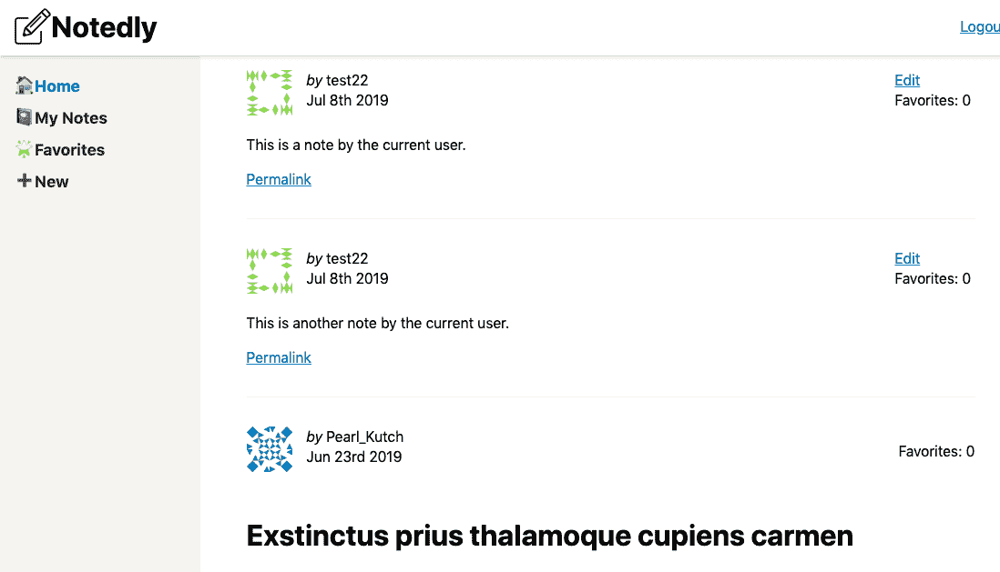
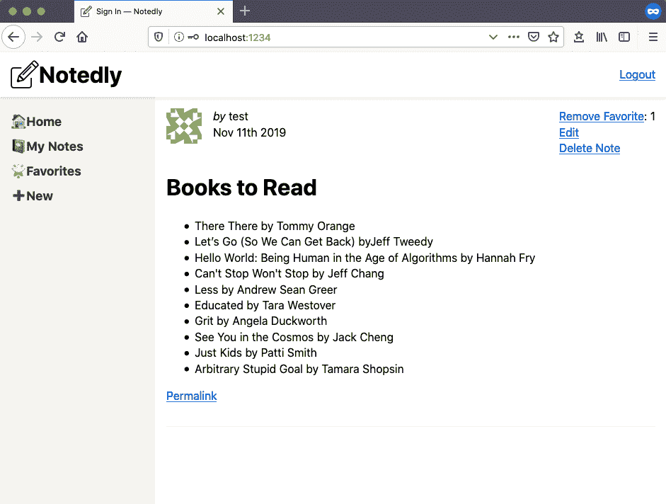

# 第十六章：创建、读取、更新和删除操作

我喜欢纸质笔记本，并几乎随身携带一本。通常它们比较便宜，我很快就会用半成品的想法填满它们。不久前，我购买了一本价格较高的硬面笔记本，带有可爱的封面和精美的纸张。购买时，我对这本笔记本的素描和规划有着宏大的抱负，但它在我桌子上空了几个月。最终，我把它放在书架上，又回到了我的标准笔记本品牌。

就像我的精美笔记本一样，我们的应用程序只有在用户能够与之交互时才有用。您可能还记得我们的 API 开发中，Notedly 应用程序是一个“CRUD”（创建、读取、更新和删除）应用程序。经过身份验证的用户可以创建新的笔记、读取笔记、更新笔记内容或将笔记标记为喜欢，并删除笔记。在本章中，我们将在我们的 Web 用户界面中实现所有这些功能。为了完成这些任务，我们将编写 GraphQL 突变和查询。

# 创建新笔记

目前我们能够查看笔记，但无法创建它们。这就像有了一个没有笔的笔记本一样。让我们添加用户创建新笔记的能力。我们将通过创建一个 `textarea` 表单来实现这一点，用户可以在其中编写笔记。当用户提交表单时，我们将执行 GraphQL 突变来在我们的数据库中创建笔记。

首先，让我们在 *src/pages/new.js* 中创建 `NewNote` 组件：

```
import React, { useEffect } from 'react';
import { useMutation, gql } from '@apollo/client';

const NewNote = props => {
  useEffect(() => {
    // update the document title
    document.title = 'New Note — Notedly';
  });

  return <div>New note</div>;
};

export default NewNote;
```

接下来，让我们在 *src/pages/index.js* 文件中设置新的路由：

```
// import the NewNote route component
import NewNote from './new';

// add a private route to our list of routes, within the
<PrivateRoute path="/new" component={NewNote} />
```

我们知道我们既将创建新的笔记，又将更新现有的笔记。为了适应这种行为，让我们创建一个名为 `NoteForm` 的新组件，它将用作笔记表单编辑的标记和 React 状态。

我们将在 *src/components/NoteForm.js* 中创建一个新文件。该组件将包含一个表单元素，其中包含一个文本区域以及一些最小的样式。其功能将类似于我们的 `UserForm` 组件：

```
import React, { useState } from 'react';
import styled from 'styled-components';

import Button from './Button';

const Wrapper = styled.div`
 height: 100%;
`;

const Form = styled.form`
 height: 100%;
`;

const TextArea = styled.textarea`
 width: 100%;
 height: 90%;
`;

const NoteForm = props => {
  // set the default state of the form
  const [value, setValue] = useState({ content: props.content || '' });

  // update the state when a user types in the form
  const onChange = event => {
    setValue({
      ...value,
      [event.target.name]: event.target.value
    });
  };

  return (
    <Wrapper>
      <Form
        onSubmit={e => {
          e.preventDefault();
          props.action({
            variables: {
              ...values
            }
          });
        }}
      >
        <TextArea
          required
          type="text"
          name="content"
          placeholder="Note content"
          value={value.content}
          onChange={onChange}
        />
        <Button type="submit">Save</Button>
      </Form>
    </Wrapper>
  );
};

export default NoteForm;
```

接下来，我们需要在我们的 `NewNote` 页面组件中引用我们的 `NoteForm` 组件。在 *src/pages/new.js* 中：

```
import React, { useEffect } from 'react';
import { useMutation, gql } from '@apollo/client';
// import the NoteForm component
import NoteForm from '../components/NoteForm';

const NewNote = props => {
  useEffect(() => {
    // update the document title
    document.title = 'New Note — Notedly';
  });

  return <NoteForm />;
};
export default NewNote;
```

通过这些更新，访问 *http://localhost:1234/new* 将显示我们的表单（参见图 16-1）。



###### 图 16-1\. 我们的 NewNote 组件展示了一个大的文本区域和保存按钮

表单完成后，我们可以开始编写我们的突变以创建新的笔记。在 *src/pages/new.js* 中：

```
import React, { useEffect } from 'react';
import { useMutation, gql } from '@apollo/client';

import NoteForm from '../components/NoteForm';

// our new note query
const NEW_NOTE = gql`
 mutation newNote($content: String!) {
 newNote(content: $content) {
 id
 content
 createdAt
 favoriteCount
 favoritedBy {
 id
 username
 }
 author {
 username
 id
 }
 }
 }
`;

const NewNote = props => {
  useEffect(() => {
    // update the document title
    document.title = 'New Note — Notedly';
  });

  const [data, { loading, error }] = useMutation(NEW_NOTE, {
    onCompleted: data => {
      // when complete, redirect the user to the note page
      props.history.push(`note/${data.newNote.id}`);
    }
  });

  return (
    <React.Fragment>
      {/* as the mutation is loading, display a loading message*/}
      {loading && <p>Loading...</p>}
      {/* if there is an error, display a error message*/}
      {error && <p>Error saving the note</p>}
      {/* the form component, passing the mutation data as a prop */}
      <NoteForm action={data} />
    </React.Fragment>
  );
};

export default NewNote;
```

在上述代码中，当提交表单时，我们执行 `newNote` 突变。如果突变成功，用户将被重定向到个别笔记页面。您可能注意到 `newNote` 突变请求了相当多的数据。这与 `note` 突变请求的数据相匹配，理想情况下更新 Apollo 的缓存以快速导航到个别笔记组件。

如前所述，Apollo 对我们的查询进行了积极的缓存，这有助于加快我们应用的导航速度。不幸的是，这也意味着用户可能访问页面时看不到他们刚刚做出的更新。我们可以手动更新 Apollo 的缓存，但更简单的方法是使用 Apollo 的 `refetchQueries` 功能，在执行变异时有意更新缓存。为此，我们需要访问我们预写的查询。到目前为止，我们一直将它们包含在组件文件的顶部，但让我们将它们移到它们自己的 *query.js* 文件中。在 */src/gql/query.js* 创建一个新文件，并添加每一个我们的笔记查询以及我们的 `IS_LOGGED_IN` 查询：

```
import { gql } from '@apollo/client';

const GET_NOTES = gql`
 query noteFeed($cursor: String) {
 noteFeed(cursor: $cursor) {
 cursor
 hasNextPage
 notes {
 id
 createdAt
 content
 favoriteCount
 author {
 username
 id
 avatar
 }
 }
 }
 }
`;

const GET_NOTE = gql`
 query note($id: ID!) {
 note(id: $id) {
 id
 createdAt
 content
 favoriteCount
 author {
 username
 id
 avatar
 }
 }
 }
`;

const IS_LOGGED_IN = gql`
 {
 isLoggedIn @client
 }
`;

export { GET_NOTES, GET_NOTE, IS_LOGGED_IN };
```

# 可重用的查询和变异

未来，我们将保持所有的查询和变异与我们的组件分开，这将允许我们在应用程序中轻松重用它们，并且在测试期间也是有用的 [mocking](https://oreil.ly/qo9uE)。

现在，在 *src/pages/new.js* 中，我们可以请求我们的变异通过导入查询并添加 `refetchQueries` 选项来重新获取 `GET_NOTES` 查询：

```
// import the query
import { GET_NOTES } from '../gql/query';

// within the NewNote component update the mutation
//everything else stays the same

const NewNote = props => {
  useEffect(() => {
    // update the document title
    document.title = 'New Note — Notedly';
  });

  const [data, { loading, error }] = useMutation(NEW_NOTE, {
    // refetch the GET_NOTES query to update the cache
    refetchQueries: [{ query: GET_NOTES }],
    onCompleted: data => {
      // when complete, redirect the user to the note page
      props.history.push(`note/${data.newNote.id}`);
    }
  });

  return (
    <React.Fragment>
      {/* as the mutation is loading, display a loading message*/}
      {loading && <p>Loading...</p>}
      {/* if there is an error, display a error message*/}
      {error && <p>Error saving the note</p>}
      {/* the form component, passing the mutation data as a prop */}
      <NoteForm action={data} />
    </React.Fragment>
  );
};
```

我们的最后一步将是在 */new* 页面添加一个链接，以便用户可以轻松导航到它。在 *src/components/Navigation.js* 文件中，添加一个新的链接项如下：

```
<li>
  <Link to="/new">New</Link>
</li>
```

通过这样，我们的用户可以导航到新笔记页面，输入笔记，并将笔记保存到数据库中。

# 读取用户笔记

我们的应用程序目前能够读取我们的笔记源以及单个笔记，但我们尚未查询经过身份验证用户的笔记。让我们编写两个 GraphQL 查询，以创建用户的笔记源以及他们的收藏夹。

在 *src/gql/query.js* 中，添加一个 `GET_MY_NOTES` 查询，并像这样更新导出：

```
// add the GET_MY_NOTES query
const GET_MY_NOTES = gql`
 query me {
 me {
 id
 username
 notes {
 id
 createdAt
 content
 favoriteCount
 author {
 username
 id
 avatar
 }
 }
 }
 }
`;

// update to include GET_MY_NOTES
export { GET_NOTES, GET_NOTE, IS_LOGGED_IN, GET_MY_NOTES };
```

现在，在 *src/pages/mynotes.js* 中，导入查询并使用 `NoteFeed` 组件显示笔记：

```
import React, { useEffect } from 'react';
import { useQuery, gql } from '@apollo/client';

import NoteFeed from '../components/NoteFeed';
import { GET_MY_NOTES } from '../gql/query';

const MyNotes = () => {
  useEffect(() => {
    // update the document title
    document.title = 'My Notes — Notedly';
  });

  const { loading, error, data } = useQuery(GET_MY_NOTES);

  // if the data is loading, our app will display a loading message
  if (loading) return 'Loading...';
  // if there is an error fetching the data, display an error message
  if (error) return `Error! ${error.message}`;
  // if the query is successful and there are notes, return the feed of notes
  // else if the query is successful and there aren't notes, display a message
  if (data.me.notes.length !== 0) {
    return <NoteFeed notes={data.me.notes} />;
  } else {
    return <p>No notes yet</p>;
  }
};

export default MyNotes;
```

我们可以重复这个过程来制作“收藏夹”页面。首先，在 *src/gql/query.js* 中：

```
// add the GET_MY_FAVORITES query
const GET_MY_FAVORITES = gql`
 query me {
 me {
 id
 username
 favorites {
 id
 createdAt
 content
 favoriteCount
 author {
 username
 id
 avatar
 }
 }
 }
 }
`;

// update to include GET_MY_FAVORITES
export { GET_NOTES, GET_NOTE, IS_LOGGED_IN, GET_MY_NOTES, GET_MY_FAVORITES };
```

现在，在 *src/pages/favorites.js* 中：

```
import React, { useEffect } from 'react';
import { useQuery, gql } from '@apollo/client';

import NoteFeed from '../components/NoteFeed';
// import the query
import { GET_MY_FAVORITES } from '../gql/query';

const Favorites = () => {
  useEffect(() => {
    // update the document title
    document.title = 'Favorites — Notedly';
  });

  const { loading, error, data } = useQuery(GET_MY_FAVORITES);

  // if the data is loading, our app will display a loading message
  if (loading) return 'Loading...';
  // if there is an error fetching the data, display an error message
  if (error) return `Error! ${error.message}`;
  // if the query is successful and there are notes, return the feed of notes
  // else if the query is successful and there aren't notes, display a message
  if (data.me.favorites.length !== 0) {
    return <NoteFeed notes={data.me.favorites} />;
  } else {
    return <p>No favorites yet</p>;
  }
};

export default Favorites;
```

最后，让我们更新我们的 *src/pages/new.js* 文件，重新获取 `GET_MY_NOTES` 查询，以确保在创建笔记时更新用户笔记的缓存列表。在 *src/pages/new.js* 中，首先更新 GraphQL 查询的导入语句：

```
import { GET_MY_NOTES, GET_NOTES } from '../gql/query';
```

然后更新变异：

```
const [data, { loading, error }] = useMutation(NEW_NOTE, {
  // refetch the GET_NOTES and GET_MY_NOTES queries to update the cache
  refetchQueries: [{ query: GET_MY_NOTES }, { query: GET_NOTES }],
  onCompleted: data => {
    // when complete, redirect the user to the note page
    props.history.push(`note/${data.newNote.id}`);
  }
});
```

通过这些更改，我们现在可以在应用程序中执行所有的读操作。

# 更新笔记

目前，一旦用户写下一条笔记，他们就没有办法对其进行更新。为了解决这个问题，我们希望在我们的应用程序中启用笔记编辑。我们的 GraphQL API 有一个 `updateNote` 变异，它接受笔记 ID 和内容作为参数。如果数据库中存在该笔记，则变异将使用变异中发送的内容更新存储的内容。

在我们的应用程序中，我们可以创建一个在 */edit/NOTE_ID* 的路由，该路由将在一个表单 `textarea` 中放置现有笔记内容。当用户点击保存时，我们将提交表单并执行 `updateNote` 变异。

让我们创建一个新的路由，用于编辑我们的笔记。首先，我们可以复制我们的 *src/pages/note.js* 页面，并命名为 *edit.js*。目前，这个页面将简单地显示笔记内容。

在 *src/pages/edit.js* 中：

```
import React from 'react';
import { useQuery, useMutation, gql } from '@apollo/client';

// import the Note component
import Note from '../components/Note';
// import the GET_NOTE query
import { GET_NOTE } from '../gql/query';

const EditNote = props => {
  // store the id found in the url as a variable
  const id = props.match.params.id;
  // define our note query
  const { loading, error, data } = useQuery(GET_NOTE, { variables: { id } });

  // if the data is loading, display a loading message
  if (loading) return 'Loading...';
  // if there is an error fetching the data, display an error message
  if (error) return <p>Error! Note not found</p>;
  // if successful, pass the data to the note component
  return <Note note={data.note} />;
};

export default EditNote;
```

现在，我们可以通过将其添加到 *src/pages/index.js* 中的路由来使页面可导航：

```
// import the edit page component
import EditNote from './edit';

// add a new private route that accepts an :id parameter
<PrivateRoute path="/edit/:id" component={EditNote} />
```

现在，如果您导航到 */note/ID* 的笔记页面并将其替换为 */edit/ID*，您将看到笔记本身的渲染。让我们改变这个，使其显示在表单的 `textarea` 中呈现的笔记内容。

在 *src/pages/edit.js* 中，删除 `Note` 组件的导入语句，并替换为 `NoteForm` 组件：

```
// import the NoteForm component
import NoteForm from '../components/NoteForm';
```

现在我们可以更新我们的 `EditNote` 组件以使用我们的编辑表单。我们可以通过 `content` 属性将笔记内容传递给我们的表单组件。尽管我们的 GraphQL 变更仅接受原始作者的更新，我们也可以限制将表单显示给笔记作者，以避免混淆其他用户。

首先，在 *src/gql/query.js* 文件中添加一个新的查询来获取当前用户、他们的用户 ID 和收藏的笔记 ID 列表：

```
// add GET_ME to our queries
const GET_ME = gql`
 query me {
 me {
 id
 favorites {
 id
 }
 }
 }
`;

// update to include GET_ME
export {
  GET_NOTES,
  GET_NOTE,
  GET_MY_NOTES,
  GET_MY_FAVORITES,
  GET_ME,
  IS_LOGGED_IN
};
```

在 *src/pages/edit.js* 中，导入 `GET_ME` 查询并包含用户检查：

```
import React from 'react';
import { useMutation, useQuery } from '@apollo/client';

// import the NoteForm component
import NoteForm from '../components/NoteForm';
import { GET_NOTE, GET_ME } from '../gql/query';
import { EDIT_NOTE } from '../gql/mutation';

const EditNote = props => {
  // store the id found in the url as a variable
  const id = props.match.params.id;
  // define our note query
  const { loading, error, data } = useQuery(GET_NOTE, { variables: { id } });
  // fetch the current user's data
  const { data: userdata } = useQuery(GET_ME);
  // if the data is loading, display a loading message
  if (loading) return 'Loading...';
  // if there is an error fetching the data, display an error message
  if (error) return <p>Error! Note not found</p>;
  // if the current user and the author of the note do not match
  if (userdata.me.id !== data.note.author.id) {
    return <p>You do not have access to edit this note</p>;
  }
  // pass the data to the form component
  return <NoteForm content={data.note.content} />;
};
```

现在我们能够在表单中编辑笔记，但是点击按钮还不能保存我们的更改。让我们编写我们的 GraphQL `updateNote` 变更。与我们的查询文件类似，让我们创建一个文件来保存我们的变更。在 *src/gql/mutation* 中添加以下内容：

```
import { gql } from '@apollo/client';

const EDIT_NOTE = gql`
 mutation updateNote($id: ID!, $content: String!) {
 updateNote(id: $id, content: $content) {
 id
 content
 createdAt
 favoriteCount
 favoritedBy {
 id
 username
 }
 author {
 username
 id
 }
 }
 }
`;

export { EDIT_NOTE };
```

编写完我们的变更后，我们可以导入它并更新我们的组件代码，以在单击按钮时调用变更。为此，我们将添加一个 `useMutation` 钩子。当变更完成时，我们将重定向用户到笔记页面。

```
// import the mutation
import { EDIT_NOTE } from '../gql/mutation';

const EditNote = props => {
  // store the id found in the url as a variable
  const id = props.match.params.id;
  // define our note query
  const { loading, error, data } = useQuery(GET_NOTE, { variables: { id } });
  // fetch the current user's data
  const { data: userdata } = useQuery(GET_ME);
  // define our mutation
  const [editNote] = useMutation(EDIT_NOTE, {
    variables: {
      id
    },
    onCompleted: () => {
      props.history.push(`/note/${id}`);
    }
  });

  // if the data is loading, display a loading message
  if (loading) return 'Loading...';
  // if there is an error fetching the data, display an error message
  if (error) return <p>Error!</p>;
  // if the current user and the author of the note do not match
  if (userdata.me.id !== data.note.author.id) {
    return <p>You do not have access to edit this note</p>;
  }

  // pass the data and mutation to the form component
  return <NoteForm content={data.note.content} action={editNote} />;
};

export default EditNote;
```

最后，我们希望为用户显示一个“编辑”链接，但只有当他们是笔记的作者时才显示。在我们的应用程序中，我们需要检查确保当前用户的 ID 是否与笔记作者的 ID 匹配。为了实现这种行为，我们将涉及多个组件。

现在我们可以在 `Note` 组件中直接实现我们的功能，但是我们可以创建一个专门用于已登录用户交互的组件，位于 *src/components/NoteUser.js*。在这个 React 组件中，我们将为当前用户 ID 执行 GraphQL 查询，并提供一个链接到编辑页面的路由。有了这些信息，我们可以开始包含所需的库并设置一个新的 React 组件。在 React 组件内部，我们将包含一个编辑链接，该链接将路由用户到笔记的编辑页面。目前，无论谁拥有这条笔记，用户都将看到此链接。

更新 *src/components/NoteUser.js* 如下：

```
import React from 'react';
import { useQuery, gql } from '@apollo/client';
import { Link } from 'react-router-dom';

const NoteUser = props => {
  return <Link to={`/edit/${props.note.id}`}>Edit</Link>;
};

export default NoteUser;
```

接下来，我们将更新我们的 `Note` 组件以执行本地的 `isLoggedIn` 状态查询。然后，我们可以根据用户的登录状态有条件地渲染我们的 `NoteUser` 组件。

首先导入 GraphQL 库以执行查询以及我们的 `NoteUser` 组件。在 *src/components/Note.js* 中，将以下内容添加到文件顶部：

```
import { useQuery } from '@apollo/client';

// import logged in user UI components
import NoteUser from './NoteUser';
// import the IS_LOGGED_IN local query
import { IS_LOGGED_IN } from '../gql/query';
```

现在，我们可以更新我们的 JSX 组件以检查登录状态。如果用户已登录，我们将显示 `NoteUser` 组件；否则，我们将显示收藏计数。

```
const Note = ({ note }) => {
  const { loading, error, data } = useQuery(IS_LOGGED_IN);
  // if the data is loading, display a loading message
  if (loading) return <p>Loading...</p>;
  // if there is an error fetching the data, display an error message
  if (error) return <p>Error!</p>;

  return (
    <StyledNote>
      <MetaData>
        <MetaInfo>
          
        </MetaInfo>
        <MetaInfo>
          <em>by</em> {note.author.username} <br />
          {format(note.createdAt, 'MMM Do YYYY')}
        </MetaInfo>
        {data.isLoggedIn ? (
          <UserActions>
            <NoteUser note={note} />
          </UserActions>
        ) : (
          <UserActions>
            <em>Favorites:</em> {note.favoriteCount}
          </UserActions>
        )}
      </MetaData>
      <ReactMarkdown source={note.content} />
    </StyledNote>
  );
};
```

# 未经身份验证的编辑

虽然我们将在 UI 中隐藏编辑链接，但用户仍然可以导航到笔记的编辑屏幕，而不必是笔记所有者。幸运的是，我们的 GraphQL API 设计为阻止除笔记所有者以外的任何人编辑笔记内容。尽管我们不会在本书中这样做，但一个很好的额外步骤将是更新 *src/pages/edit.js* 组件，以便如果用户不是笔记所有者，则重定向用户。

通过这个变化，已登录用户可以在每个笔记顶部看到一个编辑链接。点击链接将导航到一个编辑表单，无论笔记的所有者是谁。让我们通过更新 `NoteUser` 组件来解决这个问题，查询当前用户的 ID 并仅在与笔记作者的 ID 匹配时显示编辑链接。

首先在 *src/components/NoteUser.js* 中添加以下内容：

```
import React from 'react';
import { useQuery } from '@apollo/client';
import { Link } from 'react-router-dom';

// import our GET_ME query
import { GET_ME } from '../gql/query';

const NoteUser = props => {
  const { loading, error, data } = useQuery(GET_ME);
  // if the data is loading, display a loading message
  if (loading) return <p>Loading...</p>;
  // if there is an error fetching the data, display an error message
  if (error) return <p>Error!</p>;
  return (
    <React.Fragment>
      Favorites: {props.note.favoriteCount}
      <br />
      {data.me.id === props.note.author.id && (
        <React.Fragment>
          <Link to={`/edit/${props.note.id}`}>Edit</Link>
        </React.Fragment>
      )}
    </React.Fragment>
  );
};

export default NoteUser;
```

随着这个变化，只有笔记的原作者会在 UI 中看到编辑链接（图 16-2）。



###### 图 16-2\. 只有笔记的作者会看到编辑链接

# 删除笔记

我们的 CRUD 应用程序仍然缺少删除笔记的功能。我们可以编写一个按钮 UI 组件，当点击时，将执行 GraphQL 变异，删除该笔记。让我们从创建一个新组件开始，位于 *src/components/DeleteNote.js*。由于我们将在不可路由的组件内执行重定向，因此我们将使用 React Router 的 `withRouter` 高阶组件：

```
import React from 'react';
import { useMutation } from '@apollo/client';
import { withRouter } from 'react-router-dom';

import ButtonAsLink from './ButtonAsLink';

const DeleteNote = props => {
  return <ButtonAsLink>Delete Note</ButtonAsLink>;
};

export default withRouter(DeleteNote);
```

现在，我们可以编写我们的变异。我们的 GraphQL API 有一个 `deleteNote` 变异，如果笔记被删除，则返回 `true`。当变异完成时，我们将重定向用户到我们应用程序的 */mynotes* 页面。

首先，在 *src/gql/mutation.js* 中，编写如下变异：

```
const DELETE_NOTE = gql`
 mutation deleteNote($id: ID!) {
 deleteNote(id: $id)
 }
`;

// update to include DELETE_NOTE
export { EDIT_NOTE, DELETE_NOTE };
```

现在，在 *src/components/DeleteNote* 中，添加以下内容：

```
import React from 'react';
import { useMutation } from '@apollo/client';
import { withRouter } from 'react-router-dom';

import ButtonAsLink from './ButtonAsLink';
// import the DELETE_NOTE mutation
import { DELETE_NOTE } from '../gql/mutation';
// import queries to refetch after note deletion
import { GET_MY_NOTES, GET_NOTES } from '../gql/query';

const DeleteNote = props => {
  const [deleteNote] = useMutation(DELETE_NOTE, {
    variables: {
      id: props.noteId
    },
    // refetch the note list queries to update the cache
    refetchQueries: [{ query: GET_MY_NOTES, GET_NOTES }],
    onCompleted: data => {
      // redirect the user to the "my notes" page
      props.history.push('/mynotes');
    }
  });

  return <ButtonAsLink onClick={deleteNote}>Delete Note</ButtonAsLink>;
};

export default withRouter(DeleteNote);
```

现在，我们可以在 *src/components/NoteUser.js* 文件中导入新的 `DeleteNote` 组件，并仅显示给笔记的作者：

```
import React from 'react';
import { useQuery } from '@apollo/client';
import { Link } from 'react-router-dom';

import { GET_ME } from '../gql/query';
// import the DeleteNote component
import DeleteNote from './DeleteNote';

const NoteUser = props => {
  const { loading, error, data } = useQuery(GET_ME);
  // if the data is loading, display a loading message
  if (loading) return <p>Loading...</p>;
  // if there is an error fetching the data, display an error message
  if (error) return <p>Error!</p>;

  return (
    <React.Fragment>
      Favorites: {props.note.favoriteCount} <br />
      {data.me.id === props.note.author.id && (
        <React.Fragment>
          <Link to={`/edit/${props.note.id}`}>Edit</Link> <br />
          <DeleteNote noteId={props.note.id} />
        </React.Fragment>
      )}
    </React.Fragment>
  );
};

export default NoteUser;
```

有了这个变异，已登录用户现在可以通过点击按钮删除笔记。

# 切换收藏夹

我们应用程序中缺失的最后一部分用户功能是添加和删除“收藏”笔记的功能。让我们遵循我们创建此功能的模式，将其创建为一个组件并集成到我们的应用程序中。首先，在 *src/components/FavoriteNote.js* 中创建一个新组件：

```
import React, { useState } from 'react';
import { useMutation } from '@apollo/client';

import ButtonAsLink from './ButtonAsLink';

const FavoriteNote = props => {
  return <ButtonAsLink>Add to favorites</ButtonAsLink>;
};

export default FavoriteNote;
```

在添加任何功能之前，让我们继续将此组件合并到 *src/components/NoteUser.js* 组件中。首先，导入组件：

```
import FavoriteNote from './FavoriteNote';
```

现在，在我们的 JSX 中包含对组件的引用。您可能还记得，当我们编写 `GET_ME` 查询时，我们包括了一组收藏的笔记 ID，我们将在这里使用它：

```
return (
  <React.Fragment>
    <FavoriteNote
      me={data.me}
      noteId={props.note.id}
      favoriteCount={props.note.favoriteCount}
    />
    <br />
    {data.me.id === props.note.author.id && (
      <React.Fragment>
        <Link to={`/edit/${props.note.id}`}>Edit</Link> <br />
        <DeleteNote noteId={props.note.id} />
      </React.Fragment>
    )}
  </React.Fragment>
);
```

你会注意到我们将三个属性传递给我们的 `FavoriteNote` 组件。首先是我们的 `me` 数据，其中包括当前用户的 ID 以及用户收藏的注释列表。其次是当前注释的 `noteID`。最后是 `favoriteCount`，即当前用户收藏的总数。

现在我们可以返回到我们的 *src/components/FavoriteNote.js* 文件。在这个文件中，我们将以状态形式存储当前收藏的数量，并检查当前注释 ID 是否在用户收藏列表中。我们将根据用户收藏的状态更改用户看到的文本。当用户点击按钮时，它将调用我们的 `toggleFavorite` 变更，这将从用户的列表中添加或移除收藏。让我们开始更新组件，以使用状态来控制点击功能。

```
const FavoriteNote = props => {
  // store the note's favorite count as state
  const [count, setCount] = useState(props.favoriteCount);

  // store if the user has favorited the note as state
  const [favorited, setFavorited] = useState(
    // check if the note exists in the user favorites list
    props.me.favorites.filter(note => note.id === props.noteId).length > 0
  );

  return (
    <React.Fragment>
      {favorited ? (
        <ButtonAsLink
          onClick={() => {
            setFavorited(false);
            setCount(count - 1);
          }}
        >
          Remove Favorite
        </ButtonAsLink>
      ) : (
        <ButtonAsLink
          onClick={() => {
            setFavorited(true);
            setCount(count + 1);
          }}
        >
          Add Favorite
        </ButtonAsLink>
      )}
      : {count}
    </React.Fragment>
  );
};
```

在前述更改中，当用户点击时我们正在更新状态，但我们尚未调用我们的 GraphQL 变更。让我们通过编写变更并将其添加到组件中来完成此组件。结果显示在 图 16-3 中。

在 *src/gql/mutation.js* 文件中：

```
// add the TOGGLE_FAVORITE mutation
const TOGGLE_FAVORITE = gql`
 mutation toggleFavorite($id: ID!) {
 toggleFavorite(id: $id) {
 id
 favoriteCount
 }
 }
`;

// update to include TOGGLE_FAVORITE
export { EDIT_NOTE, DELETE_NOTE, TOGGLE_FAVORITE };
```

在 *src/components/FavoriteNote.js* 文件中：

```
import React, { useState } from 'react';
import { useMutation } from '@apollo/client';

import ButtonAsLink from './ButtonAsLink';
// the TOGGLE_FAVORITE mutation
import { TOGGLE_FAVORITE } from '../gql/mutation';
// add the GET_MY_FAVORITES query to refetch
import { GET_MY_FAVORITES } from '../gql/query';

const FavoriteNote = props => {
  // store the note's favorite count as state
  const [count, setCount] = useState(props.favoriteCount);

  // store if the user has favorited the note as state
  const [favorited, setFavorited] = useState(
    // check if the note exists in the user favorites list
    props.me.favorites.filter(note => note.id === props.noteId).length > 0
  );

  // toggleFavorite mutation hook
  const [toggleFavorite] = useMutation(TOGGLE_FAVORITE, {
    variables: {
      id: props.noteId
    },
    // refetch the GET_MY_FAVORITES query to update the cache
    refetchQueries: [{ query: GET_MY_FAVORITES }]
  });

  // if the user has favorited the note, display the option to remove the favorite
  // else, display the option to add as a favorite
  return (
    <React.Fragment>
      {favorited ? (
        <ButtonAsLink
          onClick={() => {
            toggleFavorite();
            setFavorited(false);
            setCount(count - 1);
          }}
        >
          Remove Favorite
        </ButtonAsLink>
      ) : (
        <ButtonAsLink
          onClick={() => {
            toggleFavorite();
            setFavorited(true);
            setCount(count + 1);
          }}
        >
          Add Favorite
        </ButtonAsLink>
      )}
      : {count}
    </React.Fragment>
  );
};

export default FavoriteNote;
```



###### 图 16-3\. 登录用户将能够创建、读取、更新和删除注释

# 结论

在本章中，我们将我们的网站转变为一个完全功能的 CRUD（创建、读取、更新、删除）应用程序。我们现在可以根据登录用户的状态实现 GraphQL 查询和变更。能够构建集成 CRUD 用户交互的用户界面将为构建各种 Web 应用程序提供坚实的基础。有了这个功能，我们已经完成了我们应用的 MVP（最小可行产品）。在下一章中，我们将把应用部署到 Web 服务器上。
