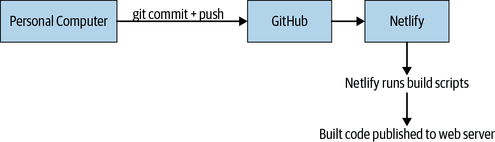
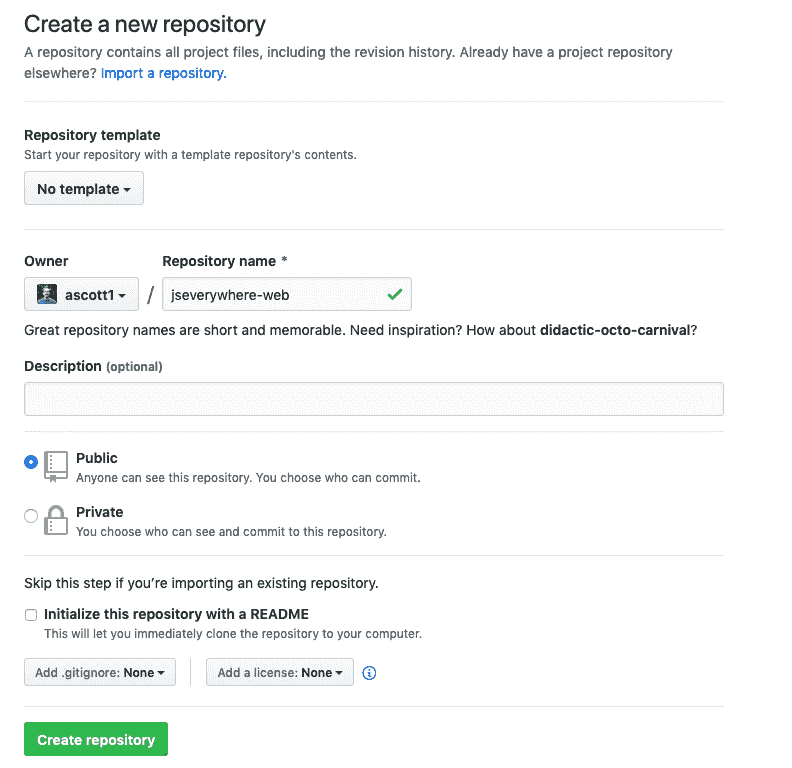
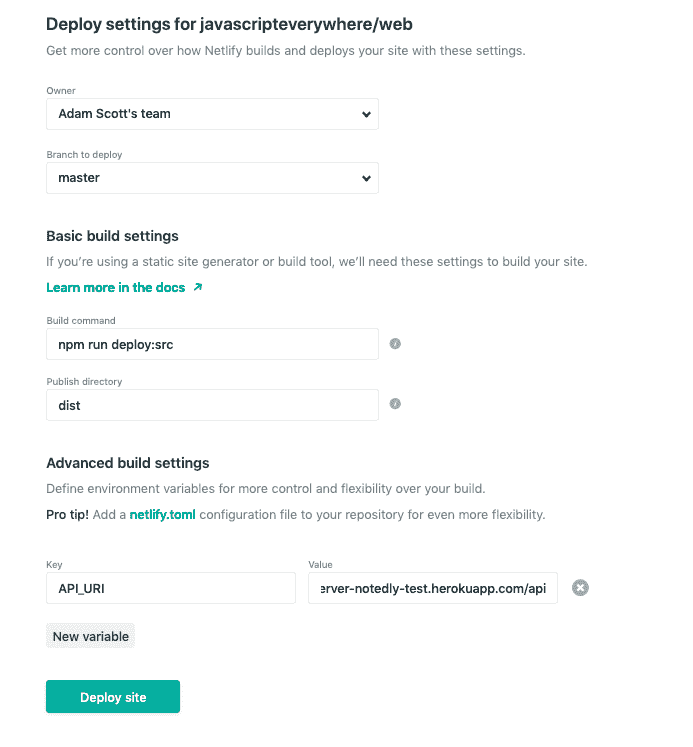

# 第十七章：部署 Web 应用程序

当我开始专业进行 web 开发时，“部署”意味着通过 FTP 客户端从我的本地机器上传文件到 web 服务器。当时没有任何构建步骤或流水线，这意味着我的本地机器上的原始文件与我的 web 服务器上的文件相同。如果出现问题，我要么拼命地尝试修复问题，要么通过替换旧文件的副本来回滚更改。这种“荒野西部”的方法当时效果还可以，但也导致了很多站点停机和意外问题。

在今天的 web 开发世界中，我们本地开发环境和 web 服务器的需求是完全不同的。在我的本地机器上，当我更新文件时，我希望看到即时变化，并且拥有未压缩的文件以进行调试。在我的 web 服务器上，我只期望在部署时看到变化，并且重视小文件大小。在本章中，我们将看一种将静态应用程序部署到 web 的方式。

# 静态网站

web 浏览器解析 HTML、CSS 和 JavaScript 来生成我们交互的网页。不同于 Express、Rails 和 Django 等框架在请求时服务器端生成页面的标记，静态网站只是存储在服务器上的一组 HTML、CSS 和 JavaScript。这可以从包含标记的单个 HTML 文件到编译模板语言、多个 JavaScript 文件和 CSS 预处理器的复杂前端构建过程。然而，静态网站最终只是这三种文件类型的集合。

我们的应用程序 Notedly 是一个静态 web 应用程序。它包含一些标记、CSS 和 JavaScript。我们的构建工具，[Parcel](https://parceljs.org)，将我们编写的组件编译为浏览器可用的文件。在本地开发中，我们运行一个 web 服务器，并使用 Parcel 的热模块替换功能即时更新这些文件。如果我们查看我们的*package.json*文件，你会看到我包含了两个`deploy`脚本：

```
"scripts": {
  "deploy:src": "parcel build src/index.html --public-url ./",
  "deploy:final": "parcel build final/index.html --public-url ./"
}
```

要构建应用程序，请打开你的终端应用程序，**`cd`** 进入包含项目的*web*目录的根目录，然后运行**`build`**命令：

```
# if you're not already in the web directory, be sure to cd into it
$ cd Projects/notedly/web
# build the files from the src directory
$ npm run deploy:src
```

如果你一直在跟随本书并在*src*目录中开发你的 web 应用程序，那么在终端中运行 `npm run deploy:src`，正如刚才描述的那样，将会根据你的代码生成构建好的应用程序。如果你更愿意使用与示例代码捆绑的应用程序的最终版本，那么使用 `npm run deploy:final` 将会从*final*应用程序目录构建代码。

在本章的其余部分，我将演示一种部署静态构建应用程序的方法，但这些文件可以托管在任何可以提供 HTML 的地方，从 Web 主机提供商到放在桌子上运行的树莓派。虽然我们将要进行的这种过程有许多实际的好处，但您的部署可能仅需简单地更新 *.env* 文件以指向远程 API，运行构建脚本并上传文件。

# 服务器端渲染的 React

虽然我们正在构建我们的 React 应用作为静态 Web 应用程序，但也可以在服务器上渲染 JSX。这种技术通常被称为“通用 JavaScript”，可以带来许多好处，包括性能提升、客户端 JavaScript 备用和 SEO 改进。像 [Next.js](https://nextjs.org) 这样的框架试图简化这个设置。虽然本书不涵盖服务器端渲染的 JavaScript 应用程序，但我强烈建议一旦您熟悉了客户端 JavaScript 应用程序开发，探索这种方法。

# 我们的部署流水线

对于我们应用程序的部署，我们将使用一个简单的流水线，这将允许我们自动部署代码库的更改。对于我们的流水线，我们将使用两个服务。第一个将是我们的源代码存储库，[GitHub](https://github.com)。第二个将是我们的 Web 主机，[Netlify](https://www.netlify.com)。我选择 Netlify 是因为它在部署方面具有广泛且易于使用的功能集，以及它专注于静态和无服务器应用程序。

我们的目标是使我们应用程序的 `master` 分支的任何提交都自动部署到我们的 Web 主机。我们可以将这个过程可视化如 图 17-1 所示。



###### 图 17-1\. 我们的部署过程

## 使用 Git 托管源代码

我们部署过程的第一步是设置我们的源代码存储库。您可能已经完成了这一步骤，如果是这样，请随意跳过。正如前面提到的，我们将使用 [GitHub](https://github.com)，但这个过程也可以配置为使用其他公共 Git 主机，比如 [GitLab](https://about.gitlab.com) 或 [Bitbucket](https://bitbucket.org)。

# GitHub 存储库

我们将创建一个新的 GitHub 存储库，但如果您愿意，您可以通过将官方代码示例 fork 到您的 GitHub 帐户来使用 [*https://github.com/javascript​everywhere/web*](https://oreil.ly/MLMS7)。

首先，转到 GitHub 并创建一个帐户或登录您的现有帐户。然后点击“New Repository”按钮。提供一个名称并点击“Create Repository”按钮（图 17-2）。



###### 图 17-2\. GitHub 的新存储库页面

现在，在你的终端应用程序中，导航到你的 Web 应用程序目录，将 Git origin 设置为新的 GitHub 仓库，并推送代码。因为我们正在更新现有的 Git 仓库，所以我们的指令与 GitHub 的略有不同：

```
# first navigate to the directory if you're not already there
cd Projects/notedly/web
# update the GitHub remote origin to match your repository
git remote set-url origin git://YOUR.GIT.URL
# push the code to the new GitHub repository
git push -u origin master
```

现在，如果你访问*https://github.com/<your_username>/<your_repo_name>*，你将看到应用程序的源代码。

## 使用 Netlify 进行部署

现在我们的源代码位于远程 Git 仓库中，我们可以配置我们的 Web 主机 Netlify 来构建和部署我们的代码。首先，访问[*netlify.com*](https://www.netlify.com)，注册一个账户。一旦你创建了账户，点击“New site from Git”按钮。这将引导你完成设置站点部署的步骤：

1.  选择 GitHub 作为你的 Git 提供者，这将连接并授权你的 GitHub 账户。

1.  接下来，选择包含源代码的存储库。

1.  最后，设置你的构建设置。

对于我们的构建设置，请添加以下内容（图 17-3）：

1.  构建命令：`npm run deploy:src`（或者如果部署最终示例代码，则为`npm run deploy:final`）。

1.  发布目录：`dist`。

1.  在“高级设置”下，点击“新建变量”，并添加一个名为`API_URI`的变量名和值为*https://<your_api_name>.herokuapp.com/api*（这将是我们部署到 Heroku 的 API 应用的 URL）。

一旦配置了应用程序，点击“Deploy site”按钮。几分钟后，你的应用程序将在 Netlify 提供的 URL 上运行。现在，每当我们推送 GitHub 仓库的更改时，我们的网站将自动部署。

# 初始加载缓慢

我们部署的 Web 应用程序将从我们部署的 Heroku API 加载数据。使用 Heroku 的免费计划，应用程序容器在一小时不活动后会进入睡眠状态。如果你有一段时间没有使用你的 API，初始数据加载将会很慢，因为容器需要重新启动。



###### 图 17-3\. 使用 Netlify 我们可以配置我们的构建过程和环境变量。

# 结论

在本章中，我们部署了一个静态网络应用程序。为此，我们使用了 Netlify 的部署管道功能来监视我们的 Git 仓库的更改，运行我们的构建流程，并存储环境变量。有了这个基础，我们拥有了发布 Web 应用程序所需的一切条件。
