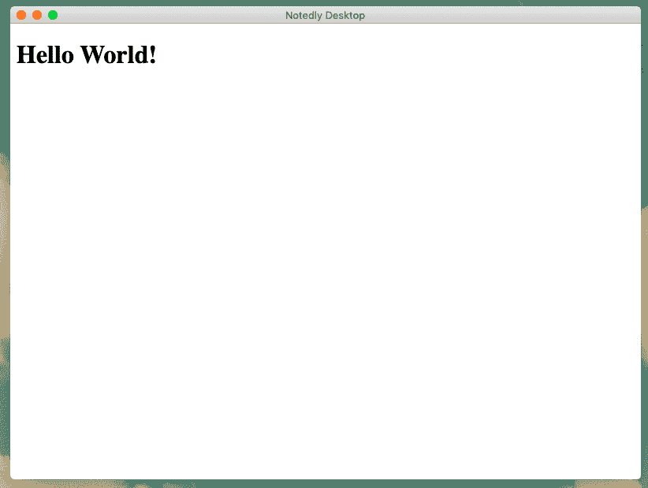
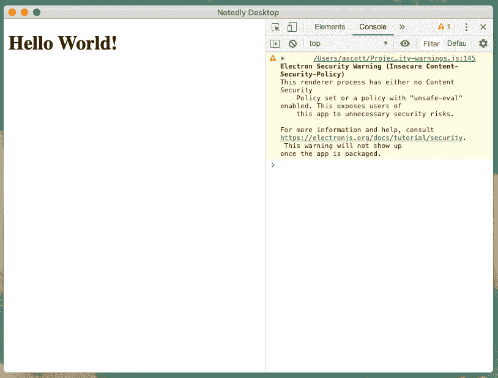

# 第十八章：桌面应用程序与 Electron

我对个人计算机的初次接触是在一个装满 Apple II 机器的学校实验室里。每周一次，我和我的同学们被引导进入这个房间，拿到一些软盘，并被给予一系列大致的加载应用程序（通常是*Oregon Trail*）的指导。我对这些会话的记忆不多，只记得感觉完全*被锁定*在我现在能够控制的小世界里。自 1980 年代中期以来，个人计算机已经发展了很长一段路程，但我们仍然依赖桌面应用程序来执行许多任务。

在一个典型的工作日中，我可能会访问电子邮件客户端、文本编辑器、聊天客户端、电子表格软件、音乐流媒体服务等多个桌面应用程序。通常，这些应用程序都有对应的 Web 应用程序，但桌面应用程序的便利性和集成性可以为用户体验提供几个好处。然而，多年来创建这些应用程序的能力一直觉得遥不可及。幸运的是，今天我们能够利用 Web 技术来构建具有小学习曲线的全功能桌面应用程序。

# 我们要构建什么

在接下来的几章中，我们将为我们的社交笔记应用程序 Notedly 构建一个桌面客户端。我们的目标是使用 JavaScript 和 Web 技术开发一个用户可以下载并安装到他们的计算机上的桌面应用程序。目前，这个应用程序将是一个简单的实现，它将我们的 Web 应用程序包装在一个桌面应用程序外壳中。以这种方式开发我们的应用程序将使我们能够快速为感兴趣的用户发布一个桌面应用程序，同时为我们提供灵活性，在以后可以为桌面用户引入定制应用程序。

# 我们将如何构建这个应用程序

要构建我们的应用程序，我们将使用[Electron](https://electronjs.org)，这是一个使用 Web 技术构建跨平台桌面应用程序的开源框架。它通过利用 Node.js 和 Chrome 的底层浏览器引擎 Chromium 工作。这意味着作为开发人员，我们可以访问浏览器、Node.js 和操作系统特定的功能，这些功能通常在 Web 环境中不可用。Electron 最初由 GitHub 为[Atom 文本编辑器](https://atom.io)开发，但后来被用作包括 Slack、VS Code、Discord 和 WordPress 桌面在内的各种大小应用程序的平台。

# 入门指南

在我们开始开发之前，我们需要将项目的起始文件复制到我们的计算机上。[项目的源代码](https://github.com/javascripteverywhere/desktop)包含了我们开发应用程序所需的所有脚本和第三方库的引用。要将代码克隆到我们的本地计算机上，请打开终端，导航到您保存项目的目录，并**`git clone`**项目存储库。如果您已经完成了 API 和 Web 章节，您可能也已经创建了一个*notedly*目录来保持项目代码的组织。

```
$ cd Projects
$ # type the `mkdir notedly` command if you don't yet have a notedly directory
$ cd notedly
$ git clone git@github.com:javascripteverywhere/desktop.git
$ cd desktop
$ npm install
```

# 安装第三方依赖项

通过   通过复制书中的启动代码并在目录中运行`npm install`，你可以避免为任何单独的第三方依赖项再次运行`npm install`。

代码结构如下：

/src

这是你在跟随书籍的过程中进行开发的目录。

/solutions

这个目录包含每一章的解决方案。如果你卡住了，可以参考这些解决方案。

/final

这个目录包含最终的工作项目。

在我们创建好项目目录并安装依赖项后，我们已经准备好开始开发。

# 我们的第一个 Electron 应用

在将我们的仓库克隆到机器上后，让我们开发我们的第一个 Electron 应用程序。如果你查看*src*目录，你会看到有几个文件。*index.html* 文件包含基本的 HTML 标记。现在，这个文件将作为 Electron 的“渲染进程”，意味着它将作为我们 Electron 应用程序显示的网页。

```
<!DOCTYPE html>
<html>
  <head>
    <meta charset="UTF-8">
    <title>Notedly Desktop</title>
  </head>
  <body>
    <h1>Hello World!</h1>
  </body>
</html>
```

*index.js* 文件是我们将设置 Electron 应用程序的地方。在我们的应用程序中，这个文件将包含 Electron 所称的“主进程”，它定义了应用程序的外壳。主进程通过在 Electron 中创建一个 `BrowserWindow` 实例来工作，它作为应用程序的外壳。

# index.js 与 main.js

尽管我将文件命名为 *index.js*，以遵循我们其余示例应用程序的模式，但在 Electron 开发中，通常将“主进程”文件命名为 *main.js*。

让我们设置我们的主进程，以显示包含我们的 HTML 页面浏览器窗口。首先，在*src/index.js*中导入 Electron 的 `app` 和 `browserWindow` 功能：

```
const { app, BrowserWindow } = require('electron');
```

现在我们可以定义应用程序的`browserWindow`，并定义应用程序将加载的文件。在*src/index.js*中，添加以下内容：

```
const { app, BrowserWindow } = require('electron');

// to avoid garbage collection, declare the window as a variable
let window;

// specify the details of the browser window
function createWindow() {
  window = new BrowserWindow({
    width: 800,
    height: 600,
    webPreferences: {
      nodeIntegration: true
    }
  });

  // load the HTML file
  window.loadFile('index.html');

  // when the window is closed, reset the window object
  window.on('closed', () => {
    window = null;
  });
}

// when electron is ready, create the application window
app.on('ready', createWindow);
```

设置好这些后，我们可以在本地运行我们的桌面应用程序。在你的终端应用中，从项目的目录运行以下命令：

```
$ npm start
```

这个命令将运行`electron src/index.js`，启动我们应用程序的开发环境版本（见图 18-1）。



###### 图 18-1。运行启动命令将启动我们的“Hello World” Electron 应用程序。

# macOS 应用程序窗口详情

macOS 处理应用程序窗口的方式与 Windows 不同。当用户点击“关闭窗口”按钮时，应用程序窗口会关闭，但应用程序本身不会退出。点击 macOS dock 中的应用程序图标将重新打开应用程序窗口。Electron 允许我们实现这一功能。将以下内容添加到*src/index.js* 文件的底部：

```
// quit when all windows are closed.
app.on('window-all-closed', () => {
  // On macOS only quit when a user explicitly quits the application
  if (process.platform !== 'darwin') {
    app.quit();
  }
});

app.on('activate', () => {
  // on macOS, re-create the window when the icon is clicked in the dock
  if (window === null) {
    createWindow();
  }
});
```

添加这些内容后，你可以通过退出应用程序并使用`npm start`命令重新运行它来查看这些更改。现在，如果用户在 macOS 上访问我们的应用程序，当关闭窗口时，他们将看到预期的行为。

# 开发者工具

由于 Electron 基于 Chromium 浏览器引擎（Chrome、Microsoft Edge、Opera 和 [许多其他浏览器](https://oreil.ly/iz_GY) 的引擎），它还使我们能够访问 Chromium 的开发者工具。这使我们能够在浏览器环境中进行与 JavaScript 调试相关的所有操作。让我们检查一下我们的应用程序是否处于开发模式，如果是的话，自动在应用程序启动时打开开发工具。

要执行此检查，我们将使用 [`electron-util` 库](https://oreil.ly/JAf2Q)。这是一个小型实用工具集，它将允许我们轻松检查系统条件，并简化常见 Electron 模式的样板代码。目前，我们将使用 `is` 模块，它将允许我们检查我们的应用程序是否处于开发模式。

在我们的 *src/index.js* 文件的顶部，导入模块：

```
const { is } = require('electron-util');
```

现在，在我们的应用程序代码中，我们可以在加载 HTML 文件的地方添加以下内容，在开发环境中（图 18-2）应用程序启动时打开开发工具：

```
// if in development mode, open the browser dev tools
if (is.development) {
  window.webContents.openDevTools();
}
```



###### 图 18-2\. 现在，当我们在开发过程中打开我们的应用程序时，浏览器开发工具将自动打开

# Electron 安全警告

你可能会注意到，我们的 Electron 应用当前显示了与不安全的内容安全策略（CSP）相关的安全警告。我们将在下一章节解决这个问题。

通过方便使用浏览器开发工具，我们已经做好了开发客户端应用程序的准备。

# Electron API

桌面开发的一个优势是，通过 Electron API，我们可以访问操作系统级别的功能，这些功能在 Web 浏览器环境中是无法获取的，包括：

+   通知

+   原生文件拖放

+   macOS 暗模式

+   自定义菜单

+   强大的键盘快捷键

+   系统对话框

+   应用程序托盘

+   系统信息

正如你可以想象的那样，这些选项允许我们为桌面客户端添加一些独特的功能和改进的用户体验。在我们的简单示例应用程序中，我们不会使用这些功能，但值得熟悉。[Electron 的文档](https://electronjs.org/docs) 提供了 Electron API 的详细示例。此外，Electron 团队还创建了 [`electron-api-demos`](https://oreil.ly/Xo7NM)，一个完整的 Electron 应用程序，展示了 Electron API 的许多独特功能。

# 结论

在本章中，我们已经探讨了使用 Electron 构建基于 Web 技术的桌面应用程序的基础知识。作为开发者，Electron 环境为我们提供了一个机会，可以为用户提供跨平台的桌面体验，而无需学习多种编程语言和操作系统的复杂性。有了本章中探讨的简单设置和对 Web 开发的了解，我们已经做好了构建强大桌面应用程序的准备。在下一章中，我们将探讨如何将现有的 Web 应用程序集成到 Electron 壳程序中。
