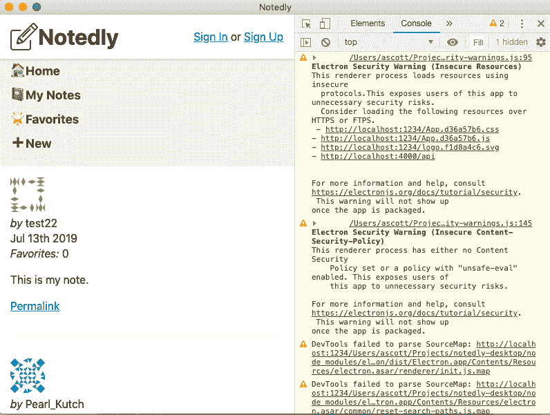
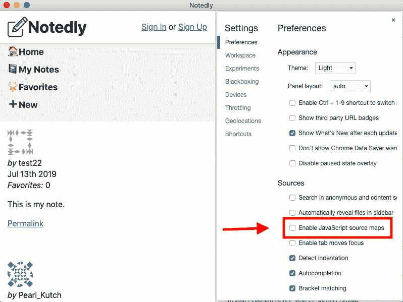
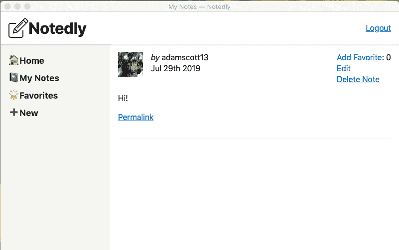

# 第十九章：将现有 Web 应用集成到 Electron 中

我倾向于像孩子在沙滩上收集贝壳一样收集网络浏览器标签。我并不一定打算收集它们，但到了一天结束时，我在几个浏览器窗口中打开了几十个标签。我对此并不感到自豪，但我怀疑我并不孤单。因此，我使用一些我最常用的网络应用程序的桌面版本。通常，这些应用程序在 Web 上没有任何优势，但独立应用程序的便利性使它们易于访问、查找和全天切换。

在本章中，我们将看看如何将现有的 Web 应用程序封装到 Electron 外壳中。在继续之前，您需要本地存储我们示例 API 和 Web 应用程序的副本。如果您没有从头到尾跟随整本书的话，请访问附录 A 和 B 运行这些内容。

# 集成我们的 Web 应用程序

在上一章中，我们设置了我们的 Electron 应用程序加载一个 *index.html* 文件。或者，我们可以加载一个特定的 URL。在我们的情况下，我们将首先加载本地运行的 Web 应用程序的 URL。首先确保您的 Web 应用程序和 API 在本地运行。然后我们可以更新我们的 *src/index.js* 文件，首先将 `BrowserWindow` 中的 `nodeIntegration` 设置为 `false`。这将避免本地运行的 Node 应用程序访问外部站点时的安全风险。

```
webPreferences: {
  nodeIntegration: false
},
```

现在，请将 `window.loadFile('index.html');` 行替换为以下内容：

```
window.loadURL('http://localhost:1234');
```

# 运行 Web 应用程序

您的 Web 应用程序的本地实例需要在 `1234` 端口上运行。如果您一直在跟随本书，从您的 Web 应用程序目录的根目录运行 **`npm start`** 启动开发服务器。

这将指示 Electron 加载一个 URL，而不是一个文件。现在，如果您使用 `npm start` 运行应用程序，您会看到它在 Electron 窗口中加载，但有一些注意事项。

## 警告和错误

Electron 浏览器开发工具和我们的终端当前显示了大量的警告和错误。让我们逐个查看这些问题（参见 图 19-1）。



###### 图 19-1\. 我们的应用程序正在运行，但显示了大量错误和警告

首先，我们的终端显示了大量的 `SyntaxError: Unexpected Token` 错误。此外，我们的开发工具显示了几个相应的警告，说明 `DevTools 无法解析 SourceMap`。这两个错误与 Parcel 生成源映射的方式以及 Electron 读取它们的方式有关。不幸的是，考虑到我们使用的技术组合，似乎没有合理的修复此问题的方法。我们的最佳选择是禁用 JavaScript 源映射。在应用程序窗口的开发工具中，单击“设置”，然后取消选中“启用 JavaScript 源映射”（参见 图 19-2）。



###### 图 19-2\. 禁用源映射将减少错误和警告的数量

现在，如果您退出并重新启动应用程序，您将不再看到与源映射相关的问题。这样做的一个弊端是，在 Electron 中调试我们的客户端 JavaScript 可能会更加困难，但幸运的是，我们仍然可以在 web 浏览器中访问此功能和我们的应用程序。

最后两个警告与 Electron 的安全性有关。在将应用程序捆绑到生产环境之前，我们将解决这些问题，但现在探索一下这些警告是值得的。

`Electron 安全警告（不安全资源）`

此警告通知我们，我们正在通过 *http* 连接加载 web 资源。在生产环境中，我们应始终通过 *https* 加载资源以确保隐私和安全性。在开发过程中，通过 *http* 加载本地主机不是问题，因为我们将引用捆绑应用程序中使用 *https* 的托管网站。

`Electron 安全警告（不安全内容安全策略）`

此警告告诉我们，我们尚未设置内容安全策略（CSP）。CSP 允许我们指定允许我们的应用程序从哪些域加载资源，极大地减少了跨站脚本（XSS）攻击的风险。在本地开发期间，这并不是一个问题，但在生产环境中很重要。我们将在本章后面实施 CSP。

处理完错误后，我们准备设置应用程序的配置文件。

# 配置

在本地开发时，我们希望能够运行我们的 Web 应用程序的本地版本，但在捆绑应用程序以供他人使用时，我们希望它引用公开可用的 URL。我们可以设置一个简单的配置文件来处理这个问题。

在我们的 *./src* 目录中，我们将添加一个 *config.js* 文件，其中我们可以存储特定于应用程序的属性。我已经包含了一个 *config.example.js* 文件，您可以轻松从终端复制：

```
cp src/config.example.js src/config.js
```

现在我们可以填写我们应用程序的属性：

```
const config = {
  LOCAL_WEB_URL: 'http://localhost:1234/',
  PRODUCTION_WEB_URL: 'https://YOUR_DEPLOYED_WEB_APP_URL',
  PRODUCTION_API_URL: 'https://YOUR_DEPLOYED_API_URL'
};

module.exports = config;
```

# 为什么不使用 .env？

在我们之前的环境中，我们使用 *.env* 文件来管理特定环境的设置。在这种情况下，我们使用 JavaScript 配置文件，因为 Electron 应用程序打包它们的依赖项的方式。

现在在我们的 Electron 应用程序的主进程中，我们可以使用配置文件来指定在开发和生产中要加载的 URL。在 *src/index.js* 中，首先导入 *config.js* 文件：

```
const config = require('./config');
```

现在，我们可以更新 `loadURL` 功能以在每个环境中加载不同的 URL：

```
// load the URL
 if (is.development) {
   window.loadURL(config.LOCAL_WEB_URL);
 } else {
   window.loadURL(config.PRODUCTION_WEB_URL);
 }
```

通过使用配置文件，我们可以轻松地为 Electron 提供特定环境的设置。

# 内容安全策略

如本章前面所述，CSP 允许我们限制应用程序有权限加载资源的域。这有助于限制潜在的 XSS 和数据注入攻击。在 Electron 中，我们可以指定我们的 CSP 设置以提高应用程序的安全性。要了解有关 Electron 和 Web 应用程序的 CSP 的更多信息，我建议阅读有关主题的 [MDN 文章](https://oreil.ly/VZS1H)。

Electron 提供了一个内置的 CSP API，但 `electron-util` 库提供了更简单和更清晰的语法。在我们的 *src/index.js* 文件顶部更新 `electron-util` 导入语句以包含 `setContentSecurityPolicy`：

```
const { is, setContentSecurityPolicy } = require('electron-util');
```

现在我们可以为应用程序的生产版本设置我们的 CSP：

```
// set the CSP in production mode
 if (!is.development) {
   setContentSecurityPolicy(`
 default-src 'none';
 script-src 'self';
 img-src 'self' https://www.gravatar.com;
 style-src 'self' 'unsafe-inline';
 font-src 'self';
 connect-src 'self' ${config.PRODUCTION_API_URL};
 base-uri 'none';
 form-action 'none';
 frame-ancestors 'none';
 `);
 }
```

使用我们编写的 CSP，我们可以使用 [CSP 评估器](https://oreil.ly/1xNK1) 工具检查错误。如果我们有意访问其他 URL 的资源，我们可以将它们添加到我们的 CSP 规则集中。

我们最终的 *src/index.js* 文件将如下所示：

```
const { app, BrowserWindow } = require('electron');
const { is, setContentSecurityPolicy } = require('electron-util');
const config = require('./config');

// to avoid garbage collection, declare the window as a variable
let window;

// specify the details of the browser window
function createWindow() {
  window = new BrowserWindow({
    width: 800,
    height: 600,
    webPreferences: {
      nodeIntegration: false
    }
  });

  // load the URL
  if (is.development) {
    window.loadURL(config.LOCAL_WEB_URL);
  } else {
    window.loadURL(config.PRODUCTION_WEB_URL);
  }

  // if in development mode, open the browser dev tools
  if (is.development) {
    window.webContents.openDevTools();
  }

  // set the CSP in production mode
  if (!is.development) {
    setContentSecurityPolicy(`
 default-src 'none';
 script-src 'self';
 img-src 'self' https://www.gravatar.com;
 style-src 'self' 'unsafe-inline';
 font-src 'self';
 connect-src 'self' ${config.PRODUCTION_API_URL};
 base-uri 'none';
 form-action 'none';
 frame-ancestors 'none';
 `);
  }

  // when the window is closed, dereference the window object
  window.on('closed', () => {
    window = null;
  });
}

// when electron is ready, create the application window
app.on('ready', createWindow);

// quit when all windows are closed.
app.on('window-all-closed', () => {
  // On macOS only quit when a user explicitly quits the application
  if (process.platform !== 'darwin') {
    app.quit();
  }
});

app.on('activate', () => {
  // on macOS, re-create the window when the icon is clicked in the dock
  if (window === null) {
    createWindow();
  }
});
```

通过这种方式，我们已经在 Electron 外壳中实现了我们的 Web 应用程序的工作实现（如 图 19-3 所示）。



###### 图 19-3\. 我们的 Web 应用程序在 Electron 应用程序外壳中运行

# 结论

在本章中，我们将现有的 Web 应用程序集成到 Electron 桌面应用程序中，这使我们能够快速将桌面应用程序推向市场。值得注意的是，这种方法存在一些权衡之处，因为它提供了有限的桌面特定优势，并且需要互联网连接才能访问应用程序的全部功能。对于那些希望尽快推向市场的人来说，这些缺点可能是值得的。在下一章中，我们将看看如何构建和分发 Electron 应用程序。
