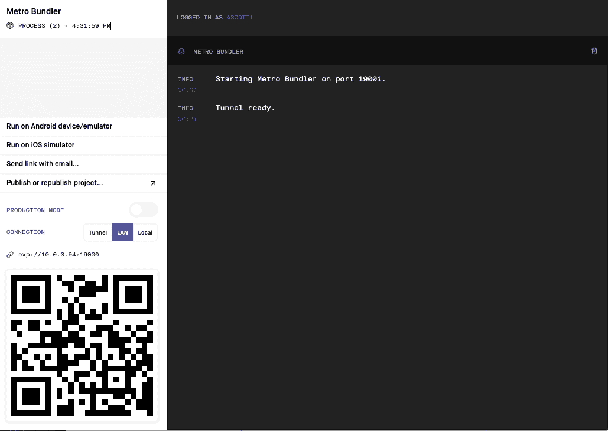
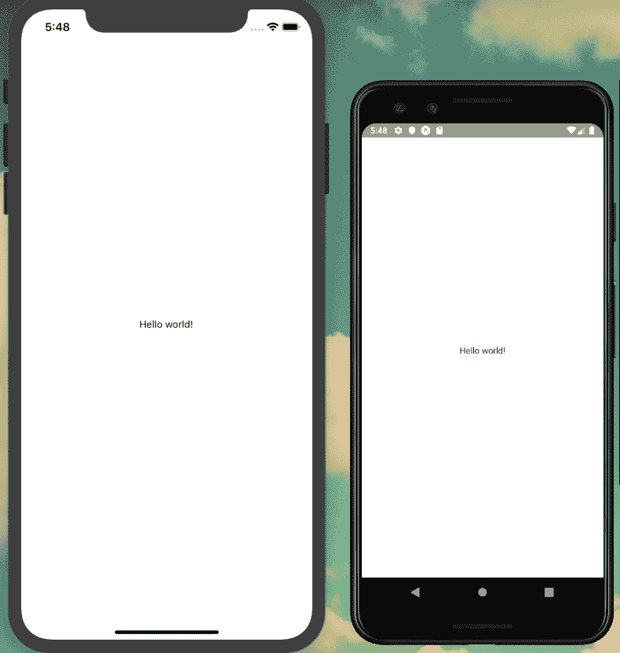
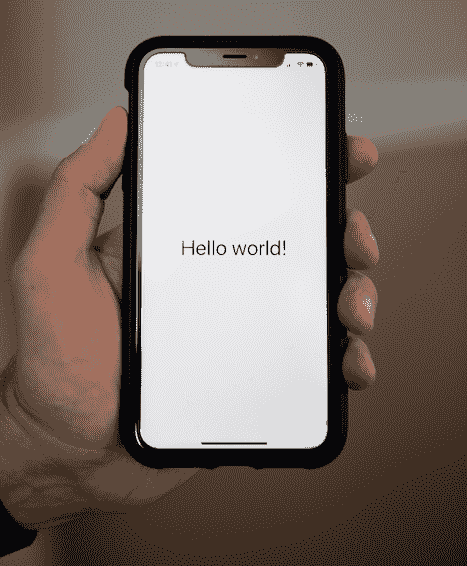

# 第二十一章：使用 React Native 的移动应用程序

上个世纪 80 年代末的一天，我和父母一起购物时发现了一台小型便携电视机。这是一种电池供电的方形盒子，配有天线、小扬声器和一个小黑白屏幕。我被能够在后院看星期六早晨卡通的可能性震撼了。虽然我永远不会拥有这样一种设备，但仅仅知道这种设备的存在让我感觉就像生活在一个科幻未来的世界中。小小的我没有意识到，作为一个成年人，我会随身携带一部设备，它不仅能让我观看《宇宙大师》，还能够访问无限的信息、听音乐、玩游戏、记笔记、拍照、召唤汽车、购物、查看天气，并完成无限其他任务。

2007 年，史蒂夫·乔布斯推出了 iPhone，并说：“有时会出现一种革命性产品，改变一切。”的确，在 2007 年之前就已经存在智能手机，但要说他们是真正智能的，必须是从 iPhone（及随后的 Android 的崛起）开始的。在随后的几年里，智能手机应用程序从最初的“任何事情都可以”淘金热阶段发展到用户要求质量和对其有高度期望的地步。今天的应用程序具有高功能性、互动性和设计标准。为了增加挑战，现代移动应用开发分散在 Apple iOS 和 Android 平台上，每个平台使用不同的编程语言和工具链。

你可能已经猜到（书名中有提到），JavaScript 使我们作为开发人员能够编写跨平台移动应用程序。在本章中，我将介绍启用这一点的库 React Native，以及 Expo 工具链。我们还将克隆样例项目代码，我们将在接下来的几章中对此进行开发。

# 我们正在建设什么

在接下来的几章中，我们将为我们的社交笔记应用程序 Notedly 构建一个移动客户端。目标是使用 JavaScript 和网络技术开发一个用户可以安装到其移动设备上的应用程序。我们将实施一部分功能，以避免在 web 应用程序章节中太多重复。具体来说，我们的应用程序将：

+   在 iOS 和 Android 操作系统上工作

+   从   从我们的 GraphQL API 加载笔记提要和用户个别笔记

+   使用 CSS 和样式组件进行样式设置

+   执行标准和动态路由

这些功能将为开发具有 React Native 的移动应用程序的核心概念提供一个坚实的概述。在我们开始之前，让我们仔细看看我们将使用的技术。

# 我们将如何构建这个

React Native 是我们将用来开发应用程序的核心技术。React Native 允许我们使用 React 在 JavaScript 中编写应用程序，并为原生移动平台渲染它们。这意味着对用户来说，React Native 应用程序与使用平台编程语言编写的应用程序没有明显的区别。这是 React Native 相对于传统上在应用程序外壳中包装 Web 视图的其他流行基于 Web 技术的移动框架的关键优势。Facebook、Instagram、Bloomberg、Tesla、Skype、Walmart、Pinterest 等公司已经使用 React Native 开发应用程序。

我们应用程序开发工作流程的第二个关键部分是 Expo，它是一组通过非常有用的功能简化 React Native 开发的工具和服务，如设备预览、应用程序构建以及扩展核心 React Native 库。在开始我们的开发之前，我建议您执行以下操作：

1.  访问[*expo.io*](https://expo.io)并创建 Expo 账户。

1.  通过在终端应用程序中输入**`npm install expo-cli`** **`--global`**来安装 Expo 命令行工具。

1.  通过在终端应用程序中键入**`expo login`**来本地登录到您的 Expo 账户。

1.  为您的移动设备安装 Expo Client 应用程序。Expo Client iOS 和 Android 应用程序的链接可以在[*expo.io/tools*](https://expo.io/tools)找到。

1.  在 Expo Client 应用程序中登录您的账户。

最后，我们将再次使用[Apollo Client](https://oreil.ly/xR62T)来与我们的 GraphQL API 的数据进行交互。Apollo Client 是一组用于处理 GraphQL 的开源工具。

# 入门

在我们开始开发之前，您需要将项目起始文件复制到您的计算机上。项目的[source code](https://github.com/javascripteverywhere/mobile)包含我们开发应用所需的所有脚本和第三方库的引用。要将代码克隆到本地计算机，请打开终端，导航到您保存项目的目录，并**`git clone`**项目存储库。如果您已经完成了 API、Web 和/或桌面章节，可能已经创建了一个*notedly*目录来组织项目代码：

```
$ cd Projects
$ # type the `mkdir notedly` command if you don't yet have a notedly directory
$ cd notedly
$ git clone git@github.com:javascripteverywhere/mobile.git
$ cd mobile
$ npm install
```

# 安装第三方依赖

通过复制书籍起始代码并在目录中运行`npm install`，您可以避免为任何单独的第三方依赖再次运行`npm install`。

代码结构如下：

/src

这是您在跟着本书学习时应进行开发的目录。

/solutions

此目录包含每章的解决方案。如果遇到困难，您可以查阅这些内容。

/final

此目录包含最终的工作项目。

其余文件和项目设置与 `expo-cli` React Native 生成器的标准输出匹配，您可以在终端中键入 **`expo init`** 来运行它。

# App.js？

由于 Expo 构建链的工作方式，项目目录根目录中的 *App.js* 文件通常是应用程序的入口点。为了使我们的移动项目与本书中的其余代码标准化，*App.js* 文件仅用作对 */src/Main.js* 文件的引用。

现在我们在本地机器上有了代码并安装了依赖项，让我们运行应用程序。要启动应用程序，在您的终端应用程序中输入以下内容：

```
$ npm start
```

这将在我们的浏览器中打开 Expo 的“Metro Bundler” Web 应用程序的本地端口。从这里，您可以通过单击“Run on…”链接在本地设备模拟器上启动应用程序。您还可以通过扫描 QR 码在任何物理设备上使用 Expo 客户端启动应用程序（参见 图 21-1）。



###### 图 21-1\. 启动应用程序后的 Expo Metro Bundler

# 安装设备模拟器

要运行 iOS 设备模拟器，您需要下载并安装 [Xcode](https://oreil.ly/bgde4)（仅限 macOS）。对于 Android，请下载 [Android Studio](https://oreil.ly/bjqkn) 并按照 [Expo 的指南](https://oreil.ly/cUGsr) 设置设备模拟器（参见 图 21-2 进行比较）。不过，如果您刚开始进行移动应用程序开发，我建议从您自己的物理设备开始。



###### 图 21-2\. 我们的应用程序在 iOS 和 Android 设备模拟器上并行运行

如果您已在计算机的终端应用程序中以及在移动设备上的 Expo 客户端应用程序中登录 Expo，您只需打开 Expo 客户端应用程序并点击项目选项卡即可打开应用程序（参见 图 21-3）。



###### 图 21-3\. 使用 Expo 客户端，我们可以在物理设备上预览我们的应用程序。

当代码克隆到您的本地计算机并能够使用 Expo 客户端预览应用程序时，您已经具备了开发移动应用程序所需的一切条件。

# 结论

本章介绍了 React Native 和 Expo。我们克隆了示例项目代码，在本地运行并在物理设备或模拟器上预览了它。React Native 使 Web 和 JavaScript 开发人员能够使用他们熟悉的技能和工具构建功能齐全的原生移动应用程序。Expo 简化了工具链，并降低了原生移动开发的门槛。有了这两个工具，新手可以轻松开始移动开发，而擅长 Web 的团队可以快速引入移动应用开发技能集。在下一章中，我们将更详细地了解 React Native 的功能，并向我们的应用程序介绍路由和样式。
