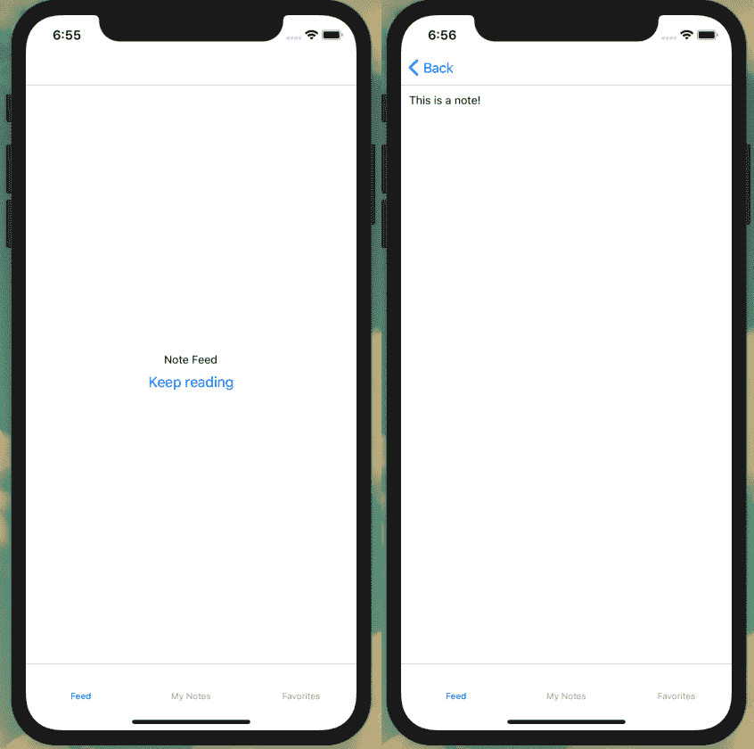

# 第二十二章：移动应用程序外壳

我的妻子是一名摄影师，这意味着她的生活大部分时间都是围绕在一个矩形框架内构图。在摄影中，有许多变量——主题、光线、角度——但图像的比例保持一致。在这种限制下，不可思议的事情发生了，塑造了我们看待和记住周围世界的方式。移动应用程序开发提供了类似的机会。在一个小矩形屏幕的限制内，我们可以构建具有沉浸式用户体验的极其强大的应用程序。

在这一章中，我们将开始为我们的应用程序建立一个外壳。为了做到这一点，我们首先将更详细地查看 React Native 组件的一些关键构建模块。从那里，我们将看看如何应用样式到我们的应用程序中，既可以使用 React Native 内置的样式支持，也可以选择我们的 CSS-in-JS 库 Styled Components。一旦我们讨论了如何应用样式，我们将看看如何将路由集成到我们的应用程序中。最后，我们将探讨如何通过图标轻松增强我们的应用界面。

# React Native 构建模块

让我们从查看 React Native 应用程序的基本构建模块开始。您可能已经猜到，React Native 应用程序由 JSX 编写的 React 组件组成。但是在没有 HTML 页面的 DOM（文档对象模型）的情况下，究竟是什么放在这些组件内？我们可以从查看“Hello World”组件开始，它位于*src/Main.js*。暂时，我已经删除了样式：

```
import React from 'react';
import { Text, View } from 'react-native';

const Main = () => {
  return (
    <View>
      <Text>Hello world!</Text>
    </View>
  );
};

export default Main;
```

在这个标记中，有两个显著的 JSX 标签：<View>和<Text>。如果您来自 Web 背景，<View>标签的作用与<div>标签大致相同。它是我们应用程序内容的容器。单独使用时它们不做什么，但它们包含了我们应用的所有内容，可以相互嵌套，并用于应用样式。每个组件都将包含在<View>内。在 React Native 中，您可以在 Web 上可能使用<div>或<span>标签的任何地方使用<View>。不过，<Text>标签不出所料，用于包含我们应用中的任何文本。然而，与 Web 不同的是，这个单一标签用于所有文本。

正如您所想象的那样，我们也可以通过使用`<Image>` JSX 元素向我们的应用程序添加图像。让我们更新我们的*src/Main.js*文件以包含一个图像。为此，我们从 React Native 导入`Image`组件，并使用带有`src`属性的`<Image>`标签（参见图 22-1）：

```
import React from 'react';
import { Text, View, Image } from 'react-native';

const Main = () => {
  return (
    <View style={{ flex: 1, justifyContent: 'center', alignItems: 'center' }}>
      <Text>Hello world!</Text>
      <Image source={require('../assets/images/hello-world.jpg')} />
    </View>
  );
};

export default Main;
```

上述代码在一个视图中呈现了一些文本和图像。您可能注意到我们的`<View>`和`<Image>` JSX 标签传递了一些属性，这些属性允许我们控制特定的行为（在本例中是视图的样式和图像的来源）。向元素传递属性允许我们使用各种附加功能扩展元素。React Native 的[API 文档](https://oreil.ly/3fACI)列出了每个元素可用的属性。


###### 图 22-1\. 使用 `<Image>` 标签，我们可以向我们的应用程序添加图像（照片由 [Windell Oskay](https://oreil.ly/lkW3F) 拍摄）

我们的应用程序目前还没有太多功能，但在下一节中，我们将探讨如何利用 React Native 内置的样式支持和 Styled Components 来改善外观和用户体验。

# 样式和 Styled Components

作为应用程序开发者和设计师，我们希望能够为我们的应用程序设计出精确的外观、感觉和用户体验。有许多 UI 组件库，例如 [NativeBase](https://nativebase.io) 或 [React Native Elements](https://oreil.ly/-M8EE)，它们提供了广泛的预定义和通常可定制的组件。这些都值得一试，但为了我们的目的，让我们探讨一下如何组合我们自己的样式和应用程序布局。

正如我们已经看到的，React Native 提供了 `style` 属性，允许我们将自定义样式应用于应用程序中的任何 JSX 元素。样式名称和值与 CSS 中的相同，只是名称采用驼峰命名，如 `lineHeight` 和 `backgroundColor`。让我们更新我们的 */src/Main.js* 文件，为 `<Text>` 元素添加一些样式（见 图 22-2）：

```
const Main = () => {
  return (
    <View style={{ flex: 1, justifyContent: 'center', alignItems: 'center' }}>
      <Text style={{ color: '#0077cc', fontSize: 48, fontWeight: 'bold' }}>
        Hello world!
      </Text>
      <Image source={require('../assets/images/hello-world.jpg')} />
    </View>
  );
};
```


###### 图 22-2\. 使用样式我们可以调整 `<Text>` 元素的外观

你可能会想，正确地认为，在元素级别应用样式很快会变得难以维护。我们可以使用 React Native 的 `StyleSheet` 库来帮助组织和重用我们的样式。

首先，我们需要在导入列表中添加 `StyleSheet`（见 图 22-3）：

```
import { Text, View, Image, StyleSheet } from 'react-native';
```

现在我们可以抽象化我们的样式：

```
const Main = () => {
  return (
    <View style={styles.container}>
      <Text style={styles.h1}>Hello world!</Text>
      <Text style={styles.paragraph}>This is my app</Text>
      <Image source={require('../assets/images/hello-world.jpg')} />
    </View>
  );
};

const styles = StyleSheet.create({
  container: {
    flex: 1,
    justifyContent: 'center'
  },
  h1: {
    fontSize: 48,
    fontWeight: 'bold'
  },
  paragraph: {
    marginTop: 24,
    marginBottom: 24,
    fontSize: 18
  }
});
```

# Flexbox

React Native 使用 CSS flexbox 算法来定义布局样式。我们不会深入讲解 flexbox，但 React Native [提供了文档](https://oreil.ly/owhZK)，清晰地解释了 flexbox 及其在屏幕上排列元素时的用途。


###### 图 22-3\. 通过使用样式表，我们可以扩展应用程序的样式

## Styled Components

虽然 React Native 内置的 `style` 属性和 `StyleSheet` 可能已经提供了我们所需的一切，但它们远非我们在为应用程序添加样式时的唯一选择。我们还可以利用流行的 web CSS-in-JS 解决方案，例如 [Styled Components](https://www.styled-components.com) 和 [Emotion](https://emotion.sh)。我认为，这些解决方案具有更清晰的语法，更接近 CSS，并且减少了在 web 和移动应用程序代码库之间切换上下文所需的次数。使用这些支持 web 的 CSS-in-JS 库还可以创建在不同平台间共享样式或组件的机会。

就我们的目的而言，让我们看看如何将先前的示例适应使用 Styled Components 库。首先，在 *src/Main.js* 中，我们将导入该库的 `native` 版本：

```
import styled from 'styled-components/native'
```

从这里，我们可以将我们的样式迁移到 Styled Components 语法。如果您在 第十三章 中跟随了进度，这种语法应该看起来非常熟悉。我们的 *src/Main.js* 文件的最终代码如下：

```
import React from 'react';
import { Text, View, Image } from 'react-native';
import styled from 'styled-components/native';

const StyledView = styled.View`
 flex: 1;
 justify-content: center;
`;

const H1 = styled.Text`
 font-size: 48px;
 font-weight: bold;
`;

const P = styled.Text`
 margin: 24px 0;
 font-size: 18px;
`;

const Main = () => {
  return (
    <StyledView>
      <H1>Hello world!</H1>
      <P>This is my app.</P>
      <Image source={require('../assets/images/hello-world.jpg')} />
    </StyledView>
  );
};

export default Main;
```

# Styled Components 大小写

在 Styled Components 库中，元素名称必须始终大写。

现在我们能够为我们的应用程序应用自定义样式，可以选择使用 React Native 的内置样式系统或 Styled Components 库。

# 路由

在 Web 上，我们可以使用 HTML 锚链接来链接到任何其他 HTML 文档，包括我们自己站点上的文档。对于 JavaScript 驱动的应用程序，我们使用路由来链接 JavaScript 渲染的模板。那么对于原生移动应用程序呢？对于这些应用程序，我们将用户路由到不同的屏幕。在本节中，我们将探讨两种常见的路由类型：基于选项卡的导航和堆栈导航。

## 使用 React Navigation 进行选项卡式导航

为了执行我们的路由，我们将使用 [React Navigation 库](https://reactnavigation.org)，这是 React Native 和 Expo 团队推荐的路由解决方案。最重要的是，它非常简单地实现了常见的路由模式，具有特定于平台的外观和感觉。

要开始，请首先在我们的 *src* 目录中创建一个名为 *screens* 的新目录。在 *screens* 目录中，让我们创建三个包含非常基本的 React 组件的新文件。

在 *src/screens/favorites.js* 中添加以下内容：

```
import React from 'react';
import { Text, View } from 'react-native';

const Favorites = () => {
  return (
    <View style={{ flex: 1, justifyContent: 'center', alignItems: 'center' }}>
      <Text>Favorites</Text>
    </View>
  );
};

export default Favorites;
```

在 *src/screens/feed.js* 中添加这个：

```
import React from 'react';
import { Text, View } from 'react-native';

const Feed = () => {
  return (
    <View style={{ flex: 1, justifyContent: 'center', alignItems: 'center' }}>
      <Text>Feed</Text>
    </View>
  );
};

export default Feed;
```

最后，在 *src/screens/mynotes.js* 中添加这个：

```
import React from 'react';
import { Text, View } from 'react-native';

const MyNotes = () => {
  return (
    <View style={{ flex: 1, justifyContent: 'center', alignItems: 'center' }}>
      <Text>My Notes</Text>
    </View>
  );
};

export default MyNotes;
```

然后，我们可以创建一个新文件 *src/screens/index.js* 用作我们应用程序路由的根。我们将从导入我们的初始 `react` 和 `react-navigation` 依赖项开始：

```
import React from 'react';
import { createAppContainer } from 'react-navigation';
import { createBottomTabNavigator } from 'react-navigation-tabs';

// import screen components
import Feed from './feed';
import Favorites from './favorites';
import MyNotes from './mynotes';
```

导入这些依赖项后，我们可以使用 React Navigation 的 `createBottomTabNavigator` 来在这三个屏幕之间创建一个选项卡导航器，以定义应该在我们的导航中显示哪些 React 组件屏幕：

```
const TabNavigator = createBottomTabNavigator({
  FeedScreen: {
    screen: Feed,
    navigationOptions: {
      tabBarLabel: 'Feed',
    }
  },
  MyNoteScreen: {
    screen: MyNotes,
    navigationOptions: {
      tabBarLabel: 'My Notes',
    }
  },
  FavoriteScreen: {
    screen: Favorites,
    navigationOptions: {
      tabBarLabel: 'Favorites',
    }
  }
});

// create the app container
export default createAppContainer(TabNavigator);
```

最后，让我们更新我们的 *src/Main.js* 文件，只需导入我们的路由器。现在，它应该简化为以下内容：

```
import React from 'react';
import Screens from './screens';

const Main = () => {
  return <Screens />;
};

export default Main;
```

确保您的应用程序正在运行，输入 **`npm start`** 命令在您的终端中。现在，您应该在屏幕底部看到选项卡导航，点击选项卡将会将您路由到相应的屏幕（图 22-4）。


###### 图 22-4\. 现在我们可以通过选项卡导航在屏幕之间进行导航

## 堆栈导航

第二种路由类型是堆栈导航，其中屏幕在概念上被“堆叠”在一起，允许用户向堆栈中更深入和向后导航。考虑一个新闻应用程序，用户查看文章列表。用户可以点击新闻文章标题，深入堆栈到文章内容。然后他们可以点击返回按钮，导航回文章列表，或者可能是不同的文章标题，继续向堆栈深入。

在我们的应用程序中，我们希望用户能够从笔记的列表导航到笔记本身，然后再返回。让我们看看如何为每个屏幕实现堆栈导航。

首先，让我们创建一个新的`NoteScreen`组件，该组件将包含我们堆栈中的第二个屏幕。在*src/screens/note.js*路径下创建一个新的文件，包含一个最简单的 React Native 组件：

```
import React from 'react';
import { Text, View } from 'react-native';

const NoteScreen = () => {
  return (
    <View style={{ padding: 10 }}>
      <Text>This is a note!</Text>
    </View>
  );
};

export default NoteScreen;
```

接下来，我们将对我们的路由进行更改，以使`NoteScreen`组件能够实现堆栈导航。为此，我们将从`react-navigation-stack`中导入`createStackNavigator`以及我们的新的*note.js*组件。在*src/screens/index.js*中更新导入如下：

```
import React from 'react';
import { Text, View, ScrollView, Button } from 'react-native';
import { createAppContainer } from 'react-navigation';
import { createBottomTabNavigator } from 'react-navigation-tabs';
// add import for createStackNavigator
import { createStackNavigator } from 'react-navigation-stack';

// import screen components, including note.js
import Feed from './feed';
import Favorites from './favorites';
import MyNotes from './mynotes';
import NoteScreen from './note';
```

有了我们导入的库和文件，我们可以实现堆栈导航的功能。在我们的路由文件中，我们必须告诉 React Navigation 哪些屏幕是“可堆叠的”。对于我们的每个选项卡路由，我们希望用户能够导航到一个`Note`屏幕。继续定义这些堆栈如下：

```
const FeedStack = createStackNavigator({
  Feed: Feed,
  Note: NoteScreen
});

const MyStack = createStackNavigator({
  MyNotes: MyNotes,
  Note: NoteScreen
});

const FavStack = createStackNavigator({
  Favorites: Favorites,
  Note: NoteScreen
});
```

现在，我们可以更新我们的`TabNavigator`以引用堆栈，而不是单个屏幕。为此，请在每个`TabNavigator`对象的`screen`属性中进行更新：

```
const TabNavigator = createBottomTabNavigator({
  FeedScreen: {
    screen: FeedStack,
    navigationOptions: {
      tabBarLabel: 'Feed'
    }
  },
  MyNoteScreen: {
    screen: MyStack,
    navigationOptions: {
      tabBarLabel: 'My Notes'
    }
  },
  FavoriteScreen: {
    screen: FavStack,
    navigationOptions: {
      tabBarLabel: 'Favorites'
    }
  }
});
```

总结一下，我们的*src/screens/index.js*文件应如下所示：

```
import React from 'react';
import { Text, View, ScrollView, Button } from 'react-native';
import { createAppContainer } from 'react-navigation';
import { createBottomTabNavigator } from 'react-navigation-tabs';
import { createStackNavigator } from 'react-navigation-stack';

// import screen components
import Feed from './feed';
import Favorites from './favorites';
import MyNotes from './mynotes';
import NoteScreen from './note';

// navigation stack
const FeedStack = createStackNavigator({
  Feed: Feed,
  Note: NoteScreen
});

const MyStack = createStackNavigator({
  MyNotes: MyNotes,
  Note: NoteScreen
});

const FavStack = createStackNavigator({
  Favorites: Favorites,
  Note: NoteScreen
});

// navigation tabs
const TabNavigator = createBottomTabNavigator({
  FeedScreen: {
    screen: FeedStack,
    navigationOptions: {
      tabBarLabel: 'Feed'
    }
  },
  MyNoteScreen: {
    screen: MyStack,
    navigationOptions: {
      tabBarLabel: 'My Notes'
    }
  },
  FavoriteScreen: {
    screen: FavStack,
    navigationOptions: {
      tabBarLabel: 'Favorites'
    }
  }
});

// create the app container
export default createAppContainer(TabNavigator);
```

如果我们在模拟器或设备上的 Expo 应用中打开我们的应用程序，我们应该看不到明显的区别。这是因为我们尚未添加到我们堆栈导航的链接。让我们更新我们的*src/screens/feed.js*组件以包含堆栈导航链接。

为此，首先从 React Native 中包含`Button`依赖项：

```
import { Text, View, Button } from 'react-native';
```

现在，我们可以包含一个按钮，当按下时，将导航到我们的*note.js*组件的内容。我们将传递组件的`props`，其中包含导航信息，并添加一个`<Button>`，包括`title`和`onPress`属性：

```
const Feed = props => {
  return (
    <View style={{ flex: 1, justifyContent: 'center', alignItems: 'center' }}>
      <Text>Note Feed</Text>
      <Button
        title="Keep reading"
        onPress={() => props.navigation.navigate('Note')}
      />
    </View>
  );
};
```

有了这个，我们应该能够在我们的屏幕之间导航。从 Feed 屏幕点击按钮导航到 Note 屏幕，并点击箭头返回（图 22-5）。



###### 图 22-5。点击按钮链接将导航到新的屏幕，而点击箭头将返回用户到前一个屏幕

## 添加屏幕标题

添加堆栈导航器会自动在应用程序顶部添加一个标题栏。我们可以为该顶部栏设置样式，甚至删除它。现在让我们为堆栈顶部的每个屏幕添加一个标题。为此，我们将在组件本身之外设置组件 `navigationOptions`。在 *src/screens/feed.js* 中：

```
import React from 'react';
import { Text, View, Button } from 'react-native';

const Feed = props => {
// component code
};

Feed.navigationOptions = {
  title: 'Feed'
};

export default Feed;
```

我们可以重复这个过程来处理我们的其他屏幕组件。

在 *src/screens/favorites.js* 中：

```
Favorites.navigationOptions = {
  title: 'Favorites'
};
```

在 *src/screens/mynotes.js* 中：

```
MyNotes.navigationOptions = {
  title: 'My Notes'
};
```

现在，我们的每个屏幕将在顶部导航栏中包含一个标题（图 22-6）。


###### 图 22-6\. 在 navigationOptions 中设置标题将其添加到顶部导航栏

# 图标

现在我们的导航在功能上已经完整，但缺少一个视觉组件，以便用户更容易使用。幸运的是，Expo 使我们能够非常轻松地在我们的应用程序中包含图标。我们可以通过访问 [*expo.github.io/vector-icons*](https://expo.github.io/vector-icons) 来搜索 Expo 提供的所有图标。包括多个图标集，如 Ant Design、Ionicons、Font Awesome、Entypo、Foundation、Material Icons 和 Material Community Icons。这为我们提供了大量的多样性选择。

让我们在我们的选项卡导航中添加一些图标。首先，我们必须导入我们想要使用的图标集。在我们的情况下，我们将使用 Material Community Icons，通过在 *src/screens/index.js* 中添加以下内容：

```
import { MaterialCommunityIcons } from '@expo/vector-icons';
```

现在，无论我们在组件中的任何位置都想使用图标，我们都可以将其作为 JSX 包含，包括设置诸如 `size` 和 `color` 的属性：

```
<MaterialCommunityIcons name="star" size={24} color={'blue'} />
```

我们将把图标添加到我们的选项卡导航中。React Navigation 包含一个称为 `tabBarIcon` 属性，允许我们设置图标。我们可以将其作为一个函数传递，这使我们能够设置 `tintColor`，以便活动标签图标与非活动标签图标具有不同的颜色：

```
const TabNavigator = createBottomTabNavigator({
  FeedScreen: {
    screen: FeedStack,
    navigationOptions: {
      tabBarLabel: 'Feed',
      tabBarIcon: ({ tintColor }) => (
        <MaterialCommunityIcons name="home" size={24} color={tintColor} />
      )
    }
  },
  MyNoteScreen: {
    screen: MyStack,
    navigationOptions: {
      tabBarLabel: 'My Notes',
      tabBarIcon: ({ tintColor }) => (
        <MaterialCommunityIcons name="notebook" size={24} color={tintColor} />
      )
    }
  },
  FavoriteScreen: {
    screen: FavStack,
    navigationOptions: {
      tabBarLabel: 'Favorites',
      tabBarIcon: ({ tintColor }) => (
        <MaterialCommunityIcons name="star" size={24} color={tintColor} />
      )
    }
  }
});
```

有了这个，我们的选项卡导航将显示图标（图 22-7）。


###### 图 22-7\. 我们应用程序的导航现在包含图标

# 结论

在本章中，我们介绍了如何构建 React Native 应用程序的基本组件。现在，您可以创建组件，为其添加样式，并在它们之间导航。希望通过这个基本设置，您能看到 React Native 的无限潜力。凭借最少的新技术，您已经能够构建一个令人印象深刻和专业的移动应用程序的雏形。在下一章中，我们将使用 GraphQL 在应用程序中包含来自 API 的数据。
