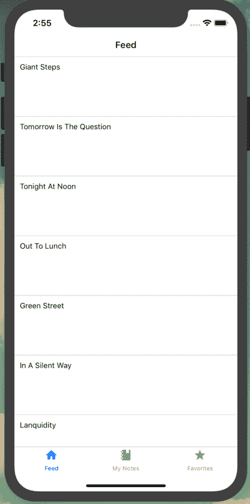
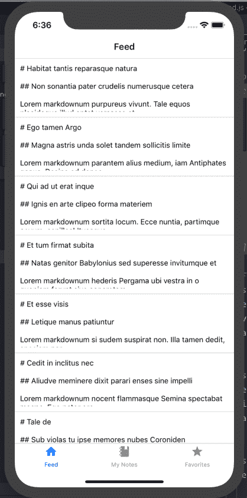
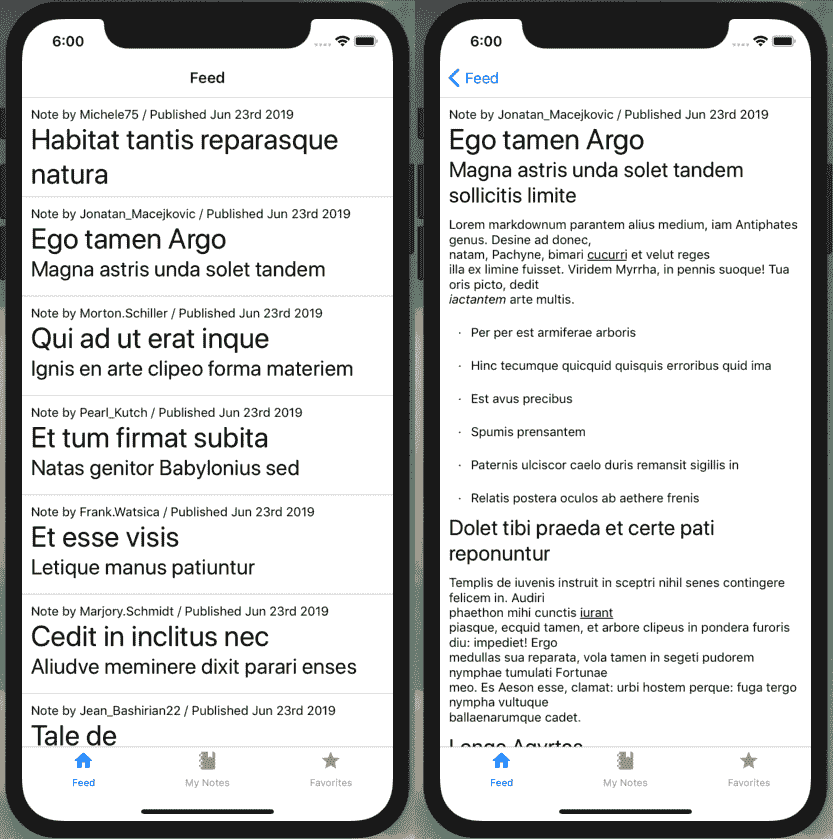
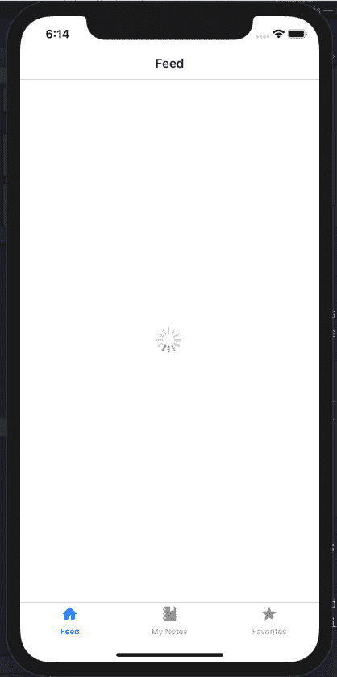

# 第二十三章：GraphQL 和 React Native

在宾夕法尼亚州匹兹堡的安迪·沃霍尔博物馆，有一个永久的装置叫做“银云”。这个装置是一个稀疏的房间，里面有十几个矩形铝箔气球，每个气球里充满了氦气和普通空气的混合物。结果是，这些气球会比充满大气空气的气球悬浮时间更长，但不像氦气气球那样飘向天花板。博物馆的参观者穿过博物馆，轻轻地拍打气球以使它们漂浮。

目前，我们的应用程序就像“云朵”的房间一样。在应用程序外壳中轻松点击图标并导航是愉快的，但最终它是一个大部分是空的房间（不冒犯沃霍尔先生）。在本章中，我们将首先探讨如何使用 React Native 的列表视图显示内容来填充我们的应用程序。然后，我们将使用[Apollo Client](https://www.apollographql.com/docs/react)连接到我们的数据 API。一旦连接成功，我们将编写 GraphQL 查询，在应用程序屏幕上显示数据。

# 本地运行我们的 API

我们的移动应用程序开发将需要访问我们 API 的本地实例。如果您一直在跟着本书，您可能已经在您的机器上运行了 Notedly API 和其数据库。如果没有，我在本书的附录 A 中添加了如何启动 API 并获取一些示例数据的说明。如果您已经运行了 API，但希望获取更多的数据来使用，请从 API 项目目录的根目录运行**`npm run seed`**。

# 创建列表和可滚动内容视图

列表随处可见。在生活中，我们保持待办事项列表、购物清单和客人名单。在应用程序中，列表是最常见的 UI 模式之一：社交媒体帖子列表、文章列表、歌曲列表、电影列表等等。列表（看我干的什么？）继续无穷无尽。因此，React Native 使得创建可滚动内容列表变得非常简单。

React Native 上的两种列表类型是`FlatList`和`SectionList`。`FlatList`适用于单个可滚动列表中的大量项目。React Native 在幕后执行一些有用的操作，例如仅渲染最初可见的项目以提高性能。`SectionList`与`FlatList`非常相似，但它允许列表项目的组有一个标题。想象一下联系人列表中的联系人，通常按字母数字顺序分组在一个标题下。

为了我们的目的，我们将使用`FlatList`来显示一个笔记列表，用户可以滚动并点击预览以查看完整的笔记。为了实现这一点，让我们创建一个名为`NoteFeed`的新组件，我们可以用来显示笔记列表。现在我们将使用一些临时数据，但很快我们将把它连接到我们的 API。

首先，让我们在*src/components/NoteFeed.js*中创建一个新的组件。我们将首先导入我们的依赖项并添加一个临时数据数组。

```
import React from 'react';
import { FlatList, View, Text } from 'react-native';
import styled from 'styled-components/native';

// our dummy data
const notes = [
  { id: 0, content: 'Giant Steps' },
  { id: 1, content: 'Tomorrow Is The Question' },
  { id: 2, content: 'Tonight At Noon' },
  { id: 3, content: 'Out To Lunch' },
  { id: 4, content: 'Green Street' },
  { id: 5, content: 'In A Silent Way' },
  { id: 6, content: 'Lanquidity' },
  { id: 7, content: 'Nuff Said' },
  { id: 8, content: 'Nova' },
  { id: 9, content: 'The Awakening' }
];

const NoteFeed = () => {
  // our component code will go here
};

export default NoteFeed;
```

现在我们可以编写我们的组件代码，其中将包含一个`FlatList`：

```
const NoteFeed = props => {
  return (
    <View>
      <FlatList
        data={notes}
        keyExtractor={({ id }) => id.toString()}
        renderItem={({ item }) => <Text>{item.content}</Text>}
      />
    </View>
  );
};
```

在前面的代码中，您可以看到`FlatList`接收了三个属性，简化了遍历数据的过程：

`data`

此属性指向列表将包含的数据数组。

`keyExtractor`

列表中的每个项必须具有唯一的`key`值。我们正在使用`keyExtractor`将唯一的`id`值作为`key`。

`renderItem`

此属性定义应在列表中呈现什么。目前，我们正在从我们的`notes`数组中传递一个单独的`item`并将其显示为`Text`。

通过更新我们的*src/screens/feed.js*组件来查看我们的列表，以显示该源：

```
import React from 'react';

// import NoteFeed
import NoteFeed from '../components/NoteFeed';

const Feed = props => {
  return <NoteFeed />;
};

Feed.navigationOptions = {
  title: 'Feed'
};

export default Feed;
```

让我们回到我们的*src/components/NoteFeed.js*文件，并更新`renderItem`以在样式化组件中添加列表项之间的间距：

```
// FeedView styled component definition
const FeedView = styled.View`
 height: 100;
 overflow: hidden;
 margin-bottom: 10px;
`;

const NoteFeed = props => {
  return (
    <View>
      <FlatList
        data={notes}
        keyExtractor={({ id }) => id.toString()}
        renderItem={({ item }) => (
          <FeedView>
            <Text>{item.content}</Text>
          </FeedView>
        )}
      />
    </View>
  );
};
```

如果预览我们的应用程序，您将看到一个可滚动的数据列表。最后，我们可以在列表项之间添加分隔符。与其通过 CSS 添加底部边框，React Native 允许我们将`ItemSeparatorComponent`属性传递给我们的`FlatList`。这使我们能够精细控制在列表元素之间放置任何类型的组件作为分隔符。它还避免在不需要的位置（例如在列表中的最后一项之后）放置分隔符。出于我们的目的，我们将添加一个简单的边框，作为一个样式化的组件`View`：

```
// FeedView styled component definition
const FeedView = styled.View`
 height: 100;
 overflow: hidden;
 margin-bottom: 10px;
`;

// add a Separator styled component
const Separator = styled.View`
 height: 1;
 width: 100%;
 background-color: #ced0ce;
`;

const NoteFeed = props => {
  return (
    <View>
      <FlatList
        data={notes}
        keyExtractor={({ id }) => id.toString()}
        ItemSeparatorComponent={() => <Separator />}
        renderItem={({ item }) => (
          <FeedView>
            <Text>{item.content}</Text>
          </FeedView>
        )}
      />
    </View>
  );
};
```

而不是直接在我们的`FlatList`中呈现和样式化笔记内容，让我们将其隔离在其自己的组件中。为此，我们将引入一种称为`ScrollView`的新视图类型。`ScrollView`的功能正是您所期望的：它不会适应屏幕的大小，而是会溢出内容，允许用户滚动。

在*src/components/Note.js*中创建一个新的组件：

```
import React from 'react';
import { Text, ScrollView } from 'react-native';
import styled from 'styled-components/native';

const NoteView = styled.ScrollView`
 padding: 10px;
`;

const Note = props => {
  return (
    <NoteView>
      <Text>{props.note.content}</Text>
    </NoteView>
  );
};

export default Note;
```

最后，我们将更新我们的*src/components/NoteFeed.js*组件，通过导入并在我们的`FeedView`中使用我们的新`Note`组件来使用它。最终组件代码如下（图 23-1）：

```
import React from 'react';
import { FlatList, View, Text } from 'react-native';
import styled from 'styled-components/native';

import Note from './Note';

// our dummy data
const notes = [
  { id: 0, content: 'Giant Steps' },
  { id: 1, content: 'Tomorrow Is The Question' },
  { id: 2, content: 'Tonight At Noon' },
  { id: 3, content: 'Out To Lunch' },
  { id: 4, content: 'Green Street' },
  { id: 5, content: 'In A Silent Way' },
  { id: 6, content: 'Lanquidity' },
  { id: 7, content: 'Nuff Said' },
  { id: 8, content: 'Nova' },
  { id: 9, content: 'The Awakening' }
];

// FeedView styled-component definition
const FeedView = styled.View`
 height: 100;
 overflow: hidden;
 margin-bottom: 10px;
`;

const Separator = styled.View`
 height: 1;
 width: 100%;
 background-color: #ced0ce;
`;

const NoteFeed = props => {
  return (
    <View>
      <FlatList
        data={notes}
        keyExtractor={({ id }) => id.toString()}
        ItemSeparatorComponent={() => <Separator />}
        renderItem={({ item }) => (
          <FeedView>
            <Note note={item} />
          </FeedView>
        )}
      />
    </View>
  );
};

export default NoteFeed;
```



###### 图 23-1\. 使用`FlatList`我们可以显示数据列表

通过这种方式，我们已经布置出一个简单的`FlatList`。现在让我们使得从列表项到单独路由的路由成为可能。

## 使列表可路由化

移动应用程序中非常常见的一种模式是点击列表中的项目以查看更多信息或扩展功能。如果您还记得前一章节，我们的 feed 屏幕位于导航堆栈中的 note 屏幕之上。在 React Native 中，我们可以使用`TouchableOpacity`作为使任何视图响应用户触摸的包装器。这意味着我们可以在`FeedView`中包装我们的内容，然后在用户按下时路由用户，就像我们以前用按钮做的那样。让我们更新我们的*src/components/NoteFeed.js*组件来做到这一点。

首先，我们必须更新我们的`react-native`导入，以在*src/components/NoteFeed.js*中包括`TouchableOpacity`：

```
import { FlatList, View, TouchableOpacity } from 'react-native';
```

接下来，我们更新我们的组件以使用`TouchableOpacity`：

```
const NoteFeed = props => {
  return (
    <View>
      <FlatList
        data={notes}
        keyExtractor={({ id }) => id.toString()}
        ItemSeparatorComponent={() => <Separator />}
        renderItem={({ item }) => (
          <TouchableOpacity
            onPress={() =>
              props.navigation.navigate('Note', {
                id: item.id
              })
            }
          >
            <FeedView>
              <Note note={item} />
            </FeedView>
          </TouchableOpacity>
        )}
      />
    </View>
  );
};
```

我们还需要更新我们的*feed.js*屏幕组件，以将导航属性传递给 feed。在*src/screens/feed.js*中：

```
const Feed = props => {
  return <NoteFeed navigation={props.navigation} />;
};
```

带有这个功能，我们可以轻松地导航到我们的通用笔记屏幕。让我们定制该屏幕，以显示笔记的 ID。您可能已经注意到，在我们的`NoteFeed`组件导航中，我们正在传递一个`id`属性。在*screens/note.js*中，我们可以读取该属性的值：

```
import React from 'react';
import { Text, View } from 'react-native';

const NoteScreen = props => {
  const id = props.navigation.getParam('id');
  return (
    <View style={{ padding: 10 }}>
      <Text>This is note {id}</Text>
    </View>
  );
};

export default NoteScreen;
```

现在，我们可以从列表视图导航到详细页面。接下来，让我们看看如何将 API 中的数据集成到我们的应用程序中。

# 使用 Apollo Client 的 GraphQL

在这一点上，我们准备好在我们的应用程序中读取和显示数据。我们将访问在书的第一部分创建的 GraphQL API。方便地，我们将利用 Apollo Client，这是来自书的 Web 部分相同的 GraphQL 客户端库。Apollo Client 提供了许多有用的功能，以简化在 JavaScript UI 应用程序中使用 GraphQL 的工作。Apollo 的客户端功能包括从远程 API 获取数据，本地缓存，GraphQL 语法处理，本地状态管理等等。

要开始，我们首先需要设置我们的配置文件。我们将环境变量存储在一个名为*config.js*的文件中。在 React Native 中管理环境和配置变量有几种方法，但我发现这种样式的配置文件是最直接和有效的。为了开始，我已经包含了一个*config-example.js*文件，您可以复制并编辑与我们的应用程序值。在项目目录的根目录下，在您的终端应用程序中：

```
$ cp config.example.js config.js
```

从这里，我们可以更新任何`dev`或`prod`环境变量。在我们的情况下，这将只是一个生产`API_URI`值：

```
// set environment variables
const ENV = {
  dev: {
    API_URI: `http://${localhost}:4000/api`
  },
  prod: {
    // update the API_URI value with your publicly deployed API address
    API_URI: 'https://your-api-uri/api'
  }
};
```

现在，我们可以使用`getEnvVars`函数基于 Expo 的环境访问这两个值。如果您有兴趣进一步探索此设置，配置文件的其余部分不会深入讨论，但有很好的注释。

从这里，我们可以将我们的客户端连接到我们的 API。在我们的*src/Main.js*文件中，我们将通过使用 Apollo Client 库设置 Apollo。如果您通过书的 Web 部分工作，这看起来会非常熟悉：

```
import React from 'react';
import Screens from './screens';
// import the Apollo libraries
import { ApolloClient, ApolloProvider, InMemoryCache } from '@apollo/client';
// import environment configuration
import getEnvVars from '../config';
const { API_URI } = getEnvVars();

// configure our API URI & cache
const uri = API_URI;
const cache = new InMemoryCache();

// configure Apollo Client
const client = new ApolloClient({
  uri,
  cache
});

const Main = () => {
  // wrap our app in the ApolloProvider higher-order component
  return (
    <ApolloProvider client={client}>
      <Screens />
    </ApolloProvider>
  );
};

export default Main;
```

通过这样做，我们的应用程序不会有可见的变化，但我们现在已连接到我们的 API。接下来，让我们看看如何从 API 查询数据。

## 编写 GraphQL 查询

现在我们已连接到我们的 API，让我们查询一些数据。我们将首先查询数据库中的所有笔记，以在我们的`NoteFeed`列表中显示。然后，我们将查询单个笔记，以在我们的`Note`详细视图中显示。

# 笔记查询

为了简化和减少重复，我们将使用批量`note` API 查询而不是分页的`noteFeed`查询。

编写`Query`组件的工作方式与在 React Web 应用程序中完全相同。在*src/screens/feed.js*中，我们导入`useQuery`和 GraphQL 语言（`gql`）库如下：

```
// import our React Native and Apollo dependencies
import { Text } from 'react-native';
import { useQuery, gql } from '@apollo/client';
```

接下来，我们组合我们的查询：

```
const GET_NOTES = gql`
 query notes {
 notes {
 id
 createdAt
 content
 favoriteCount
 author {
 username
 id
 avatar
 }
 }
 }
`;
```

最后，我们更新我们的组件来调用查询：

```
const Feed = props => {
  const { loading, error, data } = useQuery(GET_NOTES);

  // if the data is loading, our app will display a loading indicator
  if (loading) return <Text>Loading</Text>;
  // if there is an error fetching the data, display an error message
  if (error) return <Text>Error loading notes</Text>;
  // if the query is successful and there are notes, return the feed of notes
  return <NoteFeed notes={data.notes} navigation={props.navigation} />;
};
```

综上所述，我们的*src/screens/feed.js*文件如下所示：

```
import React from 'react';
import { Text } from 'react-native';
// import our Apollo libraries
import { useQuery, gql } from '@apollo/client';

import NoteFeed from '../components/NoteFeed';
import Loading from '../components/Loading';

// compose our query
const GET_NOTES = gql`
 query notes {
 notes {
 id
 createdAt
 content
 favoriteCount
 author {
 username
 id
 avatar
 }
 }
 }
`;

const Feed = props => {
  const { loading, error, data } = useQuery(GET_NOTES);

  // if the data is loading, our app will display a loading indicator
  if (loading) return <Text>Loading</Text>;
  // if there is an error fetching the data, display an error message
  if (error) return <Text>Error loading notes</Text>;
  // if the query is successful and there are notes, return the feed of notes
  return <NoteFeed notes={data.notes} navigation={props.navigation} />;
};

Feed.navigationOptions = {
  title: 'Feed'
};

export default Feed;
```

编写我们的查询后，我们可以更新*src/components/NoteFeed.js*组件以使用通过`props`传递给它的数据：

```
const NoteFeed = props => {
  return (
    <View>
      <FlatList
        data={props.notes}
        keyExtractor={({ id }) => id.toString()}
        ItemSeparatorComponent={() => <Separator />}
        renderItem={({ item }) => (
          <TouchableOpacity
            onPress={() =>
              props.navigation.navigate('Note', {
                id: item.id
              })
            }
          >
            <FeedView>
              <Note note={item} />
            </FeedView>
          </TouchableOpacity>
        )}
      />
    </View>
  );
};
```

这一改变后，使用 Expo 运行时，我们将在列表中看到来自本地 API 的数据，如图 23-2 所示。



###### 图 23-2\. 我们的 API 数据在我们的“Feed”视图中显示

目前，点击列表中的笔记预览仍将显示通用笔记页面。我们将通过在*src/screens/note.js*文件中进行`note`查询来解决这个问题：

```
import React from 'react';
import { Text } from 'react-native';
import { useQuery, gql } from '@apollo/client';

import Note from '../components/Note';

// our note query, which accepts an ID variable
const GET_NOTE = gql`
 query note($id: ID!) {
 note(id: $id) {
 id
 createdAt
 content
 favoriteCount
 author {
 username
 id
 avatar
 }
 }
 }
`;

const NoteScreen = props => {
  const id = props.navigation.getParam('id');
  const { loading, error, data } = useQuery(GET_NOTE, { variables: { id } });

  if (loading) return <Text>Loading</Text>;
  // if there's an error, display this message to the user
  if (error) return <Text>Error! Note not found</Text>;
  // if successful, pass the data to the note component
  return <Note note={data.note} />;
};

export default NoteScreen;
```

最后，让我们更新我们的*src/components/Note*组件文件，以显示笔记内容。我们将添加两个新依赖项，`react-native-markdown-renderer` 和 `date-fns`，以更用户友好的方式解析来自我们的 API 的 Markdown 和日期。

```
import React from 'react';
import { Text, ScrollView } from 'react-native';
import styled from 'styled-components/native';
import Markdown from 'react-native-markdown-renderer';
import { format } from 'date-fns';

const NoteView = styled.ScrollView`
 padding: 10px;
`;

const Note = ({ note }) => {
  return (
    <NoteView>
      <Text>
        Note by {note.author.username} / Published{' '}
        {format(new Date(note.createdAt), 'MMM do yyyy')}
      </Text>
      <Markdown>{note.content}</Markdown>
    </NoteView>
  );
};

export default Note;
```

通过这些更改，我们将在应用程序的“Feed”视图中看到笔记列表。点击笔记预览将带我们到笔记的完整、可滚动内容（参见图 23-3）。



###### 图 23-3\. 通过编写我们的 GraphQL 查询，我们可以在屏幕之间导航以查看笔记预览和完整笔记

# 添加加载指示器

当我们的应用程序加载数据时，当前显示“加载”文本。这可能有效地传达了消息，但也是一种相当刺眼的用户体验。React Native 为我们提供了一个内置的`ActivityIndicator`，它显示适合操作系统的加载旋转器。让我们编写一个简单的组件，我们可以在整个应用程序中使用作为加载指示器。

创建一个文件*src/components/Loading.js*，并编写一个简单的组件，在屏幕中心显示活动指示器：

```
import React from 'react';
import { View, ActivityIndicator } from 'react-native';
import styled from 'styled-components/native';

const LoadingWrap = styled.View`
 flex: 1;
 justify-content: center;
 align-items: center;
`;

const Loading = () => {
  return (
    <LoadingWrap>
      <ActivityIndicator size="large" />
    </LoadingWrap>
  );
};

export default Loading;
```

现在我们可以在我们的 GraphQL 查询组件中替换“加载”文本。首先在*src/screens/feed.js*和*src/screens/note.js*中导入`Loading`组件：

```
import Loading from '../components/Loading';
```

然后，在这两个文件中，更新 Apollo 加载状态如下：

```
if (loading) return <Loading />;
```

现在，我们的应用程序在加载 API 数据时将显示一个旋转的活动指示器（参见图 23-4）。



###### 图 23-4\. 使用 ActivityIndicator，我们可以添加一个与操作系统相匹配的加载旋转器

# 结论

在本章中，我们首先看了如何将列表视图集成到 React Native 应用程序中，利用常见的应用程序 UI 模式。然后我们配置了 Apollo Client 并将来自 API 的数据集成到应用程序中。有了这些，我们已经具备了构建许多常见类型应用程序所需的一切，比如新闻应用或从网站集成博客信息。在下一章中，我们将向我们的应用程序添加认证功能，并显示用户特定的查询。
