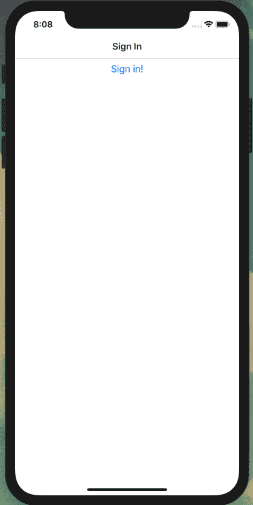
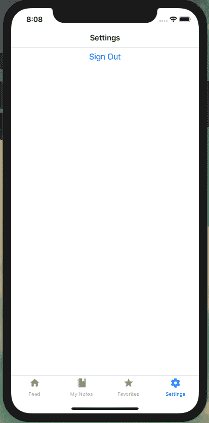
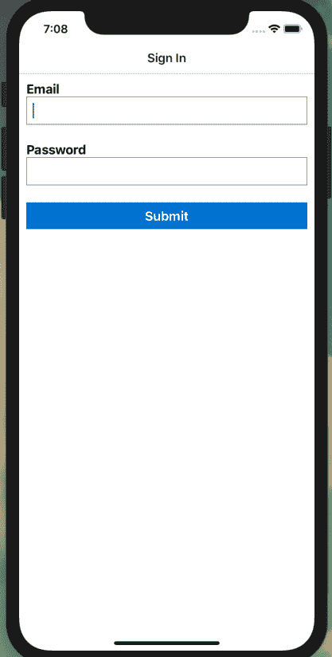
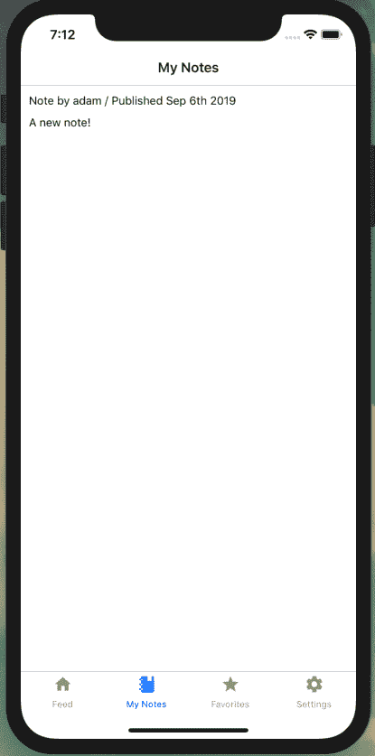
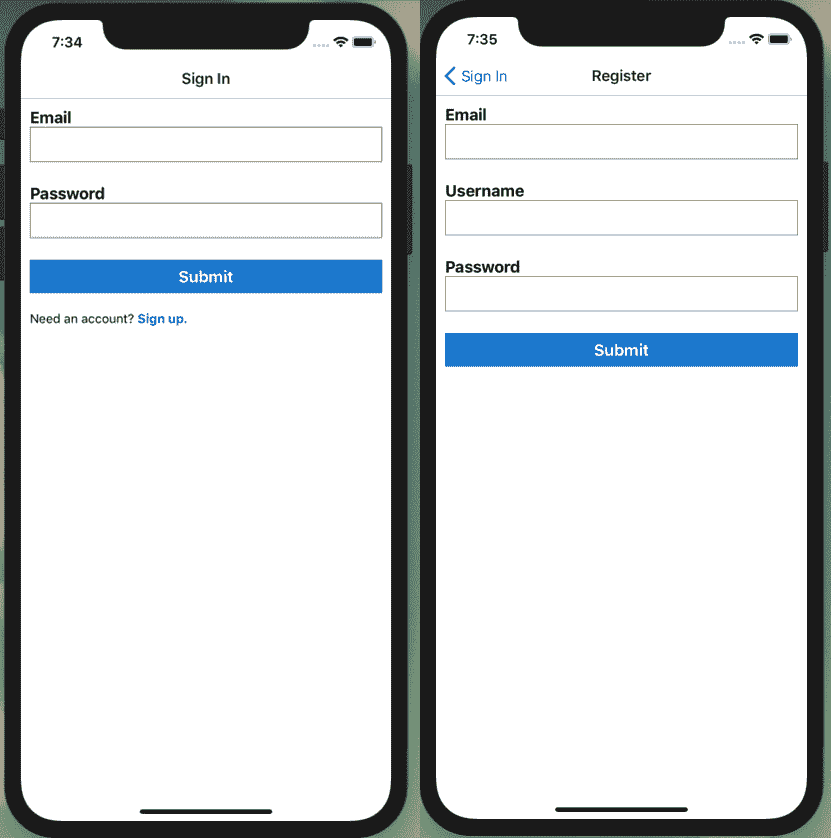

# 第二十四章：手机应用程序认证

如果你曾与亲戚住过，或在租赁物业度假，或租了一间带家具的公寓，你就知道被周围不属于自己的东西包围是什么感觉。在这些环境中很难感到舒适，不想让东西摆放不整齐或弄脏。当我处于这种情况时，无论主人多么友好或周到，这种缺乏归属感总让我感到紧张。我能说什么呢？除非我能放下杯子而不用垫子，否则我就不会感到舒适。

如果我们的应用程序无法自定义或读取用户特定数据，用户可能会感到不适。他们的笔记只是与其他人混在一起，使得应用程序无法真正成为他们自己的。在本章中，我们将为我们的应用程序添加认证功能。为了实现这一点，我们将引入认证路由流程，使用 Expo 的`SecureStore`存储令牌数据，在 React Native 中创建文本表单，并执行认证 GraphQL 变更。

# 认证路由流程

让我们开始创建我们的认证流程。当用户首次访问我们的应用程序时，我们将向他们呈现一个登录屏幕。用户登录后，我们将在设备上存储一个令牌，允许他们在将来的应用程序使用中绕过登录屏幕。我们还将添加一个设置屏幕，用户可以点击按钮退出应用程序并从他们的设备中删除令牌。

为了实现这一点，我们将添加几个新的屏幕：

*authloading.js*

这将是一个插页屏幕，用户不会与之交互。当应用程序打开时，我们将使用这个屏幕来检查是否存在令牌，并将用户导航到登录屏幕或应用程序内容。

*signin.js*

这是用户可以登录其帐户的屏幕。登录尝试成功后，我们将在设备上存储一个令牌。

*settings.js*

在设置屏幕中，用户将能够点击按钮退出应用程序。一旦他们退出登录，他们将被路由回登录屏幕。

# 使用现有帐户

我们将在本章后面添加通过应用程序创建帐户的能力。如果你还没有这样做，通过你的 API 实例的 GraphQL Playground 或 Web 应用程序界面创建一个帐户会很有用。

为了存储和处理令牌，我们将使用 Expo 的[SecureStore 库](https://oreil.ly/nvqEO)。我发现 SecureStore 是一种简单的方式，在设备上本地加密和存储数据。对于 iOS 设备，SecureStore 利用内置的[keychain 服务](https://oreil.ly/iCu8R)，而在 Android 上则使用操作系统的 Shared Preferences，并使用[Keystore](https://oreil.ly/gIXsp)加密数据。所有这些都是在幕后进行的，使我们能够简单地存储和检索数据。

首先，我们将创建我们的登录屏幕。目前，我们的登录屏幕将包含一个`Button`组件，按下该按钮将存储一个令牌。让我们在*src/screens/signin.js*创建一个新的屏幕组件，并导入我们的依赖项：

```
import React from 'react';
import { View, Button, Text } from 'react-native';
import * as SecureStore from 'expo-secure-store';

const SignIn = props => {
  return (
    <View>
      <Button title="Sign in!" />
    </View>
  );
}

SignIn.navigationOptions = {
  title: 'Sign In'
};

export default SignIn;
```

接下来，让我们在*src/screens/authloading.js*创建我们的认证加载组件，目前它将简单地显示一个加载指示器：

```
import React, { useEffect } from 'react';
import * as SecureStore from 'expo-secure-store';

import Loading from '../components/Loading';

const AuthLoading = props => {
  return <Loading />;
};

export default AuthLoading;
```

最后，我们可以在*src/screens/settings.js*创建我们的设置屏幕：

```
import React from 'react';
import { View, Button } from 'react-native';
import * as SecureStore from 'expo-secure-store';

const Settings = props => {
  return (
    <View>
      <Button title="Sign Out" />
    </View>
  );
};

Settings.navigationOptions = {
  title: 'Settings'
};

export default Settings;
```

写完这些组件后，我们将更新路由以处理已认证和未认证的状态。在*src/screens/index.js*中，按以下方式将新屏幕添加到我们的导入语句列表中：

```
import AuthLoading from './authloading';
import SignIn from './signin';
import Settings from './settings';
```

我们还需要更新我们的`react-navigation`依赖项，包括`createSwitchNavigator`，它允许我们一次显示一个屏幕并在它们之间切换。[`SwitchNavigator`](https://oreil.ly/vSURH)在用户导航时重置路由到默认状态，并且不提供后退导航选项。

```
import { createAppContainer, createSwitchNavigator } from 'react-navigation';
```

我们可以为我们的认证和设置屏幕创建一个新的`StackNavigator`。这将允许我们在将来需要时添加子导航屏幕：

```
const AuthStack = createStackNavigator({
  SignIn: SignIn
});

const SettingsStack = createStackNavigator({
  Settings: Settings
});
```

然后，我们将我们的设置屏幕添加到底部的`TabNavigator`。其余的选项卡导航设置将保持不变：

```
const TabNavigator = createBottomTabNavigator({
 FeedScreen: {
   // ...
 },
 MyNoteScreen: {
  // ...
 },
 FavoriteScreen: {
   // ...
 },
 Settings: {
   screen: Settings,
   navigationOptions: {
     tabBarLabel: 'Settings',
     tabBarIcon: ({ tintColor }) => (
       <MaterialCommunityIcons name="settings" size={24} color={tintColor} />
     )
   }
 }
});
```

现在，我们可以通过定义要在其间切换的屏幕并设置默认屏幕`AuthLoading`来创建我们的`SwitchNavigator`。然后，我们将用一个导出`SwitchNavigator`的新`export`语句替换我们现有的语句：

```
const SwitchNavigator = createSwitchNavigator(
  {
    AuthLoading: AuthLoading,
    Auth: AuthStack,
    App: TabNavigator
  },
  {
    initialRouteName: 'AuthLoading'
  }
);

export default createAppContainer(SwitchNavigator);
```

所有这些组件一起，我们的*src/screens/index.js*文件将如下所示：

```
import React from 'react';
import { Text, View, ScrollView, Button } from 'react-native';
import { createAppContainer, createSwitchNavigator } from 'react-navigation';
import { createBottomTabNavigator } from 'react-navigation-tabs';
import { createStackNavigator } from 'react-navigation-stack';
import { MaterialCommunityIcons } from '@expo/vector-icons';

import Feed from './feed';
import Favorites from './favorites';
import MyNotes from './mynotes';
import Note from './note';
import SignIn from './signin';
import AuthLoading from './authloading';
import Settings from './settings';

const AuthStack = createStackNavigator({
  SignIn: SignIn,
});

const FeedStack = createStackNavigator({
  Feed: Feed,
  Note: Note
});

const MyStack = createStackNavigator({
  MyNotes: MyNotes,
  Note: Note
});

const FavStack = createStackNavigator({
  Favorites: Favorites,
  Note: Note
});

const SettingsStack = createStackNavigator({
  Settings: Settings
});

const TabNavigator = createBottomTabNavigator({
  FeedScreen: {
    screen: FeedStack,
    navigationOptions: {
      tabBarLabel: 'Feed',
      tabBarIcon: ({ tintColor }) => (
        <MaterialCommunityIcons name="home" size={24} color={tintColor} />
      )
    }
  },
  MyNoteScreen: {
    screen: MyStack,
    navigationOptions: {
      tabBarLabel: 'My Notes',
      tabBarIcon: ({ tintColor }) => (
        <MaterialCommunityIcons name="notebook" size={24} color={tintColor} />
      )
    }
  },
  FavoriteScreen: {
    screen: FavStack,
    navigationOptions: {
      tabBarLabel: 'Favorites',
      tabBarIcon: ({ tintColor }) => (
        <MaterialCommunityIcons name="star" size={24} color={tintColor} />
      )
    }
  },
  Settings: {
    screen: SettingsStack,
    navigationOptions: {
      tabBarLabel: 'Settings',
      tabBarIcon: ({ tintColor }) => (
        <MaterialCommunityIcons name="settings" size={24} color={tintColor} />
      )
    }
  }
});

const SwitchNavigator = createSwitchNavigator(
  {
    AuthLoading: AuthLoading,
    Auth: AuthStack,
    App: TabNavigator
  },
  {
    initialRouteName: 'AuthLoading'
  }
);

export default createAppContainer(SwitchNavigator);
```

现在，当我们预览我们的应用程序时，我们只会看到加载旋转器，因为`AuthLoading`路由是初始屏幕。让我们更新这个，以便加载屏幕检查应用程序的`SecureStore`中是否存在`token`值。如果令牌存在，我们将用户导航到主应用程序屏幕。但是，如果没有令牌存在，用户应该被路由到登录屏幕。让我们更新*src/screens/**authloading.js*来执行这个检查：

```
import React, { useEffect } from 'react';
import * as SecureStore from 'expo-secure-store';

import Loading from '../components/Loading';

const AuthLoadingScreen = props => {
  const checkLoginState = async () => {
    // retrieve the value of the token
    const userToken = await SecureStore.getItemAsync('token');
    // navigate to the app screen if a token is present
    // else navigate to the auth screen
    props.navigation.navigate(userToken ? 'App' : 'Auth');
  };

  // call checkLoginState as soon as the component mounts
  useEffect(() => {
    checkLoginState();
  });

  return <Loading />;
};

export default AuthLoadingScreen;
```

通过这个变化，当我们加载应用程序时，现在我们应该被路由到登录屏幕，因为没有令牌存在。现在，让我们更新我们的登录屏幕，以便在用户按下按钮时存储一个通用令牌，并导航到应用程序（图 24-1）。

```
import React from 'react';
import { View, Button, Text } from 'react-native';
import * as SecureStore from 'expo-secure-store';

const SignIn = props => {
  // store the token with a key value of `token`
  // after the token is stored navigate to the app's main screen
  const storeToken = () => {
    SecureStore.setItemAsync('token', 'abc').then(
      props.navigation.navigate('App')
    );
  };

  return (
    <View>
      <Button title="Sign in!" onPress={storeToken} />
    </View>
  );
};

SignIn.navigationOptions = {
  title: 'Sign In'
};

export default SignIn;
```



###### 图 24-1。单击按钮将存储一个令牌并将用户路由到应用程序

现在，当用户按下按钮时，将通过`SecureStore`存储一个令牌。通过设置登录功能，让我们添加用户退出应用程序的功能。为此，在我们的设置屏幕上添加一个按钮，按下该按钮将从`SecureStore`中删除*token*（图 24-2）。在*src/screens/settings.js*中：

```
import React from 'react';
import { View, Button } from 'react-native';
import * as SecureStore from 'expo-secure-store';

const Settings = props => {
  // delete the token then navigate to the auth screen
  const signOut = () => {
    SecureStore.deleteItemAsync('token').then(
      props.navigation.navigate('Auth')
    );
  };

  return (
    <View>
      <Button title="Sign Out" onPress={signOut} />
    </View>
  );
};

Settings.navigationOptions = {
  title: 'Settings'
};

export default Settings;
```



###### Figure 24-2\. 点击按钮将从设备中删除令牌，并将用户返回到登录屏幕

有了这些组件，我们拥有了创建应用程序认证流所需的一切。

# 记得登出

如果你还没有这样做，请点击本地应用实例中的登出按钮。我们将在接下来的章节中添加适当的登录功能。

# 创建一个登录表单

虽然我们现在可以点击按钮并在用户设备上存储令牌，但我们还没有允许用户通过输入自己的信息来登录帐户。让我们通过创建一个表单来解决这个问题，用户可以在其中输入他们的电子邮件地址和密码。为此，我们将在 *src/components/UserForm.js* 中创建一个新的组件，使用 React Native 的 `TextInput` 组件编写表单：

```
import React, { useState } from 'react';
import { View, Text, TextInput, Button, TouchableOpacity } from 'react-native';
import styled from 'styled-components/native';

const UserForm = props => {
  return (
    <View>
      <Text>Email</Text>
      <TextInput />
      <Text>Password</Text>
      <TextInput />
      <Button title="Log In" />
    </View>
  );
}

export default UserForm;
```

现在我们可以在我们的认证屏幕上显示这个表单了。为此，更新 *src/screens/signin.js* 以导入并使用该组件，如下所示：

```
import React from 'react';
import { View, Button, Text } from 'react-native';
import * as SecureStore from 'expo-secure-store';

import UserForm from '../components/UserForm';

const SignIn = props => {
  const storeToken = () => {
    SecureStore.setItemAsync('token', 'abc').then(
      props.navigation.navigate('App')
    );
  };

  return (
    <View>
      <UserForm />
    </View>
  );
}

export default SignIn;
```

通过这一步骤，我们将在认证屏幕上看到一个基本的表单显示，但缺乏任何样式或功能。我们可以继续在我们的 *src/components/UserForm.js* 文件中实现表单。我们将使用 React 的 `useState` 钩子来读取和设置我们表单元素的值：

```
const UserForm = props => {
  // form element state
  const [email, setEmail] = useState();
  const [password, setPassword] = useState();

  return (
    <View>
      <Text>Email</Text>
      <TextInput onChangeText={text => setEmail(text)} value={email} />
      <Text>Password</Text>
      <TextInput onChangeText={text => setPassword(text)} value={password} />
      <Button title="Log In" />
    </View>
  );
}
```

现在我们可以为我们的表单元素添加一些额外的属性，以便在处理电子邮件地址或密码时为用户提供预期的功能。完整的 `TextInput` API 文档可以在 [React Native docs](https://oreil.ly/yvgyU) 中找到。当按钮被按下时，我们还将调用一个函数，尽管功能会有所限制。

```
const UserForm = props => {
  // form element state
  const [email, setEmail] = useState();
  const [password, setPassword] = useState();

  const handleSubmit = () => {
    // this function is called when the user presses the form button
  };

  return (
    <View>
      <Text>Email</Text>
      <TextInput
        onChangeText={text => setEmail(text)}
        value={email}
        textContentType="emailAddress"
        autoCompleteType="email"
        autoFocus={true}
        autoCapitalize="none"
      />
      <Text>Password</Text>
      <TextInput
        onChangeText={text => setPassword(text)}
        value={password}
        textContentType="password"
        secureTextEntry={true}
      />
      <Button title="Log In" onPress={handleSubmit} />
    </View>
  );
}
```

我们的表单具备所有必要的组件，但样式还有很大的提升空间。让我们使用 Styled Components 库，为表单赋予更合适的外观：

```
import React, { useState } from 'react';
import { View, Text, TextInput, Button, TouchableOpacity } from 'react-native';
import styled from 'styled-components/native';

const FormView = styled.View`
 padding: 10px;
`;

const StyledInput = styled.TextInput`
 border: 1px solid gray;
 font-size: 18px;
 padding: 8px;
 margin-bottom: 24px;
`;

const FormLabel = styled.Text`
 font-size: 18px;
 font-weight: bold;
`;

const UserForm = props => {
  const [email, setEmail] = useState();
  const [password, setPassword] = useState();

  const handleSubmit = () => {
    // this function is called when the user presses the form button
  };

  return (
    <FormView>
      <FormLabel>Email</FormLabel>
      <StyledInput
        onChangeText={text => setEmail(text)}
        value={email}
        textContentType="emailAddress"
        autoCompleteType="email"
        autoFocus={true}
        autoCapitalize="none"
      />
      <FormLabel>Password</FormLabel>
      <StyledInput
        onChangeText={text => setPassword(text)}
        value={password}
        textContentType="password"
        secureTextEntry={true}
      />
      <Button title="Log In" onPress={handleSubmit} />
    </FormView>
  );
};

export default UserForm;
```

最后，我们的 `Button` 组件仅限于默认样式选项，除了接受一个 `color` 属性值。要创建一个自定义样式的按钮组件，我们可以使用 React Native 的包装器 `TouchableOpacity`（见 Figure 24-3）：

```
const FormButton = styled.TouchableOpacity`
 background: #0077cc;
 width: 100%;
 padding: 8px;
`;

const ButtonText = styled.Text`
 text-align: center;
 color: #fff;
 font-weight: bold;
 font-size: 18px;
`;

const UserForm = props => {
  const [email, setEmail] = useState();
  const [password, setPassword] = useState();

  const handleSubmit = () => {
    // this function is called when the user presses the form button
  };

  return (
    <FormView>
      <FormLabel>Email</FormLabel>
      <StyledInput
        onChangeText={text => setEmail(text)}
        value={email}
        textContentType="emailAddress"
        autoCompleteType="email"
        autoFocus={true}
        autoCapitalize="none"
      />
      <FormLabel>Password</FormLabel>
      <StyledInput
        onChangeText={text => setPassword(text)}
        value={password}
        textContentType="password"
        secureTextEntry={true}
      />
      <FormButton onPress={handleSubmit}>
        <ButtonText>Submit</ButtonText>
      </FormButton>
    </FormView>
  );
};
```

通过这个步骤，我们实现了一个登录表单并应用了自定义样式。现在让我们实现表单的功能。



###### Figure 24-3\. 我们的带有自定义样式的登录表单

# 使用 GraphQL Mutations 进行认证

你可能还记得我们从 API 和 Web 应用程序章节中开发的认证流程，但在继续之前让我们做一个快速复习。我们将向我们的 API 发送一个包含用户电子邮件地址和密码的 GraphQL mutation。如果电子邮件地址存在于我们的数据库中并且密码正确，我们的 API 将回复一个 JWT。我们可以像之前一样将令牌存储在用户的设备上，并在每个 GraphQL 请求中发送它。这将允许我们在每个 API 请求中识别用户，而无需他们不断重新输入密码。

有了我们的表单，我们可以在*src/screens/signin.js*中编写我们的 GraphQL mutation。首先，我们将添加 Apollo 库以及我们的`Loading`组件到我们的导入列表中：

```
import React from 'react';
import { View, Button, Text } from 'react-native';
import * as SecureStore from 'expo-secure-store';
import { useMutation, gql } from '@apollo/client';

import UserForm from '../components/UserForm';
import Loading from '../components/Loading';
```

接下来，我们可以添加我们的 GraphQL 查询：

```
const SIGNIN_USER = gql`
 mutation signIn($email: String, $password: String!) {
 signIn(email: $email, password: $password)
 }
`;
```

并更新我们的`storeToken`函数以存储作为参数传递的令牌字符串：

```
const storeToken = token => {
   SecureStore.setItemAsync('token', token).then(
     props.navigation.navigate('App')
   );
 };
```

最后，我们将组件更新为 GraphQL mutation。我们还将几个属性值传递给`UserForm`组件，允许我们共享 mutation 数据，标识我们调用的表单类型，并利用路由器的导航。

```
const SignIn = props => {
  const storeToken = token => {
    SecureStore.setItemAsync('token', token).then(
      props.navigation.navigate('App')
    );
  };

  const [signIn, { loading, error }] = useMutation(SIGNIN_USER, {
    onCompleted: data => {
      storeToken(data.signIn)
    }
  });

  // if loading, return a loading indicator
  if (loading) return <Loading />;
  return (
    <React.Fragment>
      {error && <Text>Error signing in!</Text>}
      <UserForm
        action={signIn}
        formType="signIn"
        navigation={props.navigation}
      />
    </React.Fragment>
  );
};
```

现在我们可以在*src/components/UserForm.js*组件中做一个简单的更改，使其能够将用户输入的数据传递给 mutation。在组件内部，我们将更新我们的`handleSubmit`函数，以将表单值传递给我们的 mutation：

```
const handleSubmit = () => {
  props.action({
    variables: {
      email: email,
      password: password
    }
  });
};
```

当我们编写完毕并完成表单时，用户现在可以登录应用程序，该应用程序将存储返回的 JSON Web Token 以备将来使用。

# 鉴权 GraphQL 查询

现在我们的用户可以登录他们的帐户，我们需要使用存储的令牌来认证每个请求。这将允许我们请求用户特定的数据，例如当前用户的笔记列表或用户标记为“收藏夹”的笔记列表。为此，我们将更新 Apollo 配置以检查令牌的存在，并在存在令牌时发送该令牌的值与每个 API 调用。

在*src/Main.js*中，首先将`SecureStore`添加到导入列表中，并更新 Apollo Client 的依赖项以包括`createHttpLink`和`setContext`：

```
// import the Apollo libraries
import {
  ApolloClient,
  ApolloProvider,
  createHttpLink,
  InMemoryCache
} from '@apollo/client';
import { setContext } from 'apollo-link-context';
// import SecureStore for retrieving the token value
import * as SecureStore from 'expo-secure-store';
```

然后，我们可以更新我们的 Apollo Client 配置以发送每个请求的令牌值：

```
// configure our API URI & cache
const uri = API_URI;
const cache = new InMemoryCache();
const httpLink = createHttpLink({ uri });

// return the headers to the context
const authLink = setContext(async (_, { headers }) => {
  return {
    headers: {
      ...headers,
      authorization: (await SecureStore.getItemAsync('token')) || ''
    }
  };
});

// configure Apollo Client
const client = new ApolloClient({
  link: authLink.concat(httpLink),
  cache
});
```

使用每个请求头中的令牌，我们现在可以更新`mynotes`和`favorites`屏幕，请求用户特定的数据。如果您通过网络章节跟随，这些查询应该非常熟悉。

在*src/screens/mynotes.js*中：

```
import React from 'react';
import { Text, View } from 'react-native';
import { useQuery, gql } from '@apollo/client';

import NoteFeed from '../components/NoteFeed';
import Loading from '../components/Loading';

// our GraphQL query
const GET_MY_NOTES = gql`
 query me {
 me {
 id
 username
 notes {
 id
 createdAt
 content
 favoriteCount
 author {
 username
 id
 avatar
 }
 }
 }
 }
`;

const MyNotes = props => {
  const { loading, error, data } = useQuery(GET_MY_NOTES);

  // if the data is loading, our app will display a loading message
  if (loading) return <Loading />;
  // if there is an error fetching the data, display an error message
  if (error) return <Text>Error loading notes</Text>;
  // if the query is successful and there are notes, return the feed of notes
  // else if the query is successful and there aren't notes, display a message
  if (data.me.notes.length !== 0) {
    return <NoteFeed notes={data.me.notes} navigation={props.navigation} />;
  } else {
    return <Text>No notes yet</Text>;
  }
};

MyNotes.navigationOptions = {
  title: 'My Notes'
};

export default MyNotes;
```

在*src/screens/favorites.js*中：

```
import React from 'react';
import { Text, View } from 'react-native';
import { useQuery, gql } from '@apollo/client';

import NoteFeed from '../components/NoteFeed';
import Loading from '../components/Loading';

// our GraphQL query
const GET_MY_FAVORITES = gql`
 query me {
 me {
 id
 username
 favorites {
 id
 createdAt
 content
 favoriteCount
 author {
 username
 id
 avatar
 }
 }
 }
 }
`;

const Favorites = props => {
  const { loading, error, data } = useQuery(GET_MY_FAVORITES);

  // if the data is loading, our app will display a loading message
  if (loading) return <Loading />;
  // if there is an error fetching the data, display an error message
  if (error) return <Text>Error loading notes</Text>;
  // if the query is successful and there are notes, return the feed of notes
  // else if the query is successful and there aren't notes, display a message
  if (data.me.favorites.length !== 0) {
    return <NoteFeed notes={data.me.favorites} navigation={props.navigation} />;
  } else {
    return <Text>No notes yet</Text>;
  }
};

Favorites.navigationOptions = {
  title: 'Favorites'
};

export default Favorites;
```



###### 图 24-4\. 在每个请求的头部传递令牌允许我们在应用程序中进行用户特定的查询。

现在我们基于存储在用户设备上的令牌值检索用户特定的数据（图 24-4）。

# 添加注册表单

现在用户可以登录到现有帐户，但如果不存在帐户，他们无法创建帐户。一个常见的 UI 模式是在登录链接下（或反之）添加一个链接到注册表单的链接。让我们添加一个注册屏幕，以允许用户从应用程序内创建新帐户。

首先，让我们在*src/screens/signup.js*创建一个新的屏幕组件。这个组件将几乎与我们的登录屏幕相同，但我们将调用我们的`signUp` GraphQL mutation，并将一个`formType="signUp"`属性传递给我们的`UserForm`组件：

```
import React from 'react';
import { Text } from 'react-native';
import * as SecureStore from 'expo-secure-store';
import { useMutation, gql } from '@apollo/client';

import UserForm from '../components/UserForm';
import Loading from '../components/Loading';

// signUp GraphQL mutation
const SIGNUP_USER = gql`
 mutation signUp($email: String!, $username: String!, $password: String!) {
 signUp(email: $email, username: $username, password: $password)
 }
`;

const SignUp = props => {
  // store the token with a key value of `token`
  // after the token is stored navigate to the app's main screen
  const storeToken = token => {
    SecureStore.setItemAsync('token', token).then(
      props.navigation.navigate('App')
    );
  };

  // the signUp mutation hook
  const [signUp, { loading, error }] = useMutation(SIGNUP_USER, {
    onCompleted: data => {
      storeToken(data.signUp);
    }
  });

  // if loading, return a loading indicator
  if (loading) return <Loading />;

  return (
    <React.Fragment>
      {error && <Text>Error signing in!</Text>}
      <UserForm
        action={signUp}
        formType="signUp"
        navigation={props.navigation}
      />
    </React.Fragment>
  );
};

SignUp.navigationOptions = {
  title: 'Register'
};

export default SignUp;
```

创建了屏幕后，我们可以将其添加到我们的路由器中。在*src/screens/index.js*文件中，首先将新组件添加到我们的文件导入列表中：

```
import SignUp from './signup';
```

接下来，我们将更新我们的`AuthStack`以包括注册屏幕：

```
const AuthStack = createStackNavigator({
  SignIn: SignIn,
  SignUp: SignUp
});
```

通过这样，我们的组件已经创建并且可路由；然而，我们的`UserForm`组件并不包含所有必要的字段。与其创建一个注册表单组件，我们可以利用传递给`UserForm`的`formType`属性来根据类型自定义表单。

在我们的*src/components/UserForm.js*文件中，首先在`formType`等于`signUp`时更新表单以包含用户名字段：

```
const UserForm = props => {
  const [email, setEmail] = useState();
  const [password, setPassword] = useState();
  const [username, setUsername] = useState();

  const handleSubmit = () => {
    props.action({
      variables: {
        email: email,
        password: password,
        username: username
      }
    });
  };

  return (
    <FormView>
      <FormLabel>Email</FormLabel>
      <StyledInput
        onChangeText={text => setEmail(text)}
        value={email}
        textContentType="emailAddress"
        autoCompleteType="email"
        autoFocus={true}
        autoCapitalize="none"
      />
      {props.formType === 'signUp' && (
        <View>
          <FormLabel>Username</FormLabel>
          <StyledInput
            onChangeText={text => setUsername(text)}
            value={username}
            textContentType="username"
            autoCapitalize="none"
          />
        </View>
      )}
      <FormLabel>Password</FormLabel>
      <StyledInput
        onChangeText={text => setPassword(text)}
        value={password}
        textContentType="password"
        secureTextEntry={true}
      />
      <FormButton onPress={handleSubmit}>
        <ButtonText>Submit</ButtonText>
      </FormButton>
    </FormView>
  );
};
```

接下来，在登录表单底部添加一个链接，当按下时允许用户路由到注册表单：

```
return (
  <FormView>
      {/* existing form component code is here */}
      {props.formType !== 'signUp' && (
        <TouchableOpacity onPress={() => props.navigation.navigate('SignUp')}>
          <Text>Sign up</Text>
        </TouchableOpacity>
      )}
  </FormView>
)
```

然后，我们可以使用 styled components 来更新链接的外观：

```
const SignUp = styled.TouchableOpacity`
 margin-top: 20px;
`;

const Link = styled.Text`
 color: #0077cc;
 font-weight: bold;
`;
```

并且在组件的 JSX 中：

```
{props.formType !== 'signUp' && (
  <SignUp onPress={() => props.navigation.navigate('SignUp')}>
    <Text>
      Need an account? <Link>Sign up.</Link>
    </Text>
  </SignUp>
)}
```

总之，我们的*src/components/UserForm.js*文件现在如下所示：

```
import React, { useState } from 'react';
import { View, Text, TextInput, Button, TouchableOpacity } from 'react-native';
import styled from 'styled-components/native';

const FormView = styled.View`
 padding: 10px;
`;

const StyledInput = styled.TextInput`
 border: 1px solid gray;
 font-size: 18px;
 padding: 8px;
 margin-bottom: 24px;
`;

const FormLabel = styled.Text`
 font-size: 18px;
 font-weight: bold;
`;

const FormButton = styled.TouchableOpacity`
 background: #0077cc;
 width: 100%;
 padding: 8px;
`;

const ButtonText = styled.Text`
 text-align: center;
 color: #fff;
 font-weight: bold;
 font-size: 18px;
`;

const SignUp = styled.TouchableOpacity`
 margin-top: 20px;
`;

const Link = styled.Text`
 color: #0077cc;
 font-weight: bold;
`;

const UserForm = props => {
  const [email, setEmail] = useState();
  const [password, setPassword] = useState();
  const [username, setUsername] = useState();

  const handleSubmit = () => {
    props.action({
      variables: {
        email: email,
        password: password,
        username: username
      }
    });
  };

  return (
    <FormView>
      <FormLabel>Email</FormLabel>
      <StyledInput
        onChangeText={text => setEmail(text)}
        value={email}
        textContentType="emailAddress"
        autoCompleteType="email"
        autoFocus={true}
        autoCapitalize="none"
      />
      {props.formType === 'signUp' && (
        <View>
          <FormLabel>Username</FormLabel>
          <StyledInput
            onChangeText={text => setUsername(text)}
            value={username}
            textContentType="username"
            autoCapitalize="none"
          />
        </View>
      )}
      <FormLabel>Password</FormLabel>
      <StyledInput
        onChangeText={text => setPassword(text)}
        value={password}
        textContentType="password"
        secureTextEntry={true}
      />
      <FormButton onPress={handleSubmit}>
        <ButtonText>Submit</ButtonText>
      </FormButton>
      {props.formType !== 'signUp' && (
        <SignUp onPress={() => props.navigation.navigate('SignUp')}>
          <Text>
            Need an account? <Link>Sign up.</Link>
          </Text>
        </SignUp>
      )}
    </FormView>
  );
};

export default UserForm;
```

通过这些更改，用户可以在我们的应用程序中既登录又注册帐户（图 24-5）。



###### 图 24-5\. 用户现在可以注册一个帐户并在认证屏幕之间导航

# 结论

在本章中，我们看了如何为应用程序引入身份验证。通过 React Native 的文本表单元素、React Navigation 的路由能力、Expo 的 SecureStore 库和 GraphQL 的 mutations 的组合，我们可以创建用户友好的身份验证流程。对这种类型的身份验证有扎实的理解还使我们能够探索额外的 React Native 身份验证方法，例如 Expo 的[`AppAuth`](https://oreil.ly/RaxNo)或[`GoogleSignIn`](https://oreil.ly/Ic6BW)。在下一章中，我们将看看如何发布和分发 React Native 应用程序。
