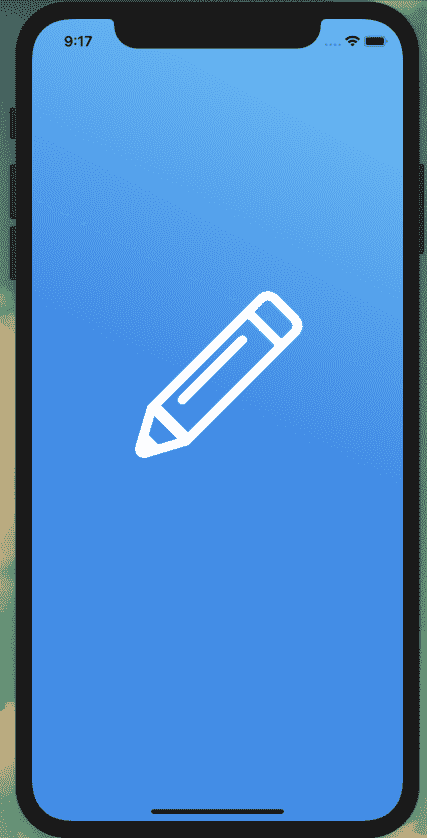
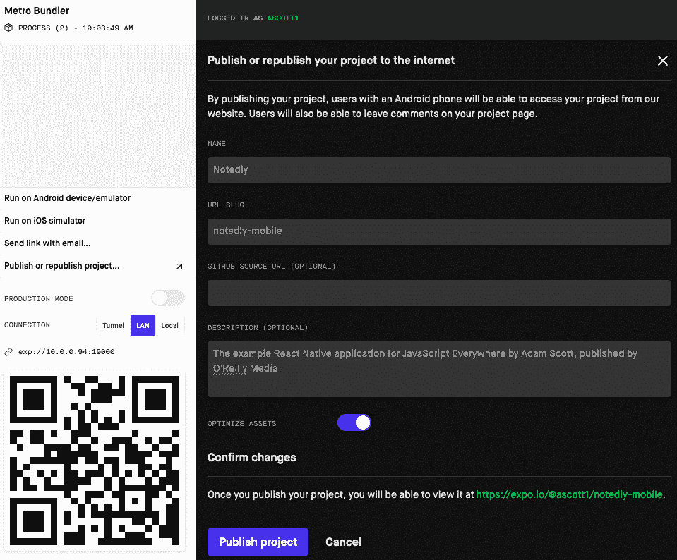

# 第二十五章：移动应用分发

在上世纪 90 年代中期的高中时代，流行下载[TI-81 图形计算器](https://oreil.ly/SqOKQ)上的游戏。有人会弄到游戏副本，然后它像野火般传播，我们每个人轮流用线缆连接计算器来加载游戏。在课堂后面或自习时间里玩游戏是填充时间的一种方式，同时又保持做学校作业的外表。然而，这种分发方法很慢，需要两名学生保持连接数分钟，而其他人则等待。如今，我们的数字口袋计算机能做的事情远远超过我那款朴素的图形计算器，部分原因是我们可以轻松地通过可安装的第三方应用扩展其功能。

初步应用程序开发完成后，我们现在可以分发应用程序，使他人可以访问。在本章中，我们将学习如何配置我们的*app.json*文件以进行分发。然后，我们将在 Expo 中公开发布我们的应用程序。最后，我们将生成可提交到 Apple 或 Google Play 商店的应用程序包。

# app.json 配置

Expo 应用程序包含一个*app.json*文件，用于配置应用程序特定设置。

当我们生成一个新的 Expo 应用程序时，*app.json*文件会自动为我们创建。让我们来看看为我们的应用程序生成的文件： 

```
{
  "expo": {
    "name": "Notedly",
    "slug": "notedly-mobile",
    "description": "An example React Native app",
    "privacy": "public",
    "sdkVersion": "33.0.0",
    "platforms": ["ios", "android"],
    "version": "1.0.0",
    "orientation": "portrait",
    "icon": "./assets/icon.png",
    "splash": {
      "image": "./assets/splash.png",
      "resizeMode": "contain",
      "backgroundColor": "#ffffff"
    },
    "updates": {
      "fallbackToCacheTimeout": 1500
    },
    "assetBundlePatterns": ["**/*"],
    "ios": {
      "supportsTablet": true
    },
    "android": {}
  }
}
```

大多数可能都很容易理解，但让我们来看看每个的目的：

名称

我们应用程序的名称。

slug

发布 Expo 应用程序的 URL 名称为*expo.io/project-owner/slug*。

描述

我们项目的描述，将在使用 Expo 发布应用程序时使用。

隐私

Expo 项目的公开可见性。可以设置为`public`或`unlisted`。

sdkVersion

Expo SDK 版本号。

platforms

我们的目标平台，可以包括`ios`、`android`和`web`。

版本

我们应用程序的版本号，应遵循[语义化版本控制标准](https://semver.org)。

方向

我们应用程序的默认方向，可以锁定为`portrait`或`landscape`，或者与用户设备旋转匹配使用`default`。

icon

应用程序图标的路径，将用于 iOS 和 Android。

splash

应用加载屏幕的图像位置和设置。

更新

应用程序加载时应如何检查 OTA 更新的配置。`fallbackToCacheTimeout` 参数允许我们指定以毫秒为单位的时间长度。

assetBundlePatterns

允许我们指定应用程序应捆绑的资产位置。

ios 和 android

启用特定平台的设置。

这个默认配置为我们的应用程序提供了一个坚实的基础。还有许多其他设置，可以在[Expo 文档](https://oreil.ly/XXT4k)中找到。

# 图标和应用加载屏幕

在我们的设备上发现的小方形图标已经成为现代社会中最具辨识度的设计之一。闭上眼睛，我相信你可以想象出数十个这样的图标，甚至包括一个标志或特定的背景颜色。此外，当用户点击一个图标时，会显示一个初始的静态“启动屏幕”，用于显示应用程序加载时的界面。到目前为止，我们一直使用默认的空 Expo 图标和启动屏幕。我们可以在我们的应用程序中用自定义设计替换它们。

我在*assets/custom*文件夹中包含了一个 Notedly 图标和启动屏幕。我们可以通过将这些图像替换为*assets*目录中的图像或更新我们的*app.json*配置，指向*custom*子目录中的文件来使用它们。

## 应用程序图标

*icon.png*文件是一个 1024×1024 像素的正方形 PNG 文件。如果我们在*app.json*文件的`icon`属性中指定这个文件，Expo 将会为各个平台和设备生成适当的图标大小。图像应该是完全正方形，没有任何透明像素。这是包含应用程序图标的最简单直接的方法：

```
"icon": "./assets/icon.png",
```

除了单一的跨平台图标外，我们还可以选择包含特定于平台的图标。采用这种方式的主要优势在于可以为 Android 和 iOS 分别设置不同的图标样式，特别是如果想要使用 Android 的[自适应图标](https://oreil.ly/vLC3f)。

对于 iOS，我们将继续使用一个 1024×1024 像素的单一 PNG 文件。在*app.json*文件中：

```
"ios": {
  "icon": IMAGE_PATH
}
```

要使用 Android 的自适应图标，我们需要指定`foregroundImage`、`backgroundColor`（或`backgroundImage`）以及一个静态的后备`icon`：

```
"android": {
  "adaptiveIcon": {
    "foregroundImage": IMAGE_PATH,
    "backgroundColor": HEX_CODE,
    "icon": IMAGE_PATH
  }
}
```

对于我们的用例，我们可以继续使用单一静态图标。

## 启动屏幕

启动屏幕是在设备上启动我们的应用程序时，会短暂显示的全屏图像。我们可以将默认的 Expo 图像替换为在*assets/custom*目录中找到的一个图像。尽管设备尺寸在各平台和设备之间有所不同，但我选择使用 1242×2436 的尺寸，这是[Expo 文档](https://oreil.ly/7a-5J)推荐的尺寸。Expo 会自动调整图像大小，以适应不同的设备屏幕和宽高比。

我们可以在*app.json*文件中像这样配置我们的启动屏幕：

```
"splash": {
  "image": "./assets/splash.png",
  "backgroundColor": "#ffffff",
  "resizeMode": "contain"
},
```

默认情况下，我们设置了白色背景色，这可能在图像加载时可见，或者根据我们选择的`resizeMode`而在启动屏幕图像周围显示为边框。我们可以更新它以匹配屏幕的颜色：

```
"backgroundColor": "#4A90E2",
```

`resizeMode`决定了如何调整图像以适应各种屏幕尺寸。通过将其设置为`contain`，我们保留了原始图像的宽高比。当您使用`contain`时，某些屏幕尺寸或分辨率将看到`backgroundColor`作为启动画面图像周围的边框。或者，我们可以将`resizeMode`设置为`cover`，这将扩展图像以填充整个屏幕。由于我们的应用程序有一个微妙的渐变，让我们将我们的`resizeMode`设置为`cover`：

```
"resizeMode": "cover"
```



###### 图 25-1\. 我们的应用程序启动画面

有了这个设置，我们的图标和启动画面图像已经配置完成（见图 25-1）。现在我们可以看看如何分发我们的应用程序，以便让其他人访问。

# Expo 发布

在开发过程中，我们的应用程序可以在物理设备上的 Expo 客户端应用程序上通过本地区域网络访问。这意味着只要我们的开发机和手机在同一网络上，我们就可以访问该应用程序。Expo 使我们能够发布我们的项目，将应用程序上传到 Expo CDN 并提供一个公共可访问的 URL。通过这样，任何人都可以通过 Expo 客户端应用程序运行我们的应用程序。这对于测试或快速分发应用程序非常有用。

要发布我们的项目，可以在浏览器的 Expo 开发工具中点击“发布或重新发布项目”链接（见图 25-2），或在我们的终端中键入`expo publish`。



###### 图 25-2\. 我们可以直接从 Expo 开发工具发布我们的应用程序

一旦打包完成，任何人都可以访问*https://exp.host/@<username>/<slug>*，通过 Expo 客户端应用程序访问该应用程序。

# 创建本地构建

虽然直接通过 Expo 进行分发是测试或快速使用的好选择，但我们很可能希望通过 Apple App Store 或 Google Play Store 发布我们的应用程序。为此，我们将构建可上传到各自商店的文件。

# Windows 用户

根据 Expo 文档，Windows 用户需要启用 Windows 子系统用于 Linux（WSL）。要完成此操作，请按照 Microsoft 提供的[Windows 10 安装指南](https://oreil.ly/B8_nd)进行操作。

## iOS

生成 iOS 构建需要加入[Apple Developer Program](https://oreil.ly/E0NuU)的会员资格，费用为每年 99 美元。有了账户，我们可以在我们的*app.json*文件中为 iOS 添加一个`bundleIdentifier`。此标识符应遵循反向 DNS 表示法：

```
"expo": {
"ios": {
    "bundleIdentifier": "com.yourdomain.notedly"
  }
}
```

更新了我们的*app.json*文件后，我们可以生成构建。在您的终端应用程序中，从项目目录的根目录输入：

```
$ expo build:ios
```

构建完成后，您将被提示使用您的 Apple ID 进行登录。登录后，您将被询问关于如何处理凭据的几个问题。Expo 能够为我们管理所有凭据和证书，您可以选择在以下提示中每次选择第一个选项以允许此操作：

```
? How would you like to upload your credentials? (Use arrow keys)
❯ Expo handles all credentials, you can still provide overrides
  I will provide all the credentials and files needed, Expo does limited validat
ion

? Will you provide your own Apple Distribution Certificate? (Use arrow keys)
❯ Let Expo handle the process
  I want to upload my own file

  ? Will you provide your own Apple Push Notifications service key? (Use arrow keys)
❯ Let Expo handle the process
  I want to upload my own file
```

如果您有活跃的 Apple 开发者计划账户，Expo 将生成文件，您可以将其提交到 Apple App Store。

## Android

对于 Android，我们可以生成 Android Package File（APK）或 Android App Bundle（AAB）文件。Android App Bundle 是更现代的格式，所以让我们选择这条路线。如果您感兴趣，[Android 开发者文档](https://oreil.ly/mEAlR)提供了关于应用程序包优势的详细描述。

在生成应用程序包之前，让我们更新我们的 *app.json* 文件，以包含一个 Android `package` 标识符。与 iOS 类似，这应该采用反向 DNS 表示法：

```
"android": {
    "package": "com.yourdomain.notedly"
  }
```

通过这个，我们可以从终端应用程序生成应用程序包。确保`cd`到项目根目录并运行以下命令：

```
$ build:android -t app-bundle
```

应用程序包需要签名。虽然我们可以自行生成签名，但 Expo 可以为我们管理密钥库。运行命令生成应用程序包后，您将看到以下提示：

```
? Would you like to upload a keystore or have us generate one for you?
If you don't know what this means, let us handle it! :)

  1) Let Expo handle the process!
  2) I want to upload my own keystore!
```

如果您选择 `1`，Expo 将为您生成应用程序包。在此过程结束时，您可以下载该文件，然后将其上传到 Google Play 商店。

# 发布到应用商店

由于审核指南和相关成本的变化，我不会详细介绍如何将我们的应用程序提交到 Apple App Store 或 Google Play Store。[Expo 文档](https://oreil.ly/OmGB2)收集了资源和指南，并且是关于如何导航应用商店分发流程的有用和最新指南。

# 结论

在本章中，我们看过了如何发布和分发 React Native 应用程序。Expo 的工具使我们能够快速发布用于测试的应用程序，并生成可上传到应用商店的生产版本。Expo 还为我们提供了管理证书和依赖关系控制级别的选项。

通过这个，我们已成功编写和发布了后端数据 API、Web 应用程序、桌面应用程序以及跨平台移动应用程序！
