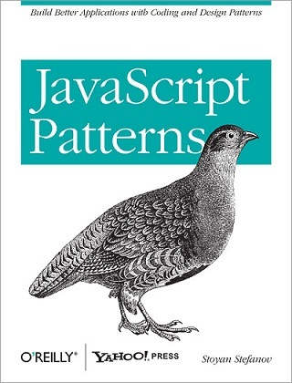

# 介绍

# JavaScript Patterns

**“JavaScript patterns”中译本** - 《JavaScript 模式》

*   作者：[Stoyan Stefanov](http://www.phpied.com/)
*   翻译：[拔赤](http://jayli.github.com/)、[goddyzhao](http://goddyzhao.me)、[TooBug](http://www.toobug.net)

偷懒是程序员的优良品质，模式则是先人们总结的偷懒招式。Stoyan Stefanov 的这本书，从 JavaScript 的实际使用场景出发，提炼了不少可以让前端们偷懒的实用招式。模式的探索、创新，将永远是程序员自我提升的一条修炼之道。值得一读。

# 目录

## 第一章 概述

*   模式
*   JavaScript：概念
    *   面向对象
    *   无类
    *   原型
    *   运行环境
*   ECMAScript 5
*   JSLint
*   控制台工具

## 第二章 高质量 JavaScript 基本要点

*   编写可维护的代码
*   减少全局对象
    *   全局对象带来的困扰
    *   忘记 var 时的副作用
    *   访问全局对象
    *   单 var 模式
    *   声明提前：分散的 var 带来的问题
*   for 循环
*   for-in 循环
*   （不）扩充内置原型
*   switch 模式
*   避免隐式类型转换
    *   避免使用 eval()
*   使用 parseInt()进行数字转换
*   编码风格
    *   缩进
    *   花括号
    *   左花括号的放置
    *   空格
*   命名规范
    *   构造器命名中的大小写
    *   单词分隔
    *   其他命名风格
*   书写注释
*   书写 API 文档
    *   一个例子：YUIDoc
*   编写易读的代码
*   相互评审
*   生产环境中的代码压缩（Minify）
*   运行 JSLint
*   小结

## 第三章 直接量和构造函数

*   对象直接量
    *   对象直接量语法
    *   通过构造函数创建对象
    *   获得对象的构造器
*   自定义构造函数
    *   构造函数的返回值
*   强制使用 new 的模式
    *   命名约定
    *   使用 that
    *   调用自身的构造函数
*   数组直接量
    *   数组直接量语法
    *   有意思的数组构造器
    *   检查是不是数组
*   JSON
    *   使用 JSON
*   正则表达式直接量
    *   正则表达式直接量语法
*   原始值的包装对象
*   Error 对象
*   小结

## 第四章 函数

*   背景知识
    *   术语释义
    *   声明 vs 表达式：命名与提前
    *   函数的 name 属性
    *   函数提前
*   回调模式
    *   一个回调的例子
    *   回调和作用域
    *   异步事件监听
    *   超时
    *   库中的回调
*   返回函数
*   自定义函数
*   立即执行的函数
    *   立即执行的函数的参数
    *   立即执行的函数的返回值
    *   好处和用法
*   立即初始化的对象
*   条件初始化
*   函数属性——Memoization 模式
*   配置对象
*   柯里化 （Curry）
    *   函数应用
    *   部分应用
    *   柯里化
    *   什么时候使用柯里化
*   小结

## 第五章 对象创建模式

*   命名空间模式
    *   通用的命名空间函数
*   声明依赖
*   私有属性和方法
    *   私有成员
    *   特权方法
    *   私有化失败
    *   对象直接量及其私有成员
    *   原型及其私有成员
    *   将私有函数暴露为共有方法
*   模块模式
    *   暴露模块模式
    *   创建构造器的模块
    *   在模块中引入全局上下文
*   沙箱模式
    *   全局构造函数
    *   添加模块
    *   实现这个构造函数
*   静态成员
    *   共有静态成员
    *   私有静态成员
*   对象常量
*   链式调用模式
    *   链式调用模式的利弊
*   method() 方法
*   小节

## 第六章 代码复用模式

*   类式继承 vs 现代继承模式
*   类式继承的期望结果
*   类式继承 1 ——默认模式
    *   跟踪原型链
    *   这种模式的缺点
*   类式继承 2 ——借用构造函数
    *   原型链
    *   利用借用构造函数模式实现多继承
    *   借用构造函数的利与弊
*   类式继承 3 ——借用并设置原型
*   类式继承 4 ——共享原型
*   类式继承 5 —— 临时构造函数
    *   存储父类
    *   重置构造函数引用
*   Klass
*   原型继承
    *   讨论
    *   例外的 ECMAScript 5
*   通过复制属性继承
*   混元（Mix-ins）
*   借用方法
    *   例：从数组借用
    *   借用并绑定
    *   Function.prototype.bind()
*   小结

## 第七章 设计模式

*   单例
    *   使用 new
    *   将实例放到静态属性中
    *   将实例放到闭包中
*   工厂模式
    *   内置对象工厂
*   迭代器
*   装饰器
    *   用法
    *   实现
    *   使用列表实现
*   策略模式
    *   数据验证示例
*   外观模式
*   代理模式
    *   一个例子
*   中介者模式
    *   中介者示例
*   观察者模式
    *   例 1：杂志订阅
    *   例 2：按键游戏
*   小结

## 第八章 DOM 和浏览器模式

*   分离关注点
*   DOM 脚本编程
    *   DOM 访问
    *   DOM 操作
*   事件
    *   事件处理
    *   事件委托
*   长时间运行的脚本
    *   setTimeout()
    *   Web Workers
*   远程脚本
    *   XMLHttpRequest
    *   JSONP
    *   Frame 和 Image 加载指示器
*   部署 JavaScript
    *   合并脚本
    *   代码减肥和压缩
    *   过期头
    *   使用 CDN
*   加载策略
    *   script 标签的位置
    *   HTTP 分块
    *   动态插入 script 标签非阻塞载入脚本
    *   延迟加载
    *   按需加载
    *   预加载
*   小节

## 索引