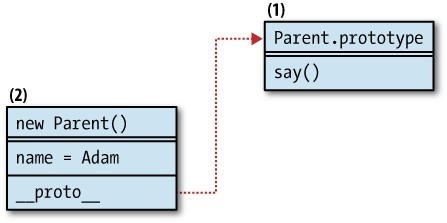
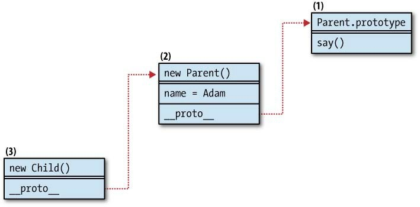
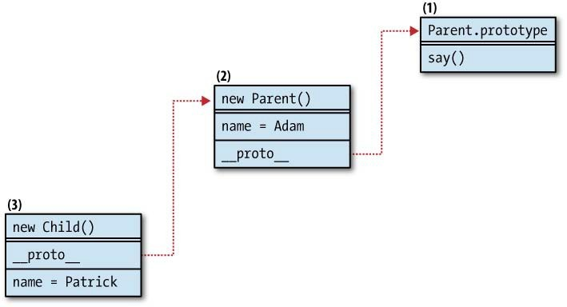
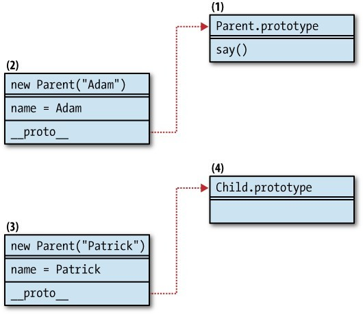
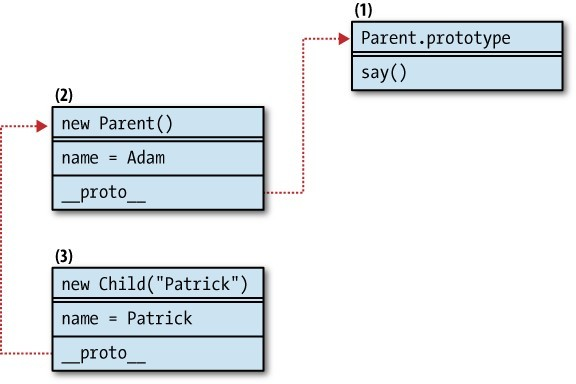
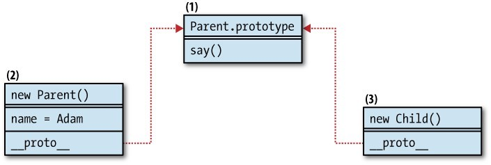
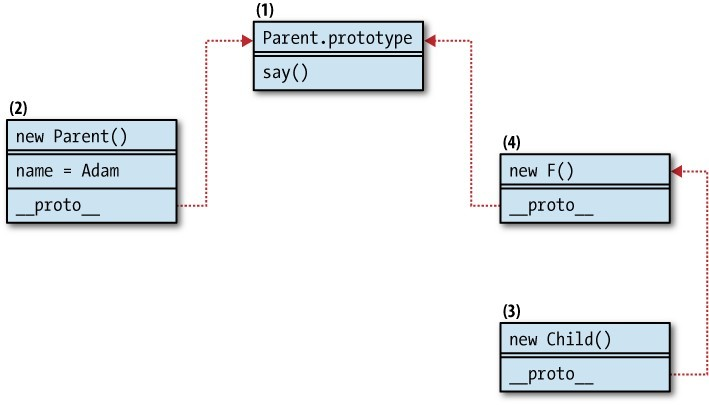
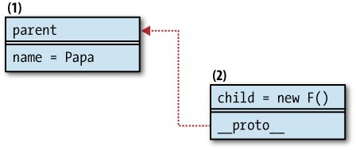

# 第六章 代码复用模式

# 代码复用模式

代码复用是一个既重要又有趣的话题，因为努力在自己或者别人写的代码上写尽量少且可以复用的代码是件很自然的事情，尤其当这些代码是经过测试的、可维护的、可扩展的、有文档的时候。

当我们说到代码复用的时候，想到的第一件事就是继承，本章会有很大篇幅讲述这个话题。你将看到好多种方法来实现“类式（classical）”和一些其它方式的继承。但是，最最重要的事情，是你需要记住终极目标——代码复用。继承是达到这个目标的一种方法，但是不是唯一的。在本章，你将看到怎样基于其它对象来构建新对象，怎样使用混元，以及怎样在不使用继承的情况下只复用你需要的功能。

在做代码复用的工作的时候，谨记 Gang of Four 在书中给出的关于对象创建的建议：“优先使用对象创建而不是类继承”。（译注：《设计模式：可复用面向对象软件的基础》（Design Patterns: Elements of Reusable Object-Oriented Software）是一本设计模式的经典书籍，该书作者为 Erich Gamma、Richard Helm、Ralph Johnson 和 John Vlissides，被称为“Gang of Four”，简称“GoF”。）

## 类式继承 vs 现代继承模式

在讨论 JavaScript 的继承这个话题的时候，经常会听到“类式继承”的概念，那我们先看一下什么是类式（classical）继承。classical 一词并不是来自某些古老的、固定的或者是被广泛接受的解决方案，而仅仅是来自单词“class”。（译注：classical 也有“经典”的意思。）

很多编程语言都有原生的类的概念，作为对象的蓝本。在这些语言中，每个对象都是一个指定类的实例（instance），并且（以 Java 为例）一个对象不能在不存在对应的类的情况下存在。在 JavaScript 中，因为没有类，所以类的实例的概念没什么意义。JavaScript 的对象仅仅是简单的键值对，这些键值对都可以动态创建或者是改变。

但是 JavaScript 拥有构造函数（constructor functions），并且有语法和使用类非常相似的 new 运算符。

在 Java 中你可能会这样写：

```js
Person adam = new Person(); 
```

在 JavaScript 中你可以这样：

```js
var adam = new Person(); 
```

除了 Java 是强类型语言需要给 adam 添加类型 Person 外，其它的语法看起来是一样的。JavaScript 的创建函数调用看起来感觉 Person 是一个类，但事实上，Person 仅仅是一个函数。语法上的相似使得非常多的开发者陷入对 JavaScript 类的思考，并且给出了很多模拟类的继承方案。这样的实现方式，我们叫它“类式继承”。顺便也提一下，所谓“现代”继承模式是指那些不需要你去想类这个概念的模式。

当需要给项目选择一个继承模式时，有不少的备选方案。你应该尽量选择那些现代继承模式，除非团队已经觉得“无类不欢”。

本章先讨论类式继承，然后再关注现代继承模式。

## 类式继承的期望结果

实现类式继承的目标是基于构造函数 Child()来创建一个对象，然后从另一个构造函数 Parent()获得属性。

> 尽管我们是在讨论类式继承，但还是尽量避免使用“类”这个词。“构造函数”或者“constructor”虽然更长，但是更准确，不会让人迷惑。通常情况下，应该努力避免在跟团队沟通的时候使用“类”这个词，因为在 JavaScript 中，很可能每个人都会有不同的理解。

下面是定义两个构造函数 Parent()和 Child()的例子：

```js
//parent 构造函数
function Parent(name) {
    this.name = name || 'Adam';
}

//给原型增加方法
Parent.prototype.say = function () {
    return this.name;
};

//空的 child 构造函数
function Child(name) {}

//继承
inherit(Child, Parent); 
```

上面的代码定义了两个构造函数 Parent()和 Child()，say()方法被添加到了 Parent()构建函数的原型（prototype）中，inherit()函数完成了继承的工作。inherit()函数并不是原生提供的，需要自己实现。让我们来看一看比较大众的实现它的几种方法。

## 类式继承 1——默认模式

最常用的一种模式是使用 Parent()构造函数来创建一个对象，然后把这个对象设为 Child()的原型。这是可复用的 inherit()函数的第一种实现方法：

```js
function inherit(C, P) {
    C.prototype = new P();
} 
```

需要强调的是原型（prototype 属性）应该指向一个对象，而不是函数，所以它需要指向由父构造函数创建的实例（对象），而不是构造函数自己。换句话说，请注意 new 运算符，有了它这种模式才可以正常工作。

之后在应用中使用 new Child()创建对象的时候，它将通过原型拥有 Parent()实例的功能，像下面的例子一样：

```js
var kid = new Child();
kid.say(); // "Adam" 
```

### 跟踪原型链

在这种模式中，子对象既继承了（父对象）“自己的属性”（添加给 this 的实例属性，比如 name），也继承了原型中的属性和方法（比如 say()）。

我们来看一下在这种继承模式中原型链是怎么工作的。为了讨论方便，我们假设对象是内在中的一块空间，它包含数据和指向其它空间的引用。当使用 new Parent()创建一个对象时，这样的一块空间就被分配了（图 6-1 中的 2 号）。它保存着 name 属性的数据。如果你尝试访问 say()方法（比如通过(new Parent).say()），2 号空间中并没有这个方法。但是在通过隐藏的链接**proto**指向 Parent()构建函数的原型 prototype 属性时，就可以访问到包含 say()方法的 1 号空间（Parent.prototype）了。所有的这一块都是在幕后发生的，不需要任何额外的操作，但是知道它是怎样工作的以及你正在访问或者修正的数据在哪是很重要的。注意，**proto**在这里只是为了解释原型链，这个属性在语言本身中是不可用的，尽管有一些环境提供了（比如 Firefox）。



图 6-1 Parent()构造函数的原型链

现在我们来看一下在使用 inherit()函数之后再使用 var kid = new Child()创建一个新对象时会发生什么。见图 6-2。



图 6-2 继承后的原型链

Child()构造函数是空的，也没有属性添加到 Child.prototype 上，这样，使用 new Child()创建出来的对象都是空的，除了有隐藏的链接**proto**。在这个例子中，**proto**指向在 inherit()函数中创建的 new Parent()对象。

现在使用 kid.say()时会发生什么？3 号对象没有这个方法，所以通过原型链找到 2 号。2 号对象也没有这个方法，所以也通过原型链找到 1 号，刚好有这个方法。接下来 say()方法引用了 this.name，这个变量也需要解析。于是沿原型链查找的过程又走了一遍。在这个例子中，this 指向 3 号对象，它没有 name 属性。然后 2 号对象被访问，并且有 name 属性，值为“Adam”。

最后，我们多看一点东西，假如我们有如下的代码：

```js
var kid = new Child();
kid.name = "Patrick";
kid.say(); // "Patrick" 
```

图 6-3 展现了这个例子的原型链：



图 6-3 继承并且给子对象添加属性后的原型链

设定 kid.name 并没有改变 2 号对象的 name 属性，但是它直接在 3 号对象上添加了自己的 name 属性。当 kid.say()执行时，say 方法在 3 号对象中找，然后是 2 号，最后到 1 号，像前面说的一样。但是这一次在找 this.name（和 kid.name 一样）时很快，因为这个属性在 3 号对象中就被找到了。

如果通过 delete kid.name 的方式移除新添加的属性，那么 2 号对象的 name 属性将暴露出来并且在查找的时候被找到。

### 这种模式的缺点

这种模式的一个缺点是既继承了（父对象）“自己的属性”，也继承了原型中的属性。大部分情况下你可能并不需要“自己的属性”，因为它们更可能是为实例对象添加的，并不用于复用。

> 一个在构造函数上常用的规则是，用于复用的成员（译注：属性和方法）应该被添加到原型上。

在使用这个 inherit()函数时另外一个不便是它不能够让你传参数给子构造函数，这些参数有可能是想再传给父构造函数的。考虑下面的例子：

```js
var s = new Child('Seth');
s.say(); // "Adam" 
```

这并不是我们期望的结果。事实上传递参数给父构造函数是可能的，但这样需要在每次需要一个子对象时再做一次继承，很不方便，因为需要不断地创建父对象。

## 类式继承 2——借用构造函数

下面这种模式解决了从子对象传递参数到父对象的问题。它借用了父对象的构造函数，将子对象绑定到 this，同时传入参数：

```js
function Child(a, c, b, d) {
    Parent.apply(this, arguments);
} 
```

使用这种模式时，只能继承在父对象的构造函数中添加到 this 的属性，不能继承原型上的成员。

使用借用构造函数的模式，子对象通过复制的方式继承父对象的成员，而不是像类式继承 1 中那样获得引用。下面的例子展示了这两者的不同：

```js
//父构造函数
function Article() {
    this.tags = ['js', 'css'];
}
var article = new Article();

//BlogPost 通过类式继承 1（默认模式）从 article 继承
function BlogPost() {}
BlogPost.prototype = article;
var blog = new BlogPost();
//注意你不需要使用`new Article()`，因为已经有一个实例了

//StaticPage 通过借用构造函数的方式从 Article 继承
function StaticPage() {
    Article.call(this);
}
var page = new StaticPage();

alert(article.hasOwnProperty('tags')); // true
alert(blog.hasOwnProperty('tags')); // false
alert(page.hasOwnProperty('tags')); // true 
```

在上面的代码片段中，Article()被两种方式分别继承。默认模式使 blog 可以通过原型链访问到 tags 属性，所以它自己并没有 tags 属性，hasOwnProperty()返回 false。page 对象有自己的 tags 属性，因为它是使用借用构造函数的方式继承，复制（而不是引用）了 tags 属性。

注意在修改继承后的 tags 属性时的不同：

```js
blog.tags.push('html');
page.tags.push('php');
alert(article.tags.join(', ')); // "js, css, html" 
```

在这个例子中，blog 对象修改了 tags 属性，同时，它也修改了父对象，因为实际上 blog.tags 和 article.tags 是引向同一个数组。而对 pages.tags 的修改并不影响父对象 article，因为 pages.tags 在继承的时候是一份独立的拷贝。

### 原型链

我们来看一下当我们使用熟悉的 Parent()和 Child()构造函数和这种继承模式时原型链是什么样的。为了使用这种继承模式，Child()有明显变化：

```js
//父构造函数
function Parent(name) {
    this.name = name || 'Adam';
}

//在原型上添加方法
Parent.prototype.say = function () {
    return this.name;
};

//子构造函数
function Child(name) {
    Parent.apply(this, arguments);
}

var kid = new Child("Patrick");
    kid.name; // "Patrick"
typeof kid.say; // "undefined" 
```

如果看一下图 6-4，就能发现 new Child 对象和 Parent 之间不再有链接。这是因为 Child.prototype 根本就没有被使用，它指向一个空对象。使用这种模式，kid 拥有了自己的 name 属性，但是并没有继承 say()方法，如果尝试调用它的话会出错。这种继承方式只是一种一次性地将父对象的属性复制为子对象的属性，并没有**proto**链接。



图 6-4 使用借用构造函数模式时没有被关联的原型链

### 利用借用构造函数模式实现多继承

使用借用构造函数模式，可以通过借用多个构造函数的方式来实现多继承：

```js
function Cat() {
    this.legs = 4;
    this.say = function () {
        return "meaowww";
    }
}

function Bird() {
    this.wings = 2;
    this.fly = true;
}

function CatWings() {
    Cat.apply(this);
    Bird.apply(this);
}

var jane = new CatWings();
console.dir(jane); 
```

结果如图 6-5，任何重复的属性都会以最后的一个值为准。


图 6-5 在 Firebug 中查看 CatWings 对象

### 借用构造函数的利与弊

这种模式的一个明显的弊端就是无法继承原型。如前面所说，原型往往是添加可复用的方法和属性的地方，这样就不用在每个实例中再创建一遍。

这种模式的一个好处是获得了父对象自己成员的拷贝，不存在子对象意外改写父对象属性的风险。

那么，在上一个例子中，怎样使一个子对象也能够继承原型属性呢？怎样能使 kid 可以访问到 say()方法呢？下一种继承模式解决了这个问题。

## 类式继承 3——借用并设置原型

综合以上两种模式，首先借用父对象的构造函数，然后将子对象的原型设置为父对象的一个新实例：

```js
function Child(a, c, b, d) {
    Parent.apply(this, arguments);
}
Child.prototype = new Parent(); 
```

这样做的好处是子对象获得了父对象自己的成员，也获得了父对象中可复用的（在原型中实现的）方法。子对象也可以传递任何参数给父构造函数。这种行为可能是最接近 Java 的，子对象继承了父对象的所有东西，同时可以安全地修改自己的属性而不用担心修改到父对象。

一个弊端是父构造函数被调用了两次，所以不是很高效。最后，（父对象）自己的属性（比如这个例子中的 name）也被继承了两次。

我们来看一下代码并做一些测试：

```js
//父构造函数
function Parent(name) {
    this.name = name || 'Adam';
}

//在原型上添加方法
Parent.prototype.say = function () {
    return this.name;
};

//子构造函数
function Child(name) {
    Parent.apply(this, arguments);
}
Child.prototype = new Parent();

var kid = new Child("Patrick");
kid.name; // "Patrick"
kid.say(); // "Patrick"
delete kid.name;
kid.say(); // "Adam" 
```

跟前一种模式不一样，现在 say()方法被正确地继承了。可以看到 name 也被继承了两次，在删除掉自己的拷贝后，在原型链上的另一个就被暴露出来了。

图 6-6 展示了这些对象之间的关系。这些关系有点像图 6-3 中展示的，但是获得这种关系的方法是不一样的。



图 6-6 除了继承“自己的属性”外，原型链也被保留了

## 类式继承 4——共享原型

不像前一种类式继承模式需要调用两次父构造函数，下面这种模式根本不会涉及到调用父构造函数的问题。

一般的经验是将可复用的成员放入原型中而不是 this。从继承的角度来看，则是任何应该被继承的成员都应该放入原型中。这样你只需要设定子对象的原型和父对象的原型一样即可：

```js
function inherit(C, P) {
    C.prototype = P.prototype;
} 
```

这种模式的原型链很短并且查找很快，因为所有的对象实际上共享着同一个原型。但是这样也有弊端，那就是如果子对象或者在继承关系中的某个地方的任何一个子对象修改这个原型，将影响所有的继承关系中的父对象。（译注：这里应该是指会影响到所有从这个原型中继承的对象。）

如图 6-7，子对象和父对象共享同一个原型，都可以访问 say()方法。但是，子对象不继承 name 属性。



图 6-7 （父子对象）共享原型时的关系

## 类式继承 5——临时构造函数

下一种模式通过打断父对象和子对象原型的直接链接解决了共享原型时的问题，同时还从原型链中获得其它的好处。

下面是这种模式的一种实现方式，F()函数是一个空函数，它充当了子对象和父对象的代理。F()的 prototype 属性指向父对象的原型。子对象的原型是一这个空函数的一个实例：

```js
function inherit(C, P) {
    var F = function () {};
    F.prototype = P.prototype;
    C.prototype = new F();
} 
```

这种模式有一种和默认模式（类式继承 1）明显不一样的行为，因为在这里子对象只继承原型中的属性（图 6-8）。



图 6-8 使用临时（代理）构造函数 F()实现类式继承

这种模式通常情况下都是一种很棒的选择，因为原型本来就是存放复用成员的地方。在这种模式中，父构造函数添加到 this 中的任何成员都不会被继承。

我们来创建一个子对象并且检查一下它的行为：

```js
var kid = new Child(); 
```

如果你访问 kid.name 将得到 undefined。在这个例子中，name 是父对象自己的属性，而在继承的过程中我们并没有调用 new Parent()，所以这个属性并没有被创建。当访问 kid.say()时，它在 3 号对象中不可用，所以在原型链中查找，4 号对象也没有，但是 1 号对象有，它在内在中的位置会被所有从 Parent()创建的构造函数和子对象所共享。

### 存储父类（Superclass）

在上一种模式的基础上，还可以添加一个指向原始父对象的引用。这很像其它语言中访问超类（superclass）的情况，有时候很方便。

我们将这个属性命名为“uber”，因为“super”是一个保留字，而“superclass”则可能误导别人认为 JavaScript 拥有类。下面是这种类式继承模式的一个改进版实现：

```js
function inherit(C, P) {
    var F = function () {};
    F.prototype = P.prototype;
    C.prototype = new F();
    C.uber = P.prototype;
} 
```

### 重置构造函数引用

这个近乎完美的模式上还需要做的最后一件事情就是重置构造函数（constructor）的指向，以便未来在某个时刻能被正确地使用。

如果不重置构造函数的指向，那所有的子对象都会认为 Parent()是它们的构造函数，而这个结果完全没有用。使用前面的 inherit()的实现，你可以观察到这种行为：

```js
// parent, child, inheritance
function Parent() {}
function Child() {}
inherit(Child, Parent);

// testing the waters
var kid = new Child();
kid.constructor.name; // "Parent"
kid.constructor === Parent; // true 
```

constructor 属性很少用，但是在运行时检查对象很方便。你可以重新将它指向期望的构造函数而不影响功能，因为这个属性更多是“信息性”的。（译注：即它更多的时候是在提供信息而不是参与到函数功能中。）

最终，这种类式继承的 Holy Grail 版本看起来是这样的：

```js
function inherit(C, P) {
    var F = function () {};
    F.prototype = P.prototype;
    C.prototype = new F();
    C.uber = P.prototype;
    C.prototype.constructor = C;
} 
```

类似这样的函数也存在于 YUI 库（也许还有其它库）中，它将类式继承的方法带给了没有类的语言。如果你决定使用类式继承，那么这是最好的方法。

> “代理函数”或者“代理构造函数”也是指这种模式，因为临时构造函数是被用作获取父构造函数原型的代理。

一种常见的对 Holy Grail 模式的优化是避免每次需要继承的时候都创建一个临时（代理）构造函数。事实上创建一次就足够了，以后只需要修改它的原型即可。你可以用一个立即执行的函数来将代理函数存储到闭包中：

```js
var inherit = (function () {
    var F = function () {};
    return function (C, P) {
        F.prototype = P.prototype;
        C.prototype = new F();
        C.uber = P.prototype;
        C.prototype.constructor = C;
    }
}()); 
```

## Klass

有很多 JavaScript 类库模拟了类，创造了新的语法糖。具体的实现方式可能会不一样，但是基本上都有一些共性，包括：

*   有一个约定好名字的方法，如 initialize、_init 或者其它相似的名字，会被自动调用，来充当类的构造函数。
*   类可以从其它类继承
*   在子类中可以访问到父类（superclass）

> 我们在这里做一下变化，在本章的这部分自由地使用“class”单词，因为主题就是模拟类。

为避免讨论太多细节，我们来看一下 JavaScript 中一种模拟类的实现。首先，这种解决方案从客户的角度来看将如何被使用？

```js
var Man = klass(null, {
    __construct: function (what) {
        console.log("Man's constructor");
        this.name = what;
    },
    getName: function () {
        return this.name;
    }
}); 
```

这种语法糖的形式是一个名为 klass()的函数。在一些实现方式中，它可能是 Klass()构造函数或者是增强的 Object.prototype，但是在这个例子中，我们让它只是一个简单的函数。

这个函数接受两个参数：一个被继承的类和通过对象字面量提供的新类的实现。受 PHP 的影响，我们约定类的构造函数必须是一个名为 __construct 的方法。在前面的代码片段中，建立了一个名为 Man 的新类，并且它不继承任何类（意味着继承自 Object）。Man 类有一个在 __construct 建立的自己的属性 name 和一个方法 getName()。这个类是一个构造函数，所以下面的代码将正常工作（并且看起来像类实例化的过程）：

```js
var first = new Man('Adam'); // logs "Man's constructor"
first.getName(); // "Adam" 
```

现在我们来扩展这个类，创建一个 SuperMan 类：

```js
var SuperMan = klass(Man, {
    __construct: function (what) {
        console.log("SuperMan's constructor");
    },
    getName: function () {
        var name = SuperMan.uber.getName.call(this);
        return "I am " + name;
    }
}); 
```

这里，klass()的第一个参数是将被继承的 Man 类。值得注意的是，在 getName()中，父类的 getName()方法首先通过 SuperMan 类的 uber 静态属性被调用。我们来测试一下：

```js
var clark = new SuperMan('Clark Kent');
clark.getName(); // "I am Clark Kent" 
```

第一行在 console 中记录了“Man's constructor”，然后是“Superman's constructor”。在一些语言中，父类的构造函数在子类构造函数被调用的时候会自动执行，这个特性也可以模拟。

用 instanceof 运算符测试返回希望的结果：

```js
clark instanceof Man; // true
clark instanceof SuperMan; // true 
```

最后，我们来看一下 klass()函数是怎样实现的：

```js
var klass = function (Parent, props) {

    var Child, F, i;

    // 1.
    // new constructor
    Child = function () {
        if (Child.uber && Child.uber.hasOwnProperty("__construct")) {
            Child.uber.__construct.apply(this, arguments);
        }
        if (Child.prototype.hasOwnProperty("__construct")) {
            Child.prototype.__construct.apply(this, arguments);
        }
    };

    // 2.
    // inherit
    Parent = Parent || Object;
    F = function () {};
    F.prototype = Parent.prototype;
    Child.prototype = new F();
    Child.uber = Parent.prototype;
    Child.prototype.constructor = Child;

    // 3.
    // add implementation methods
    for (i in props) {
        if (props.hasOwnProperty(i)) {
            Child.prototype[i] = props[i];
        }
    }

    // return the "class"
    return Child;
}; 
```

这个 klass()实现有三个明显的部分：

1.  创建 Child()构造函数，这也是最后返回的将被作为类使用的函数。在这个函数里面，如果 __construct 方法存在的话将被调用。同样是在父类的 __construct（如果存在）被调用前使用静态的 uber 属性。也可能存在 uber 没有定义的情况——比如从 Object 继承，因为它是在 Man 类中被定义的。
2.  第二部分主要完成继承。只是简单地使用前面章节讨论过的 Holy Grail 类式继承模式。只有一个东西是新的：如果 Parent 没有传值的话，设定 Parent 为 Object。
3.  最后一部分是类真正定义的地方，循环需要实现的方法（如例子中的 __constructt 和 getName），并将它们添加到 Child 的原型中。

什么时候使用这种模式？其实，最好是能避免则避免，因为它带来了在这门语言中不存在的完整的类的概念，会让人疑惑。使用它需要学习新的语法和新的规则。也就是说，如果你或者你的团队对类感到习惯并且同时对原型感到不习惯，这种模式可能是一个可以探索的方向。这种模式允许你完全忘掉原型，好处就是你可以将语法变种得像其它你所喜欢的语言一样。

## 原型继承

现在，让我们从一个叫作“原型继承”的模式来讨论没有类的现代继承模式。在这种模式中，没有任何类进来，在这里，一个对象继承自另外一个对象。你可以这样理解它：你有一个想复用的对象，然后你想创建第二个对象，并且获得第一个对象的功能。下面是这种模式的用法：

```js
//需要继承的对象
var parent = {
    name: "Papa"
};

//新对象
var child = object(parent);

//测试
alert(child.name); // "Papa" 
```

在这个代码片段中，有一个已经存在的使用对象字面量创建的对象叫 parent，我们想创建一个和 parent 有相同的属性和方法的对象叫 child。child 对象使用 object()函数创建。这个函数在 JavaScript 中并不存在（不要与构造函数 Object()混淆），所以我们来看看怎样定义它。

与 Holy Grail 类式继承相似，可以使用一个空的临时构造函数 F()，然后设定 F()的原型为 parent 对象。最后，返回一个临时构造函数的新实例。

```js
function object(o) {
    function F() {}
    F.prototype = o;
    return new F();
} 
```

图 6-9 展示了使用原型继承时的原型链。在这里 child 总是以一个空对象开始，它没有自己的属性但通过原型链（__proto__）拥有父对象的所有功能。



图 6-9 原型继承模式

### 讨论

在原型继承模式中，parent 不需要使用对象字面量来创建。（尽管这是一种更觉的方式。）可以使用构造函数来创建 parent。注意，如果你这样做，那么自己的属性和原型上的属性都将被继承：

```js
// parent constructor
function Person() {
    // an "own" property
    this.name = "Adam";
}
// a property added to the prototype
Person.prototype.getName = function () {
    return this.name;
};

// create a new person
var papa = new Person();
// inherit
var kid = object(papa);

// test that both the own property
// and the prototype property were inherited
kid.getName(); // "Adam" 
```

在这种模式的另一个变种中，你可以选择只继承已存在的构造函数的原型对象。记住，对象继承自对象，不管父对象是怎么创建的。这是前面例子的一个修改版本：

```js
// parent constructor
function Person() {
    // an "own" property
    this.name = "Adam";
}
// a property added to the prototype
Person.prototype.getName = function () {

};

// inherit
var kid = object(Person.prototype);

typeof kid.getName; // "function", because it was in the prototype
typeof kid.name; // "undefined", because only the prototype was inherited 
```

### 例外的 ECMAScript 5

在 ECMAScript 5 中，原型继承已经正式成为语言的一部分。这种模式使用 Object.create 方法来实现。换句话说，你不再需要自己去写类似 object()的函数，它是语言原生的了：

```js
var child = Object.create(parent); 
```

Object.create()接收一个额外的参数——一个对象。这个额外对象中的属性将被作为自己的属性添加到返回的子对象中。这让我们可以很方便地将继承和创建子对象在一个方法调用中实现。例如：

```js
var child = Object.create(parent, {
    age: { value: 2 } // ECMA5 descriptor
});
child.hasOwnProperty("age"); // true 
```

你可能也会发现原型继承模式已经在一些 JavaScript 类库中实现了，比如，在 YUI3 中，它是 Y.Object()方法：

```js
YUI().use('*', function (Y) {
    var child = Y.Object(parent);
}); 
```

## 通过复制属性继承

让我们来看一下另外一种继承模式——通过复制属性继承。在这种模式中，一个对象通过简单地复制另一个对象来获得功能。下面是一个简单的实现这种功能的 extend()函数：

```js
function extend(parent, child) {
    var i;
    child = child || {};
    for (i in parent) {
        if (parent.hasOwnProperty(i)) {
            child[i] = parent[i];
        }
    }
        return child;
} 
```

这是一个简单的实现，仅仅是遍历了父对象的成员然后复制它们。在这个实现中，child 是可选参数，如果它没有被传入一个已有的对象，那么一个全新的对象将被创建并被返回：

```js
var dad = {name: "Adam"};
var kid = extend(dad);
kid.name; // "Adam" 
```

上面给出的实现叫作对象的“浅拷贝”（shallow copy）。另一方面，“深拷贝”是指检查准备复制的属性本身是否是对象或者数组，如果是，也遍历它们的属性并复制。如果使用浅拷贝的话（因为在 JavaScript 中对象是按引用传递），如果你改变子对象的一个属性，而这个属性恰好是一个对象，那么你也会改变父对象。实际上这对方法来说可能很好（因为函数也是对象，也是按引用传递），但是当遇到其它的对象和数组的时候可能会有些意外情况。考虑这种情况：

```js
var dad = {
    counts: [1, 2, 3],
    reads: {paper: true}
};
var kid = extend(dad);
kid.counts.push(4);
dad.counts.toString(); // "1,2,3,4"
dad.reads === kid.reads; // true 
```

现在让我们来修改一下 extend()函数以便做深拷贝。所有你需要做的事情只是检查一个属性的类型是否是对象，如果是，则递归遍历它的属性。另外一个需要做的检查是这个对象是真的对象还是数组。我们可以使用第三章讨论过的数组检查方式。最终深拷贝版的 extend()是这样的：

```js
function extendDeep(parent, child) {
    var i,
        toStr = Object.prototype.toString,
        astr = "[object Array]";

    child = child || {};

    for (i in parent) {
        if (parent.hasOwnProperty(i)) {
            if (typeof parent[i] === "object") {
                child[i] = (toStr.call(parent[i]) === astr) ? [] : {};
                extendDeep(parent[i], child[i]);
            } else {
                child[i] = parent[i];
            }
        }
    }
    return child;
} 
```

现在测试时这个新的实现给了我们对象的真实拷贝，所以子对象不会修改父对象：

```js
var dad = {
    counts: [1, 2, 3],
    reads: {paper: true}
};
var kid = extendDeep(dad);

kid.counts.push(4);
kid.counts.toString(); // "1,2,3,4"
dad.counts.toString(); // "1,2,3"

dad.reads === kid.reads; // false
kid.reads.paper = false;
kid.reads.web = true;
dad.reads.paper; // true 
```

通过复制属性继承的模式很简单且应用很广泛。例如 Firebug（JavaScript 写的 Firefox 扩展）有一个方法叫 extend()做浅拷贝，jQuery 的 extend()方法做深拷贝。YUI3 提供了一个叫作 Y.clone()的方法，它创建一个深拷贝并且通过绑定到子对象的方式复制函数。（本章后面将有更多关于绑定的内容。）

这种模式并不高深，因为根本没有原型牵涉进来，而只跟对象和它们的属性有关。

## 混元（Mix-ins）

既然谈到了通过复制属性来继承，就让我们顺便多说一点，来讨论一下“混元”模式。除了前面说的从一个对象复制，你还可以从任意多数量的对象中复制属性，然后将它们混在一起组成一个新对象。

实现很简单，只需要遍历传入的每个参数然后复制它们的每个属性：

```js
function mix() {
    var arg, prop, child = {};
    for (arg = 0; arg < arguments.length; arg += 1) {
        for (prop in arguments[arg]) {
            if (arguments[arg].hasOwnProperty(prop)) {
                child[prop] = arguments[arg][prop];
            }
        }
    }
    return child;
} 
```

现在我们有了一个通用的混元函数，我们可以传递任意数量的对象进去，返回的结果将是一个包含所有传入对象属性的新对象。下面是用法示例：

```js
var cake = mix(
    {eggs: 2, large: true},
    {butter: 1, salted: true},
    {flour: "3 cups"},
    {sugar: "sure!"}
); 
```

图 6-10 展示了在 Firebug 的控制台中用 console.dir(cake)展示出来的混元后 cake 对象的属性。


图 6-10 在 Firebug 中查看 cake 对象

> 如果你习惯了某些将混元作为原生部分的语言，那么你可能期望修改一个或多个父对象时也影响子对象。但在这个实现中这是不会发生的事情。这里我们只是简单地遍历、复制自己的属性，并没有与父对象的链接。

## 借用方法

有时候会有这样的情况：你希望使用某个已存在的对象的一两个方法，你希望能复用它们，但是又真的不希望和那个对象产生继承关系，因为你只希望使用你需要的那一两个方法，而不继承那些你永远用不到的方法。受益于函数方法 call()和 apply()，通过借用方法模式，这是可行的。在本书中，你其实已经见过这种模式了，甚至在本章 extendDeep()的实现中也有用到。

如你所熟知的一样，在 JavaScript 中函数也是对象，它们有一些有趣的方法，比如 call()和 apply()。这两个方法的唯一区别是后者接受一个参数数组以传入正在调用的方法，而前者只接受一个一个的参数。你可以使用这两个方法来从已有的对象中借用方法：

```js
//call() example
notmyobj.doStuff.call(myobj, param1, p2, p3);
// apply() example
notmyobj.doStuff.apply(myobj, [param1, p2, p3]); 
```

在这个例子中有一个对象 myobj，而且 notmyobj 有一个用得着的方法叫 doStuff()。你可以简单地临时借用 doStuff()方法，而不用处理继承然后得到一堆 myobj 中你永远不会用的方法。

你传一个对象和任意的参数，这个被借用的方法会将 this 绑定到你自己的对象上。简单地说，你的对象会临时假装成另一个对象以使用它的方法。这就像实际上获得了继承但又免除了“继承税”（指你不需要的属性和方法）。

### 例：从数组借用

这种模式的一种常见用法是从数组借用方法。

数组有很多很有用但是一些“类数组”对象（如 arguments）不具备的方法。所以 arguments 可以借用数组的方法，比如 slice()。这是一个例子：

```js
function f() {
    var args = [].slice.call(arguments, 1, 3);
        return args;
    }

// example
f(1, 2, 3, 4, 5, 6); // returns [2,3] 
```

在这个例子中，有一个空数组被创建了，因为要借用它的方法。同样的事情也可以使用一种看起来代码更长的方法来做，那就是直接从数组的原型中借用方法，使用 Array.prototype.slice.call(...)。这种方法代码更长一些，但是不用创建一个空数组。

### 借用并绑定

当借用方法的时候，不管是通过 call()/apply()还是通过简单的赋值，方法中的 this 指向的对象都是基于调用的表达式来决定的。但是有时候最好的使用方式是将 this 的值锁定或者提前绑定到一个指定的对象上。

我们来看一个例子。这是一个对象 one，它有一个 say()方法：

```js
var one = {
    name: "object",
    say: function (greet) {
        return greet + ", " + this.name;
    }
};

// test
one.say('hi'); // "hi, object" 
```

现在另一个对象 two 没有 say()方法，但是它可以从 one 借用：

```js
var two = {
    name: "another object"
};

one.say.apply(two, ['hello']); // "hello, another object" 
```

在这个例子中，say()方法中的 this 指向了 two，this.name 是“another object”。但是如果在某些场景下你将 th 函数赋值给了全局变量或者是将这个函数作为回调，会发生什么？在客户端编程中有非常多的事件和回调，所以这种情况经常发生：

```js
// assigning to a variable
// `this` will point to the global object
var say = one.say;
say('hoho'); // "hoho, undefined"

// passing as a callback
var yetanother = {
    name: "Yet another object",
    method: function (callback) {
        return callback('Hola');
    }
};
yetanother.method(one.say); // "Holla, undefined" 
```

在这两种情况中 say()中的 this 都指向了全局对象，所以代码并不像我们想象的那样正常工作。要修复（换言之，绑定）一个方法的对象，我们可以用一个简单的函数，像这样：

```js
function bind(o, m) {
    return function () {
        return m.apply(o, [].slice.call(arguments));
    };
} 
```

这个 bind()函数接受一个对象 o 和一个方法 m，然后把它们绑定在一起，再返回另一个函数。返回的函数通过闭包可以访问到 o 和 m。也就是说，即使在 bind()返回之后，内层的函数仍然可以访问到 o 和 m，而 o 和 m 会始终指向原始的对象和方法。让我们用 bind()来创建一个新函数：

```js
var twosay = bind(two, one.say);
twosay('yo'); // "yo, another object" 
```

正如你看到的，尽管 twosay()是作为一个全局函数被创建的，但 this 并没有指向全局对象，而是指向了通过 bind()传入的对象 two。不论无何调用 twosay()，this 将始终指向 two。

绑定是奢侈的，你需要付出的代价是一个额外的闭包。

### Function.prototype.bind()

ECMAScript5 在 Function.prototype 中添加了一个方法叫 bind()，使用时和 apply 和 call()一样简单。所以你可以这样写：

```js
var newFunc = obj.someFunc.bind(myobj, 1, 2, 3); 
```

这意味着将 someFunc()主 myobj 绑定了并且传入了 someFunc()的前三个参数。这也是一个在第四章讨论过的部分应用的例子。

让我们来看一下当你的程序跑在低于 ES5 的环境中时如何实现 Function.prototype.bind()：

```js
if (typeof Function.prototype.bind === "undefined") {
    Function.prototype.bind = function (thisArg) {
        var fn = this,
        slice = Array.prototype.slice,
        args = slice.call(arguments, 1);

        return function () {
            return fn.apply(thisArg, args.concat(slice.call(arguments)));
        };
    };
} 
```

这个实现可能看起来有点熟悉，它使用了部分应用，将传入 bind()的参数串起来（除了第一个参数），然后在被调用时传给 bind()返回的新函数。这是用法示例：

```js
var twosay2 = one.say.bind(two);
twosay2('Bonjour'); // "Bonjour, another object" 
```

在这个例子中，除了绑定的对象外，我们没有传任何参数给 bind()。下一个例子中，我们来传一个用于部分应用的参数：

```js
var twosay3 = one.say.bind(two, 'Enchanté');
twosay3(); // "Enchanté, another object" 
```

## 小结

在 JavaScript 中，继承有很多种方案可以选择。学习和理解不同的模式是有好处的，因为这可以增强你对这门语言的掌握能力。在本章中你看到了很多类式继承和现代继承的方案。

但是，也许在开发过程中继承并不是你经常面对的一个问题。这一部分是因为这个问题已经被使用某种方式或者某个你使用的类库解决了，另一部分是因为你不需要在 JavaScript 中建立很长很复杂的继承链。在静态强类型语言中，继承可能是唯一可以利用代码的方法，但在 JavaScript 中你可能有更多更简单更优化的方法，包括借用方法、绑定、复制属性、混元等。

记住，代码复用才是目标，继承只是达成这个目标的一种手段。