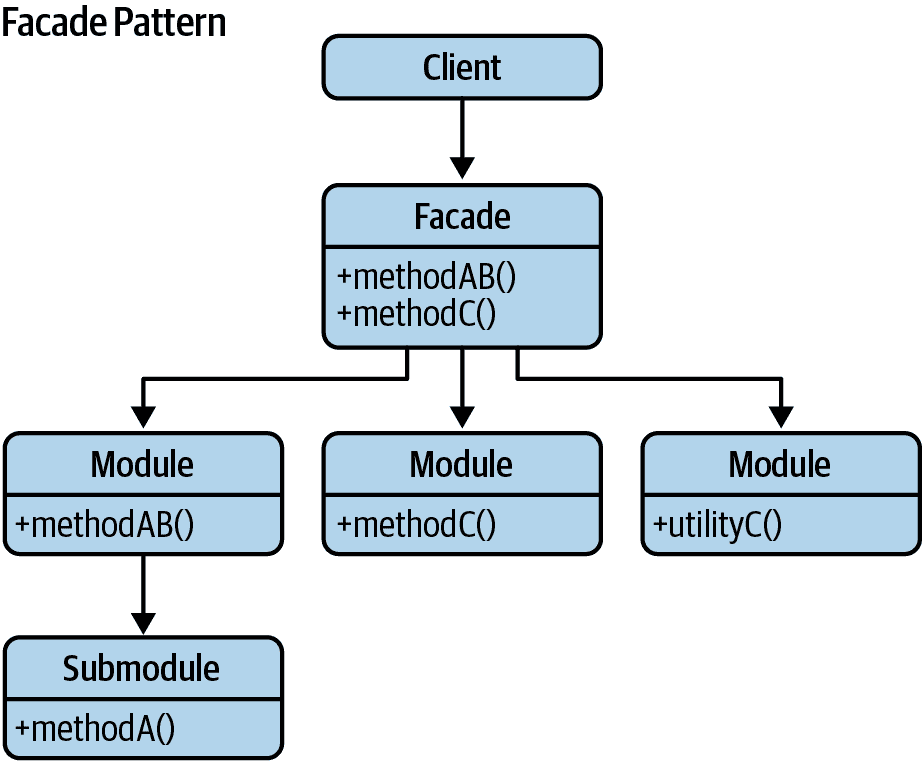
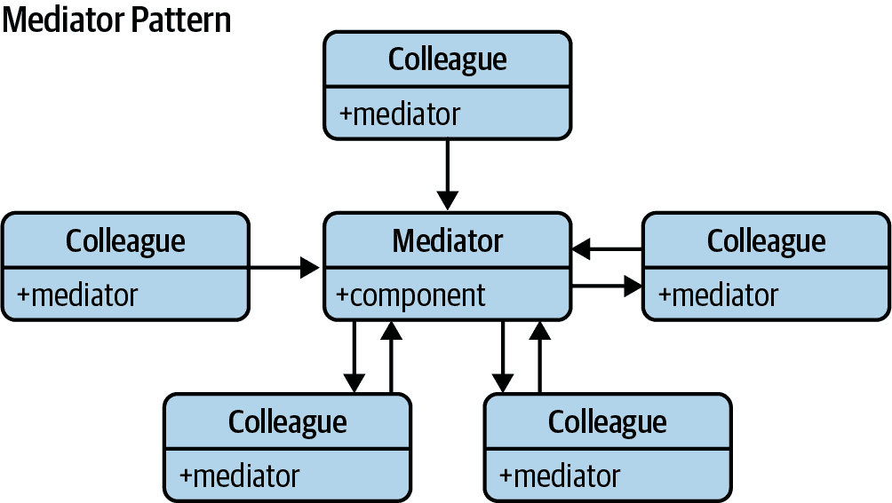

# 第七章：JavaScript 设计模式

上一章提供了三种不同类别设计模式的示例。其中一些设计模式在 Web 开发环境中是相关或必需的。我已经确定了一些可以在 JavaScript 中应用时有所帮助的经典模式。本章探讨了不同经典和现代设计模式的 JavaScript 实现。每个部分都专注于三个类别之一——创建型、结构型和行为型。让我们从创建型模式开始。

# 创建型模式

创建型模式提供了创建对象的机制。我们将涵盖以下模式：

+   “构造函数模式”

+   “模块模式”

+   “揭示模块模式”

+   “单例模式”

+   “原型模式”

+   “工厂模式”

# 构造函数模式

构造函数是一种特殊的方法，用于在为其分配内存后初始化新创建的对象。使用 ES2015+，引入了使用构造函数创建[类](https://oreil.ly/TjEI1)的语法到 JavaScript 中。这使得可以使用默认的[构造函数](https://oreil.ly/zNmUI)将对象创建为类的实例。

在 JavaScript 中，几乎所有东西都是对象，而类只是 JavaScript 原型继承的语法糖。在经典 JavaScript 中，我们通常对对象构造函数感兴趣。图 7-1 说明了这种模式。

###### 注意

对象构造函数用于创建特定类型的对象——为对象准备并在对象首次创建时接受参数以设置成员属性和方法的值。


###### 图 7-1 构造函数模式

## 对象创建

在 JavaScript 中创建新对象的三种常见方法如下：

```
// Each of the following options will create a new empty object
const newObject = {};

// or
const newObject = Object.create(Object.prototype);

// or
const newObject = new Object();
```

在这里，我们将每个对象声明为常量，这将创建一个只读的块级作用域变量。在最后一个示例中，`Object`构造函数为特定值创建一个对象包装器，或者在不传递值的情况下，它创建一个空对象并返回它。

现在，您可以通过以下方式为对象分配键和值：

```
// ECMAScript 3 compatible approaches

// 1\. Dot syntax

// Set properties
newObject.someKey = "Hello World";

// Get properties
var key = newObject.someKey;

// 2\. Square bracket syntax

// Set properties
newObject["someKey"] = "Hello World";

// Get properties
var key = newObject["someKey"];

// ECMAScript 5 only compatible approaches
// For more information see: http://kangax.github.com/es5-compat-table/

// 3\. Object.defineProperty

// Set properties
Object.defineProperty( newObject, "someKey", {
    value: "for more control of the property's behavior",
    writable: true,
    enumerable: true,
    configurable: true
});

// 4\. If this feels a little difficult to read, a short-hand could
// be written as follows:

var defineProp = function ( obj, key, value ){
  config.value = value;
  Object.defineProperty( obj, key, config );
};

// To use, we then create a new empty "person" object
var person = Object.create( null );

// Populate the object with properties
defineProp( person, "car",  "Delorean" );
defineProp( person, "dateOfBirth", "1981" );
defineProp( person, "hasBeard", false );

// 5\. Object.defineProperties

// Set properties
Object.defineProperties( newObject, {

  "someKey": {
    value: "Hello World",
    writable: true
  },

  "anotherKey": {
    value: "Foo bar",
    writable: false
  }

});

// Getting properties for 3\. and 4\. can be done using any of the
// options in 1\. and 2.
```

您甚至可以将这些方法用于继承，如下所示：

```
// ES2015+ keywords/syntax used: const
// Usage:

// Create a race car driver that inherits from the person object
const driver = Object.create(person);

// Set some properties for the driver
defineProp(driver, 'topSpeed', '100mph');

// Get an inherited property (1981)
console.log(driver.dateOfBirth);

// Get the property we set (100mph)
console.log(driver.topSpeed);
```

## 基本构造函数

正如在第五章中讨论的，JavaScript 类在 ES2015 中引入，允许我们为 JavaScript 对象定义模板并使用 JavaScript 实现封装和[继承](https://oreil.ly/VjSbn)。

总结一下，类必须包含并声明一个名为`constructor()`的方法，该方法将用于实例化一个新对象。关键字`new`允许我们调用构造函数。构造函数内部的关键字`this`引用创建的新对象。以下示例显示了一个基本构造函数：

```
class Car {
    constructor(model, year, miles) {
        this.model = model;
        this.year = year;
        this.miles = miles;
    }

    toString() {
        return `${this.model} has done ${this.miles} miles`;
    }
}

// Usage:

// We can create new instances of the car
let civic = new Car('Honda Civic', 2009, 20000);
let mondeo = new Car('Ford Mondeo', 2010, 5000);

// and then open our browser console to view the output of
// the toString() method being called on these objects
console.log(civic.toString());
console.log(mondeo.toString());
```

这是构造函数模式的一个简单版本，但存在一些问题。其中一个问题是它使得继承困难，另一个是像`toString()`这样的函数会为每个使用`Car`构造函数创建的新对象重新定义。这并不理想，因为`Car`类型的所有实例理想情况下应共享相同的函数。

## 带原型的构造函数

JavaScript 中的原型允许您轻松地为特定对象的所有实例定义方法，无论是函数还是类。当我们调用 JavaScript 构造函数来创建对象时，构造函数原型的所有属性都将对新对象可用。通过这种方式，可以拥有访问相同原型的多个`Car`对象。因此，可以扩展原始示例如下：

```
class Car {
    constructor(model, year, miles) {
        this.model = model;
        this.year = year;
        this.miles = miles;
    }
}

// Note here that we are using Object.prototype.newMethod rather than
// Object.prototype to avoid redefining the prototype object
// We still could use Object.prototype for adding new methods,
// because internally we use the same structure

Car.prototype.toString = function() {
    return `${this.model} has done ${this.miles} miles`;
};

// Usage:
let civic = new Car('Honda Civic', 2009, 20000);
let mondeo = new Car('Ford Mondeo', 2010, 5000);

console.log(civic.toString());
console.log(mondeo.toString());
```

所有`Car`对象现在都共享一个`toString()`方法的实例。

# 模块模式

模块是任何健壮应用架构的一个重要部分，通常有助于保持项目代码单元的清晰分离和组织。

经典 JavaScript 有几种实现模块的选项，例如：

+   对象字面量表示法

+   模块模式

+   AMD 模块

+   CommonJS 模块

我们已经在第五章中讨论了现代 JavaScript 模块（也称为“ES 模块”或“ECMAScript 模块”）。本节的示例将主要使用 ES 模块。

在 ES2015 之前，CommonJS 模块或 AMD 模块是流行的替代方案，因为它们允许你导出模块的内容。我们将在本书的第十章中探讨 AMD、CommonJS 和 UMD 模块。首先，让我们了解模块模式及其起源。

模块模式部分基于对象字面量，因此最好先刷新我们对它们的了解。

## 对象字面量

在对象字面量表示法中，对象被描述为一组逗号分隔的名称/值对，这些对被大括号（`{}`）括起来。对象内部的名称可以是字符串或标识符，后跟冒号。不应在对象的最后一个名称/值对之后使用逗号，因为这可能导致错误：

```
const myObjectLiteral = {
    variableKey: variableValue,
    functionKey() {
        // ...
    }
};
```

对象字面量不需要使用`new`运算符进行实例化，但不应在语句开头使用，因为开头的`{`可能被解释为新块的开始。在对象之外，可以使用赋值来向其添加新成员，如下所示：`myModule.property = "someValue";`。

这是使用对象字面量定义的模块的完整示例：

```
const myModule = {
    myProperty: 'someValue',
    // object literals can contain properties and methods.
    // e.g., we can define a further object for module configuration:
    myConfig: {
        useCaching: true,
        language: 'en',
    },
    // a very basic method
    saySomething() {
        console.log('Where is Paul Irish debugging today?');
    },
    // output a value based on the current configuration
    reportMyConfig() {
        console.log(
            `Caching is: ${this.myConfig.useCaching ? 'enabled' : 'disabled'}`
        );
    },
    // override the current configuration
    updateMyConfig(newConfig) {
        if (typeof newConfig === 'object') {
            this.myConfig = newConfig;
            console.log(this.myConfig.language);
        }
    },
};

// Outputs: What is Paul Irish debugging today?
myModule.saySomething();

// Outputs: Caching is: enabled
myModule.reportMyConfig();

// Outputs: fr
myModule.updateMyConfig({
    language: 'fr',
    useCaching: false,
});

// Outputs: Caching is: disabled
myModule.reportMyConfig();
```

使用对象字面量提供了一种封装和组织代码的方式。Rebecca Murphey 已经深入探讨了这个主题，如果你希望进一步了解对象字面量，可以阅读[深入](https://oreil.ly/rAYcw)。

## 模块模式

模块模式最初被定义为为传统软件工程中的类提供私有和公共封装。

曾经，在 JavaScript 应用程序中组织任何合理大小的问题是一种挑战。开发者会依赖于单独的脚本来分割和管理可重用的逻辑块，不足为奇的是，在 HTML 文件中手动导入 10 到 20 个脚本来保持整洁。使用对象，模块模式只是一种在文件中封装逻辑的方法，包括公共和“私有”方法。随着时间的推移，出现了几种自定义模块系统，使这一过程更加顺畅。现在，开发者可以使用 JavaScript 模块来组织对象、函数、类或变量，使它们可以轻松地导出或导入到其他文件中。这有助于防止在不同模块中包含的类或函数名称之间的冲突。图 7-2 说明了模块模式。


###### 图 7-2\. 模块模式

### 私有性

模块模式通过闭包封装了“私有性”状态和组织。它提供了一种包装公共和私有方法和变量的方式，保护这些部分不会泄漏到全局范围，并意外地与另一个开发者的接口冲突。使用这种模式，你只暴露出公共 API，将其他所有内容保持在闭包内部。

这为我们提供了一个干净的解决方案，其中屏蔽逻辑承担了大部分工作，而我们只暴露出我们希望应用程序其他部分使用的接口。该模式使用了一个[立即调用的函数表达式（IIFE）](https://oreil.ly/5gef1)，其中返回了一个对象。详情请参阅第十一章关于 IIFE 的更多信息。

请注意，JavaScript 内部没有显式的“私有性”概念，因为它没有像一些传统语言那样的访问修饰符。在技术上，你不能声明变量为公共或私有，因此我们使用函数作用域来模拟这个概念。在模块模式中，只有在模块内部声明的变量或方法才可用，这要归功于闭包。然而，在返回对象中定义的变量或方法对所有人都是可用的。

实现返回对象中变量的私有性的一种解决方法使用了[`WeakMap()`](https://oreil.ly/SmKvK)，本章稍后在“带有 WeakMap 的现代模块模式”中讨论。`WeakMap()`只接受对象作为键，并且不能被迭代。因此，在模块内部，唯一访问对象的方式是通过它的引用。在模块外部，只能通过其中定义的公共方法访问它。因此，它确保了对象的私有性。

### 历史

从历史的角度来看，模块模式最初是在 2003 年由几个人开发的，其中包括[理查德·康福德](https://oreil.ly/YTZeM)。后来，道格拉斯·克罗克福德在他的讲座中将其推广开来。另一个趣闻是，如果您曾经玩过雅虎的 YUI 库，模块模式的一些特性可能会让您感到非常熟悉。原因是在 YUI 创建其组件时，模块模式对其产生了很大的影响。

### 示例

让我们开始通过创建一个自包含模块来实现模块模式。在我们的实现中，我们使用`import`和`export`关键字。回顾我们之前的讨论，`export`允许您在模块外部提供对模块功能的访问。同时，`import`使我们能够将模块导出的绑定导入到我们的脚本中：

```
let counter = 0;

const testModule = {
  incrementCounter() {
    return counter++;
  },
  resetCounter() {
    console.log(`counter value prior to reset: ${counter}`);
    counter = 0;
  },
};

// Default export module, without name
export default testModule;

// Usage:

// Import module from path
import testModule from './testModule';

// Increment our counter
testModule.incrementCounter();

// Check the counter value and reset
// Outputs: counter value prior to reset: 1
testModule.resetCounter();
```

在这里，代码的其他部分不能直接读取我们的`incrementCounter()`或`resetCounter()`的值。`counter`变量完全被屏蔽在我们的全局作用域之外，因此它的行为就像一个私有变量一样——它的存在仅限于模块的闭包内部，因此只有这两个函数能够访问它的作用域。我们的方法在效果上是命名空间化的，因此在代码的测试部分，我们需要用模块的名称作为前缀来调用任何函数（例如`testModule`）。

在使用模块模式时，定义一个简单的模板可能会有所帮助，以便我们可以用它来开始使用。以下是一个涵盖命名空间、公共和私有变量的示例：

```
// A private counter variable
let myPrivateVar = 0;

// A private function that logs any arguments
const myPrivateMethod = foo => {
  console.log(foo);
};

const myNamespace = {
  // A public variable
  myPublicVar: 'foo',

  // A public function utilizing privates
  myPublicFunction(bar) {
    // Increment our private counter
    myPrivateVar++;

    // Call our private method using bar
    myPrivateMethod(bar);
  },
};

export default myNamespace;
```

接下来是另一个示例，我们可以看到使用这种模式实现的购物篮。模块本身完全包含在名为`basketModule`的全局变量中。模块中的`basket`数组被保持私有，因此我们应用程序的其他部分无法直接读取它。它仅存在于模块的闭包内部，因此能够访问它的唯一方法是那些能够访问其作用域的方法（即`addItem()`、`getItem()`等）：

```
// privates

const basket = [];

const doSomethingPrivate = () => {
  //...
};

const doSomethingElsePrivate = () => {
  //...
};

// Create an object exposed to the public
const basketModule = {
  // Add items to our basket
  addItem(values) {
    basket.push(values);
  },

  // Get the count of items in the basket
  getItemCount() {
    return basket.length;
  },

  // Public alias to a private function
  doSomething() {
    doSomethingPrivate();
  },

  // Get the total value of items in the basket
  // The reduce() method applies a function against an accumulator and each
  // element in the array (from left to right) to reduce it to a single value.
  getTotal() {
    return basket.reduce((currentSum, item) => item.price + currentSum, 0);
  },
};

export default basketModule;
```

在模块内部，您可能已经注意到我们返回一个`object`。这会自动分配给`basketModule`，以便我们可以像下面这样与其交互：

```
// Import module from path
import basketModule from './basketModule';

// basketModule returns an object with a public API we can use

basketModule.addItem({
  item: 'bread',
  price: 0.5,
});

basketModule.addItem({
  item: 'butter',
  price: 0.3,
});

// Outputs: 2
console.log(basketModule.getItemCount());

// Outputs: 0.8
console.log(basketModule.getTotal());

// However, the following will not work:

// Outputs: undefined
// This is because the basket itself is not exposed as a part of our
// public API
console.log(basketModule.basket);

// This also won't work as it exists only within the scope of our
// basketModule closure, not in the returned public object
console.log(basket);
```

这些方法在`basketModule`内部有效地命名空间化。我们所有的函数都被封装在这个模块中，给我们带来了几个优势，比如：

+   拥有可以被我们的模块专门使用的私有函数的自由。它们不会暴露给页面的其他部分（只有我们导出的 API 可以），因此它们被认为是真正私有的。

+   鉴于函数通常是声明和命名的，当我们尝试查找引发异常的函数时，在调试器中显示调用堆栈可能会更容易。

## 模块模式的变体

随着时间的推移，设计师们为满足他们的需求，引入了不同的模块模式变体。

### 导入混合

此模式变体演示了如何将全局变量（例如实用函数或外部库）作为参数传递给模块中的高阶函数。这有效地允许我们根据需要导入并本地别名它们：

```
// utils.js
export const min = (arr) => Math.min(...arr);

// privateMethods.js
import { min } from "./utils";

export const privateMethod = () => {
  console.log(min([10, 5, 100, 2, 1000]));
};

// myModule.js
import { privateMethod } from "./privateMethods";

const myModule = () => ({
  publicMethod() {
    privateMethod();
  },
});

export default myModule;

// main.js
import myModule from "./myModule";

const moduleInstance = myModule();
moduleInstance.publicMethod();
```

### 出口

这种变体允许我们声明全局变量而不消耗它们，并且同样支持在上一个示例中看到的全局导入概念：

```
// module.js
const privateVariable = "Hello World";

const privateMethod = () => {
  // ...
};

const module = {
  publicProperty: "Foobar",
  publicMethod: () => {
    console.log(privateVariable);
  },
};

export default module;
```

### 优点

我们已经知道构造函数模式为什么有用，但为什么模块模式是一个不错的选择呢？首先，对于来自面向对象背景的开发人员来说，它比真正的封装概念要清晰得多，至少从 JavaScript 的角度来看是这样。通过导入混入，开发人员可以管理模块之间的依赖关系并根据需要传递全局变量，使代码更易于维护和模块化。

其次，它支持私有数据——因此，在模块模式中，我们只能访问我们使用 `export` 关键字显式导出的值。我们没有明确导出的值是私有的，仅在模块内部可用。这减少了意外污染全局作用域的风险。你不必担心会意外地覆盖由使用你的模块的开发人员创建的具有相同名称的值：它防止了命名冲突和全局作用域污染。

使用模块模式，我们可以封装不应公开的代码部分。这样可以减少处理多个依赖项和命名空间时的风险。请注意，要在所有 JavaScript 运行时中使用 ES2015 模块，需要像 Babel 这样的转译器。

### 缺点

模块模式的缺点在于我们以不同方式访问公共和私有成员。当我们希望改变可见性时，我们必须在每个使用成员的地方进行更改。

我们后来添加到对象中的方法中也无法访问私有成员。尽管如此，在许多情况下，模块模式仍然非常有帮助，并且在正确使用时肯定有助于改进应用程序的结构。

其他缺点包括无法为私有成员创建自动化单元测试以及在出现错误时需要热修复时的额外复杂性。无法简单地修复私有成员。相反，必须重写所有与有 bug 的私有成员交互的公共方法。开发人员也不能轻松扩展私有成员，因此值得记住，私有成员并不像它们最初看起来那样灵活。

欲深入了解模块模式，请参阅本·切里的深入[文章](https://oreil.ly/wfX1y)。

## 使用 WeakMap 的现代模块模式

在 ES6 中引入的[`WeakMap`](https://oreil.ly/SmKvK)对象是一种键值对的集合，其中键是弱引用。键必须是对象，而值可以是任意的。该对象本质上是一个映射，其中键是弱引用的。这意味着如果对象没有活动引用，键将成为垃圾收集（GC）的目标。示例 7-1，7-2 和 7-3 展示了使用`WeakMap`对象实现的模块模式的实现。

##### Example 7-1\. 基本模块定义

```
let _counter = new WeakMap();

class Module {
    constructor() {
        _counter.set(this, 0);
    }
    incrementCounter() {
        let counter = _counter.get(this);
        counter++;
        _counter.set(this, counter);

        return _counter.get(this);
    }
    resetCounter() {
        console.log(`counter value prior to reset: ${_counter.get(this)}`);
        _counter.set(this, 0);
    }
}

const testModule = new Module();

// Usage:

// Increment our counter
testModule.incrementCounter();
// Check the counter value and reset
// Outputs: counter value prior to reset: 1
testModule.resetCounter();
```

##### Example 7-2\. 公共/私有变量的命名空间

```
const myPrivateVar = new WeakMap();
const myPrivateMethod = new WeakMap();

class MyNamespace {
    constructor() {
        // A private counter variable
        myPrivateVar.set(this, 0);
        // A private function that logs any arguments
        myPrivateMethod.set(this, foo => console.log(foo));
        // A public variable
        this.myPublicVar = 'foo';
    }
    // A public function utilizing privates
    myPublicFunction(bar) {
        let privateVar = myPrivateVar.get(this);
        const privateMethod = myPrivateMethod.get(this);
        // Increment our private counter
        privateVar++;
        myPrivateVar.set(this, privateVar);
        // Call our private method using bar
        privateMethod(bar);
    }
}
```

##### Example 7-3\. 购物篮实现

```
const basket = new WeakMap();
const doSomethingPrivate = new WeakMap();
const doSomethingElsePrivate = new WeakMap();

class BasketModule {
    constructor() {
        // privates
        basket.set(this, []);
        doSomethingPrivate.set(this, () => {
            //...
        });
        doSomethingElsePrivate.set(this, () => {
            //...
        });
    }
    // Public aliases to a private function
    doSomething() {
        doSomethingPrivate.get(this)();
    }
    doSomethingElse() {
        doSomethingElsePrivate.get(this)();
    }
    // Add items to our basket
    addItem(values) {
        const basketData = basket.get(this);
        basketData.push(values);
        basket.set(this, basketData);
    }
    // Get the count of items in the basket
    getItemCount() {
        return basket.get(this).length;
    }
    // Get the total value of items in the basket
    getTotal() {
        return basket
            .get(this)
            .reduce((currentSum, item) => item.price + currentSum, 0);
    }
}
```

## 使用现代库的模块

在构建使用 JavaScript 库（如 React）的应用程序时，可以使用模块模式。假设您的团队创建了大量自定义组件。在这种情况下，您可以将每个组件分离到自己的文件中，从而实质上为每个组件创建一个模块。以下是从[*material-ui*](https://oreil.ly/77tjD)按钮组件定制的按钮组件的示例，并将其导出为模块：

```
import React from "react";
import Button from "@material-ui/core/Button";

const style = {
  root: {
    borderRadius: 3,
    border: 0,
    color: "white",
    margin: "0 20px"
  },
  primary: {
    background: "linear-gradient(45deg, #FE6B8B 30%, #FF8E53 90%)"
  },
  secondary: {
    background: "linear-gradient(45deg, #2196f3 30%, #21cbf3 90%)"
  }
};

export default function CustomButton(props) {
  return (
    <Button {...props} style={{ ...style.root, ...style[props.color] }}>
      {props.children}
    </Button>
  );
}
```

# 揭示模块模式

现在我们对模块模式稍微熟悉一些了，让我们看看稍微改进的版本：Christian Heilmann 的揭示模块模式。

当 Heilmann 发现在想要从一个公共方法调用另一个方法或访问公共变量时，他必须重复主对象的名称时，揭示模块模式应运而生。他还不喜欢切换到对象字面量表示法来定义希望公开的内容。

他的努力导致了更新的模式，我们可以简单地在私有范围内定义所有函数和变量，并返回一个指向我们希望公开的私有功能的匿名对象。

使用 ES2015+中现代的模块实现方式，模块中定义的函数和变量的作用域已经是私有的。此外，我们使用`export`和`import`来揭示需要揭示的内容。

使用 ES2015+的揭示模块模式的一个示例如下：

```
let privateVar = 'Rob Dodson';
const publicVar = 'Hey there!';

const privateFunction = () => {
  console.log(`Name:${privateVar}`);
};

const publicSetName = strName => {
  privateVar = strName;
};

const publicGetName = () => {
  privateFunction();
};

// Reveal public pointers to
// private functions and properties
const myRevealingModule = {
  setName: publicSetName,
  greeting: publicVar,
  getName: publicGetName,
};

export default myRevealingModule;

// Usage:
import myRevealingModule from './myRevealingModule';

myRevealingModule.setName('Matt Gaunt');
```

在此示例中，我们通过其公共的`publicSetName`和`publicGetName`方法揭示私有变量`privateVar`。

您还可以使用此模式来揭示具有更具体命名方案的私有函数和属性：

```
let privateCounter = 0;

const privateFunction = () => {
    privateCounter++;
}

const publicFunction = () => {
    publicIncrement();
}

const publicIncrement = () => {
    privateFunction();
}

const publicGetCount = () => privateCounter;

// Reveal public pointers to
// private functions and properties
const myRevealingModule = {
    start: publicFunction,
    increment: publicIncrement,
    count: publicGetCount
};

export default myRevealingModule;

// Usage:
import myRevealingModule from './myRevealingModule';

myRevealingModule.start();
```

## 优点

此模式使我们脚本的语法更加一致。它还使得在模块的结尾更容易理解哪些函数和变量可以被公开访问，从而提高了可读性。

## 缺点

这种模式的一个缺点是，如果私有函数引用了公共函数，那么如果需要补丁，就无法覆盖该公共函数。这是因为私有函数将继续引用私有实现，并且该模式不适用于公共成员，只适用于函数。

公共对象成员，它们引用私有变量，也受到无补丁规则的约束。

因此，使用揭示模块模式创建的模块可能比使用原始模块模式创建的模块更容易受到破坏，您在使用时应当小心。

# 单例模式

单例模式是一种设计模式，将类的实例化限制为一个对象。当系统中需要精确一个对象来协调动作时，这是非常有用的。传统上，您可以通过创建一个带有创建类实例的方法的类来实现 Singleton 模式，只有当不存在实例时才创建该类的新实例。如果已经存在一个实例，则简单地返回对该对象的引用。

Singleton 与静态类（或对象）不同之处在于，我们可以延迟它们的初始化，因为它们需要某些在初始化时可能不可用的信息。任何不知道对 Singleton 类的先前引用的代码都不能轻松检索它。这是因为 Singleton 返回的既不是对象也不是“类”；它是一种结构。想象一下闭包变量实际上并不是闭包——提供闭包的函数作用域才是闭包。

ES2015+允许我们实现单例模式，以创建一个 JavaScript 类的全局实例，该实例只实例化一次。您可以通过模块导出公开 Singleton 实例。这使得访问它更加明确和受控，并将其与其他全局变量区分开来。您不能创建一个新的类实例，但可以使用类中定义的公共获取和设置方法来读取/修改实例。

我们可以按以下方式实现单例模式：

```
// Instance stores a reference to the Singleton
let instance;

// Private methods and variables
const privateMethod = () => {
    console.log('I am private');
  };
const privateVariable = 'Im also private';
const randomNumber = Math.random();

// Singleton
class MySingleton {
  // Get the Singleton instance if one exists
  // or create one if it doesn't
  constructor() {
    if (!instance) {
      // Public property
      this.publicProperty = 'I am also public';
      instance = this;
    }

    return instance;
  }

  // Public methods
  publicMethod() {
    console.log('The public can see me!');
  }

  getRandomNumber() {
    return randomNumber;
  }
}
// [ES2015+] Default export module, without name
export default MySingleton;

// Instance stores a reference to the Singleton
let instance;

// Singleton
class MyBadSingleton {
    // Always create a new Singleton instance
    constructor() {
        this.randomNumber = Math.random();
        instance = this;

        return instance;
    }

    getRandomNumber() {
        return this.randomNumber;
    }
}

export default MyBadSingleton;

// Usage:
import MySingleton from './MySingleton';
import MyBadSingleton from './MyBadSingleton';

const singleA = new MySingleton();
const singleB = new MySingleton();
console.log(singleA.getRandomNumber() === singleB.getRandomNumber());
// true

const badSingleA = new MyBadSingleton();
const badSingleB = new MyBadSingleton();
console.log(badSingleA.getRandomNumber() !== badSingleB.getRandomNumber());
// true

// Note: as we are working with random numbers, there is a mathematical
// possibility both numbers will be the same, however unlikely.
// The preceding example should otherwise still be valid.
```

使 Singleton 成为 Singleton 的是对实例的全局访问。GoF 书籍描述了 Singleton 模式的*适用性*如下：

+   必须有一个类的确切实例，并且客户端必须能够从一个众所周知的访问点访问它。

+   唯一的实例应该可以通过子类扩展，并且客户端应该能够在不修改其代码的情况下使用扩展实例。

这些观点中的第二个是指我们可能需要像这样的代码的情况：

```
constructor() {
    if (this._instance == null) {
        if (isFoo()) {
            this._instance = new FooSingleton();
        } else {
            this._instance = new BasicSingleton();
        }
    }

    return this._instance;
}
```

在这里，`constructor`就有点像工厂方法，我们不需要更新代码中访问它的每个点。`FooSingleton`（在这个例子中）将是`BasicSingleton`的子类，并实现相同的接口。

为什么将执行延迟视为 Singleton 的重要特性？在 C++中，它用于隔离动态初始化顺序的不可预测性，将控制权还给程序员。

需要注意类（对象）的静态实例与单例之间的区别。虽然可以将单例实现为静态实例，但也可以懒惰地构造它，直到需要资源或内存为止。

假设我们有一个可以直接初始化的静态对象。在这种情况下，我们需要确保代码总是以相同的顺序执行（例如，在初始化过程中 `objCar` 需要 `objWheel`），而当你有大量源文件时，这种方法不具有可扩展性。

单例和静态对象都很有用，但不应滥用，就像我们不应滥用其他模式一样。

在实践中，当系统中需要恰好一个对象来协调其他对象时，使用单例模式非常有帮助。以下是一个在这种情况下使用该模式的示例：

```
// options: an object containing configuration options for the Singleton
// e.g., const options = { name: "test", pointX: 5};
class Singleton {
    constructor(options = {}) {
      // set some properties for our Singleton
      this.name = 'SingletonTester';
      this.pointX = options.pointX || 6;
      this.pointY = options.pointY || 10;
    }
  }

  // our instance holder
  let instance;

  // an emulation of static variables and methods
  const SingletonTester = {
    name: 'SingletonTester',
    // Method for getting an instance. It returns
    // a Singleton instance of a Singleton object
    getInstance(options) {
      if (instance === undefined) {
        instance = new Singleton(options);
      }

      return instance;
    },
  };

  const singletonTest = SingletonTester.getInstance({
    pointX: 5,
  });

  // Log the output of pointX just to verify it is correct
  // Outputs: 5
  console.log(singletonTest.pointX);
```

尽管单例有其有效的用途，但通常在 JavaScript 中需要使用它时，这表明我们可能需要重新评估我们的设计。不像 C++ 或 Java 需要定义一个类来创建对象，JavaScript 允许你直接创建对象。因此，你可以直接创建这样的对象而不是定义一个单例类。然而，在 JavaScript 中使用单例类也有一些缺点：

识别单例可能是困难的。

如果你导入一个大模块，你将无法识别特定的类是否为单例。因此，你可能会错误地将其用作常规类来实例化多个对象并错误地更新它。

测试具有挑战性。

由于隐藏依赖项、难以创建多个实例、难以存根依赖项等问题，单例可能更难以测试。

需要仔细协调。

单例的一个日常用例是存储将在全局范围内需要的数据，例如只需设置一次并由多个组件使用的用户凭据或 cookie 数据。实施正确的执行顺序变得至关重要，以便在数据可用后始终消耗数据，而不是相反。随着应用程序规模和复杂性的增长，这可能变得具有挑战性。

## React 中的状态管理

使用 React 进行 Web 开发的开发人员可以通过状态管理工具（如 Redux 或 React Context）依赖全局状态，而不是单例。与单例不同，这些工具提供了一个只读状态而不是可变状态。

虽然使用这些工具并不能神奇地消除全局状态带来的缺点，但我们至少可以确保全局状态被我们打算的方式进行更改，因为组件不能直接更新它。

# 原型模式

GoF 将原型模式称为根据现有对象的模板通过克隆创建对象的一种模式。

我们可以将原型模式看作基于原型继承的模式，我们创建的对象充当其他对象的原型。`prototype`对象有效地用作构造函数创建的每个对象的蓝图。例如，如果构造函数的原型包含一个名为`name`的属性（如下面的代码示例所示），那么该构造函数创建的每个对象也将具有相同的属性。请参阅图 7-3 进行说明。


###### 图 7-3\. 原型模式

在现有（非 JavaScript）文献中审查该模式的定义时，*可能*再次找到与类相关的引用。事实上，原型继承完全避免了使用类。在理论上并不存在“定义”对象或核心对象；我们只是创建现有函数对象的副本。

使用原型模式的好处之一是，我们直接利用 JavaScript 本身提供的原型优势，而不是试图模仿其他语言的特性。在其他设计模式中，情况并非总是如此。

此模式不仅是实现继承的一种简便方法，而且还可以提高性能。在对象中定义函数时，它们都是通过引用创建的（因此所有子对象指向相同的函数），而不是创建各自的副本。

使用 ES2015+，我们可以使用类和构造函数来创建对象。虽然这确保了我们的代码看起来更干净，并遵循面向对象分析和设计（OOAD）原则，但类和构造函数在内部编译成函数和原型，从而确保我们仍然使用 JavaScript 的原型优势和相关性能提升。

对于那些感兴趣的人来说，真正的原型继承，正如 ECMAScript 5 标准中定义的那样，需要使用`Object.create`（我们在本节之前已经介绍过）。回顾一下，`Object.create`创建一个具有指定原型的对象，并且可选地包含指定的属性（例如，`Object.create( prototype, optionalDescriptorObjects )`）。

我们可以在以下示例中看到这一点：

```
const myCar = {
    name: 'Ford Escort',

    drive() {
        console.log("Weeee. I'm driving!");
    },

    panic() {
        console.log('Wait. How do you stop this thing?');
    },
};

// Use Object.create to instantiate a new car
const yourCar = Object.create(myCar);

// Now we can see that one is a prototype of the other
console.log(yourCar.name);
```

`Object.create`还允许我们轻松实现高级概念，例如差异继承，其中对象能够直接从其他对象继承。我们之前看到，`Object.create`允许我们使用第二个提供的参数初始化对象属性。例如：

```
const vehicle = {
    getModel() {
        console.log(`The model of this vehicle is...${this.model}`);
    },
};

const car = Object.create(vehicle, {
    id: {
        value: MY_GLOBAL.nextId(),
        // writable:false, configurable:false by default
        enumerable: true,
    },

    model: {
        value: 'Ford',
        enumerable: true,
    },
});
```

在这里，您可以使用与我们之前查看过的`Object.defineProperties`和`Object.defineProperty`方法类似的语法，通过`Object.create`的第二个参数初始化第二个参数上的属性。

值得注意的是，在枚举对象属性时，原型关系可能会导致问题（正如 Crockford 建议的那样），需要在循环内容中包含`hasOwnProperty()`检查。

如果我们希望在不直接使用 `Object.create` 的情况下实现原型模式，我们可以仿真之前的示例如下：

```
class VehiclePrototype {
  constructor(model) {
    this.model = model;
  }

  getModel() {
    console.log(`The model of this vehicle is... ${this.model}`);
  }

  clone() {}
}

class Vehicle extends VehiclePrototype {
  constructor(model) {
    super(model);
  }

  clone() {
    return new Vehicle(this.model);
  }
}

const car = new Vehicle('Ford Escort');
const car2 = car.clone();
car2.getModel();
```

###### 注意

如果不小心，这种替代方法可能不允许用户以相同方式定义只读属性（因为如果不小心，`vehiclePrototype` 可能会被更改）。

原型模式的最终替代实现可能如下所示：

```
const beget = (() => {
    class F {
        constructor() {}
    }

    return proto => {
        F.prototype = proto;
        return new F();
    };
})();
```

从 `vehicle` 函数中可以引用这种方法。然而，请注意，这里的 `vehicle` 模拟了构造函数，因为原型模式除了将对象链接到原型之外没有任何初始化概念。

# 工厂模式

工厂模式是用于创建对象的另一种创建型模式。它与其类别中的其他模式不同，因为它不要求我们明确使用构造器。相反，工厂可以提供一个通用接口来创建对象，我们可以指定要创建的工厂对象的类型（参见图 7-4）。


###### 图 7-4\. 工厂模式

想象一个 UI 工厂，我们想要创建一种 UI 组件。与其直接使用 `new` 操作符或其他创建构造器来创建此组件，不如向工厂对象请求一个新的组件。我们告诉工厂需要什么类型的对象（例如，“按钮”，“面板”），它就会实例化并返回给我们使用。

如果对象创建过程相对复杂，例如严重依赖于动态因素或应用程序配置时，这种方法特别有用。

以下示例基于我们之前使用构造器模式逻辑定义汽车的片段。它展示了如何使用工厂模式来实现 `VehicleFactory`：

```
// Types.js - Classes used behind the scenes
// A class for defining new cars
class Car {
  constructor({ doors = 4, state = 'brand new', color = 'silver' } = {}) {
    this.doors = doors;
    this.state = state;
    this.color = color;
  }
}

// A class for defining new trucks
class Truck {
  constructor({ state = 'used', wheelSize = 'large', color = 'blue' } = {}) {
    this.state = state;
    this.wheelSize = wheelSize;
    this.color = color;
  }
}

// FactoryExample.js
// Define a vehicle factory
class VehicleFactory {
  constructor() {
    this.vehicleClass = Car;
  }

  // Our Factory method for creating new Vehicle instances
  createVehicle(options) {
    const { vehicleType, ...rest } = options;

    switch (vehicleType) {
      case 'car':
        this.vehicleClass = Car;
        break;
      case 'truck':
        this.vehicleClass = Truck;
        break;
      // defaults to VehicleFactory.prototype.vehicleClass (Car)
    }

    return new this.vehicleClass(rest);
  }
}

// Create an instance of our factory that makes cars
const carFactory = new VehicleFactory();
const car = carFactory.createVehicle({
  vehicleType: 'car',
  color: 'yellow',
  doors: 6,
});

// Test to confirm our car was created using the vehicleClass/prototype Car
// Outputs: true
console.log(car instanceof Car);
// Outputs: Car object of color "yellow", doors: 6 in a "brand new" state
console.log(car);
```

我们已经定义了汽车和卡车类，它们具有设置与各自车辆相关属性的构造函数。`VehicleFactory` 可以根据传递的 `vehicleType` 创建一个新的车辆对象，`Car` 或 `Truck`。

有两种可能的方法来使用 `VehicleFactory` 类构建卡车。

在方法 1 中，我们修改了一个 `VehicleFactory` 实例以使用 `Truck` 类：

```
const movingTruck = carFactory.createVehicle({
    vehicleType: 'truck',
    state: 'like new',
    color: 'red',
    wheelSize: 'small',
});

// Test to confirm our truck was created with the vehicleClass/prototype Truck

// Outputs: true
console.log(movingTruck instanceof Truck);

// Outputs: Truck object of color "red", a "like new" state
// and a "small" wheelSize
console.log(movingTruck);
```

在方法 2 中，我们对 `VehicleFactory` 进行子类化以创建一个构建 `Truck` 的工厂类。

```
class TruckFactory extends VehicleFactory {
    constructor() {
        super();
        this.vehicleClass = Truck;
    }
}
const truckFactory = new TruckFactory();
const myBigTruck = truckFactory.createVehicle({
    state: 'omg...so bad.',
    color: 'pink',
    wheelSize: 'so big',
});

// Confirms that myBigTruck was created with the prototype Truck
// Outputs: true
console.log(myBigTruck instanceof Truck);

// Outputs: Truck object with the color "pink", wheelSize "so big"
// and state "omg. so bad"
console.log(myBigTruck);
```

## 使用工厂模式的情况

当应用到以下情况时，工厂模式可以带来益处：

+   当我们的对象或组件设置涉及高复杂度时。

+   当我们需要一种方便的方式根据我们所处的环境生成不同实例的对象时。

+   当我们处理许多共享相同属性的小对象或组件时。

+   当使用其他对象实例来组成对象，这些对象只需要满足 API 合同（也称为鸭子类型）即可工作。这对解耦是有用的。

## 不适用工厂模式的情况

当这种模式应用于错误类型的问题时，可能会给应用程序引入大量不必要的复杂性。除非提供对象创建的接口是我们编写的库或框架的设计目标，否则我建议坚持使用显式构造函数，以避免不必要的开销。

由于对象创建过程实际上是在接口背后抽象化的，这也可能会在单元测试中引入问题，具体取决于这个过程的复杂性。

## 抽象工厂

也值得注意的是抽象工厂模式，其旨在封装具有共同目标的一组单独工厂。它将对象的实现细节与其通用使用分离开来。

当系统需要独立于它创建的对象的生成方式，或者它需要与多种类型的对象一起工作时，可以使用抽象工厂。

一个简单且易于理解的例子是车辆工厂，它定义了获取或注册车辆类型的方法。抽象工厂可以命名为 `AbstractVehicleFactory`。抽象工厂将允许定义诸如 `car` 或 `truck` 等车辆类型，具体工厂将仅实现满足车辆合同的类（例如 `Vehicle.prototype.drive` 和 `Vehicle.prototype.breakDown`）：

```
class AbstractVehicleFactory {
  constructor() {
    // Storage for our vehicle types
    this.types = {};
  }

  getVehicle(type, customizations) {
    const Vehicle = this.types[type];
    return Vehicle ? new Vehicle(customizations) : null;
  }

  registerVehicle(type, Vehicle) {
    const proto = Vehicle.prototype;
    // only register classes that fulfill the vehicle contract
    if (proto.drive && proto.breakDown) {
      this.types[type] = Vehicle;
    }
    return this;
  }
}

// Usage:
const abstractVehicleFactory = new AbstractVehicleFactory();
abstractVehicleFactory.registerVehicle('car', Car);
abstractVehicleFactory.registerVehicle('truck', Truck);

// Instantiate a new car based on the abstract vehicle type
const car = abstractVehicleFactory.getVehicle('car', {
  color: 'lime green',
  state: 'like new',
});

// Instantiate a new truck in a similar manner
const truck = abstractVehicleFactory.getVehicle('truck', {
  wheelSize: 'medium',
  color: 'neon yellow',
});
```

# 结构模式

结构模式涉及类和对象的组合。例如，继承的概念允许我们组合接口和对象，以便它们可以获得新的功能。结构模式提供了组织类和对象的最佳方法和实践。

以下是我们将在本节讨论的 JavaScript 结构模式：

+   “外观模式”

+   “混合模式”

+   “装饰器模式”

+   “享元模式”

# **外观模式**

当我们竖起一个外观时，我们向世界展示一个外在的外观，可能掩盖了一个完全不同的现实。这启发了我们将要审查的下一个模式的名称——外观模式。这种模式为更大量的代码提供了一个方便的高级接口，隐藏了其真正的底层复杂性。可以将其看作是简化向其他开发者呈现的 API，这几乎总是能提高可用性的一个特质（见图 7-5）。



###### 图 7-5\. 外观模式

Facades 是一种结构模式，在 JavaScript 库（比如 jQuery）中经常能见到，尽管其实现支持多种行为的方法，但公众仅能使用这些方法的“外观”或有限的抽象。

这使我们能够直接与外观模式交互，而不是在幕后与子系统交互。每当我们使用 jQuery 的 `$(el).css()` 或 `$(el).animate()` 方法时，我们都在使用一个外观模式：这是一个简化的公共接口，让我们避免手动调用 jQuery 核心中许多内部方法来使某些行为生效。这也绕过了手动与 DOM API 交互和维护状态变量的需要。

jQuery 核心方法应视为中间抽象。对开发者的更直接的负担是 DOM API 和外观模式使得 jQuery 库如此易于使用。

为了加深我们的学习，外观模式简化了类的接口，并将类与使用它的代码解耦。这使我们能够间接地与子系统交互，有时比直接访问子系统更不容易出错。外观模式的优势包括易用性，通常在实现模式时的占用空间较小。

让我们看看这个模式如何实现。这是一个未经优化的代码示例，但在这里，我们使用外观模式来简化在各种浏览器中监听事件的接口。我们通过创建一个通用方法来执行检查功能的任务，从而提供安全且跨浏览器兼容的解决方案：

```
const addMyEvent = (el, ev, fn) => {
    if (el.addEventListener) {
      el.addEventListener(ev, fn, false);
    } else if (el.attachEvent) {
      el.attachEvent(`on${ev}`, fn);
    } else {
      el[`on${ev}`] = fn;
    }
  };
```

类似地，我们都熟悉 jQuery 的 `$(document).ready(…​)`。在内部，这由一个名为 `bindReady()` 的方法提供支持，其功能如下：

```
function bindReady() {
  // Use the handy event callback
  document.addEventListener('DOMContentLoaded', DOMContentLoaded, false);
  // A fallback to window.onload, that will always work
  window.addEventListener('load', jQuery.ready, false);
}
```

这是另一个外观模式的例子，其中全球使用的是 `$(document).ready(…​)` 所暴露的有限接口，而更复杂的实现则被隐藏起来。

外观模式不仅仅可以单独使用。然而，您还可以将它们与其他模式（如模块模式）集成。接下来我们可以看到，我们的模块模式实例包含了一些已私下定义的方法。然后使用外观模式来提供一个更简单的 API 以访问这些方法：

```
// privateMethods.js
const _private = {
  i: 5,
  get() {
    console.log(`current value: ${this.i}`);
  },
  set(val) {
    this.i = val;
  },
  run() {
    console.log('running');
  },
  jump() {
    console.log('jumping');
  },
};

export default _private;

// module.js
import _private from './privateMethods.js';

const module = {
  facade({ val, run }) {
    _private.set(val);
    _private.get();
    if (run) {
      _private.run();
    }
  },
};

export default module;

// index.js
import module from './module.js';

// Outputs: "current value: 10" and "running"
module.facade({
  run: true,
  val: 10,
});
```

在这个例子中，调用 `module.facade()` 将触发模块内部的一系列私有行为，但用户并不关心这些细节。我们让用户更轻松地消费一个功能，而不用担心实现层面的细节。

# 混入模式

在传统的编程语言如 C++ 和 Lisp 中，混入是一种类，它提供了一个子类或一组子类可以轻松继承以进行函数重用的功能。

# 子类化

我们已经介绍了 ES2015+ 的功能，允许我们扩展基类或超类，并调用超类中的方法。扩展超类的子类称为子类。

子类化是指从基类或超类对象继承新对象的属性。子类仍然可以定义自己的方法，包括那些重写最初在超类中定义的方法。子类中的方法可以调用超类中的重写方法，称为方法链。类似地，它可以调用超类的构造函数，这称为构造函数链。

要演示子类化，我们首先需要一个基类，可以创建其自身的新实例。让我们围绕一个人的概念来建模这一点：

```
class Person{
    constructor(firstName, lastName) {
        this.firstName = firstName;
        this.lastName = lastName;
        this.gender = "male";
    }
}
// a new instance of Person can then easily be created as follows:
const clark = new Person( 'Clark', 'Kent' );
```

接下来，我们想要指定一个新的类，该类是现有`Person`类的子类。让我们想象一下，我们希望添加明显的属性来区分`Person`和`Superhero`，同时继承`Person`超类的属性。由于超级英雄与普通人（例如名称、性别）共享许多共同特征，这理应充分说明子类化的工作原理：

```
class Superhero extends Person {
    constructor(firstName, lastName, powers) {
        // Invoke the superclass constructor
        super(firstName, lastName);
        this.powers = powers;
    }
}

// A new instance of Superhero can be created as follows

const SuperMan = new Superhero('Clark','Kent', ['flight','heat-vision']);
console.log(SuperMan);

// Outputs Person attributes as well as power
```

`Superhero`构造函数创建了一个`Superhero`类的实例，该类是`Person`类的扩展。此类的对象具有其上面链中类的属性。如果我们在`Person`类中设置了默认值，`Superhero`可以使用特定于其类的值覆盖任何继承的值。

# 混合（Mixins）

在 JavaScript 中，我们可以通过从 Mixins 继承来收集扩展的功能。我们定义的每个新类都可以有一个超类，从中可以继承方法和属性。类还可以定义自己的属性和方法。我们可以利用这一点促进函数的重用，如在图 7-6 中所示。


###### 图 7-6\. 混合（Mixins）

Mixins 允许对象以最小的复杂性从它们那里借用（或继承）功能。因此，Mixins 是具有属性和方法的类，可以在多个其他类之间轻松共享。

虽然 JavaScript 类不能从多个超类继承，但我们仍然可以从各种类中混合功能。JavaScript 中的类既可以用作表达式，也可以用作语句。作为表达式时，它每次评估时返回一个新的类。extends 子句还可以接受返回类或构造函数的任意表达式。这些功能使我们能够将 Mixin 定义为一个函数，该函数接受一个超类并从中创建一个新的子类。

假设我们定义一个包含在标准 JavaScript 类中的实用函数的 Mixin 如下所示：

```
const MyMixins = superclass =>
    class extends superclass {
        moveUp() {
            console.log('move up');
        }
        moveDown() {
            console.log('move down');
        }
        stop() {
            console.log('stop! in the name of love!');
        }
    };
```

在这里，我们创建了一个名为`MyMixins`的函数，它可以扩展一个动态的超类。现在我们将创建两个类，`CarAnimator`和`PersonAnimator`，`MyMixins`可以从这两个类扩展并返回一个子类，该子类具有`MyMixins`中定义的方法以及被扩展类中的方法：

```
// A skeleton carAnimator constructor
class CarAnimator {
    moveLeft() {
        console.log('move left');
    }
}
// A skeleton personAnimator constructor
class PersonAnimator {
    moveRandomly() {
        /*...*/
    }
}

// Extend MyMixins using CarAnimator
class MyAnimator extends MyMixins(CarAnimator) {}

// Create a new instance of carAnimator
const myAnimator = new MyAnimator();
myAnimator.moveLeft();
myAnimator.moveDown();
myAnimator.stop();

// Outputs:
// move left
// move down
// stop! in the name of love!
```

如我们所见，这使得将类似行为混合到类中变得相当简单。

以下示例有两个类：一个是`Car`，一个是`Mixin`。我们要做的是增强（另一种说法是扩展）`Car`，以便它可以继承`Mixin`中定义的特定方法，即`driveForward()`和`driveBackward()`。

本示例将演示如何增强构造函数以包含功能，而无需为每个构造函数重复此过程：

```
// Car.js
class Car {
  constructor({ model = 'no model provided', color = 'no color provided' }) {
    this.model = model;
    this.color = color;
  }
}

export default Car;

// Mixin.js and index.js remain unchanged

// index.js
import Car from './Car.js';
import Mixin from './Mixin.js';

class MyCar extends Mixin(Car) {}

// Create a new Car
const myCar = new MyCar({});

// Test to make sure we now have access to the methods
myCar.driveForward();
myCar.driveBackward();

// Outputs:
// drive forward
// drive backward

const mySportsCar = new MyCar({
  model: 'Porsche',
  color: 'red',
});

mySportsCar.driveSideways();

// Outputs:
// drive sideways
```

## 优缺点

Mixin 有助于减少系统中的功能重复，并增加功能的重用性。在应用程序可能需要跨对象实例共享行为的情况下，通过在 Mixin 中维护这些共享功能，我们可以轻松避免重复，并集中精力实现系统中真正独特的功能。

尽管如此，Mixin 的缺点还存在一些争议。一些开发人员认为向类或对象原型注入功能是一个坏主意，因为它会导致原型污染和关于函数来源的不确定性。在大型系统中，这可能是事实。

即使是在 React 中，在引入 ES6 类之前，Mixin 经常被用来向组件添加功能。React 团队[不鼓励使用 Mixin](https://oreil.ly/RCMzS)，因为它会给组件增加不必要的复杂性，使得维护和重用变得困难。React 团队推荐使用高阶组件和 Hooks 来代替[（https://oreil.ly/f1216）](https://oreil.ly/f1216)。

我认为，扎实的文档可以帮助减少关于混合函数来源的混淆。但是，就像每种模式一样，我们在实施时应该小心。

# 装饰者模式

装饰者是一种结构设计模式，旨在促进代码重用。与 Mixin 类似，您可以将它们视为对象子类化的另一种可行替代方法。

传统上，装饰者提供了动态向现有类添加行为的能力。其核心思想是*装饰*本身对类的基本功能并不是必需的。否则，我们可以将其直接编入*超类*。

我们可以使用它们来修改现有系统，以便在不大幅更改使用它们的基础代码的情况下添加对象的附加功能。开发人员经常使用它们的一个常见原因是，他们的应用程序可能包含需要许多不同类型对象的功能。想象一下，为 JavaScript 游戏定义数百个不同的对象构造函数（见图 7-7）。


###### 图 7-7\. 装饰者模式

对象构造函数可以代表不同类型的玩家，每种类型具有不同的能力。*魔戒*游戏可能需要`Hobbit`、`Elf`、`Orc`、`Wizard`、`Mountain Giant`、`Stone Giant`等构造函数，但这些可能会有数百种。如果考虑能力，想象一下需要为每种能力类型的组合创建子类，例如`HobbitWithRing`、`HobbitWithSword`、`HobbitWithRingAndSword`等。这种做法既不实际，而且在考虑到不断增加的不同能力时，管理起来也是不可行的。

装饰器模式并没有与对象创建方式紧密联系，而是专注于扩展它们的功能。与仅仅依赖原型继承不同，我们使用单个基类，并逐步添加提供额外功能的装饰器对象。其核心思想是，与其子类化，我们向基对象添加（装饰）属性或方法，使得流程更加简洁。

我们可以使用 JavaScript 类来创建可以装饰的基类。在 JavaScript 中向类的对象实例添加新属性或方法是一个简单的过程。考虑到这一点，我们可以实现一个简单的装饰器，就像例子 7-4 和 7-5 中展示的那样。

##### 示例 7-4\. 用新功能装饰构造函数

```
// A vehicle constructor
class Vehicle {
    constructor(vehicleType) {
        // some sane defaults
        this.vehicleType = vehicleType || 'car';
        this.model = 'default';
        this.license = '00000-000';
    }
}

// Test instance for a basic vehicle
const testInstance = new Vehicle('car');
console.log(testInstance);

// Outputs:
// vehicle: car, model:default, license: 00000-000

// Let's create a new instance of vehicle, to be decorated
const truck = new Vehicle('truck');

// New functionality we're decorating vehicle with
truck.setModel = function(modelName) {
    this.model = modelName;
};

truck.setColor = function(color) {
    this.color = color;
};

// Test the value setters and value assignment works correctly
truck.setModel('CAT');
truck.setColor('blue');

console.log(truck);

// Outputs:
// vehicle:truck, model:CAT, color: blue

// Demonstrate "vehicle" is still unaltered
const secondInstance = new Vehicle('car');
console.log(secondInstance);

// Outputs:
// vehicle: car, model:default, license: 00000-000
```

在这里，`truck`是`Vehicle`类的一个实例，我们还用额外的方法`setColor`和`setModel`来装饰它。

这种简化的实现是有效的，但它并不能展示装饰器提供的所有优点。因此，我们将通过《*Head First Design Patterns*》（[链接](https://learning.oreilly.com/library/view/head-first-design/0596007124/)）中关于 MacBook 购买的例子来演示一下我的变体。

##### 示例 7-5\. 使用多个装饰器装饰对象

```
// The constructor to decorate
class MacBook {
    constructor() {
        this.cost = 997;
        this.screenSize = 11.6;
    }
    getCost() {
        return this.cost;
    }
    getScreenSize() {
        return this.screenSize;
    }
}

// Decorator 1
class Memory extends MacBook {
    constructor(macBook) {
        super();
        this.macBook = macBook;
    }

    getCost() {
        return this.macBook.getCost() + 75;
    }
}

// Decorator 2
class Engraving extends MacBook {
    constructor(macBook) {
        super();
        this.macBook = macBook;
    }

    getCost() {
        return this.macBook.getCost() + 200;
    }
}

// Decorator 3
class Insurance extends MacBook {
    constructor(macBook) {
        super();
        this.macBook = macBook;
    }

    getCost() {
        return this.macBook.getCost() + 250;
    }
}

// init main object
let mb = new MacBook();

// init decorators
mb = new Memory(mb);
mb = new Engraving(mb);
mb = new Insurance(mb);

// Outputs: 1522
console.log(mb.getCost());

// Outputs: 11.6
console.log(mb.getScreenSize());
```

在这个例子中，我们的装饰器重写了`MacBook`超类对象的`.cost()`函数，以返回 MacBook 的当前价格加上升级的费用。

这被视为装饰，因为原始的`MacBook`对象的构造方法（例如`screenSize()`）以及我们可能定义为`MacBook`一部分的任何其他属性都保持不变和完整。

在上一个例子中，并没有定义一个明确的接口。当从创建者转移到接收者时，我们正在摆脱确保对象符合接口的责任。

# 伪经典装饰器

现在，我们将研究《*Pro JavaScript Design Patterns*》（PJDP）中首次以 JavaScript 形式呈现的装饰器的一个变体。

与之前的一些示例不同，Diaz 和 Harmes 更贴近其他编程语言（如 Java 或 C++）中装饰器的实现方式，使用了“接口”这一概念，我们稍后将更详细地定义它。

###### 注意

这种装饰器模式的特定变体仅供参考。如果你觉得它过于复杂，我建议选择前面介绍的其中一种简单实现。

## 接口

PJDP 将装饰器模式描述为一种用于透明地将对象包装在具有相同接口的其他对象内部的模式。接口是定义对象应该具有的方法的一种方式。然而，它并不直接指定你应该如何实现这些方法。接口还可以选择性地指示方法需要什么参数。

那么，在 JavaScript 中为什么要使用接口呢？这样做的想法是它们是自我描述的，并促进重用。理论上，接口通过确保对接口的任何更改也必须传播到实现它们的对象，使代码更加稳定。

接下来是一个使用鸭子类型在 JavaScript 中实现接口的示例。这种方法有助于确定对象是否是基于它实现的方法的构造函数/对象的实例：

```
// Create interfaces using a predefined Interface
// constructor that accepts an interface name and
// skeleton methods to expose.

// In our reminder example summary() and placeOrder()
// represent functionality the interface should
// support
const reminder = new Interface('List', ['summary', 'placeOrder']);

const properties = {
    name: 'Remember to buy the milk',
    date: '05/06/2040',
    actions: {
        summary() {
            return 'Remember to buy the milk, we are almost out!';
        },
        placeOrder() {
            return 'Ordering milk from your local grocery store';
        },
    },
};

// Now create a constructor implementing these properties
// and methods

class Todo {
    constructor({ actions, name }) {
        // State the methods we expect to be supported
        // as well as the Interface instance being checked
        // against

        Interface.ensureImplements(actions, reminder);

        this.name = name;
        this.methods = actions;
    }
}

// Create a new instance of our Todo constructor

const todoItem = new Todo(properties);

// Finally test to make sure these function correctly

console.log(todoItem.methods.summary());
console.log(todoItem.methods.placeOrder());

// Outputs:
// Remember to buy the milk, we are almost out!
// Ordering milk from your local grocery store
```

经典 JavaScript 和 ES2015+ 都不支持接口。然而，我们可以创建我们自己的 Interface 类。在前面的示例中，`Interface.ensureImplements` 提供了严格的功能检查，你可以在[这里找到代码](https://oreil.ly/JbbLL)来了解 `Interface` 构造函数。

接口的主要问题在于 JavaScript 没有内置支持，这可能导致尝试模拟其他语言的特性，这可能不是一个理想的选择。然而，如果你真的需要接口，你可以使用 TypeScript，因为它提供了对接口的内置支持。在 JavaScript 中，轻量级接口可以在不显著影响性能的情况下使用，我们将在接下来的部分中使用相同的概念来探讨*抽象*装饰器。

## 抽象装饰器

为了演示这个版本的装饰器模式的结构，我们假设有一个模拟 `MacBook` 的超类和一个商店，允许我们为额外费用为我们的 MacBook 添加多种增强功能。

升级可以包括将 RAM 升级到 4 GB 或 8 GB（当然现在可能更高！）、刻字、Parallels 或一个外壳。现在，如果我们为每种升级选项组合建模使用单独的子类，可能会看起来像这样：

```
const MacBook = class {
    //...
};

const MacBookWith4GBRam = class {};
const MacBookWith8GBRam = class {};
const MacBookWith4GBRamAndEngraving = class {};
const MacBookWith8GBRamAndEngraving = class {};
const MacBookWith8GBRamAndParallels = class {};
const MacBookWith4GBRamAndParallels = class {};
const MacBookWith8GBRamAndParallelsAndCase = class {};
const MacBookWith4GBRamAndParallelsAndCase = class {};
const MacBookWith8GBRamAndParallelsAndCaseAndInsurance = class {};
const MacBookWith4GBRamAndParallelsAndCaseAndInsurance = class {};
```

…等等。

这种解决方案是不切实际的，因为每种可能的增强组合都需要一个新的子类。由于我们更倾向于保持简单，而不是维护一大堆子类，让我们看看如何使用装饰器更好地解决这个问题。

不像我们之前看到的所有组合那样，我们只会创建五个新的装饰器类。在这些增强类上调用的方法将传递给我们的`MacBook`类。

在下面的例子中，装饰器透明地包裹它们的组件，并且可以通过使用相同的接口进行交换。这是我们将为 MacBook 定义的接口：

```
const MacBook = new Interface('MacBook', [
    'addEngraving',
    'addParallels',
    'add4GBRam',
    'add8GBRam',
    'addCase',
]);

// A MacBook Pro might thus be represented as follows:
class MacBookPro {
    // implements MacBook
}

// ES2015+: We still could use Object.prototype for adding new methods,
// because internally we use the same structure

MacBookPro.prototype = {
    addEngraving() {},
    addParallels() {},
    add4GBRam() {},
    add8GBRam() {},
    addCase() {},
    getPrice() {
        // Base price
        return 900.0;
    },
};
```

为了让我们以后添加更多选项更容易，我们定义了一个抽象装饰器类，其中包含实现`MacBook`接口所需的默认方法，其余选项将是其子类。抽象装饰器确保我们可以独立地使用尽可能多的装饰器来装饰基类（还记得之前的例子吗？），而无需为每种可能的组合派生一个类：

```
// MacBook decorator abstract decorator class

class MacBookDecorator {
    constructor(macbook) {
        Interface.ensureImplements(macbook, MacBook);
        this.macbook = macbook;
    }

    addEngraving() {
        return this.macbook.addEngraving();
    }

    addParallels() {
        return this.macbook.addParallels();
    }

    add4GBRam() {
        return this.macbook.add4GBRam();
    }

    add8GBRam() {
        return this.macbook.add8GBRam();
    }

    addCase() {
        return this.macbook.addCase();
    }

    getPrice() {
        return this.macbook.getPrice();
    }
}
```

在此示例中，`MacBook`装饰器接受一个对象（一个`MacBook`）作为我们的基础组件。它使用我们之前定义的`MacBook`接口，每个方法只是调用组件上的相同方法。现在我们可以使用`MacBook`装饰器创建可以添加的选项类：

```
// Let's now extend (decorate) the CaseDecorator
// with a MacBookDecorator

class CaseDecorator extends MacBookDecorator {
    constructor(macbook) {
        super(macbook);
    }

    addCase() {
        return `${this.macbook.addCase()}Adding case to macbook`;
    }

    getPrice() {
        return this.macbook.getPrice() + 45.0;
    }
}
```

我们正在重写我们想要装饰的`addCase()`和`getPrice()`方法，并通过首先在原始的`MacBook`上调用这些方法，然后根据需要简单地附加一个字符串或数值（例如，`45.00`）来实现这一点。

由于本节中提供了大量信息，让我们试着在一个单一的示例中将所有内容汇总起来，希望能突出我们学到的内容：

```
// Instantiation of the macbook
const myMacBookPro = new MacBookPro();

// Outputs: 900.00
console.log(myMacBookPro.getPrice());

// Decorate the macbook
const decoratedMacBookPro = new CaseDecorator(myMacBookPro);

// This will return 945.00
console.log(decoratedMacBookPro.getPrice());
```

由于装饰器可以动态修改对象，它们是改变现有系统的完美模式。有时，围绕一个对象创建装饰器比为每种对象类型维护单独的子类简单得多。这使得维护可能需要许多子类对象的应用程序变得更加简单。

您可以在[JSBin](https://oreil.ly/wNgs6)上找到此示例的功能版本。

# 优缺点

开发人员喜欢使用这种模式，因为它可以透明地使用，并且相当灵活。正如我们所见，对象可以被包装或“装饰”以添加新的行为，并继续使用而无需担心基本对象被修改。在更广泛的背景下，该模式还避免了我们需要依赖大量子类来获得相同好处。

然而，在实现这种模式时，我们应该注意到一些缺点。如果管理不善，它可能会显著复杂化我们的应用架构，因为它会将许多小但相似的对象引入我们的命名空间。问题在于其他不熟悉该模式的开发人员可能难以理解为什么要使用它，这会使得管理变得困难。

充足的注释或模式研究应该有助于后者。然而，只要我们处理好在应用程序中广泛使用装饰者的方式，我们在这两个方面应该都没问题。

# 享元

享元模式是一种经典的结构性解决方案，用于优化重复、缓慢和效率低下的代码。它旨在通过尽可能与相关对象共享数据（例如应用程序配置、状态等）来最小化应用程序中的内存使用（参见图 7-8）。


###### 图 7-8. 享元模式

保罗·卡尔德和马克·林顿于 1990 年首次构想了这一模式，并以包括体重不足 112 磅的拳击级别命名。享元这个名称来源于这个体重分类，因为它指的是模式旨在帮助我们实现的小内存占用。

在实践中，享元数据共享可以涉及取出许多对象或数据结构使用的相似数据，并将此数据放入单个外部对象中。我们可以将此对象传递给那些依赖于此数据的对象，而不是在每个对象中存储相同的数据。

## 使用享元模式

您可以应用享元模式的两种方式。第一种是在数据层，我们处理内存中大量相似对象之间共享数据的概念。

您还可以在 DOM 层应用享元模式作为一个中央事件管理器，以避免将事件处理程序附加到父容器中的每个子元素，这些子元素具有类似的行为。

传统上，享元模式最常用于数据层，所以我们将首先看看这一点。

## 享元和数据共享

对于这个应用程序，我们需要了解关于经典享元模式的几个更多概念。在享元模式中，有两种状态的概念：内在的和外部的。内在信息可能被对象内部方法所需，没有这些信息它们绝对无法正常运行。然而，外部信息可以被移除并存储在外部。

您可以用由工厂方法创建的单个共享对象替换具有相同内在数据的对象。这使我们能够显著减少存储的隐式数据的总量。

好处在于我们可以监视已经实例化的对象，这样只有在内在状态与我们已经拥有的对象不同的情况下才会创建新副本。

我们使用一个管理器来处理外部状态。您可以以多种方式实现这一点，但其中一种方法是使管理器对象包含外部状态的中央数据库，以及它们所属的享元对象。

## 实现经典的享元模式

最近 JavaScript 中并没有广泛使用享元模式，因此我们可能会从 Java 和 C++世界中的许多实现中获得灵感。

我们代码中第一次接触享元模式的实现是我从[Wikipedia](https://oreil.ly/6rtiJ)的 Java 示例中实现的 JavaScript 样本。

此实现利用了三种类型的享元组件：

享元

对应于享元能够接收和处理外部状态的接口。

具体享元

实际实现了享元接口并存储了内在状态。具体享元需要可共享并能够操作外部状态。

享元工厂

管理享元对象并创建它们。它确保我们的享元是共享的，并将它们作为一组对象进行管理，可以在需要单个实例时查询。如果对象已经在组中创建，则返回它。否则，它将添加一个新对象到池中并返回它。

这些对应于我们实现中的以下定义：

+   `CoffeeOrder`: 享元

+   `CoffeeFlavor`: 具体享元

+   `CoffeeOrderContext`: 辅助工具

+   `CoffeeFlavorFactory`: 享元工厂

+   `testFlyweight`: 利用我们的享元

### Duck punching “implements”

Duck punching 允许我们扩展语言或解决方案的能力，而无需修改运行时源代码。由于下一个解决方案需要 Java 关键字（`implements`）来实现接口，并且 JavaScript 中没有本地支持，因此让我们首先进行鸭子打补丁。

`Function.prototype.implementsFor`作用于对象构造函数，将接受一个父类（函数）或对象，并使用普通继承（用于函数）或虚拟继承（用于对象）从中继承：

```
// Utility to simulate implementation of an interface
class InterfaceImplementation {
  static implementsFor(superclassOrInterface) {
    if (superclassOrInterface instanceof Function) {
      this.prototype = Object.create(superclassOrInterface.prototype);
      this.prototype.constructor = this;
      this.prototype.parent = superclassOrInterface.prototype;
    } else {
      this.prototype = Object.create(superclassOrInterface);
      this.prototype.constructor = this;
      this.prototype.parent = superclassOrInterface;
    }
    return this;
  }
}
```

我们可以使用这个方法来弥补缺少`implements`关键字的问题，通过显式地让函数继承一个接口。接下来，`CoffeeFlavor`实现了`CoffeeOrder`接口，并且必须包含其接口方法，以便我们将这些实现的功能分配给一个对象：

```
// CoffeeOrder interface
const CoffeeOrder = {
  serveCoffee(context) {},
  getFlavor() {},
};

class CoffeeFlavor extends InterfaceImplementation {
  constructor(newFlavor) {
    super();
    this.flavor = newFlavor;
  }

  getFlavor() {
    return this.flavor;
  }

  serveCoffee(context) {
    console.log(`Serving Coffee flavor ${this.flavor} to
 table ${context.getTable()}`);
  }
}

// Implement interface for CoffeeOrder
CoffeeFlavor.implementsFor(CoffeeOrder);

const CoffeeOrderContext = (tableNumber) => ({
  getTable() {
    return tableNumber;
  },
});

class CoffeeFlavorFactory {
  constructor() {
    this.flavors = {};
    this.length = 0;
  }

  getCoffeeFlavor(flavorName) {
    let flavor = this.flavors[flavorName];
    if (!flavor) {
      flavor = new CoffeeFlavor(flavorName);
      this.flavors[flavorName] = flavor;
      this.length++;
    }
    return flavor;
  }

  getTotalCoffeeFlavorsMade() {
    return this.length;
  }
}

// Sample usage:
const testFlyweight = () => {
  const flavors = [];
  const tables = [];
  let ordersMade = 0;
  const flavorFactory = new CoffeeFlavorFactory();

  function takeOrders(flavorIn, table) {
    flavors.push(flavorFactory.getCoffeeFlavor(flavorIn));
    tables.push(CoffeeOrderContext(table));
    ordersMade++;
  }

  // Place orders
  takeOrders('Cappuccino', 2);
  // ...

  // Serve orders
  for (let i = 0; i < ordersMade; ++i) {
    flavors[i].serveCoffee(tables[i]);
  }

  console.log(' ');
  console.log(`total CoffeeFlavor objects made:
    ${flavorFactory.getTotalCoffeeFlavorsMade()}`);
};

testFlyweight();
```

## 将代码转换为使用享元模式

接下来，让我们继续实现一个系统来管理图书馆中的所有书籍，你可以列出每本书的基本元数据如下：

+   ID

+   标题

+   作者

+   类型

+   页数

+   出版商 ID

+   ISBN

我们还需要以下属性来跟踪哪位会员借阅了特定的书籍，他们借阅的日期以及预期的归还日期：

+   `checkoutDate`

+   `checkoutMember`

+   `dueReturnDate`

+   `availability`

我们创建一个`Book`类来表示每本书，在使用享元模式进行任何优化之前，构造函数接收与书籍直接相关和跟踪书籍所需的所有属性：

```
class Book {
  constructor(
    id,
    title,
    author,
    genre,
    pageCount,
    publisherID,
    ISBN,
    checkoutDate,
    checkoutMember,
    dueReturnDate,
    availability
  ) {
    this.id = id;
    this.title = title;
    this.author = author;
    this.genre = genre;
    this.pageCount = pageCount;
    this.publisherID = publisherID;
    this.ISBN = ISBN;
    this.checkoutDate = checkoutDate;
    this.checkoutMember = checkoutMember;
    this.dueReturnDate = dueReturnDate;
    this.availability = availability;
  }

  getTitle() {
    return this.title;
  }

  getAuthor() {
    return this.author;
  }

  getISBN() {
    return this.ISBN;
  }

  // For brevity, other getters are not shown
  updateCheckoutStatus(
    bookID,
    newStatus,
    checkoutDate,
    checkoutMember,
    newReturnDate
  ) {
    this.id = bookID;
    this.availability = newStatus;
    this.checkoutDate = checkoutDate;
    this.checkoutMember = checkoutMember;
    this.dueReturnDate = newReturnDate;
  }

  extendCheckoutPeriod(bookID, newReturnDate) {
    this.id = bookID;
    this.dueReturnDate = newReturnDate;
  }

  isPastDue(bookID) {
    const currentDate = new Date();
    return currentDate.getTime() > Date.parse(this.dueReturnDate);
  }
}
```

对于小型书籍集合，这可能起初表现良好。然而，随着图书馆扩展到包含更广泛的库存以及每本书的多个版本和副本，我们可能会发现管理系统运行速度变慢。使用数千个书籍对象可能会耗尽可用内存，但我们可以使用享元模式优化我们的系统以改进这一点。

现在，我们可以将数据分为内在状态和外在状态：与书籍对象相关的数据（`title`、`author`等）是内在的，而与借阅相关的数据（`checkoutMember`、`dueReturnDate`等）被视为外在的。实际上，这意味着每个书籍属性组合只需要一个`Book`对象。仍然是相当数量的对象，但比之前少得多。

将为具有特定标题/ISBN 的书籍对象的所有必需副本创建以下书籍元数据组合的实例：

```
// Flyweight optimized version
class Book {
  constructor({ title, author, genre, pageCount, publisherID, ISBN }) {
    this.title = title;
    this.author = author;
    this.genre = genre;
    this.pageCount = pageCount;
    this.publisherID = publisherID;
    this.ISBN = ISBN;
  }
}
```

正如我们所见，外在状态已被移除。所有与图书馆借阅相关的内容都将移到一个管理器中，而由于对象数据现在被分割了，我们可以使用工厂进行实例化。

## 基本工厂

现在，让我们定义一个非常基本的工厂。我们将检查系统中是否已经创建了一个特定标题的书籍 —— 如果是，我们将返回它；如果没有，将创建并存储一个新书籍，以便稍后访问。这确保我们仅创建每个唯一的内在数据的单个副本：

```
// Book Factory Singleton
const existingBooks = {};

class BookFactory {
  createBook({ title, author, genre, pageCount, publisherID, ISBN }) {
    // Find if a particular book + metadata combination already exists
    // !! or (bang bang) forces a boolean to be returned
    const existingBook = existingBooks[ISBN];
    if (!!existingBook) {
      return existingBook;
    } else {
      // if not, let's create a new instance of the book and store it
      const book = new Book({ title, author, genre, pageCount, publisherID,
         ISBN });
      existingBooks[ISBN] = book;
      return book;
    }
  }
}
```

## 管理外在状态

接下来，我们需要将从`Book`对象中移除的状态存储在某个地方 —— 幸运的是，我们可以使用管理器（我们将其定义为单例）来封装它们。`Book`对象和已借阅它的图书馆成员的组合将被称为`Book`记录。我们的管理器将同时存储这两者，并包括我们在`Book`类的轻量级优化期间剥离的借阅相关逻辑：

```
// BookRecordManager Singleton
const bookRecordDatabase = {};

class BookRecordManager {
  // add a new book into the library system
  addBookRecord({ id, title, author, genre, pageCount, publisherID, ISBN,
       checkoutDate, checkoutMember, dueReturnDate, availability }) {
    const bookFactory = new BookFactory();
    const book = bookFactory.createBook({ title, author, genre, pageCount,
       publisherID, ISBN });
    bookRecordDatabase[id] = {
      checkoutMember,
      checkoutDate,
      dueReturnDate,
      availability,
      book,
    };
  }

  updateCheckoutStatus({ bookID, newStatus, checkoutDate, checkoutMember,
     newReturnDate }) {
    const record = bookRecordDatabase[bookID];
    record.availability = newStatus;
    record.checkoutDate = checkoutDate;
    record.checkoutMember = checkoutMember;
    record.dueReturnDate = newReturnDate;
  }

  extendCheckoutPeriod(bookID, newReturnDate) {
    bookRecordDatabase[bookID].dueReturnDate = newReturnDate;
  }

  isPastDue(bookID) {
    const currentDate = new Date();
    return currentDate.getTime() >
       Date.parse(bookRecordDatabase[bookID].dueReturnDate);
  }
}
```

这些更改的结果是，从`Book` *类*提取的所有数据现在都存储在`BookManager`单例（`BookDatabase`）的一个属性中 —— 比我们之前使用的大量对象效率要高得多。与书籍借出相关的方法现在也基于此处，因为它们处理的是外部而不是内在的数据。

这个过程确实给我们的最终解决方案增加了一些复杂性。但是，与我们解决的性能问题相比，这只是一个小问题。数据方面，如果我们有 30 本相同的书，现在我们只存储一本。此外，每个函数占用内存。使用轻量级模式，这些函数存在于一个地方（管理器上），而不是每个对象上，从而节省了内存使用。对于之前提到的未优化版本的轻量级模式，我们仅存储对函数对象的引用，因为我们使用了`Book`构造函数的原型。尽管如此，如果我们以另一种方式实现它，函数将为每个书本实例创建。

## 轻量级模式与 DOM

DOM 支持两种方法来使对象检测事件——自顶向下（事件捕获）或自底向上（事件冒泡）。

在事件捕获中，事件首先由最外层元素捕获并传播到最内层元素。在事件冒泡中，事件被捕获并传递给最内层元素，然后冒泡到外部元素。

加里·奇索姆在描述这个背景下的轻量级模式时写了一个最好的隐喻，大致如下：

> 尝试将轻量级模式比喻为一个池塘。鱼张开嘴（事件），气泡上升到水面（冒泡），顶上的苍蝇在气泡达到水面时飞走（动作）。在这个例子中，我们可以轻松地将鱼张开嘴转换为按钮被点击，气泡为冒泡效果，苍蝇飞走为某个函数被执行。

冒泡是为了处理单个事件（例如`click`）可能由 DOM 层次结构中不同级别定义的多个事件处理程序处理的情况引入的。当发生这种情况时，事件冒泡会执行在最低可能级别为特定元素定义的事件处理程序，然后事件冒泡到包含元素，最终到达更高级别的元素。

轻量级模式可以用来进一步调整事件冒泡过程，正如我们将在“示例：集中式事件处理”中看到的那样。

## 示例：集中式事件处理

举例来说，假设我们在文档中有几个类似的元素，当用户执行某个操作（例如点击、悬停）时，会执行类似的行为。

通常，在构建手风琴组件、菜单或其他基于列表的小部件时，我们会将`click`事件绑定到父容器中每个链接元素上（例如，`$('ul li a').on(…​)`）。而不是将点击事件绑定到多个元素，我们可以轻松地将一个轻量级对象附加到容器顶部，它可以监听来自下方的事件。这些事件可以使用简单或复杂的逻辑来处理。

由于所提到的组件类型通常具有相同的重复标记，例如手风琴的每个部分，因此有很大可能每个元素被点击时的行为将是相似的，并与附近的相似类相关。我们将利用这些信息来使用享元在示例 7-6 中构建一个基本的手风琴。

这里使用`stateManager`命名空间来封装我们的享元逻辑，同时使用 jQuery 将初始点击绑定到一个容器`div`上。首先应用`unbind`事件以确保页面上没有其他逻辑将类似的处理程序附加到容器上。

为了确立点击容器中的哪个子元素，我们使用`target`检查，它提供了对被点击元素的引用，而不管其父元素如何。然后，我们利用这些信息处理`click`事件，而无需在页面加载时将事件绑定到特定的子元素上。

##### 示例 7-6\. 集中式事件处理

```
<div id="container">
    <div class="toggle">More Info (Address)
      <span class="info">
        This is more information
      </span>
    </div>
    <div class="toggle">Even More Info (Map)
      <span class="info">
        <iframe src="MAPS_URL"></iframe>
      </span>
    </div>
  </div>
```

```
  <script>
    (function() {
      const stateManager = {
        fly() {
          const self = this;
          $('#container')
            .off()
            .on('click', 'div.toggle', function() {
              self.handleClick(this);
            });
        },
        handleClick(elem) {
          $(elem)
            .find('span')
            .toggle('slow');
        },
      };

      // Initialize event listeners
      stateManager.fly();
    })();
  </script>
```

这里的好处在于，我们将许多独立的操作转换为共享的操作（潜在地节省内存）。

# 行为模式

行为模式有助于定义对象之间的通信。它们有助于改进或简化系统中分散对象之间的通信。

以下是我们将在本节讨论的 JavaScript 行为模式：

+   “观察者模式”

+   “中介者模式”

+   “命令模式”

# 观察者模式

观察者模式允许在一个对象改变时通知另一个对象，而无需该对象知道其依赖项。通常，这是一个模式，其中一个对象（称为主题）维护一个依赖于它的对象列表（观察者），自动通知它们其状态的任何更改。在现代框架中，观察者模式用于通知组件状态变化。图 7-9 说明了这一点。


###### 图 7-9\. 观察者模式

当一个主题需要通知观察者发生的有趣事件时，它会向观察者广播一个通知（可以包含与主题相关的特定数据）。当观察者不再希望由主题通知其变化时，它们可以从观察者列表中移除。

查看发布的与语言无关的设计模式定义有助于更广泛地了解它们的使用和优势。在 GoF 书籍《设计模式：可复用面向对象软件的元素》中提供的观察者模式的定义是：

> 一个或多个观察者对主题的状态感兴趣，并通过附加自己来向主题注册他们的兴趣。当我们的主题发生变化时，观察者可能感兴趣的事情，会发送一个通知消息，调用每个观察者的更新方法。当观察者不再对主题的状态感兴趣时，他们可以简单地分离自己。

现在我们可以扩展我们学到的内容，使用以下组件来实现观察者模式：

主题

维护观察者列表，方便添加或移除观察者。

观察者

提供了一个`update`接口，用于需要被通知主题状态变化的对象。

`ConcreteSubject`

在状态变化时向观察者广播通知，存储`ConcreteObservers`的状态。

`ConcreteObserver`

存储对`ConcreteSubject`的引用，为观察者实现`update`接口，以确保状态与主题保持一致。

ES2015+允许我们使用 JavaScript 类来实现观察者模式，这些类具有用于`notify`和`update`的方法。

首先，让我们使用`ObserverList`类模型化主题可能具有的依赖观察者列表：

```
class ObserverList {
    constructor() {
        this.observerList = [];
    }

    add(obj) {
        return this.observerList.push(obj);
    }

    count() {
        return this.observerList.length;
    }

    get(index) {
        if (index > -1 && index < this.observerList.length) {
            return this.observerList[index];
        }
    }

    indexOf(obj, startIndex) {
        let i = startIndex;

        while (i < this.observerList.length) {
            if (this.observerList[i] === obj) {
                return i;
            }
            i++;
        }

        return -1;
    }

    removeAt(index) {
        this.observerList.splice(index, 1);
    }
}
```

接下来，让我们模拟可以向观察者列表添加、删除或通知观察者的`Subject`类：

```
class Subject {
  constructor() {
    this.observers = new ObserverList();
  }

  addObserver(observer) {
    this.observers.add(observer);
  }

  removeObserver(observer) {
    this.observers.removeAt(this.observers.indexOf(observer, 0));
  }

  notify(context) {
    const observerCount = this.observers.count();
    for (let i = 0; i < observerCount; i++) {
    this.observers.get(i).update(context);
    }
  }
}
```

然后我们定义一个创建新观察者的框架。稍后我们将在这里用自定义行为重写`Update`功能：

```
// The Observer
class Observer {
    constructor() {}
    update() {
        // ...
    }
}
```

在我们使用之前的观察者组件的示例应用程序中，现在我们定义：

+   一个用于向页面添加新可观察复选框的按钮。

+   控制复选框将作为主题，通知其他复选框它们应更新为选中状态。

+   新添加的复选框的容器。

然后我们定义`ConcreteSubject`和`ConcreteObserver`处理程序，以添加新观察者到页面并实现更新接口。为此，我们使用继承来扩展我们的主题和观察者类。`ConcreteSubject`类封装了一个复选框，并在主复选框点击时生成通知。`ConcreteObserver`封装了每个观察复选框，并通过改变复选框的选中值来实现`Update`接口。接下来是关于这些如何在我们的示例中一起工作的内联注释。

这里是 HTML 代码：

```
<button id="addNewObserver">Add New Observer checkbox</button>
<input id="mainCheckbox" type="checkbox"/>
<div id="observersContainer"></div>
```

以下是一个示例：

```
// References to our DOM elements

// Concrete Subject
class ConcreteSubject extends Subject {
    constructor(element) {
      // Call the constructor of the super class.
      super();
      this.element = element;

      // Clicking the checkbox will trigger notifications to its observers
      this.element.onclick = () => {
        this.notify(this.element.checked);
      };
    }
  }

  // Concrete Observer

  class ConcreteObserver extends Observer {
    constructor(element) {
      super();
      this.element = element;
    }

    // Override with custom update behavior
    update(value) {
      this.element.checked = value;
    }
  }

  // References to our DOM elements
  const addBtn = document.getElementById('addNewObserver');
  const container = document.getElementById('observersContainer');
  const controlCheckbox = new ConcreteSubject(
    document.getElementById('mainCheckbox')
  );

  const addNewObserver = () => {
    // Create a new checkbox to be added
    const check = document.createElement('input');
    check.type = 'checkbox';
    const checkObserver = new ConcreteObserver(check);

    // Add the new observer to our list of observers
    // for our main subject
    controlCheckbox.addObserver(checkObserver);

    // Append the item to the container
    container.appendChild(check);
  };

  addBtn.onclick = addNewObserver;
}
```

在这个例子中，我们看了如何实现和利用观察者模式，涵盖了主题、观察者、`ConcreteSubject`和`ConcreteObserver`的概念。

## 观察者模式与发布/订阅模式之间的区别

虽然了解观察者模式很有帮助，但在 JavaScript 世界中，我们经常会发现它通常使用一种称为发布/订阅模式的变体来实现。虽然这两种模式非常相似，但有值得注意的区别。

观察者模式要求希望接收主题通知的观察者（或对象）必须向触发事件的对象（主体）订阅此兴趣，如图 7-10 所示。


###### 图 7-10\. 发布/订阅

然而，发布/订阅模式使用一个位于希望接收通知的对象（订阅者）和触发事件的对象（发布者）之间的主题/事件通道。该事件系统允许代码定义特定于应用程序的事件，这些事件可以传递包含订阅者所需值的自定义参数。这里的想法是避免订阅者和发布者之间的依赖关系。

这与观察者模式不同，因为它允许任何实现适当事件处理程序的订阅者注册并接收发布者广播的主题通知。

这里是一个示例，展示了如果提供了功能实现来支持`publish()`、`subscribe()`和`unsubscribe()`，一个可能如何使用发布/订阅模式：

```
<!-- Add this HTML to your page -->
<div class="messageSender"></div>
<div class="messagePreview"></div>
<div class="newMessageCounter"></div>
// A simple Publish/Subscribe implementation
const events = (function () {
  const topics = {};
  const hOP = topics.hasOwnProperty;

  return {
    subscribe: function (topic, listener) {
      if (!hOP.call(topics, topic)) topics[topic] = [];
      const index = topics[topic].push(listener) - 1;

      return {
        remove: function () {
          delete topics[topic][index];
        },
      };
    },
    publish: function (topic, info) {
      if (!hOP.call(topics, topic)) return;
      topics[topic].forEach(function (item) {
        item(info !== undefined ? info : {});
      });
    },
  };
})();

// A very simple new mail handler
// A count of the number of messages received
let mailCounter = 0;

// Initialize subscribers that will listen out for a topic
// with the name "inbox/newMessage".
// Render a preview of new messages
const subscriber1 = events.subscribe('inbox/newMessage', (data) => {
  // Log the topic for debugging purposes
  console.log('A new message was received:', data);

  // Use the data that was passed from our subject
  // to display a message preview to the user
  document.querySelector('.messageSender').innerHTML = data.sender;
  document.querySelector('.messagePreview').innerHTML = data.body;
});

// Here's another subscriber using the same data to perform
// a different task.
// Update the counter displaying the number of new
// messages received via the publisher
const subscriber2 = events.subscribe('inbox/newMessage', (data) => {
  document.querySelector('.newMessageCounter').innerHTML = ++mailCounter;
});

events.publish('inbox/newMessage', {
  sender: 'hello@google.com',
  body: 'Hey there! How are you doing today?',
});

// We could then at a later point unsubscribe our subscribers
// from receiving any new topic notifications as follows:
// subscriber1.remove();
// subscriber2.remove();
```

这里的总体思想是促进松散耦合。与单个对象直接调用其他对象方法不同，它们订阅另一个对象的特定任务或活动，并在其发生时得到通知。

## 优点

观察者和发布/订阅模式鼓励我们深思不同应用程序部分之间的关系。它们还帮助我们识别包含直接关系的层，可以用一组主体和观察者替换。这实际上可以用来将应用程序分解为更小、更松散耦合的块，以改进代码管理和重用潜力。

使用观察者模式的进一步动机在于在不使类紧密耦合的情况下，需要保持相关对象之间的一致性。例如，当对象需要能够通知其他对象而不对这些对象进行假设时。

当使用任一模式时，观察者和主体之间可以存在动态关系。这提供了极大的灵活性，可能在应用程序的不同部分紧密耦合时不容易实现。

尽管它可能并非每个问题的最佳解决方案，但这些模式仍然是设计解耦系统的最佳工具之一，应被视为任何 JavaScript 开发者工具箱中的重要工具。

## 缺点

因此，这些模式的一些问题实际上源于它们的主要优势。在发布/订阅中，通过解耦发布者和订阅者，有时可能难以获得我们期望的应用程序特定部分正常运行的保证。

例如，发布者可以假设有一个或多个订阅者在监听它们。假设我们使用这样的假设来记录或输出关于某些应用程序过程的错误。如果执行日志记录的订阅者崩溃（或因某种原因无法正常工作），则由于系统的解耦性质，发布者将无法看到这一点。

该模式的另一个缺点是订阅者完全不知道彼此的存在，并且对于切换发布者的成本一无所知。由于订阅者和发布者之间的动态关系，追踪更新依赖关系可能很困难。

## 发布/订阅实现

发布/订阅在 JavaScript 生态系统中非常适用，主要是因为在核心上，ECMAScript 实现是事件驱动的。这在浏览器环境中尤其如此，因为 DOM 使用事件作为其主要交互 API 来进行脚本化。

尽管如此，ECMAScript 和 DOM 都没有提供用于在实现代码中创建自定义事件系统的核心对象或方法（除了可能是绑定到 DOM 的 DOM3 `CustomEvent`，因此并不普遍适用）。

### 一个示例的发布/订阅实现

为了更好地理解观察者模式的普通 JavaScript 实现可能如何工作，让我们浏览我在 GitHub 上发布的一个名为“pubsubz”的项目中的一个简化版本。这展示了订阅和发布的核心概念，以及取消订阅的想法。

我选择基于这段代码来示范，因为它与我期望在经典观察者模式的 JavaScript 版本中看到的方法签名和实现方法非常接近。

```
class PubSub {
    constructor() {
        // Storage for topics that can be broadcast
        // or listened to
        this.topics = {};

        // A topic identifier
        this.subUid = -1;
    }

    publish(topic, args) {
        if (!this.topics[topic]) {
            return false;
        }

        const subscribers = this.topics[topic];
        let len = subscribers ? subscribers.length : 0;

        while (len--) {
            subscribers[len].func(topic, args);
        }

        return this;
    }

    subscribe(topic, func) {
        if (!this.topics[topic]) {
            this.topics[topic] = [];
        }

        const token = (++this.subUid).toString();
        this.topics[topic].push({
            token,
            func,
        });
        return token;
    }

    unsubscribe(token) {
        for (const m in this.topics) {
            if (this.topics[m]) {
                for (let i = 0, j = this.topics[m].length; i < j; i++) {
                    if (this.topics[m][i].token === token) {
                        this.topics[m].splice(i, 1);

                        return token;
                    }
                }
            }
        }
        return this;
    }
}

const pubsub = new PubSub();

pubsub.publish('/addFavorite', ['test']);
pubsub.subscribe('/addFavorite', (topic, args) => {
    console.log('test', topic, args);
});
```

这里我们定义了一个基本的 `PubSub` 类，其中包含：

+   一个带有已订阅的订阅者列表的主题列表。

+   `Subscribe` 方法通过使用发布主题时调用的函数和唯一令牌来创建一个新的主题订阅者。

+   `Unsubscribe` 方法根据传递的 `token` 值从列表中删除订阅者。`Publish` 方法通过调用 `registered` 函数向给定主题的所有订阅者发布内容。

### 使用我们的实现

现在我们可以使用该实现来发布和订阅感兴趣的事件，如在示例 7-7 中所示。

##### 示例 7-7. 使用我们的实现

```
// Another simple message handler

// A simple message logger that logs any topics and data received through our
// subscriber
const messageLogger = (topics, data) => {
    console.log(`Logging: ${topics}: ${data}`);
};

// Subscribers listen for topics they have subscribed to and
// invoke a callback function (e.g., messageLogger) once a new
// notification is broadcast on that topic
const subscription = pubsub.subscribe('inbox/newMessage', messageLogger);

// Publishers are in charge of publishing topics or notifications of
// interest to the application. e.g.:

pubsub.publish('inbox/newMessage', 'hello world!');

// or
pubsub.publish('inbox/newMessage', ['test', 'a', 'b', 'c']);

// or
pubsub.publish('inbox/newMessage', {
    sender: 'hello@google.com',
    body: 'Hey again!',
});

// We can also unsubscribe if we no longer wish for our subscribers
// to be notified
pubsub.unsubscribe(subscription);

// Once unsubscribed, this for example won't result in our
// messageLogger being executed as the subscriber is
// no longer listening
pubsub.publish('inbox/newMessage', 'Hello! are you still there?');
```

### UI 通知

接下来，让我们想象我们有一个负责显示实时股票信息的网络应用程序。

应用程序可能有一个显示股票统计数据的网格和一个指示最后更新点的计数器。当数据模型发生变化时，应用程序必须更新网格和计数器。在这种情况下，我们的主题（将发布主题/通知）是数据模型，而我们的订阅者是网格和计数器。

当我们的订阅者收到模型已更改的通知时，它们可以相应地更新自己。

在我们的实现中，我们的订阅者将监听主题`newDataAvailable`，以了解是否有新的股票信息可用。如果向此主题发布新通知，它将触发`gridUpdate`以向我们的网格添加包含此信息的新行。它还将更新*上次更新*计数器以记录添加数据的最后时间（示例 7-8）。

##### 示例 7-8. UI 通知

```
// Return the current local time to be used in our UI later
getCurrentTime = () => {
    const date = new Date();
    const m = date.getMonth() + 1;
    const d = date.getDate();
    const y = date.getFullYear();
    const t = date.toLocaleTimeString().toLowerCase();

    return `${m}/${d}/${y} ${t}`;
  };

  // Add a new row of data to our fictional grid component
  const addGridRow = data => {
    // ui.grid.addRow( data );
    console.log(`updated grid component with:${data}`);
  };

  // Update our fictional grid to show the time it was last
  // updated
  const updateCounter = data => {
    // ui.grid.updateLastChanged( getCurrentTime() );
    console.log(`data last updated at: ${getCurrentTime()} with ${data}`);
  };

  // Update the grid using the data passed to our subscribers
  const gridUpdate = (topic, data) => {
    if (data !== undefined) {
      addGridRow(data);
      updateCounter(data);
    }
  };

// Create a subscription to the newDataAvailable topic
const subscriber = pubsub.subscribe('newDataAvailable', gridUpdate);

// The following represents updates to our data layer. This could be
// powered by ajax requests that broadcast that new data is available
// to the rest of the application.

// Publish changes to the gridUpdated topic representing new entries
pubsub.publish('newDataAvailable', {
  summary: 'Apple made $5 billion',
  identifier: 'APPL',
  stockPrice: 570.91,
});

pubsub.publish('newDataAvailable', {
  summary: 'Microsoft made $20 million',
  identifier: 'MSFT',
  stockPrice: 30.85,
});
```

### 使用**Ben Alman**的 Pub/Sub 实现解耦应用程序

在以下电影评级示例中，我们将使用[Ben Alman 的 jQuery 发布/订阅实现](https://oreil.ly/w9ECl)演示如何解耦 UI。注意，提交评级仅导致发布新用户和评级数据可用的事实。

由订阅者来委托数据发生了什么。在我们的情况下，我们将新数据推送到现有数组中，然后使用 Lodash 库的`.template()`方法进行模板化渲染。

示例 7-9 包含 HTML/模板代码。

##### 示例 7-9. Pub/Sub 的 HTML/模板代码

```
<script id="userTemplate" type="text/html">
   <li><%- name %></li>
</script>

<script id="ratingsTemplate" type="text/html">
   <li><strong><%- title %></strong> was rated <%- rating %>/5</li>
</script>

<div id="container">

   <div class="sampleForm">
       <p>
           <label for="twitter_handle">Twitter handle:</label>
           <input type="text" id="twitter_handle" />
       </p>
       <p>
           <label for="movie_seen">Name a movie you've seen this year:</label>
           <input type="text" id="movie_seen" />
       </p>
       <p>

           <label for="movie_rating">Rate the movie you saw:</label>
           <select id="movie_rating">
                 <option value="1">1</option>
                  <option value="2">2</option>
                  <option value="3">3</option>
                  <option value="4">4</option>
                  <option value="5" selected>5</option>

          </select>
        </p>
        <p>

            <button id="add">Submit rating</button>
        </p>
    </div>

    <div class="summaryTable">
        <div id="users"><h3>Recent users</h3></div>
        <div id="ratings"><h3>Recent movies rated</h3></div>
    </div>

 </div>
```

JavaScript 代码在示例 7-10 中。

##### 示例 7-10. Pub/Sub 的 JavaScript 代码

```
;($ => {
    // Pre-compile templates and "cache" them using closure
    const userTemplate = _.template($('#userTemplate').html());

    const ratingsTemplate = _.template($('#ratingsTemplate').html());

    // Subscribe to the new user topic, which adds a user
    // to a list of users who have submitted reviews
    $.subscribe('/new/user', (e, data) => {
      if (data) {
        $('#users').append(userTemplate(data));
      }
    });

    // Subscribe to the new rating topic. This is composed of a title and
    // rating. New ratings are appended to a running list of added user
    // ratings.
    $.subscribe('/new/rating', (e, data) => {
      if (data) {
        $('#ratings').append(ratingsTemplate(data));
      }
    });

    // Handler for adding a new user
    $('#add').on('click', e => {
      e.preventDefault();

      const strUser = $('#twitter_handle').val();
      const strMovie = $('#movie_seen').val();
      const strRating = $('#movie_rating').val();

      // Inform the application a new user is available
      $.publish('/new/user', {
        name: strUser,
      });

      // Inform the app a new rating is available
      $.publish('/new/rating', {
        title: strMovie,
        rating: strRating,
      });
    });
  })(jQuery);
```

### 解耦基于 Ajax 的 jQuery 应用程序

在我们的最后一个例子中，我们将实际看看如何在开发过程的早期使用 Pub/Sub 解耦我们的代码，这样可以在后期节省一些可能痛苦的重构。

在 Ajax 密集型应用程序中，我们经常希望在收到请求的响应后执行不止一个独特的操作。我们可以将所有后请求逻辑添加到成功回调中，但这种方法存在缺点。

高度耦合的应用程序有时会增加重复使用功能所需的工作量，因为增加了函数/代码依赖性。如果我们只是尝试一次抓取结果集，将我们的后请求逻辑硬编码在回调中可能还可以。但是，当我们希望对相同数据源进行进一步的 Ajax 调用（和不同的结束行为）而不是多次重写代码的部分时，这种方法就不太合适了。与其稍后回到每个调用相同数据源的层并将它们概括起来，我们可以从一开始就使用 Pub/Sub 并节省时间。

使用观察者，我们还可以轻松地将应用程序范围内关于不同事件的通知分离到我们舒适的任何粒度——这是使用其他模式可能不太优雅的事情。

注意，在我们即将介绍的示例中，当用户表明他想进行搜索查询时，会进行一个主题通知。当请求返回并且实际数据可供使用时，会进行另一个通知。然后，决定如何使用这些事件（或返回的数据）留给订阅者。其中的好处是，如果我们愿意，我们可以有 10 个不同的订阅者以不同的方式使用返回的数据，但对于 Ajax 层来说，它并不关心。它唯一的职责是请求和返回数据，然后将其传递给想要使用它的人。这种关注点的分离可以使我们的代码整体设计更加清晰。

HTML/模板代码显示在示例 7-11 中。

##### 示例 7-11\. Ajax 的 HTML/模板代码

```
<form id="flickrSearch">

   <input type="text" name="tag" id="query"/>

   <input type="submit" name="submit" value="submit"/>

</form>

<div id="lastQuery"></div>

<ol id="searchResults"></ol>

<script id="resultTemplate" type="text/html">
    <% _.each(items, function( item ){ %>
        <li>"/></li>
    <% });%>
</script>
```

示例 7-12 展示了 JavaScript 代码。

##### 示例 7-12\. Ajax 的 JavaScript 代码

```
($ => {
    // Pre-compile template and "cache" it using closure
    const resultTemplate = _.template($('#resultTemplate').html());

    // Subscribe to the new search tags topic
    $.subscribe('/search/tags', (e, tags) => {
      $('#lastQuery').html(`Searched for: ${tags}`);
    });

    // Subscribe to the new results topic
    $.subscribe('/search/resultSet', (e, results) => {
      $('#searchResults')
        .empty()
        .append(resultTemplate(results));
    });

    // Submit a search query and publish tags on the /search/tags topic
    $('#flickrSearch').submit(function(e) {
      e.preventDefault();
      const tags = $(this)
        .find('#query')
        .val();

      if (!tags) {
        return;
      }

      $.publish('/search/tags', [$.trim(tags)]);
    });

    // Subscribe to new tags being published and perform a search query
    // using them. Once data has returned publish this data for the rest
    // of the application to consume. We used the destructuring assignment
    // syntax that makes it possible to unpack values from data structures
    // into distinct variables.

    $.subscribe('/search/tags', (e, tags) => {
      $.getJSON(
        'http://api.flickr.com/services/feeds/photos_public.gne?jsoncallback=?',
        {
          tags,
          tagmode: 'any',
          format: 'json',
        },
        // The destructuring assignment as function parameter
        ({ items }) => {
          if (!items.length) {
            return;
          }
          //shorthand property names in object creation,
          // if variable name equal to object key
          $.publish('/search/resultSet', { items });
        }
      );
    });
  })(jQuery);
```

### React 生态系统中的观察者模式

使用观察者模式的一个流行库是 RxJS。RxJS 的[文档](https://oreil.ly/JH3lY)指出：

> ReactiveX 将观察者模式与迭代器模式和函数式编程与集合相结合，以填补管理事件序列的理想方式的需求。

使用 RxJS，我们可以创建观察者并订阅特定事件！让我们看看他们文档中的一个示例，它记录用户是否在文档中拖动：

```
import ReactDOM from "react-dom";
import { fromEvent, merge } from "rxjs";
import { sample, mapTo } from "rxjs/operators";

import "./styles.css";

merge(
  fromEvent(document, "mousedown").pipe(mapTo(false)),
  fromEvent(document, "mousemove").pipe(mapTo(true))
)
  .pipe(sample(fromEvent(document, "mouseup")))
  .subscribe(isDragging => {
    console.log("Were you dragging?", isDragging);
  });

ReactDOM.render(
  <div className="App">Click or drag anywhere and check the console!</div>,
  document.getElementById("root")
);
```

观察者模式有助于解耦应用程序设计中的几种不同场景。如果你还没有使用过，我建议从这里提到的预写实现中选择一个并尝试一下。这是其中一个更容易入门但也是最强大的设计模式之一。

# 中介者模式

中介者模式是一种设计模式，允许一个对象在事件发生时通知一组其他对象。中介者模式与观察者模式的区别在于，中介者模式允许一个对象被通知其他对象中发生的事件。相反，观察者模式允许一个对象订阅其他对象中发生的多个事件。

在观察者模式的部分中，我们讨论了通过单个对象传递多个事件源的方法。这也被称为发布/订阅或事件聚合。当开发人员面对这个问题时，通常会考虑中介者，所以让我们来探讨它们的不同之处。

字典将中介者称为协助协商和冲突解决的中立方。^(1) 在我们的世界中，中介者是一种行为设计模式，允许我们通过一个统一的接口公开系统中的不同部分之间的通信。

如果一个系统中存在过多的组件直接关系，那么有必要通过一个中心控制点来进行通信。中介者通过确保组件之间的交互集中管理，而不是显式地相互引用，来促进松耦合。这可以帮助我们解耦系统并提高组件可重用性的潜力。

一个现实世界的类比可以是典型的机场交通管制系统。控制塔（中介者）负责决定哪些飞机可以起飞和降落，因为所有通信（监听或广播的通知）都是从飞机到控制塔的，而不是从飞机到飞机。中心化的控制器是该系统成功的关键，这就是中介者在软件设计中扮演的角色（图 7-11）。



###### 图 7-11\. 中介者模式

另一个类比可以是 DOM 事件冒泡和事件委托。如果系统中的所有订阅都针对文档而不是单个节点进行，则文档实际上充当了一个中介者。高级别对象负责通知订阅者有关交互事件的发生，而不是绑定到单个节点的事件。

当涉及到中介者模式和事件聚合器模式时，有时由于实现的相似性，这些模式可能看起来可以互换使用。然而，这些模式的语义和意图是非常不同的。

即使两者的实现都使用了一些相同的核心构造，我相信它们之间存在着明显的差异。它们不应该在交流中互换或混淆，因为它们的差异。

## 一个简单的中介者

中介者是一个协调多个对象之间交互（逻辑和行为）的对象。它根据其他对象的动作（或不动作）和输入决定何时调用哪些对象。

你可以使用一行代码编写一个中介者：

```
const mediator = {};
```

当然，这只是 JavaScript 中的一个对象字面量。再次强调，我们在谈论语义。中介者的目的是控制对象之间的工作流程；我们实际上不需要比一个对象字面量更多的东西来实现这一点。

以下示例展示了一个`mediator`对象的基本实现，其中包含一些触发和订阅事件的实用方法。这里的`orgChart`对象是一个中介者，它在发生特定事件时分配要执行的操作。在此，经理在完成新雇员的详细信息时分配给员工，并保存员工记录：

```
const orgChart = {
    addNewEmployee() {
        // getEmployeeDetail provides a view that users interact with
        const employeeDetail = this.getEmployeeDetail();

        // when the employee detail is complete, the mediator (the 'orgchart'
        // object) decides what should happen next
        employeeDetail.on('complete', employee => {
            // set up additional objects that have additional events, which are
            // used by the mediator to do additional things
            const managerSelector = this.selectManager(employee);
            managerSelector.on('save', employee => {
                employee.save();
            });
        });
    },

    // ...
};
```

我过去经常将这种对象称为“工作流”对象，但事实上它是一个中介者。它是一个处理多个其他对象之间工作流的对象，将工作流知识的责任聚合到一个对象中。结果是一个更容易理解和维护的工作流。

## 相似性和差异

无疑，在我展示的事件聚合器和中介者示例之间存在相似之处。这些相似之处归结为两个主要内容：事件和第三方对象。但这些差异充其量只是表面上的。当我们深入研究模式的意图并看到实现可能截然不同时，这些模式的本质就更为明显了。

### 事件

展示的示例中，事件聚合器和中介者都使用事件。显然，事件聚合器处理事件——毕竟名字就是这样。中介者只是因为在处理现代 JavaScript Web 应用程序框架时使用事件会更方便。没有任何东西说中介者必须使用事件构建。您可以通过将中介者引用传递给子对象或使用其他几种方法来使用回调方法构建中介者。

因此，这两种模式为何都使用事件的差异在于。作为一种模式，事件聚合器设计用于处理事件。尽管如此，中介者仅仅使用它们是因为这样做很方便。

### 第三方对象

按设计，事件聚合器和中介者都利用第三方对象来简化交互。事件聚合器本身是事件发布者和事件订阅者之间的中心枢纽。中介者也是其他对象的第三方，但是差异在哪里呢？为什么我们不把事件聚合器称为中介者？答案主要取决于应用逻辑和工作流程在哪里编码。

对于事件聚合器来说，第三方对象仅用于促进事件从未知数量的来源传递到未知数量的处理程序。所有需要启动的工作流程和业务逻辑都直接放入触发事件的对象以及处理事件的对象中。

在中介者的情况下，业务逻辑和工作流程都聚合到中介者本身中。中介者根据自己知道的因素决定何时调用对象的方法和更新属性。它封装了工作流程和流程，协调多个对象以产生所需的系统行为。参与此工作流程的各个对象知道如何执行其任务。但中介者通过在比单个对象更高层次上做出决策来告诉对象何时执行任务。

事件聚合器促进了“发出并忘记”通信模型。触发事件的对象并不在乎是否有任何订阅者。它只是触发事件然后继续执行。中介者可能使用事件来做出决策，但它绝对不是“发出并忘记”。中介者关注已知的一组输入或活动，以便能够协调和协调其他行为与已知的一组参与者（对象）。

### 关系：何时使用哪个

了解事件聚合器和中介者之间的相似性和差异对于语义原因至关重要。同样重要的是要知道何时使用哪种模式。模式的基本语义和意图可以回答何时使用的问题，但是使用模式的经验将帮助您理解必须作出的更微妙的观点和细微的决策。

## 事件聚合器使用

总体而言，当你要监听的对象太多或者对象之间没有任何关系时，可以使用事件聚合器。

当两个对象已经存在直接关系时——例如父视图和子视图——使用事件聚合器可能会有益处。让子视图触发一个事件，父视图可以处理该事件。在 JavaScript 框架术语中，Backbone 的集合（Collection）和模型（Model）经常使用这种方式，其中所有模型事件都被冒泡到其父集合（Collection）中。集合经常使用模型事件来修改自身或其他模型的状态。处理集合中的“selected”项目是一个很好的例子。

jQuery 的`on()`方法作为事件聚合器是监听太多对象的一个很好的例子。如果有 10、20 或 200 个 DOM 元素可以触发“click”事件，逐个设置监听器可能是一个不好的主意。这可能会迅速降低应用程序的性能和用户体验。相反，使用 jQuery 的`on()`方法可以聚合所有事件，并将 10、20 或 200 个事件处理程序的开销减少到 1 个。

间接关系也是使用事件聚合器的绝佳时机。在现代应用程序中，拥有多个视图对象需要通信但没有直接关系是很普遍的。例如，菜单系统可能有一个处理菜单项点击的视图。但是当我们点击菜单项时，我们不希望菜单直接与显示所有详细信息和内容的内容视图耦合在一起——长期来看，将内容和菜单耦合在一起会使代码难以维护。因此，我们可以使用事件聚合器来触发`menu:click:foo`事件，并让“foo”对象处理`click`事件以在屏幕上显示其内容。

## 中介者使用

当两个或更多对象存在间接工作关系，并且业务逻辑或工作流需要指导这些对象的交互和协调时，中介者是最佳选择。向导界面在这方面是一个很好的例子，正如`orgChart`示例所示。多个视图有助于向导的整个工作流程。与其通过直接引用彼此来紧密耦合视图，我们可以通过引入中介者来解耦它们，并更明确地对它们之间的工作流进行建模。

中介从实现细节中提取工作流，并在更高层次上创建更自然的抽象，通过快速的一瞥就能看出工作流是什么。我们不再需要深入了解工作流中每个视图的细节来了解工作流。

## 事件聚合器（Pub/Sub）和中介的结合

显示事件聚合器和中介之间区别的关键，以及为什么这些模式名称不应该互换，最好通过展示它们如何一起使用来说明。事件聚合器的菜单示例是介绍中介的理想场所。

单击菜单项可能会触发应用程序中的一系列变化。其中一些变化是独立的，使用事件聚合器是有意义的。而有些变化可能是内部相关的，并且可能使用中介来实现这些变化。

然后可以设置一个中介来监听事件聚合器。它可以运行其逻辑和处理，以促进和协调许多相互关联但与原始事件源无关的对象：

```
const MenuItem = MyFrameworkView.extend({
    events: {
        'click .thatThing': 'clickedIt',
    },

    clickedIt(e) {
        e.preventDefault();

        // assume this triggers "menu:click:foo"
        MyFramework.trigger(`menu:click:${this.model.get('name')}`);
    },
});

// ... somewhere else in the app

class MyWorkflow {
    constructor() {
        MyFramework.on('menu:click:foo', this.doStuff, this);
    }

    static doStuff() {
        // instantiate multiple objects here.
        // set up event handlers for those objects.
        // coordinate all of the objects into a meaningful workflow.
    }
}
```

在这个示例中，当点击具有正确模型的`MenuItem`时，将触发`menu:click:foo`事件。`MyWorkflow`类的一个实例将处理这个特定事件，并协调它知道的所有对象，以创建期望的用户体验和工作流程。

我们因此将事件聚合器和中介结合起来，以在代码和应用程序中创造有意义的体验。现在，通过事件聚合器在菜单和工作流程之间实现了清晰的分离，而通过中介仍然保持了工作流的清洁和可维护性。

## 现代 JavaScript 中的中介/中间件

[Express.js](https://oreil.ly/JFzNB)是一种流行的 Web 应用程序服务器框架。我们可以为用户可以访问的某些路由添加回调函数。

假设我们希望在用户点击根路径（/）时向请求添加一个标头。我们可以在中间件回调中添加这个标头：

```
const app = require("express")();

app.use("/", (req, res, next) => {
  req.headers["test-header"] = 1234;
  next();
});
```

`next()`方法调用请求-响应周期中的下一个回调函数。我们可以创建一系列中间件函数，它们位于请求和响应之间或者反过来。通过一个或多个中间件函数，我们可以跟踪和修改请求对象一直到响应。

每当用户访问根端点（/）时，将调用中间件回调：

```
const app = require("express")();
const html = require("./data");

  app.use(
    "/",
    (req, res, next) => {
      req.headers["test-header"] = 1234;
      next();
    },
    (req, res, next) => {
      console.log(`Request has test header: ${!!req.headers["test-header"]}`);
      next();
    }
  );

  app.get("/", (req, res) => {
    res.set("Content-Type", "text/html");
    res.send(Buffer.from(html));
  });

  app.listen(8080, function() {
    console.log("Server is running on 8080");
  });
```

## 中介与 Facade 的比较

我们很快将介绍 Facade 模式，但是作为参考，一些开发人员可能还想知道中介模式与 Facade 模式之间是否存在相似之处。它们都抽象了现有模块的功能，但也有一些细微的差别。

中介者在模块之间集中通信，这些模块显式地引用它。在某种意义上，这是多方向的。然而，外观模式定义了一个更简单的接口，用于模块或系统，但不添加任何额外的功能。系统中的其他模块并不直接了解外观模式的概念，可以被认为是单向的。

# 命令模式

命令模式旨在将方法调用、请求或操作封装到单个对象中，并允许我们对可以在我们自己的决策下执行的方法调用进行参数化和传递。此外，它使我们能够解耦调用操作的对象与实现它们的对象，从而在交换具体*类*（对象）时提供更大的灵活性。

*具体* 类最好通过基于类的编程语言来解释，并与抽象类的概念相关联。*抽象* 类定义了一个接口，但不一定为其所有成员函数提供实现。它充当其他类从中派生的基类。实现缺失功能的派生类称为*具体* 类（见图 7-12）。基类和具体类可以使用适用于 JavaScript 类的 `extends` 关键字进行实现（ES2015+）。


###### 图 7-12\. 命令模式

命令模式的一般思想是提供一种方法，将发出命令的责任与执行命令的任何事物分离开来，而是将此责任委托给不同的对象。

在实现上，简单的命令对象绑定了动作和希望调用该动作的对象。它们始终包括一个执行操作（如 `run()` 或 `execute()`）。具有相同接口的所有命令对象可以根据需要轻松交换，这是该模式的重要优势之一。

为了演示命令模式，我们将创建一个简单的汽车购买服务：

```
const CarManager = {
        // request information
        requestInfo(model, id) {
            return `The information for ${model} with ID ${id} is foobar`;
        },

        // purchase the car
        buyVehicle(model, id) {
            return `You have successfully purchased Item ${id}, a ${model}`;
        },

        // arrange a viewing
        arrangeViewing(model, id) {
            return `You have booked a viewing of ${model} ( ${id} ) `;
        },
    };
```

`CarManager` 对象是我们的命令对象，负责发出关于汽车信息的请求、购买汽车和安排查看的命令。直接访问该对象以调用 `CarManager` 方法是微不足道的。假设这样做没有问题——从技术上讲，这是完全有效的 JavaScript。然而，在某些情况下，这可能是不利的。

举个例子，想象一下如果 `CarManager` 背后的核心 API 发生了变化。这将需要修改我们应用程序中直接访问这些方法的所有对象。这种耦合方式实际上违背了尽可能松散耦合对象的面向对象编程方法论。相反，我们可以通过进一步抽象 API 来解决这个问题。

现在让我们扩展`CarManager`，以便我们的命令模式应用程序能实现以下目标：接受可以在`CarManager`对象上执行的任何命名方法，并传递可能用到的任何数据，例如车型和 ID。

这里是我们希望能够实现的内容：

```
CarManager.execute('buyVehicle', 'Ford Escort', '453543');
```

根据这个结构，我们现在应该为`carManager.execute`方法添加定义，如下所示：

```
carManager.execute = function(name) {
    return (
        carManager[name] &&
        carManager[name].apply(carManager, [].slice.call(arguments, 1))
    );
};
```

因此，我们最终的样本调用看起来是这样的：

```
carManager.execute('arrangeViewing', 'Ferrari', '14523');
carManager.execute('requestInfo', 'Ford Mondeo', '54323');
carManager.execute('requestInfo', 'Ford Escort', '34232');
carManager.execute('buyVehicle', 'Ford Escort', '34232');
```

# 概要

通过这样，我们可以总结我们对传统设计模式的讨论，这些模式可以在设计类、对象和模块时使用。我尝试整合了创造性、结构性和行为性模式的理想组合。我们还研究了为经典面向对象编程语言如 Java 和 C++创建的模式，并将其调整适用于 JavaScript。

这些模式将帮助我们设计许多特定于领域的对象（例如购物车、车辆或书籍），这些对象构成了我们应用程序业务模型的一部分。在下一章中，我们将探讨如何更大局观地结构化应用程序，使得这个模型能够向其他应用程序层（如视图或展示者）传递信息。

^(1) [维基百科](https://oreil.ly/OUcDc); [Dictionary.com](https://oreil.ly/uM9-f).
