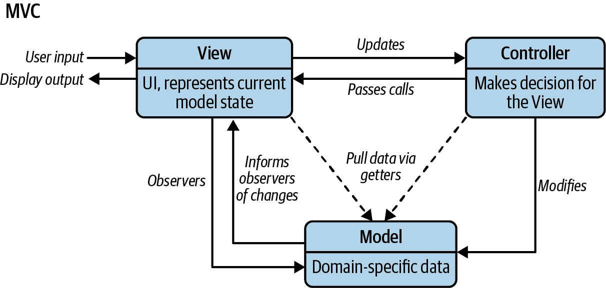
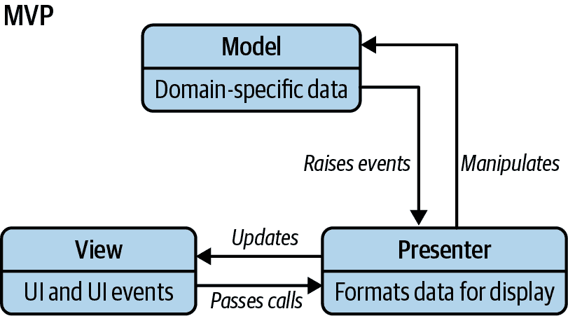
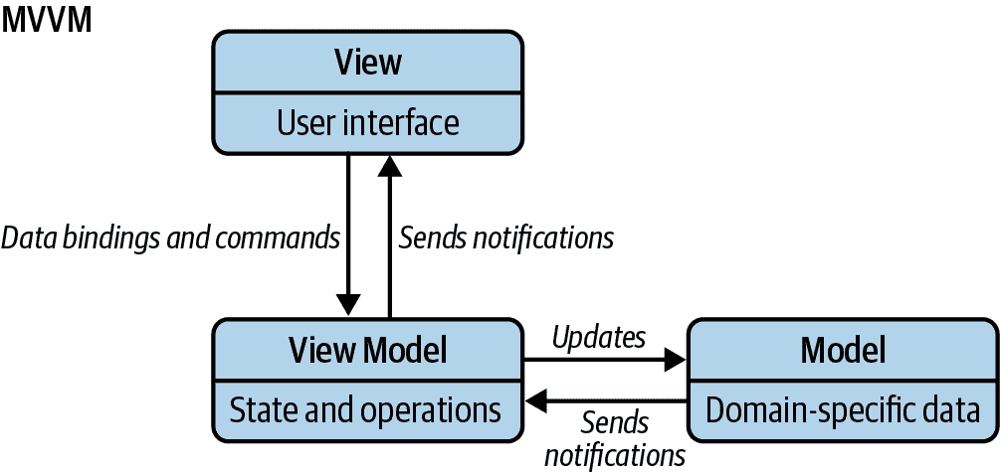

# 第八章：JavaScript MV* 模式

对象设计和应用架构是应用设计的两个主要方面。我们在上一章中已经涵盖了与第一个相关的模式。在本章中，我们将回顾三种基本的架构模式：MVC（Model-View-Controller）、MVP（Model-View-Presenter）和 MVVM（Model-View-ViewModel）。过去，这些模式被广泛用于构建桌面和服务器端应用程序。现在它们也已经适应了 JavaScript。

由于大多数当前使用这些模式的 JavaScript 开发人员选择使用各种库或框架来实现类似 MVC/MV* 的结构，我们将比较这些解决方案在解释 MVC 时与这些模式的经典视角有何不同。

###### 注意

在基于 MVC/MVVM 的大多数现代基于浏览器的 UI 设计框架中，您可以轻松区分模型和视图层。然而，第三个组件在名称和功能上各不相同。在 MV* 中的 * 表示不同框架中第三个组件的形式。

# MVC

MVC 是一种架构设计模式，通过关注点分离来促进应用程序组织的改进。它强制将业务数据（模型）与 UI（视图）隔离开来，第三个组件（控制器）传统上负责管理逻辑和用户输入。[Trygve Reenskaug](https://oreil.ly/N9Dt5) 最初在 [Smalltalk-80](https://oreil.ly/6gft1)（1979 年）期间设计了这种模式，最初称为 Model-View-Controller-Editor。MVC 后来在 1995 年的 *Design Patterns: Elements of Reusable Object-Oriented Software*（即“GoF”书籍）中深入描述，这本书在推广其使用方面发挥了作用。

## Smalltalk-80 MVC

理解原始 MVC 模式旨在解决什么问题是至关重要的，因为自其起源以来，它已经发生了相当大的变化。回到 20 世纪 70 年代，GUI 只有寥寥无几。一种被称为 [Separated Presentation](https://oreil.ly/yTX-F) 的概念因其将模拟现实世界中的思想（例如照片、人物）的领域对象与呈现对象清晰分开而变得著名。

Smalltalk-80 中的 MVC 进一步发展了这一概念，并旨在将应用程序逻辑与 UI 分离。其理念是，解耦应用程序的这些部分也将允许在应用程序中为其他界面重用模型。关于 Smalltalk-80 的 MVC 架构有一些值得注意的有趣点：

+   模型代表特定于领域的数据，并对 UI（视图和控制器）不知情。当模型发生变化时，它会通知其观察者。

+   视图表示了模型的当前状态。观察者模式被用来通知视图模型何时被更新或修改。

+   View 负责呈现，但不仅仅有一个单一的 View 和 Controller——每个部分或元素在屏幕上显示都需要一个 View-Controller 对。

+   Controller 在这对中的角色是处理用户交互（例如按键和点击等动作）并为 View 做出决策。

开发者有时会感到惊讶，当他们了解到观察者模式（现在通常作为发布/订阅的变体实现）几十年前就已经作为 MVC 架构的一部分包含在内。在 Smalltalk-80 的 MVC 中，View 观察 Model。如列表中所述，每当 Model 发生变化时，Views 会作出反应。一个简单的例子是一个依赖股市数据的应用程序。为了使应用程序有用，我们的 Models 中的任何数据变化都应立即刷新 View。

[Martin Fowler](https://oreil.ly/yTX-F)多年来在 MVC 起源方面做了出色的工作。如果您对 Smalltalk-80 的一些更深入的历史信息感兴趣，我建议阅读他的作品。

# JavaScript 开发者的 MVC

我们已经回顾了 20 世纪 70 年代，但让我们回到现在。在现代，MVC 模式已经在多种编程语言和应用程序类型中使用，包括我们最关心的 JavaScript。现在，JavaScript 有几个框架支持 MVC（或其变体，我们称之为 MV*系列），使开发者能够轻松地为他们的应用程序添加结构。

最早的框架包括 Backbone、Ember.js 和 AngularJS。最近，React、Angular 和 Vue.js 生态系统已被用来实现 MV*模式的各种变体。考虑到避免“意大利面条”代码的重要性，这个术语描述的是由于缺乏结构而非常难以阅读或维护的代码，现代 JavaScript 开发者必须理解这种模式提供了什么。这使我们能够有效地欣赏这些框架使我们能够以不同的方式做什么（图 8-1）。



###### 图 8-1\. MVC 模式

MVC 包括三个核心组件，如下节所述。

## Models

Models 管理应用程序的数据。它们不关心 UI 或呈现层，但代表了应用程序可能需要的独特数据形式。当一个 Model 变化时（例如，当它被更新时），它通常会通知它的观察者（例如 Views，我们马上会介绍的概念）发生了变化，以便它可以相应地做出反应。

要进一步理解 Models，让我们想象我们有一个照片库应用程序。在照片库中，照片的概念会有自己的 Model，因为它代表了一种独特的领域特定数据。这样的 Model 可能包含相关属性，如标题、图像来源和附加元数据。您可以将特定的照片存储在一个 Model 的实例中，而且一个 Model 也可以是可重用的。

模型的内置功能因框架而异。但是，支持属性验证是它们的标准功能之一，其中属性表示模型的属性，例如模型标识符。在实际应用中使用模型时，我们通常也希望模型具有持久性。持久性使我们能够编辑和更新模型，并确保它们的最新状态保存在内存、本地存储或与数据库同步。

此外，一个模型可能有多个观察它的视图。比如说，我们的照片模型包含了元数据，比如它的位置（经度和纬度）、出现在照片中的朋友（一个标识符列表），以及标签列表，开发者可以决定提供一个单一的视图来展示这三个方面。

在 MVC/MV*框架中，提供将模型分组的方法以形成集合并不少见。将模型分组管理，使得我们能够基于来自组中任何模型的通知编写应用逻辑。这样做避免了手动观察单个模型实例的需要。

早期关于 MVC 的文本还可能提到模型管理应用程序*状态*的概念。在 JavaScript 应用程序中，“状态”具有不同的涵义，通常指当前“状态”——即用户屏幕上的视图或子视图（具有特定数据）。当讨论单页应用程序（SPA）时，状态经常被讨论，需要模拟状态的概念。

综上所述，模型主要关注业务数据。

## 视图

视图是模型的视觉表现形式，展示其当前状态的过滤视图。虽然 Smalltalk 视图是关于绘制和维护位图的，JavaScript 视图则构建和组织一组 DOM 元素。

视图通常观察一个模型，并在模型变化时得到通知，允许视图相应地更新自己。设计模式文献通常将视图称为“哑”的，因为它们对应用程序中的模型和控制器的了解是有限的。

用户可以与视图交互，包括读取和编辑（即获取或设置模型的属性值）。由于视图是表示层，我们通常以用户友好的方式呈现编辑和更新的能力。例如，在我们之前讨论的照片库应用程序中，我们可以通过“编辑”视图来促进模型的编辑，用户可以选择特定照片并编辑其元数据。

更新模型的实际任务落到控制器（我们稍后会介绍）的手中。

让我们通过一个传统的 JavaScript 示例实现进一步探索视图。现在我们可以看到一个函数，它创建一个单一的照片视图，同时消耗一个模型和一个控制器实例。

我们在视图中定义了一个`render()`实用程序，负责使用 JavaScript 模板引擎（Lodash 模板）渲染`photoModel`的内容，并更新由`photoEl`引用的视图内容。

然后，`photoModel`将我们的`render()`回调添加为其订阅者之一，以便我们使用观察者模式在模型更改时触发视图更新。

读者可能会想知道用户交互在这里如何发挥作用。当用户点击视图中的任何元素时，不是视图的责任来决定下一步该做什么。它依赖于控制器来代替它做出这个决定。我们的示例实现通过向`photoEl`添加事件监听器来实现这一点，它将委托处理点击行为返回给控制器，并在需要的情况下传递模型信息。

该架构的好处在于每个组件都发挥其在使应用程序按需运行中所需的作用：

```
const buildPhotoView = (photoModel, photoController) => {
  const base = document.createElement( "div" );
  const photoEl = document.createElement( "div" );

  base.appendChild(photoEl);

  const render = () => {
        // We use Lodash's template method
        // which generates the HTML for our photo entry
        photo entry
        photoEl.innerHTML = _.template("#photoTemplate", {
            src: photoModel.getSrc()
        });
    };

  photoModel.addSubscriber( render );

  photoEl.addEventListener( "click", () => {
    photoController.handleEvent( "click", photoModel );
  });

  const show = () => {
    photoEl.style.display = "";
  };

  const hide = () => {
    photoEl.style.display = "none";
  };

  return {
    showView: show,
    hideView: hide
  };
};
```

## 模板化

当讨论支持 MVC/MV*的 JavaScript 框架时，简要介绍 JavaScript 模板化是值得的。正如前一节中提到的，模板化与视图相关联。

长期以来，手动通过字符串连接在内存中创建大块 HTML 标记一直被认为（并已经证明）是一种性能不良的做法。开发人员已经陷入了通过它们的数据进行低效迭代的困境，将其包装在嵌套的`div`中，并使用诸如`document.write`之类的过时技术将生成的“模板”注入 DOM 中。这通常意味着在我们的标准标记中内联脚本标记。标记可以很快变得难以阅读，并且更重要的是，具有这种代码的非平凡应用可能会导致维护灾难。

现代 JavaScript 模板化解决方案已经转向使用标记模板字面量，这是 ES6（ECMAScript 2015）的一个强大特性。标记模板字面量允许您使用 JavaScript 的模板字面量语法创建可重用模板，以及一个自定义处理函数，用于操纵和填充数据模板。这种方法消除了额外的模板化库的需要，并提供了一种清晰、可维护的创建动态 HTML 内容的方式。

使用标记模板字面量内部的变量可以通过`${variable}`语法轻松插入，这比传统的变量分隔符如`{{name}}`更简洁易读。这使得更简单地维护干净的模型和模板成为可能，同时允许框架处理从模型填充模板的大部分工作。这带来了许多好处，特别是在选择外部存储模板时。这可以在构建更大的应用程序时根据需要动态加载模板。

示例 8-1 和 8-2 是两个 JavaScript 模板的示例。一个是使用标记模板字面量实现的，另一个是使用 Lodash 模板。

##### 示例 8-1\. 标记模板字面量代码

```
// Sample data
const photos = [
  {
    caption: 'Sample Photo 1',
    src: 'photo1.jpg',
    metadata: 'Some metadata for photo 1',
  },
  {
    caption: 'Sample Photo 2',
    src: 'photo2.jpg',
    metadata: 'Some metadata for photo 2',
  },
];

// Tagged template literal function
function photoTemplate(strings, caption, src, metadata) {
  return strings[0] + caption + strings[1] + src + strings[2] + metadata
     + strings[3];
}

// Define the template as a tagged template literal string
const template = (caption, src, metadata) => photoTemplate`<li class="photo">
 <h2>${caption}</h2>
 
 <div class="metadata">
    ${metadata}
 </div>
</li>`;

// Loop through the data and populate the template
const photoList = document.createElement('ul');
photos.forEach((photo) => {
  const photoItem = template(photo.caption, photo.src, photo.metadata);
  photoList.innerHTML += photoItem;
});

// Insert the populated template into the DOM
document.body.appendChild(photoList);
```

##### 示例 8-2\. Lodash.js 模板

```
<li class="photo">
  <h2><%- caption %></h2>
  "/>
  <div class="metadata">
    <%- metadata %>
  </div>
</li>
```

请注意，模板本身并不是 Views。View 是观察 Model 并保持视觉表示最新的对象。模板可能是一种声明性方式，用来指定 View 对象的部分甚至全部，以便框架可以从模板规范生成它。

还值得注意的是，在传统的 Web 开发中，导航到独立 Views 之间需要使用页面刷新。然而，在单页 JavaScript 应用程序中，一旦从服务器获取数据，就可以在同一页面内动态地渲染新的 View，而无需任何刷新。因此，导航角色落到了路由器上，它帮助管理应用程序状态（例如，允许用户书签所导航到的特定 View）。然而，由于路由器既不是 MVC 的一部分，也不在每个类似 MVC 的框架中出现，因此在本节中将不会对其进行更详细的讨论。

总结一下，Views 在视觉上代表我们的应用程序数据，而模板可以用来生成 Views。现代模板技术，如标记模板字面量，提供了一种干净、高效和可维护的方式来在 JavaScript 应用程序中创建动态 HTML 内容。

## Controllers

Controllers 是 Models 和 Views 之间的中介，经典上负责在用户操作 View 时更新 Model。它们管理应用程序中 Models 和 Views 之间的逻辑和协调。

# MVC 给我们带来了什么？

这种 MVC 中的关注点分离有助于简化应用程序功能的模块化，并实现以下功能：

+   更容易的整体维护。当应用程序需要更新时，很明显是否是数据中心的变更，即对 Models 和可能是 Controllers 的变更，或者仅仅是视觉上的变更，即对 Views 的变更。

+   解耦 Models 和 Views 意味着编写业务逻辑的单元测试变得更加简单。

+   消除了在应用程序中低级 Model 和 Controller 代码的重复（即，我们可能一直在使用的代码）。

+   根据应用程序的大小和角色的分离，这种模块化允许负责核心逻辑的开发者和负责 UI 的开发者同时工作。

# 在 JavaScript 中实现 Smalltalk-80 MVC

大多数现代 JavaScript 框架试图发展 MVC 范例以适应 Web 应用程序开发的不同需求。然而，有一个框架试图遵循 Smalltalk-80 中模式的纯粹形式。[Maria.js](https://oreil.ly/rNJLu)由 Peter Michaux 提供了一个忠实于 MVC 起源的实现：Models 是 Models，Views 是 Views，而 Controllers 仅仅是 Controllers。尽管一些开发者可能认为 MV*框架应该处理更多关注点，但这是一个有价值的参考，以便在需要 JavaScript 实现原始 MVC 的情况下了解。

# MVC 摘要

在审查了经典的 MVC 模式之后，我们现在应该理解它如何帮助我们在应用程序中清晰地分离关注点。我们还应该欣赏 JavaScript MVC 框架在对 MVC 模式的解释上可能存在的差异。虽然可以根据需求进行相当开放的变化，但它们仍然分享一些原始模式提供的基本概念。

在审查新的 JavaScript MVC/MV* 框架时，请记住：迈出一步，审视它是如何选择处理架构的（具体来说，它如何支持实现模型、视图、控制器或其他替代方案），因为这可以更好地帮助我们理解如何最佳使用该框架。

# MVP

模型-视图-展示者（MVP）是 MVC 设计模式的一个衍生，专注于改进展示逻辑。它起源于上世纪 90 年代初的 [Taligent](https://oreil.ly/sKiE8) 公司，当时他们正在为 C++ CommonPoint 环境设计一个模型。虽然 MVC 和 MVP 都旨在跨多个组件分离关注点，但它们之间存在一些根本的差异。

在这里，我们将专注于最适合基于 Web 的架构的 MVP 版本。

## 模型、视图和展示者

MVP 中的 P 代表展示者。这是一个包含视图 UI 业务逻辑的组件。与 MVC 不同，来自视图的调用被委托给展示者，后者与视图解耦，而是通过接口与其进行通信。这有许多优势，例如能够在单元测试中模拟视图（MVP 模式）（图 8-2）。



###### 图 8-2\. MVP 模式

MVP 最常见的实现方式是使用被动视图（一种在所有意图和目的上都是“哑”的视图），几乎没有逻辑。MVC 和 MVP 之间的区别在于 C 和 P 扮演的角色不同。在 MVP 中，P 观察模型并在模型更改时更新视图。P 将模型有效地绑定到视图中，这是 MVC 中控制器的责任。

当视图请求时，展示者执行与用户请求相关的任何工作，并将数据返回给它们。在这方面，它们检索数据、操纵数据，并确定数据应如何在视图中显示。在某些实现中，展示者还与服务层交互以持久化数据（模型）。模型可能会触发事件，但是展示者的角色是订阅这些事件，以便它可以更新视图。在这种被动的架构中，我们没有直接数据绑定的概念。视图公开了展示者可以使用的设置器来设置数据。

与 MVC 相比，这种改变的好处在于增加了应用程序的可测试性，并在视图和模型之间提供了更清晰的分离。然而，这并不是没有代价的，因为模式中缺乏数据绑定支持通常意味着需要单独处理这项任务。

尽管 [被动视图](https://oreil.ly/SQUNj) 的常见实现是视图实现一个接口，但也有其它变体，包括使用可以将视图与 Presenter 解耦合的事件。由于 JavaScript 中没有接口构造，我们在这里更多地使用协议而不是显式接口。从技术上讲仍然是 API，从这个角度来看将其称为接口可能是公平的。

还有一个 [监控控制器](https://oreil.ly/RZM34) 的 MVP 变体，更接近 MVC 和 [MVVM](https://oreil.ly/f5apN) 模式，因为它直接从模型向视图提供数据绑定。

## MVP 还是 MVC？

现在我们已经讨论了 MVP 和 MVC，那么如何为您的应用程序选择最合适的模式呢？

MVP 通常用于需要尽可能重用展示逻辑的企业级应用程序中。具有非常复杂视图和大量用户交互的应用程序可能会发现 MVC 在这里不太合适，因为解决这个问题可能意味着严重依赖多个控制器。在 MVP 中，所有这些复杂逻辑都可以封装在一个 Presenter 中，显著简化维护工作。

MVP 视图是通过接口定义的，而接口在技术上是系统和视图之间的唯一联系点（除了一个 Presenter），这种模式还允许开发人员编写展示逻辑，而不需要等待设计师为应用程序制作布局和图形。

依赖实现而言，MVP 可能比 MVC 更容易进行单元测试。通常引用的原因是可以使用 Presenter 作为 UI 的完整模拟，因此可以独立于其他组件进行单元测试。根据我个人的经验，这取决于我们在哪些语言中实现 MVP（在选择 JavaScript 项目与 ASP.NET 项目的 MVP 之间存在很大差异）。

我们对 MVC 可能存在的基本关注点可能也适用于 MVP，因为它们之间的区别主要是语义上的。只要我们将关注点清晰地分离为模型、视图和控制器（或者 Presenter），我们无论选择哪种变体，应该都能实现大部分相同的好处。

少数（如果有的话）JavaScript 架构框架声称以其经典形式实现 MVC 或 MVP 模式。许多 JavaScript 开发人员不认为 MVC 和 MVP 是互斥的（我们更有可能在诸如 ASP.NET 或 Google Web Toolkit 等 Web 框架中严格实现 MVP）。这是因为我们可以在应用程序中具有额外的 Presenter/View 逻辑，仍然将其视为 MVC 的一种变体。

# MVVM

MVVM（模型-视图-视图模型）是一种基于 MVC 和 MVP 的架构模式，旨在更清晰地将 UI 开发与应用程序中的业务逻辑和行为分离。为此，该模式的许多实现利用声明性数据绑定，允许在视图与其他层之间进行分离。

这使得 UI 和开发几乎同时进行在同一代码库中成为可能。UI 开发人员在其文档标记（HTML）中编写与 ViewModel 的绑定，而应用程序逻辑的开发人员则维护模型和 ViewModel（图 8-3）。



###### 图 8-3\. MVVM 模式

## 历史（History）

MVVM（以名称命名）最初由微软定义，用于[Windows Presentation Foundation（WPF）](https://oreil.ly/1_I11)和[Silverlight](https://oreil.ly/ve1Oh)，由 John Grossman 在关于 Avalon（WPF 的代号）的博客文章中于 2005 年正式宣布。它还在 Adobe Flex 社区中作为使用 MVC 的替代方案找到了一些流行度。

在微软采纳 MVVM 名称之前，社区中有一股潮流从 MVP 过渡到 MVPM：即模型-视图-展示模型。Martin Fowler 在 2004 年写了一篇[关于展示模型的文章](https://oreil.ly/78R8q)，供有兴趣的人阅读更多。展示模型的概念早在这篇文章之前就已经存在很长时间了。然而，这篇文章被认为是该概念的一个重要突破，并有助于其普及。

在微软宣布 MVVM 作为 MVP 的替代方案后，“alt.net”圈子中有相当大的哗然。许多人声称公司在 GUI 世界的主导地位使他们能够接管社区，根据市场营销需求重新命名现有概念。渐进派认识到，虽然 MVVM 和 MVPM 本质上是相同的想法，但它们呈现的形式略有不同。

MVVM 最初是在 JavaScript 中实现的，形式为结构性框架，如 KnockoutJS、Kendo MVVM 和 Knockback.js，并得到了社区的整体积极响应。

让我们来回顾组成 MVVM 的三个组件：

模型（Model）

表示领域特定信息

视图（View）

用户界面（UI）

ViewModel

模型（Model）和视图（View）之间的接口

## 模型（Model）

与 MV*家族的其他成员一样，MVVM 中的模型代表应用程序将使用的特定于域的数据或信息。一个典型的域特定数据例子可能是用户账户（例如名称、头像、电子邮件）或音乐曲目（例如标题、年份、专辑）。

模型保存信息，但通常不处理行为。它们不格式化信息或影响数据在浏览器中的呈现，因为这不是它们的责任。相反，视图管理数据格式化，而行为被视为应该封装在另一层中与模型交互的业务逻辑：视图模型（ViewModel）。

这个规则的唯一例外似乎是验证，对于模型来验证用于定义或更新现有模型的数据是可以接受的（例如，输入的电子邮件地址是否符合特定的正则表达式要求？）。

## 视图

与 MVC 一样，视图是用户与应用程序唯一交互的部分。视图是一个交互式 UI，代表了 ViewModel 的状态。在这个意义上，视图被认为是活动的而不是被动的，这对于 MVC 和 MVP 视图也是正确的。在 MVC、MVP 和 MVVM 中，视图也可以是被动的，但这意味着什么呢？

被动视图仅输出显示，不接受任何用户输入。这样的视图也可能对我们应用程序中的模型没有真正的了解，并且可以由 Presenter 操作。MVVM 的活动视图包含数据绑定、事件和行为，这需要对 ViewModel 有一定的理解。虽然这些行为可以映射到属性，但视图仍然负责处理来自 ViewModel 的事件。

重要的是要记住，视图不负责处理状态；它保持与 ViewModel 的同步。

## ViewModel

ViewModel 可以被视为一个专门的控制器，充当数据转换器。它将模型信息转换为视图信息，从视图传递命令到模型。

例如，让我们假设我们有一个模型，其中包含以 UNIX 格式存储的`date`属性（例如，1333832407）。与其说我们的模型意识到用户对日期的视图（例如，2012 年 04 月 07 日 @ 下午 5:00），需要将地址转换为显示格式，不如说我们的模型保存数据的原始格式。我们的视图包含格式化后的日期，而我们的 ViewModel 充当了两者之间的中间人。

在这个意义上，ViewModel 可以被看作是一个模型而不是一个视图，但它确实处理了大部分视图的显示逻辑。ViewModel 还可以公开方法来帮助维护视图的状态，根据视图上的操作更新模型，并在视图上触发事件。

总结，ViewModel 位于我们的 UI 层后面。它公开了视图（来自模型）所需的数据，并且可以是视图获取数据和执行操作的源头。

## 总结：视图和 ViewModel

视图和 ViewModel 使用数据绑定和事件进行通信。正如我们在初始 ViewModel 示例中看到的那样，ViewModel 不仅仅是暴露模型属性，还提供对其他方法和功能（如验证）的访问。

我们的视图处理其自身的 UI 事件，并根据需要将其映射到 ViewModel 上。模型和 ViewModel 上的属性通过双向数据绑定进行同步和更新。

触发器（数据触发器）还允许我们对模型属性状态的更改做出进一步的反应。

## ViewModel 与模型比较

虽然在 MVVM 中 ViewModel 可能完全负责模型，但这种关系有一些微妙之处值得注意。ViewModel 可以公开模型或模型属性以进行数据绑定，并包含用于获取和操作视图中公开的属性的接口。

# 优缺点

现在，我们希望更好地理解 MVVM 是什么以及它如何工作。让我们回顾一下采用这种模式的优点和缺点。

## 优点

+   MVVM 促进了 UI 及其支持其的构建块的更容易并行开发。

+   MVVM 抽象了视图，因此减少了代码背后所需的业务逻辑（或粘合剂）的数量。

+   与事件驱动代码相比，ViewModel 可能更容易进行单元测试。

+   ViewModel（更像是模型而不是视图）可以在没有 UI 自动化和交互问题的情况下进行测试。

## 缺点

+   对于较简单的 UI，MVVM 可能过于复杂。

+   数据绑定可以是声明性的，易于使用，但在调试时可能比命令式代码更难，因为我们只是设置断点。

+   在非平凡应用程序中，数据绑定可能会产生大量的簿记工作。我们也不希望陷入绑定比绑定的对象更重的情况。

+   在更大的应用程序中，预先设计 ViewModel 以获取必要的泛化可能更具挑战性。

# MVC 与 MVP 与 MVVM 的比较

MVP 和 MVVM 都是 MVC 的衍生物。MVC 及其衍生物之间的关键区别在于每个层次对其他层次的依赖以及它们彼此之间的紧密绑定程度。

在 MVC 中，视图位于架构的顶部，控制器在其旁边。模型位于控制器下方，因此我们的视图知道我们的控制器，控制器知道模型。在这里，我们的视图直接访问模型。但是，向视图公开完整的模型可能会根据应用程序的复杂性而带来安全性和性能成本。MVVM 试图避免这些问题。

在 MVP 中，控制器的角色被 Presenter 取代。Presenter 与视图处于同一级别，监听来自视图和模型的事件，并在它们之间进行中介操作。与 MVVM 不同，没有将视图绑定到视图模型的机制，因此我们依赖于每个视图实现一个接口，允许 Presenter 与视图交互。

因此，MVVM 允许我们创建视图特定的模型子集，其中可以包含状态和逻辑信息，避免将整个模型暴露给视图。与 MVP 的 Presenter 不同，ViewModel 不需要引用视图。视图可以绑定到 ViewModel 中的属性，从而将模型中包含的数据暴露给视图。正如我们所提到的，视图的抽象意味着在其背后所需的逻辑更少。

然而，这种方法的一个缺点是在 ViewModel 和 View 之间需要进行解释，这可能会带来性能成本。这种解释的复杂性也有所不同：它可以简单到复制数据，也可以复杂到将数据转换为视图所需的形式。MVC 没有这个问题，因为整个模型都是可用的，可以避免这种操作。

# 现代 MV* 模式

初期用于实现 MVC 和 MVVM 的 Backbone 和 KnockoutJS 等框架不再流行或更新。它们已为 React、Vue.js、Angular、Solid 等其他库和框架让路。从 Backbone 或 KnockoutJS 的角度理解架构仍然可能是相关的，因为它让我们了解我们来自何处，以及现代框架带来了哪些变化。

MV* 模式始终可以使用最新的原生 JavaScript 实现，正如这个例子中展示的列表：[ToDo list MVC application](https://oreil.ly/QVYPY)。然而，开发者通常更倾向于使用库和框架来构建更大型、可扩展的应用程序。

技术上讲，现代库和框架如 React 或 Vue.js 构成了应用程序的视图或表示层。在大多数情况下，这些框架对于如何实现模型和管理应用程序状态非常灵活。Vue 正式宣称自己是 MVVM 模式中的 [ViewModel](https://oreil.ly/UqbVh) 层。以下是关于 React 中 MV* 的一些额外思考。

## MV* 和 React.js

很明显，React 不是一个 MVC 框架。它是一个用于构建 UI 的 JavaScript 库，并且通常用于创建单页面应用程序（SPA）。

React 之所以不被认为是 MVC，是因为它与在后端的概念和使用方式不太匹配。React 是一个渲染库，理想情况下负责视图层。它没有像 MVC 那样的中心控制器作为指挥官/路由器。

React 遵循声明式编程方法——你描述应用程序的期望状态，React 根据该状态渲染适当的视图。React 不使用 MVC 设计模式，因为在 React 中，服务器不会向浏览器提供“视图”，而是“数据”。React 在浏览器上解析数据以生成实际的视图。从这个意义上说，你可以说 React 是 MVC 模式中的“V”（视图），但它并不是传统意义上的 MVC 框架。

另一种看待它的方式是，React 在垂直（按关注点）而不是水平（按技术）方向上切分了 MVC。你可以说 React 中的组件最初是小型垂直切片的封装 MVC：包含状态（模型）、渲染（视图）和控制流逻辑（局部化的迷你控制器）。

这些天，随着许多组件逻辑被提取到 Hooks 中，你可以将组件视为视图，将 Hooks 视为控制器。如果有帮助的话，你也可以考虑“模型 ⇒ 悬挂资源，视图 ⇒ 组件，控制器 ⇒ Hook”，但不要太认真对待。

Next.js 是建立在 React 之上的一个框架，使得构建服务器渲染的 React 应用程序变得容易。它包括诸如自动代码拆分、优化性能和便捷部署到生产环境等功能。与 React 一样，Next.js 并不是一个 MVC 框架，但当你使用服务器端渲染（SSR）或静态站点生成器（SSG）时，它可以像 MVC 一样工作。当 Next.js 作为后端运行，与数据库交互并提供视图进行预渲染时，它确实像 MVC 模式，之后再通过响应式功能进行激活。

# 总结

我们已经分析了模型（Model）、视图（View）、控制器（Controller）、展示者（Presenter）和视图模型（ViewModel）的概念及其在不同架构模式中的适用性。今天，在 JavaScript 最相关的前端上，我们可能看不到这些模式直接应用。然而，它们可能帮助我们理清网页应用程序的整体架构。它们也可以应用于垂直切片的个别前端组件，每个组件都有一个视图模型或模型来支持视图。

到目前为止，我们已经涵盖了微观（类）和宏观（架构）级别的一系列模式。下一章将帮助我们为现代 JavaScript 应用程序设计应用程序流程。我们将探讨可以帮助我们更好地管理浏览器上长时间运行任务的异步编程模式。
