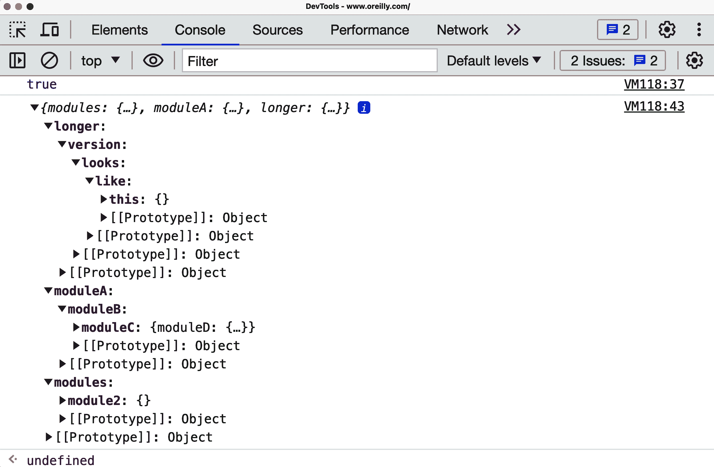

# 第十一章：命名空间模式

在本章中，我们将探讨 JavaScript 中的命名空间模式。命名空间可以被视为代码单元在唯一标识符下的逻辑分组。您可以在多个命名空间中引用该标识符，并且每个标识符可以包含一组嵌套（或子）命名空间的层次结构。

在应用程序开发中，我们使用命名空间有许多重要原因。JavaScript 命名空间帮助我们避免与全局命名空间中的其他对象或变量发生冲突。它们还有助于帮助我们组织代码库中的功能块，使其更容易被引用和使用。

对任何严肃的脚本或应用程序进行命名空间设置至关重要，因为这对于保护我们的代码免受页面上另一个脚本使用相同变量或方法名称可能造成的破坏至关重要。由于定期注入页面的大量第三方标签，这可能是我们在职业生涯中不可避免要解决的常见问题。作为全局命名空间的良好“公民”，我们也必须尽力不要阻止其他开发人员的脚本执行由于相同的问题。

虽然 JavaScript 不像其他语言那样内置支持命名空间，但它确实有对象和闭包，你可以利用它们来达到类似的效果。

# 命名空间基础知识

你可以在几乎任何严肃的 JavaScript 应用程序中找到命名空间。除非我们正在处理一个简单的代码片段，否则我们必须尽力确保正确实现命名空间，因为它不仅易于掌握，而且还可以避免第三方代码破坏我们自己的代码。本节中我们将要探讨的模式有：

+   单一全局变量

+   前缀命名空间

+   对象字面量表示法

+   嵌套命名空间

+   立即调用函数

+   表达式

+   命名空间注入

# 单一全局变量

在 JavaScript 中，一种流行的命名空间模式是选择一个单一的全局变量作为我们的主要参考对象。以下是这种模式的基本实现，我们返回一个具有函数和属性的对象：

```
const myUniqueApplication = (() => {
  function myMethod() {
    // code
    return;
  }

  return {
    myMethod,
  };
})();

// Usage
myUniqueApplication.myMethod();

// In this updated example, we use an immediately invoked function expression
// (IIFE) to create a unique namespace for our application, which is stored in
// the myUniqueApplication variable. The IIFE returns an object with functions
// and properties, and we can access these using dot notation
// (e.g., myUniqueApplication.myMethod()).
```

虽然这种方法在某些情况下很有效，但单一全局变量模式的最大挑战在于确保没有其他人在页面上使用与我们相同的全局变量名称。

# 前缀命名空间

根据 [Peter Michaux](https://oreil.ly/o2dgF) 所述，解决上述问题的一个解决方案是使用前缀命名空间。这本质上是一个简单的概念，但其核心思想是选择一个唯一的前缀命名空间（在本例中是 `myApplication_`），然后按照以下方式定义任何方法、变量或其他对象：

```
const myApplication_propertyA = {};
const myApplication_propertyB = {};
function myApplication_myMethod(){   //...
}
```

这有效地减少了特定变量存在于全局范围内的机会，但请记住，一个具有唯一命名的对象可能会产生相同的效果。

使用这种模式的最大问题是，一旦我们的应用程序扩展，可能会导致许多全局对象。此外，非常依赖于我们的前缀在全局命名空间中不被其他开发人员使用，因此如果选择使用这种方式，一定要小心。

关于单一全局变量模式的更多信息，请阅读[他的优秀文章](https://oreil.ly/o2dgF)。

# 对象字面量表示法

对象字面量表示法，我们在模块模式部分也进行了介绍，可以被视为一个包含一系列键值对的对象，其中冒号分隔每对键和值，键还可以表示新的命名空间：

```
const myApplication = {

    // As we've seen, we can easily define functionality for
    // this object literal...
    getInfo() {
      //...
    },

    // but we can also populate it to support
    // further object namespaces containing anything
    // anything we wish:
    models : {},
    views : {
        pages : {}
    },
    collections : {}
};
```

也可以选择直接向命名空间添加属性：

```
myApplication.foo = () => "bar"

myApplication.utils = {
    toString() {
        //...
    },
    export() {
        //...
    }
}
```

对象字面量不会污染全局命名空间，但有助于逻辑上组织代码和参数。如果您希望创建易于阅读的结构，并支持深层嵌套，它们确实非常有益。与简单的全局变量不同，对象字面量通常会考虑通过相同名称变量的存在性测试，因此碰撞发生的几率显著降低。

以下示例演示了几种检查对象命名空间是否已存在并在不存在时定义它的方法：

```
// This doesn't check for existence of "myApplication" in
// the global namespace. Bad practice as we can easily
// clobber an existing variable/namespace with the same name
const myApplication = {};

// The following options *do* check for variable/namespace existence.
// If already defined, we use that instance, otherwise we assign a new
// object literal to myApplication.
//
// Option 1: var myApplication = myApplication || {};
// Option 2  if( !MyApplication ){ MyApplication = {} };
// Option 3: window.myApplication || ( window.myApplication = {} );
// Option 4: var myApplication = $.fn.myApplication = function() {};
// Option 5: var myApplication = myApplication === undefined ? {} :
// myApplication;
```

您经常会看到开发人员选择选项 1 或选项 2——它们在结果上都是直接且等效的。

选项 3 假设您正在全局命名空间中工作，但也可以编写为：

```
myApplication || (myApplication = {});
```

此变体假设`myApplication`已经初始化，因此只适用于参数/参数场景，如以下示例：

```
function foo() {
  myApplication || ( myApplication = {} );
}

// myApplication hasn't been initialized,
// so foo() throws a ReferenceError

foo();

// However accepting myApplication as an
// argument

function foo( myApplication ) {
  myApplication || ( myApplication = {} );
}

foo();

// Even if myApplication === undefined, there is no error
// and myApplication gets set to {} correctly
```

选项 4 可以帮助编写 jQuery 插件，其中：

```
// If we were to define a new plug-in...
var myPlugin = $.fn.myPlugin = function() { ... };

// Then later rather than having to type:
$.fn.myPlugin.defaults = {};

// We can do:
myPlugin.defaults = {};
```

这样可以获得更好的压缩（缩小）效果，并可以节省作用域查找的开销。

选项 5 与选项 4 有些相似，但它是一个长形式，用于评估`myApplication`是否内联为`undefined`，如果不是，则将其定义为对象，并设置为`myApplication`的当前值。

它仅仅是为了全面起见而显示出来，但在大多数情况下，选项 1 到选项 4 将足够满足大多数需求。

当然，在使用对象字面量组织和结构化代码的方式及其变体中有很多不同之处。对于希望为特定的自封闭模块公开嵌套 API 的较小应用程序，您可能会发现自己使用我们在本书前面讨论过的揭示模块模式：

```
const namespace = (() => {
    // defined within the local scope
    const privateMethod1 = () => { /* ... */ };

    const privateMethod2 = () => { /* ... */ };
    privateProperty1 = "foobar";

    return {

        // the object literal returned here can have as many
        // nested depths as we wish; however, as mentioned,
        // this way of doing things works best for smaller,
        // limited-scope applications in my personal opinion
        publicMethod1: privateMethod1,

        // nested namespace with public properties
        properties:{
            publicProperty1: privateProperty1
        },

        // another tested namespace
        utils:{
            publicMethod2: privateMethod2
        }
        ...
    }
})();
```

在这里使用对象字面量的好处是，它们为我们提供了一个非常优雅的键值语法，使我们能够轻松地封装任何独特的逻辑或功能，从而清晰地与其他代码分离开来，并为扩展我们的代码提供坚实的基础：

```
const myConfig = {

    language: "english",

    defaults: {
        enableGeolocation: true,
        enableSharing: false,
        maxPhotos: 20
    },

    theme: {
        skin: "a",
        toolbars: {
            index: "ui-navigation-toolbar",
            pages: "ui-custom-toolbar"
        }
    }

};
```

请注意，JSON 是对象字面量表示法的子集，它与前面的代码之间只有轻微的语法差异（例如，JSON 键必须是字符串）。如果出于任何原因，希望使用 JSON 来存储配置数据（例如，在发送到后端时进行简单的存储），请随意。

# 嵌套命名空间

对象字面量模式的扩展是嵌套命名空间。它是另一种常见的模式，提供了更低的碰撞风险，因为即使命名空间已经存在，它的嵌套子级也不太可能相同。

例如，像这样：

```
YAHOO.util.Dom.getElementsByClassName("test");
```

旧版本的 Yahoo！YUI 库经常使用嵌套对象命名空间模式。在我在 AOL 担任工程师期间，我们在许多较大的应用程序中也使用了这种模式。嵌套命名空间的示例实现可能如下所示：

```
const myApp =  myApp || {};

// perform a similar existence check when defining nested
// children
myApp.routers = myApp.routers || {};
myApp.model = myApp.model || {};
myApp.model.special = myApp.model.special || {};

// nested namespaces can be as complex as required:
// myApp.utilities.charting.html5.plotGraph(/*..*/);
// myApp.modules.financePlanner.getSummary();
// myApp.services.social.facebook.realtimeStream.getLatest();
```

###### 注意

这段代码与 YUI3 处理命名空间的方式有所不同。YUI3 模块使用一个具有远低且更浅的命名空间的沙盒 API 宿主对象。

我们也可以选择将新的嵌套命名空间/属性声明为索引属性，如下所示：

```
myApp["routers"] = myApp["routers"] || {};
myApp["models"] = myApp["models"] || {};
myApp["controllers"] = myApp["controllers"] || {};
```

这两种选择都具有可读性和组织性，并提供了一种相对安全的应用程序命名空间方式，类似于我们在其他语言中可能已经习惯了的方式。唯一的真正注意事项是，它需要我们的浏览器 JavaScript 引擎首先定位`myApp`对象，然后深入到实际希望使用的函数。

这可能意味着执行查找的更多工作；然而，像[Juriy Zaytsev](https://oreil.ly/hxJnZ)这样的开发者先前测试并发现单个对象命名空间与“嵌套”方法之间的性能差异相当可忽略。

# 立即调用函数表达式（Immediately Invoked Function Expressions）

本书前面简要介绍了立即调用函数表达式（IIFE）的概念；一个[IIFE](https://oreil.ly/KSspI)，实际上是一个未命名的函数，在定义后立即被调用。如果这听起来很熟悉，那是因为你可能之前已经见过它被称为自执行（或自调用）的`anonymous`函数。不过，我认为 Ben Alman 对 IIFE 的命名更加准确。在 JavaScript 中，因为在这样的上下文中明确定义的变量和函数只能在其内部访问，函数调用提供了一种实现隐私的简便方法。

IIFE 是一种封装应用逻辑以保护它免受全局命名空间污染的流行方法，但它们在命名空间的世界中也有其用途。

这里是 IIFE 的示例：

```
// an (anonymous) immediately invoked function expression
(() => { /*...*/})();

// a named immediately invoked function expression
(function foobar () { /*..*/}());

// this is technically a self-executing function which is quite different
function foobar () { foobar(); }
```

第一个示例的略微扩展版本可能如下所示：

```
const namespace = namespace || {};

// here a namespace object is passed as a function
// parameter, where we assign public methods and
// properties to it
(o => {
    o.foo = "foo";
    o.bar = () => "bar";
})(namespace);

console.log( namespace );
```

虽然可读性强，但这个示例可以显著扩展以解决常见的开发问题，例如定义隐私级别（公共/私有函数和变量）以及便捷的命名空间扩展。让我们再看一些代码：

```
// namespace (our namespace name) and undefined are passed here
// to ensure: 1\. namespace can be modified locally and isn't
// overwritten outside of our function context;
// 2\. the value of undefined is guaranteed as being truly
// undefined. This is to avoid issues with undefined being
// mutable pre-ES5.

;((namespace, undefined) => {
    // private properties
    const foo = "foo";

    const bar = "bar";

    // public methods and properties
    namespace.foobar = "foobar";
    namespace.sayHello = () => {
        speak( "hello world" );
    };

    // private method
    function speak(msg) {
        console.log( `You said: ${msg}` );
    };

    // check to evaluate whether "namespace" exists in the
    // global namespace - if not, assign window.namespace an
    // object literal
})(window.namespace = window.namespace || {});

// we can then test our properties and methods as follows

// public

// Outputs: foobar
console.log( namespace.foobar );

// Outputs: hello world
namespace.sayHello();

// assigning new properties
namespace.foobar2 = "foobar";

// Outputs: foobar
console.log( namespace.foobar2 );
```

可扩展性当然是任何可扩展命名空间模式的关键，而立即调用函数表达式（IIFE）可以很容易地实现这一点。在以下示例中，我们的“命名空间”再次作为参数传递给我们的匿名函数，然后通过额外的功能进行扩展（或装饰）：

```
// let's extend the namespace with new functionality
((namespace, undefined) => {

    // public method
    namespace.sayGoodbye = () => {
        console.log( namespace.foo );
        console.log( namespace.bar );
        speak( "goodbye" );
    }
})(window.namespace = window.namespace || {});

// Outputs: goodbye
namespace.sayGoodbye();
```

如果您想了解更多关于这种模式的信息，我建议阅读本的[立即调用函数表达式帖子](https://oreil.ly/KSspI)。

# 命名空间注入

命名空间注入是 IIFE 的另一种变体，在这种变体中，我们使用`this`作为命名空间代理从函数包装器内部“注入”特定命名空间的方法和属性。这种模式提供的好处是可以轻松地将功能行为应用于多个对象或命名空间，并且在应用一组基本方法以供稍后构建时（例如，获取器和设置器）时非常有用。

这种模式的缺点是，可能有更简单或更优化的方法来实现这个目标（例如，深度对象扩展或合并），我在本节前面已经介绍过。

接下来我们可以看到这种模式在实际中的应用示例，我们使用它来填充两个命名空间的行为：一个最初定义的(`utils`)，另一个我们动态创建作为`utils`功能分配的一部分（称为`tools`的新命名空间）：

```
const myApp = myApp || {};
myApp.utils =  {};

(function () {
  let val = 5;

  this.getValue = () => val;

  this.setValue = newVal => {
      val = newVal;
  }

  // also introduce a new subnamespace
  this.tools = {};

}).apply( myApp.utils );

// inject new behavior into the tools namespace
// which we defined via the utilities module

(function () {
    this.diagnose = () => "diagnosis"
}).apply( myApp.utils.tools );

// note, this same approach to extension could be applied
// to a regular IIFE, by just passing in the context as
// an argument and modifying the context rather than just
// "this"

// Usage:

// Outputs our populated namespace
console.log( myApp );

// Outputs: 5
console.log( myApp.utils.getValue() );

// Sets the value of `val` and returns it
myApp.utils.setValue( 25 );
console.log( myApp.utils.getValue() );

// Testing another level down
console.log( myApp.utils.tools.diagnose() );
```

之前，Angus Croll 建议[使用调用 API 来在上下文和参数之间提供自然分离](https://oreil.ly/eBc5N)。这种模式可能更像一个模块创建者，但由于模块仍然提供了封装解决方案，为了全面性，我们将简要介绍它：

```
// define a namespace we can use later
const ns = ns || {};

const ns2 = ns2 || {};

// the module/namespace creator
const creator = function( val ){

    var val = val || 0;

    this.next = () => val++;

    this.reset = () => {
        val = 0;
    }
};

creator.call( ns );

// ns.next, ns.reset now exist
creator.call( ns2 , 5000 );

// ns2 contains the same methods
// but has an overridden value for val
// of 5000
```

如前所述，这种类型的模式有助于将一组相似的基本功能分配给多个模块或命名空间。然而，我建议仅在明确声明对象/闭包内部功能直接访问不合理时使用它。

# 高级命名空间模式

我们现在将探讨一些高级模式和实用程序，这些在处理更复杂的应用程序时我发现非常宝贵，其中一些需要重新思考应用程序命名空间的传统方法。我要指出的是，我并不主张以下内容作为*命名空间的*方式，而是作为我实际工作中发现有效的方式。

## 自动化嵌套命名空间

正如我们所看到的，嵌套命名空间可以为代码单元提供有序的层次结构。这样一个命名空间的示例可能是：`application.utilities.drawing.canvas.2d`。这也可以通过对象字面量模式扩展为：

```
const application = {
      utilities:{
          drawing:{
              canvas:{
                  paint:{
                          //...
                  }
              }
          }
    }
};
```

这种模式的一个明显挑战是，每个我们想要创建的额外层级都需要另一个对象被定义为顶级命名空间中某个父对象的子对象。当我们的应用程序复杂度增加时，这可能特别繁琐。

如何更好地解决这个问题？在《JavaScript 模式》中，Stoyan Stefanov 提出了一个聪明的方法，用于在现有全局变量下自动定义嵌套命名空间。他建议使用一个便利方法，该方法接受一个字符串参数作为一个嵌套，解析它，并自动将所需的对象填充到我们的基本命名空间中。

他建议使用的方法如下，我已经更新为一个通用函数，以便更轻松地在多个命名空间中重用：

```
// top-level namespace being assigned an object literal
const myApp = {};

// a convenience function for parsing string namespaces and
// automatically generating nested namespaces
function extend( ns, ns_string ) {
    const parts = ns_string.split(".");
    let parent = ns;
    let pl;

    pl = parts.length;

    for ( let i = 0; i < pl; i++ ) {
        // create a property if it doesn't exist
        if ( typeof parent[parts[i]] === "undefined" ) {
            parent[parts[i]] = {};
        }

        parent = parent[parts[i]];
    }

    return parent;
}

// Usage:
// extend myApp with a deeply nested namespace
const mod = extend(myApp, "modules.module2");

// the correct object with nested depths is output
console.log(mod);

// minor test to check the instance of mod can also
// be used outside of the myApp namespace as a clone
// that includes the extensions

// Outputs: true
console.log(mod == myApp.modules.module2);

// further demonstration of easier nested namespace
// assignment using extend
extend(myApp, "moduleA.moduleB.moduleC.moduleD");
extend(myApp, "longer.version.looks.like.this");
console.log(myApp);
```

图 11-1 显示了 Chrome 开发者工具的输出。在以前，我们可能需要显式声明命名空间的各种嵌套对象，现在可以通过一行更简洁的代码轻松实现。



###### 图 11-1\. Chrome 开发者工具输出

## 依赖声明模式

现在我们将探讨一种对嵌套命名空间模式的轻微增强，我们将其称为依赖声明模式。我们都知道，对对象的局部引用可以减少总体查找时间，但让我们将其应用于命名空间，看看在实践中它可能是什么样子：

```
// common approach to accessing nested namespaces
myApp.utilities.math.fibonacci( 25 );
myApp.utilities.math.sin( 56 );
myApp.utilities.drawing.plot( 98,50,60 );

// with local/cached references
const utils = myApp.utilities;

const maths = utils.math;
const drawing = utils.drawing;

// easier to access the namespace
maths.fibonacci( 25 );
maths.sin( 56 );
drawing.plot( 98, 50,60 );

// note that this is particularly performant when
// compared to hundreds or thousands of calls to nested
// namespaces vs. a local reference to the namespace
```

在这里使用本地变量几乎总比在顶级全局变量（例如 `myApp`）上工作要快。这也比在每个后续行上访问嵌套属性/子命名空间更方便和更高效，并且可以提高在更复杂应用程序中的可读性。

Stoyan 建议在函数或模块的顶部声明所需的本地化命名空间（使用单变量模式），并将其称为依赖声明模式。其中一个好处是减少定位依赖项并解决它们的时间，特别是在我们有一个可扩展的架构，在需要时动态加载模块到我们的命名空间中。

在我看来，这种模式在模块化级别工作时效果最好，将命名空间本地化以供一组方法使用。在每个函数级别上本地化命名空间，特别是在命名空间依赖之间有显著重叠时，我建议尽可能避免。相反，将其定义在更高的位置，并让它们都访问同一个引用。

## 深度对象扩展

自动命名空间的另一种方法是深度对象扩展。使用对象字面量表示的命名空间可以轻松地与其他对象（或命名空间）扩展（或合并），以便两个命名空间的属性和函数在合并后都可以在同一个命名空间下访问。

这在 JavaScript 框架中实现起来相对容易（例如，参见 jQuery 的 [`$.extend`](https://oreil.ly/WDJWX)）；然而，如果要使用传统的 JS 扩展对象（命名空间），下面的例程可能会有所帮助：

```
// Deep object extension using Object.assign and recursion
function extendObjects(destinationObject, sourceObject) {
  for (const property in sourceObject) {
    if (
      sourceObject[property] &&
      typeof sourceObject[property] === "object" &&
      !Array.isArray(sourceObject[property])
    ) {
      destinationObject[property] = destinationObject[property] || {};
      extendObjects(destinationObject[property], sourceObject[property]);
    } else {
      destinationObject[property] = sourceObject[property];
    }
  }
  return destinationObject;
}

// Example usage
const myNamespace = myNamespace || {};

extendObjects(myNamespace, {
  utils: {},
});

console.log("test 1", myNamespace);

extendObjects(myNamespace, {
  hello: {
    world: {
      wave: {
        test() {
          // ...
        },
      },
    },
  },
});

myNamespace.hello.test1 = "this is a test";
myNamespace.hello.world.test2 = "this is another test";
console.log("test 2", myNamespace);

myNamespace.library = {
  foo() {},
};

extendObjects(myNamespace, {
  library: {
    bar() {
      // ...
    },
  },
});

console.log("test 3", myNamespace);

const shorterNamespaceAccess = myNamespace.hello.world;
shorterNamespaceAccess.test3 = "hello again";
console.log("test 4", myNamespace);
```

###### 注释

这种实现在所有对象上不具备跨浏览器兼容性，并且仅应视为概念验证。可以发现[Lodash.js `extend()` 方法](https://oreil.ly/TD1-D)更简单、更跨浏览器友好的实现来开始使用。

对于将在其应用程序中使用 jQuery 的开发人员，可以通过`$.extend`来实现相同的对象命名空间扩展性，如下所示：

```
// top-level namespace
const myApplication = myApplication || {};

// directly assign a nested namespace
myApplication.library = {
  foo() {
    // ...
  },
};

// deep extend/merge this namespace with another
// to make things interesting, let's say it's a namespace
// with the same name but with a different function
// signature: $.extend( deep, target, object1, object2 )
$.extend(true, myApplication, {
  library: {
    bar() {
      // ...
    },
  },
});

console.log("test", myApplication);
```

为了全面性，请查看[此链接](https://oreil.ly/ZCB2C)，了解 jQuery `$.extend` 方法在本节其余命名空间实验中的等效项。

# 建议

回顾我们在本节中探讨的命名空间模式，我个人偏好于对象字面量模式的嵌套对象命名空间。在可能的情况下，我会使用自动化的嵌套命名空间实现这一点。然而，这仅仅是个人偏好。

IIFEs 和单个全局变量对于中小型范围内的应用程序可能效果很好。然而，对于需要命名空间和深层子命名空间的更大代码库，需要一种简洁的解决方案，促进可读性和扩展性。这种模式很好地实现了所有这些目标。

我建议尝试一些推荐的高级实用程序方法来扩展命名空间，因为它们可以从长远来看节省时间。

# 概要

本章讨论了如何通过命名空间为您的 JavaScript 和 jQuery 应用程序带来结构，并防止变量和函数名称之间的冲突。在大型 JavaScript 应用程序中组织我们的项目文件可以帮助您更好地管理模块和命名空间，增强开发体验。

现在，我们已经涵盖了使用纯 JavaScript 的设计和架构的不同方面。我们提到了 React，但没有详细讨论任何 React 模式。在下一章中，我们的目标是详细讨论这些内容。
