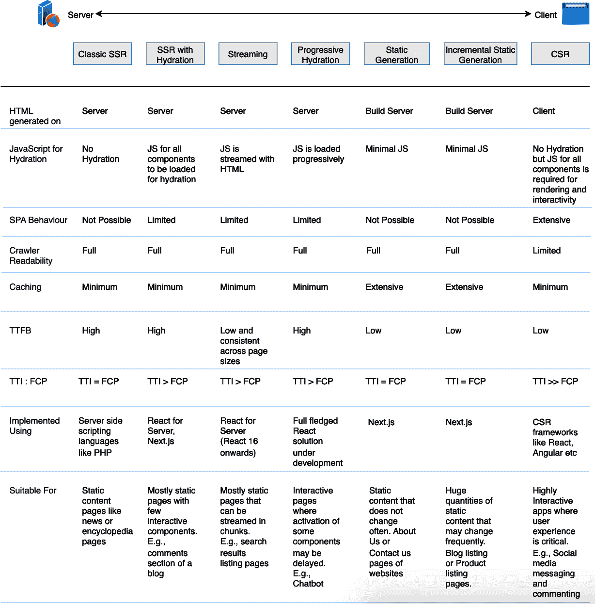

# 第十三章：渲染模式

随着我们转向更加交互式的网站，处理事件的数量和客户端渲染的内容量增加，导致像 React.js 一样的 SPA 主要在客户端渲染。

然而，网页可以像它们服务的功能一样静态或动态。例如，博客/新闻页面仍然可以在服务器上生成并按原样推送给客户端的静态内容。静态内容是无状态的，不触发事件，并且在渲染后不需要重新注水。相反，动态内容（按钮、筛选器、搜索栏）必须在渲染后重新连接到其事件。DOM 必须在客户端重新生成（虚拟 DOM）。这种重新生成、重新注水和事件处理函数会导致发送到客户端的 JavaScript 增加。

渲染模式为特定用例提供了渲染内容的理想解决方案。此表中的渲染模式很受欢迎：

| **渲染模式** |  |
| --- | --- |
| *客户端渲染（CSR）* | HTML 完全在客户端上渲染 |
| *服务器端渲染（SSR）* | 在客户端重启动前在服务器上动态渲染 HTML 内容 |
| *静态渲染* | 在构建时构建静态站点以在服务器上呈现页面 |
| *增量静态生成* | 能够在初始构建后动态增强或修改静态站点（Next.js ISR，Gatsby DSG） |
| *流式 SSR* | 将服务器渲染的内容拆分为更小的流式块 |
| *边缘渲染* | 在发送到客户端之前在边缘修改渲染的 HTML |
| *混合渲染* | 结合构建时、服务器和客户端渲染，以创建更灵活的 Web 开发方法（例如，React Server Components 和 Next.js App Router） |
| *部分注水* | 仅在客户端注水部分组件（例如，React Server Components 和 Gatsby） |
| *逐步注水* | 控制客户端上组件注水的顺序 |
| *岛屿架构* | 在否则静态站点中具有多个入口点的孤立动态行为的孤岛（Astro、Eleventy） |
| *逐步增强* | 确保应用即使没有 JavaScript 也能正常运行 |

本章介绍了一些这些渲染模式，并将帮助您决定哪种模式最适合您的需求。它将帮助您做出基础决策，例如：

+   我想要如何以及在何处渲染内容？

+   内容应该在 Web 服务器、构建服务器、边缘网络还是直接在客户端上渲染呢？

+   内容应该一次性渲染、部分渲染还是逐步渲染呢？

# 渲染模式的重要性

选择给定用例的最适合的渲染模式可以为开发团队创造的开发体验（DX）和为最终用户设计的用户体验（UX）带来天壤之别。选择正确的模式可能导致更快的构建和卓越的低处理成本加载性能。另一方面，错误的模式选择可能会毁掉本可以实现伟大商业创意的应用程序。

要创建出色的用户体验，我们必须优化我们的应用程序以支持用户中心的指标，例如[核心 Web 要素（CWV）](https://oreil.ly/R20lq)：

首字节时间（TTFB）

客户端接收页面内容的首字节所需的时间

首次内容绘制（FCP）

导航后浏览器渲染第一个内容片段所需的时间

交互时间（TTI）

页面开始加载到快速响应用户输入所需的时间

最大内容绘制（LCP）

加载和渲染页面主要内容所需的时间

累积布局移位（CLS）

测量视觉稳定性，以避免意外的布局移位

首次输入延迟（FID）

用户与页面交互开始到事件处理程序能够运行的时间

CWV 指标衡量最与用户体验相关的参数。优化 CWV 可以确保应用程序具有出色的用户体验和优化的搜索引擎优化（SEO）。

要为我们的产品/工程团队创建出色的开发体验（DX），我们必须通过确保更快的构建时间、简单的回滚操作、可扩展的基础设施等功能来优化我们的开发环境：

快速的构建时间

项目应该快速构建，以便快速迭代和部署。

低服务器成本

网站应限制和优化服务器执行时间，以减少执行成本。

动态内容

页面应能够高效加载动态内容。

简单的回滚操作

您可以快速恢复到先前的构建版本并部署它。

可靠的正常运行时间

用户应始终能够通过运行良好的服务器访问您的网站。

可扩展的基础设施

您的项目可能会随着发展而增大或减小，而不会面临性能问题。

基于这些原则建立开发环境使我们的开发团队能够高效地构建出色的产品。

我们现在已经列出了许多期望。但是，如果选择正确的渲染模式，您可以自动获得大多数这些好处。

渲染模式已经发展了很长一段时间，从 SSR 和 CSR 到今天在不同论坛上讨论和评判的高度细化模式。虽然这可能令人不知所措，但重要的是要记住每种模式都是为了解决特定的用例而设计的。对于一个用例有益的模式特征，在另一个用例中可能是有害的。同样重要的是，同一网站上不同类型的页面可能需要不同的渲染模式。

Chrome 团队鼓励开发者考虑静态或 SSR 方案，而不是完全重新注水的方法。随着时间的推移，渐进式加载和渲染技术可以帮助在使用现代框架时取得性能和功能交付的良好平衡。

下面的部分详细介绍了不同的模式。

# 客户端渲染（Client-Side Rendering）

我们已经在前一章中讨论了 React 的 CSR。这里是一个简要概述，以帮助我们将其与其他渲染模式联系起来。

使用 React CSR，大部分应用程序逻辑在客户端执行，并通过 API 调用与服务器交互以获取或保存数据。因此，几乎所有的 UI 都在客户端生成。整个 Web 应用程序在第一次请求时加载。当用户通过点击链接进行导航时，不会生成新的请求到服务器以渲染页面。代码在客户端运行以更改视图/数据。

CSR 允许我们拥有支持导航但无需页面刷新的 SPA，并提供出色的用户体验。由于用于更改视图的数据处理是有限的，页面之间的路由通常更快，使 CSR 应用程序看起来更具响应性。

随着页面复杂度的增加，展示图片、显示来自数据存储的数据以及包含事件处理，用于渲染页面所需的 JavaScript 代码的复杂性和大小也会增加。CSR 导致了大量的 JavaScript 捆绑包，增加了页面的 FCP 和 TTI。大型负载和网络请求的瀑布流（例如用于 API 响应）也可能导致内容无法快速呈现，从而无法被爬虫索引。这可能影响网站的 SEO。

加载和处理过多的 JavaScript 可能会影响性能。然而，即使在主要是静态网站上，通常也需要一些交互性和 JavaScript。以下部分讨论的渲染技术试图在以下方面找到平衡：

+   与 CSR 应用程序相媲美的互动性

+   SEO 和性能优势与 SSR 应用程序相媲美

# 服务器端渲染（Server-Side Rendering）

使用 SSR，我们为每个请求生成 HTML。这种方法最适合包含高度个性化数据的页面，例如基于用户 cookie 的数据或一般从用户请求获取的任何数据。它也适用于应该是渲染阻塞的页面，也许基于认证状态。

SSR 是最古老的 Web 内容渲染方法之一。SSR 生成完整的 HTML，以响应用户请求渲染页面内容。内容可能包括来自数据存储或外部 API 的数据。

连接和获取操作在服务器上处理。用于格式化内容的 HTML 也在服务器上生成。因此，通过 SSR，我们可以避免为数据获取和模板化进行额外的往返。因此，客户端不需要渲染代码，也不需要将其对应的 JavaScript 发送到客户端。

使用 SSR，每个请求都被服务器独立处理并视为新请求处理。即使两个连续请求的输出不是很不同，服务器也会重新处理并生成它。由于服务器对多个用户共享，处理能力在给定时间由所有活跃用户共享。

个性化仪表板是页面上高度动态内容的一个很好的例子。大部分内容基于用户的身份或授权级别，这可能包含在用户的 cookie 中。此仪表板仅在用户经过身份验证时显示，并可能显示不应对其他人可见的用户特定敏感数据。

SSR 的核心原则是在服务器上呈现 HTML，并与必要的 JavaScript 一起在客户端重新注入它。重新注入是在服务器呈现后在客户端重新生成 UI 组件状态。由于重新注入会带来成本，每个 SSR 变体都尝试优化重新注入过程。

# 静态渲染

使用静态渲染，整个页面的 HTML 在构建时生成，并在下一次构建之前不会更改。HTML 内容是静态的，并且可以轻松地在内容交付网络（CDN）或边缘网络上缓存。当客户端请求特定页面时，CDN 可以快速提供预渲染的缓存 HTML。这大大缩短了在典型 SSR 设置中处理请求、呈现 HTML 内容和响应请求所需的时间。

此过程最适合那些不经常更改并且无论谁请求都显示相同数据的页面。像网站的“关于我们”，“联系我们”和“博客”页面，或电子商务应用程序的产品页面都是静态渲染的理想候选者。像 Next.js，Gatsby 和 VuePress 这样的框架支持静态生成。

在其核心，纯静态渲染不涉及任何动态数据。让我们通过一个 Next.js 的例子来理解它：

```
// pages/about.js

export default function About() {
 return <div>
   <h1>About Us</h1>
   {/* ... */}
 </div>
}
```

在构建站点时（使用`next build`），此页面将预渲染为一个 HTML 文件*about.html*，可通过路由*/about*访问。

您可以有以下几种静态渲染的变体：

使用数据库动态数据静态生成列表页面

列表页面是在服务器上使用数据生成的。这适用于列表本身不是非常动态的页面。在 Next.js 中，您可以在页面组件中导出[`getStaticProps()`](https://oreil.ly/QcNhk)函数来实现此目的。

使用动态路由静态生成详细页面

产品页面或博客页面通常遵循填充数据占位符的固定模板。在这种情况下，通过将模板与动态数据合并，可以在服务器上生成单独的页面。Next.js 的[动态路由](https://oreil.ly/2Bugb)功能通过使用`getStaticPaths()`函数来实现这一点。

使用客户端获取的静态渲染

这种模式对于相对动态的列表页面很有帮助，应始终显示最新的列表。您仍然可以使用静态渲染网站，在您想放置动态列表数据的地方渲染 UI 骨架组件。然后，在页面加载后，我们可以使用 SWR 获取数据。SWR（受到陈旧-同时重新验证模式启发）是用于数据获取的 React Hooks。使用自定义 API 路由从 CMS 获取数据并返回该数据。当用户请求页面时，预生成的 HTML 文件将发送到客户端。用户最初看到没有任何数据的骨架 UI。客户端从 API 路由获取数据，接收响应并显示列表。

静态渲染的主要亮点包括以下几点：

+   HTML 在构建时生成。

+   可以轻松通过 CDN/Vercel Edge 网络进行缓存。

+   对于不需要基于请求数据的页面，纯静态渲染是最佳选择。

+   静态页面与客户端获取结合使用最适合包含应在每次页面加载时刷新的数据的页面，并且这些数据包含在稳定的占位符组件中。

## 增量静态再生成

ISR 是静态渲染和 SSR 的混合体，因为它允许我们仅预渲染某些静态页面，并在用户请求时按需渲染动态页面。这导致构建时间缩短，并允许在特定间隔后自动使缓存失效并重新生成页面。

ISR 在两个方面工作，用于在构建后增量引入现有静态站点的更新：

允许添加新页面

懒加载概念用于在构建后将新页面包含在网站中。这意味着新页面在第一次请求时立即生成。在生成过程中，前端可以向用户显示回退页面或加载指示器。

更新现有页面

对每个页面定义合适的超时时间。这将确保在经过定义的超时周期后重新验证页面。超时时间可以设置得低至 1 秒。用户在页面完成重新验证之前将继续看到先前的页面版本。因此，ISR 使用陈旧-同时重新验证策略，在重新验证进行时，用户接收到缓存或陈旧版本。重新验证完全在后台进行，无需完全重建。

## 按需 ISR

在这种 ISR 的变体中，再生发生在特定事件而不是固定间隔上。对于常规 ISR，更新的页面仅在处理了页面用户请求的边缘节点上缓存。按需 ISR 重新生成并在边缘网络上重新分发页面，以便全球用户可以自动从边缘缓存中看到页面的最新版本，而无需看到过时内容。我们还避免了不必要的再生和无服务器函数调用，与常规 ISR 相比，减少了运营成本。因此，按需 ISR 为我们带来了性能优势和出色的开发体验。按需 ISR 最适合应基于特定事件重新生成的页面。它使我们能够以合理的成本拥有快速和动态的网站，始终在线。

## 静态渲染摘要

静态渲染是在构建时可以生成 HTML 的网站的优秀模式。现在我们已经涵盖了静态生成的不同变体，每种都适合不同的用例：

纯静态渲染

最适合不包含动态数据的页面

静态与客户端获取

最适合在每次页面加载时刷新数据并具有稳定占位符组件的页面

增量静态再生

最适合应在特定间隔或按需重新生成的页面

按需 ISR

最适合应基于特定事件重新生成的页面

存在静态不是最佳选择的用例。例如，SSR 非常适合高度动态、个性化的页面，这些页面对每个用户都不同。

# 流式 SSR

使用 SSR 或静态渲染，可以减少 JavaScript 的量，使页面交互时间（TTI）接近 FCP 的时间。流式传输内容可以进一步减少 TTI/FCP，同时仍然在服务器端渲染应用程序。不再生成一个包含当前导航所需标记的大型 HTML 文件，而是将其分割为较小的块。节点流允许我们将数据流式传输到响应对象中，这意味着我们可以持续向客户端发送数据。当客户端接收到数据块时，可以开始渲染内容。

React 内置的`renderToNodeStream`允许我们将应用程序以较小的块发送。客户端在接收数据时可以开始绘制 UI，因此我们可以创建非常高效的首次加载体验。在接收到的 DOM 节点上调用`hydrate`方法将附加相应的事件处理程序，使 UI 变得交互。

流式传输对网络背压响应良好。如果网络拥塞并且无法传输更多字节，则渲染器收到信号并停止流式传输，直到网络情况得以清理。因此，服务器使用的内存较少，对 I/O 条件更响应灵敏。这使得您的 Node.js 服务器能够同时渲染多个请求，并防止较重的请求长时间阻塞较轻的请求。结果，即使在复杂条件下，网站仍能保持响应性。

React 在 2016 年发布的 React 16 中引入了对流式传输的支持。它在 `ReactDOMServer` 中包含以下 API 以支持流式传输：

`ReactDOMServer.renderToNodeStream(element)`

该函数的输出 HTML 与 `ReactDOMServer.renderToString(element)` 相同，但格式为 Node.js 的 `ReadableStream`，而不是字符串。该函数仅在服务器上工作，以流的形式渲染 HTML。接收此流的客户端可以调用 `ReactDOM.hydrate()` 来注水页面并使其交互。

`ReactDOMServer.renderToStaticNodeStream(element)`

这对应于 `ReactDOMServer.renderToStaticMarkup(element)`。输出的 HTML 格式相同，但以流格式提供。您可以使用它在服务器上渲染静态的非交互式页面，然后将其流式传输到客户端。

由这两个函数输出的可读流在开始读取后可以逐字节发出。您可以通过将可读流传送到可写流（如响应对象）来实现此目的。响应对象在等待新的数据块被渲染时，逐步向客户端发送数据块。

# 边缘 SSR

边缘 SSR 能够让你从 CDN 的所有区域进行服务器渲染，并体验接近零冷启动。

无服务器函数可用于在服务器端生成整个页面。边缘运行时还允许 HTTP 流式传输，因此您可以在文档部分准备就绪时立即流式传输它们，并逐个注水这些组件。这减少了首次内容渲染（FCP）的时间。

此模式的一个用例是为用户构建特定于区域的列表页面。页面的大部分仅包含静态数据；仅需基于请求的数据的列表。现在，我们可以选择仅在服务器端渲染列表组件并在边缘渲染其余部分，而不是必须完全服务器渲染整个页面以实现此行为。因此，我们现在可以在边缘获取静态渲染的优秀性能，并享有 SSR 的动态优势。

# 混合渲染

正如其名称所示，混合渲染结合了不同的方法，侧重于提供最佳结果。它代表了开发人员在如何处理 Web 开发时的心理转变，从仅客户端开始点到更多样化的渲染策略组合。可以静态提供的页面将被预渲染。对于应用程序中的其他页面（例如 ISR 或 SSR 或 CSR，并用于后续导航的流式传输），可能会选择动态策略。

混合渲染在概念上挑战了传统的术语（SPA、MPA、SSR、SSG），并强调了描述现代网络开发实践的新术语的必要性。一个 Web 应用程序不再需要被分类为 SPA 或 MPA。它可以根据提供的功能轻松过渡。因此，它提供了 SPA 的优点（无需服务器）同时避免了静态渲染（无页面重新加载的导航）的问题。

注意重点不是从编写 SPA 到不编写 SPA，而是从被锁定于 SPA 到根据每个页面需求使用合适的渲染模式，因此进入了混合时代。这种转变主要是心态上的，开发人员从构建时和客户端渲染开始，并根据需要逐页添加服务器渲染。

随着网络开发景观向混合渲染收敛，我们看到许多框架，无论是在 React 宇宙内还是之外，都开始支持它。例如：

+   Next.js 13 结合 React Server Components 和[Next.js 应用程序路由器](https://oreil.ly/UEnVf)，展示了混合渲染的潜力。

+   [Astro 2.0](https://oreil.ly/Sbfu8)带来了静态和动态渲染的最佳结合，而不是选择 SSG 或 SSR。

+   [Angular Universal 11.1](https://oreil.ly/g076-)支持原生混合渲染。它可以对静态路由执行预渲染（SSG），对动态路由执行 SSR。

+   [Nuxt 3.0](https://oreil.ly/gCriy)允许你配置路由规则以支持混合渲染。

# 渐进式水合

渐进式水合意味着你可以随时间逐个水合节点，这样你可以在任何时候只请求最少必要的 JavaScript。通过逐步水合应用程序，我们可以延迟页面较不重要部分的水合。

通过这种方式，我们减少了请求页面交互所需的 JavaScript 量，并且仅在用户需要时才水合节点，例如，当组件在视口中可见时。渐进式水合还有助于避免最常见的 SSR 再水合陷阱，即服务器渲染的 DOM 树被销毁并立即重建。

渐进式水合的理念是通过分块激活你的应用程序来提供优异的性能。任何渐进式水合解决方案都应考虑其对整体用户体验的影响。你不能让屏幕的块一个接一个地弹出，并阻止已加载的块上的任何活动或用户输入。因此，全面的渐进式水合实现需求如下：

+   允许所有组件使用 SSR

+   支持将代码拆分为单独的组件或块

+   支持按开发者定义的顺序在客户端水合这些块

+   不会阻塞已经水合的块上的用户输入

+   允许在延迟水合的块中使用一些加载指示器

一旦 React 并发模式可用，它将满足所有这些要求。它允许 React 同时处理不同的任务，并根据给定的优先级在它们之间进行切换。在切换时，不需要提交部分渲染树，这样渲染任务可以在 React 切换回相同任务时继续进行。

并发模式可用于实现渐进 hydration。在这种情况下，页面上每个 chunk 的 hydration 成为 React 并发模式的一个任务。如果需要执行高优先级的任务，如用户输入，React 将暂停 hydration 任务并切换到接受用户输入的状态。像`lazy()`和`Suspense()`这样的功能允许您使用声明式加载状态。这些状态可用于在懒加载 chunk 时显示加载指示器。`SuspenseList()`可用于定义懒加载组件的优先级。Dan Abramov 展示了一个很棒的[demo](https://oreil.ly/JHhPm)，展示了并发模式的运行并实现了渐进 hydration。

# 岛屿架构

Katie Sylor-Miller 和 Jason Miller 流行了术语[岛屿架构](https://oreil.ly/CYhom)，用来描述一种旨在通过可以独立交付的“互动岛屿”减少通过的 JavaScript 体积的范式。岛屿是一种基于组件的架构，建议采用具有静态和动态岛屿的隔离页面视图。大多数页面都是静态和动态内容的组合。通常，页面由纯非交互式 HTML 组成，并且不需要 hydration。动态区域是 HTML 和脚本的组合，在渲染后能够重新 hydration 自己。

岛屿架构有助于 SSR 页面及其所有静态内容。但在这种情况下，渲染的 HTML 将包含动态内容的占位符。动态内容占位符包含独立的组件小部件。每个小部件类似于一个应用程序，结合了服务器渲染的输出和 JavaScript 来在客户端 hydration 应用程序。

岛屿架构可能会与渐进式 hydration 混淆，但它们是非常不同的。在渐进式 hydration 中，页面的 hydration 架构是自顶向下的。页面控制着各个组件的调度和 hydration。而在岛屿架构中，每个组件都有自己的 hydration 脚本，可以独立于页面上的任何其他脚本异步执行。一个组件的性能问题不应影响其他组件。

## 实施岛屿

Island 架构借鉴了不同来源的概念，并旨在最优地结合它们。基于模板的静态站点生成器（如[Jekyll](https://oreil.ly/dlxdC)和[Hugo](https://oreil.ly/WOKTz)）支持将静态组件渲染到页面上。大多数现代 JavaScript 框架也支持[同构渲染](https://oreil.ly/mre3v)，允许您在服务器和客户端上使用相同的代码来渲染元素。

Jason Miller 的帖子建议使用[`requestIdleCallback()`](https://oreil.ly/x7dpf)来实现组件水合的调度方法。支持 Island 架构的框架应执行以下操作：

+   支持在服务器上以零 JavaScript 进行页面的静态渲染。

+   支持通过静态内容中的占位符嵌入独立的动态组件。每个动态组件包含其脚本，并可以在主线程空闲时使用`requestIdleCallback()`进行水合。

+   允许在服务器上以同构方式渲染组件，并在客户端上进行水合以识别同一组件。

目前，以下框架在某种程度上支持这一点：

Marko

[Marko](https://oreil.ly/-l3QP) 是由 eBay 开发和维护的开源框架，旨在提高服务器渲染性能。它通过结合流式渲染和自动部分水合支持 Island 架构。HTML 和其他静态资产会在准备好时即时流式传输到客户端。自动部分水合允许交互式组件自行水合。水合代码仅针对可在浏览器上更改状态的交互式组件进行提供。它是同构的，Marko 编译器根据其将运行的位置（客户端或服务器）生成优化代码。

Astro

[Astro](https://oreil.ly/QT77v) 是一个静态站点生成器，可以从在其他框架（如 React、Preact、Svelte、Vue 等）中构建的 UI 组件生成轻量级的静态 HTML 页面。需要客户端 JavaScript 的组件会单独加载其依赖项。因此，它提供了内置的部分水合能力。Astro 还可以根据组件何时变得可见而进行懒加载。

Eleventy + Preact

[Markus Oberlehner](https://oreil.ly/PBckZ) 演示了 Eleventy（11ty）的使用，这是一个具有同构 Preact 组件的静态站点生成器，可以进行部分水合。它还支持懒加载水合。组件本身可以声明式地控制其水合。交互式组件使用`WithHydration`包装器，以便它们在客户端上进行水合。

请注意，Marko 和 Eleventy 早于 Jason 提供的 Islands 定义，但包含了支持其所需功能的一些特性。然而，Astro 是根据该定义构建的，并天生支持 Island 架构。

## 优缺点

实施 Islands 的一些潜在好处如下：

性能

减少发送到客户端的 JavaScript 代码量。发送的代码仅包含用于交互式组件所需的脚本。这远远少于重新创建整个页面的虚拟 DOM 所需的脚本并重新 hydrate 所有元素的脚本。较小的 JavaScript 大小自动对应更快的页面加载。

SEO

由于所有静态内容都在服务器上呈现，页面对 SEO 友好。

重要内容的优先级设置

主要内容（尤其是博客、新闻文章和产品页面）几乎立即向用户提供。

辅助功能

使用标准静态 HTML 链接访问其他页面有助于提高网站的可访问性。

基于组件的

该设计提供了基于组件的架构的所有优势，例如可重用性和可维护性。

尽管有这些优势，这一概念仍处于初期阶段。开发人员实施 Islands 的唯一选项是使用少数可用的框架之一或自行开发架构。将现有网站迁移到 Astro 或 Marko 将需要额外的工作。该架构也不适用于像社交媒体应用程序这样可能需要成千上万个 Islands 的高度互动页面。

# React 服务器组件

[React 服务器组件（RSC）](https://oreil.ly/nYygy)是设计用于在服务器上运行的无状态 React 组件。它们旨在通过服务器驱动的心理模型实现现代 UX。这些零捆绑大小的组件促进了在服务器和客户端组件之间的无缝代码转换体验或“编织”。这与组件的 SSR 不同，可能会导致客户端 JavaScript 包的显著减少。

RSC 使用`async`/`await`作为从服务器组件获取数据的主要方式。它们允许您将数据获取作为组件树的一部分，支持顶层`await`和服务器端数据序列化。组件因此可以定期重新获取。具有在有新数据时重新渲染组件的应用程序可以在服务器上运行，从而限制需要发送到客户端的代码量。这结合了客户端应用程序的丰富交互性和传统服务器渲染的改进性能。

RSC 协议使服务器能够为客户端公开一个特殊的端点，以请求组件树的部分，允许 SPA 样式的路由与 MPA 样式的架构结合。这允许将服务器组件树与客户端树合并而无状态丢失，并支持扩展到更多组件。

服务器组件不能替代 SSR。当两者配合使用时，它们支持快速以中间格式渲染，然后通过 SSR 基础设施将其呈现为 HTML，从而仍然实现快速首次绘制。我们将客户端组件作为服务器组件发出，类似于其他数据获取机制中使用的 SSR。 

RSC 提供了组件的规范。RSC 的采纳取决于框架是否实现了该功能。技术上可以在任何 React 框架中使用 RSC，通过其 App Router 功能启用了 React 自己的部分水合功能。React 团队认为 RSC 最终将被广泛采用并改变生态系统。Next.js 已经通过其 App Router 功能引入了支持。

## 使用 RSC 和 Next.js App Router 进行混合渲染

Next.js 13 引入了 [App Router](https://oreil.ly/2fkjH)，带来了新特性、约定和对 RSC 的支持。应用目录中的组件默认为 RSC，促进了自动采纳和提升了性能。

RSC 提供了诸如利用服务器基础设施、将大型依赖保留在服务器端等优点，从而提升了性能并减少了客户端捆绑包的大小。Next.js App Router 结合了服务器渲染和客户端交互，逐步增强了应用程序，提供了无缝的用户体验。

可以添加客户端组件以引入类似于 Next.js 12 及更早版本中的客户端交互功能。"use client" 指令可以标记组件为客户端组件。如果未被其他客户端组件导入，则未带 "use client" 指令的组件将自动渲染为服务器组件。

Server 和 Client 组件可以交错在同一组件树中，React 负责合并这两种环境。在生产中采用 RSC 和应用目录后，Next.js 用户看到了 [性能改进](https://oreil.ly/sfKEC)。

# 总结

本章介绍了许多试图平衡 CSR 和 SSR 能力的模式。根据应用程序类型或页面类型的不同，某些模式可能比其他模式更适合。图表中的 图 13-1 比较了不同模式的亮点，并为每个模式提供了使用案例。



###### 图 13-1\. 渲染模式

来自 [2022 年构建 JavaScript 网站的模式](https://oreil.ly/Qg_h6) 的以下表格提供了另一种通过关键应用特征进行旋转的视图。对于寻找常见 [应用原型](https://oreil.ly/qgaKE) 的合适模式的任何人都应该很有帮助。

|  | **投资组合** | **内容** | **商店前端** | **社交网络** | **沉浸式** |
| --- | --- | --- | --- | --- | --- |
| **Holotype** | 个人博客 | CNN | Amazon | 社交网络 | Figma |
| **互动性** | 最小化 | 关联文章 | 购买 | 多点实时 | 一切 |
| **会话深度** | 浅层 | 浅层 | 浅层到中层 | 扩展 | 深层 |
| **价值观** | 简约性 | 发现性 | 负载性能 | 动态性 | 沉浸感 |
| **路由** | 服务器 | 服务器，混合 | 混合，过渡 | 过渡，客户端 | 客户端 |
| **渲染** | 静态 | 静态，SSR | 静态，SSR | SSR | CSR |
| **水合** | 无 | 逐步、部分 | 部分、可继续 | 任意 | 无 (CSR) |
| **示例框架** | 11ty | Astro, Elder | Marko, Qwik, Hydrogen | Next, Remix | 创建 React 应用 |

我们现在已经讨论了一些有趣的 React 模式，包括组件、状态管理、渲染等。像 React 这样的库并不强制执行特定的应用程序结构，但是有推荐的最佳实践来组织你的 React 项目。让我们在下一章节探讨这个问题。
