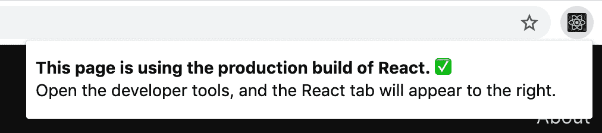
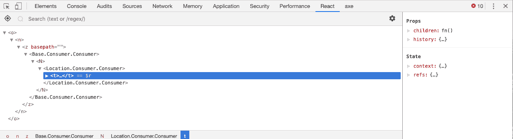

# 第一章：欢迎来到 React

什么才算是一个好的 JavaScript 库？是 GitHub 上的星星数量吗？是 npm 上的下载次数吗？每天 ThoughtLeaders™ 写的推特数量重要吗？我们如何选择最好的工具来构建最好的东西？我们如何知道它值得我们的时间？我们如何知道它是好的？

当 React 刚发布时，围绕它是否好的讨论很多，也有很多怀疑论者。它是新的，新东西常常会让人感到不安。

为了回应这些批评，React 团队的 Pete Hunt 写了一篇文章叫做《为什么选择 React？》，建议你在认为这个团队的方法太狂野之前先“给它（React）五分钟时间”。他希望鼓励人们首先尝试使用 React，而不是立刻认为这个团队的方法太过激进。

是的，React 是一个小型库，它并没有一切你可能需要的东西来直接构建你的应用程序。给它五分钟时间。

是的，在 React 中，你会在 JavaScript 代码中编写类似 HTML 的代码。是的，这些标签需要预处理才能在浏览器中运行。而且你可能需要像 webpack 这样的构建工具。给它五分钟时间。

当 React 接近十年的使用历史时，许多团队决定它很不错，因为他们花了五分钟时间。我们说的是 Uber、Twitter、Airbnb 和 Twitter 这样的巨型公司，它们尝试了 React 并意识到它能帮助团队更快地构建更好的产品。说到底，这不就是我们在这里的原因吗？不是为了推特，不是为了星星，也不是为了下载量。我们在这里是为了用我们喜欢使用的工具来构建酷炫的东西。我们在这里是为了能够自豪地说我们建造的东西。如果你喜欢做这些事情，你可能会喜欢使用 React。

# 强大的基础

无论你是全新于 React 还是希望通过本书了解一些最新特性，我们希望本书能为你未来在这个库上的工作奠定坚实的基础。本书的目标是通过按照一定顺序来放置事物，即学习路线图，避免在学习过程中造成混乱。

在深入了解 React 之前，了解 JavaScript 是很重要的。不是所有 JavaScript，也不是每一种模式，但在跳进这本书之前对数组、对象和函数有一定的熟悉将会很有用。

在接下来的章节中，我们将会看一些新的 JavaScript 语法，让你熟悉最新的 JavaScript 特性，特别是那些经常与 React 一起使用的特性。然后我们将会介绍函数式 JavaScript，以便你理解产生 React 的范式。与 React 协作的一个好处是它可以通过促进可读性、可重用性和可测试性的模式来使你成为更强大的 JavaScript 开发者。有点像温和而有帮助的洗脑。

从那里开始，我们将涵盖 React 基础知识，以理解如何使用组件构建用户界面。然后，我们将学习如何组合这些组件，并通过 props 和 state 添加逻辑。我们将介绍 React Hooks，这允许我们在组件之间重用有状态的逻辑。

一旦基础就位，我们将构建一个新的应用程序，允许用户添加、编辑和删除颜色。我们将学习如何使用 Hooks 和 Suspense 来进行数据获取。在构建该应用程序的过程中，我们将介绍来自更广泛 React 生态系统的各种工具，用于处理常见问题，如路由、测试和服务器端渲染。

我们希望通过这种方式更快地让您了解 React 生态系统，不仅仅是浅尝辄止，而是装备您构建真实世界 React 应用程序所需的工具和技能。

# React 的过去与未来

React 最初由 Facebook 的软件工程师 Jordan Walke 创建。它首次被整合到 Facebook 的新闻提要中是在 2011 年，后来在 2012 年被 Facebook 收购 Instagram 时也加入了。在 2013 年的 JSConf 上，React 被开源，并加入了像 jQuery、Angular、Dojo、Meteor 等 UI 库的拥挤领域。当时，React 被描述为“MVC 中的 V”。换句话说，React 组件充当了 JavaScript 应用程序的视图层或用户界面。

从那时起，社区开始广泛采用。在 2015 年 1 月，Netflix 宣布他们正在使用 React 来驱动他们的 UI 开发。当月晚些时候，发布了 React Native，这是一个使用 React 构建移动应用程序的库。Facebook 还发布了 ReactVR，另一个将 React 带到更广泛渲染目标的工具。在 2015 年和 2016 年，出现了大量流行的工具，如 React Router、Redux 和 Mobx，用于处理路由和状态管理等任务。毕竟，React 被宣传为一个库：专注于实现特定的功能集，而不是为每个用例提供工具。

时间线上的另一个重大事件是 2017 年发布的 React Fiber。Fiber 是 React 渲染算法的重写，在执行上有点神奇。它是 React 内部的完全重写，几乎没有改变公共 API。这是一种使 React 更现代化和高效的方式，而不影响其用户。

更近期的是在 2019 年，我们看到了 Hooks 的发布，这是一种在组件之间添加和共享有状态逻辑的新方法。我们还看到了 Suspense 的发布，这是一种优化 React 异步渲染的方法。

未来，我们无疑会看到更多变化，但 React 成功的原因之一是多年来致力于该项目的强大团队。团队既雄心勃勃又谨慎，推动前瞻性优化，同时不断考虑对库进行任何更改所产生的社区连锁反应。

随着 React 及其相关工具的更新，有时会出现兼容性问题。事实上，未来版本的这些工具可能会使本书中的某些示例代码失效。您仍然可以参考代码示例。我们将在*package.json*文件中提供确切的版本信息，以便您安装正确版本的这些包。

除了本书外，您还可以通过关注官方[React 博客](https://facebook.github.io/react/blog)来跟踪变化。当发布新版本的 React 时，核心团队将撰写详细的博客文章和变更日志。该博客还已被翻译成多种语言，并不断扩展，因此如果英语不是您的母语，您可以在文档站点的[语言页面](https://reactjs.org/languages)上找到本地化版本的文档。

## 学习 React：第二版变更

这是*学习 React*的第二版。我们认为更新本书非常重要，因为 React 在过去几年里已经发生了很大变化。我们打算关注 React 团队推崇的所有当前最佳实践，但也将分享有关弃用 React 功能的信息。有很多使用旧风格编写的仍然运行良好且必须维护的 React 代码。在所有情况下，我们将在侧边栏中提及这些功能，以防您发现自己在处理传统的 React 应用程序。

# 处理文件

在本节中，我们将讨论如何处理本书的文件以及如何安装一些有用的 React 工具。

## 文件库

与本书相关的[GitHub 存储库](https://github.com/moonhighway/learning-react)提供了按章节组织的所有代码文件。

## React 开发者工具

我们强烈建议安装 React 开发者工具来支持您在 React 项目上的工作。这些工具可以作为 Chrome 和 Firefox 的浏览器扩展程序，并作为独立应用程序用于 Safari、IE 和 React Native。一旦安装了开发工具，您将能够检查 React 组件树，查看 props 和 state 的详细信息，甚至查看当前生产环境中正在使用 React 的网站。在调试和学习 React 在其他项目中使用时，这些工具非常有用。

要安装，请访问[GitHub 存储库](https://oreil.ly/5tizT)。在那里，您将找到链接到[Chrome](https://oreil.ly/Or3pH)和[Firefox 扩展程序](https://oreil.ly/uw3uv)。

安装后，您将能够查看哪些网站正在使用 React。只要在浏览器工具栏中如图 1-1 所示看到 React 图标亮起，您就会知道该网站在页面上使用了 React。



###### 图 1-1\. 在 Chrome 中查看 React 开发者工具

接着，当你打开开发者工具时，会看到一个名为 React 的新标签，如图 1-2 所示。点击该标签将显示当前页面中所有组成部分的组件。



###### 图 1-2\. 使用 React 开发者工具检查 DOM

## 安装 Node.js

Node.js 是用于构建全栈应用程序的 JavaScript 运行时环境。Node 是开源的，可以安装在 Windows、macOS、Linux 和其他平台上。在第十二章中构建 Express 服务器时，我们将使用 Node。

你需要安装 Node，但不需要成为 Node 专家才能使用 React。如果不确定你的机器上是否安装了 Node.js，可以打开终端或命令提示符窗口，输入：

```
node -v
```

运行此命令后，应该会返回一个 Node 版本号，理想情况下是 8.6.2 或更高。如果你输入这个命令后看到一个显示“命令未找到”的错误消息，说明 Node.js 没有安装。这很容易通过从[Node.js 网站](http://nodejs.org)安装 Node.js 来解决。只需按照安装程序的自动步骤操作，再次输入`node -v`命令时，你会看到版本号。

### npm

当你安装 Node.js 时，也安装了 npm，即 Node 包管理器。在 JavaScript 社区中，工程师们分享开源代码项目，以避免重写框架、库或辅助函数。React 本身就是一个有用的 npm 库的例子。在本书中，我们将使用 npm 安装各种包。

今天你遇到的大多数 JavaScript 项目都包含各种文件以及一个*package.json*文件。这个文件描述了项目及其所有依赖项。如果你在包含*package.json*文件的文件夹中运行`npm install`，npm 会安装项目中列出的所有包。

如果你从头开始创建自己的项目并想要包含依赖项，只需运行命令：

```
npm init -y
```

这将初始化项目并创建一个*package.json*文件。从那里，你可以用 npm 安装自己的依赖项。要使用 npm 安装包，你将运行：

```
npm install package-name
```

要用 npm 移除一个包，你将运行：

```
npm remove package-name
```

### Yarn

npm 的一个替代品是 Yarn。它于 2016 年由 Facebook 与 Exponent、Google 和 Tilde 合作发布。该项目帮助 Facebook 和其他公司可靠地管理它们的依赖关系。如果你熟悉 npm 的工作流程，学习使用 Yarn 相对简单。首先，用 npm 全局安装 Yarn：

```
npm install -g yarn
```

然后，你就可以准备安装包了。当从*package.json*安装依赖项时，可以用`yarn`代替`npm install`。

要用`yarn`安装特定的包，运行：

```
yarn add package-name
```

要移除一个依赖项，命令也很熟悉：

```
yarn remove package-name
```

Facebook 在生产中使用 Yarn，并且它被包含在像 React、React Native 和 Create React App 这样的项目中。如果你在一个项目中发现了*yarn.lock*文件，那么这个项目在使用 Yarn。类似于`npm install`命令，你可以通过输入`yarn`来安装项目的所有依赖项。

现在你已经配置好了 React 开发环境，可以开始踏上学习 React 的道路了。在第二章，我们将迅速掌握最常见于 React 代码中的最新 JavaScript 语法。
