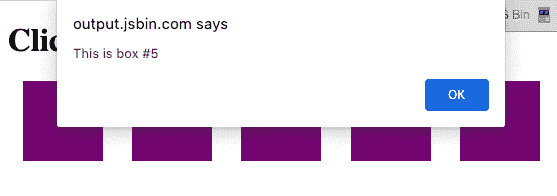
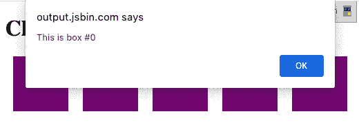

# 第二章：JavaScript 用于 React

自 1995 年发布以来，JavaScript 经历了许多变化。起初，我们使用 JavaScript 为网页添加交互元素：按钮点击、悬停状态、表单验证等。后来，JavaScript 通过 DHTML 和 AJAX 变得更加强大。如今，通过 Node.js，JavaScript 已经成为一种真正用于构建全栈应用程序的软件语言。JavaScript 无处不在。

JavaScript 的演变由使用 JavaScript 的公司的个人、浏览器供应商和社区领导者组成的团体指导。负责在多年来引导 JavaScript 变更的委员会是欧洲计算机制造商协会（ECMA）。语言的变更是由社区驱动的，起源于由社区成员撰写的提案。任何人都可以向 ECMA 委员会提交提案。ECMA 委员会的责任是管理和优先处理这些提案，决定每个规范包含什么内容。

ECMAScript 的第一个版本是 1997 年的 ECMAScript1。接着在 1998 年发布了 ECMAScript2。ECMAScript3 于 1999 年发布，添加了正则表达式、字符串处理等功能。就 ECMAScript4 达成协议的过程而言，变得混乱、政治化，最终被证明是不可能的。它从未发布。2009 年，ECMAScript5（ES5）发布，引入了新的数组方法、对象属性以及对 JSON 的库支持。

自那时起，这个领域的发展势头非常强劲。在 ES6 或 ES2015 于 2015 年发布后，每年都会发布新的 JS 功能。任何属于阶段建议的东西通常被称为 ESNext，简单来说，这是即将成为 JavaScript 规范一部分的新东西。

建议从明确定义的阶段开始，从阶段 0 代表最新的建议，一直到阶段 4 代表完成的建议。当一个建议获得认可时，就由像 Chrome 和 Firefox 等浏览器供应商来实现这些功能。考虑`const`关键字。在创建变量时，我们过去在所有情况下都使用`var`。ECMA 委员会决定应该有一个`const`关键字来声明常量（本章稍后详细介绍）。当`const`首次引入时，你不能简单地在 JavaScript 代码中写`const`并期望它在浏览器中运行。现在可以了，因为浏览器供应商已经改变了浏览器以支持它。

这一章中我们将讨论的许多功能已经得到最新浏览器的支持，但我们还将讲述如何编译您的 JavaScript 代码。这是将浏览器不识别的新语法转换为浏览器理解的旧语法的过程。[kangax 兼容性表](https://oreil.ly/oe7la) 是一个了解最新 JavaScript 功能及其在各浏览器支持程度的好去处。

在本章中，我们将展示本书中将使用的所有 JavaScript 语法。我们希望提供 JavaScript 语法知识的良好基础，这将贯穿您的 React 工作。如果您尚未切换到最新的语法，请现在开始。如果您已经对最新的语言特性感到满意，请跳到下一章。

# 声明变量

在 ES2015 之前，声明变量的唯一方法是使用`var`关键字。现在我们有几种不同的选项，提供了改进的功能。

## `const`关键字

常量是一种不能被覆盖的变量。一旦声明，您不能更改其值。在 JavaScript 中，我们创建许多变量不应该被覆盖，因此我们将经常使用`const`。与其他语言一样，JavaScript 在 ES6 中引入了常量。

在常量出现之前，我们只有变量，并且变量可以被覆盖：

```
var pizza = true;
pizza = false;
console.log(pizza); // false
```

我们无法重置常量变量的值，如果尝试覆盖值，会生成控制台错误（如图 2-1 所示）：

```
const pizza = true;
pizza = false;
```


###### 图 2-1\. 尝试覆盖常量

## `let`关键字

JavaScript 现在具有*词法变量作用域*。在 JavaScript 中，我们使用大括号（`{}`）创建代码块。在函数中，这些大括号会阻止使用`var`声明的任何变量的作用域。另一方面，考虑`if/else`语句。如果您来自其他语言，您可能会假设这些块也会阻止变量作用域。直到`let`出现之前，情况并非如此。

如果在`if/else`块内部创建变量，则该变量不会作用域于该块：

```
var topic = "JavaScript";

if (topic) {
  var topic = "React";
  console.log("block", topic); // block React
}

console.log("global", topic); // global React
```

在`if`块内部的`topic`变量重置了块外的`topic`的值。

使用`let`关键字，我们可以将变量作用域限定在任何代码块中。使用`let`可以保护全局变量的值：

```
var topic = "JavaScript";

if (topic) {
  let topic = "React";
  console.log("block", topic); // React
}

console.log("global", topic); // JavaScript
```

`topic`的值在块外部不会被重置。

另一个大括号不阻止变量作用域的区域是`for`循环：

```
var div,
  container = document.getElementById("container");

for (var i = 0; i < 5; i++) {
  div = document.createElement("div");
  div.onclick = function() {
    alert("This is box #" + i);
  };
  container.appendChild(div);
}
```

在这个循环中，我们创建了五个`div`，它们出现在一个容器内。每个`div`都被分配了一个`onclick`处理程序，用于创建一个警报框来显示索引。在`for`循环中声明`i`创建了一个名为`i`的全局变量，然后迭代直到其值达到`5`。当您点击这些框中的任何一个时，警报显示所有`div`的`i`均等于`5`，因为全局`i`的当前值为`5`（参见图 2-2）。



###### 图 2-2\. 每个框中的`i`均等于 5

使用`let`声明循环计数器`i`而不是`var`可以保护`i`的作用域。现在点击任何框都会显示与循环迭代作用域关联的`i`的值（见图 2-3）：

```
const container = document.getElementById("container");
let div;
for (let i = 0; i < 5; i++) {
  div = document.createElement("div");
  div.onclick = function() {
    alert("This is box #: " + i);
  };
  container.appendChild(div);
}
```



###### 图 2-3\. 使用`let`保护`i`的作用域

使用`let`保护`i`的作用域。

## 模板字符串

模板字符串为我们提供了替代字符串连接的方法。它们还允许我们在字符串中插入变量。你会听到这些被称为模板字符串、模板文字或字符串模板，可以互换使用。

传统的字符串连接使用加号来使用变量值和字符串来组合字符串：

```
console.log(lastName + ", " + firstName + " " + middleName);
```

通过模板，我们可以创建一个字符串，并通过`${ }`将变量值插入其中：

```
console.log(`${lastName}, ${firstName} ${middleName}`);
```

任何返回值的 JavaScript 都可以在模板字符串的`${ }`之间添加到模板字符串中。

模板字符串遵循空白字符，使得更容易草拟电子邮件模板、代码示例或任何包含空白字符的内容。现在，你可以拥有跨越多行的字符串而不会破坏你的代码：

```
const email = `
Hello ${firstName},

Thanks for ordering ${qty} tickets to ${event}.

Order Details
${firstName} ${middleName} ${lastName}
     ${qty} x $${price} = $${qty*price} to ${event}

You can pick your tickets up 30 minutes before
the show.

Thanks,

${ticketAgent}
`
```

以前，在 JavaScript 代码中直接使用 HTML 字符串并不容易，因为我们需要将其连成一行。现在，空白字符被识别为文本，你可以插入格式化的 HTML，这样更容易阅读和理解：

```
document.body.innerHTML = `
<section>
 <header>
 <h1>The React Blog</h1>
 </header>
 <article>
 <h2>${article.title}</h2>
      ${article.body}
 </article>
 <footer>
 <p>copyright ${new Date().getYear()} | The React Blog</p>
 </footer>
</section>
`;
```

注意，我们还可以为页面标题和文章文本包含变量。

# 创建函数

每当你想用 JavaScript 执行一些可重复的任务时，你可以使用函数。让我们看看可以用来创建函数的不同语法选项以及这些函数的解剖学。

## 函数声明

函数声明或函数定义以`function`关键字开头，后面跟着函数名`logCompliment`。作为函数的一部分的 JavaScript 语句定义在花括号之间：

```
function logCompliment() {
  console.log("You're doing great!");
}
```

一旦声明了函数，你将调用它以查看其执行结果：

```
function logCompliment() {
  console.log("You're doing great!");
}

logCompliment();
```

一旦调用，你会看到赞美语句被记录在控制台上。

## 函数表达式

另一个选项是使用函数表达式。这只涉及将函数创建为变量：

```
const logCompliment = function() {
  console.log("You're doing great!");
};

logCompliment();
```

结果是相同的，`You're doing great!`被记录在控制台上。

在决定使用函数声明还是函数表达式时要注意的一件事是，函数声明是被提升的，而函数表达式不是。换句话说，你可以在编写函数声明之前调用函数。你不能调用由函数表达式创建的函数。这将导致错误。例如：

```
// Invoking the function before it's declared
hey();
// Function Declaration
function hey() {
  alert("hey!");
}
```

这有效。你会看到警报出现在浏览器中。它有效是因为该函数被提升，或者说被移动到文件作用域的顶部。如果尝试使用函数表达式进行相同的练习，将会导致错误：

```
// Invoking the function before it's declared
hey();
// Function Expression
const hey = function() {
  alert("hey!");
};
```

```
TypeError: hey is not a function
```

这显然是一个小例子，但在项目中导入文件和函数时偶尔会出现这种 TypeError。如果你看到它，你可以随时重构为声明。

### 传递参数

`logCompliment`函数当前不接受任何参数或参数。如果我们想为函数提供动态变量，可以通过将它们添加到括号中来将命名参数传递给函数。让我们首先添加一个`firstName`变量：

```
const logCompliment = function(firstName) {
  console.log(`You're doing great, ${firstName}`);
};

logCompliment("Molly");
```

现在当我们调用`logCompliment`函数时，发送的`firstName`值将添加到控制台消息中。

我们可以通过创建一个名为`message`的新参数来进一步扩展此功能。现在，我们不会硬编码消息。我们将作为参数传入一个动态值：

```
const logCompliment = function(firstName, message) {
  console.log(`${firstName}: ${message}`);
};

logCompliment("Molly", "You're so cool");
```

### 函数返回

`logCompliment`函数当前将赞美语句记录到控制台，但更常见的是，我们将使用函数来返回一个值。让我们为这个函数添加一个`return`语句。`return`语句指定函数返回的值。我们将函数重命名为`createCompliment`：

```
const createCompliment = function(firstName, message) {
  return `${firstName}: ${message}`;
};

createCompliment("Molly", "You're so cool");
```

如果你想检查函数是否按预期执行，只需在`console.log`中包裹函数调用：

```
console.log(createCompliment("You're so cool", "Molly"));
```

## 默认参数

包括 C++和 Python 在内的语言允许开发人员为函数参数声明默认值。ES6 规范中包含默认参数，因此如果未为参数提供值，则将使用默认值。

例如，我们可以为参数`name`和`activity`设置默认字符串：

```
function logActivity(name = "Shane McConkey", activity = "skiing") {
  console.log(`${name} loves ${activity}`);
}
```

如果`logActivity`函数没有提供参数，它将使用默认值正确运行。默认参数可以是任何类型，不仅仅是字符串：

```
const defaultPerson = {
  name: {
    first: "Shane",
    last: "McConkey"
  },
  favActivity: "skiing"
};

function logActivity(person = defaultPerson) {
  console.log(`${person.name.first} loves ${person.favActivity}`);
}
```

## 箭头函数

箭头函数是 ES6 的一个有用的新特性。使用箭头函数，可以创建函数而无需使用`function`关键字。通常也不需要使用`return`关键字。让我们考虑一个函数，它接受一个`firstName`并返回一个字符串，将这个人变成一个领主。任何人都可以成为一个领主：

```
const lordify = function(firstName) {
  return `${firstName} of Canterbury`;
};

console.log(lordify("Dale")); // Dale of Canterbury
console.log(lordify("Gail")); // Gail of Canterbury
```

使用箭头函数，我们可以极大地简化语法：

```
const lordify = firstName => `${firstName} of Canterbury`;
```

有了箭头，我们现在可以将整个函数声明放在一行上。移除了`function`关键字。我们还移除了`return`，因为箭头指向了应该返回的内容。另一个好处是，如果函数只接受一个参数，我们可以移除参数周围的括号。

多个参数应该用括号括起来：

```
// Typical function
const lordify = function(firstName, land) {
  return `${firstName} of ${land}`;
};
```

```
// Arrow Function
const lordify = (firstName, land) => `${firstName} of ${land}`;

console.log(lordify("Don", "Piscataway")); // Don of Piscataway
console.log(lordify("Todd", "Schenectady")); // Todd of Schenectady
```

我们可以将这个函数保持为一行，因为只有一个语句需要返回。如果有多行，你将使用大括号：

```
const lordify = (firstName, land) => {
  if (!firstName) {
    throw new Error("A firstName is required to lordify");
  }

  if (!land) {
    throw new Error("A lord must have a land");
  }

  return `${firstName} of ${land}`;
};

console.log(lordify("Kelly", "Sonoma")); // Kelly of Sonoma
console.log(lordify("Dave")); // ! JAVASCRIPT ERROR
```

这些`if/else`语句被括号包围，但仍然从箭头函数的更短语法中受益。

### 返回对象

如果你想返回一个对象会发生什么？考虑一个名为`person`的函数，它基于传入的参数`firstName`和`lastName`构建一个对象：

```
const person = (firstName, lastName) =>
    {
        first: firstName,
        last: lastName
    }

console.log(person("Brad", "Janson"));
```

一旦运行，你会看到错误：`Uncaught SyntaxError: Unexpected token :`。要解决这个问题，只需用括号包裹你返回的对象：

```
const person = (firstName, lastName) => ({
  first: firstName,
  last: lastName
});

console.log(person("Flad", "Hanson"));
```

这些缺少的括号是 JavaScript 和 React 应用程序中无数错误的根源，因此记住这一点非常重要！

### 箭头函数和作用域

普通函数不会阻塞 `this`。例如，在 `setTimeout` 回调中，`this` 变成了其他内容，而不是 `tahoe` 对象：

```
const tahoe = {
  mountains: ["Freel", "Rose", "Tallac", "Rubicon", "Silver"],
  print: function(delay = 1000) {
    setTimeout(function() {
      console.log(this.mountains.join(", "));
    }, delay);
  }
};

tahoe.print(); // Uncaught TypeError: Cannot read property 'join' of undefined
```

抛出此错误是因为它试图在 `this` 上使用 `.join` 方法。如果我们记录 `this`，我们会发现它指向 `Window` 对象：

```
console.log(this); // Window {}
```

为了解决这个问题，我们可以使用箭头函数语法来保护 `this` 的作用域：

```
const tahoe = {
  mountains: ["Freel", "Rose", "Tallac", "Rubicon", "Silver"],
  print: function(delay = 1000) {
    setTimeout(() => {
      console.log(this.mountains.join(", "));
    }, delay);
  }
};

tahoe.print(); // Freel, Rose, Tallac, Rubicon, Silver
```

这按预期工作，我们可以用逗号`.join`连接度假胜地。请注意始终牢记作用域。箭头函数不会阻止 `this` 的作用域：

```
const tahoe = {
  mountains: ["Freel", "Rose", "Tallac", "Rubicon", "Silver"],
  print: (delay = 1000) => {
    setTimeout(() => {
      console.log(this.mountains.join(", "));
    }, delay);
  }
};

tahoe.print(); // Uncaught TypeError: Cannot read property 'join' of undefined
```

将 `print` 函数更改为箭头函数意味着 `this` 实际上是 `window`。

# 编译 JavaScript

当一个新的 JavaScript 特性被提出并获得支持时，社区经常希望在所有浏览器都支持之前开始使用它。确保您的代码能够正常工作的唯一方法是在浏览器运行之前将其转换为更广泛兼容的代码。这个过程称为*编译*。JavaScript 编译的最流行工具之一是[Babel](http://www.babeljs.io)。

在过去，使用最新的 JavaScript 特性的唯一方法是等待几周、几个月，甚至几年，直到浏览器支持它们。现在，Babel 使得立即使用 JavaScript 的最新特性成为可能。编译步骤使 JavaScript 变得类似于其他语言。它并不完全是传统的编译：我们的代码不会被编译成二进制代码。相反，它被转换为可以被更广泛范围的浏览器解释的语法。此外，JavaScript 现在有源代码，这意味着你的项目中会有一些文件，在浏览器中不会运行。

例如，让我们看一个带有一些默认参数的箭头函数：

```
const add = (x = 5, y = 10) => console.log(x + y);
```

如果我们对这段代码运行 Babel，它将生成以下内容：

```
"use strict";

var add = function add() {
  var x =
    arguments.length <= 0 || arguments[0] === undefined ? 5 : arguments[0];
  var y =
    arguments.length <= 1 || arguments[1] === undefined ? 10 : arguments[1];
  return console.log(x + y);
};
```

Babel 添加了一个“use strict”声明以运行严格模式。变量 `x` 和 `y` 使用 `arguments` 数组进行了默认设置，这是您可能熟悉的一种技术。生成的 JavaScript 得到了更广泛的支持。

了解 Babel 工作原理的一个好方法是查看文档网站上的[Babel REPL](https://babeljs.io/repl)。在左侧输入一些新语法，然后查看创建的一些旧语法。

JavaScript 编译的过程通常由像 webpack 或 Parcel 这样的构建工具自动化。我们稍后会更详细地讨论这个问题。

# 对象和数组

自 ES2016 起，JavaScript 语法支持在对象和数组中创建变量作用域的创造性方式。这些创造性技术在 React 社区中被广泛使用。让我们看看其中一些，包括解构、对象字面量增强和展开运算符。

## 解构对象

解构赋值允许您在对象内部局部范围字段，并声明将使用哪些值。考虑 `sandwich` 对象。它有四个键，但我们只想使用两个的值。我们可以将 `bread` 和 `meat` 限定为在本地使用：

```
const sandwich = {
  bread: "dutch crunch",
  meat: "tuna",
  cheese: "swiss",
  toppings: ["lettuce", "tomato", "mustard"]
};

const { bread, meat } = sandwich;

console.log(bread, meat); // dutch crunch tuna
```

代码从对象中提取 `bread` 和 `meat`，并为它们创建局部变量。此外，由于我们使用 `let` 声明了这些解构变量，因此可以更改 `bread` 和 `meat` 变量，而不影响原始三明治：

```
const sandwich = {
  bread: "dutch crunch",
  meat: "tuna",
  cheese: "swiss",
  toppings: ["lettuce", "tomato", "mustard"]
};

let { bread, meat } = sandwich;

bread = "garlic";
meat = "turkey";

console.log(bread); // garlic
console.log(meat); // turkey

console.log(sandwich.bread, sandwich.meat); // dutch crunch tuna
```

我们还可以从传入的函数参数中解构。考虑这个函数，它将一个人的名字记录为贵族：

```
const lordify = regularPerson => {
  console.log(`${regularPerson.firstname} of Canterbury`);
};

const regularPerson = {
  firstname: "Bill",
  lastname: "Wilson"
};

lordify(regularPerson); // Bill of Canterbury
```

我们可以通过解构 `regularPerson` 来获取我们需要的值，而不是使用点符号语法深入对象：

```
const lordify = ({ firstname }) => {
  console.log(`${firstname} of Canterbury`);
};

const regularPerson = {
  firstname: "Bill",
  lastname: "Wilson"
};

lordify(regularPerson); // Bill of Canterbury
```

让我们进一步反映数据变化。现在，`regularPerson` 对象在 `spouse` 键上有一个新的嵌套对象：

```
const regularPerson = {
  firstname: "Bill",
  lastname: "Wilson",
  spouse: {
    firstname: "Phil",
    lastname: "Wilson"
  }
};
```

如果我们想要将配偶的名字昇华为贵族，我们需要稍微调整函数的解构参数：

```
const lordify = ({ spouse: { firstname } }) => {
  console.log(`${firstname} of Canterbury`);
};

lordify(regularPerson); // Phil of Canterbury
```

使用冒号和嵌套大括号，我们可以从 `spouse` 对象中解构出 `firstname`。

## 数组解构

值也可以从数组中解构出来。想象一下，我们想要将数组的第一个值分配给一个名为 `name` 的变量：

```
const [firstAnimal] = ["Horse", "Mouse", "Cat"];

console.log(firstAnimal); // Horse
```

我们还可以使用 *列表匹配* 来跳过不必要的值，使用逗号。当逗号代替应该跳过的元素时，列表匹配发生。使用相同的数组，我们可以通过用逗号替换前两个值来访问最后一个值：

```
const [, , thirdAnimal] = ["Horse", "Mouse", "Cat"];

console.log(thirdAnimal); // Cat
```

在本节后面，我们将通过结合数组解构和扩展操作符来进一步说明这个例子。

## 对象文字增强

*对象文字增强*与解构相反。它是重新构造或将对象重新组合的过程。使用对象文字增强，我们可以从全局范围内获取变量并将它们添加到一个对象中：

```
const name = "Tallac";
const elevation = 9738;

const funHike = { name, elevation };

console.log(funHike); // {name: "Tallac", elevation: 9738}
```

`name` 和 `elevation` 现在是 `funHike` 对象的键。

我们还可以使用对象文字增强或重构来创建对象方法：

```
const name = "Tallac";
const elevation = 9738;
const print = function() {
  console.log(`Mt. ${this.name} is ${this.elevation} feet tall`);
};

const funHike = { name, elevation, print };

funHike.print(); // Mt. Tallac is 9738 feet tall
```

注意我们使用 `this` 来访问对象键。

在定义对象方法时，不再需要使用 `function` 关键字：

```
// Old
var skier = {
  name: name,
  sound: sound,
  powderYell: function() {
    var yell = this.sound.toUpperCase();
    console.log(`${yell} ${yell} ${yell}!!!`);
  },
  speed: function(mph) {
    this.speed = mph;
    console.log("speed:", mph);
  }
};

// New
const skier = {
  name,
  sound,
  powderYell() {
    let yell = this.sound.toUpperCase();
    console.log(`${yell} ${yell} ${yell}!!!`);
  },
  speed(mph) {
    this.speed = mph;
    console.log("speed:", mph);
  }
};
```

对象文字增强允许我们将全局变量引入对象，并通过使 `function` 关键字不再必要来减少输入。

## 扩展操作符

扩展操作符是三个点（`...`），执行多种不同的任务。首先，扩展操作符允许我们合并数组的内容。例如，如果我们有两个数组，我们可以创建一个第三个数组，将这两个数组合并成一个：

```
const peaks = ["Tallac", "Ralston", "Rose"];
const canyons = ["Ward", "Blackwood"];
const tahoe = [...peaks, ...canyons];

console.log(tahoe.join(", ")); // Tallac, Ralston, Rose, Ward, Blackwood
```

将 `peaks` 和 `canyons` 中的所有项推入一个名为 `tahoe` 的新数组。

让我们看看扩展操作符如何帮助我们解决问题。使用前面示例中的 `peaks` 数组，假设我们想要抓取数组的最后一个项目而不是第一个项目。我们可以使用 `Array.reverse` 方法结合数组解构来反转数组：

```
const peaks = ["Tallac", "Ralston", "Rose"];
const [last] = peaks.reverse();

console.log(last); // Rose
console.log(peaks.join(", ")); // Rose, Ralston, Tallac
```

看到发生了什么了吗？`reverse` 函数实际上已经改变或突变了数组。在有了扩展操作符的世界中，我们不必改变原始数组。相反，我们可以创建一个数组副本，然后反转它：

```
const peaks = ["Tallac", "Ralston", "Rose"];
const [last] = [...peaks].reverse();

console.log(last); // Rose
console.log(peaks.join(", ")); // Tallac, Ralston, Rose
```

由于我们使用扩展操作符复制了数组，所以`peaks`数组仍然保持原样，可以稍后以其原始形式使用。

扩展操作符也可以用于获取数组中的剩余项：

```
const lakes = ["Donner", "Marlette", "Fallen Leaf", "Cascade"];

const [first, ...others] = lakes;

console.log(others.join(", ")); // Marlette, Fallen Leaf, Cascade
```

我们还可以使用三个点语法将函数参数收集为数组。在函数中使用时，这些称为`rest parameters`。在这里，我们构建一个函数，使用扩展操作符接收*n*个参数，然后使用这些参数打印一些控制台消息：

```
function directions(...args) {
  let [start, ...remaining] = args;
  let [finish, ...stops] = remaining.reverse();

  console.log(`drive through ${args.length} towns`);
  console.log(`start in ${start}`);
  console.log(`the destination is ${finish}`);
  console.log(`stopping ${stops.length} times in between`);
}

directions("Truckee", "Tahoe City", "Sunnyside", "Homewood", "Tahoma");
```

`directions`函数使用扩展操作符接收参数。第一个参数分配给`start`变量。使用`Array.reverse`将最后一个参数分配给`finish`变量。然后使用`arguments`数组的长度来显示我们要经过的城镇数量。停靠的数量是`arguments`数组长度减去`finish`停靠的数量。这提供了 incredible flexibility，因为我们可以使用`directions`函数处理任意数量的停靠。

扩展操作符也可用于对象（请参阅 GitHub 页面上的[Rest/Spread Properties](https://oreil.ly/kCpEL)）。与数组一样，使用对象的扩展操作符是相似的。在这个例子中，我们将以与合并两个数组为同样的方式使用它，但不是数组，而是对象：

```
const morning = {
  breakfast: "oatmeal",
  lunch: "peanut butter and jelly"
};

const dinner = "mac and cheese";

const backpackingMeals = {
  ...morning,
  dinner
};

console.log(backpackingMeals);

// {
//   breakfast: "oatmeal",
//   lunch: "peanut butter and jelly",
//   dinner: "mac and cheese"
// }
```

# 异步 JavaScript

到目前为止，本章节的代码示例都是同步的。当我们编写同步 JavaScript 代码时，我们提供了一系列立即按顺序执行的指令。例如，如果我们想要使用 JavaScript 处理一些简单的 DOM 操作，我们会这样写代码：

```
const header = document.getElementById("heading");
header.innerHTML = "Hey!";
```

这些是指示。“嘿，去选择那个 id 为`heading`的元素。然后当你完成时，把它的内部 HTML 设置为*嘿*。”它同步工作。在每个操作正在进行时，不会发生其他事情。

在现代网络中，我们需要执行异步任务。这些任务通常必须等待某些工作完成后才能完成。我们可能需要访问数据库。我们可能需要流式传输视频或音频内容。我们可能需要从 API 获取数据。使用 JavaScript，异步任务不会阻塞主线程。JavaScript 可以在等待 API 返回数据时做其他事情。JavaScript 在过去几年中已经发展了很多，使处理这些异步操作变得更容易。让我们探讨一些使这成为可能的功能。

## 使用 Fetch 进行简单的 Promise 处理

以前，向 REST API 发出请求相当麻烦。我们必须编写 20 多行嵌套代码才能将一些数据加载到我们的应用中。然后出现了`fetch()`函数，简化了我们的生活。感谢 ECMAScript 委员会使 fetch 成为可能。

让我们从 randomuser.me API 获取一些数据。这个 API 提供了假成员的电子邮件地址、姓名、电话号码、位置等信息，非常适合用作虚拟数据。`fetch` 接受此资源的 URL 作为其唯一参数：

```
console.log(fetch("https://api.randomuser.me/?nat=US&results=1"));
```

当我们记录这个时，我们看到有一个待处理的 promise。*Promises* 给了我们在 JavaScript 中理解异步行为的一种方式。Promise 是一个对象，表示异步操作是挂起、已完成还是失败。可以把这看作浏览器说，“嘿，我会尽力去获取这些数据。无论如何，我会回来告诉你结果的。”

所以回到 `fetch` 结果。待处理的 promise 表示在获取数据之前的状态。我们需要链接一个名为 `.then()` 的函数。这个函数将接收一个回调函数，如果上一个操作成功，就会运行这个函数。换句话说，获取一些数据，然后做其他事情。

我们想要做的另一件事是将响应转换为 JSON：

```
fetch("https://api.randomuser.me/?nat=US&results=1").then(res =>
  console.log(res.json())
);
```

`then` 方法在 promise 解析后将调用回调函数。从这个函数返回的任何内容都成为下一个 `then` 函数的参数。因此，我们可以链式调用 `then` 函数来处理已成功解析的 promise：

```
fetch("https://api.randomuser.me/?nat=US&results=1")
  .then(res => res.json())
  .then(json => json.results)
  .then(console.log)
  .catch(console.error);
```

首先，我们使用 `fetch` 发起 GET 请求到 randomuser.me。如果请求成功，我们将把响应主体转换为 JSON。接下来，我们将获取的 JSON 数据返回结果，然后将结果发送给 `console.log` 函数，它将把它们记录到控制台中。最后，还有一个 `catch` 函数，如果 `fetch` 未能成功解析，将调用回调。任何从 randomuser.me 获取数据时发生的错误都将基于该回调。在这里，我们简单地使用 `console.error` 将错误记录到控制台。

## 异步/等待

处理 promise 的另一种流行方法是创建一个异步函数。一些开发人员更喜欢异步函数的语法，因为它看起来更像是同步函数中的代码。与等待 promise 解析并使用一系列 `then` 函数处理不同，`async` 函数可以等待 promise 解析后再执行函数中找到的任何代码。

让我们再发起一个 API 请求，但用异步函数来包装功能：

```
const getFakePerson = async () => {
  let res = await fetch("https://api.randomuser.me/?nat=US&results=1");
  let { results } = res.json();
  console.log(results);
};

getFakePerson();
```

注意，`getFakePerson` 函数是使用 `async` 关键字声明的。这使它成为一个异步函数，可以等待 promise 解析后再执行任何后续代码。在 promise 调用之前使用 `await` 关键字。这告诉函数等待 promise 解析。这段代码完成了与前一节使用 `then` 函数的代码几乎相同的任务……

```
const getFakePerson = async () => {
  try {
    let res = await fetch("https://api.randomuser.me/?nat=US&results=1");
    let { results } = res.json();
    console.log(results);
  } catch (error) {
    console.error(error);
  }
};

getFakePerson();
```

就这样——现在这段代码完成了与上一节使用`then`函数的代码完全相同的任务。如果`fetch`调用成功，结果会被记录到控制台。如果失败，我们将使用`console.error`将错误记录到控制台。当使用`async`和`await`时，需要在`try`…`catch`块中包裹你的承诺调用，以处理由于未解决的承诺可能发生的任何错误。

## 构建承诺

在进行异步请求时，可能发生两种情况：一切如我们所希望的进行，或者出现错误。成功或失败的请求可能有许多不同类型。例如，我们可以尝试多种方式获取数据以达到成功的目的。我们也可能收到多种类型的错误。承诺为我们提供了一种简化为简单通过或失败的方法。

`getPeople`函数返回一个新的承诺。该承诺向 API 发出请求。如果承诺成功，数据将加载。如果承诺失败，将发生错误：

```
const getPeople = count =>
  new Promise((resolves, rejects) => {
    const api = `https://api.randomuser.me/?nat=US&results=${count}`;
    const request = new XMLHttpRequest();
    request.open("GET", api);
    request.onload = () =>
      request.status === 200
        ? resolves(JSON.parse(request.response).results)
        : reject(Error(request.statusText));
    request.onerror = err => rejects(err);
    request.send();
  });
```

随   有了这个，承诺已经创建，但尚未使用。我们可以通过调用`getPeople`函数并传入应该加载的成员数量来使用承诺。`then`函数可以链式调用，以在承诺完成后执行某些操作。当承诺被拒绝时，任何细节都会传递回`catch`函数，或者在使用`async/await`语法时传递到`catch`块：

```
getPeople(5)
  .then(members => console.log(members))
  .catch(error => console.error(`getPeople failed: ${error.message}`))
);
```

承诺使处理异步请求变得更加容易，这是很好的，因为我们在 JavaScript 中需要处理很多异步性。对异步行为的扎实理解对于现代 JavaScript 工程师至关重要。

# 类

在 ES2015 之前，JavaScript 规范中没有官方的类语法。当类被引入时，人们对类的语法与传统的面向对象语言如 Java 和 C++的相似性感到兴奋。过去几年中，React 库在构建用户界面组件时大量依赖类。如今，React 开始逐渐摆脱类的使用，改用函数来构建组件。你仍然会在各处看到类，特别是在遗留的 React 代码中以及 JavaScript 的世界中，所以让我们快速看一下它们。

JavaScript 使用一种叫做`原型继承`的东西。可以利用这种技术创建感觉像面向对象的结构。例如，我们可以创建一个需要使用`new`操作符调用的`Vacation`构造函数：

```
function Vacation(destination, length) {
  this.destination = destination;
  this.length = length;
}

Vacation.prototype.print = function() {
  console.log(this.destination + " | " + this.length + " days");
};

const maui = new Vacation("Maui", 7);

maui.print(); // Maui | 7 days
```

这段代码创建了一种感觉上像是面向对象语言中的自定义类型的东西。`Vacation`有属性（目的地、长度），并且有一个方法（print）。通过原型，`maui`实例继承了`print`方法。如果您是或曾经是习惯于更标准类的开发人员，这可能会让您充满深深的愤怒。ES2015 引入了类声明以平息这种愤怒，但肮脏的秘密是 JavaScript 仍然以同样的方式工作。函数是对象，并且通过原型处理继承。类提供了一种语法糖，覆盖了那个复杂的原型语法：

```
class Vacation {
  constructor(destination, length) {
    this.destination = destination;
    this.length = length;
  }

  print() {
    console.log(`${this.destination} will take ${this.length} days.`);
  }
}
```

当您创建一个类时，类名通常大写。一旦创建了类，可以使用`new`关键字创建类的新实例。然后可以调用类的自定义方法：

```
const trip = new Vacation("Santiago, Chile", 7);

trip.print(); // Chile will take 7 days.
```

现在已创建了一个类对象，可以随意使用它多次创建新的假期实例。类也可以被扩展。当扩展一个类时，子类将继承父类的属性和方法。这些属性和方法可以从这里操作，但默认情况下将全部继承。

您可以使用`Vacation`作为抽象类来创建不同类型的假期。例如，`Expedition`可以扩展`Vacation`类以包括装备：

```
class Expedition extends Vacation {
  constructor(destination, length, gear) {
    super(destination, length);
    this.gear = gear;
  }

  print() {
    super.print();
    console.log(`Bring your ${this.gear.join(" and your ")}`);
  }
}
```

这是简单的继承：子类继承了父类的属性。通过调用`Vacation`的`print`方法，我们可以在`Expedition`的`print`方法打印的内容后添加一些新内容。创建新实例的方法与此完全相同——创建一个变量并使用`new`关键字：

```
const trip = new Expedition("Mt. Whitney", 3, [
  "sunglasses",
  "prayer flags",
  "camera"
]);

trip.print();

// Mt. Whitney will take 3 days.
// Bring your sunglasses and your prayer flags and your camera
```

# ES6 模块

JavaScript 的*模块*是可重复使用的代码片段，可以轻松地并入其他 JavaScript 文件而不会引起变量冲突。JavaScript 模块存储在单独的文件中，每个模块一个文件。创建和导出模块有两个选项：可以从单个模块中导出多个 JavaScript 对象，或者每个模块导出一个 JavaScript 对象。

在*text-helpers.js*中，导出了两个函数：

```
export const print=(message) => log(message, new Date())

export const log=(message, timestamp) =>
  console.log(`${timestamp.toString()}: ${message}`)
```

`export`可以用于导出将在另一个模块中使用的任何 JavaScript 类型。在此示例中，导出了`print`函数和`log`函数。在*text-helpers.js*中声明的任何其他变量将局限于该模块。

模块还可以导出单个主变量。在这些情况下，可以使用`export default`。例如，*mt-freel.js*文件可以导出特定的远征：

```
export default new Expedition("Mt. Freel", 2, ["water", "snack"]);
```

当您希望只导出一个类型时，可以使用`export default`代替`export`。同样，`export`和`export default`可以用于任何 JavaScript 类型：原始类型、对象、数组和函数。

可以使用`import`语句在其他 JavaScript 文件中消耗模块。具有多个导出的模块可以利用对象解构。使用`export default`的模块将导入到单个变量中：

```
import { print, log } from "./text-helpers";
import freel from "./mt-freel";

print("printing a message");
log("logging a message");

freel.print();
```

您可以在不同变量名称下本地化模块变量作用域：

```
import { print as p, log as l } from "./text-helpers";

p("printing a message");
l("logging a message");
```

您还可以使用 `*` 将所有内容导入到单个变量中：

```
import * as fns from './text-helpers`
```

此 `import` 和 `export` 语法尚未完全被所有浏览器或 Node 支持。但与任何新兴的 JavaScript 语法一样，它受到 Babel 的支持。这意味着您可以在源代码中使用这些语句，而 Babel 将知道在编译的 JavaScript 中找到您想要包含的模块。

## CommonJS

CommonJS 是由所有 Node 版本支持的模块模式（参见[Node.js 模块文档](https://oreil.ly/CN-gA)）。您仍然可以通过 Babel 和 webpack 使用这些模块。在 CommonJS 中，JavaScript 对象使用 `module.exports` 导出。

例如，在 CommonJS 中，我们可以将 `print` 和 `log` 函数导出为一个对象：

```
const print(message) => log(message, new Date())

const log(message, timestamp) =>
console.log(`${timestamp.toString()}: ${message}`}

module.exports = {print, log}
```

CommonJS 不支持 `import` 语句。而是使用 `require` 函数导入模块：

```
const { log, print } = require("./txt-helpers");
```

JavaScript 确实在迅速发展，并适应工程师们对语言日益增长的需求，浏览器也在快速实现新特性。有关最新的兼容性信息，请参阅[ESNext 兼容性表](https://oreil.ly/rxTcg)。许多最新 JavaScript 语法中包含的特性是因为它们支持函数式编程技术。在函数式 JavaScript 中，我们可以将代码视为一组可以组合成应用程序的函数。在接下来的章节中，我们将更详细地探讨函数式技术，并讨论为何您可能希望使用它们。
