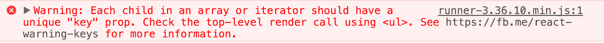
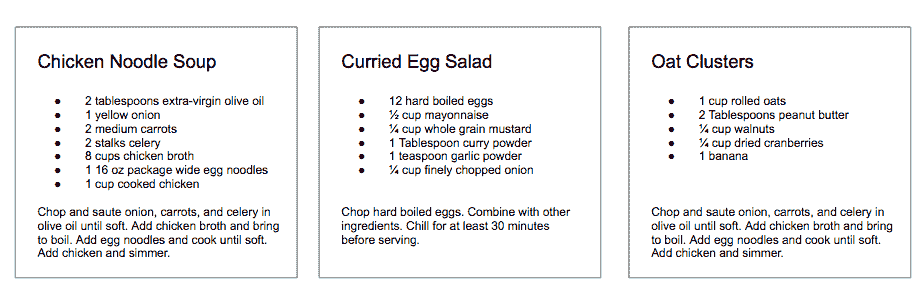
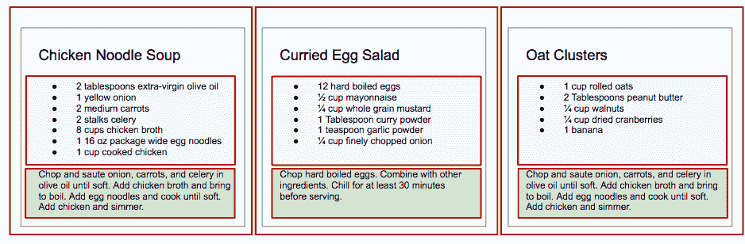

# 第四章：React 的工作原理

到目前为止，你已经温习了最新的语法。你已经复习了引导 React 创建的函数式编程模式。这些步骤已经为你迈出下一步，为你来这里所要做的事情做好了准备：学习 React 的工作原理。让我们开始写一些真正的 React 代码。

当你使用 React 时，很可能会使用 JSX 创建应用程序。JSX 是一种基于标签的 JavaScript 语法，看起来非常像 HTML。在接下来的章节中，我们将深入探讨这种语法，并在本书的其余部分继续使用它。然而，要真正理解 React，我们需要了解它最基本的单元：React 元素。从那里开始，我们将通过查看如何创建组成其他组件和元素的自定义组件来深入了解 React 组件。

# 页面设置

要在浏览器中使用 React，我们需要包含两个库：React 和 ReactDOM。React 是用于创建视图的库。ReactDOM 是用于在浏览器中实际渲染 UI 的库。这两个库都可以从 unpkg CDN 作为脚本获取（链接在下面的代码中）。让我们来设置一个 HTML 文档：

```
<!DOCTYPE html>
<html>
  <head>
    <meta charset="utf-8" />
    <title>React Samples</title>
  </head>
  <body>
    <!-- Target container -->
    <div id="root"></div>

    <!-- React library & ReactDOM (Development Version)-->
    <script
  src="https://unpkg.com/react@16/umd/react.development.js">
  </script>
    <script
  src="https://unpkg.com/react-dom@16/umd/react-dom.development.js">
  </script>

    <script>
      // Pure React and JavaScript code
    </script>
  </body>
</html>
```

这些是在浏览器中使用 React 的最低要求。你可以将你的 JavaScript 放在一个单独的文件中，但它必须在加载 React 之后的页面某处加载。我们将使用开发版本的 React，以便在浏览器控制台中看到所有的错误消息和警告。你可以选择使用被压缩的生产版本 *react.production.min.js* 和 *react-dom.production.min.js*，这样将剥离掉这些警告。

# React 元素

HTML 只是浏览器在构建 DOM 时遵循的一组指令。构成 HTML 文档的元素在浏览器加载 HTML 并渲染用户界面时成为 DOM 元素。

假设你需要为一个食谱构建一个 HTML 层次结构。这样一个任务的可能解决方案可能看起来像这样：

```
<section id="baked-salmon">
  <h1>Baked Salmon</h1>
  <ul class="ingredients">
    <li>2 lb salmon</li>
    <li>5 sprigs fresh rosemary</li>
    <li>2 tablespoons olive oil</li>
    <li>2 small lemons</li>
    <li>1 teaspoon kosher salt</li>
    <li>4 cloves of chopped garlic</li>
  </ul>
  <section class="instructions">
    <h2>Cooking Instructions</h2>
    <p>Preheat the oven to 375 degrees.</p>
    <p>Lightly coat aluminum foil with oil.</p>
    <p>Place salmon on foil</p>
    <p>Cover with rosemary, sliced lemons, chopped garlic.</p>
    <p>Bake for 15-20 minutes until cooked through.</p>
    <p>Remove from oven.</p>
  </section>
</section>
```

在 HTML 中，元素之间以类似于家族树的层次结构相关联。我们可以说根元素（在本例中是一个部分）有三个子元素：一个标题，一个无序的配料列表，和一个用于说明的部分。

在过去，网站由独立的 HTML 页面组成。当用户导航这些页面时，浏览器会请求和加载不同的 HTML 文档。AJAX（异步 JavaScript 和 XML）的发明带来了单页应用程序或[SPA](https://oreil.ly/z6Saj)。由于浏览器可以使用 AJAX 请求和加载小数据片段，整个 Web 应用程序现在可以在单个页面上运行，并依赖 JavaScript 更新用户界面。

在单页应用程序中，浏览器最初加载一个 HTML 文档。当用户通过站点导航时，他们实际上停留在同一个页面上。JavaScript 在用户与应用程序交互时销毁并创建新的用户界面。可能感觉好像你从页面跳转到页面，但实际上你仍然在同一个 HTML 页面上，JavaScript 正在进行重量级的工作。

[DOM API](https://mzl.la/2m1oQDJ) 是 JavaScript 可以用来与浏览器交互以修改 DOM 的一组对象。如果你使用过 `document.createElement` 或 `document.appendChild`，你已经使用过 DOM API。

React 是一个设计用来为我们更新浏览器 DOM 的库。我们不再需要关注构建高性能单页应用程序所涉及的复杂性，因为 React 可以为我们完成这些工作。使用 React，我们不直接与 DOM API 交互。相反，我们提供了关于我们希望 React 构建的指令，React 将负责渲染和协调我们指示它创建的元素。

浏览器 DOM 由 DOM 元素组成。类似地，React DOM 由 React 元素组成。DOM 元素和 React 元素看起来可能相同，但它们实际上是非常不同的。React 元素描述了实际 DOM 元素应该如何看起来。换句话说，React 元素是构建浏览器 DOM 的指令。

我们可以使用 `React.createElement` 创建一个表示 `h1` 的 React 元素：

```
React.createElement("h1", { id: "recipe-0" }, "Baked Salmon");
```

第一个参数定义了我们要创建的元素类型。在这种情况下，我们想创建一个 `h1` 元素。第二个参数表示元素的属性。这个 `h1` 当前有一个 `id` 为 `recipe-0`。第三个参数表示元素的子节点：在开放和闭合标签之间插入的任何节点（在本例中只是一些文本）。

在渲染过程中，React 将这个元素转换为一个实际的 DOM 元素：

```
<h1 id="recipe-0">Baked Salmon</h1>
```

属性同样适用于新的 DOM 元素：属性被添加到标签作为属性，子文本被添加为元素内的文本。React 元素只是一个告诉 React 如何构建 DOM 元素的 JavaScript 字面量。

如果你要记录这个元素，它会像这样：

```
{
  $$typeof: Symbol(React.element),
  "type": "h1",
  "key": null,
  "ref": null,
  "props": {id: "recipe-0", children: "Baked Salmon"},
  "_owner": null,
  "_store": {}
}
```

这是一个 React 元素的结构。有些字段被 React 使用：`_owner`、`_store` 和 `$$typeof`。`key` 和 `ref` 字段对于 React 元素很重要，但我们稍后会介绍它们。现在，让我们更仔细地看看 `type` 和 `props` 字段。

React 元素的 `type` 属性告诉 React 要创建哪种类型的 HTML 或 SVG 元素。`props` 属性表示构建 DOM 元素所需的数据和子元素。`children` 属性用于将其他嵌套元素显示为文本。

# 创建元素

我们来看看 `React.createElement` 返回的对象。你不会手动创建这些元素；相反，你会使用 `React.createElement` 函数。

# ReactDOM

创建 React 元素后，我们希望在浏览器中看到它。ReactDOM 包含在浏览器中渲染 React 元素所需的工具。ReactDOM 是我们将找到`render`方法的地方。

我们可以使用`ReactDOM.render`将 React 元素（包括其子元素）渲染到 DOM 中。要渲染的元素作为第一个参数传递，第二个参数是应该渲染元素的目标节点：

```
const dish = React.createElement("h1", null, "Baked Salmon");

ReactDOM.render(dish, document.getElementById("root"));
```

将标题元素渲染到 DOM 会将`h1`元素添加到具有`id`为`root`的`div`中，我们已经在 HTML 中定义了该`div`。我们在`body`标签中构建此`div`：

```
<body>
  <div id="root">
    <h1>Baked Salmon</h1>
  </div>
</body>
```

与将元素渲染到 DOM 相关的任何内容都可以在`ReactDOM`包中找到。在 React 16 之前的版本中，只能将一个元素渲染到 DOM 中。今天，也可以渲染数组。当这一功能在 2017 年的 ReactConf 上宣布时，每个人都鼓掌欢呼。这是一件大事。具体效果如下：

```
const dish = React.createElement("h1", null, "Baked Salmon");
const dessert = React.createElement("h2", null, "Coconut Cream Pie");

ReactDOM.render([dish, dessert], document.getElementById("root"));
```

这将在`root`容器内将这两个元素呈现为同级。希望你刚才鼓掌欢呼！

在下一节中，我们将了解如何使用`props.children`。

## 子元素

React 使用`props.children`渲染子元素。在前一节中，我们将文本元素作为`h1`元素的子元素呈现，因此`props.children`设置为`Baked Salmon`。我们也可以渲染其他 React 元素作为子元素，从而创建元素树。这就是为什么我们使用术语*元素树*：树有一个根元素，从它长出许多分支。

让我们考虑包含成分的无序列表：

```
<ul>
  <li>2 lb salmon</li>
  <li>5 sprigs fresh rosemary</li>
  <li>2 tablespoons olive oil</li>
  <li>2 small lemons</li>
  <li>1 teaspoon kosher salt</li>
  <li>4 cloves of chopped garlic</li>
</ul>
```

在此示例中，无序列表是根元素，它有六个子元素。我们可以使用`React.createElement`表示此`ul`及其子元素：

```
React.createElement(
  "ul",
  null,
  React.createElement("li", null, "2 lb salmon"),
  React.createElement("li", null, "5 sprigs fresh rosemary"),
  React.createElement("li", null, "2 tablespoons olive oil"),
  React.createElement("li", null, "2 small lemons"),
  React.createElement("li", null, "1 teaspoon kosher salt"),
  React.createElement("li", null, "4 cloves of chopped garlic")
);
```

每个传递给`createElement`函数的额外参数都是另一个子元素。React 创建这些子元素的数组，并将`props.children`的值设置为该数组。

如果我们检查生成的 React 元素，我们将看到每个列表项由一个 React 元素表示，并添加到名为`props.children`的数组中。如果你控制台记录这个元素：

```
const list = React.createElement(
  "ul",
  null,
  React.createElement("li", null, "2 lb salmon"),
  React.createElement("li", null, "5 sprigs fresh rosemary"),
  React.createElement("li", null, "2 tablespoons olive oil"),
  React.createElement("li", null, "2 small lemons"),
  React.createElement("li", null, "1 teaspoon kosher salt"),
  React.createElement("li", null, "4 cloves of chopped garlic")
);

console.log(list);
```

结果如下所示：

```
{
    "type": "ul",
    "props": {
    "children": [
    { "type": "li", "props": { "children": "2 lb salmon" } … },
    { "type": "li", "props": { "children": "5 sprigs fresh rosemary"} … },
    { "type": "li", "props": { "children": "2 tablespoons olive oil" } … },
    { "type": "li", "props": { "children": "2 small lemons"} … },
    { "type": "li", "props": { "children": "1 teaspoon kosher salt"} … },
    { "type": "li", "props": { "children": "4 cloves of chopped garlic"} … }
    ]
    ...
    }
}
```

现在我们可以看到每个列表项都是一个子元素。在本章前面，我们介绍了一个以`section`元素为根的整个食谱的 HTML。要使用 React 创建此内容，我们将使用一系列`createElement`调用：

```
React.createElement(
  "section",
  { id: "baked-salmon" },
  React.createElement("h1", null, "Baked Salmon"),
  React.createElement(
    "ul",
    { className: "ingredients" },
    React.createElement("li", null, "2 lb salmon"),
    React.createElement("li", null, "5 sprigs fresh rosemary"),
    React.createElement("li", null, "2 tablespoons olive oil"),
    React.createElement("li", null, "2 small lemons"),
    React.createElement("li", null, "1 teaspoon kosher salt"),
    React.createElement("li", null, "4 cloves of chopped garlic")
  ),
  React.createElement(
    "section",
    { className: "instructions" },
    React.createElement("h2", null, "Cooking Instructions"),
    React.createElement("p", null, "Preheat the oven to 375 degrees."),
    React.createElement("p", null, "Lightly coat aluminum foil with oil."),
    React.createElement("p", null, "Place salmon on foil."),
    React.createElement(
      "p",
      null,
      "Cover with rosemary, sliced lemons, chopped garlic."
    ),
    React.createElement(
      "p",
      null,
      "Bake for 15-20 minutes until cooked through."
    ),
    React.createElement("p", null, "Remove from oven.")
  )
);
```

# React 中的 className

任何具有 HTML`class`属性的元素都使用`className`作为该属性的属性，而不是`class`。由于`class`是 JavaScript 中的保留字，我们必须使用`className`来定义 HTML 元素的`class`属性。这个示例展示了纯 React 的样子。纯 React 最终在浏览器中运行。React 应用程序是从单个根元素衍生出的 React 元素树。React 元素是 React 将用于在浏览器中构建 UI 的指令。

### 使用数据构造元素

使用 React 的主要优势在于其将数据与 UI 元素分离的能力。由于 React 只是 JavaScript，我们可以添加 JavaScript 逻辑来帮助我们构建 React 组件树。例如，成分可以存储在一个数组中，然后我们可以将该数组映射到 React 元素中。

让我们回过头来思考一下无序列表：

```
React.createElement(
  "ul",
  null,
  React.createElement("li", null, "2 lb salmon"),
  React.createElement("li", null, "5 sprigs fresh rosemary"),
  React.createElement("li", null, "2 tablespoons olive oil"),
  React.createElement("li", null, "2 small lemons"),
  React.createElement("li", null, "1 teaspoon kosher salt"),
  React.createElement("li", null, "4 cloves of chopped garlic")
);
```

此成分列表中使用的数据可以轻松地使用 JavaScript 数组表示：

```
const items = [
  "2 lb salmon",
  "5 sprigs fresh rosemary",
  "2 tablespoons olive oil",
  "2 small lemons",
  "1 teaspoon kosher salt",
  "4 cloves of chopped garlic"
];
```

我们希望使用此数据生成正确数量的列表项，而无需硬编码每个列表项。我们可以映射数组，并为所需的成分创建列表项：

```
React.createElement(
  "ul",
  { className: "ingredients" },
  items.map(ingredient => React.createElement("li", null, ingredient))
);
```

此语法为数组中的每个成分创建一个 React 元素。每个字符串作为文本显示在列表项的子元素中。每个成分的值显示为列表项。

运行此代码时，您将看到一个类似于图 4-1 中显示的控制台警告。



###### 图 4-1\. 控制台警告

当我们通过数组迭代构建子元素列表时，React 喜欢每个元素都有一个`key`属性。`key`属性被 React 用来帮助它高效更新 DOM。通过为每个列表项元素添加一个唯一的`key`属性，可以消除这种警告。可以使用每个成分的数组索引作为该唯一值：

```
React.createElement(
  "ul",
  { className: "ingredients" },
  items.map((ingredient, i) =>
    React.createElement("li", { key: i }, ingredient)
  )
);
```

当我们讨论 JSX 时，我们将更详细地讨论键，但在每个列表项中添加这个将清除控制台警告。

# React 组件

无论其大小、内容或用于创建它的技术如何，用户界面都由部分组成。按钮。列表。标题。将这些部分放在一起，就组成了用户界面。考虑一个包含三个不同菜谱的食谱应用程序。每个盒子中的数据不同，但创建食谱所需的部分相同（参见图 4-2）。



###### 图 4-2\. 食谱应用程序

在 React 中，我们将这些部分描述为*组件*。组件允许我们重用相同的结构，然后我们可以用不同的数据集填充这些结构。

在考虑使用 React 构建用户界面时，寻找将元素分解为可重复使用部件的机会。例如，图 4-3 中的食谱具有标题、成分列表和说明。所有这些都是较大的食谱或应用程序组件的一部分。我们可以为每个突出显示的部分创建一个组件：成分、说明等。



###### 图 4-3\. 每个组件都有轮廓：`App`、`IngredientsList`、`Instructions`

想想这有多可扩展。如果我们想显示一个食谱，我们的组件结构将支持此操作。如果我们想显示 10,000 个食谱，我们只需创建 10,000 个该组件的新实例。

我们将通过编写一个函数来创建一个组件。该函数将返回用户界面的可重用部分。让我们创建一个返回无序食材列表的函数。这次，我们将使用名为`IngredientsList`的函数制作甜点：

```
function IngredientsList() {
  return React.createElement(
    "ul",
    { className: "ingredients" },
    React.createElement("li", null, "1 cup unsalted butter"),
    React.createElement("li", null, "1 cup crunchy peanut butter"),
    React.createElement("li", null, "1 cup brown sugar"),
    React.createElement("li", null, "1 cup white sugar"),
    React.createElement("li", null, "2 eggs"),
    React.createElement("li", null, "2.5 cups all purpose flour"),
    React.createElement("li", null, "1 teaspoon baking powder"),
    React.createElement("li", null, "0.5 teaspoon salt")
  );
}

ReactDOM.render(
  React.createElement(IngredientsList, null, null),
  document.getElementById("root")
);
```

组件的名称是`IngredientsList`，函数输出的元素看起来像这样：

```
<IngredientsList>
  <ul className="ingredients">
    <li>1 cup unsalted butter</li>
    <li>1 cup crunchy peanut butter</li>
    <li>1 cup brown sugar</li>
    <li>1 cup white sugar</li>
    <li>2 eggs</li>
    <li>2.5 cups all purpose flour</li>
    <li>1 teaspoon baking powder</li>
    <li>0.5 teaspoon salt</li>
  </ul>
</IngredientsList>
```

这很酷，但我们已经将这些数据硬编码到组件中了。如果我们能够构建一个组件，然后将数据作为属性传递给该组件呢？然后，如果该组件能够动态呈现数据呢？也许有一天会发生！

开玩笑的那一天就是现在。这里是组合食谱所需的`secretIngredients`数组：

```
const secretIngredients = [
  "1 cup unsalted butter",
  "1 cup crunchy peanut butter",
  "1 cup brown sugar",
  "1 cup white sugar",
  "2 eggs",
  "2.5 cups all purpose flour",
  "1 teaspoon baking powder",
  "0.5 teaspoon salt"
];
```

然后我们将调整`IngredientsList`组件，对这些`items`进行映射，为`items`数组中的项目创建一个`li`：

```
function IngredientsList() {
  return React.createElement(
    "ul",
    { className: "ingredients" },
    items.map((ingredient, i) =>
      React.createElement("li", { key: i }, ingredient)
    )
  );
}
```

然后我们将这些`secretIngredients`作为名为`items`的属性传递，这是在`createElement`中使用的第二个参数：

```
ReactDOM.render(
  React.createElement(IngredientsList, { items: secretIngredients }, null),
  document.getElementById("root")
);
```

现在，让我们看看 DOM。数据属性`items`是一个包含八种食材的数组。因为我们使用循环创建了`li`标签，我们能够使用循环的索引添加一个唯一的键：

```
<IngredientsList items="[...]">
  <ul className="ingredients">
    <li key="0">1 cup unsalted butter</li>
    <li key="1">1 cup crunchy peanut butter</li>
    <li key="2">1 cup brown sugar</li>
    <li key="3">1 cup white sugar</li>
    <li key="4">2 eggs</li>
    <li key="5">2.5 cups all purpose flour</li>
    <li key="6">1 teaspoon baking powder</li>
    <li key="7">0.5 teaspoon salt</li>
  </ul>
</IngredientsList>
```

以这种方式创建我们的组件将使组件更加灵活。无论`items`数组是一个项目还是一百个项目长，组件都会将每个项目呈现为列表项。

我们还可以在这里做另一个调整，即从 React props 引用`items`数组。我们将`items`数组映射到全局`items`上，将`items`在`props`对象上可用。首先将`props`传递给函数，然后对`props.items`进行映射：

```
function IngredientsList(props) {
  return React.createElement(
    "ul",
    { className: "ingredients" },
    props.items.map((ingredient, i) =>
      React.createElement("li", { key: i }, ingredient)
    )
  );
}
```

我们还可以通过从`props`中解构`items`来清理代码：

```
function IngredientsList({ items }) {
  return React.createElement(
    "ul",
    { className: "ingredients" },
    items.map((ingredient, i) =>
      React.createElement("li", { key: i }, ingredient)
    )
  );
}
```

与`IngredientsList`相关的所有 UI 都封装在一个组件中。我们需要的一切都在那里。

## React 组件：历史之旅

在有函数组件之前，还有其他创建组件的方式。虽然我们不会花费太多时间在这些方法上，但了解 React 组件的历史是很重要的，特别是在处理遗留代码库中的这些 API 时。让我们来一次 React API 的历史之旅。

### 旅行站 1：createClass

当 React 在 2013 年首次开源时，创建组件的方法只有一种：`createClass`。使用`React.createClass`创建组件的方式如下：

```
const IngredientsList = React.createClass({
  displayName: "IngredientsList",
  render() {
    return React.createElement(
      "ul",
      { className: "ingredients" },
      this.props.items.map((ingredient, i) =>
        React.createElement("li", { key: i }, ingredient)
      )
    );
  }
});
```

使用`createClass`的组件将具有描述应该返回和呈现的 React 元素的`render()`方法。组件的概念是相同的：我们将描述一个可重用的 UI 部分来呈现。

在 React 15.5（2017 年 4 月）中，如果使用`createClass`，React 开始抛出警告。在 React 16（2017 年 9 月）中，`React.createClass`被正式弃用，并移至自己的包`create-react-class`。

### 旅行站 2：类组件

当 ES 2015 引入类语法到 JavaScript 中时，React 介绍了一种新的方法来创建 React 组件。`React.Component` API 允许您使用类语法来创建一个新的组件实例：

```
class IngredientsList extends React.Component {
  render() {
    return React.createElement(
      "ul",
      { className: "ingredients" },
      this.props.items.map((ingredient, i) =>
        React.createElement("li", { key: i }, ingredient)
      )
    );
  }
}
```

仍然可以使用类语法来创建 React 组件，但请注意，`React.Component` 也在被弃用的路径上。虽然它仍然受支持，但可以预期它会像 `React.createClass` 一样逐渐被淘汰，这是另一个曾经对你产生影响但现在已经不常见的老朋友。从现在开始，在本书中我们将使用函数来创建组件，并仅简要指出旧的模式以供参考。
