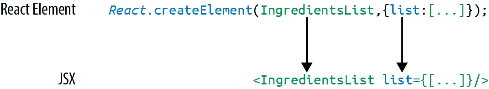
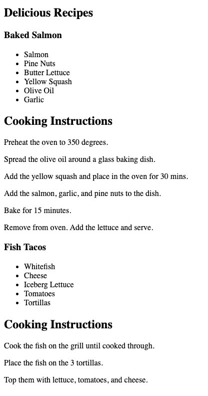
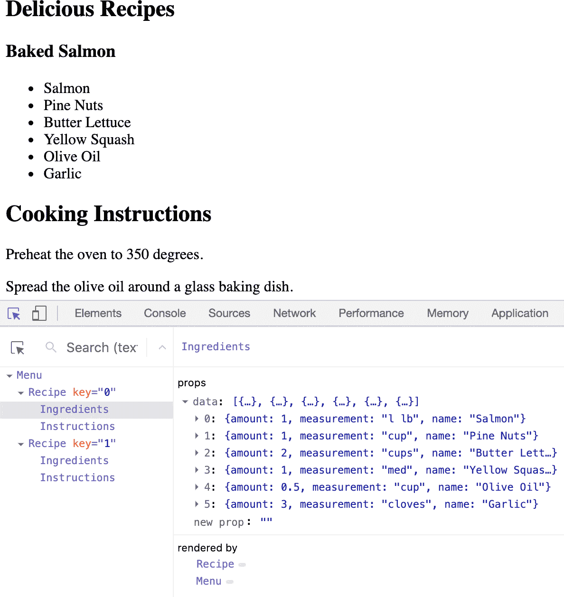
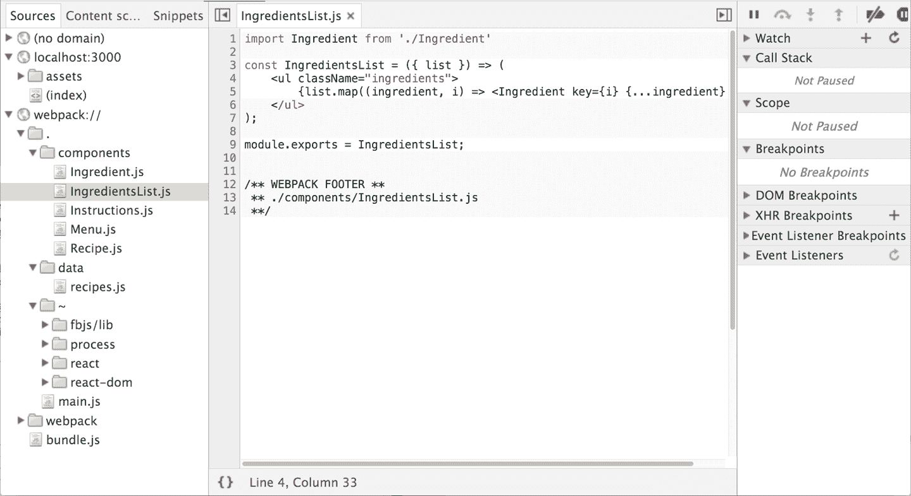

# 第五章：JSX 与 React

在上一章中，我们深入探讨了 React 的工作原理，将我们的 React 应用程序拆分成称为组件的小型可重复使用部件。这些组件渲染元素和其他组件的树形结构。使用`createElement`函数是了解 React 工作原理的一种好方法，但作为 React 开发人员，这不是我们所做的。我们不会简单地组合复杂、难以阅读的 JavaScript 语法树然后称之为有趣。为了有效地使用 React，我们还需要一件东西：JSX。

JSX 结合了 JavaScript 的*JS*和 XML 的*X*。它是一种 JavaScript 扩展，允许我们使用基于标签的语法直接在我们的 JavaScript 代码中定义 React 元素。有时 JSX 与 HTML 混淆，因为它们看起来很相似。JSX 只是创建 React 元素的另一种方式，因此您无需在复杂的`createElement`调用中寻找遗失的逗号而抓狂。

在本章中，我们将讨论如何使用 JSX 构建 React 应用程序。

# React 元素作为 JSX

Facebook 的 React 团队在发布 React 时发布了 JSX，以提供一种用于创建带属性的复杂 DOM 树的简洁语法。他们还希望使 React 更像 HTML 和 XML 一样可读。在 JSX 中，元素的类型由标签指定。标签的属性表示属性。元素的子元素可以添加在开放和关闭标签之间。

您还可以将其他 JSX 元素添加为子级。如果您有一个无序列表，您可以使用 JSX 标记将子列表项元素添加到其中。这看起来非常类似于 HTML：

```
<ul>
  <li>1 lb Salmon</li>
  <li>1 cup Pine Nuts</li>
  <li>2 cups Butter Lettuce</li>
  <li>1 Yellow Squash</li>
  <li>1/2 cup Olive Oil</li>
  <li>3 Cloves of Garlic</li>
</ul>
```

JSX 也适用于组件。只需使用类名定义组件。我们使用 JSX 将食材数组作为属性传递给`IngredientsList`，如图 5-1 所示。



###### 图 5-1\. 使用 JSX 创建 IngredientsList

当我们将食材数组传递给此组件时，我们需要用花括号括起来。这被称为 JavaScript *表达式*，在将 JavaScript 值作为属性传递给组件时必须使用这些表达式。组件属性将有两种类型：字符串或 JavaScript 表达式。JavaScript 表达式可以包括数组、对象，甚至函数。为了包含它们，您必须将它们用花括号括起来。

## JSX 提示

JSX 可能看起来很熟悉，大多数规则导致的语法与 HTML 类似。但是，在使用 JSX 时，有几点需要注意。

### 嵌套组件

JSX 允许您将组件添加为其他组件的子级。例如，在`IngredientsList`内部，我们可以多次渲染称为`Ingredient`的另一个组件：

```
<IngredientsList>
  <Ingredient />
  <Ingredient />
  <Ingredient />
</IngredientsList>
```

### className

由于`class`在 JavaScript 中是保留字，因此使用`className`来定义`class`属性：

```
<h1 className="fancy">Baked Salmon</h1>
```

### JavaScript 表达式

JavaScript 表达式被大括号包裹，指示变量在哪里被计算，并返回它们的结果值。例如，如果我们想要在一个元素中显示 `title` 属性的值，我们可以使用 JavaScript 表达式插入该值。变量将被计算并返回其值：

```
<h1>{title}</h1>
```

除了字符串之外的类型的值也应出现为 JavaScript 表达式：

```
<input type="checkbox" defaultChecked={false} />
```

### 评估

大括号中添加的 JavaScript 将被计算。这意味着会执行连接或加法等操作。这也意味着 JavaScript 表达式中找到的函数将被调用：

```
<h1>{"Hello" + title}</h1>

<h1>{title.toLowerCase().replace}</h1>
```

## 使用 JSX 映射数组

JSX 就是 JavaScript，因此可以直接将 JSX 嵌入到 JavaScript 函数中。例如，你可以将数组映射为 JSX 元素：

```
<ul>
  {props.ingredients.map((ingredient, i) => (
    <li key="{i}">{ingredient}</li>
  ))}
</ul>
```

JSX 看起来干净易读，但不能直接在浏览器中解释。所有的 JSX 必须转换为 `createElement` 调用。幸运的是，有一个非常好的工具可以完成这项任务：[Babel](https://babeljs.io)。

# [Babel](https://babeljs.io)

许多软件语言要求您编译源代码。JavaScript 是一种解释性语言：浏览器将代码解释为文本，因此不需要编译 JavaScript。但不是所有的浏览器都支持最新的 JavaScript 语法，也没有浏览器支持 JSX 语法。由于我们想要使用 JavaScript 的最新功能以及 JSX，我们需要一种将我们的源代码转换为浏览器可以解释的东西的方法。这个过程称为编译，这正是 [Babel](https://babeljs.io) 的设计初衷。

该项目的第一个版本被称为 6to5，并于 2014 年 9 月发布。6to5 是一个工具，可以将 ES6 语法转换为更广泛支持的 ES5 语法，以便 Web 浏览器使用。随着项目的发展，它的目标是支持 ECMAScript 的所有最新变化。它还增加了支持将 JSX 转换为 JavaScript 的功能。该项目于 2015 年 2 月更名为 Babel。

Babel 在 Facebook、Netflix、PayPal、Airbnb 等地的生产环境中被广泛使用。在此之前，Facebook 曾经创建了一个 JSX 转换器作为他们的标准，但很快就被 Babel 取代了。

有许多使用 Babel 的方法。开始的最简单方法是直接在你的 HTML 中包含 Babel CDN 的链接，这将编译任何带有“text/babel”类型的 script 块中的代码。Babel 将在客户端运行之前编译源代码。虽然这可能不是生产环境的最佳解决方案，但这是开始使用 JSX 的一个很好的方法：

```
<!DOCTYPE html>
<html>
  <head>
    <meta charset="utf-8" />
    <title>React Examples</title>
  </head>
  <body>
    <div id="root"></div>

    <!-- React Library & React DOM -->
    <script
  src="https://unpkg.com/react@16.8.6/umd/react.development.js">
  </script>
    <script
  src="https://unpkg.com/react-dom@16.8.6/umd/react-dom.development.js">
  </script>
    <script
  src="https://unpkg.com/@babel/standalone/babel.min.js">
  </script>

    <script type="text/babel">
      // JSX code here. Or link to separate JavaScript file that contains JSX.
    </script>
  </body>
</html>
```

# 在浏览器中使用 In-Browser Babel 时会看到控制台警告。

当使用浏览器内转换器时，你会看到一个警告，提示要为生产环境预编译脚本。对于这个和其他小型演示项目，不必担心这个警告。我们将在本章后面升级到生产准备好的 Babel。

# JSX 作为食谱

JSX 为我们提供了一种漂亮而干净的方式来在代码中表达 React 元素，这对我们来说很有意义，并且对开发人员来说是立即可读的。JSX 的缺点是它对浏览器不可读。在我们的代码可以被浏览器解释之前，它需要从 JSX 转换为 JavaScript。

此数据数组包含两个食谱，并代表我们应用程序的当前状态：

```
const data = [
  {
    name: "Baked Salmon",
    ingredients: [
      { name: "Salmon", amount: 1, measurement: "l lb" },
      { name: "Pine Nuts", amount: 1, measurement: "cup" },
      { name: "Butter Lettuce", amount: 2, measurement: "cups" },
      { name: "Yellow Squash", amount: 1, measurement: "med" },
      { name: "Olive Oil", amount: 0.5, measurement: "cup" },
      { name: "Garlic", amount: 3, measurement: "cloves" }
    ],
    steps: [
      "Preheat the oven to 350 degrees.",
      "Spread the olive oil around a glass baking dish.",
      "Add the yellow squash and place in the oven for 30 mins.",
      "Add the salmon, garlic, and pine nuts to the dish.",
      "Bake for 15 minutes.",
      "Remove from oven. Add the lettuce and serve."
    ]
  },
  {
    name: "Fish Tacos",
    ingredients: [
      { name: "Whitefish", amount: 1, measurement: "l lb" },
      { name: "Cheese", amount: 1, measurement: "cup" },
      { name: "Iceberg Lettuce", amount: 2, measurement: "cups" },
      { name: "Tomatoes", amount: 2, measurement: "large" },
      { name: "Tortillas", amount: 3, measurement: "med" }
    ],
    steps: [
      "Cook the fish on the grill until cooked through.",
      "Place the fish on the 3 tortillas.",
      "Top them with lettuce, tomatoes, and cheese."
    ]
  }
];
```

数据表达为一个包含两个 JavaScript 对象的数组。每个对象包含食谱的名称、所需的配料列表和烹饪食谱所需的步骤列表。

我们可以使用两个组件创建这些食谱的 UI：一个 `Menu` 组件用于列出食谱，一个 `Recipe` 组件用于描述每个食谱的 UI。我们将渲染 `Menu` 组件到 DOM 中。我们将我们的数据作为名为 `recipes` 的属性传递给 `Menu` 组件：

```
// The data, an array of Recipe objects
const data = [ ... ];

// A function component for an individual Recipe
function Recipe (props) {
  ...
}

// A function component for the Menu of Recipes
function Menu (props) {
  ...
}

// A call to ReactDOM.render to render our Menu into the current DOM
ReactDOM.render(
  <Menu recipes={data} title="Delicious Recipes" />,
  document.getElementById("root")
);
```

`Menu` 组件中的 React 元素被表达为 JSX。所有内容都包含在 `article` 元素内。使用 `header` 元素、`h1` 元素和 `div.recipes` 元素来描述我们菜单的 DOM。`title` 属性的值将作为文本显示在 `h1` 元素内：

```
function Menu(props) {
  return (
    <article>
      <header>
        <h1>{props.title}</h1>
      </header>
      <div className="recipes" />
    </article>
  );
}
```

在 `div.recipes` 元素内部，我们为每个食谱添加一个组件：

```
<div className="recipes">
  {props.recipes.map((recipe, i) => (
    <Recipe
      key={i}
      name={recipe.name}
      ingredients={recipe.ingredients}
      steps={recipe.steps}
    />
  ))}
</div>
```

为了在 `div.recipes` 元素内列出食谱，我们使用花括号添加一个 JavaScript 表达式，该表达式将返回一个子元素数组。我们可以在 `props.recipes` 数组上使用 `map` 函数，为数组中的每个对象返回一个组件。如前所述，每个食谱包含名称、一些配料和烹饪说明（步骤）。我们需要将这些数据作为 props 传递给每个 `Recipe`。同时记住，我们应该使用 `key` 属性来唯一标识每个元素。

您还可以重构此处以使用展开语法。JSX 展开操作符类似于对象展开操作符。它将 `recipe` 对象的每个字段添加为 `Recipe` 组件的属性。这里的语法将向组件提供所有属性：

```
{
  props.recipes.map((recipe, i) => <Recipe key={i} {...recipe} />);
}
```

记住，这种快捷方式将向 `Recipe` 组件提供所有属性。这可能是一件好事，但也可能使组件添加过多的属性。

我们可以在接受 `props` 参数的 `Menu` 组件的另一个位置进行语法改进。我们可以使用对象解构将变量作用域限定到这个函数中。这使我们可以直接访问 `title` 和 `recipes` 变量，而无需再以 `props` 为前缀：

```
function Menu({ title, recipes }) {
  return (
    <article>
      <header>
        <h1>{title}</h1>
      </header>
      <div className="recipes">
        {recipes.map((recipe, i) => (
          <Recipe key={i} {...recipe} />
        ))}
      </div>
    </article>
  );
}
```

现在让我们为每个单独的食谱编写组件：

```
function Recipe({ name, ingredients, steps }) {
  return (
    <section id={name.toLowerCase().replace(/ /g, "-")}>
      <h1>{name}</h1>
      <ul className="ingredients">
        {ingredients.map((ingredient, i) => (
          <li key={i}>{ingredient.name}</li>
        ))}
      </ul>
      <section className="instructions">
        <h2>Cooking Instructions</h2>
        {steps.map((step, i) => (
          <p key={i}>{step}</p>
        ))}
      </section>
    </section>
  );
}
```

每个食谱都有一个名称字符串，一个对象数组作为配料，以及一个字符串数组作为步骤。使用对象解构，我们可以告诉这个组件通过名称将这些字段本地作用域化，这样我们可以直接访问它们，而不必使用 `props.name`、`props.ingredients` 或 `props.steps`。

我们看到的第一个 JavaScript 表达式用于为根`section`元素设置`id`属性。它将配方名称转换为小写字符串，并全局替换空格为破折号。结果是“烤鲑鱼”将被转换为“baked-salmon”（同样地，如果我们有一个名为“Boston Baked Beans”的配方，它将被转换为“boston-baked-beans”），然后用作 UI 中的`id`属性。`name`的值也作为文本节点显示在`h1`中。

在无序列表内部，JavaScript 表达式正在将每个成分映射到显示成分名称的`li`元素。在我们的说明部分中，我们看到相同的模式被用来返回一个段落元素，其中显示每个步骤。这些`map`函数返回子元素的数组。

应用程序的完整代码应如下所示：

```
const data = [
  {
    name: "Baked Salmon",
    ingredients: [
      { name: "Salmon", amount: 1, measurement: "l lb" },
      { name: "Pine Nuts", amount: 1, measurement: "cup" },
      { name: "Butter Lettuce", amount: 2, measurement: "cups" },
      { name: "Yellow Squash", amount: 1, measurement: "med" },
      { name: "Olive Oil", amount: 0.5, measurement: "cup" },
      { name: "Garlic", amount: 3, measurement: "cloves" }
    ],
    steps: [
      "Preheat the oven to 350 degrees.",
      "Spread the olive oil around a glass baking dish.",
      "Add the yellow squash and place in the oven for 30 mins.",
      "Add the salmon, garlic, and pine nuts to the dish.",
      "Bake for 15 minutes.",
      "Remove from oven. Add the lettuce and serve."
    ]
  },
  {
    name: "Fish Tacos",
    ingredients: [
      { name: "Whitefish", amount: 1, measurement: "l lb" },
      { name: "Cheese", amount: 1, measurement: "cup" },
      { name: "Iceberg Lettuce", amount: 2, measurement: "cups" },
      { name: "Tomatoes", amount: 2, measurement: "large" },
      { name: "Tortillas", amount: 3, measurement: "med" }
    ],
    steps: [
      "Cook the fish on the grill until hot.",
      "Place the fish on the 3 tortillas.",
      "Top them with lettuce, tomatoes, and cheese."
    ]
  }
];

function Recipe({ name, ingredients, steps }) {
  return (
    <section id={name.toLowerCase().replace(/ /g, "-")}>
      <h1>{name}</h1>
      <ul className="ingredients">
        {ingredients.map((ingredient, i) => (
          <li key={i}>{ingredient.name}</li>
        ))}
      </ul>
      <section className="instructions">
        <h2>Cooking Instructions</h2>
        {steps.map((step, i) => (
          <p key={i}>{step}</p>
        ))}
      </section>
    </section>
  );
}

function Menu({ title, recipes }) {
  return (
    <article>
      <header>
        <h1>{title}</h1>
      </header>
      <div className="recipes">
        {recipes.map((recipe, i) => (
          <Recipe key={i} {...recipe} />
        ))}
      </div>
    </article>
  );
}

ReactDOM.render(
  <Menu recipes={data} title="Delicious Recipes" />,
  document.getElementById("root")
);
```

当我们在浏览器中运行此代码时，React 将使用我们的说明和配方数据构建 UI，如图 5-2 所示。

如果您正在使用 Google Chrome 并安装了 React 开发者工具扩展程序，您可以查看组件树的当前状态。要做到这一点，请打开开发者工具并选择组件选项卡，如图 5-3 所示。

这里我们可以看到`Menu`及其子元素。`data`数组包含两个配方对象，我们有两个`Recipe`元素。每个`Recipe`元素都有配方名称、成分和步骤属性。成分和步骤作为`data`传递给它们自己的组件。

这些组件是基于应用程序传递给`Menu`组件的数据构建的属性。如果我们更改`recipes`数组并重新渲染我们的`Menu`组件，React 会尽可能高效地更改这个 DOM。



###### 图 5-2\. 美味食谱输出



###### 图 5-3\. React 开发者工具中的结果虚拟 DOM

# React Fragments

在前一节中，我们渲染了`Menu`组件，一个渲染`Recipe`组件的父组件。我们想花点时间看一个使用 React 片段渲染两个兄弟组件的小例子。让我们从创建一个称为`Cat`的新组件开始，在`root`上将其呈现到 DOM 中：

```
function Cat({ name }) {
  return <h1>The cat's name is {name}</h1>;
}

ReactDOM.render(<Cat name="Jungle" />, document.getElementById("root"));
```

这将按预期渲染`h1`，但如果我们在`Cat`组件的与`h1`同级添加了`p`标签，会发生什么呢？

```
function Cat({ name }) {
  return (
    <h1>The cat's name is {name}</h1>
 <p>He's good.</p>
  );
}
```

立即，在控制台中我们将看到一个错误，显示`相邻的 JSX 元素必须包裹在一个封闭标签中`并建议使用片段。这就是片段发挥作用的地方！React 不会将两个或更多相邻或兄弟元素渲染为一个组件，所以我们过去必须将它们包装在像`div`这样的封闭标签中。然而，这导致创建了许多不必要的标签和一堆没有太多用途的包装器。如果我们使用 React 片段，我们可以模仿包装器的行为，而不实际创建一个新标签。

首先用一个`React.Fragment`标签包装相邻的标签，比如`h1`和`p`：

```
function Cat({ name }) {
  return (
    <React.Fragment>
      <h1>The cat's name is {name}</h1>
 <p>He's good.</p>
    </React.Fragment>
  );
}
```

添加这个可以清除警告。您还可以使用片段的简写方式，使其看起来更加清晰：

```
function Cat({ name }) {
  return (
    <>
      <h1>The cat's name is {name}</h1>
 <p>He's good.</p>
    </>
  );
}
```

如果您查看 DOM，您将看不到片段在生成树中的存在：

```
<div id="root">
  <h1>The cat's name is Jungle</h1>
  <p>He's good</p>
</div>
```

片段是 React 的一个相对较新的功能，摒弃了需要额外包装标签的需求，这些标签可能会污染 DOM。

# webpack 简介

一旦我们在实际项目中开始使用 React，就会有很多问题需要考虑：我们如何处理 JSX 和 ESNext 转换？我们如何管理我们的依赖关系？如何优化我们的图像和 CSS？

出现了许多不同的工具来解决这些问题，包括 Browserify、gulp、Grunt、Prepack 等等。由于其功能和大公司的广泛采用，*webpack*也成为了捆绑工具中的领先者之一。

React 生态系统已经发展成包括 create-react-app、Gatsby 和 Code Sandbox 等工具。当您使用这些工具时，关于代码如何被编译的细节被抽象掉了很多。在当前这个时代，了解您的 JavaScript/React 代码是如何通过 webpack 之类的工具进行编译是至关重要的，但知道如何通过 webpack 之类的工具编译您的 JavaScript/React 并不是那么重要。如果您想跳过这部分，我们完全理解。

Webpack 被宣传为一个模块捆绑工具。模块捆绑工具将我们的各种不同文件（JavaScript、LESS、CSS、JSX、ESNext 等）转换为单一文件。捆绑的两个主要好处是*模块化*和*网络性能*。

模块化将允许您将源代码分解为更容易在团队环境中使用的部分或模块。

网络性能通过在浏览器中仅需加载一个依赖项来获得：捆绑包。每个`script`标签都会发起一个 HTTP 请求，并且每个 HTTP 请求都会有延迟惩罚。将所有依赖项捆绑到一个单一文件中，可以通过一个 HTTP 请求加载所有内容，从而避免额外的延迟。

除了代码编译之外，webpack 还可以处理：

代码分割

将您的代码分割成不同的块，需要时可以加载这些块。有时这些被称为*rollups*或*layers*；其目的是根据不同的页面或设备需要分割代码。

缩小

删除空白、换行、冗长的变量名和不必要的代码以减少文件大小。

功能标志

发送代码到一个或多个环境（但不是所有环境）以测试功能。

热模块替换（HMR）

监视源代码的更改。仅更新模块会立即进行更改。

我们在本章早些时候构建的 Recipes 应用程序存在一些限制，webpack 将帮助我们缓解这些限制。使用类似 webpack 的工具静态构建客户端 JavaScript 使得团队能够共同开发大型 Web 应用程序成为可能。通过集成 webpack 模块打包器，我们还可以获得以下好处：

模块化

使用模块模式导出模块，这些模块稍后将被应用程序的另一部分导入或要求，使源代码更易于理解。它允许开发团队一起工作，通过允许他们创建和使用将在发送到生产之前静态组合成单个文件的单独文件。

组合

使用模块，我们可以构建小型、简单、可重用的 React 组件，可以高效地组合到应用程序中。较小的组件更容易理解、测试和重用。在增强应用程序时，它们也更容易替换。

速度

将应用程序的所有模块和依赖项打包成一个单一的客户端包将减少应用程序的加载时间，因为每个 HTTP 请求都有延迟。将所有内容打包到单个文件中意味着客户端只需发出一个请求。在包中进行代码缩小也会改善加载时间。

一致性

由于 webpack 将编译 JSX 和 JavaScript，我们可以开始使用未来的 JavaScript 语法。Babel 支持广泛的 ESNext 语法，这意味着我们不必担心浏览器是否支持我们的代码。它允许开发人员始终使用最新的 JavaScript 语法。

## 创建项目

为了演示如何从头开始设置一个 React 项目，让我们在计算机上创建一个名为*recipes-app*的新文件夹：

```
mkdir recipes-app
cd recipes-app
```

对于这个项目，我们将按以下步骤进行：

1.  创建项目。

1.  将配方应用程序分解为存储在不同文件中的组件。

1.  设置一个集成了 Babel 的 webpack 构建。

# create-react-app

有一个工具叫做 Create React App，可以用来自动配置预先配置的 React 项目。在使用工具之前，我们将更仔细地看看幕后发生了什么。

### 1\. 创建项目

接下来，我们将使用 npm 创建项目和*package.json*文件，发送`-y`标志以使用所有默认值。我们还将安装 webpack，webpack-cli，react 和 react-dom：

```
npm init -y
npm install react react-dom serve
```

如果我们使用 npm 5，则在安装时不需要发送`--save`标志。接下来，我们将创建以下目录结构来存放组件：

```
recipes-app (folder)
  > node_modules (already added with npm install command)
  > package.json (already added with npm init command)
  > package-lock.json (already added with npm init command)
  > index.html
  > /src (folder)
    > index.js
    > /data (folder)
      > recipes.json
    > /components (folder)
      > Recipe.js
      > Instructions.js
      > Ingredients.js
```

# 文件组织

没有一种固定的方法可以组织 React 项目中的文件。这只是一种可能的策略。

### 2\. 将组件拆分为模块

目前，`Recipe` 组件做了相当多的工作。我们显示了食谱的名称，构建了一个无序的食材列表，并显示了说明，每个步骤都有自己的段落元素。此组件应该放置在 *Recipe.js* 文件中。在任何使用 JSX 的文件中，我们都需要在顶部导入 React：

```
// ./src/components/Recipe.js

import React from "react";

export default function Recipe({ name, ingredients, steps }) {
  return (
    <section id="baked-salmon">
      <h1>{name}</h1>
      <ul className="ingredients">
        {ingredients.map((ingredient, i) => (
          <li key={i}>{ingredient.name}</li>
        ))}
      </ul>
      <section className="instructions">
        <h2>Cooking Instructions</h2>
        {steps.map((step, i) => (
          <p key={i}>{step}</p>
        ))}
      </section>
    </section>
  );
}
```

将 `Recipe` 组件的功能性方法更改为将其分解为更小、更专注的函数组件，并将它们组合在一起会更加有效。我们可以从中将说明提取出来，并在单独的文件模块中创建一个我们可以用于任何说明集的模块。

在名为 *Instructions.js* 的新文件中，创建以下组件：

```
// ./src/components/Instructions.js

import React from "react";

export default function Instructions({ title, steps }) {
  return (
    <section className="instructions">
      <h2>{title}</h2>
      {steps.map((s, i) => (
        <p key={i}>{s}</p>
      ))}
    </section>
  );
}
```

在这里，我们创建了一个名为 `Instructions` 的新组件。我们将标题和步骤传递给这个组件。这样，我们可以为“烹饪说明”、“烘焙说明”、“准备说明”或“预先烹饪清单”等任何具有步骤的内容重复使用此组件。

现在考虑食材。在 `Recipe` 组件中，我们仅显示食材的名称，但是食谱数据中的每个食材还具有数量和测量单位。我们将创建一个名为 `Ingredient` 的组件来处理这个问题：

```
// ./src/components/Ingredient.js

import React from "react";

export default function Ingredient({ amount, measurement, name }) {
  return (
    <li>
      {amount} {measurement} {name}
    </li>
  );
}
```

在这里，我们假设每个食材都有数量、测量单位和名称。我们从 `props` 对象中解构这些值，并分别在独立的 `span` 元素中显示它们。

使用 `Ingredient` 组件，我们可以构建一个 `IngredientsList` 组件，可以在需要显示食材列表的任何时候使用：

```
// ./src/components/IngredientsList.js

import React from "react";
import Ingredient from "./Ingredient";

export default function IngredientsList({ list }) {
  return (
    <ul className="ingredients">
      {list.map((ingredient, i) => (
        <Ingredient key={i} {...ingredient} />
      ))}
    </ul>
  );
}
```

在这个文件中，我们首先导入 `Ingredient` 组件，因为我们将在每个食材中使用它。食材被作为名为 `list` 的属性的数组传递给此组件。数组中的每个食材将被映射到 `Ingredient` 组件。使用 JSX 展开运算符将所有数据传递给 `Ingredient` 组件作为 props。

使用展开运算符：

```
<Ingredient {...ingredient} />
```

是另一种表达方式：

```
<Ingredient
  amount={ingredient.amount}
  measurement={ingredient.measurement}
  name={ingredient.name}
/>
```

因此，给定具有以下字段的成分：

```
let ingredient = {
  amount: 1,
  measurement: "cup",
  name: "sugar"
};
```

我们得到：

```
<Ingredient amount={1} measurement="cup" name="sugar" />
```

现在我们已经有了用于食材和说明的组件，我们可以使用这些组件组合食谱：

```
// ./src/components/Recipe.js

import React from "react";
import IngredientsList from "./IngredientsList";
import Instructions from "./Instructions";

function Recipe({ name, ingredients, steps }) {
  return (
    <section id={name.toLowerCase().replace(/ /g, "-")}>
      <h1>{name}</h1>
      <IngredientsList list={ingredients} />
      <Instructions title="Cooking Instructions" steps={steps} />
    </section>
  );
}

export default Recipe;
```

首先，我们导入我们将要使用的组件：`IngredientsList` 和 `Instructions`。现在我们可以使用它们来创建 `Recipe` 组件。与在一个地方构建整个食谱的一堆复杂代码不同，我们通过组合较小的组件更声明式地表达了我们的食谱。不仅代码简洁易懂，而且阅读起来也很舒适。这告诉我们，一个食谱应该显示食谱的名称、食材列表和一些烹饪说明。我们将显示食材和说明的含义抽象成了更小更简单的组件。

在模块化方法中，`Menu`组件看起来会非常相似。关键区别在于它将存在于自己的文件中，导入它需要使用的模块，并将自身导出：

```
// ./src/components/Menu.js

import React from "react";
import Recipe from "./Recipe";

function Menu({ recipes }) {
  return (
    <article>
      <header>
        <h1>Delicious Recipes</h1>
      </header>
      <div className="recipes">
        {recipes.map((recipe, i) => (
          <Recipe key={i} {...recipe} />
        ))}
      </div>
    </article>
  );
}

export default Menu;
```

我们仍然需要使用 ReactDOM 来渲染`Menu`组件。项目的主文件是*index.js*。这将负责将组件渲染到 DOM 中。

让我们创建这个文件：

```
// ./src/index.js

import React from "react";
import { render } from "react-dom";
import Menu from "./components/Menu";
import data from "./data/recipes.json";

render(<Menu recipes={data} />, document.getElementById("root"));
```

前四个语句导入了我们应用程序工作所需的模块。我们不是通过`script`标签加载`react`和`react-dom`，而是导入它们，以便 webpack 将它们添加到我们的捆绑包中。我们还需要`Menu`组件和已移至单独模块的样本数据数组。它仍然包含两个食谱：烤三文鱼和鱼肉玉米饼。

我们所有导入的变量都是局限于*index.js*文件。当我们渲染`Menu`组件时，我们将食谱数据数组作为属性传递给此组件。

数据来自*recipes.json*文件。这与我们本章早些时候使用的数据相同，但现在遵循有效的 JSON 格式化规则：

```
// ./src/data/recipes.json

[
  {
    "name": "Baked Salmon",
    "ingredients": [
      { "name": "Salmon", "amount": 1, "measurement": "lb" },
      { "name": "Pine Nuts", "amount": 1, "measurement": "cup" },
      { "name": "Butter Lettuce", "amount": 2, "measurement": "cups" },
      { "name": "Yellow Squash", "amount": 1, "measurement": "med" },
      { "name": "Olive Oil", "amount": 0.5, "measurement": "cup" },
      { "name": "Garlic", "amount": 3, "measurement": "cloves" }
    ],
    "steps": [
      "Preheat the oven to 350 degrees.",
      "Spread the olive oil around a glass baking dish.",
      "Add the yellow squash and place in the oven for 30 mins.",
      "Add the salmon, garlic, and pine nuts to the dish.",
      "Bake for 15 minutes.",
      "Remove from oven. Add the lettuce and serve."
    ]
  },
  {
    "name": "Fish Tacos",
    "ingredients": [
      { "name": "Whitefish", "amount": 1, "measurement": "lb" },
      { "name": "Cheese", "amount": 1, "measurement": "cup" },
      { "name": "Iceberg Lettuce", "amount": 2, "measurement": "cups" },
      { "name": "Tomatoes", "amount": 2, "measurement": "large" },
      { "name": "Tortillas", "amount": 3, "measurement": "med" }
    ],
    "steps": [
      "Cook the fish on the grill until cooked through.",
      "Place the fish on the 3 tortillas.",
      "Top them with lettuce, tomatoes, and cheese."
    ]
  }
]
```

现在我们已经将代码拆分为单独的模块和文件，让我们使用 webpack 创建一个构建过程，将所有内容重新组合到一个单一文件中。你可能会想，“等等，我们刚刚把所有工作都分开了，现在我们要使用一个工具把它们重新放在一起？为什么会这样……？”将项目拆分为单独文件通常使得更大的项目更易于管理，因为团队成员可以在没有重叠的情况下工作在不同的组件上。这也意味着文件可能更容易测试。

### 3\. 创建 webpack 构建

为了使用 webpack 创建静态构建过程，我们需要安装一些东西。我们需要的所有内容都可以通过 npm 安装：

```
npm install --save-dev webpack webpack-cli
```

请记住，我们已经安装了 React 和 ReactDOM。

要使此模块化 Recipes 应用程序正常工作，我们需要告诉 webpack 如何将我们的源代码捆绑成一个单独的文件。从版本 4.0.0 开始，webpack 不需要配置文件来捆绑项目。如果我们不包含配置文件，webpack 将运行默认设置来打包我们的代码。不过，使用配置文件意味着我们可以自定义我们的设置。此外，这也展示了 webpack 的一些魔法而不是将其隐藏起来。默认的 webpack 配置文件始终是*webpack.config.js*。

我们的 Recipes 应用程序的起始文件是 *index.js*。它导入了 React、ReactDOM 和 *Menu.js* 文件。这是我们首先要在浏览器中运行的内容。无论 webpack 在哪里找到 `import` 语句，它都会在文件系统中找到关联的模块并将其包含在捆绑包中。*index.js* 导入 *Menu.js*，*Menu.js* 导入 *Recipe.js*，*Recipe.js* 导入 *Instructions.js* 和 *IngredientsList.js*，*IngredientsList.js* 导入 *Ingredient.js*。Webpack 将遵循这个导入树并在捆绑包中包含所有必要的模块。遍历所有这些文件创建了所谓的 *依赖图*。依赖只是我们应用程序需要的东西，例如组件文件、像 React 这样的库文件或图像。想象一下，我们需要的每个文件都是图上的一个圆圈，webpack 会在这些圆圈之间画线来创建图。这个图就是捆绑包。

# 导入语句

我们正在使用 `import` 语句，这在大多数浏览器或 Node.js 中目前不受支持。`import` 语句能工作的原因是，Babel 将它们转换为我们最终代码中的 `require('module/path');` 语句。`require` 函数通常是加载 CommonJS 模块的方式。

当 webpack 构建我们的捆绑包时，我们需要告诉它将 JSX 转换为 React 元素。

*webpack.config.js* 文件只是另一个模块，它导出一个描述 webpack 应采取的操作的 JavaScript 字面对象。配置文件应保存在项目的根文件夹中，就在 *index.js* 文件旁边：

```
// ./webpack.config.js

var path = require("path");

module.exports = {
  entry: "./src/index.js",
  output: {
    path: path.join(__dirname, "dist", "assets"),
    filename: "bundle.js"
  }
};
```

首先，我们告诉 webpack 我们的客户端入口文件是 *./src/index.js*。它将根据该文件中的 `import` 语句自动构建依赖图。接下来，我们指定我们希望输出到 *./dist/bundle.js* 的捆绑 JavaScript 文件。这是 webpack 将最终打包的 JavaScript 放置的地方。

接下来，让我们安装必要的 Babel 依赖项。我们需要 `babel-loader` 和 `@babel/core`：

```
npm install babel-loader @babel/core --save-dev
```

webpack 的下一组指令包括要在指定模块上运行的加载器列表。这将添加到配置文件的 `module` 字段下：

```
module.exports = {
  entry: "./src/index.js",
  output: {
    path: path.join(__dirname, "dist", "assets"),
    filename: "bundle.js"
  },
  module: {
    rules: [{ test: /\.js$/, exclude: /node_modules/, loader: "babel-loader" }]
  }
};
```

`rules` 字段是一个数组，因为有许多类型的加载器可以与 webpack 配合使用。在这个例子中，我们只集成了 `babel-loader`。每个加载器都是一个 JavaScript 对象。`test` 字段是一个正则表达式，匹配加载器应该操作的每个模块的文件路径。在这种情况下，我们在所有导入的 JavaScript 文件上运行 `babel-loader`，除了在 *node_modules* 文件夹中找到的那些文件。

此时，我们需要为运行 Babel 指定预设。当我们设置预设时，我们告诉 Babel 应该执行哪些转换。换句话说，我们可以说，“嘿，Babel。如果你在这里看到一些 ESNext 语法，请将该代码转换为我们确保浏览器理解的语法。如果你看到一些 JSX，请也进行转换。”首先安装预设：

```
npm install @babel/preset-env @babel/preset-react --save-dev
```

然后在项目的根目录创建另一个文件：`.babelrc`：

```
{
  "presets": ["@babel/preset-env", "@babel/preset-react"]
}
```

好了！我们创建了一个看起来像是真正的 React 应用程序的项目！让我们继续运行 webpack 来确保它可以工作。

Webpack 是静态运行的。通常，在将应用程序部署到服务器之前就会创建捆绑文件。你可以使用 npx 命令行运行它：

```
npx webpack --mode development
```

Webpack 要么成功创建一个捆绑包，要么失败并显示错误。大多数错误与损坏的导入引用有关。在调试 webpack 错误时，仔细查看 `import` 语句中使用的文件名和文件路径。

你还可以在 *package.json* 文件中添加一个 npm 脚本来创建一个快捷方式：

```
  "scripts": {
    "build": "webpack --mode production"
  },
```

然后你可以运行一个快捷方式来生成捆绑包：

```
npm run build
```

## 加载捆绑包

我们有了一个捆绑包，现在怎么办？我们将捆绑包导出到 *dist* 文件夹中。这个文件夹包含我们希望在 Web 服务器上运行的文件。*dist* 文件夹是应该放置 *index.html* 文件的地方。这个文件需要包含一个目标 `div` 元素，用于安装 React `Menu` 组件。它还需要一个单独的 `script` 标签来加载我们捆绑的 JavaScript：

```
// ./dist/index.html

<!DOCTYPE html>
<html>
  <head>
    <meta charset="utf-8" />
    <title>React Recipes App</title>
  </head>
  <body>
    <div id="root"></div>
    <script src="bundle.js"></script>
  </body>
</html>
```

这是你的应用程序的主页。它将从一个文件中加载所有需要的内容，一个 HTTP 请求：*bundle.js*。你需要将这些文件部署到你的 Web 服务器上，或者构建一个 Web 服务器应用程序，使用类似 Node.js 或 Ruby on Rails 这样的工具来提供这些文件。

## 源映射

将我们的代码打包成一个单独的文件可能导致在浏览器中调试应用程序时遇到一些问题。我们可以通过提供一个 *source map* 来消除这个问题。源映射是一个将捆绑文件映射到原始源文件的文件。使用 webpack，我们只需在 *webpack.config.js* 文件中添加几行代码即可。

```
//webpack.config.js with source mapping

module.exports = {
  ...
  devtool: "#source-map" // Add this option for source mapping
};
```

将 `devtool` 属性设置为 `'#source-map'` 告诉 webpack 你想要使用源映射。下次运行 webpack 时，你会看到生成并添加到 *dist* 文件夹中的两个输出文件：原始的 *bundle.js* 和 *bundle.js.map*。

使用源映射将让你可以使用原始的源文件进行调试。在浏览器开发者工具的 Sources 标签页中，你应该会找到一个名为 *webpack://* 的文件夹。在这个文件夹中，你会看到捆绑包中的所有源文件，如 图 5-4 所示。



###### 图 5-4\. Chrome 开发者工具的 Sources 面板

你可以使用浏览器的逐步调试器从这些文件中调试。点击任何行号都会添加一个断点。刷新浏览器将会在你的源文件中的任何断点处暂停 JavaScript 处理。你可以在 Scope 面板中检查作用域变量或在 Watch 面板中添加要监视的变量。

## 创建 React 应用程序

作为 React 开发者的一个非常棒的工具是 Create React App，一个命令行工具，可以自动生成 React 项目。Create React App 的灵感来自于[Ember CLI 项目](https://ember-cli.com)，它使开发者可以快速开始 React 项目，无需手动配置 webpack、Babel、ESLint 和相关工具。

要开始使用 Create React App，请全局安装该包：

```
npm install -g create-react-app
```

然后，使用命令和您想要创建应用程序的文件夹的名称：

```
create-react-app my-project
```

# npx

您还可以使用 npx 运行 Create React App，而无需全局安装。只需运行`npx create-react-app my-project`。

这将在该目录中创建一个 React 项目，仅依赖于三个库：React、ReactDOM 和`react-scripts`。`react-scripts`也是由 Facebook 创建的，是真正魔力发生的地方。它安装了 Babel、ESLint、webpack 等，让您无需手动配置它们。在生成的项目文件夹中，您还会找到一个*src*文件夹，其中包含一个*App.js*文件。在这里，您可以编辑根组件并导入其他组件文件。

从*my-react-project*文件夹内部，您可以运行`npm start`。如果您喜欢，也可以运行`yarn start`。这将在端口 3000 上启动您的应用程序。

您可以使用`npm test`或`yarn test`来运行测试。这将以交互模式运行项目中的所有测试文件。

您还可以运行`npm run build`命令。使用 yarn，运行`yarn build`。

这将创建一个经过转换和缩小的生产就绪捆绑包。

Create React App 不仅适合初学者，也适合有经验的 React 开发者。随着工具的发展，可能会增加更多功能，您可以关注[GitHub](https://github.com/facebook/create-react-app)上的变化。另一个不必担心设置自定义 webpack 构建的 React 起步方式是使用 CodeSandbox。CodeSandbox 是一个在线运行的 IDE，网址为[*https://codesandbox.io*](https://codesandbox.io)。

在本章中，我们通过学习 JSX 提升了我们的 React 技能。我们创建了组件。我们将这些组件分解成一个项目结构，并且我们更多地了解了 Babel 和 webpack。现在我们准备将组件知识提升到下一个级别。是时候谈谈 Hooks 了。
