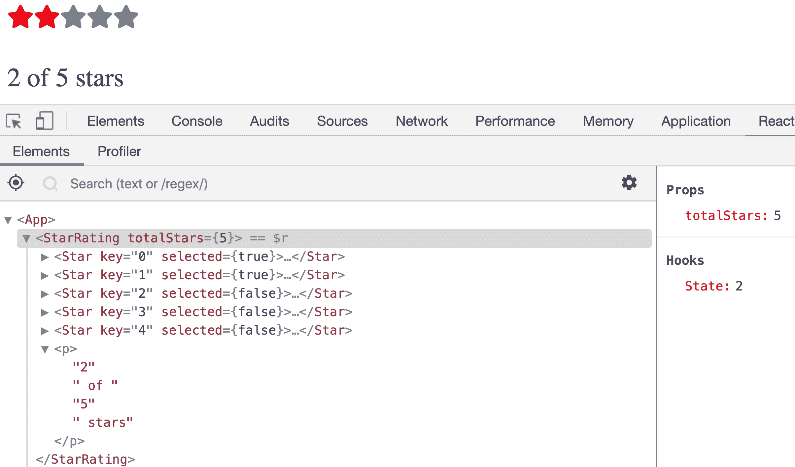
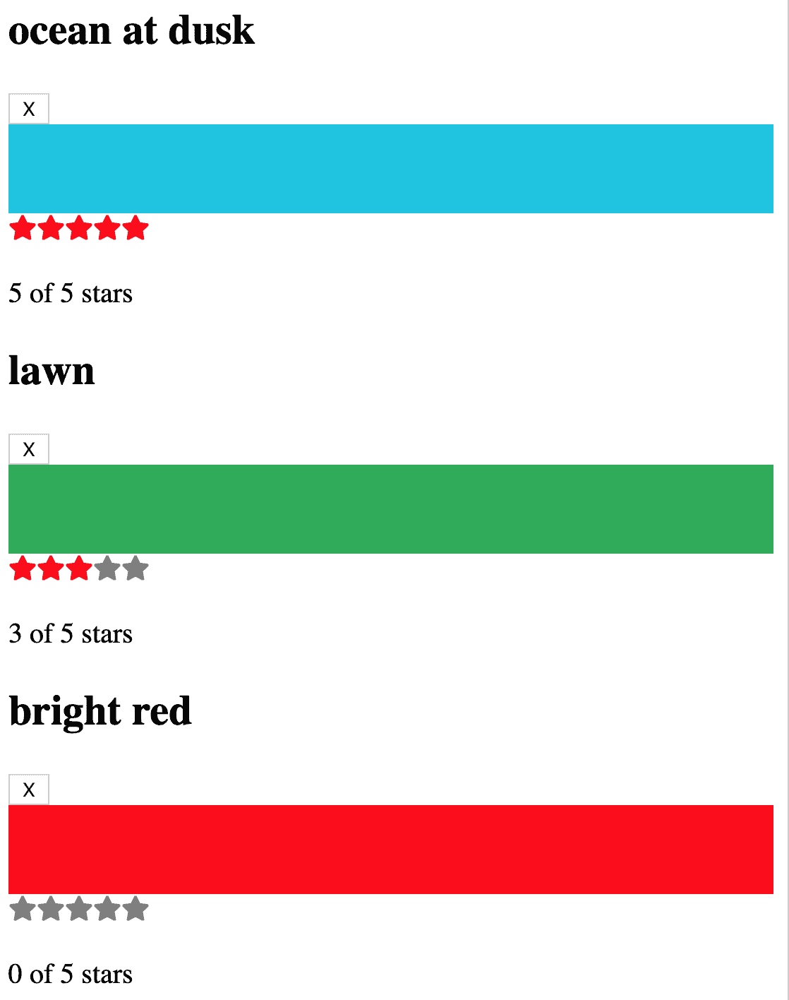

# 第六章：React 状态管理

数据是使我们的 React 组件焕发生机的关键。我们在上一章中构建的食谱用户界面没有食谱数组是毫无用处的。正是食谱和配料以及清晰的说明使这样的应用程序值得使用。我们的用户界面是创作者用来生成内容的工具。为了为我们的内容创作者构建最佳工具，我们需要知道如何有效地操纵和更改数据。

在上一章中，我们构建了一个 *组件树*：一个数据能够通过属性流动的组件层次结构。属性是画面的其中一半，状态是另一半。React 应用程序的 *状态* 是由具有改变能力的数据驱动的。向食谱应用程序引入状态可以使厨师能够创建新的食谱，修改现有的食谱，并删除旧的食谱。

状态和属性相互关联。当我们使用 React 应用程序时，我们会优雅地组合基于这种关系的组件。当组件树的状态发生变化时，属性也会发生变化。新的数据通过树流动，导致特定的叶子和分支呈现以反映新的内容。

在本章中，我们将通过引入状态来使应用程序生动起来。我们将学习如何创建有状态组件，以及如何将状态传递到组件树中，并将用户交互返回到组件树中。我们将学习收集用户表单数据的技巧。我们还将看看在应用程序中通过引入有状态的上下文提供者来分离关注点的各种方式。

# 构   构建星级评分组件

如果没有五颗星的评分系统，我们都会吃到糟糕的食物，观看糟糕的电影。如果我们计划让用户主导我们网站上的内容，我们需要一种方式来了解这些内容是否好用。这使得 `StarRating` 组件成为你将要构建的最重要的 React 组件之一（参见图 6-1）。


###### 图 6-1. 星级评分组件

`StarRating` 组件将允许用户根据特定数量的星星对内容进行评分。无用的内容得一星。高度推荐的内容得五颗星。用户可以通过点击特定的星星来设置特定内容的评分。首先，我们需要一个星星，我们可以从 `react-icons` 获取一个：

```
npm i react-icons
```

`react-icons` 是一个 npm 库，包含数百个 SVG 图标，作为 React 组件分发。通过安装它，我们就安装了几个流行的图标库，包含数百个常见的 SVG 图标。你可以在[库中](https://react-icons.netlify.com)浏览所有图标。我们将使用 Font Awesome 集合中的星形图标：

```
import React from "react";
import { FaStar } from "react-icons/fa";

export default function StarRating() {
  return [
    <FaStar color="red" />,
    <FaStar color="red" />,
    <FaStar color="red" />,
    <FaStar color="grey" />,
    <FaStar color="grey" />
  ];
}
```

在这里，我们创建了一个 `StarRating` 组件，它渲染了五个 SVG 星星，我们从 `react-icons` 中导入了这些星星。前三颗星星填充为红色，最后两颗为灰色。我们首先渲染这些星星，因为看到它们可以为我们接下来的构建提供路线图。选中的星星应该填充为红色，未选中的星星应该变灰色。让我们创建一个组件，根据选中的属性自动填充星星：

```
const Star = ({ selected = false }) => (
  <FaStar color={selected ? "red" : "grey"} />
);
```

`Star` 组件渲染单个星星，并使用 `selected` 属性来填充合适的颜色。如果未传递 `selected` 属性给此组件，我们将假定该星星不被选中，默认填充灰色。

5 星评级系统非常流行，但 10 星评级系统更加详细。当开发人员将此组件添加到他们的应用程序中时，我们应该允许他们选择希望使用的星星总数。可以通过向 `StarRating` 组件添加 `totalStars` 属性来实现这一目标：

```
const createArray = length => [...Array(length)];

export default function StarRating({ totalStars = 5 }) {
  return createArray(totalStars).map((n, i) => <Star key={i} />);
}
```

在这里，我们从第二章中添加了 `createArray` 函数。我们只需提供要创建的数组的长度，就可以得到一个新的数组。我们使用 `totalStars` 属性调用此函数来创建具有特定长度的数组。一旦我们有了数组，我们就可以对其进行映射并渲染 `Star` 组件。默认情况下，`totalStars` 等于 `5`，这意味着此组件将渲染 `5` 个灰色星星，如图 6-2 所示。


###### 图 6-2\. 显示了五颗星

# `useState` Hook

现在是时候让 `StarRating` 组件可点击，这将允许用户更改 `rating`。由于 `rating` 是一个会变化的值，我们将使用 React 状态来存储和更改该值。我们使用 React 功能称为 *Hooks* 将状态集成到函数组件中。 *Hooks* 包含与组件树分离的可重用代码逻辑。它们允许我们将功能连接到我们的组件上。React 默认提供了几个内置的 hook 可供我们直接使用。在这种情况下，我们希望向我们的 React 组件添加状态，因此我们将首先使用 React 的 `useState` hook。这个 hook 已经包含在 `react` 包中，我们只需导入它：

```
import React, { useState } from "react";
import { FaStar } from "react-icons/fa";
```

用户选择的星星代表评级。我们将创建一个名为 `selectedStars` 的状态变量，它将保存用户的评级。我们将通过直接向 `StarRating` 组件添加 `useState` hook 来创建此变量：

```
export default function StarRating({ totalStars = 5 }) {
  const [selectedStars] = useState(3);
  return (
    <>
      {createArray(totalStars).map((n, i) => (
        <Star key={i} selected={selectedStars > i} />
      ))}
      <p>
        {selectedStars} of {totalStars} stars
      </p>
    </>
  );
}
```

我们刚刚使用了状态将这个组件连接起来。`useState`钩子是一个可以调用以返回数组的函数。数组的第一个值是我们想要使用的状态变量。在这种情况下，那个变量是`selectedStars`，或者`StarRating`要渲染成红色的星星数。`useState`返回一个数组。我们可以利用数组解构，可以给我们的状态变量起任何我们喜欢的名字。我们发送给`useState`函数的值是状态变量的默认值。在这种情况下，`selectedStars`最初将被设置为`3`，如图 6-3 所示。


###### 图 6-3\. 五颗星中有三颗被选中

为了从用户那里收集不同的评分，我们需要允许他们点击我们的星星之一。这意味着我们需要通过给`FaStar`组件添加一个`onClick`处理程序来使星星可点击：

```
const Star = ({ selected = false, onSelect = f => f }) => (
  <FaStar color={selected ? "red" : "grey"} onClick={onSelect} />
);
```

这里，我们修改了星星组件，添加了一个`onSelect`属性。来看看：这个属性是一个函数。当用户点击`FaStar`组件时，我们将调用这个函数，它可以通知其父组件星星被点击了。这个函数的默认值是`f => f`。这只是一个什么都不做的假函数；它只是返回传递给它的任何参数。然而，如果我们不设置默认函数并且`onSelect`属性未定义，当点击`FaStar`组件时将会出现错误，因为`onSelect`的值必须是一个函数。即使`f => f`什么都不做，它也是一个函数，这意味着可以调用它而不会出错。如果`onSelect`属性未定义，也没问题。React 将简单地调用这个假函数，什么都不会发生。

现在我们的`Star`组件可以点击了，我们将用它来改变`StarRating`的状态：

```
export default function StarRating({ totalStars = 5 }) {
  const [selectedStars, setSelectedStars] = useState(0);
  return (
    <>
      {createArray(totalStars).map((n, i) => (
        <Star
          key={i}
          selected={selectedStars > i}
          onSelect={() => setSelectedStars(i + 1)}
        />
      ))}
      <p>
        {selectedStars} of {totalStars} stars
      </p>
    </>
  );
}
```

为了改变`StarRating`组件的状态，我们需要一个可以修改`selectedStars`值的函数。由`useState`钩子返回的数组中的第二项是一个可以用来改变状态值的函数。再次通过解构这个数组，我们可以将这个函数命名为任何我们喜欢的名字。在这种情况下，我们称之为`setSelectedStars`，因为它的作用就是设置`selectedStars`的值。

关于 Hooks 最重要的事情是它们可以导致它们所附着到的组件重新渲染。每当我们调用`setSelectedStars`函数来改变`selectedStars`的值时，`StarRating`函数组件将被钩子重新调用，并且将以新的`selectedStars`值再次渲染。这就是 Hooks 如此强大的原因。当 hook 内的数据发生变化时，它们有能力使用新数据重新渲染它们所附着到的组件。

每当用户点击`Star`时，`StarRating`组件都将重新渲染。当用户点击`Star`时，会调用该星星的`onSelect`属性。当调用`onSelect`属性时，我们将调用`setSelectedStars`函数，并将刚刚选中的星星数传递给它。我们可以使用`map`函数中的变量`i`来帮助我们计算该数值。当`map`函数渲染第一个`Star`时，变量`i`的值为`0`。这意味着我们需要将此值加`1`以获取正确的星星数量。当调用`setSelectedStars`时，`StarRating`组件将使用`selectedStars`的值调用，如图 6-4 所示。



###### 图 6-4\. React 开发者工具中的 Hooks

在 React 开发者工具中，你可以看到哪些 Hooks 与特定组件集成。当我们在浏览器中渲染`StarRating`组件时，可以通过在开发者工具中选择它来查看关于该组件的调试信息。在右侧列中，我们可以看到`StarRating`组件集成了一个状态 Hook，其值为`2`。当我们与应用交互时，可以观察状态值的变化以及组件树根据选择的星星数量重新渲染。

# 为高级可重用性重构

现在，Star 组件已经准备好投入生产。当你需要从用户那里获取评分时，可以在多个应用程序中使用它。然而，如果我们要将此组件发布到 npm，以便全世界的任何人都可以使用它来获取用户的评分，我们可能需要考虑处理更多的使用案例。

首先，让我们考虑`style`属性。此属性允许您向元素添加 CSS 样式。未来的开发人员，甚至是你自己，可能会有必要修改整个容器的样式。他们可能会尝试做类似这样的事情：

```
export default function App() {
  return <StarRating style={{ backgroundColor: "lightblue" }} />;
}
```

所有 React 元素都有样式属性。许多组件也有样式属性。因此，尝试修改整个组件的样式似乎是合理的。

我们只需收集这些样式并将它们传递给`StarRating`容器。目前，`StarRating`没有单一的容器，因为我们正在使用 React 片段。为了使其正常工作，我们需要从片段升级到一个`div`元素，并将样式传递给该`div`：

```
export default function StarRating({ style = {}, totalStars = 5 }) {
  const [selectedStars, setSelectedStars] = useState(0);
  return (
    <div style={{ padding: "5px", ...style }}>
      {createArray(totalStars).map((n, i) => (
        <Star
          key={i}
          selected={selectedStars > i}
          onSelect={() => setSelectedStars(i + 1)}
        />
      ))}
      <p>
        {selectedStars} of {totalStars} stars
      </p>
    </div>
  );
}
```

在上述代码中，我们将片段替换为一个`div`元素，然后将样式应用于该`div`元素。默认情况下，我们为该`div`分配`5px`的填充，然后使用展开运算符将`style`对象的其余属性应用于`div`样式。

此外，我们可能会发现开发人员尝试为整个星级评分实现其他常见属性属性：

```
export default function App() {
  return (
    <StarRating
      style={{ backgroundColor: "lightblue" }}
      onDoubleClick={e => alert("double click")}
    />
  );
}
```

在这个示例中，用户正在尝试为整个`StarRating`组件添加双击方法。如果我们认为有必要，我们也可以将此方法与任何其他属性一起传递给包含它的`div`：

```
export default function StarRating({ style = {}, totalStars = 5, ...props }) {
  const [selectedStars, setSelectedStars] = useState(0);
  return (
    <div style={{ padding: 5, ...style }} {...props}>
      ...
    </div>
  );
}
```

第一步是收集用户可能尝试添加到`StarRating`的任何和所有属性。我们使用展开运算符`...props`收集这些属性。接下来，我们将所有这些剩余的属性传递给`div`元素：`{...props}`。

通过这样做，我们做出了两个假设。首先，我们假设用户只会添加 div 元素支持的属性。其次，我们假设我们的用户不能向组件添加恶意属性。

这并不是适用于所有组件的普遍规则。事实上，只有在某些情况下才添加此级别的支持是一个好主意。真正的重点在于重要性思考消费者可能在未来如何尝试使用组件。

# 组件树中的状态

在每个组件中使用状态并不是一个好主意。将状态数据分散到太多的组件中将使得在应用程序中跟踪错误和进行更改变得更加困难。这是因为很难跟踪状态值在组件树中的位置。如果您从一个位置管理应用程序的状态或特定功能的状态，那么理解应用程序的状态会更容易。有几种方法可以实现这种方法，我们将分析的第一种方法是将状态存储在组件树的根部，并通过 props 将其传递给子组件。

让我们构建一个可以用来保存颜色列表的小应用程序。我们将称此应用程序为“颜色组织者”，它将允许用户将一系列颜色与自定义标题和评分关联起来。为了开始，一个示例数据集可能如下所示：

```
[
  {
    "id": "0175d1f0-a8c6-41bf-8d02-df5734d829a4",
    "title": "ocean at dusk",
    "color": "#00c4e2",
    "rating": 5
  },
  {
    "id": "83c7ba2f-7392-4d7d-9e23-35adbe186046",
    "title": "lawn",
    "color": "#26ac56",
    "rating": 3
  },
  {
    "id": "a11e3995-b0bd-4d58-8c48-5e49ae7f7f23",
    "title": "bright red",
    "color": "#ff0000",
    "rating": 0
  }
]
```

*color-data.json*文件包含一个包含三种颜色的数组。每种颜色都有一个`id`、`title`、`color`和`rating`。首先，我们将创建一个 UI，由 React 组件组成，用于在浏览器中显示这些数据。然后，我们将允许用户添加新颜色，以及对列表中的颜色进行评分和删除。

## 向组件树传递状态

在这个迭代中，我们将状态存储在“颜色组织者”的根部，即`App`组件中，并将颜色传递给子组件以处理渲染。`App`组件将是我们应用程序中唯一拥有状态的组件。我们将使用`useState`钩子将颜色列表添加到`App`中：

```
import React, { useState } from "react";
import colorData from "./color-data.json";
import ColorList from "./ColorList.js";

export default function App() {
  const [colors] = useState(colorData);
  return <ColorList colors={colors} />;
}
```

`App`组件位于我们的树的根部。将`useState`添加到此组件将其与颜色状态管理连接起来。在此示例中，`colorData`是上述示例颜色的数组。`App`组件使用`colorData`作为`colors`的初始状态。从那里，`colors`被传递给一个名为`ColorList`的组件：

```
import React from "react";
import Color from "./Color";

export default function ColorList({ colors = [] }) {
  if(!colors.length) return <div>No Colors Listed.</div>;
  return (
    <div>
      {
        colors.map(color => <Color key={color.id} {...color} />)
      }
    </div>
  );
}
```

`ColorList` 作为 `App` 组件的 props 接收颜色。如果列表为空，此组件将向用户显示消息。当我们有一个颜色数组时，我们可以对其进行映射，并将每种颜色的详细信息传递到 `Color` 组件：

```
export default function Color({ title, color, rating }) {
  return (
    <section>
      <h1>{title}</h1>
      <div style={{ height: 50, backgroundColor: color }} />
      <StarRating selectedStars={rating} />
    </section>
  );
}
```

`Color` 组件期望三个属性：`title`、`color` 和 `rating`。这些值在每个 `color` 对象中找到，并使用扩展运算符 `<Color {...color} />` 将它们作为具有相同名称的属性传递给此组件。`Color` 组件显示这些值。`title` 在 `h1` 元素中呈现。`color` 值显示为 `div` 元素的 `backgroundColor`。`rating` 被传递到更深层次的 `StarRating` 组件，它将以选定的星星形式可视化显示评级：

```
export default function StarRating({ totalStars = 5, selectedStars = 0 }) {
  return (
    <>
      {createArray(totalStars).map((n, i) => (
        <Star
          key={i}
          selected={selectedStars > i}
        />
      ))}
      <p>
        {selectedStars} of {totalStars} stars
      </p>
    </>
  );
}
```

这个 `StarRating` 组件已经被修改。我们把它变成了一个纯组件。纯组件是一个不包含状态的函数组件，给定相同的 props 将呈现相同的用户界面。我们将此组件变为纯组件，因为颜色评级的状态存储在树的根部的 `colors` 数组中。请记住，此迭代的目标是在单个位置存储状态，而不是在树中的许多不同组件中分布状态。

###### 注意

`StarRating` 组件有可能保持其自己的状态，并通过 props 从父组件接收状态。当向社区分发组件以供更广泛使用时，通常需要这样做。在下一章中，我们在讨论 `useEffect` 钩子时将演示这种技术。

到目前为止，我们已经从 `App` 组件向每个填充红色以直观表示每种颜色 `rating` 的 `Star` 组件传递了状态。如果我们根据先前列出的 *color-data.json* 文件渲染应用程序，我们应该在浏览器中看到我们的颜色，如图 6-5 所示。



###### 图 6-5\. 在浏览器中呈现的颜色组织器

## 将交互发送回组件树的顶层

到目前为止，我们已通过将数据从父组件传递到子组件的方式，通过组合 React 组件渲染了 `colors` 数组的 UI 表示。如果我们想要从列表中删除颜色或更改颜色的评级，会发生什么？ `colors` 存储在树的根部的状态中。我们需要从子组件收集交互并将其发送回树的根组件，以便我们可以更改状态。

例如，假设我们想要在每种颜色的标题旁边添加一个删除按钮，允许用户从状态中删除颜色。我们将该按钮添加到 `Color` 组件中：

```
import { FaTrash } from "react-icons/fa";

export default function Color({ id, title, color, rating, onRemove = f => f }) {
  return (
    <section>
      <h1>{title}</h1>
      <button onClick={() => onRemove(id)}>
        <FaTrash />
      </button>
      <div style={{ height: 50, backgroundColor: color }} />
      <StarRating selectedStars={rating} />
    </section>
  );
}
```

在这里，我们通过添加一个按钮来修改颜色，允许用户移除颜色。首先，我们从`react-icons`中导入了一个垃圾桶图标。接下来，我们将`FaTrash`图标包装在一个按钮中。为此按钮添加一个`onClick`处理程序，允许我们调用添加到我们属性列表中的`onRemove`函数属性，该属性与`id`一起被添加。当用户点击删除按钮时，我们将调用`removeColor`并传递要移除的颜色的`id`。这也是为什么从`Color`组件的属性中收集到`id`值。

这个解决方案很棒，因为我们保持了`Color`组件的纯净性。它没有状态，并且可以轻松地在应用程序的不同部分或完全不同的另一个应用程序中重用。`Color`组件并不关心用户点击删除按钮后会发生什么。它只关心通知父组件此事件已发生，并传递关于用户希望移除哪种颜色的信息。现在，处理此事件的责任属于父组件：

```
export default function ColorList({ colors = [], onRemoveColor = f => f }) {
  if (!colors.length) return <div>No Colors Listed. (Add a Color)</div>;

return (
    colors.map(color => (
          <Color key={color.id} {...color} onRemove={onRemoveColor} />
        )
      }
    </div>
  );
}
```

`Color`组件的父组件是`ColorList`。这个组件也没有访问状态的权限。它不是移除颜色，而是简单地将事件传递给其父组件。它通过添加一个`onRemoveColor`函数属性来实现这一点。如果`Color`组件调用`onRemove`属性，`ColorList`将依次调用其`onRemoveColor`属性，并将移除颜色的责任传递给其父组件。颜色的`id`仍然会传递给`onRemoveColor`函数。

`ColorList`的父组件是`App`。这个组件是已经与状态连接的组件。这是我们可以捕获颜色`id`并在状态中移除颜色的地方：

```
export default function App() {
  const [colors, setColors] = useState(colorData);
  return (
    <ColorList
      colors={colors}
      onRemoveColor={id => {
        const newColors = colors.filter(color => color.id !== id);
        setColors(newColors);
      }}
    />
  );
}
```

首先，我们添加一个变量`setColors`。记住，`useState`返回的数组的第二个参数是一个函数，我们可以用它来修改状态。当`ColorList`触发`onRemoveColor`事件时，我们捕获要从参数中移除的颜色的`id`，并使用它来过滤颜色列表，以排除用户想要移除的颜色。接下来，我们改变状态。我们使用`setColors`函数将颜色数组更改为新过滤的数组。

改变`colors`数组的状态会导致`App`组件重新渲染，展示新的颜色列表。这些新的颜色会传递给`ColorList`组件，该组件也会重新渲染。它将为剩余的颜色渲染`Color`组件，我们的 UI 将反映出我们通过渲染少一个颜色来做出的更改。

如果我们想对存储在`App`组件状态中的`colors`进行评级，我们将不得不重复使用`onRate`事件的过程。首先，我们将从单击的星级中收集新的评分，并将该值传递给`StarRating`的父组件：

```
export default function StarRating({
  totalStars = 5,
  selectedStars = 0,
  onRate = f => f
}) {
  return (
    <>
      {createArray(totalStars).map((n, i) => (
        <Star
          key={i}
          selected={selectedStars > i}
          onSelect={() => onRate(i + 1)}
        />
      ))}
    </>
  );
}
```

然后，我们将从我们添加到`StarRating`组件的`onRate`处理程序中获取评分。然后，我们将新的评分与要评分的颜色的`id`一起通过另一个`onRate`函数属性传递给`Color`组件的父组件：

```
export default function Color({
  id,
  title,
  color,
  rating,
  onRemove = f => f,
  onRate = f => f
}) {
  return (
    <section>
      <h1>{title}</h1>
      <button onClick={() => onRemove(id)}>
        <FaTrash />
      </button>
      <div style={{ height: 50, backgroundColor: color }} />
      <StarRating
        selectedStars={rating}
        onRate={rating => onRate(id, rating)}
      />
    </section>
  );
}
```

在`ColorList`组件中，我们需要捕获来自各个颜色组件的`onRate`事件，并通过`onRateColor`函数属性将其传递给其父组件：

```
export default function ColorList({
  colors = [],
  onRemoveColor = f => f,
  onRateColor = f => f
}) {
if (!colors.length) return <div>No Colors Listed. (Add a Color)</div>;
  return (
    <div className="color-list">
      {
        colors.map(color => (
          <Color
            key={color.id}
            {...color}
            onRemove={onRemoveColor}
            onRate={onRateColor}
          />
        )
      }
    </div>
  );
}
```

最后，在所有这些组件中传递事件之后，我们将到达`App`，在那里存储状态并可以保存新的评分：

```
export default function App() {
  const [colors, setColors] = useState(colorData);
  return (
    <ColorList
      colors={colors}
      onRateColor={(id, rating) => {
        const newColors = colors.map(color =>
          color.id === id ? { ...color, rating } : color
        );
        setColors(newColors);
      }}
      onRemoveColor={id => {
        const newColors = colors.filter(color => color.id !== id);
        setColors(newColors);
      }}
    />
  );
}
```

当`ColorList`调用带有颜色`id`和新评分的`onRateColor`属性时，`App`组件将更改颜色评分。我们将使用这些值构建一个新颜色数组，通过映射现有颜色并为匹配`id`属性的颜色更改评分。一旦我们将`newColors`发送到`setColors`函数，`colors`的状态值将更改，并且`App`组件将使用`colors`数组的新值被调用。

一旦我们的`colors`数组的状态发生变化，UI 树就会用新数据重新渲染。新的评分通过红色星星反馈给用户。正如我们通过 props 向组件树下传递数据一样，交互也可以通过函数属性将数据传回树上。

# 构建表单

对于我们许多人来说，作为网页开发人员意味着从用户那里收集大量信息。如果这听起来像是你的工作，那么你将会使用 React 构建大量的表单组件。所有在 DOM 中可用的 HTML 表单元素也可以作为 React 元素使用，这意味着你可能已经知道如何使用 JSX 渲染表单：

```
<form>
  <input type="text" placeholder="color title..." required />
  <input type="color" required />
  <button>ADD</button>
</form>
```

这个`form`元素有三个子元素：两个`input`元素和一个`button`。第一个`input`元素是一个文本输入，将用于收集新颜色的`title`值。第二个`input`元素是一个 HTML 颜色输入，允许用户从颜色选择器中选择`color`。我们将使用基本的 HTML 表单验证，因此我们已将两个输入标记为`required`。ADD 按钮用于添加新颜色。

## 使用 Refs

当在 React 中构建表单组件时，有几种可用的模式供选择。其中一种模式涉及使用 React 的一个特性直接访问 DOM 节点，这个特性称为 refs。在 React 中，ref 是一个对象，用于在组件的生命周期内存储值。有几种使用 refs 的用例。在本节中，我们将看看如何使用 ref 直接访问 DOM 节点。

React 为我们提供了一个`useRef`钩子，我们可以用它来创建一个*ref*。在构建`AddColorForm`组件时，我们将使用这个钩子：

```
import React, { useRef } from "react";

export default function AddColorForm({ onNewColor = f => f }) {
  const txtTitle = useRef();
  const hexColor = useRef();

  const submit = e => { ... }

  return (...)
}
```

首先，在创建此组件时，我们还将使用`useRef`钩子创建两个引用。`txtTitle`引用将用于引用我们添加到表单中以收集颜色标题的文本输入。`hexColor`引用将用于从 HTML 颜色输入中访问十六进制颜色值。我们可以直接在 JSX 中使用`ref`属性为这些引用设置值：

```
  return (
    <form onSubmit={submit}>
      <input ref={txtTitle} type="text" placeholder="color title..." required />
      <input ref={hexColor} type="color" required />
      <button>ADD</button>
    </form>
  );
}
```

在这里，我们通过在 JSX 中为这些输入元素添加`ref`属性来设置`txtTitle`和`hexColor`引用的值。这会在我们的引用对象上创建一个`current`字段，直接引用 DOM 元素。这使我们可以访问 DOM 元素，这意味着我们可以捕获它的值。当用户通过单击“ADD”按钮提交此表单时，我们将调用`submit`函数：

```
const submit = e => {
  e.preventDefault();
  const title = txtTitle.current.value;
  const color = hexColor.current.value;
  onNewColor(title, color);
  txtTitle.current.value = "";
  hexColor.current.value = "";
};
```

当我们提交 HTML 表单时，默认情况下它们会将表单元素的值存储在请求体中，发送 POST 请求到当前 URL。我们不想这样做。这就是为什么`submit`函数中的第一行代码是`e.preventDefault()`，它阻止浏览器尝试使用 POST 请求提交表单。

接下来，我们使用它们的引用捕获每个表单元素的当前值。这些值随后通过`onNewColor`函数属性传递到此组件的父组件。新颜色的标题和十六进制值都作为函数参数传递。最后，我们重置两个输入的`value`属性以清除数据，并准备收集另一种颜色。

你是否注意到使用引用（refs）发生的微妙范式转变？我们通过将 DOM 节点的`value`属性直接设置为`""`空字符串来直接修改它们。这是命令式的代码。`AddColorForm`现在被称为*非受控组件*，因为它使用 DOM 来保存表单值。有时候，使用非受控组件可以解决问题。例如，你可能希望将表单及其值与 React 之外的代码共享。然而，受控组件是更好的方法。

## 受控组件

在*受控组件*中，表单值由 React 管理，而不是由 DOM 管理。它们不要求我们使用引用。它们不要求我们编写命令式的代码。在使用受控组件时，添加诸如强大的表单验证功能要容易得多。让我们通过使`AddColorForm`控制表单状态来修改它：

```
import React, { useState } from "react";

export default function AddColorForm({ onNewColor = f => f }) {
  const [title, setTitle] = useState("");
  const [color, setColor] = useState("#000000");

  const submit = e => { ... };

  return ( ... );
}
```

首先，我们将不再使用引用，而是使用 React 状态保存`title`和`color`的值。我们将为`title`和`color`创建变量。此外，我们将定义可以用于更改状态的函数：`setTitle`和`setColor`。

现在组件控制了`title`和`color`的值，我们可以通过设置`value`属性在表单输入元素内显示它们。一旦我们设置了输入元素的`value`属性，我们将无法再通过表单更改它。此时改变值的唯一方法是每次用户在输入元素中键入新字符时更改状态变量。这正是我们要做的事情：

```
<form onSubmit={submit}>
  <input
    value={title}
    onChange={event => setTitle(event.target.value)}
    type="text"
    placeholder="color title..."
    required
  />
  <input
    value={color}
    onChange={event => setColor(event.target.value)}
    type="color"
    required
  />
  <button>ADD</button>
</form>
}
```

这个受控组件现在使用状态中的`title`和`color`值来设置两个`input`元素的值。每当这些元素引发`onChange`事件时，我们可以使用`event`参数访问新值。`event.target`是对 DOM 元素的引用，因此我们可以使用`event.target.value`获取该元素的当前值。当`title`改变时，我们将调用`setTitle`来改变状态中的标题值。改变该值将导致此组件重新渲染，我们现在可以在`input`元素内显示新的`title`值。更改颜色的方式完全相同。

当提交表单时，我们可以简单地将`title`和`color`的状态值作为参数传递给`onNewColor`函数属性在调用时。`setTitle`和`setColor`函数可以用于在将新颜色传递给父组件后重置值：

```
const submit = e => {
  e.preventDefault();
  onNewColor(title, color);
  setTitle("");
  setColor("");
};
```

它被称为受控组件，因为 React 控制表单的状态。值得指出的是，受控表单组件经常重新渲染。想想看：每在`title`字段中键入一个新字符都会导致`AddColorForm`重新渲染。在颜色选择器中使用颜色轮会导致此组件重新渲染次数比`title`字段多得多，因为颜色值随着用户在颜色轮周围拖动鼠标而重复变化。这没问题——React 被设计用来处理这种类型的工作负载。希望知道受控组件经常重新渲染将阻止您向此组件添加一些长时间和昂贵的过程。至少，在优化 React 组件时，这种知识会很有用。

## 创建自定义钩子

当你有一个包含许多`input`元素的大表单时，你可能会忍不住复制并粘贴这两行代码：

```
value={title}
onChange={event => setTitle(event.target.value)}
```

看起来通过简单地复制粘贴这些属性到每个表单元素中，并在途中调整变量名，你可能会感觉自己工作速度更快。然而，每当你复制粘贴代码时，你应该听到头脑中响起一个微小的警报声。复制粘贴代码意味着有些东西足够冗余，可以在一个函数中抽象掉。

我们可以将创建受控表单组件所需的详细信息打包到自定义钩子中。我们可以创建自己的`useInput`钩子，在其中可以抽象掉创建受控表单输入所涉及的冗余部分：

```
import { useState } from "react";

export const useInput = initialValue => {
  const [value, setValue] = useState(initialValue);
  return [
    { value, onChange: e => setValue(e.target.value) },
    () => setValue(initialValue)
  ];
};
```

这是一个自定义钩子。它不需要很多代码。在这个钩子内部，我们仍然使用`useState`钩子来创建一个状态`value`。接下来，我们返回一个数组。数组的第一个值是一个对象，该对象包含了我们曾试图复制粘贴的相同属性：从状态中获取的`value`以及一个`onChange`函数属性，用于更改状态中的该值。数组的第二个值是一个函数，用于将`value`重置为其初始值。我们可以在`AddColorForm`内部使用我们的钩子：

```
import React from "react";
import { useInput } from "./hooks";

export default function AddColorForm({ onNewColor = f => f }) {
  const [titleProps, resetTitle] = useInput("");
  const [colorProps, resetColor] = useInput("#000000");

  const submit = event => { ... }

  return ( ... )
}
```

`useState`钩子被封装在我们的`useInput`钩子内部。我们可以通过解构从返回的数组的第一个值获取`title`和`color`的属性。数组的第二个值包含一个函数，我们可以使用它来将`value`属性重置为其初始值，即空字符串。`titleProps`和`colorProps`已准备好扩展到相应的输入元素中：

```
return (
  <form onSubmit={submit}>
    <input
      {...titleProps}
      type="text"
      placeholder="color title..."
      required
    />
    <input {...colorProps} type="color" required />
    <button>ADD</button>
  </form>
);
}
```

从我们的自定义钩子中扩展这些属性比粘贴它们更有趣。现在标题和颜色输入都接收到了关于它们的值和`onChange`事件的属性。我们使用我们的钩子创建了受控表单输入，而不用担心底层实现细节。我们需要做的唯一其他更改是在提交此表单时：

```
const submit = event => {
  event.preventDefault();
  onNewColor(titleProps.value, colorProps.value);
  resetTitle();
  resetColor();
};
```

在`submit`函数内部，我们需要确保从它们的属性中获取`title`和`color`的`value`。最后，我们可以使用从`useInput`钩子返回的自定义重置函数。

钩子被设计用于在 React 组件内部使用。我们可以在其他钩子中组合钩子，因为最终自定义的钩子将在组件内部使用。在这个钩子内改变状态仍会导致`AddColorForm`重新渲染，并传入`titleProps`或`colorProps`的新值。

## 将颜色添加到状态

控制表单组件和非控制表单组件都通过`onNewColor`函数将`title`和`color`的值传递给父组件。父组件不关心我们使用的是受控组件还是非受控组件；它只想要新颜色的值。

让我们将`AddColorForm`添加到`App`组件中，无论您选择哪个。当调用`onNewColor`属性时，我们将保存新的颜色到状态中：

```
import React, { useState } from "react";
import colorData from "./color-data.json";
import ColorList from "./ColorList.js";
import AddColorForm from "./AddColorForm";
import { v4 } from "uuid";

export default function App() {
  const [colors, setColors] = useState(colorData);
  return (
    <>
      <AddColorForm
        onNewColor={(title, color) => {
          const newColors = [
            ...colors,
            {
              id: v4(),
              rating: 0,
              title,
              color
            }
          ];
          setColors(newColors);
        }}
      />
      <ColorList .../>
    </>
  );
}
```

当添加新颜色时，将调用 `onNewColor` 属性。将新颜色的 `title` 和十六进制值作为参数传递给此函数。我们使用这些参数来创建一个新的颜色数组。首先，我们将当前状态中的 `colors` 展开到新数组中。然后，我们使用 `title` 和 `color` 值添加一个全新的颜色对象。此外，我们将新颜色的 `rating` 设置为 `0`，因为它尚未被评级。我们还使用 `uuid` 包中的 `v4` 函数生成新的唯一 `id` 来标识该颜色。一旦我们有了包含新颜色的颜色数组，我们通过调用 `setColors` 将其保存到状态中。这将导致 `App` 组件使用新的颜色数组重新渲染。我们将在列表底部看到新的颜色。

With this change, we’ve completed the first iteration of the Color Organizer. Users can now add new colors to the list, remove colors from the list, and rate any existing color on that list.

# React 上下文

将状态存储在树的根节点的一个位置上是一个重要的模式，这帮助我们所有人在 React 的早期版本中更成功。学会通过属性在组件树上下传递状态是任何 React 开发者的必经之路——这是我们所有人都应该知道如何做的事情。然而，随着 React 的发展和我们的组件树变得更大，遵循这一原则逐渐变得更不现实。对于许多开发者来说，在组件树的根节点处维护状态对于复杂的应用程序是困难的。通过几十个组件传递状态是繁琐且容易出错的。

大多数我们工作的 UI 元素都很复杂。树的根节点通常离叶子节点很远。这使得应用程序所依赖的数据与使用数据的组件之间相隔多层。每个组件必须接收它们仅传递给子组件的 props。这会使我们的代码变得臃肿，使我们的 UI 难以扩展。

将状态数据通过每个组件作为 props 传递，直到它达到需要使用它的组件，就像乘坐从旧金山到华盛顿的火车一样。在火车上，你会经过每一个州，但直到你到达目的地才会下车（见图 6-6）。


###### 图 6-6\. 从旧金山到华盛顿的火车

显然，从旧金山到华盛顿飞行更有效率。这样，你就不必经过每一个州——你只需飞过它们（见图 6-7）。


###### 图 6-7\. 从旧金山到华盛顿的飞行

在 React 中，*上下文*就像是为您的数据乘坐喷气式飞机。 您可以通过创建*上下文提供者*将数据放入 React 上下文中。 上下文提供者是您可以包装在整个组件树或特定组件树部分周围的 React 组件。 上下文提供者是您的数据登机的出发机场。 它也是航空公司的枢纽。 所有航班从那个机场起飞到不同的目的地。 每个目的地都是一个*上下文消费者*。 上下文消费者是从上下文中检索数据的 React 组件。 这是您的数据降落、卸货并开始工作的目的地机场。

使用上下文仍然允许我们将状态数据存储在一个位置，但不需要将这些数据传递给不需要它的一堆组件。

## 将颜色放入上下文中

要在 React 中使用上下文，我们必须首先将一些数据放入上下文提供者中，并将该提供者添加到我们的组件树中。 React 带有一个名为`createContext`的函数，我们可以使用它来创建一个新的上下文对象。 这个对象包含两个组件：一个上下文`Provider`和一个`Consumer`。

让我们将*color-data.json*文件中找到的默认颜色放入上下文中。 我们将上下文添加到*index.js*文件中，这是我们应用程序的入口点：

```
import React, { createContext } from "react";
import colors from "./color-data";
import { render } from "react-dom";
import App from "./App";

export const ColorContext = createContext();

render(
  <ColorContext.Provider value={{ colors }}>
    <App />
  </ColorContext.Provider>,
  document.getElementById("root")
);
```

使用`createContext`，我们创建了一个名为`ColorContext`的新实例 React 上下文。 颜色上下文包含两个组件：`ColorContext.Provider`和`ColorContext.Consumer`。 我们需要使用提供者将颜色放入状态中。 通过设置`Provider`的`value`属性来向上下文添加数据。 在这种情况下，我们向上下文添加了包含`colors`的对象。 由于我们将整个`App`组件与提供者包装在一起，因此`colors`数组将在我们整个组件树中的任何上下文消费者中都可用。 需要注意的是，我们还从此位置导出了`ColorContext`。 这是必要的，因为当我们想要从上下文中获取`colors`时，我们将需要访问`ColorContext.Consumer`。

###### 注意

上下文`Provider`并不总是需要包装整个应用程序。 将特定部分的组件用上下文`Provider`包装起来不仅可以接受，而且可以使您的应用程序更高效。 该`Provider`仅将上下文值提供给其子元素。

使用多个上下文提供者是可以的。 实际上，您可能已经在您的 React 应用程序中使用上下文提供者，而不需要知道。 许多设计用于与 React 一起工作的 npm 包在幕后使用上下文。

现在我们在上下文中提供`colors`值，`App`组件不再需要保持状态并将其作为 props 传递给其子组件。我们已经使`App`组件成为一个“过渡”组件。`Provider`是`App`组件的父组件，它在上下文中提供`colors`。`ColorList`是`App`组件的子组件，它可以自行直接获取`colors`。因此，应用程序根本不需要触及颜色，这很好，因为`App`组件本身与颜色无关。责任已经委托给了树的更深处。

我们可以从`App`组件中删除大量代码行。它只需要渲染`AddColorForm`和`ColorList`。它不再需要担心数据：

```
import React from "react";
import ColorList from "./ColorList.js";
import AddColorForm from "./AddColorForm";

export default function App() {
  return (
    <>
      <AddColorForm />
      <ColorList />
    </>
  );
}
```

## 使用 useContext 检索颜色

Hooks 的加入使得处理上下文变得愉快。`useContext`钩子用于从上下文中获取值，并且它获取我们从上下文`Consumer`中需要的那些值。`ColorList`组件不再需要从其属性中获取`colors`数组。它可以通过`useContext`钩子直接访问它们：

```
import React, { useContext } from "react";
import { ColorContext } from "./";
import Color from "./Color";

export default function ColorList() {
  const { colors } = useContext(ColorContext);
  if (!colors.length) return <div>No Colors Listed. (Add a Color)</div>;
  return (
    <div className="color-list">
      {
        colors.map(color => <Color key={color.id} {...color} />)
      }
    </div>
  );
}
```

这里，我们修改了`ColorList`组件，并移除了`colors=[]`属性，因为`colors`是从上下文中获取的。使用`useContext`钩子需要上下文实例来从中获取值。`ColorContext`实例从*index.js*文件中导入，该文件中创建了上下文并将提供者添加到我们的组件树中。`ColorList`现在可以根据上下文提供的数据构建用户界面。

# 使用上下文消费者

`Consumer`在`useContext`钩子中访问，这意味着我们不再需要直接使用消费者组件。在 Hooks 之前，我们必须使用称为*render props*的模式从上下文消费者中获取颜色。渲染 props 作为参数传递给子函数。以下示例展示了如何使用消费者从上下文中获取颜色：

```
export default function ColorList() {
  return (
    <ColorContext.Consumer>
      {context => {
      if (!context.colors.length)
      return <div>No Colors Listed. (Add a Color)</div>;
        return (
          <div className="color-list">
            {
              context.colors.map(color =>
  <Color key={color.id} {...color} />)
            }
          </div>
        )
      }}
    </ColorContext.Consumer>
  )
}
```

## 有状态上下文提供者

上下文提供者可以将对象放入上下文中，但不能单独改变上下文中的值。它需要从父组件获得帮助。关键是创建一个有状态组件来渲染上下文提供者。当有状态组件的状态改变时，它将使用新的上下文数据重新渲染上下文提供者。任何上下文提供者的子级也将使用新的上下文数据重新渲染。

渲染上下文提供者的有状态组件是我们的*自定义提供者*。也就是说：当需要将我们的`App`与提供者包装在一起时，将使用该组件。在一个全新的文件中，让我们创建一个`ColorProvider`：

```
import React, { createContext, useState } from "react";
import colorData from "./color-data.json";

const ColorContext = createContext();

export default function ColorProvider ({ children }) {
  const [colors, setColors] = useState(colorData);
  return (
    <ColorContext.Provider value={{ colors, setColors }}>
      {children}
    </ColorContext.Provider>
  );
};
```

`ColorProvider` 是一个渲染 `ColorContext.Provider` 的组件。在此组件内部，我们使用 `useState` 钩子为 `colors` 创建了一个状态变量。`colors` 的初始数据仍然来自 *color-data.json*。接下来，`ColorProvider` 使用 `ColorContext.Provider` 的 `value` 属性将状态中的 `colors` 添加到上下文中。在 `ColorProvider` 中呈现的任何子元素都将被 `ColorContext.Provider` 包裹，并且可以从上下文中访问 `colors` 数组。

你可能已经注意到，`setColors` 函数也被添加到上下文中。这使得上下文消费者可以改变颜色的值。每当调用 `setColors` 时，`colors` 数组将会改变。这将导致 `ColorProvider` 重新渲染，我们的 UI 将更新以显示新的 `colors` 数组。

将 `setColors` 添加到上下文中可能不是一个好主意。这会在以后使用它时邀请其他开发人员和你犯错误。在更改 `colors` 数组的值时，只有三个选项：用户可以添加颜色、移除颜色或者对颜色进行评分。最好为每个操作添加一个函数到上下文中，而不是将 `setColors` 函数暴露给消费者。这样做，只暴露给他们可以进行更改的函数，会更好：

```
export default function ColorProvider ({ children }) {
  const [colors, setColors] = useState(colorData);

  const addColor = (title, color) =>
    setColors([
      ...colors,
      {
        id: v4(),
        rating: 0,
        title,
        color
      }
    ]);

  const rateColor = (id, rating) =>
    setColors(
      colors.map(color => (color.id === id ? { ...color, rating } : color))
    );

  const removeColor = id => setColors(colors.filter(color => color.id !== id));

  return (
    <ColorContext.Provider value={{ colors, addColor, removeColor, rateColor }}>
      {children}
    </ColorContext.Provider>
  );
};
```

看起来更好了。我们为所有可以在颜色数组上进行的操作添加了函数到上下文中。现在，我们树中的任何组件都可以消耗这些操作，并使用我们可以文档化的简单函数来更改颜色。

## 使用上下文的自定义钩子

我们还可以做出一个更大的改变。引入 Hooks 已经使得我们根本不必将上下文暴露给消费者组件。面对现实吧：对于没有阅读这本书的团队成员来说，上下文可能会很令人困惑。我们可以通过在自定义钩子中包装上下文来为他们简化一切。我们可以创建一个名为 `useColors` 的钩子，而不是暴露 `ColorContext` 实例，它返回上下文中的颜色：

```
import React, { createContext, useState, useContext } from "react";
import colorData from "./color-data.json";
import { v4 } from "uuid";

const ColorContext = createContext();
export const useColors = () => useContext(ColorContext);
```

这个简单的变更对架构有着巨大的影响。我们将所有与有状态颜色渲染和操作所需的功能封装在一个单独的 JavaScript 模块中。上下文被包含在此模块中，但通过钩子公开。这是因为我们使用 `useContext` 钩子返回上下文，在本文件中局部访问 `ColorContext` 是适当的。现在可以将此模块重命名为 `color-hooks.js`，并将此功能分发给社区更广泛地使用。

使用 `ColorProvider` 和 `useColors` 钩子消费颜色是一件非常愉快的事情。这就是为什么我们编程。让我们在当前的 Color Organizer 应用程序中试试这个钩子。首先，我们需要用自定义的 `ColorProvider` 包装我们的 `App` 组件。我们可以在 *index.js* 文件中这样做：

```
import React from "react";
import { ColorProvider } from "./color-hooks.js";
import { render } from "react-dom";
import App from "./App";

render(
  <ColorProvider>
    <App />
  </ColorProvider>,
  document.getElementById("root")
);
```

现在，任何作为 `App` 的子组件的组件都可以通过 `useColors` hook 获取 `colors`。`ColorList` 组件需要访问 `colors` 数组以在屏幕上渲染颜色：

```
import React from "react";
import Color from "./Color";
import { useColors } from "./color-hooks";

export default function ColorList() {
  const { colors } = useColors();
  return ( ... );
}
```

我们已经从这个组件中删除了任何关于上下文的引用。现在，它所需的一切都是通过我们的钩子提供的。`Color` 组件可以使用我们的钩子直接获取评分和删除颜色的功能：

```
import React from "react";
import StarRating from "./StarRating";
import { useColors } from "./color-hooks";

export default function Color({ id, title, color, rating }) {
  const { rateColor, removeColor } = useColors();
  return (
    <section>
      <h1>{title}</h1>
      <button onClick={() => removeColor(id)}>X</button>
      <div style={{ height: 50, backgroundColor: color }} />
      <StarRating
        selectedStars={rating}
        onRate={rating => rateColor(id, rating)}
      />
    </section>
  );
}
```

现在，`Color` 组件不再需要通过函数属性将事件传递给父组件。它可以通过上下文轻松获取 `rateColor` 和 `removeColor` 函数。它们可以通过 `useColors` hook 轻松获取。这非常有趣，但我们还没有完成。`AddColorForm` 也可以从 `useColors` hook 中受益：

```
import React from "react";
import { useInput } from "./hooks";
import { useColors } from "./color-hooks";

export default function AddColorForm() {
  const [titleProps, resetTitle] = useInput("");
  const [colorProps, resetColor] = useInput("#000000");
  const { addColor } = useColors();

  const submit = e => {
    e.preventDefault();
    addColor(titleProps.value, colorProps.value);
    resetTitle();
    resetColor();
  };

  return ( ... );
}
```

`AddColorForm` 组件可以直接使用 `addColor` 函数添加颜色。当添加、评分或删除颜色时，上下文中 `colors` 值的状态会改变。当此变化发生时，`ColorProvider` 的子组件将使用新的上下文数据重新渲染。所有这些都是通过一个简单的 hook 实现的。

Hooks 为软件开发者提供了他们需要保持动力并享受前端编程的刺激。这主要是因为它们是一个很棒的用于分离关注点的工具。现在，React 组件只需要关心渲染其他 React 组件并保持用户界面的更新。React Hooks 则负责处理使应用程序工作所需的逻辑。UI 和 Hooks 可以分开开发、单独测试，甚至可以单独部署。对于 React 来说，这些都是非常好的消息。

我们只是挖掘了 Hooks 能实现的冰山一角。在下一章中，我们将深入探讨一些内容。
