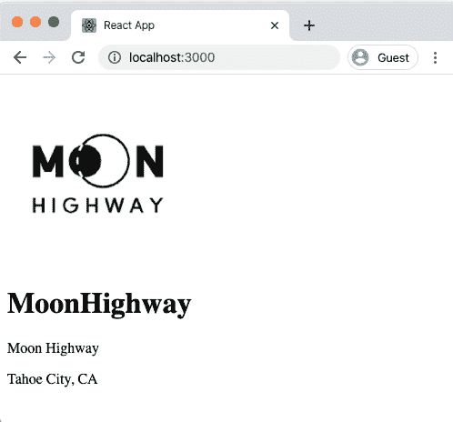
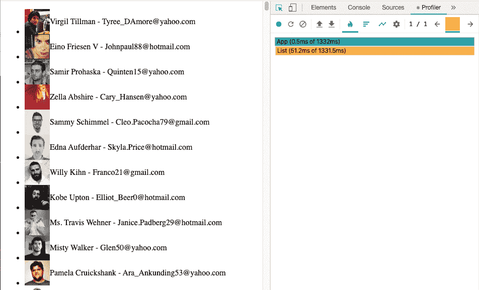
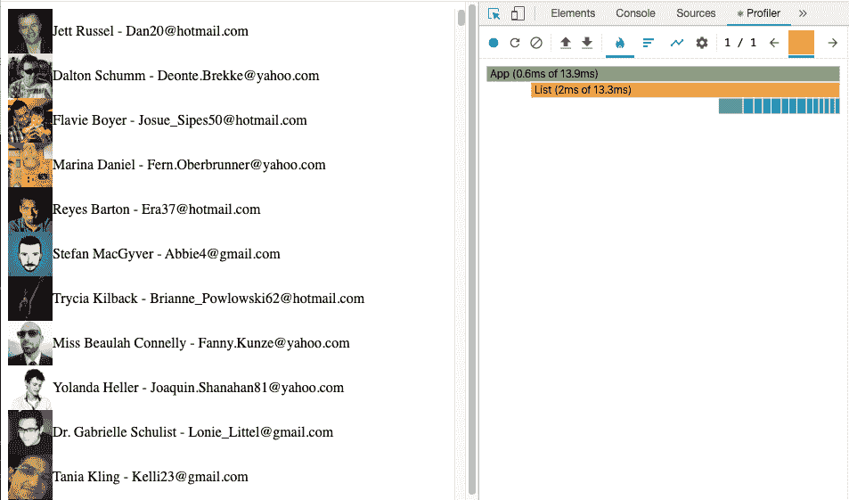
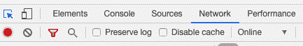
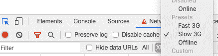
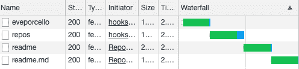
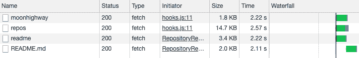
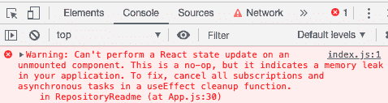
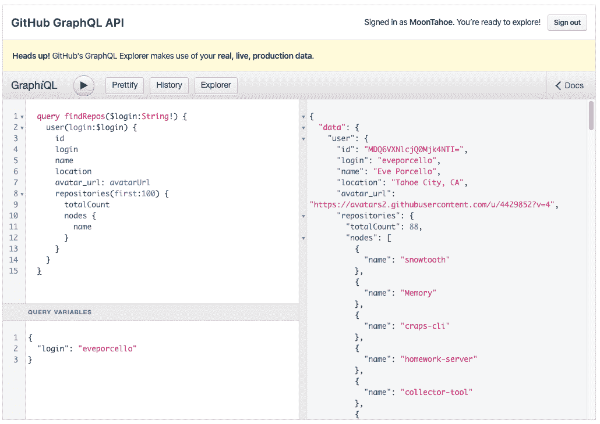
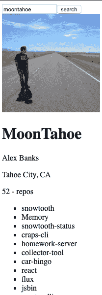

# 第八章：整合数据

数据是我们应用的生命线。它像水一样流动，为我们的组件提供营养。我们组合的用户界面组件是数据的容器。我们通过互联网为应用程序注入数据。我们收集、创建并发送新的数据到互联网。我们应用程序的价值不在于组件本身，而是流经这些组件的数据。

当我们谈论数据时，这听起来有点像在谈论水或食物。*云* 是我们发送和接收数据的丰富无穷的来源。它就是互联网。它是网络、服务、系统和数据库，在这些地方我们操作和存储着赫兹级别的数据。云以最新鲜的数据从源头“**水合**”我们的客户端。我们在本地处理这些数据，甚至本地存储它。但是当我们的本地数据与源头不同步时，它就会失去新鲜度，被称为*陈旧*。

这些都是我们作为开发人员在处理数据时面临的挑战。我们需要确保我们的应用程序通过云中的新鲜数据保持“水合”。在本章中，我们将探讨从源头加载和处理数据的各种技术。

# 请求数据

在电影《星球大战》中，机器人 C-3P0 是一个协议机器人。他的专长当然是沟通。他能说六百万种语言。毫无疑问，C-3P0 知道如何发送 HTTP 请求，因为超文本传输协议是互联网上传输数据的最流行方式之一。

HTTP 提供了我们互联网通信的支柱。每当我们在浏览器中加载 *http://www.google.com* 时，我们都在请求 Google 发送一个搜索表单。用于我们搜索的文件通过 HTTP 传输到浏览器。当我们通过搜索“猫照片”与 Google 交互时，我们要求 Google 为我们找到猫照片。Google 以数据形式回应，图像通过 HTTP 传输到我们的浏览器。

在 JavaScript 中，发起 HTTP 请求的最流行方式是使用 fetch。如果我们想要向 GitHub 请求有关 Moon Highway 的信息，我们可以发送一个 fetch 请求：

```
fetch(`https://api.github.com/users/moonhighway`)
  .then(response => response.json())
  .then(console.log)
  .catch(console.error);
```

`fetch` 函数返回一个 promise。在这里，我们正在向特定的 URL 发送一个异步请求：*https://api.github.com/users/moonhighway*。该请求需要一段时间来穿越互联网，并响应相关信息。当响应返回时，将使用 `.then(callback)` 方法将信息传递给回调函数。GitHub API 将会以 JSON 数据形式响应，但这些数据被包含在 HTTP 响应体中，因此我们调用 `response.json()` 来获取并解析这些数据。获取到数据后，我们将其记录到控制台中。如果出现任何问题，我们将会通过 `console.error` 方法输出错误信息。

GitHub 将以 JSON 对象形式响应此请求：

```
{
  "login": "MoonHighway",
  "id": 5952087,
  "node_id": "MDEyOk9yZ2FuaXphdGlvbjU5NTIwODc=",
  "avatar_url": "https://avatars0.githubusercontent.com/u/5952087?v=4",
  "bio": "Web Development classroom training materials.",

  ...

}
```

在 GitHub 上，用户帐户的基本信息可以通过他们的 API 获取。继续尝试搜索您自己：*https://api.github.com/users/<YOUR_GITHUB_USER_NAME>*。

另一种处理 promises 的方法是使用 `async/await`。由于 `fetch` 返回一个 promise，我们可以在 `async` 函数内 `await` 一个 fetch 请求：

```
async function requestGithubUser(githubLogin) {
  try {
    const response = await fetch(
      `https://api.github.com/users/${githubLogin}`
    );
    const userData = await response.json();
    console.log(userData);
  } catch (error) {
    console.error(error);
  }
}
```

此代码实现与之前使用 `.then` 函数链接到请求的完全相同的结果。当我们 `await` 一个 promise 时，直到 promise 解决后，下一行代码才会执行。这种格式为我们提供了在代码中处理 promises 的一种良好方式。我们将在本章的剩余部分中使用这两种方法。

## 发送请求时发送数据

很多请求要求我们在请求中上传数据。例如，我们需要收集有关用户的信息以创建一个帐户，或者我们可能需要新的用户信息来更新他们的帐户。

通常，我们在创建数据时使用 POST 请求，在修改数据时使用 PUT 请求。`fetch` 函数的第二个参数允许我们传递一个选项对象，`fetch` 在创建 HTTP 请求时可以使用这些选项：

```
fetch("/create/user", {
  method: "POST",
  body: JSON.stringify({ username, password, bio })
});
```

此 fetch 使用 POST 方法来创建新用户。`username`、`password` 和用户的 `bio` 作为字符串内容传递在请求的 `body` 中。

## 使用 fetch 上传文件

上传文件需要不同类型的 HTTP 请求：一个 `multipart-formdata` 请求。此类请求告知服务器请求主体中包含一个或多个文件。要在 JavaScript 中进行此请求，我们只需在请求主体中传递一个 `FormData` 对象：

```
const formData = new FormData();
formData.append("username", "moontahoe");
formData.append("fullname", "Alex Banks");
forData.append("avatar", imgFile);

fetch("/create/user", {
  method: "POST",
  body: formData
});
```

这一次，当我们创建用户时，我们将 `username`、`fullname` 和 `avatar` 图像作为 `formData` 对象随请求传递。虽然这些值在此处是硬编码的，但我们可以轻松地从表单收集它们。

## 授权请求

有时，我们需要授权才能进行请求。通常需要授权以获取个人或敏感数据。此外，几乎总是需要授权才能让用户通过 POST、PUT 或 DELETE 请求在服务器上执行操作。

用户通常通过向请求添加一个唯一令牌来标识自己，服务可以使用此令牌来识别用户。此令牌通常添加为 `Authorization` 标头。在 GitHub 上，如果您在请求中发送令牌，可以查看您的个人帐户信息：

```
fetch(`https://api.github.com/users/${login}`, {
  method: "GET",
  headers: {
    Authorization: `Bearer ${token}`
  }
});
```

令牌通常在用户通过提供其用户名和密码登录服务时获取。还可以通过第三方如 GitHub 或 Facebook 使用一个称为 OAuth 的开放标准协议来获取令牌。

GitHub 允许您生成个人用户令牌。您可以通过登录 GitHub 并导航到：设置 > 开发者设置 > 个人访问令牌来生成一个。在这里，您可以创建具有特定读写规则的令牌，然后使用这些令牌从 GitHub API 获取个人信息。如果生成个人访问令牌并在 fetch 请求中发送它，GitHub 将提供有关您帐户的额外私密信息。

从 React 组件内获取数据需要我们编排`useState`和`useEffect`钩子。`useState`钩子用于将响应存储在状态中，而`useEffect`钩子用于发出 fetch 请求。例如，如果我们想在组件中显示关于 GitHub 用户的信息，我们可以使用以下代码：

```
import React, { useState, useEffect } from "react";

function GitHubUser({ login }) {
  const [data, setData] = useState();

  useEffect(() => {
    if (!login) return;
    fetch(`https://api.github.com/users/${login}`)
      .then(response => response.json())
      .then(setData)
      .catch(console.error);
  }, [login]);

  if (data)
    return <pre>{JSON.stringify(data, null, 2)}</pre>;

  return null;
}

export default function App() {
  return <GitHubUser login="moonhighway" />;
}
```

在这段代码中，我们的`App`呈现了一个`GitHubUser`组件，并显示关于`moonhighway`的 JSON 数据。在第一次渲染时，`GitHubUser`使用`useState`钩子为`data`设置了一个状态变量。然后，因为`data`最初为`null`，组件返回`null`。从组件返回`null`告诉 React 不要渲染任何内容。这不会导致错误；我们只会看到一个黑屏。

组件渲染后，将调用`useEffect`钩子。这是我们发出 fetch 请求的地方。当我们得到响应时，我们获取并解析该响应中的数据为 JSON。现在我们可以将该 JSON 对象传递给`setData`函数，这会导致我们的组件再次渲染，但这次它会有数据。除非`login`的值发生变化，否则不会再次调用此`useEffect`钩子。当它改变时，我们需要从 GitHub 请求更多关于不同用户的信息。

当有`data`时，我们将其渲染为`pre`元素中的 JSON 字符串。`JSON.stringify`方法接受三个参数：要转换为字符串的 JSON 数据，可以用来替换 JSON 对象属性的替换函数，以及格式化数据时要使用的空格数。在本例中，我们将`null`作为替换器发送，因为我们不想替换任何内容。`2`表示在格式化代码时要使用的空格数。这将使 JSON 字符串缩进两个空格。使用`pre`元素保留空格，因此最终呈现的是可读的 JSON。

## 本地保存数据

我们可以使用 Web Storage API 将数据保存在浏览器中。数据可以通过使用`window.localStorage`或`window.sessionStorage`对象来保存。`sessionStorage` API 仅为用户的会话保存数据。关闭选项卡或重新启动浏览器将清除保存在`sessionStorage`中的任何数据。另一方面，`localStorage`将永久保存数据，直到您删除它为止。

JSON 数据应作为字符串保存在浏览器存储中。这意味着在保存之前将对象转换为 JSON 字符串，并在加载时将该字符串解析为 JSON。处理将 JSON 数据保存和加载到浏览器的函数可能如下所示：

```
const loadJSON = key =>
  key && JSON.parse(localStorage.getItem(key));
const saveJSON = (key, data) =>
  localStorage.setItem(key, JSON.stringify(data));
```

函数`loadJSON`使用`key`从`localStorage`加载一个项目。使用`localStorage.getItem`函数加载数据。如果项目存在，则在返回之前将其解析为 JSON。如果不存在，则函数`loadJSON`将返回`null`。

函数`saveJSON`将使用唯一的`key`标识符将一些数据保存到`localStorage`中。可以使用`localStorage.setItem`函数将数据保存到浏览器中。在保存数据之前，我们需要将其转换为 JSON 字符串。

从 Web 存储加载数据、保存数据到 Web 存储、字符串化数据和解析 JSON 字符串都是同步任务。`loadJSON`和`saveJSON`函数都是同步的。因此要小心——频繁调用这些函数并处理大量数据可能会导致性能问题。通常建议为了性能考虑对这些函数进行节流或防抖处理。

我们可以保存从 GitHub 请求接收到的用户数据。然后，下次请求同一用户时，我们可以使用保存到`localStorage`的数据，而不是向 GitHub 发送另一个请求。我们将添加以下代码到`GitHubUser`组件中：

```
const [data, setData] = useState(loadJSON(`user:${login}`));
useEffect(() => {
  if (!data) return;
  if (data.login === login) return;
  const { name, avatar_url, location } = data;
  saveJSON(`user:${login}`, {
    name,
    login,
    avatar_url,
    location
  });
}, [data]);
```

函数`loadJSON`是同步的，因此当我们调用`useState`设置数据的初始值时可以使用它。如果在`user:moonhighway`下保存了用户数据到浏览器中，我们将使用该值来初始化数据。否则，`data`将最初为`null`。

当从 GitHub 加载数据后，如果`data`在这里变化，我们将调用`saveJSON`仅保存我们需要的用户详细信息：`name`、`login`、`avatar_url`和`location`。当我们不使用其余用户对象时，无需保存其余数据。当对象为空时，我们也跳过保存`data`，即`!data`。此外，如果当前登录和`data.login`相等，则我们已经为该用户保存了数据。我们将跳过再次保存该数据的步骤。

这里是使用`localStorage`在浏览器中保存数据的整个`GitHubUser`组件的示例：

```
import React, { useState, useEffect } from "react";

const loadJSON = key =>
  key && JSON.parse(localStorage.getItem(key));
const saveJSON = (key, data) =>
  localStorage.setItem(key, JSON.stringify(data));

function GitHubUser({ login }) {
  const [data, setData] = useState(
    loadJSON(`user:${login}`)
  );

  useEffect(() => {
    if (!data) return;
    if (data.login === login) return;
    const { name, avatar_url, location } = data;
    saveJSON(`user:${login}`, {
      name,
      login,
      avatar_url,
      location
    });
  }, [data]);

  useEffect(() => {
    if (!login) return;
    if (data && data.login === login) return;
    fetch(`https://api.github.com/users/${login}`)
      .then(response => response.json())
      .then(setData)
      .catch(console.error);
  }, [login]);

  if (data)
    return <pre>{JSON.stringify(data, null, 2)}</pre>;

  return null;
}
```

注意`GitHubUser`组件现在有两个`useEffect`钩子。第一个钩子用于将数据保存到浏览器中。每当`data`的值变化时调用它。第二个钩子用于从 GitHub 请求更多数据。当已经为该用户在本地保存了数据时，不会发送 fetch 请求。这由第二个`useEffect`钩子中的第二个`if`语句处理：`if (data && data.login === login) return;`。如果有`data`并且该数据的`login`与`login`属性匹配，则无需向 GitHub 发送额外的请求。我们只需使用本地数据。

第一次运行应用程序时，如果`login`设置为`moonhighway`，将呈现以下对象到页面上：

```
{
  "login": "MoonHighway",
  "id": 5952087,
  "node_id": "MDEyOk9yZ2FuaXphdGlvbjU5NTIwODc=",
  "avatar_url": "https://avatars0.githubusercontent.com/u/5952087?v=4",
  "gravatar_id": "",
  "url": "https://api.github.com/users/MoonHighway",
  "html_url": "https://github.com/MoonHighway",

  ...

}
```

这是来自 GitHub 的响应。我们可以知道，因为此对象包含了关于用户的大量额外信息，我们不需要。第一次运行此页面时，我们将看到这个冗长的响应。但第二次运行页面时，响应就会短得多：

```
{
  "name": "Moon Highway",
  "login": "moonhighway",
  "avatar_url": "https://avatars0.githubusercontent.com/u/5952087?v=4",
  "location": "Tahoe City, CA"
}
```

这次，我们为`moonhighway`本地保存的数据正在被渲染到浏览器上。由于我们只需要四个字段的数据，因此我们只保存了四个字段的数据。直到我们清除存储之前，我们将始终看到这个较小的离线对象：

```
localStorage.clear();
```

`sessionStorage`和`localStorage`都是 Web 开发者的重要工具。当我们离线时，我们可以处理这些本地数据，并且它们允许我们通过发送更少的网络请求来提高应用程序的性能。然而，我们必须知道何时使用它们。实施离线存储会增加应用程序的复杂性，并且在开发中可能会让它们难以处理。此外，我们不需要使用 Web 存储来缓存数据。如果我们只是寻求性能提升，我们可以尝试让 HTTP 处理缓存。如果我们在头部添加`Cache-Control: max-age=<EXP_DATE>`，我们的浏览器将自动缓存内容。`EXP_DATE`定义了内容的过期日期。

## 处理 Promise 状态

HTTP 请求和 promises 都有三种状态：挂起、成功（已完成）和失败（已拒绝）。当我们发出请求并等待响应时，请求处于*挂起*状态。该响应只能以两种方式之一进行：成功或失败。如果响应成功，这意味着我们已成功连接到服务器并收到了数据。在 promise 的世界中，成功的响应意味着承诺已经*解析*。如果在此过程中出现问题，我们可以说 HTTP 请求已失败或者 promise 已被*拒绝*。在这两种情况下，我们将收到一个`error`来解释发生了什么。

在进行 HTTP 请求时，我们真的需要处理这三种状态。我们可以修改 GitHub 用户组件以渲染不仅仅是成功的响应。我们可以在请求挂起时添加一个“加载中…”消息，或者在出现`error`时渲染错误详情：

```
function GitHubUser({ login }) {
  const [data, setData] = useState();
  const [error, setError] = useState();
  const [loading, setLoading] = useState(false);

  useEffect(() => {
    if (!login) return;
    setLoading(true);
    fetch(`https://api.github.com/users/${login}`)
      .then(data => data.json())
      .then(setData)
      .then(() => setLoading(false))
      .catch(setError);
  }, [login]);

  if (loading) return <h1>loading...</h1>;
  if (error)
    return <pre>{JSON.stringify(error, null, 2)}</pre>;
  if (!data) return null;

  return (
    <div className="githubUser">
      
      <div>
        <h1>{data.login}</h1>
        {data.name && <p>{data.name}</p>}
        {data.location && <p>{data.location}</p>}
      </div>
    </div>
  );
}
```

当此请求成功时，Moon Highway 的信息将渲染到用户屏幕上，如图 8-1 所示。



###### 图 8-1\. 示例输出

如果发生了什么问题，我们将简单地将`error`对象显示为一个 JSON 字符串。在生产环境中，我们可能会对错误进行更多处理。也许我们会追踪它、记录它，或者尝试发出另一个请求。而在开发过程中，渲染错误详情是可以的，这可以为开发者提供即时反馈。

最后，在请求挂起时，我们只需使用一个`h1`显示“加载中…”消息。

有时 HTTP 请求可能会成功但带有错误。这种情况发生在请求成功——成功连接到服务器并收到响应——但响应体包含错误时。有时服务器会将附加错误作为成功响应传递。

处理这三种状态会使我们的代码变得有点臃肿，但在每个请求中这样做是至关重要的。请求需要时间，并且可能会出现很多问题。因为所有请求——和承诺——都有这三种状态，所以可以使用可重用的钩子、组件，甚至是称为 Suspense 的 React 特性来处理所有 HTTP 请求。我们将涵盖每种方法，但首先必须介绍渲染属性的概念。

# 渲染属性

*渲染属性* 正如其名，即被渲染的属性。这可以是作为属性传递的组件，在满足特定条件时进行渲染，或者可以是返回将被渲染的组件的函数属性。在第二种情况下，当它们是函数时，数据可以作为参数传递，并在渲染返回的组件时使用。

在异步组件中最大化重用性时，渲染属性非常有用。通过这种模式，我们可以创建抽象复杂机制或单调样板代码，这些对应用程序开发是必要的。

考虑显示列表的任务：

```
import React from "react";

const tahoe_peaks = [
  { name: "Freel Peak", elevation: 10891 },
  { name: "Monument Peak", elevation: 10067 },
  { name: "Pyramid Peak", elevation: 9983 },
  { name: "Mt. Tallac", elevation: 9735 }
];

export default function App() {
  return (
    <ul>
      {tahoe_peaks.map((peak, i) => (
        <li key={i}>
          {peak.name} - {peak.elevation.toLocaleString()}ft
        </li>
      ))}
    </ul>
  );
}
```

在这个例子中，塔霍最高的四个峰被渲染成无序列表。这段代码是有意义的，但是在映射一个数组以单独渲染每个项目时引入了一些代码复杂性。映射数组中的项目也是一个相当常见的任务。我们可能会经常重复这种模式。我们可以创建一个 `List` 组件，以便在需要渲染无序列表时重复使用这个解决方案。

在 JavaScript 中，数组要么包含值，要么为空。当列表为空时，我们需要向用户显示一条消息。然而，该消息可能会根据实现方式而变化。别担心——我们可以传递一个组件，在列表为空时进行渲染：

```
function List({ data = [], renderEmpty }) {
  if (!data.length) return renderEmpty;
  return <p>{data.length} items</p>;
}

export default function App() {
  return <List renderEmpty={<p>This list is empty</p>} />;
}
```

`List` 组件期望有两个属性：`data` 和 `renderEmpty`。第一个参数 `data` 表示要映射的项目数组。其默认值是一个空数组。第二个参数 `renderEmpty` 是一个组件，如果列表为空时将进行渲染。所以当 `data.length` 为 `0` 时，`List` 组件通过返回传递的 `renderEmpty` 属性来进行渲染。

在这种情况下，用户会看到以下消息：`This list is empty`。

`renderEmpty` 是一个渲染属性，因为它包含一个组件，当特定条件满足时将会渲染——在这种情况下，当列表为空或者 `data` 属性没有提供时。

我们可以将实际的 `data` 数组发送给这个组件：

```
export default function App() {
  return (
    <List
      data={tahoe_peaks}
      renderEmpty={<p>This list is empty</p>}
    />
  );
}
```

现在这样做只会渲染在数组中找到的项目数目：`4 items`。

我们还可以告诉我们的`List`组件在数组中找到的每个项应该渲染什么。例如，我们可以发送一个`renderItem`属性：

```
export default function App() {
  return (
    <List
      data={tahoe_peaks}
      renderEmpty={<p>This list is empty</p>}
      renderItem={item => (
        <>
          {item.name} - {item.elevation.toLocaleString()}ft
        </>
      )}
    />
  );
}
```

这次，渲染属性是一个函数。数据（即项本身）作为参数传递给此函数，以便在决定为每个塔霍峰渲染什么时使用。在这种情况下，我们渲染一个显示项的`name`和`elevation`的 React 片段。如果数组是`tahoe_peaks`，我们期望调用`renderItem`属性四次：每次为数组中的一个峰。

这种方法允许我们抽象化映射数组的机制。现在`List`组件将处理映射；我们只需告诉它要渲染什么：

```
function List({ data = [], renderItem, renderEmpty }) {
  return !data.length ? (
    renderEmpty
  ) : (
    <ul>
      {data.map((item, i) => (
        <li key={i}>{renderItem(item)}</li>
      ))}
    </ul>
  );
}
```

当`data`数组不为空时，`List`组件会渲染一个无序列表`<ul>`。它使用`.map`方法映射数组中的每个项，并为数组中的每个值渲染一个列表项`<li>`。`List`组件确保每个列表项都收到一个唯一的`key`。在每个`<li>`元素内部，调用`renderItem`属性并将项本身作为参数传递给该函数属性。结果是一个无序列表，显示了每个塔霍最高峰的名称和海拔。

好消息是我们有一个可重复使用的`List`组件，可以在需要渲染无序列表时使用。坏消息是我们的组件有点简陋。有更好的组件可以处理这个任务。

# 虚拟化列表

如果我们的工作是开发一个用于渲染列表的可重用组件，那么需要考虑和实施许多不同的用例和解决方案。其中最重要的一点是当列表非常大时会发生什么。在生产中，我们处理的许多数据点可能会感觉无限。Google 搜索会产生一页又一页的结果。在 Airbnb 上搜索塔霍的住所会产生一个似乎永远不会结束的房屋和公寓列表。生产应用通常有大量需要渲染的数据，但我们不能一次性全部渲染出来。

浏览器能够渲染的内容是有限的。渲染需要时间、处理能力和内存，这三者都有各自的限制。在开发可重复使用的列表组件时，应考虑这一点。当`data`数组非常大时，我们应该怎么办？

尽管我们寻找住所的搜索可能产生了一千个结果，但我们不可能同时查看所有这些结果——屏幕空间不足以显示所有的图像、名称和价格。我们可能一次只能看到大约五个结果。当滚动时，可以看到更多的结果，但必须向下滚动很远才能看到一千个结果。在可滚动的层中渲染一千个结果对手机来说要求很多。

不要一次性渲染 1000 个结果，如果我们只渲染 11 个会怎么样？记住用户一次只能看到大约五个结果。所以我们渲染用户能看到的五个项目，并在可见窗口之上和之下渲染六个屏幕外的项目。在可见窗口之上和之下渲染项目可以让用户在两个方向上滚动。我们可以在图 8-2 中看到这一点。


###### 图 8-2\. 带有屏幕外内容的窗口化

当用户滚动时，我们可以卸载已经查看过的结果，并渲染新的在屏幕外的结果，等待用户通过滚动来显示。这种解决方案意味着浏览器一次只会渲染 11 个元素，而其余元素的数据则等待着被渲染。这种技术被称为*窗口化*或*虚拟化*。它允许我们滚动非常大，甚至无限的数据列表而不会导致浏览器崩溃。

在构建虚拟列表组件时需要考虑很多因素。幸运的是，我们不必从头开始；社区已经为我们开发了许多虚拟列表组件供我们使用。在浏览器中最流行的这些组件包括`react-window`和`react-virtualized`。虚拟列表非常重要，以至于 React Native 甚至默认包含一个：`FlatList`。大多数人不需要自己构建虚拟列表组件，但我们确实需要知道如何使用它们。

要实现虚拟列表，我们需要大量的数据——在这种情况下，是假数据：

```
npm i faker
```

安装`faker`将允许我们创建大量的假数据数组。在这个例子中，我们将使用假用户。我们将随机创建五千个假用户：

```
import faker from "faker";

const bigList = [...Array(5000)].map(() => ({
  name: faker.name.findName(),
  email: faker.internet.email(),
  avatar: faker.internet.avatar()
}));
```

`bigList`变量是通过映射一个包含五千个空值的数组来创建的，并用`faker`提供的函数将这些空值替换为关于假用户的信息。每个用户的`name`、`email`和`avatar`都是随机生成的。

如果我们使用上一节创建的`List`组件，它会一次性渲染所有五千个用户：

```
export default function App() {
  const renderItem = item => (
    <div style={{ display: "flex" }}>
      
      <p>
        {item.name} - {item.email}
      </p>
    </div>
  );

  return <List data={bigList} renderItem={renderItem} />;
}
```

这段代码为每个用户创建一个`div`元素。在每个`div`中，会渲染一个用于用户照片的`img`元素，并且用户的`name`和`email`会用段落元素进行渲染，如图 8-3 所示。



###### 图 8-3\. 性能结果

React 和现代浏览器的结合已经非常惊人了。我们很可能能够渲染所有五千个用户，但这需要一些时间。在这个例子中，确切地说是 52 毫秒。随着列表中用户数量的增加，这个时间也会增加，直到最终达到一个临界点。

让我们使用`react-window`来渲染同样的假用户列表：

```
npm i react-window
```

`react-window`是一个库，提供了几个组件用于渲染虚拟列表。在这个例子中，我们将使用`react-window`中的`FixSizeList`组件：

```
import React from "react";
import { FixedSizeList } from "react-window";
import faker from "faker";

const bigList = [...Array(5000)].map(() => ({
  name: faker.name.findName(),
  email: faker.internet.email(),
  avatar: faker.internet.avatar()
}));

export default function App() {
  const renderRow = ({ index, style }) => (
    <div style={{ ...style, ...{ display: "flex" } }}>
      
      <p>
        {bigList[index].name} - {bigList[index].email}
      </p>
    </div>
  );

  return (
    <FixedSizeList
      height={window.innerHeight}
      width={window.innerWidth - 20}
      itemCount={bigList.length}
      itemSize={50}
    >
      {renderRow}
    </FixedSizeList>
  );
}
```

`FixedSizeList`与我们的`List`组件稍有不同。它需要列表中的总项目数以及每行需要的像素数作为`itemSize`属性。这种语法中的另一个重大区别是将渲染 prop 作为`children`属性传递给`FixedSizeList`。这种渲染 prop 模式经常被使用。

因此，让我们看看当使用`FixSizeList`组件渲染五千个虚拟用户时会发生什么（见图 8-4）。

这次，不是所有的用户一次性被渲染出来。只有用户能看到或轻松滚动到的那些行才会被渲染。请注意，这个初始渲染只需要 2.6 毫秒。

当您向下滚动以显示更多用户时，`FixedSizeList`会辛勤工作，渲染屏幕外的更多用户并移除已经滚动出屏幕的用户。这个组件自动处理双向滚动。这个组件可能会频繁地进行渲染，但是渲染速度很快。而且我们数组中有多少用户都不重要：`FixedSizeList`都能处理。



###### 图 8-4\. 这次渲染用时 2.6 毫秒

## 创建一个 Fetch 钩子

我们知道请求要么是进行中、成功或失败。我们可以通过创建一个自定义钩子来重用进行 fetch 请求所需的逻辑。我们将称这个钩子为`useFetch`，并且我们可以在应用程序的各个组件中使用它来进行 fetch 请求：

```
import React, { useState, useEffect } from "react";

export function useFetch(uri) {
  const [data, setData] = useState();
  const [error, setError] = useState();
  const [loading, setLoading] = useState(true);

  useEffect(() => {
    if (!uri) return;
    fetch(uri)
      .then(data => data.json())
      .then(setData)
      .then(() => setLoading(false))
      .catch(setError);
  }, [uri]);

  return {
    loading,
    data,
    error
  };
}
```

这个自定义钩子是通过组合`useState`和`useEffect`钩子创建的。在这个钩子中，fetch 请求的三种状态分别是：pending（进行中）、success（成功）和 error（错误）。当请求处于 pending 状态时，钩子将返回`loading`为`true`。当请求成功并且检索到`data`时，数据将从这个钩子传递给组件。如果出现问题，这个钩子将返回错误。

所有这三种状态都在`useEffect`钩子内管理。每当`uri`的值发生变化时，都会调用这个钩子。如果没有`uri`，则不会进行 fetch 请求。当有`uri`时，fetch 请求开始。如果请求成功，我们将结果 JSON 传递给`setData`函数，改变`data`的状态值。之后，我们将`loading`的状态值改为 false，因为请求成功了（即不再处于 pending 状态）。最后，如果出现任何问题，我们会捕获并传递给`setError`，从而改变`error`的状态值。

现在我们可以使用这个钩子在我们的组件中进行 fetch 请求。每当`loading`、`data`或`error`的值发生变化时，这个钩子会导致`GitHubUser`组件重新渲染以展示这些新值：

```
function GitHubUser({ login }) {
  const { loading, data, error } = useFetch(
    `https://api.github.com/users/${login}`
  );

  if (loading) return <h1>loading...</h1>;
  if (error)
    return <pre>{JSON.stringify(error, null, 2)}</pre>;

  return (
    <div className="githubUser">
      
      <div>
        <h1>{data.login}</h1>
        {data.name && <p>{data.name}</p>}
        {data.location && <p>{data.location}</p>}
      </div>
    </div>
  );
}
```

虽然组件现在逻辑更少，但仍处理所有三种状态。假设我们有一个`SearchForm`组件准备好从用户那里收集搜索字符串，我们可以将`GitHubUser`组件添加到我们的主`App`组件中：

```
import React, { useState } from "react";
import GitHubUser from "./GitHubUser";
import SearchForm from "./SearchForm";

export default function App() {
  const [login, setLogin] = useState("moontahoe");

  return (
    <>
      <SearchForm value={login} onSearch={setLogin} />
      <GitHubUser login={login} />
    </>
  );
}
```

主要的`App`组件在状态中存储 GitHub 用户的用户名。改变这个值的唯一方法是使用搜索表单来搜索新用户。每当`login`的值发生变化时，发送给`useFetch`的值也会发生变化，因为它依赖于 login 属性：*https://api.github.com/users/${login}*。这将改变我们钩子中的`uri`并触发对新用户登录的 fetch 请求。我们已经创建了一个自定义钩子，并成功地用它创建了一个小应用程序，可以用来查找和显示 GitHub 用户的详细信息。在迭代这个应用程序时，我们将继续使用这个钩子。

## 创建一个 Fetch 组件

钩子通常允许我们在组件之间重用功能。在处理我们组件内的渲染时，有时我们会发现自己重复相同的模式。例如，我们选择渲染的加载旋转器可能是我们希望在整个应用程序中每当 fetch 请求挂起时都渲染的相同旋转器。我们处理 fetch 请求错误的方式可能也在整个应用程序中保持一致。

在我们的应用程序中，我们可以创建一个组件来渲染一致的加载旋转器，并在整个领域内一致地处理所有错误，而不是在多个组件中复制相同的代码。让我们创建一个`Fetch`组件：

```
function Fetch({
  uri,
  renderSuccess,
  loadingFallback = <p>loading...</p>,
  renderError = error => (
    <pre>{JSON.stringify(error, null, 2)}</pre>
  )
}) {
  const { loading, data, error } = useFetch(uri);
  if (loading) return loadingFallback;
  if (error) return renderError(error);
  if (data) return renderSuccess({ data });
}
```

自定义钩子，`useFetch`，是一层抽象：它抽象了进行 fetch 请求的机制。`Fetch`组件是另一层抽象：它抽象了处理渲染内容的机制。当请求正在加载时，`Fetch`组件将渲染传递给可选的`loadingFallback`属性。当请求成功时，JSON 响应数据将传递给`renderSuccess`属性。如果出现错误，将使用可选的`renderError`属性进行渲染。`loadingFallback`和`renderError`属性提供了一个可选的定制层。然而，当它们未提供时，它们将回退到它们的默认值。

有了`Fetch`组件，我们可以真正简化我们`GitHubUser`组件中的逻辑：

```
import React from "react";
import Fetch from "./Fetch";

export default function GitHubUser({ login }) {
  return (
    <Fetch
      uri={`https://api.github.com/users/${login}`}
      renderSuccess={UserDetails}
    />
  );
}

function UserDetails({ data }) {
  return (
    <div className="githubUser">
      
      <div>
        <h1>{data.login}</h1>
        {data.name && <p>{data.name}</p>}
        {data.location && <p>{data.location}</p>}
      </div>
    </div>
  );
}
```

`GitHubUser`组件接收一个在 GitHub 上查找的用户的`login`。我们使用该登录来构建发送给`fetch`组件的`uri`属性。如果成功，将呈现`UserDetails`组件。当`Fetch`组件正在加载时，将显示默认的“加载中…”消息。如果出现问题，则自动显示错误详细信息。

我们可以为这些属性提供自定义值。以下是我们如何替代使用我们灵活组件的示例：

```
<Fetch
  uri={`https://api.github.com/users/${login}`}
  loadingFallback={<LoadingSpinner />}
  renderError={error => {
    // handle error
    return <p>Something went wrong... {error.message}</p>;
  }}
  renderSuccess={({ data }) => (
    <>
      <h1>Todo: Render UI for data</h1>
      <pre>{JSON.stringify(data, null, 2)}</pre>
    </>
  )}
/>
```

这次，`Fetch`组件将渲染我们自定义的加载旋转器。如果出现问题，我们将隐藏错误详细信息。当请求成功时，我们选择替代地呈现原始数据以及一个给我们自己的 TODO 消息。

注意：无论是通过钩子还是组件，额外的抽象层都可能会增加我们代码的复杂性。我们的工作是在任何可能的地方减少复杂性。然而，在这种情况下，通过将可重复使用的逻辑抽象成组件和钩子，我们已经减少了复杂性。

## 处理多个请求

一旦我们开始从互联网请求数据，就无法停止。往往我们需要发出多个 HTTP 请求来获取所有需要的数据来满足我们应用的需求。例如，我们目前正在请求 GitHub 提供关于用户账户的信息。我们还需要获取有关该用户仓库的信息。这两个数据点通过单独的 HTTP 请求获取。

GitHub 用户通常拥有许多仓库。关于用户仓库的信息以对象数组的形式传递。我们将创建一个名为`useIterator`的特殊自定义钩子，允许我们迭代任何对象数组：

```
export const useIterator = (
  items = [],
  initialIndex = 0
) => {
  const [i, setIndex] = useState(initialIndex);

  const prev = () => {
    if (i === 0) return setIndex(items.length - 1);
    setIndex(i - 1);
  };

  const next = () => {
    if (i === items.length - 1) return setIndex(0);
    setIndex(i + 1);
  };

  return [items[i], prev, next];
};
```

这个钩子将允许我们循环遍历任何数组。因为它返回数组内的项目，我们可以利用数组解构为这些值赋予有意义的名称：

```
const [letter, previous, next] = useIterator([
  "a",
  "b",
  "c"
]);
```

在这种情况下，初始的`letter`是“b”。如果用户调用`next`，组件将重新渲染，但这次，`letter`的值将是“b”。再调用两次`next`，`letter`的值将再次变为“a”，因为此迭代器会循环回到数组的第一个项，而不是让`index`越界。

`useIterator`钩子接受一个`items`数组和一个初始索引。这个迭代器钩子的关键值是索引`i`，它是用`useState`钩子创建的。`i`用于标识数组中的当前项。此钩子返回当前项`item[i]`，以及用于在数组中进行迭代的函数：`prev`和`next`。`prev`和`next`函数通过调用`setIndex`来减少或增加`i`的值。此操作会导致使用新`index`重新渲染钩子。

## 缓存值

`useIterator`钩子非常酷。但我们可以通过缓存`item`的值以及`prev`和`next`的函数做得更好：

```
import React, { useCallback, useMemo } from "react";

export const useIterator = (
  items = [],
  initialValue = 0
) => {
  const [i, setIndex] = useState(initialValue);

  const prev = useCallback(() => {
    if (i === 0) return setIndex(items.length - 1);
    setIndex(i - 1);
  }, [i]);

  const next = useCallback(() => {
    if (i === items.length - 1) return setIndex(0);
    setIndex(i + 1);
  }, [i]);

  const item = useMemo(() => items[i], [i]);

  return [item || items[0], prev, next];
};
```

在这里，`prev`和`next`都是使用`useCallback`钩子创建的。这确保了`prev`的函数在`i`的值不变时始终相同。同样，`item`的值将始终指向同一个对象，除非`i`的值发生变化。

缓存这些值并不能给我们带来巨大的性能提升，或者至少不足以证明代码复杂性。然而，当消费者使用`useIterator`组件时，缓存的值始终指向完全相同的对象和函数。这使得当消费者需要比较这些值或在他们自己的依赖数组中使用它们时更容易。

现在，我们将创建一个存储库菜单组件。在此组件中，我们将使用`useIterator`钩子允许用户循环浏览他们的存储库列表：

```
< learning-react >
```

如果他们点击“下一个”按钮，他们将看到下一个存储库的名称。同样，如果他们点击“上一个”按钮，他们将看到上一个存储库的名称。`RepoMenu`是我们将创建的组件，提供此功能：

```
import React from "react";
import { useIterator } from "../hooks";

export function RepoMenu({
  repositories,
  onSelect = f => f
}) {
  const [{ name }, previous, next] = useIterator(
    repositories
  );

  useEffect(() => {
    if (!name) return;
    onSelect(name);
  }, [name]);

  return (
    <div style={{ display: "flex" }}>
      <button onClick={previous}>&lt;</button>
      <p>{name}</p>
      <button onClick={next}>&gt;</button>
    </div>
  );
}
```

`RepoMenu`接收一个`repositories`列表作为属性。然后从当前存储库对象中解构`name`，从`useIterator`中解构`previous`和`next`函数。`&lt;`是“小于”的实体，显示为小于号“<”。`&gt;`也是同理，表示大于。这些是上一个和下一个的指示器，当用户点击其中任何一个指示器时，组件将重新渲染为新的存储库名称。如果`name`发生变化，那么用户已选择了不同的存储库，因此我们调用`onSelect`函数，并将新存储库的`name`作为参数传递给该函数。

请记住，数组解构允许我们随意命名项目。尽管我们在钩子中将这些函数命名为`prev`和`next`，但在这里，当我们使用该钩子时，我们可以将它们的名称更改为`previous`和`next`。

现在我们可以创建`UserRepositories`组件。该组件应首先请求 GitHub 用户的存储库列表，一旦收到，将该列表传递给`RepoMenu`组件：

```
import React from "react";
import Fetch from "./Fetch";
import RepoMenu from "./RepoMenu";

export default function UserRepositories({
  login,
  selectedRepo,
  onSelect = f => f
}) {
  return (
    <Fetch
      uri={`https://api.github.com/users/${login}/repos`}
      renderSuccess={({ data }) => (
        <RepoMenu
          repositories={data}
          selectedRepo={selectedRepo}
          onSelect={onSelect}
        />
      )}
    />
  );
}
```

`UserRepositories`组件需要一个`login`来使用，以便发出获取存储库列表的 fetch 请求。该`login`用于创建 URI 并将其传递给`Fetch`组件。一旦 fetch 成功解析，我们将渲染`RepoMenu`以及从`Fetch`组件返回的存储库列表作为`data`。当用户选择不同的存储库时，我们只需将该新存储库的名称传递给父对象：

```
function UserDetails({ data }) {
  return (
    <div className="githubUser">
      
      <div>
        <h1>{data.login}</h1>
        {data.name && <p>{data.name}</p>}
        {data.location && <p>{data.location}</p>}
      </div>
      <UserRepositories
        login={data.login}
        onSelect={repoName => console.log(`${repoName} selected`)}
      />
    </div>
  );
```

现在我们需要将新组件添加到`UserDetails`组件中。当渲染`UserDetails`组件时，我们还将渲染该用户的存储库列表。假设`login`值为`eveporcello`，上述组件的渲染输出将类似于图 8-5。


###### 图 8-5\. 存储库输出

为了获取 Eve 账户的信息以及她的存储库列表，我们需要发送两个单独的 HTTP 请求。作为 React 开发人员，我们的大部分时间都将花在这里：请求信息并将所有接收到的信息组合成美观的用户界面应用程序。请求两次信息只是个开始。在下一节中，我们将继续向 GitHub 发出更多请求，以便查看所选存储库的 README.md。

## 瀑布请求

在上一节中，我们进行了两个 HTTP 请求。第一个请求是用户详细信息的请求，然后一旦我们有了这些详细信息，我们就会为该用户的存储库进行第二个请求。这些请求依次进行，依次发生。

最初获取用户详细信息时进行第一个请求：

```
<Fetch
  uri={`https://api.github.com/users/${login}`}
  renderSuccess={UserDetails}
/>
```

一旦我们获得了该用户的详细信息，`UserDetails`组件就会被渲染。它反过来渲染`UserRepositories`，然后发送一个请求以获取该用户的存储库：

```
<Fetch
  uri={`https://api.github.com/users/${login}/repos`}
  renderSuccess={({ data }) => (
    <RepoMenu repositories={data} onSelect={onSelect} />
  )}
/>
```

我们称这些请求为*瀑布*请求，因为它们依次发生——它们彼此依赖。如果用户详细信息请求出现问题，那么用户存储库的请求将不会被发出。

让我们为这个瀑布再添加一些层次（水？）。首先，我们请求用户的信息，然后是他们的存储库列表，然后一旦我们有了他们的存储库列表，我们就会请求第一个存储库的 README.md 文件。随着用户在存储库列表中循环，我们将为每个存储库的相关 README 进行额外的请求。

存储库 README 文件使用 Markdown 编写，这是一种可以使用`ReactMarkdown`组件轻松呈现为 HTML 的文本格式。首先，让我们安装`react-markdown`：

```
npm i react-markdown
```

请求存储库 README 文件的内容还需要一系列的请求瀑布。首先，我们必须向存储库的 README 路由发出数据请求：*https://api.github.com/repos/${login}/${repo}/readme*。GitHub 将通过此路由响应有关存储库 README 文件的详细信息，但不提供该文件的内容。它确实为我们提供了一个`download_url`，我们可以使用它来请求 README 文件的内容。但是要获取 Markdown 内容，我们需要进行额外的请求。这两个请求可以在单个异步函数内完成：

```
const loadReadme = async (login, repo) => {
  const uri = `https://api.github.com/repos/${login}/${repo}/readme`;
  const { download_url } = await fetch(uri).then(res =>
    res.json()
  );
  const markdown = await fetch(download_url).then(res =>
    res.text()
  );

  console.log(`Markdown for ${repo}\n\n${markdown}`);
};
```

要找到存储库的 README，我们需要存储库所有者的`login`和存储库的名称。这些值用于构建一个唯一的网址：*https://api.github.com/repos/moonhighway/learning-react/readme*。当这个请求成功时，我们从其响应中解构出`download_url`。现在，我们可以使用这个值来下载 README 的内容；我们只需获取`download_url`。我们将此文本解析为文本——`res.text()`——而不是 JSON，因为响应的主体是 Markdown 文本。

一旦我们有了 Markdown，让我们通过将`loadReadme`函数包装在一个 React 组件内来呈现它：

```
import React, {
  useState,
  useEffect,
  useCallback
} from "react";
import ReactMarkdown from "react-markdown";

export default function RepositoryReadme({ repo, login }) {
  const [loading, setLoading] = useState(false);
  const [error, setError] = useState();
  const [markdown, setMarkdown] = useState("");

  const loadReadme = useCallback(async (login, repo) => {
    setLoading(true);
    const uri = `https://api.github.com/repos/${login}/${repo}/readme`;
    const { download_url } = await fetch(uri).then(res =>
      res.json()
    );
    const markdown = await fetch(download_url).then(res =>
      res.text()
    );
    setMarkdown(markdown);
    setLoading(false);
  }, []);

  useEffect(() => {
    if (!repo || !login) return;
    loadReadme(login, repo).catch(setError);
  }, [repo]);

  if (error)
    return <pre>{JSON.stringify(error, null, 2)}</pre>;
  if (loading) return <p>Loading...</p>;

  return <ReactMarkdown source={markdown} />;
}
```

首先，我们使用`useCallback`钩子将`loadReadme`函数添加到组件中，以在组件初始渲染时记忆函数。该函数在进行 fetch 请求之前将加载状态更改为`true`，并在请求完成后将其更改回`false`。接收到 Markdown 后，使用`setMarkdown`函数将其保存在状态中。

接下来，我们需要实际调用`loadReadme`，因此我们在组件初始渲染后添加了一个`useEffect`钩子来加载 README 文件。如果因某些原因`repo`和`login`的属性不存在，则 README 将不会被加载。此钩子中的依赖数组包含`[repo]`。这是因为我们希望在`repo`的值发生变化时加载另一个 README。如果在加载 README 时发生任何错误，它将被捕获并发送到`setError`函数。

注意，我们必须处理与每次获取请求相同的三种渲染状态：挂起，成功和失败。最后，在成功响应时，Markdown 本身使用`ReactMarkdown`组件呈现。

所有需要做的就是在`RepoMenu`组件内部呈现`RepositoryReadme`组件。当用户使用`RepoMenu`组件循环浏览仓库时，每个仓库的 README 也会被加载并显示：

```
export function RepoMenu({ repositories, login }) {
  const [{ name }, previous, next] = useIterator(
    repositories
  );
  return (
    <>
      <div style={{ display: "flex" }}>
        <button onClick={previous}>&lt;</button>
        <p>{name}</p>
        <button onClick={next}>&gt;</button>
      </div>
      <RepositoryReadme login={login} repo={name} />
    </>
  );
}
```

现在我们的应用程序真的正在发起多个请求；最初它会发起四个请求：一个是用户详细信息的请求，然后是该用户的仓库列表的请求，接着是所选仓库 README 信息的请求，最后还有一次文本内容的 README 请求。这些都是瀑布式请求，因为它们一个接一个地发生。

另外，随着用户与应用程序的交互，还会发起更多的请求。每当用户更改当前仓库时，都会发起两次瀑布式请求以获取 README 文件。每当用户搜索不同的 GitHub 账户时，都会再次发起四次初始瀑布式请求。

## 减慢网络速度

所有这些请求都可以在开发者工具的网络选项卡中看到。从这个选项卡中，您可以看到每个请求，并可以通过减缓网络速度来查看这些请求在慢网络上的展开情况。如果您想看到瀑布式请求是如何一个接一个发生的，可以减慢网络速度并查看加载消息。

大多数主流浏览器的开发者工具中都有网络选项卡。要在 Google Chrome 中减慢网络速度，选择“在线”旁边的箭头，如图 8-6 所示。



###### 图 8-6\. 改变网络请求的速度

这将打开一个菜单，您可以在图 8-7 中看到各种速度选项。



###### 图 8-7\. 选择网络请求的速度

选择“Fast 3G”或“Slow 3G”将显著减慢您的网络请求。

此外，网络选项卡还显示了所有 HTTP 请求的时间线。您可以将此时间线筛选为仅查看“XHR”请求。这意味着它只会显示使用`fetch`进行的请求（见图 8-8）。



###### 图 8-8\. 请求的瀑布图

在这里，我们看到连续进行了四次请求。请注意加载图形的标题为“瀑布”。这表明每个请求在前一个请求完成后进行。

## 并行请求

有时，通过同时发送所有请求，可以使应用程序更快。与瀑布式一次发出每个请求不同，我们可以并行发送请求，即同时进行。

当前我们应用程序产生请求瀑布的原因是这些组件相互嵌套渲染。`GitHubUser` 最终渲染 `UserRepositories`，后者最终渲染 `RepositoryReadme`。请求直到每个组件被渲染后才会发生。

进行这些并行请求将需要不同的方法。首先，我们需要从 `RepoMenu` 的渲染函数中删除 `<RepositoryReadme />`。这是一个不错的举措。`RepoMenu` 应只专注于创建用户可以循环浏览的存储库菜单的逻辑。`RepositoryReadme` 组件应在不同的组件中处理。

接下来，我们需要从 `UserRepositories` 的 `renderSuccess` 属性中删除 `<RepoMenu />`。同样，需要从 `UserDetails` 组件中删除 `<UserRepositories />`。

我们不再将这些组件嵌套在彼此内部，而是将它们全部放置在同一级别并排放置，都在 `App` 组件中：

```
import React, { useState } from "react";
import SearchForm from "./SearchForm";
import GitHubUser from "./GitHubUser";
import UserRepositories from "./UserRepositories";
import RepositoryReadme from "./RepositoryReadme";

export default function App() {
  const [login, setLogin] = useState("moonhighway");
  const [repo, setRepo] = useState("learning-react");
  return (
    <>
      <SearchForm value={login} onSearch={setLogin} />
      <GitHubUser login={login} />
      <UserRepositories
        login={login}
        repo={repo}
        onSelect={setRepo}
      />
      <RepositoryReadme login={login} repo={repo} />
    </>
  );
}
```

`GitHubUser`、`UserRepositories` 和 `RepositoryReadme` 组件都会向 GitHub 发送 HTTP 请求以获取数据。将它们并排渲染在同一级别会导致所有这些请求同时进行，即并行进行。

每个组件需要特定的信息才能发出请求。我们需要一个 `login` 来获取 GitHub 用户。我们需要一个 `login` 来获取用户存储库列表。`RepositoryReadme` 需要 `login` 和 `repo` 才能正常工作。为了确保所有组件都能获取到发起请求所需的信息，我们初始化应用程序以显示用户“moonhighway”的详细信息和存储库“learning-react”的详细信息。

如果用户使用 `SearchForm` 搜索另一个 `GitHubUser`，`login` 的值将更改，这将触发组件中的 `useEffect` 钩子，导致它们发出额外的数据请求。如果用户在存储库列表中循环，则将调用 `UserRepositories` 的 `onSelect` 属性，这将导致 `repo` 值发生变化。更改 `repo` 值将触发 `RepositoryReadme` 组件内部的 `useEffect` 钩子，并请求新的 README。

`RepoMenu` 组件始终从第一个存储库开始，无论如何。我们必须查看是否有 `selectedRepo` 属性。如果有，我们需要使用它来找到要显示的存储库的初始索引：

```
export function RepoMenu({ repositories, selected, onSelect = f => f }) {
  const [{ name }, previous, next] = useIterator(
    repositories,
    selected ? repositories.findIndex(repo => repo.name === selected) : null
  );
  ...
}
```

`useIterator`钩子的第二个参数是要从哪里开始的初始索引。如果有`selected`属性，那么我们将根据`name`搜索选定的存储库的索引。这是必需的，以确保存储库菜单最初显示正确的存储库。我们还需要从`UserRepositories`将此`selected`属性传递给该组件：

```
<Fetch
  uri={`https://api.github.com/users/${login}/repos`}
  renderSuccess={({ data }) => (
    <RepoMenu
      repositories={data}
      selected={repo}
      onSelect={onSelect}
    />
  )}
/>
```

现在`repo`属性被传递给`RepoMenu`，菜单应选择初始仓库，即我们的例子中是“learning-react”。

如果您查看网络选项卡，您将注意到我们已经进行了三个并行请求，如图 8-9 所示。



###### 图 8-9\. 创建并行请求

因此，每个组件同时发出其请求。`RepoReadme`组件仍然必须进行串行请求以获取 README 文件的内容。这没问题。很难使应用程序在初始渲染时立即发出每个请求。并行和串行请求可以结合使用。

## 等待值

当前，我们将`login`和`repo`的值初始化为“moonhighway”和“learning-react”。我们可能无法总是猜测要首先渲染哪些数据。在这种情况下，直到组件所需的数据可用之前，我们才简单地不渲染该组件：

```
export default function App() {
  const [login, setLogin] = useState();
  const [repo, setRepo] = useState();
  return (
    <>
      <SearchForm value={login} onSearch={setLogin} />
      {login && <GitHubUser login={login} />}
      {login && (
        <UserRepositories
          login={login}
          repo={repo}
          onSelect={setRepo}
        />
      )}
      {login && repo && (
        <RepositoryReadme login={login} repo={repo} />
      )}
    </>
  );
}
```

在这种情况下，直到它们所需的 props 具有值之前，没有一个组件会被渲染。最初，只有`SearchForm`组件被渲染。搜索用户将更改`login`的值，导致`UserRepositories`组件被渲染。当此组件查找存储库时，它将选择列表中的第一个存储库，导致调用`setRepo`。最后，我们有了`login`和`repo`，因此将渲染`RepositoryReadme`组件。

## 取消请求

更深思考我们的应用，我们意识到用户可能会清空搜索字段并搜索没有用户。在这种情况下，我们还希望确保`repo`的值也为空。让我们添加一个`handleSearch`方法，确保在`login`没有值时`repo`值发生变化：

```
export default function App() {
  const [login, setLogin] = useState("moonhighway");
  const [repo, setRepo] = useState("learning-react");

  const handleSearch = login => {
    if (login) return setLogin(login);
    setLogin("");
    setRepo("");
  };

  if (!login)
    return (
      <SearchForm value={login} onSearch={handleSearch} />
    );

  return (
    <>
      <SearchForm value={login} onSearch={handleSearch} />
      <GitHubUser login={login} />
      <UserRepositories
        login={login}
        repo={repo}
        onSelect={setRepo}
      />
      <RepositoryReadme login={login} repo={repo} />
    </>
  );
}
```

我们已经添加了一个`handleSearch`方法。现在，当用户清除搜索字段并搜索空字符串时，repo 值也将设置为空字符串。如果因某种原因没有登录，我们只渲染一个组件：`SearchForm`。当我们有了`login`的值时，我们将渲染所有四个组件。

现在，从技术上讲，我们的应用程序有两个屏幕。一个屏幕仅显示搜索表单。另一个屏幕仅在搜索表单包含值时显示，此时显示所有四个组件。我们已经设置好了根据用户交互来挂载或卸载组件的条件。假设我们正在查看“moonhighway”的详细信息。如果用户清空搜索字段，那么 `GitHubUser`、`UserRepositories` 和 `RepositoryReadme` 组件将被卸载，并且不再显示。但是如果在这些组件在加载数据时被卸载会发生什么呢？

你可以试试：

1.  将网络节流至“慢速 3G”，以便有足够的时间引起问题

1.  将搜索字段的值从 “moonhighway” 更改为 “eveporcello”

1.  在数据加载时，搜索一个空字符串，“”

在这些步骤中，当它们正在进行 fetch 请求时，`GitHubUser`、`UserRepositories` 和 `RepositoryReadme` 将会变为未挂载状态。最终，当 fetch 请求有响应时，这些组件将不再挂载。在未挂载的组件中尝试更改状态值将导致 图 8-10 中显示的错误。



###### 图 8-10\. 挂载错误

每当我们的用户通过慢速网络加载数据时，这些错误可能会发生。但是我们可以保护自己。首先，我们可以创建一个钩子，告诉我们当前的组件是否已挂载：

```
export function useMountedRef() {
  const mounted = useRef(false);
  useEffect(() => {
    mounted.current = true;
    return () => (mounted.current = false);
  });
  return mounted;
}
```

`useMountedRef` 钩子使用了一个引用。当组件卸载时，状态被清除，但引用仍然可用。上述的 `useEffect` 没有依赖数组；它在每次组件渲染时被调用，并确保引用的值为 `true`。每当组件卸载时，会调用从 `useEffect` 返回的函数，该函数将引用的值更改为 `false`。

现在我们可以在 `RepoReadme` 组件内使用这个钩子。这将确保在应用任何状态更新之前，检查组件是否已挂载：

```
const mounted = useMountedRef();

const loadReadme = useCallback(async (login, repo) => {
  setLoading(true);
  const uri = `https://api.github.com/repos/${login}/${repo}/readme`;
  const { download_url } = await fetch(uri).then(res =>
    res.json()
  );
  const markdown = await fetch(download_url).then(res =>
    res.text()
  );
  if (mounted.current) {
    setMarkdown(markdown);
    setLoading(false);
  }
}, []);
```

现在我们有了一个引用，告诉我们组件是否已挂载。这两个请求完成需要时间。完成后，我们检查组件是否仍处于挂载状态，然后调用 `setMarkdown` 或 `setLoading`。

让我们将相同的逻辑添加到我们的 `useFetch` 钩子中：

```
const mounted = useMountedRef();

useEffect(() => {
  if (!uri) return;
  if (!mounted.current) return;
  setLoading(true);
  fetch(uri)
    .then(data => {
      if (!mounted.current) throw new Error("component is not mounted");
      return data;
    })
    .then(data => data.json())
    .then(setData)
    .then(() => setLoading(false))
    .catch(error => {
      if (!mounted.current) return;
      setError(error);
    });
```

`useFetch` 钩子用于在我们的应用程序中进行其余的 fetch 请求。在这个钩子中，我们使用 thenables，可链式的 `.then()` 函数来组成 fetch 请求，而不是 `async/await`。当 fetch 完成时，在第一个 `.then` 回调中检查组件是否已挂载。如果组件已挂载，则返回 `data` 并调用其余的 `.then` 函数。当组件未挂载时，第一个 `.then` 函数会抛出错误，阻止其余的 `.then` 函数执行。相反，会调用 `.catch` 函数，并将新错误传递给该函数。`.catch` 函数将在尝试调用 `setError` 之前检查组件是否已挂载。

我们已成功取消了我们的请求。我们并没有阻止 HTTP 请求本身发生，但我们确实保护了请求解决后进行的状态调用。测试你的应用在慢网络条件下总是一个好主意。这些 bug 将被发现并消除。

# 介绍 GraphQL

就像 React 一样，GraphQL 是在 Facebook 设计的。而且，就像 React 是一个声明式的用户界面组合解决方案一样，GraphQL 是用于与 API 通信的声明式解决方案。当我们进行并行数据请求时，我们尝试立即获取所有需要的数据。GraphQL 就是为此而设计的。

要从 GraphQL API 获取数据，我们仍然需要向特定的 URI 发送 HTTP 请求。但是，我们还需要发送一个查询以及请求。GraphQL 查询是对我们请求的数据的声明性描述。服务将解析此描述，并将我们请求的所有数据打包到一个响应中。

## GitHub GraphQL API

要在您的 React 应用程序中使用 GraphQL，您通信的后端服务需要按照 GraphQL 规范构建。幸运的是，GitHub 也提供了一个 GraphQL API。大多数 GraphQL 服务提供一种探索 GraphQL API 的方法。在 GitHub，这称为 [GraphQL Explorer](https://developer.github.com/v4/explorer)。要使用 Explorer，您必须使用您的 GitHub 帐户登录。

Explorer 的左侧面板是我们草拟 GraphQL 查询的地方。在此面板内，我们可以添加一个查询，以获取关于单个 GitHub 用户的信息：

```
query {
  user(login: "moontahoe") {
    id
    login
    name
    location
    avatarUrl
  }
}
```

这是一个 GraphQL 查询。我们要获取关于 GitHub 用户“moontahoe”的信息。与其获取所有公开信息不同，我们只获取我们想要的数据：`id`、`login`、`avatarUrl`、`name` 和 `location`。当我们在此页面按下播放按钮时，我们将此查询作为 HTTP POST 请求发送到 *https://api.github.com/graphql*。所有 GitHub GraphQL 查询都发送到此 URI。GitHub 将解析此查询并仅返回我们请求的数据：

```
{
  "data": {
    "user": {
      "id": "MDQ6VXNlcjU5NTIwODI=",
      "login": "MoonTahoe",
      "name": "Alex Banks",
      "location": "Tahoe City, CA",
      "avatarUrl": "https://github.com/moontahoe.png"
    }
  }
}
```

我们可以将这个 GraphQL 查询正式化为一个名为 `findRepos` 的可重用操作。每当我们想要查找有关用户及其仓库的信息时，我们可以通过向该查询发送一个 `login` 变量来实现：

```
query findRepos($login: String!) {
  user(login: $login) {
    login
    name
    location
    avatar_url: avatarUrl
    repositories(first: 100) {
      totalCount
      nodes {
        name
      }
    }
  }
}
```

现在我们已经创建了一个正式的 `findRepos` 查询，可以通过简单地链式传递 `$login` 变量的值来重用。我们使用查询变量面板中显示的 图 8-11 来设置此变量。



###### 图 8-11\. GitHub GraphQL 资源浏览器

除了获取有关用户的详细信息外，我们还要求获取该用户的前 100 个仓库。我们询问了查询返回的仓库数，即`totalCount`，以及每个仓库的`name`。GraphQL 仅返回我们要求的数据。在这种情况下，我们仅获取每个仓库的`name`，而不获取其他任何信息。

还有一项我们对此查询所做的更改：我们为`avatarUrl`使用了一个别名。获取用户头像的 GraphQL 字段称为`avatarUrl`，但我们希望该变量被命名为`avatar_url`。别名告诉 GitHub 在数据响应中重命名该字段。

GraphQL 是一个广阔的话题。我们为此撰写了一本整书：[*学习 GraphQL*](http://shop.oreilly.com/product/0636920137269.do)。在这里我们只是浅尝辄止，但是对于任何开发者来说，了解 GraphQL 的基础知识越来越重要。

## 发起 GraphQL 请求

一个 GraphQL 请求是一个包含查询的 HTTP 请求体。您可以使用 `fetch` 来发起 GraphQL 请求。还有许多库和框架可以帮助您处理这些请求的详细信息。在接下来的部分中，我们将看到如何使用名为 `graphql-request` 的库来获取 GraphQL 数据来充实我们的应用程序。

###### 注

GraphQL 并不限于 HTTP。它是一种规范，用于在网络上传递数据请求。从技术上讲，它可以与任何网络协议一起工作。此外，GraphQL 与编程语言无关。

首先，让我们安装 `graphql-request`：

```
npm i graphql-request
```

GitHub 的 GraphQL API 要求在客户端应用程序中发送请求时进行身份验证。为了完成下面的示例，您必须从 GitHub 获取一个个人访问令牌，并且该令牌必须随每个请求一起发送。

要获取用于 GraphQL 请求的个人访问令牌，请导航至 设置 > 开发者设置 > 个人访问令牌。在这个表单上，您可以创建具有特定权限的访问令牌。为了进行 GraphQL 请求，该令牌必须具有以下读取权限：

+   用户

+   `public_repo`

+   `repo`

+   `repo_deployment`

+   `repo:status`

+   `read:repo_hook`

+   `read:org`

+   `read:public_key`

+   `read:gpg_key`

我们可以使用 `graphql-request` 在 JavaScript 中发出 GraphQL 请求：

```
import { GraphQLClient } from "graphql-request";

const query = `
 query findRepos($login:String!) {
 user(login:$login) {
 login
 name
 location
 avatar_url: avatarUrl
 repositories(first:100) {
 totalCount
 nodes {
 name
 }
 }
 }
 }
`;

const client = new GraphQLClient(
  "https://api.github.com/graphql",
  {
    headers: {
      Authorization: `Bearer <PERSONAL_ACCESS_TOKEN>`
    }
  }
);

client
  .request(query, { login: "moontahoe" })
  .then(results => JSON.stringify(results, null, 2))
  .then(console.log)
  .catch(console.error);
```

我们使用 `GraphQLClient` 构造函数从 `graphql-request` 发送此请求。在创建客户端时，我们使用 GitHub 的 GraphQL API 的 URI：*https://api.github.com/graphql*。我们还发送一些额外的头信息，其中包含我们的个人访问令牌。这个令牌用于识别我们，在使用 GitHub 的 GraphQL API 时是必需的。现在我们可以使用 `client` 来进行我们的 GraphQL 请求。

为了发起 GraphQL 请求，我们需要一个 `query`。该 `query` 简单地是包含上述 GraphQL 查询的字符串。我们将 `query` 与可能需要的任何变量一起发送给 `request` 函数。在这种情况下，`query` 需要一个名为 `$login` 的变量，因此我们发送一个包含在 `login` 字段中为 `$login` 提供值的对象。

在这里，我们只是将生成的 JSON 转换为字符串并记录在控制台中：

```
{
  "user": {
    "id": "MDQ6VXNlcjU5NTIwODI=",
    "login": "MoonTahoe",
    "name": "Alex Banks",
    "location": "Tahoe City, CA",
    "avatar_url": "https://avatars0.githubusercontent.com/u/5952082?v=4",
    "repositories": {
      "totalCount": 52,
      "nodes": [
        {
          "name": "snowtooth"
        },
        {
          "name": "Memory"
        },
        {
          "name": "snowtooth-status"
        },

        ...

      ]
    }
  }
}
```

就像 `fetch` 一样，`client.request` 也返回一个承诺。在 React 组件内部获取这些数据将感觉非常类似于从路由获取数据：

```
export default function App() {
  const [login, setLogin] = useState("moontahoe");
  const [userData, setUserData] = useState();
  useEffect(() => {
    client
      .request(query, { login })
      .then(({ user }) => user)
      .then(setUserData)
      .catch(console.error);
  }, [client, query, login]);

  if (!userData) return <p>loading...</p>;

  return (
    <>
      <SearchForm value={login} onSearch={setLogin} />
      <UserDetails {...userData} />
      <p>{userData.repositories.totalCount} - repos</p>
      <List
        data={userData.repositories.nodes}
        renderItem={repo => <span>{repo.name}</span>}
      />
    </>
  );
}
```

我们在 `useEffect` 钩子中执行 `client.request`。如果 `client`、`query` 或 `login` 发生变化，`useEffect` 钩子将发起另一个请求。然后，我们将使用 React 渲染结果的 JSON，如 图 8-12 所示。



###### 图 8-12\. GraphQL 应用

此示例并未关注处理 `loading` 和 `error` 状态，但我们可以将本章其余部分学到的内容应用到 GraphQL 中。React 实际上并不关心我们如何获取数据。只要我们理解如何在组件内部处理像承诺这样的异步对象，我们就能应对任何情况。

从互联网加载数据是一个异步任务。当我们请求数据时，需要一些时间才能传递，而且可能会出错。在 React 组件中处理承诺的 `pending`、`success` 和 `fail` 状态是使用 `useEffect` 钩子进行状态管理的协作。

在本章的大部分内容中，我们讨论了承诺、`fetch` 和 HTTP。这是因为 HTTP 仍然是从互联网请求数据的最流行方式，而承诺与 HTTP 请求非常匹配。有时，您可能会使用不同的协议，如 WebSockets。不用担心：通过使用状态钩子和 `useEffect`，可以轻松实现这一点。

这里是一个简短的示例，演示了如何将 socket.io 集成到自定义的 `useChatRoom` 钩子中：

```
const reducer = (messages, incomingMessage) => [
  messages,
  ...incomingMessage
];

export function useChatRoom(socket, messages = []) {
  const [status, setStatus] = useState(null);
  const [messages, appendMessage] = useReducer(
    reducer,
    messages
  );

  const send = message => socket.emit("message", message);

  useEffect(() => {
    socket.on("connection", () => setStatus("connected"));
    socket.on("disconnecting", () =>
      setStatus("disconnected")
    );
    socket.on("message", setStatus);
    return () => {
      socket.removeAllListeners("connect");
      socket.removeAllListeners("disconnect");
      socket.removeAllListeners("message");
    };
  }, []);

  return {
    status,
    messages,
    send
  };
}
```

此钩子提供了一组聊天 `messages` 数组，websocket 的 `connection` 状态，以及一个用于向套接字广播新消息的函数。所有这些值都受到 `useEffect` 钩子中定义的监听器的影响。当套接字触发 `connection` 或 `disconnecting` 事件时，`status` 的值会发生变化。当接收到新消息时，通过 `useReducer` 钩子，它们将被追加到消息数组中。

在本章中，我们讨论了一些处理应用程序中异步数据的技术。这是一个非常重要的话题，在接下来的章节中，我们将展示悬念可能会在这一领域带来未来的变革。
