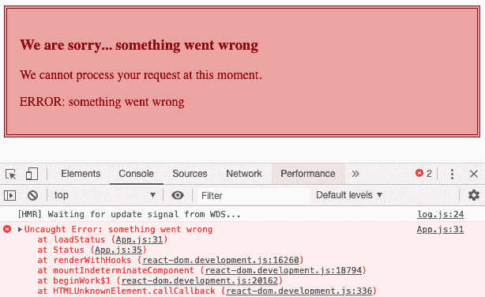
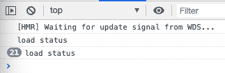
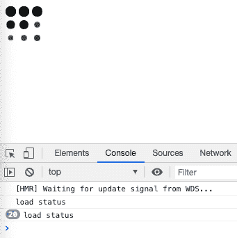

# 第九章：Suspense

这是本书中最不重要的章节。至少，这是 React 团队告诉我们的。他们并没有明确地说，“这是最不重要的章节，不要写它。”他们只是发布了一系列警告教育者和传道者，说他们在这个领域的大部分工作很快就会过时。所有这些都会改变。

可以说，React 团队在 Fiber、Suspense 和并发模式方面的工作代表了 Web 开发的未来。这项工作可能会改变浏览器解释 JavaScript 的方式。听起来相当重要。我们说这是本书中最不重要的章节，因为 Suspense 在社区中的热度很高；我们需要这样说来平衡您的期望。构成 Suspense 的 API 和模式并非定义所有大大小小事务如何运作的单一支配理论。

Suspense 只是一个特性。您可能永远不需要使用它。它被设计来解决 Facebook 在规模上的具体问题。我们并不都面临与 Facebook 相同的问题，因此在将其作为解决方案之前，我们可能需要三思。它们可能会在不必要的地方引入复杂性。而且，所有这些都将会改变。并发模式是一个实验性特性，React 团队已经发出了严厉的警告，不要试图在生产环境中使用它。事实上，大多数涉及 Suspense 的概念都涉及使用钩子。如果您不经常开发自定义钩子，您可能永远不需要了解这些特性。Suspense 的许多机制可以在钩子中进行抽象化。

鉴于这三段话的贬低，本章涵盖的概念是令人兴奋的。如果正确使用，它们可能有助于我们在未来创建更好的用户体验。如果您拥有或维护一个 React 钩子和/或组件库，您可能会发现这些概念很有价值。它们将帮助您调优自定义钩子，以实现更好的反馈和优先级设置。

在本章中，我们将构建另一个小应用程序来演示其中一些特性。本质上，我们将重新构建来自第八章的应用程序，但这次会更有结构。例如，我们将使用一个`SiteLayout`组件：

```
export default function SiteLayout({
  children,
  menu = c => null
}) {
  return (
    <div className="site-container">
      <div>{menu}</div>
      <div>{children}</div>
    </div>
  );
}
```

`SiteLayout`将在`App`组件中被渲染，以帮助我们组合我们的 UI：

```
export default function App() {
  return (
    <SiteLayout menu={<p>Menu</p>}>
      <>
        <Callout>Callout</Callout>
        <h1>Contents</h1>
        <p>This is the main part of the example layout</p>
      </>
    </SiteLayout>
  );
}
```

此组件将用于为我们的布局增添一些样式，如图 9-1 所示。

具体而言，它将使我们能够清楚地看到特定组件何时何地被渲染。


###### 图 9-1。示例布局

# 错误边界

到目前为止，我们在处理错误方面做得还不够好。在组件树中的任何地方抛出错误都会导致整个应用程序崩溃。较大的组件树进一步复杂化了我们的项目，并增加了调试的复杂性。有时候，很难准确定位错误发生的位置，特别是当它们发生在我们没有编写的组件中时。

错误边界是可以用来防止错误崩溃整个应用程序的组件。它们还允许我们在生产环境中渲染合理的错误消息。由于错误可以由单个组件处理，因此它们有可能跟踪应用程序中的错误并将其报告给问题管理系统。

目前，创建错误边界组件的唯一方法是使用类组件。就像本章的大多数主题一样，这种情况也将会改变。将来，可能会通过钩子或其他不需要创建类的解决方案来创建错误边界。现在，这里有一个`ErrorBoundary`组件的示例：

```
import React, { Component } from "react";

export default class ErrorBoundary extends Component {
  state = { error: null };

  static getDerivedStateFromError(error) {
    return { error };
  }

  render() {
    const { error } = this.state;
    const { children, fallback } = this.props;

    if (error) return <fallback error={error} />;
    return children;
  }
}
```

这是一个类组件。它以不同的方式存储状态，并且不使用钩子。相反，它可以访问在组件生命周期中不同时间调用的特定方法。`getDerivedStateFromError`就是其中之一。在渲染过程中的任何`children`中发生错误时，将调用此方法。当发生错误时，将设置`state.error`的值。如果有错误，将渲染`fallback`组件，并将该错误作为属性传递给组件。

现在，我们可以在我们的组件树中使用这个组件来捕获错误，并在发生错误时渲染一个`fallback`组件。例如，我们可以用错误边界包装整个应用程序：

```
function ErrorScreen({ error }) {
  //
  // Here you can handle or track the error before rendering the message
  //

  return (
    <div className="error">
      <h3>We are sorry... something went wrong</h3>
      <p>We cannot process your request at this moment.</p>
      <p>ERROR: {error.message}</p>
    </div>
  );
}

<ErrorBoundary fallback={ErrorScreen}>
  <App />
</ErrorBoundary>;
```

`ErrorScreen`为我们的用户提供了一个友好的消息，说明发生了错误。它渲染了关于错误的一些细节。它还为我们提供了一个可能跟踪整个应用程序中任何地方发生的错误的地方。如果应用程序发生错误，将渲染此组件，而不是黑屏。我们可以通过一些 CSS 使这个组件看起来更漂亮：

```
.error {
  background-color: #efacac;
  border: double 4px darkred;
  color: darkred;
  padding: 1em;
}
```

为了测试这个功能，我们将创建一个可以故意引发错误的组件。`BreakThings`总是会抛出一个错误：

```
const BreakThings = () => {
  throw new Error("We intentionally broke something");
};
```

错误边界可以进行组合。当然，我们将`App`组件包装在`ErrorBoundary`中，但我们也可以将`App`中的各个组件单独包装在`Error`中：

```
  return (
    <SiteLayout
      menu={
        <ErrorBoundary fallback={ErrorScreen}>
          <p>Site Layout Menu</p>
          <BreakThings />
        </ErrorBoundary>
      }
    >
      <ErrorBoundary fallback={ErrorScreen}>
        <Callout>Callout<BreakThings /></Callout>
      </ErrorBoundary>
      <ErrorBoundary fallback={ErrorScreen}>
        <h1>Contents</h1>
        <p>this is the main part of the example layout</p>
      </ErrorBoundary>
    </SiteLayout>
```

每个`ErrorBoundary`在其子组件中的任何地方发生错误时都会渲染一个`fallback`。在这种情况下，我们在菜单和`Callout`中使用了`BreakThings`组件。这将导致渲染`ErrorScreen`两次，正如我们在图 9-2 中所看到的。

我们可以看到 `ErrorBoundaries` 被渲染在原位。请注意，已发生的两个错误已被限制在它们的区域内。这些边界就像墙壁一样，阻止这些错误攻击其余的应用程序。尽管故意抛出了两个错误，但内容仍然正常渲染。


###### 图 9-2\. 错误边界

在 图 9-3 中，我们可以观察当我们将 `BreakThings` 组件移动到仅包含内容时发生了什么。


###### 图 9-3\. 错误

现在我们看到菜单和呼叫被渲染出来，但内容渲染了一个错误以通知用户发生了错误。

在 `ErrorBoundary` 类组件的 `render` 方法中，我们可以将 `fallback` 属性设为可选。当未包含时，我们将简单地使用我们的 `ErrorScreen` 组件：

```
render() {
  const { error } = this.state;
  const { children } = this.props;

  if (error && !fallback) return <ErrorScreen error={error} />;
  if (error) return <fallback error={error} />;

  return children;
}
```

这是处理应用程序中错误的一个好方法。现在，我们只需用 `ErrorBoundary` 包装组件树的特定部分，让组件处理其余部分：

```
<ErrorBoundary>
  <h1>&lt;Contents /&gt;</h1>
  <p>this is the main part of the example layout</p>
  <BreakThings />
</ErrorBoundary>
```

错误边界不仅是一个好主意 —— 它们在生产环境中是必不可少的，它们会防止一些相对不重要的组件中的小错误导致整个应用崩溃。

# 代码拆分

如果您现在处理的应用程序很小，那么它们很可能不会保持现状。您处理的大多数应用程序最终会包含大量的代码库，可能甚至包含数百，甚至数千个组件。您的大多数用户可能通过手机访问您的应用程序，可能在潜在的慢网络上。他们不能等待应用程序的整个代码库成功下载，然后 React 完成第一次渲染。

*代码拆分* 为我们提供了一种将代码库拆分为可管理的块，然后根据需要加载这些块的方法。为了展示代码拆分的强大功能，我们将在我们的应用程序中添加一个用户协议屏幕：

```
export default function Agreement({ onAgree = f => f }) {
  return (
    <div>
      <p>Terms...</p>
      <p>These are the terms and stuff. Do you agree?</p>
      <button onClick={onAgree}>I agree</button>
    </div>
  );
}
```

接下来，我们将将我们代码库的其余部分从名为 `App` 的组件移动到名为 `Main` 的组件，并将该组件放在自己的文件中：

```
import React from "react";
import ErrorBoundary from "./ErrorBoundary";

const SiteLayout = ({ children, menu = c => null }) => {
  return (
    <div className="site-container">
      <div>{menu}</div>
      <div>{children}</div>
    </div>
  );
};

const Menu = () => (
  <ErrorBoundary>
    <p style={{ color: "white" }}>TODO: Build Menu</p>
  </ErrorBoundary>
);

const Callout = ({ children }) => (
  <ErrorBoundary>
    <div className="callout">{children}</div>
  </ErrorBoundary>
);

export default function Main() {
  return (
    <SiteLayout menu={<Menu />}>
      <Callout>Welcome to the site</Callout>
      <ErrorBoundary>
        <h1>TODO: Home Page</h1>
        <p>Complete the main contents for this home page</p>
      </ErrorBoundary>
    </SiteLayout>
  );
}
```

因此，`Main` 是当前网站布局被渲染的地方。现在我们将修改 `App` 组件，以便在用户同意之前渲染 `Agreement`，一旦他们同意，我们将卸载 `Agreement` 组件并渲染 `Main` 网站组件：

```
import React, { useState } from "react";
import Agreement from "./Agreement";
import Main from "./Main";
import "./SiteLayout.css";

export default function App() {
  const [agree, setAgree] = useState(false);

  if (!agree)
    return <Agreement onAgree={() => setAgree(true)} />;

  return <Main />;
}
```

最初，只有 `Agreement` 组件被渲染出来。一旦用户同意，`agree` 的值就会变为 `true`，然后 `Main` 组件被渲染出来。问题在于，`Main` 组件及其所有子组件的所有代码都打包到一个 JavaScript 文件中：捆绑包。这意味着用户必须等待这些代码完全下载后，才能最初渲染 `Agreement` 组件。

我们可以通过使用 `React.lazy` 声明而不是最初导入来推迟加载主组件直到它已经渲染出来：

```
const Main = React.lazy(() => import("./Main"));
```

我们告诉 React 在初始渲染时等待加载`Main`组件的代码库。当它被渲染时，将使用`import`函数在那时导入它。

在运行时导入代码就像从互联网加载任何其他内容一样。首先，JavaScript 代码的请求是挂起状态。然后要么成功，返回一个 JavaScript 文件，要么失败，导致错误发生。正如我们需要通知用户我们正在加载数据的过程一样，我们需要让用户知道我们正在加载代码的过程。

## 介绍：`Suspense`组件

再次发现自己在处理异步请求的情况下。这次，我们有`Suspense`组件来帮助我们。`Suspense`组件的工作方式与`ErrorBoundary`组件类似。我们将它包裹在树中特定的组件周围。当发生错误时，`Suspense`组件不会回退到错误消息，而是在延迟加载发生时渲染加载消息。

我们可以修改应用程序，使用以下代码来延迟加载`Main`组件：

```
import React, { useState, Suspense, lazy } from "react";
import Agreement from "./Agreement";
import ClimbingBoxLoader from "react-spinners/ClimbingBoxLoader";

const Main = lazy(() => import("./Main"));

export default function App() {
  const [agree, setAgree] = useState(false);

  if (!agree)
    return <Agreement onAgree={() => setAgree(true)} />;

  return (
    <Suspense fallback={<ClimbingBoxLoader />}>
      <Main />
    </Suspense>
  );
}
```

现在应用程序初始时只加载`React`的代码库、`Agreement`组件和`ClimbingBoxLoader`。React 将推迟加载`Main`组件的代码库，直到用户同意协议。

`Main`组件已经被包裹在`Suspense`组件中。一旦用户同意协议，我们就开始加载`Main`组件的代码库。因为对该代码库的请求是挂起状态，`Suspense`组件会在加载成功之前渲染`ClimbingBoxLoader`。加载成功后，`Suspense`组件将卸载`ClimbingBoxLoader`并渲染`Main`组件。

###### 注意

React Spinners 是一个动画加载旋转器库，用于指示加载或应用程序运行中的状态。在本章的其余部分，我们将从这个库中尝试不同的加载器组件。确保你安装了这个库：`npm i react-spinners`。

如果在尝试加载`Main`组件之前网络连接断开会发生什么？好吧，我们将面临一个错误。我们可以通过在`Suspense`组件周围包裹`ErrorBoundary`来处理这个问题：

```
<ErrorBoundary fallback={ErrorScreen}>
  <Suspense fallback={<ClimbingBoxLoader />}>
    <Main />
  </Suspense>
</ErrorBoundary>
```

这三个组件的组合为我们处理大多数异步请求提供了一种方法。对于挂起状态，`Suspense`组件将在源代码请求挂起时渲染加载动画。对于失败状态，如果在加载`Main`组件时发生错误，它将被`ErrorBoundary`捕获和处理。甚至对于成功状态，如果请求成功，我们将渲染`Main`组件。

## 使用 Suspense 处理数据

在上一章中，我们构建了一个`useFetch`钩子和一个`Fetch`组件来帮助我们处理在进行 GitHub 请求时涉及的三种状态：挂起、成功和失败。那是我们的解决方案。我们觉得它相当酷。然而，在最后一节中，我们通过优雅地组合`ErrorBoundary`和`Suspense`组件来处理这三种状态。那是为了延迟加载 JavaScript 源代码，但我们可以使用相同的模式来帮助我们加载数据。

假设我们有一个能够渲染某种状态消息的`Status`组件：

```
import React from "react";

const loadStatus = () => "success - ready";

function Status() {
  const status = loadStatus();
  return <h1>status: {status}</h1>;
}
```

这个组件调用`loadStatus`函数来获取当前的状态消息。我们可以在`App`组件中渲染`Status`组件：

```
export default function App() {
  return (
    <ErrorBoundary>
      <Status />
    </ErrorBoundary>
  );
}
```

如果我们按原样运行这段代码，我们将看到我们的成功状态消息，如 Figure 9-4 所示。


###### Figure 9-4\. 成功：一切正常

当我们在`App`组件中渲染`Status`组件时，我们是优秀的 React 开发者，因为我们将`Status`组件包装在错误边界内部。现在如果在加载状态时出现问题，`ErrorBoundary`将退回到默认的错误界面。为了演示这一点，让我们在`loadStatus`函数内部引发一个错误：

```
const loadStatus = () => {
  throw new Error("something went wrong");
};
```

现在当我们运行我们的应用程序时，我们看到了预期的输出。`ErrorBoundary`捕获了我们的错误，并向用户呈现了一条消息（Figure 9-5）。



###### Figure 9-5\. 失败：错误边界触发

到目前为止，一切都按预期工作。我们将`Status`组件组合在`ErrorBoundary`内部，这两个组件的结合处理了三种 Promise 状态中的两种：成功或被拒绝。“被拒绝”是一个表示失败或错误状态的官方 Promise 术语。

我们已经涵盖了三种状态中的两种。第三种状态呢？挂起？这种状态可以通过抛出 Promise 来触发：

```
const loadStatus = () => {
  throw new Promise(resolves => null);
};
```

如果我们从`loadStatus`函数中抛出一个 Promise，我们将在浏览器中看到一种特殊类型的错误（Figure 9-6）。

这个错误告诉我们触发了一个挂起状态，但是树中某个地方没有配置`Suspense`组件。当我们从 React 应用程序中抛出 Promise 时，我们需要一个`Suspense`组件来处理渲染一个回退界面：

```
export default function App() {
  return (
    <Suspense fallback={<GridLoader />}>
      <ErrorBoundary>
        <Status />
      </ErrorBoundary>
    </Suspense>
  );
}
```


###### Figure 9-6\. 抛出 Promise

现在我们有了正确的组件组合来处理所有三种状态。`loadStatus`函数仍然在抛出一个 Promise，但是现在树的更高级别配置了一个`Suspense`组件来处理它。当我们抛出 Promise 时，我们告诉 React 我们正在等待一个挂起的 Promise。React 通过渲染回退的`GridLoader`组件来响应（Figure 9-7）。


###### Figure 9-7\. 网格加载器

当 `loadStatus` 成功返回结果时，我们将按计划渲染 `Status` 组件。如果出现问题（如果 `loadStatus` 抛出错误），我们将通过 `ErrorBoundary` 进行处理。当 `loadStatus` 抛出一个 promise 时，我们会触发挂起状态，由 `Suspense` 组件处理。

这是一个非常酷的模式，但等等……你说的“抛出一个 promise”是什么意思？

## 抛出 Promises

在 JavaScript 中，`throw` 关键字在技术上是用于错误的。你可能在自己的代码中多次使用过它：

```
throw new Error("inspecting errors");
```

这行代码会导致一个错误。当这个错误未被处理时，它会导致整个应用崩溃，正如 图 9-8 中所演示的。


###### 图 9-8\. 抛出一个错误

在浏览器中看到的错误屏幕是 Create React App 的开发模式特性。当你处于开发模式时，未处理的错误会被捕获并直接显示在屏幕上。如果你通过点击右上角的“X”关闭此屏幕，你将看到当出现错误时你的生产用户看到的：什么都没有，一个空白的白屏。

未处理的错误始终会在控制台可见。我们在控制台看到的所有红色文本都是关于我们抛出的错误的信息。

JavaScript 是一门非常自由的语言。它允许我们做很多传统类型语言无法做到的事情。例如，在 JavaScript 中，我们可以抛出任何类型：

```
throw "inspecting errors";
```

在这里，我们抛出了一个字符串。浏览器会告诉我们发生了未捕获的情况，但这不是一个错误（见 图 9-9）。


###### 图 9-9\. GridLoader

这一次，当我们抛出一个字符串时，Create React App 错误屏幕没有在浏览器内渲染。React 知道错误和字符串之间的区别。

JavaScript 允许我们抛出任何类型，这意味着我们可以抛出一个 promise：

```
throw new Promise(resolves => null);
```

现在浏览器告诉我们发生了未捕获的情况。这不是一个错误，而是一个 promise，如 图 9-10 所示。


###### 图 9-10\. 抛出一个 promise

要在 React 组件树中抛出一个 promise，我们首先要在 `loadStatus` 函数中这样做：

```
const loadStatus = () => {
  console.log("load status");
  throw new Promise(resolves => setTimeout(resolves, 3000));
};
```

如果我们在 React 组件内使用这个 `loadStatus` 函数，会抛出一个 promise，然后在树的更高层被 `Suspense` 组件捕获。没错，JavaScript 允许我们抛出任何类型，这也意味着我们可以捕获任何类型。

考虑以下例子：

```
safe(loadStatus);

function safe(fn) {
  try {
    fn();
  } catch (error) {
    if (error instanceof Promise) {
      error.then(() => safe(fn));
    } else {
      throw error;
    }
  }
}
```

我们将 `loadStatus` 函数发送给一个 `safe` 函数，这使得 `safe` 成为一个高阶函数。`loadStatus` 在 `safe` 函数的作用域内成为 `fn`。`safe` 函数尝试调用作为参数传递的 `fn`。在这种情况下，`safe` 尝试调用 `loadStatus`。当它这样做时，`loadStatus` 抛出一个 promise，即三秒钟的延迟。该 promise 立即被捕获，并在 catch 块的作用域内成为 `error`。我们可以检查 `error` 是否是一个 promise，在这种情况下它是。现在我们可以等待该 promise 解决，然后尝试再次用相同的 `loadStatus` 函数调用 `safe`。

当我们使用一个创建导致三秒延迟的 promise 的函数递归调用 `safe` 函数时，我们期望会发生什么？我们得到了一个延迟循环，如 图 9-11 所示。



###### 图 9-11\. 一个不幸的循环

`safe` 函数被调用，promise 被捕获，我们等待三秒钟直到 promise 解决，然后再次用相同的函数调用 `safe`，循环重新开始。每三秒钟，字符串“load status”被打印到控制台。你能观察到这种情况发生的次数，这取决于你的耐心。

我们制作这个无限递归循环并不是为了测试你的耐心；我们是为了证明一个观点。看看当我们将这个新的 `loadStatus` 函数与之前的 `Status` 组件一起使用时会发生什么：

```
const loadStatus = () => {
  console.log("load status");
  throw new Promise(resolves => setTimeout(resolves, 3000));
};

function Status() {
  const status = loadStatus();
  return <h1>status: {status}</h1>;
}

export default function App() {
  return (
    <Suspense fallback={<GridLoader />}>
      <ErrorBoundary>
        <Status />
      </ErrorBoundary>
    </Suspense>
  );
}
```

因为 `loadStatus` 抛出了一个 promise，所以 `GridLoader` 动画会在屏幕上渲染。当你查看控制台时，结果再次测试你的耐心（图 9-12）。



###### 图 9-12\. 悬念递归

我们看到与 `safe` 函数相同的模式。`Suspense` 组件知道 promise 被抛出了。它将渲染 `fallback` 组件。然后 `Suspense` 组件等待抛出的 promise 被解决，就像 `safe` 函数所做的那样。一旦解决，`Suspense` 组件重新渲染 `Status` 组件。当 `Status` 再次渲染时，它调用 `loadStatus`，整个过程重复。我们看到“load status”每三秒钟无休止地被打印到控制台。

通常不期望出现无限循环。对于 React 也是如此。重要的是要知道，当我们抛出一个 promise 时，它会被 `Suspense` 组件捕获，并且我们进入 `pending` 状态，直到 promise 被解决。

## 构建悬念数据源

悬念数据源需要提供一个处理与加载数据相关的所有状态的函数：pending（进行中）、success（成功）和 error（错误）。`loadStatus` 函数每次只能返回或抛出一种类型。当数据正在加载时，我们需要 `loadStatus` 函数抛出一个 promise，当数据成功时返回一个 `response`，或者在出现问题时抛出错误：

```
function loadStatus() {
  if (error) throw error;
  if (response) return response;
  throw promise;
}
```

我们需要一个地方声明 `error`、`response` 和 `promise`。我们还需要确保这些变量的作用域适当，并且不会与其他请求发生冲突。解决方案是使用闭包定义 `loadStatus`：

```
const loadStatus = (function() {
  let error, promise, response;

  return function() {
    if (error) throw error;
    if (response) return response;
    throw promise;
  };
})();
```

这是一个闭包。`error`、`promise` 和 `response` 的作用域从定义它们的函数外部封闭。当我们声明 `loadStatus` 时，一个匿名函数被声明并立即调用：`fn()` 等同于 `(fn)()`。`loadStatus` 的值成为返回的内部函数。现在，`loadStatus` 函数可以访问 `error`、`promise` 和 `response`，但是我们 JavaScript 世界的其余部分无法访问它们。

现在，我们只需要处理 `error`、`response` 和 `promise` 的值。承诺将在三秒钟内挂起，然后成功解决。承诺解决时，`response` 的值将设置为“success”。我们将捕获任何错误或承诺拒绝，并使用它们来设置 `error` 值：

```
const loadStatus = (function() {
  let error, response;
  const promise = new Promise(resolves =>
    setTimeout(resolves, 3000)
  )
    .then(() => (response = "success"))
    .catch(e => (error = e));
  return function() {
    if (error) throw error;
    if (response) return response;
    throw pending;
  };
})();
```

我们创建了一个三秒钟等待的承诺。如果在此期间的任何时候调用 `loadStatus` 函数，承诺本身将被抛出。三秒后，承诺成功解决，`response` 被分配一个值。如果现在调用 `loadStatus`，它将返回响应：“success”。如果出现问题，`loadStatus` 函数将返回 `error`。

`loadStatus` 函数是我们悬念数据源。它能够与悬念架构通信。`loadStatus` 的内部工作是硬编码的。它始终解析相同的三秒延迟承诺。然而，处理 `error`、`response` 和 `promise` 的机制是可重复的。我们可以用这种技术包装任何承诺来生成悬念数据源。

创建悬念数据源所需的全部是一个承诺，因此我们可以创建一个函数，将一个承诺作为参数，并返回一个悬念数据源。在这个例子中，我们称之为 `createResource` 函数：

```
const resource = createResource(promise);
const result = resource.read();
```

此代码假设 `createResource(promise)` 将成功创建一个 `resource` 对象。该对象有一个 `read` 函数，我们可以随意调用 `read` 函数。当承诺解决时，`read` 将返回结果数据。当承诺挂起时，`read` 将抛出 `promise`。如果出现任何问题，`read` 将抛出错误。这个数据源准备好与悬念一起工作。

`createResource` 函数看起来很像我们之前的匿名函数：

```
function createResource(pending) {
  let error, response;
  pending.then(r => (response = r)).catch(e => (error = e));
  return {
    read() {
      if (error) throw error;
      if (response) return response;
      throw pending;
    }
  };
}
```

此函数仍然封闭了 `error` 和 `response` 的值，但允许消费者传入一个名为 `pending` 的承诺作为参数。当挂起的承诺解决时，我们使用 `.then` 函数捕获结果。如果承诺被拒绝，我们将捕获错误并用它来为 `error` 变量分配一个值。

`createResource` 函数返回一个资源对象。该对象包含一个名为 `read` 的函数。如果 promise 仍在等待中，则 `error` 和 `response` 将为未定义状态。因此 `read` 会抛出 promise。在 `error` 有值时调用 `read` 会导致该 `error` 被抛出。最后，在有响应时调用 `read` 将会返回 promise 解析的任何数据。无论我们调用 `read` 多少次，它都能准确报告我们 promise 的状态。

为了在组件中进行测试，我们需要一个 promise，最好是听起来像 80 年代滑雪电影名称的一个 promise：

```
const threeSecondsToGnar = new Promise(resolves =>
  setTimeout(() => resolves({ gnar: "gnarly!" }), 3000)
);
```

`threeSecondsToGnar` promise 在解析前会等待三秒钟，然后返回一个具有 `gnar` 字段和值的对象。让我们使用这个 promise 创建一个 Suspenseful 数据资源，并在一个小的 React 应用程序中使用该数据资源：

```
const resource = createResource(threeSecondsToGnar);

function Gnar() {
  const result = resource.read();
  return <h1>Gnar: {result.gnar}</h1>;
}

export default function App() {
  return (
    <Suspense fallback={<GridLoader />}>
      <ErrorBoundary>
        <Gnar />
      </ErrorBoundary>
    </Suspense>
  );
}
```

React 组件可以渲染很多内容。在 `Gnar` 组件实际返回响应之前，会多次进行渲染。每次渲染 `Gnar` 时，都会调用 `resource.read()`。第一次渲染 `Gnar` 时，会抛出一个 promise。该 promise 由 `Suspense` 组件处理，会渲染一个 `fallback` 组件。

当 promise 解析后，`Suspense` 组件将尝试再次渲染 `Gnar`。`Gnar` 将再次调用 `resource.read()`，但这次假设一切顺利，`resource.read()` 将成功返回 `Gnar`，用于在 `h1` 元素中呈现 `Gnar` 的状态。如果出现问题，`resource.read()` 将会抛出一个错误，该错误将由 `ErrorBoundary` 处理。

正如你可以想象的那样，`createResource` 函数可以变得非常强大。我们的资源可以尝试处理错误。也许在网络错误时，资源可以等待几秒钟，然后自动尝试重新加载数据。我们的资源可以与其他资源进行通信。也许我们可以记录所有资源背后的性能统计数据。天空是极限。只要我们有一个函数可以用来读取资源当前状态，我们可以随心所欲地处理资源本身。

目前，这就是 Suspense 的工作方式。这是我们可以使用 `Suspense` 组件处理任何类型的异步资源的方法。这一切可能会发生变化，而且我们期望它会改变。然而，无论最终的 Suspense API 是什么样子，它肯定会处理三种状态：pending（等待）、success（成功）和 fail（失败）。

对这些 Suspense API 的讨论比较高级，这是有意为之的，因为这些东西还在试验阶段。它会变化。从本章中要记住的重点是，React 总是在尝试各种方法来使 React 应用更快。

在 React 本身工作的背后，有很多这样的工作——特别是其称为 Fiber 的调和算法。

## Fiber

在这本书中，我们把 React 组件称为返回 UI 数据的函数。每当这些数据改变（props、state、远程数据等），我们依赖 React 重新渲染组件。如果我们点击星星来评价一个颜色，我们假设我们的 UI 会改变，而且会发生得很快。我们之所以这样假设，是因为我们信任 React 能够实现这一点。不过，这究竟是如何工作的呢？为了了解 React 如何高效地更新 DOM，让我们仔细看看 React 的工作原理。

想象一下，你正在为公司的博客写一篇文章。你希望得到反馈，所以你在发布之前将文章发送给同事。他们建议做一些快速的更改，现在你需要将这些更改整合进来。你创建了一个全新的文档，从头开始键入整篇文章，然后加入这些编辑内容。

你可能会因为这种不必要的额外工作而叹气，但这是许多库以前的工作方式。为了进行更新，我们会摆脱一切，然后从头开始重建 DOM。

现在，你又在写一篇博客文章，并再次把它发送给你的同事。这一次，你现代化了你的文章撰写过程，采用了 GitHub。你的同事检出了一个 GitHub 分支，进行了更改，并在完成后合并了该分支。更快更高效。

这个过程类似于 React 的工作原理。当发生变化时，React 会将组件树复制为 JavaScript 对象。它寻找需要更改的树的部分，并仅更改这些部分。完成后，复制的树（称为工作中的树）取代现有的树。重申一下，它使用的是树中已经存在的部分。例如，如果我们需要将列表中的项目从 `red` 更新为 `green`：

```
<ul>
  <li>blue</li>
  <li>purple</li>
  <li>red</li>
</ul>
```

React 不会摆脱第三个 `li`，而是将其子节点（`red` 文本）替换为 `green` 文本。这是一种高效的更新方式，也是 React 自从诞生以来更新 DOM 的方式。然而，这里存在一个潜在的问题。更新 DOM 是一项昂贵的任务，因为它是同步的。我们必须等待所有更新完成并渲染后，才能在主线程上执行其他任务。换句话说，我们必须等待 React 递归地遍历所有更新，这可能会导致用户体验显得不够响应。

React 团队的解决方案是对 React 协调算法的全面重写，称为 Fiber。Fiber 在 16.0 版本中发布，通过采用更加异步的方式改写了 DOM 更新的工作方式。16.0 的第一个变化是将渲染器和协调器分离开来。渲染器是处理渲染的库的一部分，而协调器则是管理更新的一部分。

将渲染器与协调器分离是一件大事。协调算法保留在 React 核心中（安装以使用 React 的软件包），每个渲染目标负责自己的渲染。换句话说，ReactDOM、React Native、React 360 等都将负责渲染逻辑，并可以插入到 React 核心的协调算法中。

React Fiber 的另一个重大变化是其对协调算法的改变。还记得我们那些阻塞主线程的昂贵 DOM 更新吗？这些长时间的更新称为*work* —— 使用 Fiber 后，React 将工作分解为称为*fibers*的更小工作单元。一个 fiber 是一个 JavaScript 对象，用于跟踪其正在协调的内容及其更新周期中的位置。

一旦一个 fiber（工作单元）完成，React 就会与主线程通信，以确保没有重要的事情要处理。如果有重要的工作要处理，React 将控制权交给主线程。完成重要工作后，React 将继续其更新。如果主线程没有需要跳转的重要工作，React 将继续处理下一个工作单元，并将这些更改渲染到 DOM 中。

以先前的 GitHub 示例为例，每个 fiber 代表分支上的一个提交，当我们将分支检入主分支时，这表示更新的 DOM 树。通过将更新工作分解为块，Fiber 允许优先任务立即由主线程处理。其结果是用户体验更为响应。

如果只有这些，Fiber 已经是一项成功的工作了，但事实并非如此！除了将工作分解为更小单元的性能优势外，重写还为未来设定了令人兴奋的可能性。Fiber 提供了优先处理更新的基础设施。从长远来看，开发者甚至可以调整默认设置，并决定哪些类型的任务应该优先处理。对工作单元进行优先处理的过程称为*scheduling*；这一概念为实验性的并发模式打下了基础，最终将允许这些工作单元并行执行。

对于在生产环境中使用 React，了解 Fiber 并非至关重要，但重写其协调算法提供了有趣的洞察力，深入了解 React 的工作原理以及其贡献者对未来的思考。
