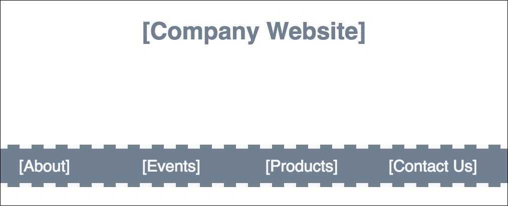

# 第十一章：React 路由器

当网络开始时，大多数网站由一系列用户可以通过请求和打开单独文件来浏览的页面组成。当前文件或资源的位置在浏览器的位置栏中列出。浏览器的前进和后退按钮将按预期工作。书签内容深入到网站将允许用户保存对特定文件的引用，该文件可以在用户请求时重新加载。在基于页面或服务器渲染的网站上，浏览器的导航和历史功能都能按预期工作。

在单页面应用程序中，所有这些功能变得棘手。记住，在单页面应用程序中，所有内容都发生在同一个页面上。JavaScript 正在加载信息并改变用户界面。像浏览器历史记录、书签以及前进和后退按钮这样的功能，如果没有路由解决方案将无法正常工作。*路由*是定义客户端请求端点的过程。^(1) 这些端点与浏览器的位置和历史对象结合使用。它们用于标识请求的内容，以便 JavaScript 可以加载和渲染适当的用户界面。

与 Angular、Ember 或 Backbone 不同，React 没有标准的路由器。认识到路由解决方案的重要性，工程师 Michael Jackson 和 Ryan Florence 创建了一个名为 React Router 的简单路由器。React Router 已被社区广泛接受为 React 应用程序的热门路由解决方案。^(2) 它被包括 Uber、Zendesk、PayPal 和 Vimeo 在内的公司使用。^(3)

在本章中，我们将介绍 React 路由器，并利用其功能来处理客户端的路由。

# 整合路由器

为了展示 React Router 的功能，我们将建立一个经典的起始网站，包括关于我们、事件、产品和联系我们等部分。尽管这个网站会感觉像有多个页面，但实际上只有一个——它是一个 SPA，即单页面应用程序（见图 11-1）。



###### 图 11-1\. 带有链接导航的简单网站

这个网站的站点地图包括主页、每个部分的页面，以及处理 404 未找到错误的错误页面（见图 11-2）。


###### 图 11-2\. 带有本地链接的站点地图

路由器将允许我们为网站的每个部分设置路由。每个*路由*都是可以输入到浏览器位置栏的终点。当请求某个路由时，我们可以渲染适当的内容。

首先，让我们安装 React Router 和 React Router DOM。React Router DOM 用于使用 DOM 的常规 React 应用程序。如果您正在编写一个 React Native 应用程序，您将使用`react-router-native`。我们将安装这些包的实验版本，因为在本打印时，React Router 6 尚未正式发布。一旦发布，您可以在没有这些标记的情况下使用这些包。

```
npm install react-router@experimental react-router-dom@experimental
```

我们还需要一些占位符组件来代表站点地图中的每个部分或页面。我们可以从名为*pages.js*的单个文件中导出这些组件：

```
import React from "react";

export function Home() {
  return (
    <div>
      <h1>[Company Website]</h1>
    </div>
  );
}

export function About() {
  return (
    <div>
      <h1>[About]</h1>
    </div>
  );
}

export function Events() {
  return (
    <div>
      <h1>[Events]</h1>
    </div>
  );
}

export function Products() {
  return (
    <div>
      <h1>[Products]</h1>
    </div>
  );
}

export function Contact() {
  return (
    <div>
      <h1>[Contact]</h1>
    </div>
  );
}
```

在这些页面被填充出来后，我们需要调整*index.js*文件。我们将不再渲染`App`组件，而是渲染`Router`组件。`Router`组件将当前位置的信息传递给任何嵌套在其中的子组件。`Router`组件应该只用一次，并放在我们组件树的根附近：

```
import React from "react";
import { render } from "react-dom";
import App from "./App";

import { BrowserRouter as Router } from "react-router-dom";

render(
  <Router>
    <App />
  </Router>,
  document.getElementById("root")
);
```

注意，我们正在导入`BrowserRouter as Router`。接下来我们需要做的是设置我们的路由配置。我们将把这些放在*App.js*文件中。用于渲染任何我们想要的路由的包装组件叫做`Routes`。在`Routes`内部，我们将为每个想要渲染的页面使用`Route`组件。我们还想从*./pages.js*文件中导入所有页面：

```
import React from "react";
import { Routes, Route } from "react-router-dom";
import {
  Home,
  About,
  Events,
  Products,
  Contact
} from "./pages";

function App() {
  return (
    <div>
      <Routes>
        <Route path="/" element={<Home />} />
        <Route
          path="/about"
          element={<About />}
        />
        <Route
          path="/events"
          element={<Events />}
        />
        <Route
          path="/products"
          element={<Products />}
        />
        <Route
          path="/contact"
          element={<Contact />}
        />
      </Routes>
    </div>
  );
}
```

这些路由告诉 Router 当窗口位置改变时渲染哪个组件。每个`Route`组件都有`path`和`element`属性。当浏览器的位置匹配`path`时，将显示`element`。当位置为`/`时，路由将渲染`Home`组件。当位置为`/products`时，路由将渲染`Products`组件。

在这一点上，我们可以运行应用程序，并在浏览器的位置栏中直接输入路由，观察内容的变化。例如，输入*http://localhost:3000/about*到位置栏，观察`About`组件的渲染。

期望用户通过在位置栏中键入路由来导航网站可能不太现实。`react-router-dom`提供了一个`Link`组件，我们可以用它来创建浏览器链接。

让我们修改主页，以包含一个导航菜单，每个路由都有一个链接：

```
import { Link } from "react-router-dom";

export function Home() {
  return (
    <div>
      <h1>[Company Website]</h1>
      <nav>
        <Link to="about">About</Link>
        <Link to="events">Events</Link>
        <Link to="products">Products</Link>
        <Link to="contact">Contact Us</Link>
      </nav>
    </div>
  );
}
```

现在用户可以通过点击链接从主页访问每个内部页面。浏览器的返回按钮将带他们回到主页。

# Router 属性

React Router 会将属性传递给它渲染的组件。例如，我们可以通过一个属性获取当前位置。让我们使用当前位置来帮助我们创建一个 404 未找到组件。首先，我们将创建这个组件：

```
export function Whoops404() {
  return (
    <div>
      <h1>Resource not found</h1>
    </div>
  );
}
```

然后我们将在*App.js*中的路由配置中添加这个。如果我们访问一个不存在的路由，比如`highway`，我们希望显示`Whoops404`组件。我们将使用`*`作为路径值，组件作为元素：

```
function App() {
  return (
    <div>
      <Routes>
        <Route path="/" element={<Home />} />
        <Route
          path="/about"
          element={<About />}
        />
        <Route
          path="/events"
          element={<Events />}
        />
        <Route
          path="/products"
          element={<Products />}
        />
        <Route
          path="/contact"
          element={<Contact />}
        />
        <Route path="*" element={<Whoops404 />} />
      </Routes>
    </div>
  );
}
```

现在，如果我们访问 *localhost:3000/highway*，我们将看到 404 页面组件的渲染。我们还可以通过使用位置值显示我们访问的路由的值。由于我们生活在一个具有 React Hooks 的世界中，因此有一个钩子可以做到这一点。在 `Whoops404` 组件中，创建一个名为 `location` 的变量，返回当前位置的值（即关于您正在导航到哪个页面的属性）。然后使用 `location.pathname` 的值来显示正在访问的路由：

```
export function Whoops404() {
  let location = useLocation();
  console.log(location);
  return (
    <div>
      <h1>
        Resource not found at {location.pathname}
      </h1>
    </div>
  );
}
```

如果记录 `location`，可以进一步探索该对象。

本节介绍了实现和使用 React Router 的基础知识。`Router` 只使用一次，并包装所有将使用路由的组件。所有 `Route` 组件都需要包装在一个 `Routes` 组件中，该组件根据当前窗口的位置选择要渲染的组件。可以使用 `Link` 组件来便捷导航。这些基础知识可以让你走得很远，但只是揭开了路由器功能的表面。

## 嵌套路由

`Route` 组件与应仅在匹配特定 URL 时显示的内容一起使用。这个特性使我们能够将我们的 Web 应用程序组织成优雅的层次结构，促进内容的重用。

有时，当用户浏览我们的应用程序时，我们希望保持一些 UI 不变。在过去，诸如页面模板和主页面之类的解决方案已帮助 Web 开发人员重用 UI 元素。

让我们考虑一个简单的入门网站。我们可能想为 `About` 页面创建子页面，用于显示额外的内容。当用户选择 About 部分时，他们应默认到该部分下的 Company 页面。大纲如下：

+   主页

    +   **关于公司**

        +   **公司（默认）**

        +   **历史**

        +   **服务**

        +   **位置**

    +   事件

    +   产品

    +   联系我们

+   404 错误页面

我们需要创建的新路由将反映这种层次结构：

+   *http://localhost:3000/*

    +   *http://localhost:3000/about*

        +   *http://localhost:3000/about*

        +   *http://localhost:3000/about/history*

        +   *http://localhost:3000/about/services*

        +   *http://localhost:3000/about/location*

    +   *http://localhost:3000/events*

    +   *http://localhost:3000/products*

    +   *http://localhost:3000/contact*

+   *http://localhost:3000/hot-potato*

我们还需要记住为我们的新部分 `Company`、`Services`、`History` 和 `Location` 创建存根占位符组件。例如，这是 `Services` 组件的一些文本示例，您可以重用它们：

```
export function Services() {
  <section>
    <h2>Our Services</h2>
    <p>
      Lorem ipsum dolor sit amet, consectetur
      adipiscing elit. Integer nec odio. Praesent
      libero. Sed cursus ante dapibus diam. Sed
      nisi. Nulla quis sem at nibh elementum
      imperdiet. Duis sagittis ipsum. Praesent
      mauris. Fusce nec tellus sed augue semper
      porta. Mauris massa. Vestibulum lacinia arcu
      eget nulla. Class aptent taciti sociosqu ad
      litora torquent per conubia nostra, per
      inceptos himenaeos. Curabitur sodales ligula
      in libero.
    </p>
  </section>;
}
```

创建了这些组件后，我们可以从 *App.js* 文件开始配置路由器。如果您想使用路由创建页面层次结构，只需将 `Route` 组件嵌套在彼此内部即可：

```
import {
  Home,
  About,
  Events,
  Products,
  Contact,
  Whoops404,
  Services,
  History,
  Location
} from "./pages";

function App() {
  return (
    <div>
      <Routes>
        <Route path="/" element={<Home />} />
        <Route path="about" element={<About />}>
          <Route
            path="services"
            element={<Services />}
          />

          <Route
            path="history"
            element={<History />}
          />
          <Route
            path="location"
            element={<Location />}
          />
        </Route>
        <Route
          path="events"
          element={<Events />}
        />
        <Route
          path="products"
          element={<Products />}
        />
        <Route
          path="contact"
          element={<Contact />}
        />
        <Route path="*" element={<Whoops404 />} />
      </Routes>
    </div>
  );
}
```

一旦您使用 About `Route` 组件包装了嵌套路由，您可以访问这些页面。如果您打开 *http://localhost:3000/about/history*，您将只看到 `About` 页面的内容，但是 `History` 组件不会显示。为了使其显示，我们将使用 React Router DOM 的另一个功能：`Outlet` 组件。`Outlet` 将允许我们渲染这些嵌套组件。我们只需将它放在任何我们想要渲染子内容的地方。

在 *pages.js* 的 `About` 组件中，我们将在 `<h1>` 下添加这个：

```
import {
  Link,
  useLocation,
  Outlet
} from "react-router-dom";

export function About() {
  return (
    <div>
      <h1>[About]</h1>
      <Outlet />
    </div>
  );
}
```

现在这个 `About` 组件将在整个部分中被重复使用，并且会显示嵌套的组件。位置会告诉应用程序应该渲染哪个子部分。例如，当位置是 *http://localhost:3000/about/history* 时，`History` 组件将被渲染在 `About` 组件内部。

# 使用重定向

有时您希望将用户从一个路由重定向到另一个路由。例如，我们可以确保如果用户尝试通过 *http://localhost:3000/services* 访问内容，他们将被重定向到正确的路由：*http://localhost:3000/about/services*。

让我们修改我们的应用程序以包含重定向，以确保用户可以访问正确的内容：

```
import {
  Routes,
  Route,
  Redirect
} from "react-router-dom";

function App() {
  return (
    <div>
      <Routes>
        <Route path="/" element={<Home />} />
        // Other Routes
        <Redirect
          from="services"
          to="about/services"
        />
      </Routes>
    </div>
  );
}
```

`Redirect` 组件允许我们将用户重定向到特定路由。

在生产应用程序中更改路由时，用户仍然会尝试通过旧路由访问旧内容。这通常是由于书签引起的。`Redirect` 组件为我们提供了一种方法，即使用户通过旧书签访问我们的站点，也能加载适当的内容。

在本节中，我们使用 `Route` 组件创建了一个路由配置。如果您喜欢这种结构，请随意忽略下一节，但我们希望确保您知道如何以不同的方式创建路由配置。还可以使用钩子 `useRoutes` 来配置应用程序的路由。

如果我们想重构我们的应用程序以使用 `useRoutes`，我们将在 `App` 组件（或任何设置路由的地方）进行调整。让我们重新设计它：

```
import { useRoutes } from "react-router-dom";

function App() {
  let element = useRoutes([
    { path: "/", element: <Home /> },
    {
      path: "about",
      element: <About />,
      children: [
        {
          path: "services",
          element: <Services />
        },
        { path: "history", element: <History /> },
        {
          path: "location",
          element: <Location />
        }
      ]
    },
    { path: "events", element: <Events /> },
    { path: "products", element: <Products /> },
    { path: "contact", element: <Contact /> },
    { path: "*", element: <Whoops404 /> },
    {
      path: "services",
      redirectTo: "about/services"
    }
  ]);
  return element;
}
```

官方文档将配置称为 `element`，但您可以选择任何您喜欢的名称来称呼它。使用这种语法是完全可选的。`Route` 是 `useRoutes` 的包装器，因此无论如何您都在使用它。选择最适合您的语法和样式！

## 路由参数

React Router 的另一个有用功能是设置 *路由参数* 的能力。路由参数是从 URL 中获取值的变量。它们在数据驱动的 Web 应用程序中非常有用，用于过滤内容或管理显示偏好。

让我们重新审视颜色组织器，并通过添加使用 React Router 选择并显示一种颜色的功能来改进它。当用户通过点击选择颜色时，应用程序应该渲染该颜色并显示其 `title` 和 `hex` 值。

使用路由器，我们可以通过 URL 获取颜色 ID。例如，这是我们将使用的 URL 来显示颜色“lawn”，因为 lawn 的 ID 被传递在 URL 中：

```
http://localhost:3000/58d9caee-6ea6-4d7b-9984-65b145031979
```

首先，让我们在*index.js*文件中设置路由器。我们将导入`Router`并包装`App`组件：

```
import { BrowserRouter as Router } from "react-router-dom";

render(
  <Router>
    <App />
  </Router>,
  document.getElementById("root")
);
```

包装`App`将路由器的所有属性传递给组件及其内部的任何其他组件。从那里开始设置路由配置。我们将使用`Routes`和`Route`组件而不是`useRoutes`，但请记住，如果您更喜欢该语法，这始终是一个选项。首先导入`Routes`和`Route`：

```
import { Routes, Route } from "react-router-dom";
```

然后将其添加到`App`。这个应用将有两个路由：`ColorList`和`ColorDetails`。我们还没有建立`ColorDetails`，但是让我们先引入它：

```
import { ColorDetails } from "./ColorDetails";

export default function App() {
  return (
    <ColorProvider>
      <AddColorForm />
      <Routes>
        <Route
          path="/"
          element={<ColorList />}
        />
        <Route
          path=":id"
          element={<ColorDetails />}
        />
      </Routes>
    </ColorProvider>
  );
}
```

`ColorDetails`组件将根据颜色的`id`动态显示。让我们在名为*ColorDetails.js*的新文件中创建`ColorDetails`组件。首先，它将是一个占位符：

```
import React from "react";

export function ColorDetails() {
  return (
    <div>
      <h1>Details</h1>
    </div>
  );
}
```

我们如何知道这是否有效？检查的最简单方法是打开 React 开发者工具并找到正在渲染的颜色之一的`id`。如果您尚未拥有颜色，请添加一个并查看其`id`。一旦您有了`id`，您可以将其附加到`localhost:3000`的 URL 中。例如，`localhost:3000/00fdb4c5-c5bd-4087-a48f-4ff7a9d90af8`。

现在，您应该看到`ColorDetails`页面出现了。现在我们知道路由器和我们的路由正在工作，但是我们希望它更加动态化。在`ColorDetails`页面上，我们希望根据 URL 中找到的`id`显示正确的颜色。为此，我们将使用`useParams`钩子：

```
import { useParams } from "react-router-dom";

export function ColorDetails() {
  let params = useParams();
  console.log(params);
  return (
    <div>
      <h1>Details</h1>
    </div>
  );
}
```

如果我们记录`params`，我们将看到这是一个包含路由器上可用任何参数的对象。我们将解构此对象以获取`id`，然后我们可以使用该`id`在`colors`数组中找到正确的颜色。让我们使用我们的`useColors`钩子来实现这一点：

```
import { useColors } from "./";

export function ColorDetails() {
  let { id } = useParams(); // destructure id

  let { colors } = useColors();

  let foundColor = colors.find(
    color => color.id === id
  );
  console.log(foundColor);

  return (
    <div>
      <h1>Details</h1>
    </div>
  );
}
```

记录`foundColor`会显示我们已经找到了正确的颜色。现在我们只需要在组件中显示关于该颜色的数据：

```
export function ColorDetails() {
  let { id } = useParams();
  let { colors } = useColors();

  let foundColor = colors.find(
    color => color.id === id
  );

  return (
    <div>
      <div
        style={{
          backgroundColor: foundColor.color,
          height: 100,
          width: 100
        }}
      ></div>
      <h1>{foundColor.title}</h1>
      <h1>{foundColor.color}</h1>
    </div>
  );
}
```

我们希望为颜色组织者添加的另一个功能是，通过单击列表中的颜色来导航到`ColorDetails`页面的能力。让我们将此功能添加到`Color`组件中。当我们单击组件时，我们将使用另一个名为`useNavigate`的路由器钩子来打开详细页面。我们首先从`react-router-dom`中导入它：

```
import { useNavigate } from "react-router-dom";
```

然后，我们将调用`useNavigate`，它将返回一个函数，我们可以用它来导航到另一个页面：

```
let navigate = useNavigate();
```

现在在`section`中，我们将添加一个`onClick`处理程序，以便根据颜色的`id`导航到路由：

```
let navigate = useNavigate();

return (
  <section
    className="color"
    onClick={() => navigate(`/${id}`)}
  >
    // Color component
  </section>
);
```

现在，当我们单击`section`时，我们将被路由到正确的页面。

路由参数是获取影响用户界面呈现数据的理想工具。但是，只有在希望用户在 URL 中捕获这些细节时才应使用它们。例如，在颜色组织者的情况下，用户可以向其他用户发送特定颜色或按特定字段排序的所有颜色的链接。用户还可以将这些链接加为书签，以返回特定数据。

在本章中，我们回顾了 React Router 的基本用法。在下一章中，我们将学习如何在服务器上使用路由。

^(1) Express.js 文档，[“基本路由”](https://oreil.ly/jD1HC)。

^(2) 该项目在 [GitHub](https://oreil.ly/ThNG9) 上已被星标超过 20,000 次。

^(3) 参见 [“使用 React Router 的网站”](https://oreil.ly/staEF)。
