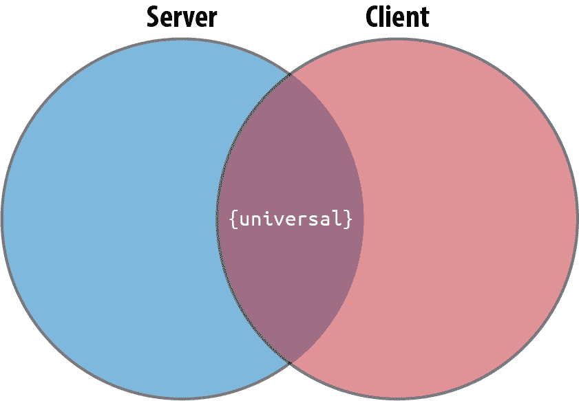

# 第十二章：React 和服务器

到目前为止，我们已经用 React 构建了完全在浏览器中运行的小型应用程序。它们在浏览器中收集数据并使用浏览器存储保存数据。这是有道理的，因为 React 是一个视图层；它的目的是渲染 UI。然而，大多数应用程序至少需要某种形式的后端存在，我们需要了解如何以服务器为重心来构建应用程序。

即使您的客户端应用程序完全依赖云服务作为后端，您仍然需要获取并发送数据到这些服务。应该在特定的地方进行这些交易，并且有助于处理与 HTTP 请求相关的延迟的库。

另外，React 可以*同构地*渲染，这意味着它可以在浏览器之外的平台上运行。这意味着我们可以在将 UI 发送到浏览器之前在服务器上呈现我们的 UI。利用服务器渲染，我们可以提高应用程序的性能、可移植性和安全性。

我们从比较同构和普遍主义的差异开始这一章，并探讨这两个概念如何与 React 相关联。接下来，我们将看看如何使用通用 JavaScript 制作同构应用程序。最后，我们将通过添加服务器并首先在服务器上呈现 UI 来改进颜色组织者。

# 同构与通用的区别

*同构*和*通用*这两个术语经常用来描述在客户端和服务器上都可以工作的应用程序。尽管这些术语可以互换使用来描述同一应用程序，但它们之间有一个微妙的差别值得探讨。*同构*应用程序是可以在多个平台上渲染的应用程序。*通用*代码意味着完全相同的代码可以在多个环境中运行。^(1)

Node.js 将允许我们在其他应用程序（如服务器、CLI 甚至原生应用程序）中重用我们在浏览器中编写的相同代码。让我们来看看一些通用的 JavaScript：

```
const userDetails = response => {
  const login = response.login;
  console.log(login);
};
```

`printNames` 函数是通用的。完全相同的代码可以在浏览器或服务器上调用。这意味着如果我们使用 Node.js 构建服务器，我们可以在这两个环境之间重新使用代码。通用 JavaScript 是指可以在服务器或浏览器上运行而不出错的 JavaScript（见图 12-1）。



###### 图 12-1。客户端和服务器域

## 客户端和服务器域

服务器和客户端是完全不同的领域，因此我们所有的 JavaScript 代码不会自动在它们之间工作。让我们看看如何在浏览器中创建 AJAX 请求：

```
fetch("https://api.github.com/users/moonhighway")
  .then(res => res.json())
  .then(console.log);
```

在这里，我们正在向 GitHub API 发出 fetch 请求，将响应转换为 JSON，然后在 JSON 结果上调用一个函数来解析它。

然而，如果我们尝试在 Node.js 中运行完全相同的代码，我们会得到一个错误：

```
fetch("https://api.github.com/users/moonhighway")
^

ReferenceError: fetch is not defined
at Object.<anonymous> (/Users/eveporcello/Desktop/index.js:7:1)
at Module.\_compile (internal/modules/cjs/loader.js:1063:30)
at Object.Module.\_extensions..js (internal/modules/cjs/loader.js:1103:10)
at Module.load (internal/modules/cjs/loader.js:914:32)
at Function.Module.\_load (internal/modules/cjs/loader.js:822:14)
at Function.Module.runMain (internal/modules/cjs/loader.js:1143:12)
at internal/main/run_main_module.js:16:11
```

这个错误是因为 Node.js 没有像浏览器那样内置的`fetch`函数。在 Node.js 中，我们可以使用 npm 中的`isomorphic-fetch`，或者使用内置的`https`模块。由于我们已经使用了`fetch`语法，让我们集成`isomorphic-fetch`：

```
npm install isomorphic-fetch
```

然后我们只需导入`isomorphic-fetch`，代码无需更改：

```
const fetch = require("isomorphic-fetch");

const userDetails = response => {
  const login = response.login;
  console.log(login);
};

fetch("https://api.github.com/users/moonhighway")
  .then(res => res.json())
  .then(userDetails);
```

使用 Node.js 从 API 加载数据需要使用核心模块。这需要不同的代码。在这些示例中，`userDetails`函数是通用的，因此相同的函数可以在两种环境中使用。

此 JavaScript 文件现在是同构的。它包含通用的 JavaScript。所有代码都不是通用的，但文件本身将在两种环境中工作。可以在 Node.js 中运行它，或者将其包含在浏览器的`<script>`标签中。

让我们来看看`Star`组件。这个组件是通用的吗？

```
function Star({
  selected = false,
  onClick = f => f
}) {
  return (
    <div
      className={
        selected ? "star selected" : "star"
      }
      onClick={onClick}
    ></div>
  );
}
```

当然可以；记住，JSX 编译为 JavaScript。`Star`组件只是一个简单的函数：

```
function Star({
  selected = false,
  onClick = f => f
}) {
  return React.createElement("div", {
    className: selected
      ? "star selected"
      : "star",
    onClick: onClick
  });
}
```

我们可以直接在浏览器中渲染此组件，或者在不同的环境中渲染并捕获 HTML 输出为字符串。`ReactDOM`有一个`renderToString`方法，我们可以用它来将 UI 渲染为 HTML 字符串：

```
// Renders html directly in the browser
ReactDOM.render(<Star />);

// Renders html as a string
let html = ReactDOM.renderToString(<Star />);
```

我们可以构建同构应用程序，在不同平台上渲染组件，并且可以以一种方式设计这些应用程序，以便在多个环境中重用 JavaScript 代码。此外，我们还可以使用其他语言（如 Go 或 Python）来构建同构应用程序——我们不限于 Node.js。

# 服务器端渲染 React

使用`ReactDOM.renderToString`方法允许我们在服务器上渲染 UI。服务器功能强大，可以访问各种浏览器无法访问的资源。服务器可以安全地访问并获取安全数据。通过在服务器上首次渲染初始内容，可以利用所有这些额外的优势。

我们将要服务端渲染的应用程序是我们在第五章中构建的 Recipes 应用程序。你可以运行 Create React App 并将此代码放置在*index.js*文件的内容之上：

```
import React from "react";
import ReactDOM from "react-dom";
import "./index.css";
import { Menu } from "./Menu";

const data = [
  {
    name: "Baked Salmon",
    ingredients: [
      {
        name: "Salmon",
        amount: 1,
        measurement: "lb"
      },
      {
        name: "Pine Nuts",
        amount: 1,
        measurement: "cup"
      },
      {
        name: "Butter Lettuce",
        amount: 2,
        measurement: "cups"
      },
      {
        name: "Yellow Squash",
        amount: 1,
        measurement: "med"
      },
      {
        name: "Olive Oil",
        amount: 0.5,
        measurement: "cup"
      },
      {
        name: "Garlic",
        amount: 3,
        measurement: "cloves"
      }
    ],
    steps: [
      "Preheat the oven to 350 degrees.",
      "Spread the olive oil around a glass baking dish.",
      "Add the yellow squash and place in the oven for 30 mins.",
      "Add the salmon, garlic, and pine nuts to the dish.",
      "Bake for 15 minutes.",
      "Remove from oven. Add the lettuce and serve."
    ]
  },
  {
    name: "Fish Tacos",
    ingredients: [
      {
        name: "Whitefish",
        amount: 1,
        measurement: "l lb"
      },
      {
        name: "Cheese",
        amount: 1,
        measurement: "cup"
      },
      {
        name: "Iceberg Lettuce",
        amount: 2,
        measurement: "cups"
      },
      {
        name: "Tomatoes",
        amount: 2,
        measurement: "large"
      },
      {
        name: "Tortillas",
        amount: 3,
        measurement: "med"
      }
    ],
    steps: [
      "Cook the fish on the grill until hot.",
      "Place the fish on the 3 tortillas.",
      "Top them with lettuce, tomatoes, and cheese."
    ]
  }
];

ReactDOM.render(
  <Menu
    recipes={data}
    title="Delicious Recipes"
  />,
  document.getElementById("root")
);
```

这些组件将存放在一个名为*Menu.js*的新文件中：

```
function Recipe({ name, ingredients, steps }) {
  return (
    <section
      id={name.toLowerCase().replace(/ /g, "-")}
    >
      <h1>{name}</h1>
      <ul className="ingredients">
        {ingredients.map((ingredient, i) => (
          <li key={i}>{ingredient.name}</li>
        ))}
      </ul>
      <section className="instructions">
        <h2>Cooking Instructions</h2>
        {steps.map((step, i) => (
          <p key={i}>{step}</p>
        ))}
      </section>
    </section>
  );
}

export function Menu({ title, recipes }) {
  return (
    <article>
      <header>
        <h1>{title}</h1>
      </header>
      <div className="recipes">
        {recipes.map((recipe, i) => (
          <Recipe key={i} {...recipe} />
        ))}
      </div>
    </article>
  );
}
```

在整本书中，我们在客户端渲染了组件。客户端渲染通常是构建应用程序时我们会首先使用的方法。我们提供 Create React App 的*build*文件夹，浏览器运行 HTML 并调用*script.js*文件以加载任何 JavaScript。

这样做可能会耗费时间。用户可能需要等待几秒钟才能看到任何加载，这取决于他们的网络速度。使用带有 Express 服务器的 Create React App，我们可以创建客户端和服务器端渲染的混合体验。

我们正在渲染一个`Menu`组件，用于显示几个菜谱。这个应用程序的第一个变更是使用`ReactDOM.hydrate`而不是`ReactDOM.render`。

这两个函数相同，除了使用`hydrate`将内容添加到由`ReactDOMServer`渲染的容器中。操作顺序如下所示：

1.  渲染应用程序的静态版本，允许用户看到发生了某些事情并且页面已经“加载”。

1.  发出对动态 JavaScript 的请求。

1.  用动态内容替换静态内容。

1.  用户点击某物并且它起作用。

我们正在对服务器端渲染后的应用程序进行重新水合作。通过重新水合作，我们指的是将内容静态加载为静态 HTML，然后加载 JavaScript。这允许用户体验到感知性能。他们将看到页面上正在发生的事情，这使他们希望留在页面上。

接下来，我们需要设置项目的服务器，我们将使用 Express，一个轻量级的 Node 服务器。首先安装它：

```
npm install express
```

然后我们将创建一个名为 *server* 的服务器文件夹，并在其中创建一个名为 *index.js* 的文件。此文件将构建一个服务器，将提供 *build* 文件夹，但还将预加载一些静态 HTML 内容：

```
import express from "express";
const app = express();

app.use(express.static("./build"));
```

这会导入并静态提供 *build* 文件夹。接下来，我们想要使用 `ReactDOM` 中的 `renderToString` 将应用程序呈现为静态 HTML 字符串：

```
import React from "react";
import ReactDOMServer from "react-dom/server";
import { Menu } from "../src/Menu.js";

const PORT = process.env.PORT || 4000;

app.get("/*", (req, res) => {
  const app = ReactDOMServer.renderToString(
    <Menu />
  );
});

app.listen(PORT, () =>
  console.log(
    `Server is listening on port ${PORT}`
  )
);
```

我们将把 `Menu` 组件传递给此函数，因为这是我们想要静态渲染的内容。然后，我们想要从构建的客户端应用程序中读取静态 *index.html* 文件，将应用程序的内容注入到 `div` 中，并将其作为响应发送给请求：

```
app.get("/*", (req, res) => {
  const app = ReactDOMServer.renderToString(
    <Menu />
  );

  const indexFile = path.resolve(
    "./build/index.html"
  );

  fs.readFile(indexFile, "utf8", (err, data) => {
    return res.send(
      data.replace(
        '<div id="root"></div>',
        `<div id="root">${app}</div>`
      )
    );
  });
});
```

完成后，我们需要对 webpack 和 Babel 进行一些配置。请记住，Create React App 可以处理编译和构建，但我们需要在服务器项目中设置和强制执行不同的规则。

首先安装一些依赖项（好的，很多依赖项）：

```
npm install @babel/core @babel/preset-env babel-loader nodemon npm-run-all
webpack webpack-cli webpack-node-externals
```

安装了 Babel 后，让我们创建一个包含一些预设的 `.babelrc`：

```
{
  "presets": ["@babel/preset-env", "react-app"]
}
```

你将添加 `react-app` 因为项目使用了 Create React App，并且已经安装好了。

接下来，添加一个名为 *webpack.server.js* 的服务器 webpack 配置文件：

```
const path = require("path");
const nodeExternals = require("webpack-node-externals");

module.exports = {
  entry: "./server/index.js",
  target: "node",
  externals: [nodeExternals()],
  output: {
    path: path.resolve("build-server"),
    filename: "index.js"
  },
  module: {
    rules: [
      {
        test: /\.js$/,
        use: "babel-loader"
      }
    ]
  }
};
```

babel-loader 会按预期转换 JavaScript 文件，并且 `nodeExternals` 会扫描 *node_modules* 文件夹中所有 `node_modules` 名称。然后，它将构建一个外部函数，告诉 webpack 不要捆绑这些模块或任何子模块。

此外，您可能会遇到 webpack 错误，因为安装的版本与 Create React App 安装的版本之间存在冲突。要解决冲突，只需在项目的根目录添加一个 *.env* 文件，并添加以下内容：

```
SKIP_PREFLIGHT_CHECK=true
```

最后，我们可以添加几个额外的 npm 脚本来运行我们的开发命令：

```
{
  "scripts": {
    //...
    "dev:build-server": "NODE_ENV=development webpack --config webpack.server.js
 --mode=development -w",
    "dev:start": "nodemon ./server-build/index.js",
    "dev": "npm-run-all --parallel build dev:*"
  }
}
```

1.  `dev:build-server`: 将 `development` 作为环境变量传递，并使用新的服务器配置运行 `webpack`。

1.  `dev:start`: 使用 `nodemon` 运行服务器文件，它将监听任何更改。

1.  `dev`: 并行运行两个进程。

现在当我们运行 `npm run dev` 时，这两个进程都会运行。您应该能够在 `localhost:4000` 上看到应用程序正在运行。当应用程序运行时，内容将按顺序加载，首先作为预渲染的 HTML，然后加载 JavaScript 打包文件。

使用这样的技术可以意味着更快的加载时间，并将提升用户的感知性能。用户期望页面加载时间在两秒或更短，任何性能改进都可能意味着用户选择使用您的网站还是跳转到竞争对手。

# 使用 Next.js 进行服务器渲染

另一个在服务器渲染生态系统中强大且广泛使用的工具是 Next.js。Next 是由 Zeit 发布的开源技术，旨在帮助工程师更轻松地编写服务器渲染的应用程序。这包括直观的路由功能、静态优化、自动分割等特性。在下一节中，我们将更详细地介绍如何使用 Next.js 在我们的应用程序中启用服务器渲染。

首先，我们将创建一个全新的项目，运行以下命令：

```
mkdir project-next
cd project-next
npm init -y
npm install --save react react-dom next
mkdir pages
```

然后，我们将创建一些 npm 脚本，以便更轻松地运行常见命令：

```
{
  //...
  "scripts": {
    "dev": "next",
    "build": "next build",
    "start": "next start"
  }
}
```

在*pages*文件夹中，我们将创建一个*index.js*文件。我们将编写我们的组件，但不用担心导入 React 或 ReactDOM。相反，我们只需编写一个组件：

```
export default function Index() {
  return (
    <div>
      <p>Hello everyone!</p>
    </div>
  );
}
```

一旦我们创建了这个，我们可以运行`npm run dev`来查看页面运行在`localhost:3000`。它将显示预期的组件。

你还会注意到屏幕右下角有一个小闪电符号。将鼠标悬停在上面将显示一个按钮，上面写着`Prerendered Page`。点击它将带您进入关于静态优化指示器的文档。这意味着页面符合自动静态优化的标准，即可以预渲染。没有数据需求会阻塞它。如果页面自动静态优化（这听起来有点复杂，但非常实用！），加载速度更快，因为不需要服务器端的工作。页面可以从 CDN 流式传输，提供超快的用户体验。您不必做任何操作即可获得这种性能增强。

如果页面确实有数据需求怎么办？如果页面无法预渲染怎么办？为了探讨这个问题，让我们将我们的应用程序变得更加健壮，并构建一个组件，从 API 获取一些远程数据。在一个名为*Pets.js*的新文件中：

```
export default function Pets() {
  return <h1>Pets!</h1>;
}
```

首先，我们将渲染一个`h1`。现在我们可以访问`localhost:3000/pets`，看到我们的页面现在加载在那个路由上。这很好，但我们可以通过添加链接和布局组件来改进这一点，该组件将显示每个页面的正确内容。我们将创建一个可以在两个页面上使用的头部，并显示链接：

```
import Link from "next/link";

export default function Header() {
  return (
    <div>
      <Link href="/">
        <a>Home</a>
      </Link>
      <Link href="/pets">
        <a>Pets</a>
      </Link>
    </div>
  );
}
```

`Link`组件是一种包装器，围绕着一些链接。这些看起来类似于我们使用 React Router 创建的链接。我们还可以为每个`<a>`标签添加样式：

```
const linkStyle = {
  marginRight: 15,
  color: "salmon"
};

export default function Header() {
  return (
    <div>
      <Link href="/">
        <a style={linkStyle}>Home</a>
      </Link>
      <Link href="/pets">
        <a style={linkStyle}>Pets</a>
      </Link>
    </div>
  );
}
```

接下来，我们将把`Header`组件整合到一个名为*Layout.js*的新文件中。这将根据正确的路由动态显示组件：

```
import Header from "./Header";

export function Layout(props) {
  return (
    <div>
      <Header />
      {props.children}
    </div>
  );
}
```

`Layout` 组件将接收 props 并在组件下方显示任何额外的内容在 `Header` 下方。然后，在每个页面中，当渲染时可以创建可以传递给 `Layout` 组件的内容块。例如，*index.js* 文件现在看起来是这样的：

```
import Layout from "./Layout";

export default function Index() {
  return (
    <Layout>
      <div>
        <h1>Hello everyone!</h1>
      </div>
    </Layout>
  );
}
```

我们将在 *Pets.js* 文件中执行相同的操作：

```
import Layout from "./Layout";

export default function Pets() {
  return (
    <Layout>
      <div>
        <h1>Hey pets!</h1>
      </div>
    </Layout>
  );
}
```

现在，如果我们访问首页，我们应该看到页眉，然后当我们点击 `Pets` 链接时，我们应该看到 Pets 页面。

当我们点击右下角的闪电按钮时，我们会注意到这些页面仍在预渲染。这是可以预期的，因为我们继续渲染静态内容。让我们使用 Pets 页面加载一些数据，看看这如何改变。

首先，我们将像在本章开头那样安装 `isomorphic-unfetch`：

```
npm install isomorphic-unfetch
```

我们将使用此功能从 Pet Library API 进行获取调用。首先，在 *Pages.js* 文件中导入它：

```
import fetch from "isomorphic-unfetch";
```

然后，我们将添加一个名为 `getInitialProps` 的函数。这将处理获取和加载数据：

```
Pets.getInitialProps = async function() {
  const res = await fetch(
    `http://pet-library.moonhighway.com/api/pets`
  );
  const data = await res.json();
  return {
    pets: data
  };
};
```

当我们将数据作为 `pets` 的值返回时，我们可以在组件中对数据进行映射。

调整组件以映射 `pets` 属性：

```
export default function Pets(props) {
  return (
    <Layout>
      <div>
        <h1>Pets!</h1>
        <ul>
          {props.pets.map(pet => (
            <li key={pet.id}>{pet.name}</li>
          ))}
        </ul>
      </div>
    </Layout>
  );
}
```

如果组件中存在 `getInitialProps`，Next.js 将根据每个请求渲染页面。这意味着页面将以服务器端渲染的方式呈现，而不是静态预渲染，因此每个请求都将使用 API 中的最新数据。

一旦我们对应用程序的状态感到满意，我们可以使用 `npm run build` 运行构建。Next.js 关注性能，因此它将为我们每个文件的存在的千字节数提供完整的详细信息。这是对异常大文件的快速检查。

在每个文件旁边，我们将看到一个图标，指示站点在运行时是否是服务器端渲染（λ），自动呈现为 HTML（○），或自动生成为静态 HTML + JSON（●）。

一旦您构建了应用程序，您可以部署它。Next.js 是 Zeit 的开源产品，一个云托管提供商，因此使用 Zeit 进行部署的体验是最直接的。但是，您可以使用许多不同的托管提供商来部署您的应用程序。

总结一下，在开始构建自己的应用程序时，理解一些重要的术语是很重要的：

CSR（客户端端渲染）

在浏览器中呈现应用程序，通常使用 DOM。这就是我们在未修改的 Create React App 中所做的事情。

SSR（服务器端渲染）

将客户端或通用应用程序呈现为服务器上的 HTML。

再水合作用

在客户端加载 JavaScript 视图以重用服务器渲染的 HTML 的 DOM 树和数据。

预渲染

在构建时运行客户端应用程序并捕获静态 HTML 的初始状态。

# Gatsby

另一个基于 React 的流行站点生成器是 Gatsby。 Gatsby 作为创建内容驱动网站的简单方式正在全球流行。 它旨在提供更智能的默认设置来管理性能、可访问性、图像处理等问题。 如果你正在阅读这本书，很可能在某个时候你会参与一个 Gatsby 项目！

Gatsby 用于各种项目，但通常用于构建内容驱动的网站。 换句话说，如果你有一个博客或静态内容，Gatsby 是一个很好的选择，特别是现在你了解了 React。 Gatsby 还可以处理来自 API 的动态内容、与框架的集成等。

在本节中，我们将开始构建一个快速的 Gatsby 站点来演示其工作原理。 基本上，我们将构建我们的小型 Next.js 应用作为一个 Gatsby 应用程序：

```
npm install -g gatsby-cli
gatsby new pets
```

如果你全局安装了 yarn，命令行界面会询问你是否使用 yarn 还是 npm。 两者都可以。 然后你会进入*pets*文件夹：

```
cd pets
```

现在你可以使用`gatsby develop`启动项目。 当你访问`localhost:8000`时，你将看到你的 Gatsby 起始站点正在运行。 现在你可以开始浏览文件。

如果你打开项目的*src*文件夹，你会看到三个子文件夹：*components*、*images*和*pages*。

在*pages*文件夹内，你会找到一个*404.js*错误页面，一个*index.js*页面（访问`localhost:8000`时渲染的页面），以及一个*page-2.js*，用于呈现第二页的内容。

如果你访问*components*文件夹，这就是 Gatsby 的魔力所在。 还记得我们在 Next.js 中构建了`Header`和`Layout`组件吗？ 这两个组件已经作为模板在*components*文件夹中创建了。

一些特别有趣的事情需要注意：

*layout.js*

这包含了`Layout`组件。 它使用`useStaticQuery`钩子来通过 GraphQL 查询关于站点的一些数据。

*seo.js*

这个组件让我们能够访问页面的元数据，用于搜索引擎优化。

如果你向*pages*文件夹添加额外的页面，这将在你的站点上添加额外的页面。让我们试试，在*pages*文件夹中添加一个*page-3.js*文件。然后我们将在该文件中添加以下代码来快速创建一个页面：

```
import React from "react";
import { Link } from "gatsby";

import Layout from "../components/layout";
import SEO from "../components/seo";

const ThirdPage = () => (
  <Layout>
    <SEO title="Page three" />
    <h1>Hi from the third page</h1>
    <Link to="/">Go back to the homepage</Link>
  </Layout>
);

export default ThirdPage;
```

我们将使用`Layout`组件来包装内容，以便它显示为`children`。 `Layout`不仅显示动态内容，而且一旦我们创建它，页面就会自动生成。

这只是你可以使用 Gatsby 做的一小部分，但我们会为你留下一些关于其额外功能的信息：

静态内容

你可以将站点构建为静态文件，这些文件可以在没有服务器的情况下部署。

CDN 支持

可以将你的站点缓存在全球各地的 CDN 上，以提高性能和可用性。

响应式和渐进式图像

Gatsby 将图像加载为模糊的占位符，然后淡入完整的资源。这种策略，由 Medium 推广，允许用户在完整资源可用之前看到正在渲染的内容。

预取链接页面

在你点击下一个链接之前，加载下一页所需的所有内容将在后台加载。

所有这些功能和更多功能都用于确保无缝的用户体验。Gatsby 已经为你做出了许多决定。这可能是好事或坏事，但这些限制旨在让你专注于你的内容。

# 未来的 React

尽管 Angular、Ember 和 Vue 在 JavaScript 生态系统中仍然拥有大量市场份额，但很难否认 React 目前是构建 JavaScript 应用程序最广泛使用和具有影响力的库。除了库本身，更广泛的 JavaScript 社区，特别是通过 Next.js 和 Gatsby 所体现的，已经将 React 作为首选工具。

那么我们接下来该怎么做呢？我们鼓励你利用这些技能来构建自己的项目。如果你想要构建移动应用程序，可以尝试使用 React Native。如果你想要声明式地获取数据，可以尝试使用 GraphQL。如果你想要构建基于内容的网站，可以深入了解 Next.js 和 Gatsby。

你可以选择多种途径，但是你在 React 中掌握的这些技能将在你着手构建自己的应用程序时发挥作用。在这个过程中，我们希望这本书能成为你的参考和基础。尽管 React 及其相关库几乎肯定会发生变化，但这些是你可以立即放心使用的稳定工具。使用 React 和功能性、声明式 JavaScript 构建应用程序非常有趣，我们迫不及待地想看到你将会构建什么。

^(1) Gert Hengeveld，[“同构 vs 通用 JavaScript”](https://oreil.ly/i70W2)，Medium。
