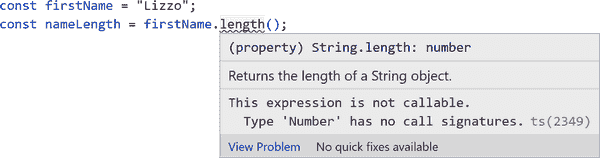
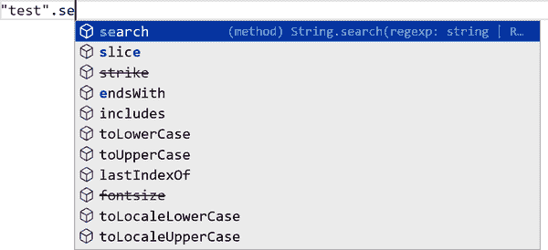
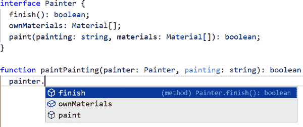
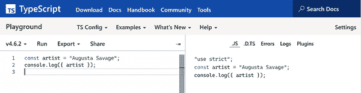

# 第一章：从 JavaScript 到 TypeScript

> 当前 JavaScript
> 
> 支持浏览器数十年
> 
> 网页的美丽

在谈论 TypeScript 之前，我们需要先了解它来自哪里：JavaScript！

# JavaScript 的历史

JavaScript 由 Brendan Eich 在 1995 年在 Netscape 设计完成，旨在为网站提供一种易于接近和使用的语言。开发者们从那时起就在调侃其怪癖和被认为的缺点。我将在下一节中介绍其中的一些。

自 1995 年以来，JavaScript 已经发展得非常迅猛！它的主导委员会 TC39 自 2015 年以来每年发布 ECMAScript 的新版本——JavaScript 所基于的语言规范，这些新特性使其与其他现代语言保持一致。令人印象深刻的是，即使有定期发布的新语言版本，JavaScript 在各种环境中，包括浏览器、嵌入式应用和服务器运行时，几十年来仍然保持向后兼容性。

今天，JavaScript 是一门极具灵活性和众多优点的语言。人们应该赞赏 JavaScript 虽然有其特 quirks，但也帮助推动了 Web 应用和互联网的令人难以置信的增长。

> 给我展示一个完美的编程语言，我会告诉你一个没有用户的语言。
> 
> Anders Hejlsberg，TSConf 2019

# 原生 JavaScript 的缺点

开发者经常使用没有任何重要语言扩展或框架的 JavaScript 作为“原生”：这是指它作为熟悉的原始版本。我很快会介绍 TypeScript 是如何恰到好处地解决这些主要问题的，但了解它们为何会令人痛苦也是有益的。所有这些缺点在项目变得越来越大和更长寿时会更加显著。

## 自由的代价

许多开发者对 JavaScript 的最大抱怨之一，不幸的是这也是它的关键特性之一：JavaScript 几乎没有限制你如何结构化你的代码。这种自由让人在 JavaScript 中启动一个项目非常有趣！

然而，随着文件越来越多，自由的破坏性也变得越来越明显。从某些虚构的绘画应用程序中提取出来的下面这段代码片段就是一个典型例子，没有上下文支持：

```
function paintPainting(painter, painting) {
  return painter
    .prepare()
    .paint(painting, painter.ownMaterials)
    .finish();
}
```

在没有任何上下文的情况下阅读该代码，你只能对如何调用 `paintPainting` 函数有模糊的想法。也许如果你在周围的代码库中工作过，你可能会记得 `painter` 应该是某个 `getPainter` 函数返回的内容。你甚至可能会幸运地猜到 `painting` 是一个字符串。

即使这些假设是正确的，稍后对代码的更改可能会使它们失效。也许 `painting` 从字符串更改为其他数据类型，或者可能会有一个或多个画家的方法被重命名。

其他语言可能会拒绝运行代码，如果它们的编译器确定它可能会崩溃。动态类型的语言——例如 JavaScript，运行代码时不会事先检查是否可能会崩溃。

代码的自由性让 JavaScript 用起来很有趣，但当您希望在运行代码时获得安全性时，这成为一个真正的痛点。

## 松散的文档

JavaScript 语言规范中没有任何内容可以正式描述代码中函数参数、函数返回值、变量或其他结构的含义。许多开发人员采用了一个称为 JSDoc 的标准，使用块注释来描述函数和变量。JSDoc 标准描述了如何编写直接放置在函数和变量等结构上方的文档注释，并以标准方式格式化。这里有一个例子，同样摘自上下文：

```
/**
 * Performs a painter painting a particular painting.
 *
 * @param {Painting} painter
 * @param {string} painting
 * @returns {boolean} Whether the painter painted the painting.
 */
function paintPainting(painter, painting) { /* ... */ }
```

JSDoc 存在一些关键问题，这些问题经常使得在大型代码库中使用它变得不愉快：

+   没有什么可以阻止 JSDoc 描述与代码不符。

+   即使您的 JSDoc 描述以前是正确的，在代码重构过程中，可能很难找到所有与您的更改相关的现在无效的 JSDoc 注释。

+   描述复杂对象笨拙且冗长，需要多个独立的注释来定义类型及其关系。

维护十几个文件中的 JSDoc 注释不会花费太多时间，但在数百甚至数千个不断更新的文件中进行维护可能是一项真正的苦差事。

## 更弱的开发工具

因为 JavaScript 没有提供内置方法来识别类型，并且代码很容易偏离 JSDoc 注释，因此难以自动化地进行大规模的更改或获得关于代码库的见解。JavaScript 开发人员经常会对像 C# 和 Java 这样的类型语言中的特性感到惊讶，这些特性允许开发人员执行类成员重命名或跳转到声明参数类型的位置。

###### 注意

您可能会抗议说现代 IDE（如 VS Code）提供了一些开发工具，例如自动重构到 JavaScript。没错，但是：它们在大多数 JavaScript 代码中使用 TypeScript 或等效语言，在性能和可靠性上不如在良好定义的 TypeScript 代码中。

# TypeScript！

TypeScript 在 2010 年代初期在 Microsoft 内部创建，然后于 2012 年发布并开源。其开发负责人是 Anders Hejlsberg，他也负责开发流行的 C# 和 Turbo Pascal 语言。TypeScript 通常被描述为“JavaScript 的超集”或“带类型的 JavaScript”。但是 TypeScript 到底是什么呢？

TypeScript 是四个东西：

编程语言

一种语言，包括所有现有的 JavaScript 语法，以及用于定义和使用类型的新的 TypeScript 特定语法

类型检查器

一个接受 JavaScript 和/或 TypeScript 编写的一组文件的程序，开发对所有创建的结构（变量、函数等）的理解，并告知您是否认为任何设置不正确

编译器

运行类型检查器的程序，报告任何问题，然后输出等效的 JavaScript 代码

语言服务

一个使用类型检查器告知诸如 VS Code 等编辑器如何为开发人员提供有用工具的程序

# 在 TypeScript Playground 入门

到现在为止，您已经阅读了大量关于 TypeScript 的内容。让我们开始编写它吧！

TypeScript 的主要网站在 [*https://www.typescriptlang.org/play*](https://www.typescriptlang.org/play) 包含一个“Playground”编辑器。您可以在主编辑器中输入代码，并查看与在本地使用完整集成开发环境（IDE）时相同的许多编辑器建议。

本书中大多数片段都故意足够小且自包含，以便您可以在 Playground 中输入它们并进行乐趣调整。

## TypeScript 实战

看看这段代码片段：

```
const firstName = "Georgia";
const nameLength = firstName.length();
//                           ~~~~~~
// This expression is not callable.
```

该代码使用普通的 JavaScript 语法编写——我还没有介绍 TypeScript 特定的语法。如果您对此代码运行 TypeScript 类型检查器，它会利用其知识，即字符串的 `length` 属性是一个数字而不是函数，从而向您显示在注释中所示的投诉。

如果您将该代码粘贴到 playground 或编辑器中，语言服务会在 `length` 下面放置一个小红波浪线，表示 TypeScript 对您的代码不满意。悬停在这段波浪线下面会显示投诉的文本（图 1-1）。



###### 图 1-1\. TypeScript 报告字符串长度不可调用的错误

当您键入时，在编辑器中即时发现这些简单错误要比等到特定行代码运行并抛出错误要愉快得多。如果您尝试在 JavaScript 中运行该代码，它会崩溃！

## 通过限制获得自由

TypeScript 允许我们指定参数和变量可以提供的值的类型。有些开发人员最初会觉得在代码中明确写出特定区域如何工作是一种限制。

但是！我认为以这种方式“受限制”实际上是件好事！通过将我们的代码限制为只能按照您指定的方式使用，TypeScript 可以让您确信代码中的更改不会破坏其他使用它的代码区域。

例如，如果您更改了函数的必需参数数量，TypeScript 将在您忘记更新调用该函数的地方时提醒您。

在下面的例子中，`sayMyName` 从接收两个参数更改为接收一个参数，但调用它时传递了两个字符串，并因此触发了 TypeScript 的投诉：

```
// Previously: sayMyName(firstName, lastNameName) { ...
function sayMyName(fullName) {
  console.log(`You acting kind of shady, ain't callin' me ${fullName}`);
}

sayMyName("Beyoncé", "Knowles");
//                   ~~~~~~~~~
// Expected 1 argument, but got 2.
```

该代码在 JavaScript 中不会崩溃运行，但其输出与预期不同（不包括 `"Knowles"`）：

```
You acting kind of shady, ain't callin' me Beyoncé
```

调用函数时使用错误数量的参数正是 TypeScript 限制的短视 JavaScript 自由的一种体现。

## 精确的文档

让我们看一下之前的`paintPainting`函数的 TypeScript 版本。尽管我还没有详细介绍用于记录类型的 TypeScript 语法，但以下代码片段仍然暗示了 TypeScript 可以精确记录代码的能力：

```
interface Painter {
  finish(): boolean;
  ownMaterials: Material[];
  paint(painting: string, materials: Material[]): boolean;
}

function paintPainting(painter: Painter, painting: string): boolean { /* ... */ }
```

第一次阅读此代码的 TypeScript 开发人员可以理解`painter`至少有三个属性，其中两个是方法。通过嵌入描述对象“形状”的语法，TypeScript 提供了一个出色的、强制性的系统，用于描述对象的外观。

## 更强大的开发人员工具

TypeScript 的类型允许诸如 VS Code 之类的编辑器更深入地了解您的代码。它们可以利用这些见解在您输入时提供智能建议。这些建议对开发非常有用。

如果您以前使用 VS Code 编写 JavaScript，您可能已经注意到，当您使用内置对象类型（如字符串）编写代码时，它会建议“自动完成”。例如，如果您开始输入已知为字符串的某个成员，TypeScript 可以建议所有字符串的成员（图 1-2）。



###### 图 1-2。TypeScript 为字符串提供 JavaScript 中的自动完成建议

当您为了理解代码添加 TypeScript 的类型检查器时，即使是您编写的代码，它也可以为您提供这些有用的建议。在`paintPainting`函数中键入`painter.`时，TypeScript 会知道`painter`参数的类型是`Painter`，而`Painter`类型具有以下成员（图 1-3）。



###### 图 1-3。TypeScript 为字符串提供 JavaScript 中的自动完成建议

太棒了！我将在第十二章，“使用 IDE 功能”中介绍大量其他有用的编辑器功能。

## 编译语法

TypeScript 的编译器允许我们输入 TypeScript 语法，进行类型检查，并获得等效的 JavaScript 输出。作为一种便利，编译器还可以将现代 JavaScript 语法编译成其较旧的 ECMAScript 等效形式。

如果您将此 TypeScript 代码粘贴到 Playground 中：

```
const artist = "Augusta Savage";
console.log({ artist });
```

Playground 会在屏幕右侧显示，编译器输出的等效 JavaScript 代码（图 1-4）。



###### 图 1-4。TypeScript Playground 将 TypeScript 代码编译成等效的 JavaScript

TypeScript Playground 是展示源 TypeScript 如何变成输出 JavaScript 的绝佳工具。

###### 注意

许多 JavaScript 项目使用专门的转译器，如 Babel ([*https://babeljs.io*](https://babeljs.io))，而不是 TypeScript 自己的转译器来将源代码转译为可运行的 JavaScript。你可以在 [*https://learningtypescript.com/starters*](https://learningtypescript.com/starters) 上找到常见项目启动器的列表。

# 在本地开始

只要你的计算机安装了 Node.js，就可以在计算机上运行 TypeScript。要全局安装最新版本的 TypeScript，请运行以下命令：

```
npm i -g typescript
```

现在，你可以通过 `tsc`（**T**ype**S**cript **C**ompiler）命令在命令行上运行 TypeScript。尝试使用 `--version` 标志确保它已正确设置：

```
tsc --version
```

它应该输出类似 `Version X.Y.Z` 的东西——安装 TypeScript 时的当前版本：

```
$ tsc --version
Version 4.7.2
```

## 本地运行

现在 TypeScript 已安装好，让我们在本地设置一个文件夹来运行 TypeScript 代码。在你的计算机上的任意位置创建一个文件夹，并运行以下命令来创建一个新的 *tsconfig.json* 配置文件：

```
tsc --init
```

*tsconfig.json* 文件声明了 TypeScript 在分析你的代码时使用的设置。在这本书中，文件中的大多数选项对你来说并不重要（编程中存在许多罕见的边界案例，语言需要考虑到这些情况！）。我会在 第十三章，“配置选项” 中进行讲解。现在的重要功能是你现在可以运行 `tsc` 命令来告诉 TypeScript 编译该文件夹中的所有文件，并且 TypeScript 将参考 *tsconfig.json* 文件中的任何配置选项。

尝试添加一个名为 *index.ts* 的文件，其中包含以下内容：

```
console.blub("Nothing is worth more than laughter.");
```

然后，运行 `tsc` 并提供 *index.ts* 文件的名称：

```
tsc index.ts
```

你应该会得到一个类似以下的错误：

```
index.ts:1:9 - error TS2339: Property 'blub' does not exist on type 'Console'.

1 console.blub("Nothing is worth more than laughter.");
          ~~~~

Found 1 error.
```

的确，在 `console` 上不存在 `blub`。我当时在想什么呢？

在你修复代码以符合 TypeScript 要求之前，请注意，`tsc` 为你创建了一个名为 *index.js* 的文件，其中包含了 `console.blub`。

###### 注意

这是一个重要的概念：尽管我们的代码中存在 *类型错误*，但 *语法* 仍然完全有效。TypeScript 编译器仍将从输入文件生成 JavaScript，而不管是否存在任何类型错误。

修正 *index.ts* 中的代码以调用 `console.log` 并再次运行 `tsc`。在你的终端中应该没有任何投诉，并且 *index.js* 文件现在应包含更新后的输出代码：

```
console.log("Nothing is worth more than laughter.");
```

###### 提示

我强烈建议在阅读过程中与书中的代码片段进行互动，可以在 playground 中或者带 TypeScript 支持的编辑器中运行它们。这意味着它会为你运行 TypeScript 语言服务。书中还提供了一些小型的自包含练习和更大的项目，帮助你练习所学的内容，你可以在 [*https://learningtypescript.com*](https://learningtypescript.com) 上找到这些资源。

## 编辑器功能

创建 *tsconfig.json* 文件的另一个好处是，当编辑器打开到特定文件夹时，它们现在将识别该文件夹为 TypeScript 项目。例如，如果你在一个文件夹中打开 VS Code，则用于分析你的 TypeScript 代码的设置将尊重该文件夹 *tsconfig.json* 中的内容。

作为一个练习，回顾本章中的代码片段，并在编辑器中输入它们。当你输入时，你应该看到下拉列表建议为名称（特别是 `console` 上的 `log`）完成。

非常激动人心：你正在使用 TypeScript 语言服务帮助自己编写代码！你正在成为一名 TypeScript 开发者的路上！

###### 提示

VS Code 提供了出色的 TypeScript 支持，它本身就是用 TypeScript 构建的。你不一定非要用它来写 TypeScript——几乎所有现代编辑器都具有出色的 TypeScript 支持，无论是内置的还是通过插件提供的——但我建议至少在阅读本书时尝试一下 TypeScript。如果你使用不同的编辑器，我也建议启用其 TypeScript 支持。我将更深入地介绍编辑器功能，见第十二章，“使用 IDE 功能”。

# TypeScript 的非所是

现在你已经看到 TypeScript 有多么美妙了，我必须警告你一些局限性。每种工具都在某些领域表现出色，在其他方面则有局限性。

## 治愈糟糕代码的良方

TypeScript 帮助你组织你的 JavaScript，但除了强制类型安全外，它不会对这种结构有任何看法。

好！

TypeScript 是一种每个人都应该能够使用的语言，而不是针对特定目标受众的主观框架。你可以使用 JavaScript 中习惯的任何架构模式编写代码，TypeScript 将支持它们。

如果有人告诉你 TypeScript 强制使用类，或者使得编写良好代码变得困难，或者对其他任何代码风格抱怨，给他们一个严厉的眼神，并告诉他们去买一本《学习 TypeScript》。TypeScript 不强制代码风格的看法，比如是否使用类或函数，也不与任何特定的应用框架（如 Angular、React 等）相关联。

## JavaScript 的扩展（主要是）

TypeScript 的设计目标明确指出它应该：

+   与当前和未来的 ECMAScript 提议保持一致

+   保留所有 JavaScript 代码的运行时行为

TypeScript 并不试图改变 JavaScript 的工作方式。它的创造者们非常努力地避免添加新的代码功能，这些功能可能会增加或与 JavaScript 冲突。这样的任务是 TC39 的领域，即负责 ECMAScript 的技术委员会。

TypeScript 中有一些较早的功能，多年前添加以反映 JavaScript 代码中的常见用例。这些功能大多数情况下要么相对不常见，要么已经不再流行，并且仅在 第十四章，“语法扩展” 中简要介绍。我建议在大多数情况下远离它们。

###### 注意

截至 2022 年，TC39 正在研究向 JavaScript 添加类型注解的语法。最新的提议将它们作为不影响运行时代码的一种形式的注释，仅用于开发时系统，如 TypeScript。将来多年内，JavaScript 可能会添加类型注释或其等效物，因此本书中不会进一步提到。

## 比 JavaScript 慢

在互联网上有时您可能会听到一些有主观看法的开发者抱怨 TypeScript 在运行时比 JavaScript 慢。这种说法通常是不准确和误导性的。TypeScript 对代码的唯一更改是，如果要求它将您的代码编译成早期版本的 JavaScript 以支持旧的运行时环境，如 Internet Explorer 11。许多生产框架根本不使用 TypeScript 的编译器，而是使用单独的工具进行转译（编译的部分，将源代码从一种编程语言转换为另一种）并且仅用 TypeScript 进行类型检查。

TypeScript 确实会增加编译代码的时间。大多数环境（如浏览器和 Node.js）在运行 TypeScript 代码之前，必须将其编译成 JavaScript。大多数构建管道通常设置为性能损失可以忽略不计，而较慢的 TypeScript 功能（如分析代码以检测可能的错误）是独立于生成可运行应用程序代码文件的。

###### 注意

即使看起来允许直接运行 TypeScript 代码的项目，如 ts-node 和 Deno，在运行之前也会将 TypeScript 代码内部转换为 JavaScript。

## 结束进化

Web 的进化还远未结束，因此 TypeScript 也未成熟。TypeScript 语言不断接收 bug 修复和功能增强，以满足 Web 社区不断变化的需求。本书中学到的 TypeScript 的基本原则大致保持不变，但错误消息、更复杂的功能和编辑器集成将随时间改进。

事实上，虽然本书的这个版本是基于 TypeScript 4.7.2 发布的，但当您开始阅读时，我们可以肯定已经发布了更新版本。本书中的一些 TypeScript 错误消息甚至可能已经过时！

# 摘要

在本章中，您将了解 JavaScript 的一些主要弱点的背景，TypeScript 的作用以及如何开始使用 TypeScript：

+   JavaScript 的简短历史

+   JavaScript 的缺点：昂贵的自由、松散的文档和较弱的开发工具

+   TypeScript 是什么：一种编程语言，类型检查器，编译器和语言服务

+   TypeScript 的优势：通过限制获得自由，精确的文档和更强大的开发者工具

+   开始在 TypeScript Playground 和本地计算机上编写 TypeScript 代码

+   TypeScript 并非什么：修复糟糕代码的药方，JavaScript 的扩展（大多数情况下），比 JavaScript 更慢，或者已经完全进化完毕。

###### 提示

当你完成阅读本章之后，请在[*https://learningtypescript.com/from-javascript-to-typescript*](https://learningtypescript.com/from-javascript-to-typescript)上练习你学到的内容。

> 如果你在运行 TypeScript 编译器时发现错误会发生什么？
> 
> 你最好去`catch`它们！
