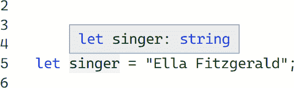
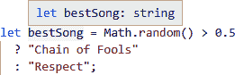

# 第二章：类型系统

> JavaScript 的能力
> 
> 来自于灵活性
> 
> 要小心！

我在第一章，“从 JavaScript 到 TypeScript”中简要谈到了 TypeScript 中存在的“类型检查器”，它查看您的代码，理解它的预期工作方式，并告诉您可能出错的地方。但是类型检查器真正是如何工作的呢？

# 类型包含什么？

“类型”描述了 JavaScript 值的*形状*可能是什么。通过“形状”，我的意思是一个值上存在哪些属性和方法，以及内置`typeof`操作符如何描述它。

例如，当你创建一个初始值为`"Aretha"`的变量时：

```
let singer = "Aretha";
```

TypeScript 可以推断，或者说可以找出，`singer`变量是*string*类型。

TypeScript 中最基本的类型对应于 JavaScript 中七种基本类型的一种：

+   `null`

+   `undefined`

+   `boolean` // `true`或`false`

+   `string` // `""`, `"Hi!"`, `"abc123"`, …

+   `number` // `0`, `2.1`, `-4`, …

+   `bigint` // `0n`, `2n`, `-4n`, …

+   `symbol` // `Symbol()`, `Symbol("hi")`, …

对于这些值中的每一个，TypeScript 理解值的类型是七种基本原始类型之一：

+   `null; // null`

+   `undefined; // undefined`

+   `true; // boolean`

+   `"Louise"; // string`

+   `1337; // number`

+   `1337n; // bigint`

+   `Symbol("Franklin"); // symbol`

如果你忘记了原始类型的名称，你可以在[TypeScript Playground](https://typescriptlang.org/play)或 IDE 中将一个具有原始值的`let`变量输入，并将鼠标悬停在变量名上。结果弹出窗将包括原始类型的名称，例如这个屏幕截图显示悬停在一个字符串变量上（见图 2-1）。



###### 图 2-1\. TypeScript 显示字符串变量类型的悬停信息

TypeScript 也足够聪明，能够推断出起始值是计算的变量的类型。在这个例子中，TypeScript 知道三元表达式总是产生一个字符串，因此`bestSong`变量是一个`string`：

```
// Inferred type: string
let bestSong = Math.random() > 0.5
  ? "Chain of Fools"
  : "Respect";
```

回到[TypeScript Playground](https://typescriptlang.org/play)或你的 IDE，尝试将鼠标悬停在`bestSong`变量上。你应该看到一些信息框或消息，告诉你 TypeScript 已经推断出`bestSong`变量是`string`类型（见图 2-2）。



###### 图 2-2\. TypeScript 从三元表达式中报告一个`let`变量作为其`string`文字类型

###### 注意

回顾 JavaScript 中对象和原始类型的区别：如`Boolean`和`Number`类包装它们的原始类型等效物。TypeScript 的最佳实践通常是分别引用小写名称，如`boolean`和`number`。

## 类型系统

*类型系统* 是编程语言理解程序中构造可能具有的类型的一组规则。

在其核心，TypeScript 的类型系统工作方式是：

+   阅读代码并理解所有存在的类型和值

+   对于每个值，查看其初始声明指示的可能包含的类型

+   对于每个值，查看后续代码中它被使用的所有方式

+   向用户抱怨如果一个值的使用方式与其类型不匹配

让我们详细地走一遍这个类型推断过程。

看下面的片段，其中 TypeScript 正在发出关于错误调用成员属性的类型错误：

```
let firstName = "Whitney";
firstName.length();
//        ~~~~~~
//  This expression is not callable.
//    Type 'Number' has no call signatures
```

TypeScript 通过以下顺序对这个投诉进行了处理：

1.  阅读代码并理解那里有一个名为 `firstName` 的变量

1.  得出 `firstName` 是 `string` 类型，因为它的初始值是 `string`，即 `"Whitney"`

1.  看到代码正试图访问 `firstName` 的 `.length` 成员并尝试像调用函数一样调用它

1.  抱怨字符串的 `.length` 成员是一个数字，而不是一个函数（*它不能像函数一样调用*）

理解 TypeScript 的类型系统是理解 TypeScript 代码的重要技能。本章节和本书的其余部分的代码片段将展示 TypeScript 能够从代码中推断出的越来越复杂的类型。

## 错误类型

在编写 TypeScript 时，你最常遇到的两种“错误”是：

语法

阻止 TypeScript 被转换为 JavaScript

类型

类型检查器检测到的某种不匹配

这两者之间的差异非常重要。

### 语法错误

语法错误是 TypeScript 检测到无法理解为代码的不正确语法。这些错误会阻止 TypeScript 能够从你的文件正确生成输出的 JavaScript。根据你用于将 TypeScript 代码转换为 JavaScript 的工具和设置，你可能仍会得到某种形式的 JavaScript 输出（在默认的 `tsc` 设置中，会有）。但如果有的话，它可能不会看起来像你预期的那样。

这个输入 TypeScript 对于意外的 `let` 有一个语法错误：

```
let let wat;
//      ~~~
// Error: ',' expected.
```

其编译后的 JavaScript 输出，根据 TypeScript 编译器版本的不同，可能如下所示：

```
let let, wat;
```

###### 提示

虽然 TypeScript 会尽力输出 JavaScript 代码，而不管语法错误如何，但输出的代码可能不是你想要的。最好在尝试运行输出的 JavaScript 之前修复语法错误。

### 类型错误

类型错误发生在语法正确但 TypeScript 类型检查器检测到程序类型存在错误的情况下。这些错误不会阻止 TypeScript 语法被转换为 JavaScript。然而，它们通常表明如果允许代码运行，某些内容可能会崩溃或表现出意外行为。

你在第一章，“从 JavaScript 到 TypeScript”中看到了`console.blub`示例，代码在语法上是有效的，但 TypeScript 可以检测到运行时可能会崩溃：

```
console.blub("Nothing is worth more than laughter.");
//      ~~~~
// Error: Property 'blub' does not exist on type 'Console'.
```

尽管 TypeScript 可能会输出 JavaScript 代码，尽管存在类型错误，但类型错误通常表明输出的 JavaScript 可能不会按照您期望的方式运行。最好在运行 JavaScript 之前阅读并考虑修复任何报告的问题。

###### 注意

一些项目配置为在开发过程中阻止运行代码，直到所有 TypeScript 类型错误（不仅仅是语法错误）都被修复。许多开发人员，包括我自己，通常认为这很烦人且不必要。大多数项目都有一种方式可以不被阻止，比如*tsconfig.json*文件和第十三章，“配置选项”中涵盖的配置选项。

# 可分配性

TypeScript 读取变量的初始值以确定这些变量允许的类型。如果稍后看到对该变量的新值的赋值，它将检查该新值的类型是否与变量的类型相同。

TypeScript 允许稍后将不同类型的值分配给变量。例如，如果一个变量最初是`string`值，稍后将其分配为另一个`string`值是可以的：

```
let firstName = "Carole";
firstName = "Joan";
```

如果 TypeScript 看到不同类型的赋值，它会给出类型错误。我们不能，比如，最初声明一个带有`string`值的变量，然后稍后放入一个`boolean`值：

```
let lastName = "King";
lastName = true;
// Error: Type 'boolean' is not assignable to type 'string'.
```

TypeScript 检查值是否允许提供给函数调用或变量的过程称为*可分配性*：即该值是否*可分配*给其传递的预期类型。随着我们比较更复杂的对象，这将是后续章节中的一个重要术语。

## 理解可分配性错误

在编写 TypeScript 代码时，格式错误“类型…不可分配给类型…”将是您经常看到的错误类型之一。

错误消息中提到的第一个类型是代码试图分配给接收者的值。提到的第二个类型是被分配第一个类型的接收者。例如，在前面的片段中我们写`lastName = true`时，我们试图*分配*`true`值（类型为`boolean`）给接收变量`lastName`（类型为`string`）。

随着您在本书中的进展，您将看到越来越复杂的可分配性问题。请务必仔细阅读，以了解实际类型和预期类型之间报告的差异。这样做将使在 TypeScript 给您带来语法错误时更容易处理。

# 类型注解

有时变量没有初始值供 TypeScript 读取。TypeScript 不会尝试从后续使用中推断变量的初始类型。它默认将变量隐式视为`any`类型：表示它可以是世界上的任何东西。

变量无法推断初始类型时会经历所谓的*演变 any*：而不是强制任何特定类型，TypeScript 将在每次分配新值时演变其对变量类型的理解。

在这里，将演变的`any`变量`rocker`首先赋予一个字符串，这意味着它具有`toUpperCase`等字符串方法，但随后演变为`number`：

```
let rocker; // Type: any

rocker = "Joan Jett"; // Type: string
rocker.toUpperCase(); // Ok

rocker = 19.58; // Type: number
rocker.toPrecision(1); // Ok

rocker.toUpperCase();
//     ~~~~~~~~~~~
// Error: 'toUpperCase' does not exist on type 'number'.
```

TypeScript 能够捕获到我们在演变为`number`类型的变量上调用`toUpperCase()`方法。但是，在早期它无法告诉我们演变变量从`string`到`number`是否是有意的。

允许变量成为演变的`any`类型，以及通常使用`any`类型部分地败坏了 TypeScript 类型检查的目的！当 TypeScript 知道你的值意图成为何种类型时，它才能发挥最佳效果。大部分 TypeScript 类型检查无法应用于`any`类型的值，因为它们没有已知类型进行检查。第十三章，“配置选项”将讨论如何配置 TypeScript 的隐式`any`投诉。

TypeScript 提供了一种语法来声明变量的类型，而无需为其分配初始值，称为*类型注解*。类型注解放置在变量名之后，包括冒号后跟类型名称。

此类型注解指示`rocker`变量应为`string`类型：

```
let rocker: string;
rocker = "Joan Jett";
```

这些类型注解仅适用于 TypeScript——它们不影响运行时代码，也不是有效的 JavaScript 语法。如果你运行`tsc`将 TypeScript 源代码编译成 JavaScript，它们将被删除。例如，前面的例子将被编译成大致以下 JavaScript 代码：

```
// output .js file
let rocker;
rocker = "Joan Jett";
```

将类型不可分配给变量注释类型的值将导致类型错误。

此代码片段将一个数字赋给先前声明为`string`类型的`rocker`变量，导致类型错误：

```
let rocker: string;
rocker = 19.58;
// Error: Type 'number' is not assignable to type 'string'.
```

你将在接下来的几章中看到，类型注解允许你增强 TypeScript 对你代码的理解，使其在开发过程中为你提供更好的功能。TypeScript 包含各种新的语法片段，比如这些仅存在于类型系统中的类型注解。

###### 注意

任何仅存在于类型系统中的东西都不会复制到生成的 JavaScript 中。TypeScript 类型不影响生成的 JavaScript。

## 不必要的类型注解

类型注解允许我们向 TypeScript 提供它无法自行获取的信息。你也可以在变量上使用它们，即使这些变量有立即可推断的类型，但你不会告诉 TypeScript 任何它不已经知道的信息。

下面的`: string`类型注解是多余的，因为 TypeScript 已经能够推断`firstName`应为`string`类型：

```
let firstName: string = "Tina";
//           ~~~~~~~~ Does not change the type system...
```

如果你为一个有初始值的变量添加类型注解，TypeScript 将检查它是否与变量值的类型匹配。

以下的`firstName`声明为`string`类型，但其初始化器为`number`的`42`，TypeScript 视其为不兼容：

```
let firstName: string = 42;
//  ~~~~~~~~~
// Error: Type 'number' is not assignable to type 'string'.
```

许多开发者，包括我自己，通常不愿意在类型注解不会改变任何内容的变量上添加类型注解。手动编写类型注解可能很麻烦，特别是在它们改变时，以及在本书后面我将向您展示的复杂类型时。

有时候在变量上包含显式类型注解可能很有用，用以清晰地文档化代码和/或使 TypeScript 免受变量类型意外更改的保护。我们将在后面的章节中看到，显式类型注解有时可以明确告诉 TypeScript 其通常不会推断的信息。

# 类型形状

TypeScript 不仅检查分配给变量的值是否与其原始类型匹配。TypeScript 还知道对象上应该存在哪些成员属性。如果尝试访问变量的属性，TypeScript 将确保该属性已知存在于该变量的类型上。

假设我们声明了一个类型为`string`的`rapper`变量。稍后当我们使用该`rapper`变量时，TypeScript 允许在字符串上已知的操作：

```
let rapper = "Queen Latifah";
rapper.length; // ok
```

TypeScript 不知道能在字符串上工作的操作将不被允许：

```
rapper.push('!');
//     ~~~~
// Property 'push' does not exist on type 'string'.
```

类型也可以是更复杂的形状，最显著的是对象。在以下片段中，TypeScript 知道`birthNames`对象没有`middleName`键并发出警告：

```
let cher = {
  firstName: "Cherilyn",
  lastName: "Sarkisian",
};

cher.middleName;
//   ~~~~~~~~~~
//   Property 'middleName' does not exist on type
//   '{ firstName: string; lastName: string; }'.
```

TypeScript 对对象形状的理解使其能够报告关于对象使用的问题，而不仅仅是可赋值性。第四章，“对象” 将描述 TypeScript 关于对象和对象类型强大功能的更多内容。

## 模块

直到相对较近的历史时期，JavaScript 编程语言并未包含文件间如何共享代码的规范。ECMAScript 2015 添加了“ECMAScript 模块”或 ESM，以标准化文件间的`import`和`export`语法。

供参考，此模块文件从兄弟文件`./values`导入了一个`value`并导出了一个`doubled`变量。

```
import { value } from "./values";

export const doubled = value * 2;
```

为了符合 ECMAScript 规范，在本书中我将使用以下命名法：

模块

具有顶级`export`或`import`的文件

脚本

任何不是模块的文件

TypeScript 能够处理这些现代模块文件以及较旧的文件。在模块文件中声明的任何内容只在该文件中有效，除非该文件显式地用`export`语句导出它。一个模块中声明的变量如果与另一个文件中声明的变量同名，则不会被视为命名冲突（除非一个文件导入另一个文件的变量）。

以下的 `a.ts` 和 `b.ts` 文件都是导出了一个名为 `shared` 的相似变量的模块，没有问题。`c.ts` 导致类型错误，因为它在导入的 `shared` 和自身的值之间存在命名冲突：

```
// a.ts
export const shared = "Cher";
```

```
// b.ts
export const shared = "Cher";
```

```
// c.ts
import { shared } from "./a";
//       ~~~~~~
// Error: Import declaration conflicts with local declaration of 'shared'.

export const shared = "Cher";
//           ~~~~~~
// Error: Individual declarations in merged declaration
// 'shared' must be all exported or all local.
```

如果一个文件是脚本，TypeScript 将其视为全局作用域，这意味着所有脚本都可以访问其内容。这意味着在脚本文件中声明的变量不能与其他脚本文件中声明的变量同名。

以下的 `a.ts` 和 `b.ts` 文件被视为脚本，因为它们没有模块风格的 `export` 或 `import` 声明。这意味着它们的同名变量会彼此冲突，就好像它们是在同一个文件中声明的一样：

```
// a.ts
const shared = "Cher";
//    ~~~~~~
// Cannot redeclare block-scoped variable 'shared'.
```

```
// b.ts
const shared = "Cher";
//    ~~~~~~
// Cannot redeclare block-scoped variable 'shared'.
```

如果在 TypeScript 文件中看到这些“Cannot redeclare…”错误，可能是因为您还未在文件中添加 `export` 或 `import` 声明。根据 ECMAScript 规范，如果需要一个文件成为模块但没有 `export` 或 `import` 声明，可以在文件的某处添加 `export {};` 强制将其视为模块：

```
// a.ts and b.ts
const shared = "Cher"; // Ok

export {};
```

###### 警告

TypeScript 不会识别使用旧的模块系统（如 CommonJS）编写的 TypeScript 文件中的导入和导出类型。TypeScript 通常会将从 CommonJS 风格的 `require` 函数返回的值视为 `any` 类型。

# 总结

在本章中，您了解了 TypeScript 类型系统的核心工作原理：

+   “类型”是什么以及 TypeScript 所识别的原始类型

+   “类型系统”是什么以及 TypeScript 的类型系统如何理解代码

+   类型错误与语法错误的比较

+   推断变量类型和变量可赋性

+   类型注解用于显式声明变量类型，避免演变为 `any` 类型

+   对类型形状进行对象成员检查

+   ECMAScript 模块文件的声明作用域与脚本文件相比

###### 提示

现在您已经完成了本章的阅读，请在[*https://learningtypescript.com/the-type-system*](https://learningtypescript.com/the-type-system)上练习您所学到的内容。

> 数字和字符串为什么会分离？
> 
> 他们不是彼此的类型。
