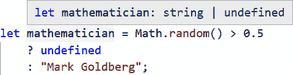
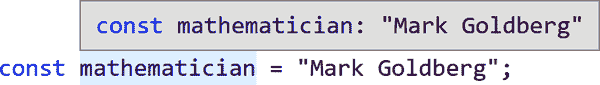
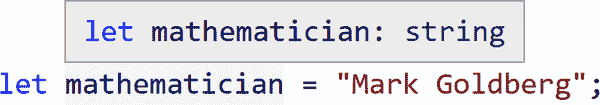

# 第三章：联合类型和字面量

> 没有什么是恒定的
> 
> 值可能随时间变化
> 
> （好吧，除了常数）

第二章，“类型系统” 讨论了“类型系统”的概念以及如何读取值以理解变量的类型。现在我想介绍 TypeScript 与之一起工作以进行推断的两个关键概念：

联合

扩展一个值的允许类型为两种或更多种可能的类型

缩小

缩小一个值的允许类型为 *不是* 一个或多个可能的类型

联合类型和类型缩小的结合是强大的概念，使得 TypeScript 能够做出其他许多主流语言无法做出的有根据的推断。

# 联合类型

对于这个`mathematician`变量：

```
let mathematician = Math.random() > 0.5
    ? undefined
    : "Mark Goldberg";
```

`mathematician`是什么类型？

它不仅仅是`undefined`，也不仅仅是`string`，尽管它们都是可能的类型。`mathematician`可以是*要么* `undefined` *要么* `string`。这种“要么或者”类型称为*联合类型*。联合类型是一个很棒的概念，它允许我们处理那些我们不确切知道值是哪种类型，但知道它是两个或更多选项之一的代码情况。

TypeScript 使用 `|`（管道）操作符来表示联合类型的可能值或 *组成部分*。之前的 `mathematician` 类型被视为 `string | undefined`。悬停在 `mathematician` 变量上会显示其类型为 `string | undefined`（图 3-1）。



###### 图 3-1。TypeScript 报告 `mathematician` 变量为 `string | undefined` 类型

## 声明联合类型

联合类型是一个例子，当可能需要为一个变量提供显式类型注解时，尽管它有一个初始值。在这个例子中，`thinker` 起初是 `null`，但可能包含一个 `string`。给它一个显式的 `string | null` 类型注解意味着 TypeScript 允许它被赋予 `string` 类型的值：

```
let thinker: string | null = null;

if (Math.random() > 0.5) {
    thinker = "Susanne Langer"; // Ok
}
```

联合类型声明可以放置在你可能声明类型注解的任何地方。

###### 注意

联合类型声明的顺序不重要。你可以写 `boolean | number` 或 `number | boolean`，TypeScript 将完全相同对待它们。

## 联合属性

当一个值已知是联合类型时，TypeScript 只允许你访问所有可能类型中存在的成员属性。如果尝试访问一个不在所有可能类型上存在的类型，它会给你一个类型检查错误。

在下面的代码片段中，`physicist` 的类型是 `number | string`。虽然`.toString()` 在两种类型中都存在并且允许使用，但`.toUpperCase()` 和 `.toFixed()` 不允许使用，因为`.toUpperCase()` 在`number`类型上缺失，而`.toFixed()` 在`string`类型上缺失：

```
let physicist = Math.random() > 0.5
    ? "Marie Curie"
    : 84;

physicist.toString(); // Ok

physicist.toUpperCase();
//        ~~~~~~~~~~~
// Error: Property 'toUpperCase' does not exist on type 'string | number'.
//   Property 'toUpperCase' does not exist on type 'number'.

physicist.toFixed();
//        ~~~~~~~
// Error: Property 'toFixed' does not exist on type 'string | number'.
//   Property 'toFixed' does not exist on type 'string'.
```

限制访问不在所有联合类型上存在的属性是一种安全措施。 如果对象不确定一定是包含某个属性的类型，TypeScript 将认为尝试使用该属性是不安全的。 属性可能不存在！

要使用仅存在于潜在类型子集上的联合类型值的属性，您的代码需要告诉 TypeScript 该代码位置的值是其中更具体类型之一：这个过程称为 *缩小*。

# 缩小

缩小是指 TypeScript 从您的代码推断出一个值的类型比定义、声明或先前推断的类型更具体的情况。 一种可以用于缩小类型的逻辑检查称为 *类型守卫*。

让我们来讨论 TypeScript 可以使用的两种常见类型守卫，从你的代码中推断出类型缩小的方法。

## 赋值缩小

如果直接将值分配给变量，则 TypeScript 将缩小变量的类型为该值的类型。

在这里，`admiral` 变量最初声明为 `number | string`，但在分配值 `"Grace Hopper"` 后，TypeScript 知道它必须是 `string`：

```
let admiral: number | string;

admiral = "Grace Hopper";

admiral.toUpperCase(); // Ok: string

admiral.toFixed();
//      ~~~~~~~
// Error: Property 'toFixed' does not exist on type 'string'.
```

当变量被赋予明确的联合类型注释和初始值时，赋值缩小就会发挥作用。 TypeScript 将理解，虽然变量后来可能接收联合类型值中的任何一个，但它起始时仅作为其初始值的类型。

在下面的代码片段中，`inventor` 声明为 `number | string` 类型，但 TypeScript 知道它立即从其初始值缩小为 `string`：

```
let inventor: number | string = "Hedy Lamarr";

inventor.toUpperCase(); // Ok: string

inventor.toFixed();
//       ~~~~~~~
// Error: Property 'toFixed' does not exist on type 'string'.
```

## 条件检查

缩小变量值的常见方式是编写一个 `if` 语句，检查变量是否等于已知值。 TypeScript 足够聪明，理解在该 `if` 语句的主体内，变量必须与已知值相同类型：

```
// Type of scientist: number | string
let scientist = Math.random() > 0.5
    ? "Rosalind Franklin"
    : 51;

if (scientist === "Rosalind Franklin") {
    // Type of scientist: string
    scientist.toUpperCase(); // Ok
}

// Type of scientist: number | string
scientist.toUpperCase();
//        ~~~~~~~~~~~
// Error: Property 'toUpperCase' does not exist on type 'string | number'.
//   Property 'toUpperCase' does not exist on type 'number'.
```

使用条件逻辑进行缩小显示出 TypeScript 的类型检查逻辑反映了良好的 JavaScript 编码模式。 如果变量可能是多种类型之一，通常会希望检查其类型是否符合需要的类型。 TypeScript 强制我们在代码中保持安全性。 谢谢，TypeScript！

## typeof 检查

除了直接值检查外，TypeScript 还识别 `typeof` 操作符来缩小变量类型。

类似于 `scientist` 示例，检查 `typeof researcher` 是否为 `"string"` 表示 TypeScript 必须将 `researcher` 的类型确定为 `string`：

```
let researcher = Math.random() > 0.5
    ? "Rosalind Franklin"
    : 51;

if (typeof researcher === "string") {
    researcher.toUpperCase(); // Ok: string
}
```

逻辑否定 `!` 和 `else` 语句同样有效：

```
if (!(typeof researcher === "string")) {
    researcher.toFixed(); // Ok: number
} else {
    researcher.toUpperCase(); // Ok: string
}
```

这些代码片段可以使用三元语句进行重写，也支持类型缩小：

```
typeof researcher === "string"
    ? researcher.toUpperCase() // Ok: string
    : researcher.toFixed(); // Ok: number
```

无论如何编写它们，`typeof` 检查都是缩小类型的实用且经常使用的方式。

TypeScript 的类型检查器识别出我们将在后续章节中看到的几种更多的缩小形式。

# 字面类型

现在我已经展示了联合类型和用于处理可能是两种或更多种潜在类型的值的缩小，我想通过引入 *字面类型* 来走相反的方向：原始类型的更具体版本。

拿这个 `philosopher` 变量：

```
const philosopher = "Hypatia";
```

`philosopher` 是什么类型？

乍一看，你可能会说 `string` —— 你是正确的。 `philosopher` 确实是一个 `string`。

但是！ `philosopher` 不只是任何旧的 `string`。它特别是值 `"Hypatia"`。因此， `philosopher` 变量的类型在技术上更具体 `"Hypatia"`。

这就是 *字面类型* 的概念：这是一个已知为原始特定值的值类型，而不是所有这些原始值中的任何一个。原始类型 `string` 表示可能存在的所有可能字符串集合；字面类型 `"Hypatia"` 仅代表这一个字符串。

如果您将一个变量声明为 `const` 并直接赋予它一个字面值，TypeScript 将推断该变量为该字面值作为类型。这就是为什么当您将鼠标悬停在具有初始字面值的 `const` 变量上时，在诸如 VS Code 的 IDE 中，它将显示该变量的类型为该字面值 (图 3-2) 而不是更一般的原始类型 (图 3-3)。



###### 图 3-2\. TypeScript 报告一个 `const` 变量为其字面类型



###### 图 3-3\. TypeScript 报告一个 `let` 变量通常为其原始类型

您可以将每个 *原始* 类型视为每个可能匹配 *字面* 值的 *联合*。换句话说，原始类型是该类型的所有可能字面值的集合。

除了 `boolean`、`null` 和 `undefined` 类型外，所有其他原始类型如 `number` 和 `string` 都有无限数量的字面类型。在典型的 TypeScript 代码中，您会发现以下常见类型：

+   `boolean`：只是 `true | false`

+   `null` 和 `undefined`：两者都只有一个字面值，它们自己

+   `number`: `0 | 1 | 2 | ... | 0.1 | 0.2 | ...`

+   `string`: `"" | "a" | "b" | "c" | ... | "aa" | "ab" | "ac" | ...`

联合类型注释可以混合和匹配文字和原语。例如，寿命的表示可以由任何`number` *或* 一对已知的极端情况之一表示：

```
let lifespan: number | "ongoing" | "uncertain";

lifespan = 89; // Ok
lifespan = "ongoing"; // Ok

lifespan = true;
// Error: Type 'true' is not assignable to
// type 'number | "ongoing" | "uncertain"'
```

## 字面赋值

您已经看到了不同的原始类型如 `number` 和 `string` 是不可相互分配的。同样，同一原始类型内的不同字面类型 —— 例如 `0` 和 `1` —— 也不能相互分配。

在这个例子中，`specificallyAda`被声明为字面量类型`"Ada"`，因此可以赋予其值`"Ada"`，但`"Byron"`和`string`类型不能赋给它：

```
let specificallyAda: "Ada";

specificallyAda = "Ada"; // Ok

specificallyAda = "Byron";
// Error: Type '"Byron"' is not assignable to type '"Ada"'.

let someString = ""; // Type: string

specificallyAda = someString;
// Error: Type 'string' is not assignable to type '"Ada"'.
```

然而，文本类型允许被分配给它们对应的基本类型。任何特定的字面量字符串仍然是`string`。

在这个代码示例中，类型为`":)"`的值`":)"`被赋给之前推断为`string`类型的`someString`变量：

```
someString = ":)";
```

谁会想到一个简单的变量赋值会如此理论化？

# 严格空值检查

在处理潜在未定义值时，通过收窄联合与字面量的能力，TypeScript 中类型系统所称的*严格空值检查*尤为明显。TypeScript 是一波利用严格空值检查来修复可怕“十亿美元错误”的现代编程语言之一。

## 十亿美元错误

> 我称它为我的十亿美元错误。这是在 1965 年发明的空引用……这导致了无数的错误、漏洞和系统崩溃，在过去 40 年中可能造成了数十亿美元的痛苦和损失。
> 
> Tony Hoare, 2009

“十亿美元错误”是一个行业术语，用于描述许多类型系统允许在需要不同类型的位置使用 null 值的情况。在没有严格空值检查的语言中，像这个示例一样将`null`赋给`string`是允许的：

```
const firstName: string = null;
```

如果你之前在像 C++或 Java 这样的类型语言中工作过，这些语言因为“十亿美元的错误”而著名，那么某些不允许这种情况发生的语言可能会让你感到惊讶。如果你以前从未在具有严格空值检查的语言中工作过，那么一些允许这种“十亿美元的错误”发生的语言可能会让你感到惊讶！

TypeScript 编译器包含多种选项，允许更改其运行方式。第十三章，“配置选项”将深入讨论 TypeScript 编译器选项。其中最有用的选择性选项之一，`strictNullChecks`，切换是否启用严格空值检查。粗略地说，禁用`strictNullChecks`会向代码中的每种类型添加`| null | undefined`，从而允许任何变量接收`null`或`undefined`。

将`strictNullChecks`选项设置为`false`时，以下代码被认为是完全类型安全的。然而，这是错误的；`nameMaybe`在访问`.toLowerCase`时可能是`undefined`：

```
let nameMaybe = Math.random() > 0.5
    ? "Tony Hoare"
    : undefined;

nameMaybe.toLowerCase();
// Potential runtime error: Cannot read property 'toLowerCase' of undefined.
```

启用严格空值检查后，TypeScript 能够在代码片段中看到潜在的崩溃：

```
let nameMaybe = Math.random() > 0.5
    ? "Tony Hoare"
    : undefined;

nameMaybe.toLowerCase();
// Error: Object is possibly 'undefined'.
```

没有启用严格空值检查，很难知道你的代码是否安全，是否会因为意外的`null`或`undefined`值而导致错误。

TypeScript 的最佳实践通常是启用严格空值检查。这样做有助于防止崩溃，并消除“十亿美元错误”。

## 真值收窄

从 JavaScript 中可以回忆起*真值*或*真值性*，即在`Boolean`上下文（如`&&`操作符或`if`语句）中，一个值是否被认为是`true`。JavaScript 中的所有值都是真值，除了被定义为*假值*的：`false`、`0`、`-0`、`0n`、`""`、`null`、`undefined` 和 `NaN`。^(1)

TypeScript 还可以通过真值检查来缩小变量的类型，如果它的一些潜在值可能是真值。在下面的片段中，`geneticist` 的类型是 `string | undefined`，因为`undefined`始终为假，TypeScript 可以推断在`if`语句体内它必须是`string`类型：

```
let geneticist = Math.random() > 0.5
    ? "Barbara McClintock"
    : undefined;

if (geneticist) {
    geneticist.toUpperCase(); // Ok: string
}

geneticist.toUpperCase();
// Error: Object is possibly 'undefined'.
```

执行真值检查的逻辑运算符同样适用，即`&&` 和 `?.`：

```
geneticist && geneticist.toUpperCase(); // Ok: string | undefined
geneticist?.toUpperCase(); // Ok: string | undefined
```

不幸的是，真值检查并不适用于反向情况。如果我们知道`string | undefined`值是假值，这并不能告诉我们它是空字符串还是`undefined`。

在这里，`biologist` 的类型是 `false | string`，虽然它可以在`if`语句体中缩小为`string`，但`else`语句体知道，如果是`""`，它仍然可以是一个字符串：

```
let biologist = Math.random() > 0.5 && "Rachel Carson";

if (biologist) {
    biologist; // Type: string
} else {
    biologist; // Type: false | string
}
```

## 没有初始值的变量

在 JavaScript 中，声明而没有初始值的变量默认为`undefined`。这在类型系统中构成一个特例：如果你声明一个变量为不包含`undefined`的类型，然后试图在赋值前使用它会怎么样？

TypeScript 足够智能，能理解在赋值前变量是`undefined`。如果在赋值前尝试使用该变量，例如访问其属性，它将报告一个专门的错误消息：

```
let mathematician: string;

mathematician?.length;
// Error: Variable 'mathematician' is used before being assigned.

mathematician = "Mark Goldberg";
mathematician.length; // Ok
```

注意，如果变量的类型包含`undefined`，这种报告就不适用。向变量的类型添加`| undefined`表示 TypeScript 在使用前不需要定义它，因为`undefined`是其值的有效类型。

如果`mathematician`的类型是`string | undefined`，则前面的代码片段不会发出任何错误：

```
let mathematician: string | undefined;

mathematician?.length; // Ok

mathematician = "Mark Goldberg";
mathematician.length; // Ok
```

# 类型别名

在代码中，你通常会看到只有两个或三个组成部分的联合类型。然而，有时你可能会发现需要重复输入的长联合类型也是有用的。

这些变量中的每一个可能是四种可能的类型之一：

```
let rawDataFirst: boolean | number | string | null | undefined;
let rawDataSecond: boolean | number | string | null | undefined;
let rawDataThird: boolean | number | string | null | undefined;
```

TypeScript 包含了用于为重复使用的类型分配更简单名称的*类型别名*。类型别名以`type`关键字开始，接着是一个新名称、`=`，然后是任何类型。按照惯例，类型别名采用 PascalCase 命名：

```
type MyName = ...;
```

类型别名在类型系统中起到复制粘贴的作用。当 TypeScript 遇到类型别名时，它会将其视为你直接输入了别名所引用的实际类型。可以用长联合类型的类型别名重写前面变量的类型注解：

```
type RawData = boolean | number | string | null | undefined;

let rawDataFirst: RawData;
let rawDataSecond: RawData;
let rawDataThird: RawData;
```

这样阅读起来轻松多了！

类型别名是 TypeScript 中的一个方便功能，无论是对于复杂的类型还是数组、函数和对象类型。

## 类型别名不是 JavaScript

类型别名，就像类型注解一样，不会编译到输出的 JavaScript 中。它们纯粹存在于 TypeScript 的类型系统中。

前面的代码片段大致会编译成这样的 JavaScript：

```
let rawDataFirst;
let rawDataSecond;
let rawDataThird;
```

因为类型别名纯粹存在于类型系统中，您不能在运行时代码中引用它们。如果您试图访问不存在的内容，TypeScript 会通过类型错误提醒您：

```
type SomeType = string | undefined;

console.log(SomeType);
//          ~~~~~~~~
// Error: 'SomeType' only refers to a type, but is being used as a value here.
```

类型别名纯粹作为开发时的构造存在。

## 结合类型别名

类型别名可以引用其他类型别名。有时候，让一个类型别名引用另一个类型别名是很有用的，比如一个类型别名是另一个类型别名中的联合类型（是一个超集）。

这个`IdMaybe`类型是`Id`中的类型以及`undefined`和`null`的联合：

```
type Id = number | string;

// Equivalent to: number | string | undefined | null
type IdMaybe = Id | undefined | null;
```

类型别名不需要按照使用顺序声明。你可以在文件中较早地声明一个类型别名引用稍后在文件中声明的别名。

前面的代码片段可以重写，使得`IdMaybe`出现在`Id`之前：

```
type IdMaybe = Id | undefined | null; // Ok
type Id = number | string;
```

# 总结

在本章中，您已经学习了 TypeScript 中的联合类型和字面类型，以及它的类型系统如何从我们代码的结构中推断出更具体（更窄）的类型：

+   联合类型如何表示可能是两种或更多类型之一的值

+   使用类型注解明确指示联合类型

+   类型缩小如何减少值的可能类型

+   `const`变量与字面类型的变量之间的差异

+   “十亿美元错误”以及 TypeScript 如何处理严格的空值检查

+   使用显式的`| undefined`来表示可能不存在的值

+   对于未分配变量，隐式的`| undefined`

+   使用类型别名以避免重复输入长类型联合

###### 提示

现在您已经完成了本章的阅读，请在[*https://learningtypescript.com/unions-and-literals*](https://learningtypescript.com/unions-and-literals)上练习您所学到的内容。

> 为什么`const`变量如此严格？
> 
> 它们太过于字面了。

^(1) 在旧版本浏览器兼容性的古怪遗留中，已弃用的`document.all`对象也被定义为假值。对于本书和作为开发者的您的幸福感，请不要担心`document.all`。
