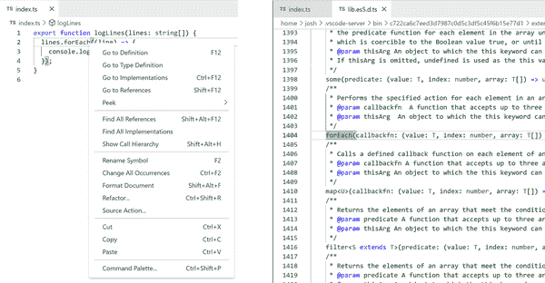

# 第十一章：声明文件

> 声明文件
> 
> 纯类型系统代码
> 
> 没有运行时结构

尽管在 TypeScript 中编写代码很棒，这也是你想做的全部，但你需要能够在 TypeScript 项目中使用原始 JavaScript 文件。许多包直接用 JavaScript 编写，而不是 TypeScript。即使使用 TypeScript 编写的包也会以 JavaScript 文件的形式分发。

此外，TypeScript 项目需要一种方式告诉环境特定功能的类型形状，比如全局变量和 API。在 Node.js 中运行的项目可能可以访问浏览器中不可用的内置 Node 模块，反之亦然。

TypeScript 允许单独声明类型形状，与其实现分开。类型声明通常写在以*.d.ts*结尾的文件中，称为*声明文件*。声明文件通常在项目中编写，随项目的编译 npm 包一起构建和分发，或者作为独立的“typings”包共享。

# 声明文件

*.d.ts*声明文件通常与*.ts*文件类似，但有一个明显的限制，即不允许包含运行时代码。*.d.ts*文件仅包含可用运行时值、接口、模块和一般类型的描述，不能包含任何可能编译为 JavaScript 的运行时代码。

声明文件可以像任何其他源 TypeScript 文件一样导入。

此*types.d.ts*文件导出了一个在*index.ts*文件中使用的`Character`接口：

```
// types.d.ts
export interface Character {
    catchphrase?: string;
    name: string;
}
```

```
// index.ts
import { Character } from "./types";

export const character: Character = {
    catchphrase: "Yee-haw!",
    name: "Sandy Cheeks",
};
```

###### 提示

声明文件创建了所谓的*环境上下文*，意味着代码区域只能声明类型，而不能声明值。

本章主要介绍声明文件及其内部使用的最常见的类型声明形式。

# 声明运行时值

虽然定义文件可能不会创建诸如函数或变量之类的运行时值，但它们可以使用`declare`关键字声明这些构造存在。这样做告诉类型系统，某些外部影响——比如网页中的`<script>`标签——已经创建了该名称下特定类型的值。

使用`declare`声明变量的语法与普通变量声明相同，只是不允许有初始值。

此片段成功声明了一个`declared`变量，但在试图给`initializer`变量赋值时接收到了类型错误：

```
// types.d.ts
declare let declared: string; // Ok

declare let initializer: string = "Wanda";
//                                ~~~~~~~
// Error: Initializers are not allowed in ambient contexts.
```

函数和类的声明形式也类似于它们的正常形式，但没有函数或方法的主体部分。

以下`canGrantWish`函数和方法在没有主体的情况下被正确声明，但尝试设置主体的`grantWish`函数和方法是语法错误：

```
// fairies.d.ts
declare function canGrantWish(wish: string): boolean; // Ok

declare function grantWish(wish: string) { return true; }
//                                       ~
// Error: An implementation cannot be declared in ambient contexts.

class Fairy {
    canGrantWish(wish: string): boolean; // Ok

    grantWish(wish: string) {
        //                  ~
        // Error: An implementation cannot be declared in ambient contexts.
        return true;
    }
}
```

###### 提示

TypeScript 的隐式 `any` 规则对于声明在环境上下文中的函数和变量与普通源代码中的规则相同。因为环境上下文可能不提供函数主体或初始变量值，因此显式类型注解（包括显式返回类型注解）通常是阻止它们隐式成为 `any` 类型的唯一方法。

虽然使用 `declare` 关键字进行类型声明在 *.d.ts* 定义文件中最常见，但 `declare` 关键字也可以在声明文件之外的模块或脚本文件中使用。当全局可用的变量仅打算在该文件中使用时，这是很有用的。

在这里，`myGlobalValue` 变量在 *index.ts* 文件中定义，因此允许在该文件中使用：

```
// index.ts
declare const myGlobalValue: string;

console.log(myGlobalValue); // Ok
```

请注意，在 *.d.ts* 定义文件中，类型形状（如接口）可以带有或不带有 `declare`，但是运行时构造（如函数或变量）如果没有 `declare` 将触发类型投诉：

```
// index.d.ts
interface Writer {} // Ok
declare interface Writer {} // Ok

declare const fullName: string; // Ok: type is the primitive string
declare const firstName: "Liz"; // Ok: type is the literal "value"

const lastName = "Lemon";
// Error: Top-level declarations in .d.ts files must
// start with either a 'declare' or 'export' modifier.
```

## 全局值

因为没有 `import` 或 `export` 语句的 TypeScript 文件被视为 *scripts* 而不是 *modules*，因此在其中声明的构造（包括类型）在应用程序的所有文件中全局可用。没有任何导入或导出的定义文件可以利用该行为来全局声明类型。全局定义文件特别适用于在应用程序中所有文件中声明全局类型或变量。

在这里，*globals.d.ts* 文件声明全局存在一个 `const version: string`。然后 *version.ts* 文件可以引用全局的 `version` 变量，尽管没有从 *globals.d.ts* 导入：

```
// globals.d.ts
declare const version: string;
```

```
// version.ts
export function logVersion() {
    console.log(`Version: ${version}`); // Ok
}
```

在使用全局变量的浏览器应用程序中，通常会使用全局声明的值。尽管大多数现代 Web 框架通常使用更新的技术，如 ECMAScript 模块，但在较小的项目中，能够全局存储变量仍然很有用。

###### 提示

如果发现无法自动访问 *.d.ts* 文件中声明的全局类型，请仔细检查该 *.d.ts* 文件是否导入或导出了任何内容。即使只有一个导出，整个文件也将不再全局可用！

## 全局接口合并

变量不是 TypeScript 项目类型系统中漂浮的唯一全局元素。许多类型声明全局存在于全局 API 和值中。由于接口与同名其他接口合并，因此在全局脚本上下文中声明接口（如没有任何 `import` 或 `export` 语句的 *.d.ts* 声明文件）将全局增加该接口。

例如，依赖服务器设置的全局变量的 Web 应用程序可能希望在全局 `Window` 接口上声明其存在。接口合并将允许诸如 *types/window.d.ts* 这样的文件声明一个存在于 `Window` 类型的全局 `window` 变量的变量：

```
<script type="text/javascript">
window.myVersion = "3.1.1";
</script>
```

```
// types/window.d.ts
interface Window {
    myVersion: string;
}
```

```
// index.ts
export function logWindowVersion() {
    console.log(`Window version is: ${window.myVersion}`);
    window.alert("Built-in window types still work! Hooray!")
}
```

## 全局增补

并非总是可行的要在 *.d.ts* 文件中避免 `import` 或 `export` 语句，当您的全局定义通过从其他地方导入的类型大大简化时，如当模块文件中声明的类型意味着要在全局范围内使用时。

对于这些情况，TypeScript 允许使用 `declare global` 语法来全局声明一段代码。这样做将标记该块内容在全局上下文中，即使它们的周围环境不是：

```
// types.d.ts
// (module context)

declare global {
    // (global context)
}

// (module context)
```

在这里，`types/data.d.ts` 文件导出了一个 `Data` 接口，稍后将被 `types/globals.d.ts` 和运行时的 *index.ts* 导入：

```
// types/data.d.ts
export interface Data {
    version: string;
}
```

另外，`types/globals.d.ts` 在 `declare global` 块内全局声明了一个类型为 `Data` 的变量，以及一个仅在该文件中可用的变量：

```
// types/globals.d.ts
import { Data } from "./data";

declare global {
    const globallyDeclared: Data;
}

declare const locallyDeclared: Data;
```

*index.ts* 然后可以访问 `globallyDeclared` 变量而无需导入，并且仍然需要导入 `Data`：

```
// index.ts
import { Data } from "./types/data";

function logData(data: Data) { // Ok
    console.log(`Data version is: ${data.version}`);
}

logData(globallyDeclared); // Ok

logData(locallyDeclared);
//      ~~~~~~~~~~~~~~~
// Error: Cannot find name 'locallyDeclared'.
```

调和全局和模块声明以便良好协作可能有些棘手。正确使用 TypeScript 的 `declare` 和 `global` 关键字可以描述哪些类型定义应该在项目中全局可用。

# 内置声明

现在您已经看到声明是如何工作的，是时候揭示它们在 TypeScript 中的隐含用途了：它们一直在驱动其类型检查！诸如 `Array`、`Function`、`Map` 和 `Set` 等全局对象是类型系统需要了解但不在您的代码中声明的构造的示例。它们由您的代码所用的运行时（如 Deno、Node、Web 浏览器等）提供：

## 库声明

内置全局对象，如在所有 JavaScript 运行时中存在的 `Array` 和 `Function`，在名为 *lib.[target].d.ts* 的文件中声明。*target* 是您的项目所针对的 JavaScript 的最低支持版本，例如 ES5、ES2020 或 ESNext。

内置库定义文件或“lib 文件”相当庞大，因为它们代表了 JavaScript 内置 API 的全部。例如，内置 `Array` 类型的成员由全局 `Array` 接口表示，起始如下：

```
// lib.es5.d.ts

interface Array<T> {
    /**
 * Gets or sets the length of the array.
 * This is a number one higher than the highest index in the array.
 */
    length: number;

    // ...
}
```

Lib 文件作为 TypeScript npm 包的一部分进行分发。您可以在包内的路径，如 *node_modules/typescript/lib/lib.es5.d.ts* 中找到它们。对于像 VS Code 这样使用其自己打包的 TypeScript 版本来对代码进行类型检查的 IDE，您可以通过右键单击代码中的内置方法，如数组的 `forEach`，然后选择类似“转到定义”（图 11-1）的选项来找到所使用的 lib 文件。



###### 图 11-1\. 左侧：在 `forEach` 上跳转到定义；右侧：打开的结果 lib.es5.d.ts 文件

### 库目标

TypeScript 默认会根据传递给 `tsc` CLI 的 `target` 设置以及项目的 *tsconfig.json* 文件（默认为 `"es5"`）包含适当的 lib 文件。随着新版本 JavaScript 的 lib 文件的增加，它们通过接口合并进行构建。

例如，ES2015 中添加的静态 `Number` 成员，如 `EPSILON` 和 `isFinite`，列在 *lib.es2015.d.ts* 中：

```
// lib.es2015.d.ts

interface NumberConstructor {
    /**
 * The value of Number.EPSILON is the difference between 1 and the
 * smallest value greater than 1 that is representable as a Number
 * value, which is approximately:
 * 2.2204460492503130808472633361816 x 10‍−‍16.
 */
    readonly EPSILON: number;

    /**
 * Returns true if passed value is finite.
 * Unlike the global isFinite, Number.isFinite doesn't forcibly
 * convert the parameter to a number. Only finite values of the
 * type number result in true.
 * @param number A numeric value.
 */
    isFinite(number: unknown): boolean;

    // ...
}
```

TypeScript 项目将包含 JavaScript 各版本目标的 lib 文件，直到其最低目标版本。例如，目标是 `"es2016"` 的项目将包含 *lib.es5.d.ts*、*lib.es2015.d.ts* 和 *lib.es2016.d.ts*。

###### 提示

只有比目标版本更新的 JavaScript 中可用的语言特性在类型系统中才可用。例如，如果目标是 `"es5"`，那么 ES2015 或更高版本的语言特性如 `String.prototype.startsWith` 将不会被识别。

编译选项如 `target` 在 第十三章，“配置选项” 中有详细说明。

## DOM 声明

除了 JavaScript 语言本身之外，类型声明最常引用的领域是网络浏览器。Web 浏览器类型通常称为“DOM”类型，涵盖诸如 `localStorage` 和主要在 Web 浏览器中可用的 `HTMLElement` 等 API 和类型形状。DOM 类型存储在 *lib.dom.d.ts* 文件中，与其他 *lib.*.d.ts* 声明文件并列。

像许多内置全局一样，全局 DOM 类型通常用全局接口描述。例如，用于 `localStorage` 和 `sessionStorage` 的 `Storage` 接口大致如下所示：

```
// lib.dom.d.ts

interface Storage {
    /**
 * Returns the number of key/value pairs.
 */
    readonly length: number;

    /**
 * Removes all key/value pairs, if there are any.
 */
    clear(): void;

    /**
 * Returns the current value associated with the given key,
 * or null if the given key does not exist.
 */
    getItem(key: string): string | null;

    // ...
}
```

TypeScript 在默认情况下会在不覆盖 `lib` 编译选项的项目中包含 DOM 类型。这有时可能会让在非浏览器环境（如 Node）工作的开发人员感到困惑，因为他们不应该能够访问全局 API（如 `document` 和 `localStorage`），但类型系统会声明这些全局 API 存在。编译选项如 `lib` 的详细信息在 第十三章，“配置选项” 中有详细说明。

# 模块声明

声明文件的另一个重要特性是描述模块形状的能力。可以在模块的字符串名称前使用 `declare` 关键字来通知类型系统该模块的内容。

在这里，`"my-example-lib"` 模块被声明存在于一个 `modules.d.ts` 声明脚本文件中，然后在 *index.ts* 文件中使用：

```
// modules.d.ts
declare module "my-example-lib" {
    export const value: string;
}
```

```
// index.ts
import { value } from "my-example-lib";

console.log(value); // Ok
```

在自己的代码中，您不应该经常使用 `declare module`，或者根本不需要。它主要与以下部分的通配符模块声明以及本章后面涵盖的包类型一起使用。另外，请参阅 第十三章，“配置选项” 了解 `resolveJsonModule`，这是一个编译选项，允许 TypeScript 原生识别来自 *.json* 文件的导入。

## 通配符模块声明

模块声明的常见用途是告诉 Web 应用程序，特定的非 JavaScript/TypeScript 文件扩展名可供`import`到代码中使用。模块声明可能包含一个单独的`*`通配符，表示任何匹配该模式的模块都看起来相同。

例如，许多 Web 项目（如预配置在流行的 React 启动器中，如 create-react-app 和 create-next-app 中的项目）支持 CSS 模块，以从 CSS 文件导入样式作为可在运行时使用的对象。它们会使用类似`"*.module.css"`的模式定义模块，该模块默认导出一个类型为`{ [i: string]: string }`的对象：

```
// styles.d.ts
declare module "*.module.css" {
    const styles: { [i: string]: string };
    export default styles;
}
```

```
// component.ts
import styles from "./styles.module.css";

styles.anyClassName; // Type: string
```

###### 警告

使用通配符模块来表示本地文件并不完全安全。TypeScript 没有提供一种机制来确保导入的模块路径与本地文件匹配。一些项目使用构建系统（如 Webpack）和/或从本地文件生成*.d.ts*文件来确保导入匹配。

# 包类型

现在您已经看到如何在项目中声明类型，现在是时候讨论如何在包之间消费类型。使用 TypeScript 编写的项目通常仍然分发包含编译的*.js*输出的包。它们通常使用*.d.ts*文件来声明这些 JavaScript 文件背后的 TypeScript 类型系统形状。

## 声明

TypeScript 提供了一个`declaration`选项，用于在 JavaScript 输出文件旁边创建*.d.ts*输出。

例如，给定以下*index.ts*源文件：

```
// index.ts
export const greet = (text: string) => {
    console.log(`Hello, ${text}!`);
};
```

使用`declaration`，`module`为`"es2015"`，`target`为`"es2015"`，将生成以下输出：

```
// index.d.ts
export declare const greet: (text: string) => void;
```

```
// index.js
export const greet = (text) => {
    console.log(`Hello, ${text}!`);
};
```

自动生成的*.d.ts*文件是项目创建供消费者使用的类型定义的最佳方式。通常建议大多数使用 TypeScript 编写并生成*.js*文件输出的包也应该将*.d.ts*文件与这些文件一起捆绑。

编译器选项，例如`declaration`，在第十三章，“配置选项”中有更详细的说明。

## 依赖包类型

TypeScript 能够检测并利用项目`node_modules`依赖中捆绑的*.d.ts*文件。这些文件会向类型系统提供关于该包导出的类型形状的信息，就像它们是在同一项目内编写或使用`declare`模块块声明一样。

典型的 npm 模块如果自带其自己的*.d.ts*声明文件，可能会有如下的文件结构：

```
lib/
    index.js
    index.d.ts
package.json
```

作为示例，备受欢迎的测试运行器**Jest**是用 TypeScript 编写的，并在其`jest`包中提供了自己捆绑的*.d.ts*文件。它依赖于`@jest/globals`包，该包提供诸如`describe`和`it`等函数，`jest`然后将其全局可用：

```
// package.json
{
    "devDependencies": {
        "jest": "³².1.0"
    }
}
```

```
// using-globals.d.ts
describe("MyAPI", () => {
    it("works", () => { /* ... */ });
});
```

```
// using-imported.d.ts
import { describe, it } from "@jest/globals";

describe("MyAPI", () => {
    it("works", () => { /* ... */ });
});
```

如果我们要从头开始重新创建 Jest 类型定义包的非常有限子集，它们可能看起来像这些文件一样。`@jest/globals` 包导出 `describe` 和 `it` 函数。然后，`jest` 包导入这些函数，并使用其相应函数类型增强全局作用域的 `describe` 和 `it` 变量：

```
// node_modules/@jest/globals/index.d.ts
export function describe(name: string, test: () => void): void;
export function it(name: string, test: () => void): void;
```

```
// node_modules/jest/index.d.ts
import * as globals from "@jest/globals";

declare global {
    const describe: typeof globals.describe;
    const it: typeof globals.it;
}
```

这种结构允许使用 Jest 的项目引用全局版本的 `describe` 和 `it`。项目也可以选择从 `@jest/globals` 包导入这些函数。

## 暴露包类型

如果您的项目旨在在 npm 上分发并为消费者提供类型，请在包的 *package.json* 文件中添加 `"types"` 字段，指向根声明文件。`types` 字段的工作方式与 `main` 字段类似，通常看起来相同，但扩展名为 *.d.ts* 而不是 *.js*。

例如，在这个 `fictional` 包文件中，*./lib/index.js* 的主运行时文件与 *./lib/index.d.ts* 的类型文件并行：

```
{
  "author": "Pendant Publishing",
  "main": "./lib/index.js",
  "name": "coffeetable",
  "types": "./lib/index.d.ts",
  "version": "0.5.22",
}
```

TypeScript 随后将使用 *./lib/index.d.ts* 的内容，作为导入 `utilitarian` 包的消费文件应提供的内容。

###### 注意

如果包的 *package.json* 中不存在 `types` 字段，则 TypeScript 将假定默认值为 *./index.d.ts*。这反映了 npm 的默认行为，即如果未指定，则假定 *./index.js* 文件为包的 `main` 入口点。

大多数包使用 TypeScript 的 `declaration` 编译选项，在源文件生成 *.js* 输出的同时创建 *.d.ts* 文件。编译器选项在第十三章，“配置选项”中有详细介绍。

# DefinitelyTyped

不幸的是，并非所有项目都是用 TypeScript 编写的。一些不幸的开发人员仍在用纯老式 JavaScript 写他们的项目，没有类型检查器来帮助他们。可怕。

我们的 TypeScript 项目仍然需要了解这些包的模块类型形状。TypeScript 团队和社区创建了一个名为[DefinitelyTyped](https://github.com/DefinitelyTyped/DefinitelyTyped)的巨大存储库，用于容纳社区编写的包定义。DefinitelyTyped，或简称 DT，是 GitHub 上最活跃的存储库之一。它包含数千个 *.d.ts* 定义的包，以及围绕审核变更提案和发布更新的自动化。

DT 包在 npm 上发布，在 `@types` 范围下使用与其提供类型的包同名。例如，截至 2022 年，`@types/react` 为 `react` 包提供类型定义。

###### 注意

`@types`通常安装为`dependencies`或`devDependencies`，尽管这两者之间的区别在近年来变得模糊。通常来说，如果你的项目是作为 npm 包分发的，它应该使用`dependencies`，这样包的使用者也会引入所使用的类型定义。如果你的项目是一个独立的应用程序，比如在服务器上构建和运行的应用，它应该使用`devDependencies`来表明类型只是开发时工具。

例如，对于一个依赖于`lodash`的实用程序包（截至 2022 年，有一个单独的`@types/lodash`包），*package.json*应包含类似以下行：

```
// package.json
{
    "dependencies": {
        "@types/lodash": "⁴.14.182",
        "lodash": "⁴.17.21",
    }
}
```

建立在 React 上的独立应用程序的*package.json*可能包含类似以下行：

```
// package.json
{
    "dependencies": {
        "react": "¹⁸.1.0"
    },
    "devDependencies": {
        "@types/react": "¹⁸.0.9"
    },
}
```

请注意，语义化版本号（“semver”）在`@types/`包和它们代表的包之间不一定匹配。你经常会发现它们可能会有一些偏差，如 React 早期的补丁版本，Lodash 早期的次版本，甚至主版本。

###### 警告

因为这些文件由社区编写，它们可能落后于父项目或存在小的不准确之处。如果你的项目编译成功但在调用库时出现运行时错误，请调查你正在访问的 API 签名是否发生了变化。这在成熟项目和稳定 API 表面的情况下较少见，但仍然不罕见。

## 类型可用性

大多数流行的 JavaScript 包要么使用自己的类型要么通过 DefinitelyTyped 提供类型。

如果你想为一个还没有可用类型的包获取类型，你最常见的三个选项将是：

+   向 DefinitelyTyped 发送一个拉取请求以创建其`@types/`包。

+   使用早期引入的`declare module`语法在你的项目中编写类型。

+   禁用`noImplicitAny`，如在第十三章“配置选项”中所述，并强烈警告不要这样做。

我建议如果你有时间的话，为 DefinitelyTyped 贡献类型。这样做有助于其他可能想使用该包的 TypeScript 开发者。

###### 提示

查看[aka.ms/types](https://aka.ms/types)以显示一个包是通过捆绑类型还是通过单独的`@types/`包提供类型。

# 摘要

在本章中，您使用声明文件和值声明来告知 TypeScript 关于未在源代码中声明的模块和值：

+   使用*.d.ts*创建声明文件

+   使用`declare`关键字声明类型和值

+   使用全局值、全局接口合并和全局扩展来更改全局类型

+   配置和使用 TypeScript 内置的目标、库和 DOM 声明

+   声明模块类型，包括通配符模块

+   TypeScript 如何从包中获取类型

+   使用 DefinitelyTyped 获取不包含类型的包的类型

###### 提示

现在您已经完成阅读本章，可以在[*https://learningtypescript.com/declaration-files*](https://learningtypescript.com/declaration-files)上练习所学内容。

> TypeScript 的类型在美国南部说什么呢？
> 
> “Why, I do `declare`!”
