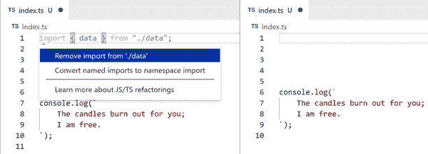

# 第十二章：使用 IDE 功能

> 编程时
> 
> 第一次使用 IDE 的感觉
> 
> 就像超能力一样。

没有流行的编程语言会完整无缺地提供语法高亮和其他 IDE 功能来帮助开发。TypeScript 最大的优势之一是其语言服务为 JavaScript 和 TypeScript 代码提供了一套强大的开发助手。本章将介绍一些最有用的项目。

我强烈建议你在阅读本书的同时尝试这些 IDE 功能，应用于你已经构建的 TypeScript 项目中。尽管本章中的所有示例和截图都是在我最喜欢的编辑器 VS Code 中完成的，但任何支持 TypeScript 的 IDE 都将支持本章的大多数或全部功能。截至 2022 年，这包括原生支持或至少支持 TypeScript 插件的所有编辑器：Atom，Emacs，Vim，Visual Studio 和 WebStorm。

###### 注意

本章列出了一些常用的 TypeScript IDE 功能，并附有它们在 VS Code 中的默认快捷键。在你继续编写 TypeScript 代码时，可能会发现更多功能。

许多 IDE 功能通常通过在代码中右键单击名称来显示上下文菜单。诸如 VS Code 之类的 IDE 通常也在上下文菜单中显示键盘快捷键。熟悉你的 IDE 键盘快捷键可以帮助你更快地编写代码和执行重构。

此截图显示了在 VS Code 中，用于 TypeScript 变量的命令列表及其快捷方式（图 12-1）。

###### 图 12-1 VS Code 显示右键上下文菜单中用于变量的命令列表

###### 小贴士

在 VS Code 中，与大多数应用程序一样，上下箭头选择下拉选项，Enter 激活选项之一。

# 代码导航

开发者通常花费更多时间阅读代码而不是主动编写代码。帮助导航代码的工具对于加速这一过程非常有用。TypeScript 语言服务提供的许多功能都旨在帮助理解代码，特别是在类型定义或代码中值之间跳转的功能。

现在我将逐一介绍上下文菜单中常用的导航选项，以及它们在 VS Code 中的快捷键。

## 查找定义

TypeScript 可以从类型定义或值的引用开始，导航到代码中它们的原始位置。VS Code 还提供了一些以此方式回溯的方法：

+   转到定义（F12）直接导航到请求的名称最初定义的位置。

+   Cmd（Mac）/ Ctrl（Windows）+ 单击名称也会触发转到定义。

+   Peek > Peek Definition（Option（Mac）/ Alt（Windows）+ F12）会显示定义的 Peek 框。

Go to Type Definition 是 Go to Definition 的专业版本，用于查找值的类型定义。对于类或接口的实例，它将显示类或接口本身，而不是实例定义的位置。

这些截图展示了查找导入到带有 Go to Definition 的文件中的 `data` 变量定义（参见图 12-2）。

###### 图 12-2\. 左侧：点击变量名进行定义；右侧：结果打开的 data.ts 文件

当定义声明在您自己的代码中时，如相对文件，编辑器将会带您进入该文件。在您的代码之外的模块，例如 npm 包，通常会使用 *.d.ts* 声明文件。

## 查找引用

给定类型定义或值，TypeScript 可以显示项目中所有引用它或使用它的位置的列表。VS Code 提供了几种可视化该列表的方法。

前往引用（Shift + F12）显示对该类型定义或值的引用列表——从它本身开始——在右键单击的名称下方的可展开的 Peek 框中。

例如，这里展示了一个 `data` 变量在一个文件 *data.ts* 中声明的引用的 Go to References，显示了该声明以及它在另一个文件 *index.ts* 中的使用（参见图 12-3）。

###### 图 12-3\. Peek 菜单显示对变量的引用

该 Peek 框包含引用文件的视图。您可以像通常打开的文件一样使用该文件——例如，运行编辑器命令等。您还可以双击 Peek 框中文件的视图以打开该文件。

单击 Peek 框右侧的文件名列表将切换 Peek 框的文件视图到单击的文件。双击列表中文件的一行将打开该文件并选择其匹配的引用。

在此，VS Code 显示了相同 `data` 变量的声明和使用，但是在右侧的侧边栏视图中展开（参见图 12-4）。

###### 图 12-4\. Peek 菜单显示对变量的打开引用

查找所有引用（Option（Mac）/ Alt（Windows）+ Shift + F12）还显示引用的列表，但以侧边栏视图形式呈现，在代码导航后保持可见。这对于一次打开或执行多个引用的操作非常有用（参见图 12-5）。

###### 图 12-5\. 查找变量的所有引用菜单

## 查找实现

转到实现（Cmd（Mac）/ Ctrl（Windows）+ F12）和查找所有实现是专为接口和抽象类方法而制作的 Go To / Find All References 版本。它们可以在代码中查找接口或抽象方法的所有实现（图 12-6）。

###### 图 12-6\. `AI` 接口的查找所有实现菜单

当您特别搜索作为类或接口类型的值如何使用时，这些功能尤其有帮助。查找所有引用可能会过于嘈杂，因为它还将显示类或接口的定义及其他类型引用。

# 编写代码

IDE 语言服务，例如 VS Code 的 TypeScript 服务，在编辑器的后台运行，并对文件中的操作做出反应。它们可以在您输入文件时即时看到文件的编辑，甚至在对文件进行保存之前。这样做可以启用一系列功能，帮助在编写 TypeScript 代码时自动化常见任务。

## 完成名称

编辑器可以使用 TypeScript 的 API 填写同一文件中存在的名称。当您开始键入名称时，例如在将先前声明的变量作为函数参数提供时，使用 TypeScript 的编辑器通常会建议具有匹配名称的变量列表的自动完成。单击列表中的名称或按 Enter 键将完成名称（图 12-7）。

###### 图 12-7\. 左侧：在变量 `dat` 上的自动完成；右侧：从导入的 `data` 的结果

自动导入功能还将为包依赖项提供添加选项。这些截图展示了 TypeScript 文件在从 `"lodash"` 包导入 `sortBy` 前后的导入和模块代码（图 12-8）。

###### 图 12-8\. 左侧：在变量 `sortBy` 上的自动完成；右侧：从 `lodash` 导入的 `sortBy` 的结果

TypeScript 体验中我最喜欢的功能之一是自动导入。它们极大地加快了通常费时的过程，即找出导入的来源，然后显式地将其键入。

类似地，如果您开始输入类型值的属性名称，由 TypeScript 支持的编辑器将提供自动完成到该值类型已知属性的选项（图 12-9）。

###### 图 12-9\. 左侧：在属性 `forE` 上的自动完成；右侧：自动完成为 `.forEach` 的结果

## 自动导入更新

如果您重命名文件或将其移动到另一个文件夹，您可能需要更新该文件的许多导入语句。更新可能需要在该文件本身以及任何从中导入的其他文件中进行。

如果您使用 VS Code 文件资源管理器拖放文件或将其重命名为嵌套文件夹路径，VS Code 将提供使用 TypeScript 来为您更新文件路径的选项。

这些截图展示了 *src/logging.ts* 文件被重命名为 *src/shared/logging.ts* 并相应地更新文件导入（图 12-10）。

###### 图 12-10\. 左图：*src/index.ts* 文件从 `"./logging"` 进行导入；中图：将 *src/logging.ts* 重命名为 *src/shared/logging.ts*；右图：*src/index.ts* 中更新的导入路径

###### 小贴士

多文件编辑可能会导致文件变更未保存。在对它们运行编辑后，请记得保存任何更改过的文件。

## 代码操作

许多 TypeScript 的 IDE 实用工具都是您可以触发的操作。虽然其中一些只修改当前正在编辑的文件，但有些可以一次修改多个文件。使用这些代码操作是引导 TypeScript 自动执行您的手动代码编写任务的绝佳方式，例如计算导入路径和常见重构。

编辑器通常在可用时使用某种图标来表示代码操作。例如，VS Code 在至少有一个代码操作可用时，会显示一个可点击的灯泡图标，显示在您的文本光标旁边（图 12-11）。

###### 图 12-11\. 代码操作灯泡，旁边是一个导致类型错误的名称

###### 小贴士

编辑器通常会暴露键盘快捷键，用于操作代码操作菜单或类似功能，允许您在本章中触发任何操作，而无需使用鼠标。VS Code 在 Mac 上打开代码操作菜单的默认快捷键是 Cmd + `.`，在 Linux/Windows 上是 Ctrl + `.`。使用上下箭头选择下拉选项，按 Enter 键激活选中的操作。

这些代码操作，特别是重命名和重构，因 TypeScript 的类型系统而特别强大。当对类型应用操作时，TypeScript 将理解所有文件中属于该类型的值，并可以对这些值进行任何需要的更改。

### 重命名

对已存在的名称（如函数、接口或变量）进行更改可能会手动操作繁琐。TypeScript 可以为名称执行重命名，同时更新所有引用该名称的地方。

重命名符号（F2）上下文菜单选项会创建一个文本框，您可以在其中输入新名称。例如，对函数名称进行重命名将提供一个文本框，用于重命名该函数及其所有调用。按 Enter 键应用该名称（图 12-12）。

###### 图 12-12\. 重命名 `log` 函数的框，插入了 `logData`

如果您希望在应用新名称之前查看会发生什么，按 Shift + Enter 打开重构预览窗格，其中列出了将发生的所有文本更改（图 12-13）。

###### 图 12-13\. 重命名 `log` 函数的重构预览，包括在两个文件中预览的 `logData`

### 删除未使用的代码

许多 IDE 在视觉上微调未使用的代码的外观，例如导入的值和从未引用的变量。例如，VS Code 会将它们的不透明度降低约三分之一。

TypeScript 提供了用于删除未使用代码的代码操作。(图 12-14) 展示了请求 TypeScript 删除未使用的 `import` 语句的结果。

###### 图 12-14\. 左：选择未使用的导入并打开重构菜单；右：TypeScript 删除后的文件

### 其他快速修复

许多 TypeScript 错误消息都是可以快速纠正的代码问题，例如关键字或变量名称中的小拼写错误。其他常用的 TypeScript 快速修复包括：

+   在类或接口上声明缺失的属性

+   更正拼写错误的字段名称

+   填写声明为类型的变量的缺失属性

我建议在发现之前未见过的错误消息时，检查快速修复列表。你永远不知道 TypeScript 提供了哪些有用的工具来解决它！

### 重构

TypeScript 语言服务为不同结构的代码提供了大量便捷的代码更改。有些简单到移动代码行，而其他一些则复杂到为您创建新函数。

当您选择了一段代码区域时，VS Code 会在选择旁边显示一个灯泡图标。点击它以查看可用的重构列表。

这是一个开发者将内联数组文本提取到常量变量的示例（图 12-15）。

###### 图 12-15\. 左：选择数组文本并打开重构菜单；右：提取为常量变量

# 有效地处理错误

阅读和处理错误消息是在任何编程语言中工作的一个不可避免的事实。每个开发者，无论在 TypeScript 语言方面的熟练程度如何，每次编写 TypeScript 代码时都会触发大量的 TypeScript 编译器错误。利用 IDE 功能增强您处理 TypeScript 编译器错误的能力，将帮助您在该语言中变得更加高效。

## 语言服务错误

编辑器通常会在有问题的代码下方显示由 TypeScript 语言服务报告的红色波浪线。将鼠标悬停在下划线字符上将显示一个悬停框，其中包含错误的文本（详见图 12-16）。

###### 图 12-16\. 变量不存在的悬停信息

VS Code 还会在“面板”部分的“问题”选项卡中显示任何打开文件的错误。悬停框中错误的底部左侧的“查看问题”链接将打开消息的内联显示，插入在问题行之后和后续行之前（详见图 12-17）。

###### 图 12-17\. 显示变量不存在的问题的视图问题内联显示

当同一源文件中存在多个问题时，它们的显示将包括向上和向下箭头，您可以使用它们在问题列表中前进和后退。快捷键 F8 和 Shift + F8 分别用于在列表中前进和后退（详见图 12-18）。

###### 图 12-18\. 两个显示变量不存在的问题的视图问题内联显示之一

### 问题标签

VS Code 在其面板中包含一个“问题”选项卡，顾名思义，会显示工作区中的任何问题。这包括 TypeScript 语言服务报告的错误。

此屏幕截图显示了一个 TypeScript 文件中“问题”选项卡显示的两个问题（详见图 12-19）。

###### 图 12-19\. 问题选项卡显示文件中的两个错误

在“问题”选项卡中点击任何错误将把您的文本光标移动到文件中相应的行和列。

请注意，VS Code 仅会列出当前打开的文件中的问题。如果您希望实时更新所有 TypeScript 编译器的问题列表，您需要在终端中运行 TypeScript 编译器。

### 运行终端编译器

推荐在 TypeScript 项目中工作时，在终端中以观察模式运行 TypeScript 编译器（详见第十三章，“配置选项”）。这样做可以实时更新所有问题的列表，而不仅仅是文件中的问题。

在 VS Code 中执行此操作，打开终端面板并运行 `tsc -w`（或者如果使用项目引用，则运行 `tsc -b -w`，同时参见第十三章，“配置选项”）。现在你应该看到终端显示出项目中所有 TypeScript 问题，如此屏幕截图所示（图 12-20）。

###### 图 12-20\. 在终端中运行 `tsc -w` 报告文件中的问题

在 Mac 上 Cmd / 在 Windows 上 Ctrl + 单击文件名将使文本光标移到其文件中的错误行和列。

###### 提示

一些项目使用 VS Code 的 launch.json 配置启动 TypeScript 编译器的观察模式。请参阅[code.visualstudio.com/docs/editor/tasks](https://code.visualstudio.com/docs/editor/tasks)了解 VS Code 任务的完整参考。

### 理解类型

有时你会发现需要了解某个设定方式中类型并不明显的东西的类型。对于任何值，你可以将鼠标悬停在其名称上，以查看显示其类型的悬停框。

此屏幕截图显示了一个变量的悬停框（图 12-21）。

###### 图 12-21\. 变量的悬停信息

悬停时按住 Ctrl 还可以显示名称声明的位置。

此屏幕截图显示与之前相同变量的 Ctrl 悬停框（图 12-22）。

###### 图 12-22\. 展开变量的悬停信息

悬停信息框也适用于类型，比如类型别名。此屏幕截图显示悬停在 `keyof typeof` 类型上以查看其等效字符串文字联合（图 12-23）。

###### 图 12-23\. 展开类型的悬停信息

我发现的一种策略在试图理解复杂类型的组成部分时非常有帮助，那就是创建一个代表类型的别名，仅表示类型的一个组件。然后你可以将鼠标悬停在该类型别名上，看看其类型结果。

例如，对于之前的 `FruitsType` 类型，其 `typeof fruits` 部分可以通过重构提取为一个单独的中介类型。然后可以悬停在该中介类型上查看类型信息（图 12-24）。

###### 图 12-24\. 左：提取 `FruitsType` 类型的一部分；右：悬停在提取的类型上

中介类型别名策略特别适用于调试涵盖在第十五章，“类型操作”中讨论的类型操作。

# 总结

在本章中，您探索了使用 TypeScript 的 IDE 集成来提升编写 TypeScript 代码的能力：

+   在类型和值上打开上下文菜单以列出其可用命令

+   通过查找定义、引用和实现来导航代码

+   使用名称补全和自动导入自动化编写代码

+   包括重命名和重构在内的更多代码操作

+   查看和理解语言服务错误的策略

+   理解类型的策略

###### 小贴士

现在你已经完成了本章的阅读，请在[*https://learningtypescript.com/using-ide-features*](https://learningtypescript.com/using-ide-features)上练习所学的内容。

> IDE 间相爱的告白？
> 
> “你完美地补全了我！”
