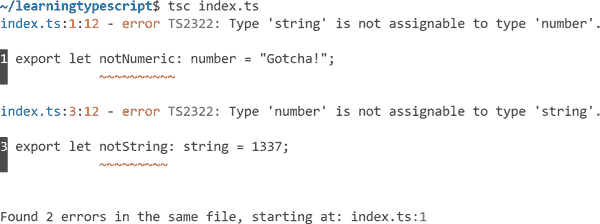
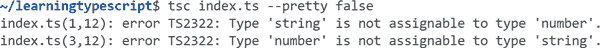
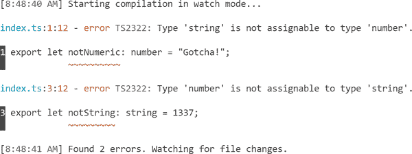
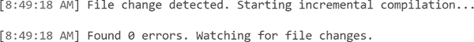

# 第十三章：配置选项

> 编译器选项：
> 
> 类型和模块，还有更多！
> 
> `tsc` 你的方式。

TypeScript 高度可配置，并且设计适应所有常见的 JavaScript 使用模式。它可以用于从传统浏览器代码到最现代的服务器环境的项目。

TypeScript 的大部分可配置性来自于其多达 100 多个配置选项，可以通过以下方式之一提供：

+   传递给`tsc`的命令行（CLI）标志

+   “TSConfig” TypeScript 配置文件

本章不旨在作为所有 TypeScript 配置选项的完整参考。相反，我建议将本章视为您将经常使用的最常见选项的导览。我仅包含那些对大多数 TypeScript 项目设置更有用和广泛使用的选项。有关每个选项和更多信息，请参见[aka.ms/tsc](https://aka.ms/tsc)。

# tsc 选项

回到第一章，“从 JavaScript 到 TypeScript”，您使用`tsc index.ts`编译了一个*index.ts*文件。`tsc`命令可以将大多数 TypeScript 配置选项作为`--`标志传递。

例如，要在*index.ts*文件上运行`tsc`并跳过发出*index.js*文件（因此，只运行类型检查），请传递`--noEmit`标志：

```
tsc index.ts --noEmit
```

您可以运行`tsc --help`来获取常用的 CLI 标志列表。从[aka.ms/tsc](https://aka.ms/tsc)查看所有`tsc`配置选项的完整列表，使用`tsc --all`。

## 漂亮模式

`tsc` CLI 具有“漂亮”模式的输出能力：使用颜色和间距进行样式化，使其更易于阅读。如果检测到输出终端支持彩色文本，则默认为漂亮模式。

这里展示了一个从文件中打印两个类型错误的`tsc`的示例（见图 13-1）。



###### 图 13-1\. `tsc` 报告两个错误，包含蓝色文件名、黄色行号和列号，以及红色波浪线

如果您希望 CLI 输出更加简洁和/或不具有不同的颜色，可以显式提供`--pretty false`，告诉 TypeScript 使用更简洁、无颜色的格式（见图 13-2）。



###### 图 13-2\. `tsc` 报告两个错误的普通文本模式

## 观察模式

我喜欢使用`tsc` CLI 的一种方式是使用其`-w`/`--watch`模式。在完成后不会退出，观察模式将持续运行 TypeScript，并实时更新终端中看到的所有错误列表。

在包含两个错误的文件上运行观察模式，见图 13-3。



###### 图 13-3\. `tsc` 在观察模式下报告两个错误

图 13-4 展示了`tsc`更新控制台输出以指示文件已更改以修复所有错误。



###### 图 13-4\. `tsc`在监视模式下报告没有错误

当您正在进行跨多个文件的大规模更改（如重构）时，监视模式特别有用。您可以使用 TypeScript 的类型错误作为一种清单，查看仍需清理的内容。

# TSConfig 文件

您可以将大多数配置选项指定在一个目录中的*tsconfig.json*（“TSConfig”）文件中，而不是始终提供所有文件名和配置选项给`tsc`。

*tsconfig.json*的存在表明该目录是一个 TypeScript 项目的根目录。在目录中运行`tsc`将读取该*tsconfig.json*文件中的任何配置选项。

您还可以将`-p`/`--project`传递给`tsc`，并指定一个包含*tsconfig.json*或任何文件的目录路径，以便`tsc`使用该文件：

```
tsc -p path/to/tsconfig.json
```

在可能的情况下，强烈建议使用 TSConfig 文件来进行 TypeScript 项目。像 VS Code 这样的 IDE 将在给您提供 IntelliSense 功能时尊重它们的配置。

查看[aka.ms/tsconfig.json](https://aka.ms/tsconfig.json)获取 TSConfig 文件中可用配置选项的完整列表。

###### 注意

如果你在你的*tsconfig.json*中没有设置选项，不用担心 TypeScript 的默认设置可能会改变并影响到你的项目编译设置。这几乎不会发生，即使发生了，也需要对 TypeScript 进行主要版本更新，并在发布说明中明确说明。

## tsc --init

命令行中的`tsc`命令包括一个`--init`命令，用于创建一个新的*tsconfig.json*文件。这个新创建的 TSConfig 文件将包含一个链接到配置文档以及大多数允许的 TypeScript 配置选项，每个选项都有一行简短的注释描述其用途。

运行以下命令：

```
tsc --init
```

将生成一个完全注释的*tsconfig.json*文件：

```
{
  "compilerOptions": {
    /* Visit https://aka.ms/tsconfig.json to read more about this file */
    // ...
  }
}
```

我建议在您的前几个 TypeScript 项目中使用`tsc --init`来创建您的配置文件。其默认值适用于大多数项目，并且其文档注释有助于理解它们。

## CLI 与配置

通过`tsc --init`创建的 TSConfig 文件中的配置选项可能会注意到，这些选项位于一个`"compilerOptions"`对象内。大多数同时适用于 CLI 和 TSConfig 文件的选项属于以下两个类别之一：

编译器

TypeScript 如何编译和/或类型检查每个包含的文件

文件

哪些文件将或不将在其上运行 TypeScript

我们将在这两个类别之后讨论其他设置，比如项目引用，通常只能在 TSConfig 文件中使用。

###### 提示

如果向 `tsc` CLI 提供了设置（例如为 CI 或生产构建提供的一次性更改），它通常会覆盖 TSConfig 文件中指定的任何值。因为 IDE 通常从目录中的 *tsconfig.json* 读取 TypeScript 设置，建议将大多数配置选项放在 *tsconfig.json* 文件中。

# 文件包含

默认情况下，`tsc` 将运行当前目录及其子目录中所有非隐藏的 *.ts* 文件（即文件名不以 `.` 开头的文件），忽略隐藏目录和名为 *node_modules* 的目录。TypeScript 配置可以修改要运行的文件列表。

## include

包含文件的最常见方式是在 *tsconfig.json* 中的顶级 `"include"` 属性中。它允许一个描述要在 TypeScript 编译中包含的目录和/或文件的字符串数组。

例如，此配置文件递归包含与 *tsconfig.json* 相对于 *src/* 目录中的所有 TypeScript 源文件：

```
{
  "include": ["src"]
}
```

`include` 字符串中允许使用全局通配符以更精细地控制要包含的文件：

+   `*` 匹配零个或多个字符（不包括目录分隔符）。

+   `?` 匹配任意一个字符（不包括目录分隔符）。

+   `**/` 匹配任意级别的任何目录。

此配置文件仅允许在 *typings/* 目录中嵌套的 *.d.ts* 文件和在其名称前至少具有两个字符的 *src/* 文件的扩展名：

```
{
  "include": [
    "typings/**/*.d.ts",
    "src/**/*??.*"
  ]
}
```

对于大多数项目来说，简单的 `include` 编译选项，比如 `["src"]`，通常已经足够了。

## exclude

项目的 `include` 文件列表有时会包括 TypeScript 不需要编译的文件。TypeScript 允许 TSConfig 文件通过在顶层 `"exclude"` 属性中指定来从 `include` 中省略路径。与 `include` 类似，它允许一个描述要从 TypeScript 编译中排除的目录和/或文件的字符串数组。

以下配置包含 *src/* 中所有文件，但不包括任何嵌套 *external/* 目录和 *node_modules* 目录中的文件：

```
{
  "exclude": ["**/external", "node_modules"],
  "include": ["src"]
}
```

默认情况下，`exclude` 包含 `["node_modules", "bower_components", "jspm_packages"]`，以避免在编译的第三方库文件上运行 TypeScript 编译器。

###### 提示

如果您编写自己的 `exclude` 列表，通常不需要重新添加 `"bower_components"` 或 `"jspm_packages"`。大多数 JavaScript 项目将 node 模块安装到项目内的一个文件夹中，只安装到 `"node_modules"`。

请注意，`exclude` 仅用于从 `include` 的起始列表中移除文件。TypeScript 将运行任何被任何包含的文件导入的文件，即使导入的文件明确列在 `exclude` 中。

# 替代扩展名

TypeScript 默认可以读取任何扩展名为 *.ts* 的文件。然而，某些项目需要能够读取具有不同扩展名的文件，例如用于 UI 库（如 React）的 JSON 模块或 JSX 语法。

## JSX 语法

像`<Component />`这样的 JSX 语法通常在 UI 库（如 Preact 和 React）中使用。JSX 语法并不是 JavaScript 的技术规范。与 TypeScript 的类型定义一样，它是 JavaScript 语法的扩展，可以编译成普通的 JavaScript：

```
const MyComponent = () => {
  // Equivalent to:
  //   return React.createElement("div", null, "Hello, world!");
  return <div>Hello, world!</div>;
};
```

要在文件中使用 JSX 语法，您必须完成以下两项操作：

+   在配置选项中启用`"jsx"`编译选项

+   将文件命名为*.tsx*扩展名

### jsx

用于`"jsx"`编译选项的值决定了 TypeScript 为*.tsx*文件生成 JavaScript 代码的方式。项目通常使用以下三个值之一（Table 13-1）。

Table 13-1\. JSX 编译选项输入和输出

| Value | Input code | Output code | Output file extension |
| --- | --- | --- | --- |
| “preserve” | `<div />` | `<div />` | .jsx |
| “react” | `<div />` | `React.createElement("div")` | .js |
| “react-native” | `<div />` | `<div />` | .js |

可以向`tsc` CLI 或 TSConfig 文件提供`jsx`的值。

```
tsc --jsx preserve
```

```
{
  "compilerOptions": {
    "jsx": "preserve"
  }
}
```

如果您没有直接使用 TypeScript 的内置转换器进行转译，而是使用像 Babel 这样的单独工具进行代码转译，您很可能可以使用允许的任何`"jsx"`值。大多数基于现代框架（如 Next.js 或 Remix）构建的 Web 应用程序处理 React 配置和编译语法。如果您使用这些框架之一，您可能不必直接配置 TypeScript 的内置转译器。

### .tsx 文件中的通用箭头函数

Chapter 10, “Generics”提到了泛型箭头函数的语法与 JSX 语法冲突。在*.tsx*文件中为箭头函数写入类型参数`<T>`会导致语法错误，因为没有为该开放`T`元素的标签写入结束标记：

```
const identity = <T>(input: T) => input;
//               ~~~
// Error: JSX element 'T' has no corresponding closing tag.
```

要解决此语法歧义，可以在类型参数中添加一个`= unknown`约束。类型参数默认为`unknown`类型，因此这不会改变代码行为。这只是告诉 TypeScript 读取一个类型参数，而不是一个 JSX 元素：

```
const identity = <T = unknown>(input: T) => input; // Ok
```

## `resolveJsonModule`

如果将`resolveJsonModule`编译选项设置为`true`，TypeScript 将允许读取*.json*文件。这样一来，*.json*文件就可以像导出对象的*.ts*文件那样进行导入。TypeScript 将推断该对象的类型，就好像它是一个`const`变量。

对于包含对象的 JSON 文件，可以使用解构导入。以下是一个示例，其中*activist.json*文件定义了一个`"activist"`字符串，并将其导入到*usesActivist.ts*文件中：

```
// activist.json
{
  "activist": "Mary Astell"
}
```

```
// usesActivist.ts
import { activist } from "./activist.json";

// Logs: "Mary Astell"
console.log(activist);
```

如果启用了`esModuleInterop`编译选项（稍后在本章中讨论），还可以使用默认导入：

```
// useActivist.ts
import data from "./activist.json";
```

对于包含其他文字类型（如数组或数字）的 JSON 文件，需要使用`* as`导入语法。以下是一个示例，其中*activists.json*文件定义了一个字符串数组，并将其导入到*useActivists.ts*文件中：

```
// activists.json
[
   "Ida B. Wells",
   "Sojourner Truth",
   "Tawakkul Karmān"
]
```

```
// useActivists.ts
import * as activists from "./activists.json";

// Logs: "3 activists"
console.log(`${activists.length} activists`);
```

# Emit

尽管专用编译工具（如 Babel）的兴起已经使得 TypeScript 在某些项目中的角色仅限于类型检查，但许多其他项目仍然依赖 TypeScript 将 TypeScript 语法编译为 JavaScript。对于项目来说，能够依赖于 `typescript` 并使用其 `tsc` 命令输出等效的 JavaScript 是非常有用的。

## outDir

默认情况下，TypeScript 将输出文件放置在其对应的源文件旁边。例如，在包含 *fruits/apple.ts* 和 *vegetables/zucchini.ts* 的目录上运行 `tsc` 将导致 *fruits/apple.js* 和 *vegetables/zucchini.js* 的输出文件：

```
fruits/
  apple.js
  apple.ts
vegetables/
  zucchini.js
  zucchini.ts
```

有时将输出文件放置在不同的文件夹中可能更可取。例如，许多 Node 项目将转换后的输出放置在 *dist* 或 *lib* 目录中。

TypeScript 的 `outDir` 编译选项允许指定输出的不同根目录。输出文件的相对目录结构与输入文件相同。

例如，在前述目录上运行 `tsc --outDir dist` 将会在 *dist/* 文件夹中放置输出：

```
dist/
  fruits/
    apple.js
  vegetables/
    zucchini.js
fruits/
  apple.ts
vegetables/
  zucchini.ts
```

TypeScript 通过查找所有输入文件（排除 *.d.ts* 声明文件）的最长公共子路径来计算放置输出文件的根目录。这意味着将所有输入源文件放在单个目录中的项目将该目录视为根目录。

例如，如果上述示例将所有输入放置在 *src/* 目录中，并使用 `--outDir lib` 进行编译，则会创建 *lib/fruits/apple.js* 而不是 *lib/src/fruits/apple.js*：

```
lib/
  fruits/
    apple.js
  vegetables/
    zucchini.js
src/
  fruits/
    apple.ts
  vegetables/
    zucchini.ts
```

TypeScript 确实有一个 `rootDir` 编译选项，用于显式指定根目录，但除了 `.` 或 `src` 之外，很少需要或使用其他值。

## target

TypeScript 能够生成可以在 ES3（大约 1999 年）等旧环境中运行的 JavaScript 输出。大多数环境都能够支持来自较新 JavaScript 版本的语法特性。

TypeScript 包含一个 `target` 编译选项，用于指定需要将 JavaScript 代码转译到多老的语法支持。当未指定时，默认情况下 `target` 为 `"es3"`，而 `tsc --init` 的默认设置为 `"es2016"`。通常建议根据目标平台使用尽可能新的 JavaScript 语法。在旧环境中支持新的 JavaScript 特性会导致生成更多的 JavaScript 代码，这会稍微增加文件大小并略微降低运行时性能。

###### 提示

截至 2022 年，全球 > 0.1% 用户使用的浏览器的所有最新版本都至少支持 ECMAScript 2019，并且几乎所有版本支持 ECMAScript 2020–2021，而 Node.js 的 LTS 支持版本则支持 ECMAScript 2021 的全部特性。因此，至少将 `target` 设置为 `"es2019"` 是非常合理的。

例如，考虑这个包含 ES2015 `const` 和 ES2020 `??` 空值合并的 TypeScript 源码：

```
function defaultNameAndLog(nameMaybe: string | undefined) {
  const name = nameMaybe ?? "anonymous";
  console.log("From", nameMaybe, "to", name);
  return name;
}
```

使用 `tsc --target es2020` 或更新版本，`const` 和 `??` 都是支持的语法特性，因此 TypeScript 只需从片段中移除 `: string | undefined`：

```
function defaultNameAndLog(nameMaybe) {
  const name = nameMaybe ?? "anonymous";
  console.log("From", nameMaybe, "to", name);
  return name;
}
```

使用 `tsc --target es2015` 到 `es2019`，`??` 语法糖将编译为较旧版本 JavaScript 中的等效语法：

```
function defaultNameAndLog(nameMaybe) {
    const name = nameMaybe !== null && nameMaybe !== void 0
      ? nameMaybe
      : "anonymous";
    console.log("From", nameMaybe, "to", name);
    return name;
}
```

使用 `tsc --target es3` 或 `es5`，`const` 还需要额外转换为其等效的 `var`：

```
function defaultNameAndLog(nameMaybe) {
    var name = nameMaybe !== null && nameMaybe !== void 0
      ? nameMaybe
      : "anonymous";
    console.log("From", nameMaybe, "to", name);
    return name;
}
```

将 `target` 编译器选项指定为与代码运行的最旧环境相匹配的值，将确保代码以现代、简洁的语法形式输出，仍然可以在没有语法错误的情况下运行。

## 发出声明

第十一章，“声明文件” 讲述了如何在包中分发 *.d.ts* 声明文件以向消费者指示代码类型。大多数包使用 TypeScript 的 `declaration` 编译器选项从源文件中发出 *.d.ts* 输出文件：

```
tsc --declaration
```

```
{
  "compilerOptions": {
    "declaration": true
  }
}
```

*.d.ts* 输出文件遵循与 *.js* 文件相同的输出规则，包括遵守 `outDir`。

例如，在包含 *fruits/apple.ts* 和 *vegetables/zucchini.ts* 的目录上运行 `tsc --declaration` 将导致输出声明文件 *fruits/apple.d.ts* 和 *vegetables/zucchini.d.ts* 以及输出的 *.js* 文件：

```
fruits/
  apple.d.ts
  apple.js
  apple.ts
vegetables/
  zucchini.d.ts
  zucchini.js
  zucchini.ts
```

### emitDeclarationOnly

存在一个 `emitDeclarationOnly` 编译器选项，作为 `declaration` 编译器选项的专门补充，指示 TypeScript 只发出声明文件：完全没有 *.js*/*.jsx* 文件输出。这对于使用外部工具生成输出 JavaScript 但仍希望使用 TypeScript 生成输出定义文件的项目非常有用：

```
tsc --emitDeclarationOnly
```

```
{
  "compilerOptions": {
    "emitDeclarationOnly": true
  }
}
```

如果启用了 `emitDeclarationOnly`，则必须启用 `declaration` 或本章后面介绍的 `composite` 编译器选项之一。

例如，在包含 *fruits/apple.ts* 和 *vegetables/zucchini.ts* 的目录上运行 `tsc --declaration --emitDeclarationOnly` 将导致输出声明文件 *fruits/apple.d.ts* 和 *vegetables/zucchini.d.ts*，而没有任何 *.js* 文件输出：

```
fruits/
  apple.d.ts
  apple.ts
vegetables/
  zucchini.d.ts
  zucchini.ts
```

## 源映射

源映射描述了输出文件的内容如何与原始源文件匹配。它们允许开发者工具（如调试器）在浏览输出文件时显示原始源代码。对于视觉调试器特别有用，比如浏览器开发者工具和集成开发环境（IDE），以便在调试时查看原始源文件内容。TypeScript 包括在输出文件旁边输出源映射的能力。

### sourceMap

TypeScript 的 `sourceMap` 编译器选项使得可以在 *.js* 或 *.jsx* 输出文件旁边输出 *.js.map* 或 *.jsx.map* 源映射文件。否则，源映射文件将与相应的输出 JavaScript 文件同名并放置在相同目录中。

例如，在包含 *fruits/apple.ts* 和 *vegetables/zucchini.ts* 的目录上运行 `tsc --sourceMap` 将生成输出源映射文件 *fruits/apple.js.map* 和 *vegetables/zucchini.js.map*，以及输出的 *.js* 文件：

```
fruits/
  apple.js
  apple.js.map
  apple.ts
vegetables/
  zucchini.js
  zucchini.js.map
  zucchini.ts
```

### declarationMap

TypeScript 还能够为 *.d.ts* 声明文件生成源映射。其 `declarationMap` 编译选项指示为每个 *.d.ts* 生成一个 *.d.ts.map* 源映射文件，该文件将原始源文件映射回去。声明映射使得诸如 VS Code 这样的 IDE 在使用编辑器功能如跳转到定义时能够到达原始源文件。

###### 提示

当与项目引用一起使用时，`declarationMap` 特别有用。

例如，在包含 *fruits/apple.ts* 和 *vegetables/zucchini.ts* 的目录上运行 `tsc --declaration --declarationMap` 将生成输出声明源映射文件 *fruits/apple.d.ts.map* 和 *vegetables/zucchini.d.ts.map*，以及输出的 *.d.ts* 和 *.js* 文件：

```
fruits/
  apple.d.ts
  apple.d.ts.map
  apple.js
  apple.ts
vegetables/
  zucchini.d.ts
  zucchini.d.ts.map
  zucchini.js
  zucchini.ts
```

## noEmit

对于完全依赖其他工具将源文件编译为输出 JavaScript 的项目，可以告诉 TypeScript 完全跳过生成文件。启用 `noEmit` 编译选项将使 TypeScript 纯粹作为类型检查器。

在任何先前示例上运行 `tsc --noEmit` 将导致不生成新文件。TypeScript 仅报告找到的任何语法或类型错误。

# 类型检查

大多数 TypeScript 的配置选项控制其类型检查器。您可以配置它以温和和宽容的方式工作，只有在完全确定错误时才会发出类型检查投诉，或者以严格和严厉的方式要求几乎所有代码都要有良好的类型。

## lib

首先，TypeScript 假设在运行时环境中存在的全局 API 可以通过 `lib` 编译选项进行配置。它接受一个字符串数组，默认为您的 `target` 编译选项，以及 `dom` 表示包括浏览器类型。

大多数情况下，自定义 `lib` 的唯一理由是为了删除不在浏览器中运行的项目中的 `dom` 包含：

```
tsc --lib es2020
```

```
{
  "compilerOptions": {
    "lib": ["es2020"]
  }
}
```

或者，对于使用 polyfill 支持更新的 JavaScript API 的项目，`lib` 可以包括 `dom` 和任何 ECMAScript 版本：

```
tsc --lib dom,es2021
```

```
{
  "compilerOptions": {
    "lib": ["dom", "es2021"]
  }
}
```

谨慎修改 `lib`，如果没有提供所有正确的运行时 polyfill，可能会导致问题。例如，项目中将 `lib` 设置为 `"es2021"`，但在只支持到 ES2020 的平台上运行，可能不会出现类型检查错误，但尝试使用 ES2021 或更新定义的 API（如 `String.replaceAll`）时可能会出现运行时错误：

```
const value = "a b c";

value.replaceAll(" ", ", ");
// Uncaught TypeError: value.replaceAll is not a function
```

###### 提示

将 `lib` 编译选项视为指示可用的内置语言 API，而 `target` 编译选项则指示存在的语法特性。

## skipLibCheck

TypeScript 提供了一个`skipLibCheck`编译选项，指示在未显式包含在您的源代码中的声明文件中跳过类型检查。这对依赖许多可能依赖不同、冲突的共享库定义的应用程序非常有用：

```
tsc --skipLibCheck
```

```
{
  "compilerOptions": {
    "skipLibCheck": true
  }
}
```

`skipLibCheck`通过允许跳过一些类型检查来加速 TypeScript 性能。因此，通常建议在大多数项目中启用它。

## 严格模式

TypeScript 的大多数类型检查编译选项都被分组到所谓的*严格模式*中。每个严格性编译选项默认为`false`，启用时，指示类型检查器打开一些额外的检查。

我将在本章后面按字母顺序介绍最常用的严格选项。从这些选项中，`noImplicitAny`和`strictNullChecks`在强制执行类型安全代码方面特别有用和有影响。

您可以通过启用`strict`编译选项来启用所有严格模式检查：

```
tsc --strict
```

```
{
  "compilerOptions": {
    "strict": true
  }
}
```

如果您想启用除了某些检查外的所有严格模式检查，可以同时启用`strict`并显式禁用某些检查。例如，此配置启用了除了`noImplicitAny`之外的所有严格模式：

```
tsc --strict --noImplicitAny false
```

```
{
  "compilerOptions": {
    "noImplicitAny": false,
    "strict": true
  }
}
```

###### 警告

未来的 TypeScript 版本可能在`strict`下引入新的严格类型检查编译选项。因此，在更新 TypeScript 版本时，使用`strict`可能会导致新的类型检查投诉。您始终可以在您的 TSConfig 中选择退出特定设置。

### noImplicitAny

如果 TypeScript 无法推断参数或属性的类型，那么它将回退到假定的`any`类型。通常最佳实践是不允许这些隐式的`any`类型存在于代码中，因为`any`类型允许绕过 TypeScript 的大部分类型检查。

`noImplicitAny`编译选项指示 TypeScript 在必须回退到隐式`any`时发出类型检查投诉。

例如，不带类型声明编写以下函数参数将在`noImplicitAny`下引发类型错误：

```
const logMessage = (message) => {
  //                ~~~~~~~
  // Error: Parameter 'message' implicitly has an 'any' type.
  console.log(`Message: ${message}!`);
};
```

大多数时候，可以通过在投诉位置添加类型注释来解决`noImplicitAny`投诉：

```
const logMessage = (message: string) => { // Ok
  console.log(`Message: ${message}!`);
}
```

或者，在函数参数的情况下，将父函数放在指示函数类型的位置：

```
type LogsMessage = (message: string) => void;

const logMessage: LogsMessage = (message) => { // Ok
  console.log(`Message: ${message}!`);
}
```

###### 提示

`noImplicitAny`是确保项目中类型安全的一个很好的标志。我强烈建议在完全使用 TypeScript 编写的项目中努力将其打开。然而，如果项目仍在从 JavaScript 过渡到 TypeScript 阶段，可能更容易先完成所有文件的转换到 TypeScript。

### strictBindCallApply

当 TypeScript 首次发布时，它没有足够丰富的类型系统功能来表示内置的`Function.apply`、`Function.bind`或`Function.call`函数实用程序。那些函数默认情况下必须接受`any`作为其参数列表。这不太类型安全！

例如，在没有`strictBindCallApply`的情况下，以下`getLength`变体的所有类型都包含`any`：

```
function getLength(text: string, trim?: boolean) {
  return trim ? text.trim().length : text.length;
}

// Function type: (thisArg: Function, argArray?: any) => any
getLength.apply;

// Returned type: any
getLength.bind(undefined, "abc123");

// Returned type: any
getLength.call(undefined, "abc123", true);
```

现在，TypeScript 的类型系统功能足以表示那些函数的泛型剩余参数，TypeScript 允许选择使用更严格的类型来进行函数。

启用`strictBindCallApply`可以为`getLength`变体提供更精确的类型：

```
function getLength(text: string, trim?: boolean) {
  return trim ? text.trim().length : text;
}

// Function type:
// (thisArg: typeof getLength, args: [text: string, trim?: boolean]) => number;
getLength.apply;

// Returned type: (trim?: boolean) => number
getLength.bind(undefined, "abc123");

// Returned type: number
getLength.call(undefined, "abc123", true);
```

TypeScript 的最佳实践是启用`strictBindCallApply`。它改进了内置函数工具的类型检查，有助于提高项目中使用它们的类型安全性。

### strictFunctionTypes

`strictFunctionTypes`编译器选项导致函数参数类型检查更严格。如果函数类型的参数是该类型参数的子类型，则不再被认为可分配给另一个函数类型。

作为一个具体例子，在这里`checkOnNumber`函数接收一个应该能接收`number | string`的函数，但提供了一个期望只接收`string`类型参数的`stringContainsA`函数。 TypeScript 的默认类型检查会允许这种情况发生，并且程序将因尝试在`number`上调用`.match()`而崩溃：

```
function checkOnNumber(containsA: (input: number | string) => boolean) {
  return containsA(1337);
}

function stringContainsA(input: string) {
  return !!input.match(/a/i);
}

checkOnNumber(stringContainsA);
```

在`strictFunctionTypes`下，`checkOnNumber(stringContainsA)`将导致类型检查错误：

```
// Argument of type '(input: string) => boolean' is not assignable
// to parameter of type '(input: string | number) => boolean'.
//   Types of parameters 'input' and 'input' are incompatible.
//     Type 'string | number' is not assignable to type 'string'.
//       Type 'number' is not assignable to type 'string'.
checkOnNumber(stringContainsA);
```

###### 注意

在技术术语上，函数参数从*bivariant*变为*contravariant*。您可以在[TypeScript 2.6 发布说明](https://www.typescriptlang.org/docs/handbook/release-notes/typescript-2-6.html)中了解更多关于这两者差异的信息。

### strictNullChecks

回顾一下第三章，“联合类型和字面量”，我讨论了语言的十亿美元错误：允许空类型（如`null`和`undefined`）可分配给非空类型。禁用 TypeScript 的`strictNullChecks`标志大致会将`null | undefined`添加到代码中的每种类型中，从而允许任何变量接收`null`或`undefined`。

此代码片段只有在启用`strictNullChecks`时，将`null`赋给`string`类型的值才会引发类型错误：

```
let value: string;

value = "abc123"; // Always ok

value = null;
// With strictNullChecks enabled:
// Error: Type 'null' is not assignable to type 'string'.
```

TypeScript 的最佳实践是启用`strictNullChecks`。这样做有助于防止崩溃并消除十亿美元的错误。

有关更多详细信息，请参阅第三章，“联合类型和字面量”。

### strictPropertyInitialization

回顾一下第八章，“类”，我讨论了类中的严格初始化检查：确保类上的每个属性在类构造函数中确实被分配。 TypeScript 的`strictPropertyInitialization`标志会导致对类属性发出类型错误，这些属性没有初始化程序并且在构造函数中也没有明确分配。

TypeScript 的最佳实践通常是启用`strictPropertyInitialization`。这样做有助于防止由于类初始化逻辑中的错误而导致的崩溃。

有关更多详细信息，请参阅第八章，“类”。

### useUnknownInCatchVariables

任何语言中的错误处理都是一个本质上不安全的概念。理论上，任何函数都可以抛出许多错误，例如在`undefined`上读取属性或用户编写的`throw`语句。事实上，并没有保证抛出的错误是`Error`类的实例：代码总是可以`throw "something-else"`。

因此，TypeScript 对于错误的默认行为是将它们视为`any`类型，因为它们可能是任何类型。这允许在错误处理时灵活处理，但以默认情况下依赖不太类型安全的`any`。

由于 TypeScript 无法知道`someExternalFunction()`抛出的所有可能错误，因此以下片段的`error`被标记为`any`：

```
try {
  someExternalFunction();
} catch (error) {
  error; // Default type: any
}
```

与大多数`any`用法一样，将错误视为`unknown`类型在技术上更加合理，但往往需要明确的类型断言或缩小范围。捕获子句错误允许注释为`any`或`unknown`类型。

此片段修正了将`error`显式改为`: unknown`以将其切换为`unknown`类型：

```
try {
  someExternalFunction();
} catch (error: unknown) {
  error; // Type: unknown
}
```

严格的区域标志`useUnknownInCatchVariables`将 TypeScript 的默认捕获子句错误类型更改为`unknown`。启用`useUnknownInCatchVariables`后，两个片段的类型都将设置为`unknown`，并且会显示`error`。

TypeScript 的最佳实践通常是启用`useUnknownInCatchVariables`，因为不能总是安全地假设错误将是特定类型。

# 模块

JavaScript 的各种导出和导入模块内容的系统 —— AMD、CommonJS、ECMAScript 等 —— 是任何现代编程语言中最复杂的模块系统之一。JavaScript 相对不寻常的是文件之间如何导入对方内容通常由用户编写的框架（如 Webpack）驱动。TypeScript 尽最大努力提供配置选项，以表示大多数合理的用户模块配置。

大多数新的 TypeScript 项目都使用标准化的 ECMAScript 模块语法进行编写。总结一下，这里是 ECMAScript 模块如何从另一个模块`("my-example-lib")`导入值（`value`）并导出它们自己的值（`logValue`）：

```
import { value } from "my-example-lib";

export const logValue = () => console.log(value);
```

## 模块

TypeScript 提供了一个`module`编译器选项来指定转译后的代码将使用哪个模块系统。当使用 ECMAScript 模块编写源代码时，TypeScript 可能会将`export`和`import`语句转译为基于`module`值的不同模块系统。

例如，命令行中指定 ECMAScript 编写的项目输出为 CommonJS 模块：

```
tsc --module commonjs
```

或在 TSConfig 中：

```
{
  "compilerOptions": {
    "module": "commonjs"
  }
}
```

前面的代码片段大致输出为：

```
const my_example_lib = require("my-example-lib");
exports.logValue = () => console.log(my_example_lib.value);
```

如果您的`target`编译器选项是`"es3"`或`"es5"`，则`module`的默认值将为`"commonjs"`。否则，`module`将默认为`"es2015"`，以指定输出 ECMAScript 模块。

## 模块解析

*模块解析* 是指导入语句中导入路径如何映射到模块的过程。TypeScript 提供了一个 `moduleResolution` 选项，您可以使用它来指定这一过程的逻辑。通常情况下，您会希望为它提供两种逻辑策略之一：

+   `node`: 类似传统 Node.js 的 CommonJS 解析器所使用的行为

+   `nodenext`: 与 ECMAScript 模块指定的行为对齐

这两种策略相似。大多数项目可以使用其中任何一种而不会注意到差异。您可以在[*https://www.typescriptlang.org/docs/handbook/module-resolution.html*](https://www.typescriptlang.org/docs/handbook/module-resolution.html)上详细了解模块解析背后的复杂性。

###### 注意

`moduleResolution` 完全不影响 TypeScript 如何生成代码。它仅用于描述代码运行时所需的环境。

下面的 CLI 片段和 JSON 文件片段都可以用来指定 `moduleResolution` 编译器选项：

```
tsc --moduleResolution nodenext
```

```
{
  "compilerOptions": {
    "moduleResolution": "nodenext"
  }
}
```

###### 提示

由于向后兼容的原因，TypeScript 保持了默认的 `moduleResolution` 值为一个 `classic` 值，这个值在多年前的项目中使用过。在任何现代项目中，几乎肯定不希望使用 `classic` 策略。

## 与 CommonJS 的互操作性

在处理 JavaScript 模块时，“默认”导出和“命名空间”输出之间存在差异。模块的 *默认* 导出是其导出对象的 `.default` 属性。模块的 *命名空间* 导出是导出对象本身。

表格 13-2 总结了默认和命名空间导出和导入之间的差异。

表格 13-2. CommonJS 和 ECMAScript 模块的导出和导入形式

| 语法区域 | CommonJS | ECMAScript 模块 |
| --- | --- | --- |
| 默认导出 | `module.exports.default = value;` | `export default value;` |
| 默认导入 | `const { default: value } = require("...");` | `import value from "...";` |
| 命名空间导出 | `module.exports = value;` | 不支持 |
| 命名空间导入 | `const value = require("...");` | `import * as value from "...";` |

TypeScript 的类型系统根据 ECMAScript 模块的文件导入和导出构建其理解。然而，如果您的项目依赖于大多数情况下都会依赖于 npm 包，很可能其中一些依赖项仍以 CommonJS 模块的形式发布。此外，尽管一些符合 ECMAScript 模块规则的包避免包含默认导出，但许多开发人员更喜欢更简洁的默认样式导入而不是命名空间样式导入。TypeScript 包括一些编译器选项，可以改善模块格式之间的互操作性。

### esModuleInterop

当`module`不是诸如`"es2015"`或`"esnext"`之类的 ECMAScript 模块格式时，`esModuleInterop`配置选项会在 TypeScript 生成的 JavaScript 代码中添加一小部分逻辑。该逻辑允许 ECMAScript 模块从模块导入，即使它们未必遵循 ECMAScript 模块的默认或命名空间导入规则。

启用`esModuleInterop`的一个常见原因是对于诸如`"react"`等不提供默认导出的包。如果模块尝试从`"react"`包中使用默认样式导入，则在未启用`esModuleInterop`的情况下，TypeScript 将报告类型错误：

```
import React from "react";
//     ~~~~~
// Module '"file:///node_modules/@types/react/index"' can
// only be default-imported using the 'esModuleInterop' flag.
```

注意，`esModuleInterop`仅直接更改与导入关系的生成 JavaScript 代码的方式。以下`allowSyntheticDefaultImports`配置选项告知类型系统有关导入互操作性的信息。

### 允许`allowSyntheticDefaultImports`

`allowSyntheticDefaultImports`编译器选项告知类型系统，ECMAScript 模块可以从其他不兼容的 CommonJS 命名空间导出文件中默认导入。

仅当以下条件之一为真时，默认为`true`：

+   `module`为`"system"`（一种较旧且很少使用的模块格式，在本书中未涵盖）。

+   当`esModuleInterop`为`true`且`module`不是诸如`"es2015"`或`"esnext"`之类的 ECMAScript 模块格式时。

换句话说，如果`esModuleInterop`为`true`但`module`为`"esnext"`，TypeScript 将假定输出的编译 JavaScript 代码未使用导入互操作性助手。对于从 `"react"` 等包中的默认导入，它将报告类型错误：

```
import React from "react";
// Module '"file:///node_modules/@types/react/index"' can only be
// default-imported using the 'allowSyntheticDefaultImports' flag`.
```

## `isolatedModules`

诸如 Babel 等外部转换器一次只能处理一个文件，无法使用类型系统信息来生成 JavaScript。因此，依赖类型信息来生成 JavaScript 的 TypeScript 语法特性通常不受这些转换器的支持。启用`isolatedModules`编译器选项告诉 TypeScript 在可能导致这些转换器出现问题的语法实例上报告错误：

+   常量枚举，在第 14 章，“语法扩展”中涵盖

+   脚本（非模块）文件

+   独立类型导出，在第 14 章，“语法扩展”中涵盖

如果您的项目使用 TypeScript 以外的工具来转译为 JavaScript，则通常建议启用`isolatedModules`。

# JavaScript

虽然 TypeScript 很可爱，我希望您总是想要用它来编写代码，但您不必将所有源文件都写成 TypeScript。尽管 TypeScript 默认会忽略带有 *.js* 或 *.jsx* 扩展名的文件，使用`allowJs`和/或`checkJs`编译器选项将允许它从这些文件中读取、编译，甚至在有限的情况下进行类型检查。

###### 提示

将现有的 JavaScript 项目转换为 TypeScript 的常见策略是最初只转换少量文件为 TypeScript。随着时间的推移，可以逐步添加更多文件，直到没有剩余的 JavaScript 文件为止。在你准备好时，你不必完全依赖于 TypeScript！

## allowJs

`allowJs`编译选项允许在类型检查 TypeScript 文件时考虑在 JavaScript 文件中声明的结构。与`jsx`编译选项结合使用时，也允许*.jsx*文件。

例如，看这个*index.ts*导入*values.js*文件中声明的`value`：

```
// index.ts
import { value } from "./values";

console.log(`Quote: '${value.toUpperCase()}'`);
```

```
// values.js
export const value = "We cannot succeed when half of us are held back.";
```

如果未启用`allowJs`，`import`语句将不会具有已知类型。默认情况下，它将隐式为`any`，或触发类似“找不到模块`"./values"`的声明文件”的类型错误。

`allowJs`还会将 JavaScript 文件添加到编译为 ECMAScript 目标并生成 JavaScript 的文件列表中。如果启用了相应选项，则还会生成源映射和声明文件：

```
tsc --allowJs
```

```
{
  "compilerOptions": {
    "allowJs": true
  }
}
```

当启用`allowJs`选项时，导入的`value`将被视为`string`类型。不会报告任何类型错误。

## checkJs

TypeScript 不仅可以将 JavaScript 文件引入到类型检查 TypeScript 文件中，还可以对 JavaScript 文件进行类型检查。`checkJs`编译选项有两个用途：

+   如果尚未设置，则将`allowJs`默认为`true`

+   在*.js*和*.jsx*文件上启用类型检查器

启用`checkJs`将使 TypeScript 将 JavaScript 文件视为没有任何特定于 TypeScript 的语法的 TypeScript 文件。类型不匹配、变量名拼写错误等问题都将像在 TypeScript 文件中一样导致类型错误：

```
tsc --checkJs
```

```
{
  "compilerOptions": {
    "checkJs": true
  }
}
```

当启用`checkJs`时，这个 JavaScript 文件将因为变量名错误而导致类型检查投诉：

```
// index.js
let myQuote = "Each person must live their life as a model for others.";

console.log(quote);
//          ~~~~~
// Error: Cannot find name 'quote'. Did you mean 'myQuote'?
```

如果未启用`checkJs`，TypeScript 将不会报告该可能的错误类型。

### @ts-check

或者，可以通过在文件顶部包含`// @ts-check`注释来逐个文件启用`checkJs`。这样做仅为该 JavaScript 文件启用`checkJs`选项：

```
// index.js
// @ts-check
let myQuote = "Each person must live their life as a model for others.";

console.log(quote);
//          ~~~~~~~
// Error: Cannot find name 'quote'. Did you mean 'myQuote'?
```

## JSDoc 支持

因为 JavaScript 没有 TypeScript 丰富的类型语法，因此在 JavaScript 文件中声明的值的类型通常不像在 TypeScript 文件中声明的那样精确。例如，虽然 TypeScript 可以推断在 JavaScript 文件中声明为变量的对象的值，但在该文件中没有本地的 JavaScript 方法来声明该值符合任何特定接口。

我在第一章，“从 JavaScript 到 TypeScript”中提到过，JSDoc 社区标准提供了一些使用注释描述类型的方法。当启用`allowJs`和/或`checkJs`时，TypeScript 将识别代码中的任何 JSDoc 定义。

例如，此片段在 JSDoc 中声明 `sentenceCase` 函数接受一个 `string`。TypeScript 可以推断出它返回一个 `string`。启用 `checkJs` 后，TypeScript 将知道后续传递 `string[]` 时报告类型错误：

```
// index.js

/**
 * @param {string} text
 */
function sentenceCase(text) {
    return `${text[0].toUpperCase()} ${text.slice(1)}.`;
}

sentenceCase("hello world");// Ok

sentenceCase(["hello", "world"]);
//           ~~~~~~~~~~~~~~~~~~
// Error: Argument of type 'string[]' is not
// assignable to parameter of type 'string'.
```

TypeScript 的 JSDoc 支持对于那些没有时间或者开发者不熟悉转换为 TypeScript 的项目逐步添加类型检查非常有用。

###### 提示

支持的完整 JSDoc 语法列表可在 [*https://www.typescriptlang.org/docs/handbook/jsdoc-supported-types.html*](https://www.typescriptlang.org/docs/handbook/jsdoc-supported-types.html) 上找到。

# 配置扩展

随着编写越来越多的 TypeScript 项目，你可能会发现自己重复编写相同的项目设置。虽然 TypeScript 不允许使用 JavaScript 编写配置文件并使用 `import` 或 `require`，但它提供了一种机制，即 TSConfig 文件可以选择“扩展”或从另一个配置文件复制配置值。

## extends

TSConfig 可以通过 `extends` 配置选项从另一个 TSConfig 扩展。`extends` 接受另一个 TSConfig 文件的路径，并指示应复制该文件中的所有设置。它的行为类似于类上的 `extends` 关键字：派生配置上声明的任何选项将覆盖基础配置上相同名称的任何选项。

例如，许多包含多个 TSConfig 的存储库（例如包含多个 *packages/** 目录的单体存储库），按照惯例创建了一个 *tsconfig.base.json* 文件，供 *tsconfig.json* 文件扩展：

```
// tsconfig.base.json
{
  "compilerOptions": {
    "strict": true
  }
}
```

```
// packages/core/tsconfig.json
{
  "extends": "../../tsconfig.base.json",
  "includes": ["src"]
}
```

注意，编译器选项会递归地计算。每个基础 TSConfig 中的编译器选项将复制到派生 TSConfig 中，除非派生 TSConfig 覆盖了该特定选项。

如果前面的示例要添加一个 TSConfig，添加 `allowJs` 选项，那么新的派生 TSConfig 仍将具有设置 `compilerOptions.strict` 为 `true`：

```
// packages/js/tsconfig.json
{
  "extends": "../../tsconfig.base.json",
  "compilerOptions": {
    "allowJs": true
  },
  "includes": ["src"]
}
```

### 扩展模块

`extends` 属性可以指向任一种 JavaScript 导入：

绝对路径

以 `@` 或字母开头

相对路径

以 `.` 开头的本地文件路径

当 `extends` 值为绝对路径时，表示从 npm 模块扩展 TSConfig。TypeScript 将使用正常的 Node 模块解析系统来查找匹配名称的包。如果该包的 `package.json` 包含一个包含相对路径字符串的 `"tsconfig"` 字段，则将使用该路径中的 TSConfig 文件。否则，将使用该包的 *tsconfig.json* 文件。

许多组织使用 npm 包来规范在代码库或者单体存储库中跨仓库使用的 TypeScript 编译器选项。以下是在 `@my-org` 组织中为单体存储库设置的 TSConfig 文件。`packages/js` 需要指定 `allowJs` 编译器选项，而 `packages/ts` 不需要更改任何编译器选项。

```
// packages/tsconfig.json
{
  "compilerOptions": {
    "strict": true
  }
}
```

```
// packages/js/tsconfig.json
{
  "extends": "@my-org/tsconfig",
  "compilerOptions": {
    "allowJs": true
  },
  "includes": ["src"]
}
```

```
// packages/ts/tsconfig.json
{
  "extends": "@my-org/tsconfig",
  "includes": ["src"]
}
```

## 配置基础

您可以从头开始创建自己的配置，也可以从预制的针对特定运行时环境定制的“基础”TSConfig 文件或`--init`建议开始。这些预制的配置基础可在 npm 包注册表中的`@tsconfig/`下找到，例如`@tsconfig/recommended`或`@tsconfig/node16`。

例如，要安装`deno`的推荐 TSConfig 基础：

```
npm install --save-dev @tsconfig/deno
# or
yarn add --dev @tsconfig/deno
```

安装配置基础包后，可以像引用任何其他 npm 包配置扩展一样引用它：

```
{
    "extends": "@tsconfig/deno/tsconfig.json"
}
```

TSConfig 基础的完整列表在[*https://github.com/tsconfig/bases*](https://github.com/tsconfig/bases)上有文档记录。

###### 提示

通常最好知道您的文件正在使用哪些 TypeScript 配置选项，即使您自己不在更改它们。

# 项目引用

到目前为止，我展示的每个 TypeScript 配置文件都假定它们管理项目的所有源文件。在较大的项目中，使用不同的配置文件管理项目的不同区域可能很有用。TypeScript 允许定义一个“项目引用”系统，其中多个项目可以一起构建。设置项目引用比使用单个 TSConfig 文件要复杂一些，但带来了几个关键好处：

+   您可以为某些代码区域指定不同的编译器选项。

+   TypeScript 将能够为各个项目缓存构建输出，通常会显著加快大型项目的构建时间。

+   项目引用强制执行“依赖树”（仅允许某些项目从某些其他项目导入文件），这有助于结构化代码的离散区域。

###### 提示

项目引用通常用于具有多个不同代码区域的较大项目，例如 monorepos 和模块化组件系统。您可能不希望在没有几十个或更多文件的小型项目中使用它们。

以下三个部分展示了如何构建项目设置以启用项目引用：

+   在 TSConfig 上的`composite`模式强制它以适合多 TSConfig 构建模式的方式工作。

+   TSConfig 中的`references`指示它依赖于哪些复合 TSConfigs。

+   构建模式使用复合 TSConfig 引用来编排构建它们的文件。

## composite

TypeScript 允许项目选择`composite`配置选项，以指示其文件系统的输入和输出遵守约束，使构建工具更容易确定其构建输出是否与构建输入保持最新。当`composite`为`true`时：

+   如果尚未明确设置`rootDir`设置，则默认为包含 TSConfig 文件的目录。

+   所有实现文件必须与包含模式匹配或列在`files`数组中。

+   必须打开`declaration`。

此配置片段匹配在`core/`目录中启用`composite`模式的所有条件：

```
// core/tsconfig.json
{
  "compilerOptions": {
    "declaration": true
  },
  "composite": true
}
```

这些更改有助于 TypeScript 强制所有项目输入文件创建匹配的 *.d.ts* 文件。 `composite` 通常与以下 `references` 配置选项结合使用。

## 引用

TypeScript 项目可以通过其 TSConfig 中的 `references` 设置指示它依赖于由复合 TypeScript 项目生成的输出。从引用项目导入模块将在类型系统中视为从其输出的 *.d.ts* 声明文件(s) 导入。

此配置片段设置一个 *shell/* 目录以引用一个 *core/* 目录作为其输入：

```
// shell/tsconfig.json
{
  "references": [
    { "path": "../core" }
  ]
}
```

###### 注意

`references` 配置选项不会通过 `extends` 从基本 TSConfigs 复制到派生 TSConfigs。

`references` 通常与以下构建模式结合使用，非常有用。

## 构建模式

一旦某个代码区域设置为使用项目引用，就可以通过 `-b`/`--b` CLI 标志在其备用的“构建”模式中使用 `tsc`。构建模式将 `tsc` 提升为项目构建协调器。它允许 `tsc` 仅重新构建自上次构建以来发生更改的项目，根据它们的内容和文件输出的生成时间。

更准确地说，给定 TSConfig 时，TypeScript 的构建模式将执行以下操作：

1.  找到该 TSConfig 的引用项目。

1.  检测它们是否最新。

1.  按正确顺序构建过时的项目。

1.  如果 TSConfig 或其任何依赖项已更改，则构建提供的 TSConfig。

TypeScript 的构建模式跳过重建最新项目的能力可以显著提高构建性能。

### 协调员配置

在仓库中设置 TypeScript 项目引用的常见便捷模式是在根级 `tsconfig.json` 中设置一个空的 `files` 数组，并引用仓库中所有项目的引用。该根 TSConfig 不会指导 TypeScript 自身构建任何文件。相反，它纯粹告诉 TypeScript 根据需要构建引用的项目。

此 `tsconfig.json` 指示在仓库中构建 `packages/core` 和 `packages/shell` 项目：

```
// tsconfig.json
{
  "files": [],
  "references": [
    { "path": "./packages/core" },
    { "path": "./packages/shell" }
  ]
}
```

我个人喜欢在 `package.json` 中标准化地添加一个名为 `build` 或 `compile` 的脚本，以调用 `tsc -b` 作为快捷方式：

```
// package.json
{
  "scripts": {
    "build": "tsc -b"
  }
}
```

### 构建模式选项

构建模式支持几个构建特定的 CLI 选项：

+   `--clean`: 删除指定项目的输出（可与 `--dry` 结合使用）

+   `--dry`: 显示将要执行的操作，但实际上不构建任何东西

+   `--force`: 表示所有项目都已过时

+   `-w`/`--watch`: 类似于典型的 TypeScript 监视模式

因为构建模式支持监视模式，运行像 `tsc -b -w` 这样的命令可以快速获取大型项目中所有编译器错误的最新列表。

# 概要

在本章中，您已经了解了 TypeScript 提供的许多重要配置选项：

+   使用 `tsc`，包括其 pretty 和 watch 模式

+   使用 TSConfig 文件，包括使用 `tsc --init` 创建一个 TSConfig 文件。

+   更改 TypeScript 编译器将包含的文件

+   允许在*.tsx*文件中使用 JSX 语法和/或在*.json*文件中使用 JSON 语法

+   使用`files`更改目录、ECMAScript 版本目标、声明文件和/或源映射输出

+   更改编译中使用的内置库类型

+   严格模式和有用的严格标志，如`noImplicitAny`和`strictNullChecks`

+   支持不同的模块系统和更改模块解析方式

+   允许包含 JavaScript 文件，并选择对这些文件进行类型检查

+   使用`extends`来在文件之间共享配置选项

+   使用项目引用和构建模式来编排多个 TSConfig 构建

###### 提示

现在您已经完成阅读本章，可以在[*https://learningtypescript.com/configuration-options*](https://learningtypescript.com/configuration-options)上练习所学内容。

> 一个纪律者最喜欢的 TypeScript 编译器选项是什么？
> 
> `strict`。
