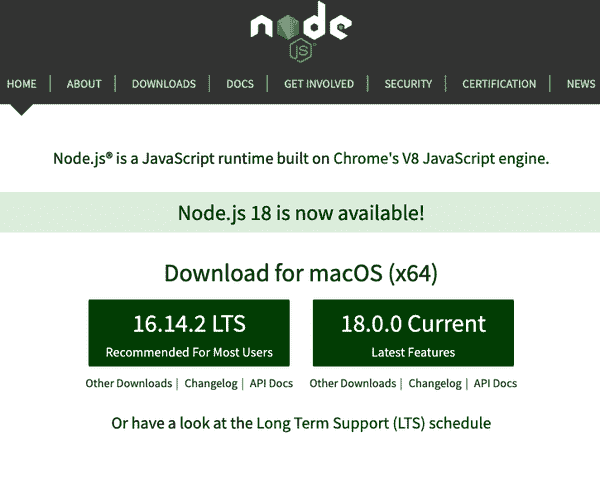
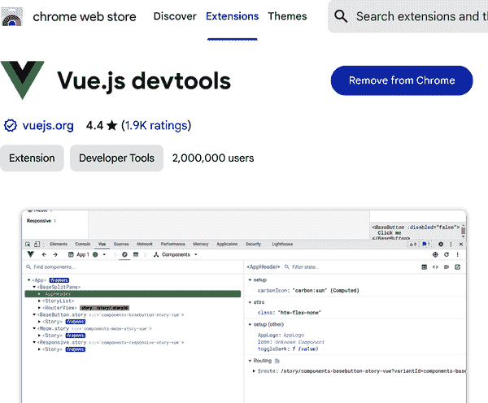
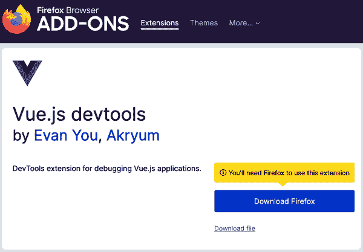
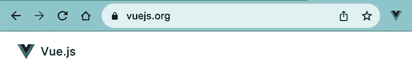
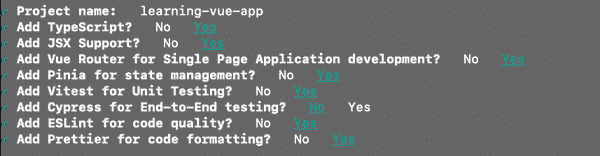
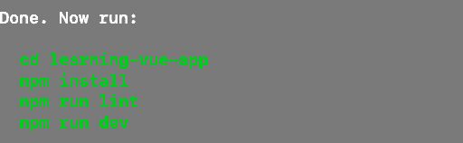
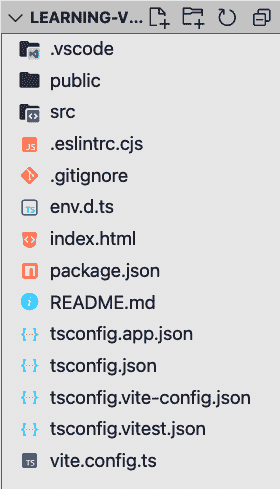

# 第一章：欢迎来到 Vue.js 的世界！

Vue.js 最初发布于 2014 年，特别是在 2018 年迅速被广泛采用。Vue 在开发者社区中非常受欢迎，这要归功于其易用性和灵活性。如果您正在寻找一个出色的工具来构建和发布优秀性能的 Web 应用程序给最终用户，Vue.js 就是您的答案。

本章突出介绍了 Vue.js 的核心概念，并引导您了解您的 Vue.js 开发环境所需的工具。它还探讨了使您的 Vue.js 开发过程更加可管理的有用工具。通过本章的学习，您将拥有一个简单的 Vue.js 应用程序的工作环境，准备好开始学习 Vue.js 的旅程。

# Vue.js 是什么？

Vue.js，或简称 Vue，在法语中意为视图；它是一个用于构建前端应用程序中渐进式、可组合和响应式 *用户界面*（UI）的 JavaScript 引擎。

###### 注

从现在开始，我们将使用 Vue 来表示 Vue.js。

Vue 基于 JavaScript 编写，并提供了一种组织机制来构建和组织 Web 应用程序。它还作为转译器，在部署前将 Vue 代码（作为单文件组件，我们将在“Vue 单文件组件结构”中进一步讨论）编译和转换为等效的 HTML、CSS 和 JavaScript 代码。在独立模式下（使用生成的脚本文件），Vue 引擎会在运行时执行代码转换。

Vue 遵循 MVVM（*Model–View–ViewModel*）模式。与 [MVC（*Model–View–Controller*）](https://oreil.ly/GHu2u)^(1) 不同，ViewModel 是将数据绑定在视图和模型之间的绑定器。允许视图和模型之间的直接通信，逐步实现组件的响应性。

简言之，Vue 被创建的目的是专注于视图层，但可以逐步适应与其他外部库集成，以实现更复杂的用途。

由于 Vue 专注于视图层，它能够推动单页面应用程序（SPA）的开发。SPA 可以快速、流畅地移动，并且可以持续与后端通信数据。

[Vue 官方网站](https://oreil.ly/03RbI)包含 API 文档、安装指南以及主要用例供参考。

# Vue 在现代 Web 开发中的优势

Vue 的显著优势在于其写作清晰易懂的文档。此外，围绕 Vue 构建的生态系统和支持社区，如 Vue Router、Vuex 和 Pinia，帮助开发者以最小的努力设置和运行其项目。

Vue 的 API 直接明了，对于之前使用过 AngularJS 或 jQuery 的开发者来说非常熟悉。其强大的模板语法最大程度地减少了学习成本，并且使得在应用程序中处理数据或监听文档对象模型（DOM）事件变得更加容易。

Vue 提供的另一个显著优势是其大小。框架的大小是应用性能的重要因素，特别是交付时的初始加载时间。在撰写本文时，Vue 是最快和最轻量级的框架（约 10kB 的大小）。这一优势导致下载时间较短，并从浏览器的角度提供更好的运行时性能。

随着 Vue 3 的发布，内置对 TypeScript 的支持现在为开发人员提供了类型输入的好处，并使其代码库在长期内更易读、组织和维护。

# 安装 Node.js

使用 Vue 需要设置开发生态系统和先前的编码知识以跟上学习过程。在开始任何应用程序开发之前，安装 Node.js 和 NPM（或 Yarn）是必要的开发工具。

Node.js（或 Node）是建立在 Chrome 的 V8 JavaScript 运行时引擎上的开源 JavaScript 服务器环境。Node 允许开发人员在本地或托管服务器上编写和运行 JavaScript 应用程序，而无需浏览器。

###### 注意

基于 Chromium 的浏览器（如 Chrome 和 Edge）也使用 V8 引擎将 JavaScript 代码解释为高效的低级计算机代码并执行。

Node 是跨平台支持的，安装也很容易。如果您不确定是否已安装 Node，请打开您的终端（或 Windows 中的命令提示符），并运行以下命令：

```
node -v
```

输出应该是一个 Node 版本，如果未安装 Node，则显示“命令未找到”。

如果您尚未安装 Node，或者您的 Node 版本*低于*12.2.0，请访问[Node 项目网站](https://oreil.ly/E6xr-)，根据您的操作系统下载最新版本的安装程序（见图 1-1）。

下载完成后，单击安装程序并按照说明进行设置。

安装 Node 时，除了`node`命令外，还会将`npm`命令添加到命令行工具中。如果您输入`node -v`命令，应该会显示安装的版本号。



###### 图 1-1\. Node 官方网站上的最新版本下载

## NPM

Node 包管理器（NPM）是 Node 的默认包管理器。它会随 Node.js 一起安装。它允许开发人员轻松下载和安装其他远程 Node 包。Vue 和其他前端框架是有用的 Node 包的示例。

NPM 是开发复杂 JavaScript 应用程序的强大工具，具有创建和运行任务脚本（例如启动本地开发服务器）以及自动下载项目包依赖项的能力。

类似于 Node 版本检查，您可以通过`npm`命令执行 NPM 版本检查：

```
npm -v
```

要更新您的 NPM 版本，请使用以下命令：

```
npm install npm@latest -g
```

使用参数`@latest`，你的当前 NPM 工具会自动将其版本更新到最新版。你可以再次运行`npm -v`来确保它已正确更新。你也可以替换`latest`为任何指定的 NPM 版本（格式为`xx.x.x`）。此外，你需要使用`-g`标志指示全局范围内的安装，以便在本地计算机的任何位置使用`npm`命令。例如，如果你运行命令`npm install npm@6.13.4 -g`，该工具将会针对 NPM 包版本 6.13.4 进行安装和更新。

# 本书中的 NPM 版本

我建议安装 NPM 版本 7.x，以便能够在本书中遵循所有的 NPM 代码示例。

一个 Node 项目依赖于一组 Node 包[²]（或依赖项），以便运行。在项目目录中的*package.json*文件中，你可以找到这些已安装的包。这个*package.json*文件还描述了项目，包括名称、作者（们）以及其他专门应用于项目的脚本命令。

当你在项目文件夹内运行命令`npm install`（或`npm i`）时，NPM 将参考此文件，并将所有列出的包安装到一个名为*node_modules*的文件夹中，准备供项目使用。此外，它还将添加一个*package-lock.json*文件，以跟踪安装的包版本和常见依赖之间的兼容性。

要从头开始启动一个带有依赖项的项目，请在项目目录中使用以下命令：

```
npm init
```

此命令会引导你回答一些与项目相关的问题，并初始化一个包含你的答案的*package.json*文件的空项目。

你可以在[NPM 官方网站](https://oreil.ly/LD4W8)上搜索任何公共开源包。

## Yarn

如果 NPM 是标准的包管理工具，那么 Yarn 是由 Facebook 开发的替代性和流行的包管理器。[³] 由于其并行下载和缓存机制，Yarn 更快速、更安全、更可靠。它与所有 NPM 包兼容，因此可以作为 NPM 的即插即用替代品使用。

你可以根据你的操作系统访问[Yarn 官方网站](https://oreil.ly/TX-qT)来安装最新版本的 Yarn。

如果你正在使用 macOS 计算机并安装了 Homebrew，你可以直接使用以下命令安装 Yarn：

```
brew install yarn
```

此命令将全局安装 Yarn 和 Node.js（如果尚未安装）。

你也可以使用以下命令使用 NPM 包管理工具全局安装 Yarn：

```
npm i -g yarn
```

现在你应该已经在你的机器上安装了 Yarn 并且准备好使用了。

要检查 Yarn 是否安装并验证其版本，请使用以下命令：

```
yarn -v
```

要添加一个新的包，请使用以下命令：

```
yarn add <node package name>
```

要为一个项目安装依赖项，而不是使用`npm install`，你只需要在项目目录中运行`yarn`命令。一旦完成，类似于 NPM，Yarn 也会在你的项目目录中添加一个*yarn.lock*文件。

###### 注意

在本书中提供的代码中，我们将使用 Yarn 作为我们的包管理工具。

到目前为止，您已经设置了 Vue 开发的基本编码环境。在下一节中，我们将看看 Vue 开发者工具及其在 Vue 工作中提供的功能。

# Vue 开发者工具

Vue 开发者工具（或 Vue Devtools）是官方工具，可帮助您在本地处理 Vue 项目。这些工具包括 Chrome 和 Firefox 的扩展，以及其他浏览器的 Electron 桌面应用程序。您应该在开发过程中安装其中一个工具。

Chrome 用户可以前往[Chrome Web Store](https://oreil.ly/XvXLO)中的扩展链接安装扩展，如图 1-2 所示。



###### 图 1-2\. Chrome 的 Vue Devtools 扩展页面

对于 Firefox，您可以使用[Firefox Add-on 页面](https://oreil.ly/oWT_C)中的扩展链接，如图 1-3 所示。



###### 图 1-3\. Firefox 的 Vue Devtools 扩展页面

扩展安装并启用后，您可以检测当前是否有任何网站在生产中使用 Vue。当一个站点使用 Vue 构建时，浏览器工具栏上的 Vue 图标将突出显示，如图 1-4 所示。



###### 图 1-4\. 图标确认 Vue 官方网站是由 Vue 构建的

Vue Devtools 允许您在浏览器的开发者控制台中检查 Vue 组件树、组件 props 和数据、事件以及路由信息。Vue Devtools 将信息分成各种选项卡，为调试和检查项目中任何 Vue 组件的行为提供有益的见解。

# Vite.js 作为构建管理工具

Vite.js（或简称 Vite）是一个 JavaScript 开发服务器，于 2020 年推出，开发过程中使用原生 ES 模块^(4) 导入，而不像 Webpack、Rollup 等将您的代码打包成 JavaScript 文件块。

###### 注意

从现在开始，我们将使用术语 Vite 来指代 Vite.js。

这种方法允许 Vite 在开发过程中以极快的速度进行热重载^(5)，使开发体验更加流畅。它还提供许多开箱即用的功能，如对 TypeScript 的支持和按需编译，快速在开发者社区中获得了广泛的认可和适应。

Vue 社区已将 Vue CLI 工具^(6)（使用 Webpack 作为底层）替换为 Vite，成为创建和管理 Vue 项目的默认构建工具。

# 创建一个新的 Vue 应用程序

使用 Vite，有多种方式创建新的 Vue 应用程序项目。最简单的方法是在命令提示符或终端中使用以下命令语法：

```
npm init vue@latest
```

此命令将首先安装`create-vue`，一个官方的脚手架工具，然后会提出一系列关键问题，以配置您的 Vue 应用程序。

如图 1-5 所示，本书中用于 Vue 应用程序的配置包括：

Vue 项目名称，全小写格式

Vite 使用此值在当前目录中创建一个新的项目目录。

TypeScript

基于 JavaScript 构建的类型化编程语言。

JSX^(7)

在第二章，我们将讨论 Vue 如何支持使用 JSX 标准编写代码（直接在 JavaScript 代码块中编写 HTML 语法）。

Vue Router

在第八章，我们将使用 Vue Router 实现应用程序的路由。

Pinia

在第九章，我们将讨论如何使用 Pinia 在整个应用程序中管理和共享数据。

Vitest

这是任何 Vite 项目的官方单元测试工具，我们将在第十一章进一步探讨。

ESLint

此工具根据一组 ESLint 规则检查您的代码，帮助维护您的编码标准，使其更易读，避免隐藏的编码错误。

Prettier

这个工具可以自动格式化您的代码样式，保持代码整洁、美观，并遵循编码标准。



###### 图 1-5\. 新 Vue 应用程序项目的配置

收到所需配置后，`create-vue`会相应地为项目创建脚手架。完成后，它将呈现一系列按顺序执行的命令，让您可以在本地运行项目（见图 1-6）。



###### 图 1-6\. 为新创建的项目执行的按顺序命令

接下来，我们将探索我们新创建的项目的文件结构。

# 文件存储库结构

新的 Vue 项目在`src`目录中包含以下初始结构：

`assets`

可以放置项目图像、图形和 CSS 文件的文件夹。

`components`

遵循单文件组件（SFC）概念创建和编写 Vue 组件的文件夹。

`router`

存放所有路由配置的文件夹。

`stores`

通过使用 Pinia 在存储中创建和管理项目全局数据的文件夹。

`views`

所有绑定到定义路由的 Vue 组件的文件夹。

`App.vue`

主 Vue 应用程序组件，用于承载应用程序中的所有其他 Vue 组件。

`main.ts`

包含将根组件（App.vue）挂载到 DOM 页面上的 TypeScript 代码。此文件还用于在应用程序中设置插件和第三方库，例如 Vue Router、Pinia 等。

图 1-7 展示了我们 Vue 项目的结构。



###### 图 1-7\. 我们创建的 learning-vue-app 项目的文件结构

在项目的根目录中有一个 `index.html` 文件，这是在浏览器中加载应用程序的入口点。它使用 `<script>` 标签导入 `main.ts` 文件，并为 Vue 引擎提供目标元素，通过执行 `main.ts` 中的代码加载 Vue 应用程序。在开发过程中，此文件可能保持不变。

您可以在 [专用 Github 仓库](https://github.com/mayashavin/learning-vue) 中找到所有示例代码。我们按章节组织这些代码文件。

# 概要

在本章中，我们学习了 Vue 的好处以及如何为 Vue 开发环境安装必要的工具。我们还讨论了 Vue 开发者工具和其他有效构建 Vue 项目的工具，例如 Vite。现在我们已经创建了我们的第一个 Vue 项目，准备学习 Vue 的基础知识：Vue 实例、内置指令以及 Vue 如何处理响应性。

^(1) MVC 模式通过将应用程序结构分为 UI（视图）、数据（模型）和控制逻辑（控制器）来帮助实现应用程序。虽然视图和控制器可以进行双向绑定，但只有控制器可以操作模型。

^(2) 这些通常被称为 NPM 包。

^(3) 自 2021 年以来，Facebook 已被称为 Meta。

^(4) ES 模块代表 ECMAScript 模块，自 ES6 发布以来，这是一个在 Node.js 和最近在浏览器中使用的流行标准。

^(5) 热重载自动将新的代码更改应用于正在运行的应用程序，无需重新启动应用程序或刷新页面。

^(6) Vue 命令行界面。

^(7) JavaScript XML，在 React 中常用
