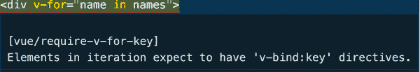

# 第二章：Vue 工作原理：基础知识

在上一章中，您学习了构建 Vue 应用程序的基本工具，并创建了第一个 Vue 应用程序，为学习通过编写 Vue 代码了解 Vue 工作原理做好了准备。

本章介绍了虚拟文档对象模型（Virtual DOM）的概念和使用 Vue 选项 API 编写 Vue 组件的基础知识。它还探讨了更多的 Vue 指令和 Vue 响应性机制。通过本章末尾，您将理解 Vue 的工作原理，并能够编写和注册用于应用程序的 Vue 组件。

# 虚拟 DOM 内部运行机制

Vue 不直接与文档对象模型（DOM）一起工作。相反，它实现了虚拟 DOM 来优化应用程序在运行时的性能。

要建立对虚拟 DOM 工作原理的扎实理解，我们首先从 DOM 的概念开始。

DOM 在 Web 上代表 HTML（或 XML）文档内容，以内存中树状数据结构的形式表示（如图 2-1 所示）。它充当一个连接网页和实际编程代码（如 JavaScript）的编程接口。HTML 文档中的标签，例如 `<div>` 或 `<section>`，在 DOM 中被表示为编程节点和对象。


###### 图 2-1\. DOM 树示例

浏览器解析 HTML 文档后，DOM 将立即可供交互使用。在任何布局更改时，浏览器会在后台持续地绘制和重绘 DOM。我们称这个过程为解析，而绘制 DOM 屏幕的过程称为光栅化或*像素到屏幕*流水线。图 2-2 展示了光栅化的工作原理：


###### 图 2-2\. 浏览器光栅化过程

## 布局更新问题

每次绘制对浏览器性能都是昂贵的。由于 DOM 可能包含许多节点，查询和更新单个或多个节点可能非常昂贵。

这里是 DOM 中 `li` 元素列表的一个简单示例：

```
<ul class="list" id="todo-list">
  <li class="list-item">To do item 1</li>
  <li class="list-item">To do item 2</li>
  <!--so on…-->
</ul>
```

添加/移除 `li` 元素或修改其内容需要使用 `document.getElementById`（或 `document.getElementsByClassName`）查询该项的 DOM。然后，您需要使用适当的 DOM API 执行所需的更新。

例如，如果您想向前面的示例中添加一个新项目，则需要执行以下步骤：

1.  通过其 `id` 属性的值查询包含的列表元素——`"todo-list"`

1.  使用 `document.createElement()` 添加新的 `li` 元素

1.  使用 `setAttribute()` 设置 `textContent` 和相关属性以匹配其他元素的标准。

1.  将该元素作为其子元素附加到步骤 1 中找到的列表元素中，使用 `appendChild()`：

```
const list = document.getElementById('todo-list');

const newItem = document.createElement('li');
newItem.setAttribute('class', 'list-item');
newItem.textContent = 'To do item 3';
list.appendChild(newItem);
```

类似地，假设您想要更改第二个 `li` 元素的文本内容为 `"购买杂货"`。那么，您需要执行第一步来获取包含的列表元素，然后使用 `getElementsByClassName()` 查询目标元素，最后将其 `textContent` 更改为新内容：

```
const secondItem = list.getElementsByClassName('list-item')[1];
secondItem.textContent = 'Buy groceries'
```

在小规模上查询和更新 DOM 通常不会对性能产生巨大影响。但是，如果在更复杂的网页上重复（在几秒钟内）进行这些操作，则可能会减慢页面。当连续进行小更新时，性能影响尤为显著。许多框架，如 Angular 1.x，在代码基础增长时未能认识和解决这个性能问题。虚拟 DOM 的设计目的就是解决布局更新问题。

## 什么是虚拟 DOM？

虚拟 DOM 是浏览器中实际 DOM 的*内存虚拟副本版本*，但它更轻量且具有额外的功能。它模仿了真实 DOM 结构，使用不同的数据结构（通常是 `Object`）（见 图 2-3）。


###### 图 2-3\. 浏览器 DOM vs. 虚拟 DOM

在幕后，虚拟 DOM 仍然使用 DOM API 在浏览器中构建和渲染更新的元素。因此，它仍会导致浏览器的重绘过程，但更高效。

简而言之，虚拟 DOM 是一个抽象模式，旨在解放 DOM 免受一切可能导致性能低下的操作，比如操纵属性、处理事件以及手动更新 DOM 元素。

## Vue 中虚拟 DOM 的工作原理

虚拟 DOM 位于真实 DOM 和 Vue 应用程序代码之间。以下是虚拟 DOM 中节点的示例：

```
const node = {
 tag: 'div',
 attributes: [{ id: 'list-container', class: 'list-container' }],
 children: [ /* an array of nodes */]
}
```

让我们称这个节点为 VNode。VNode 是虚拟 DOM 中的*虚拟节点*，表示实际 DOM 中的 DOM 元素。

通过用户界面交互，用户告诉 Vue 他们希望元素处于的状态；然后 Vue 触发虚拟 DOM 以将该元素的表示对象(`node`)更新到所需形状，并跟踪这些变化。最后，它与实际 DOM 通信，并根据变更的节点执行准确的更新。

由于虚拟 DOM 是一组自定义 JavaScript 对象的树，更新组件等同于更新自定义 JavaScript 对象。这个过程不会花费太长时间。因为我们不调用任何 DOM API，所以这个更新动作不会引起 DOM 重绘。

一旦虚拟 DOM 完成更新，它会批量与实际 DOM 同步，从而使更改反映在浏览器上。

图 2-4 展示了在添加新列表项并更改列表项文本时，虚拟 DOM 到实际 DOM 的更新过程。


###### 图 2-4\. 从虚拟 DOM 到实际 DOM 的更新，添加新元素并更新列表中现有元素的文本的过程

由于虚拟 DOM 是对象树，当修改虚拟 DOM 时，我们可以轻松地跟踪需要与实际 DOM 同步的特定更新。现在，我们不再直接查询和更新实际 DOM，而是可以在一个更新周期中调度和调用更新的 API，并通过单个渲染函数维护性能效率。

现在我们理解了虚拟 DOM 的工作原理，我们将探讨 Vue 实例和 Vue 选项 API。

# Vue 应用实例和选项 API

每个 Vue 应用程序从一个单一的 Vue 组件实例作为应用程序根开始。同一应用程序中创建的任何其他 Vue 组件都需要嵌套在此根组件中。

###### 注意

你可以在我们的 Vue 项目的`main.ts`中找到初始化代码示例。Vite 会在其脚手架过程中自动生成这段代码。

你也可以在这个文件中找到本章的示例代码。

在 Vue 2 中，Vue 为您暴露了一个`Vue`类（或 JavaScript 函数），您可以根据一组配置选项创建一个 Vue 组件实例，使用以下语法：

```
const App = {
  //component's options
}
const app = new Vue(App)
```

`Vue`接收一个组件，或者更精确地说是组件的配置。组件的配置是一个包含所有组件初始配置选项的对象。我们称这个参数结构为*选项 API*，这是 Vue 的另一个核心 API。

从 Vue 3 开始，你不能再直接调用`new Vue()`。相反，你需要使用`vue`包中的`createApp()`方法来创建应用程序实例。这种功能上的变化增强了每个 Vue 实例的隔离性，包括依赖关系和共享组件（如果有的话），并提升了代码可读性：

```
import { createApp } from 'vue'

const App = {
  //component's options
}

const app = createApp(App)
```

`createApp()`还接受一个组件配置的对象。根据这些配置，Vue 创建一个 Vue 组件实例作为其应用程序根`app`。然后，您需要使用`app.mount()`方法将根组件`app`挂载到所需的 HTML 元素上，如下所示：

```
app.mount('#app')
```

`#app`是应用程序根元素的唯一 ID 选择器。Vue 引擎使用此 ID 查询元素，将应用实例挂载到它，然后在浏览器中呈现应用程序。

下一步是提供配置，使 Vue 可以根据选项 API 构建组件实例。

###### 注意

从这一点开始，我们根据 Vue 3 API 标准编写代码。

# 探索选项 API

选项 API 是 Vue 的核心 API，用于初始化 Vue 组件。它以对象格式结构化组件的配置。

我们将其基本属性分为四个主要类别：

状态处理

包括`data()`，它返回组件的本地数据状态，`computed`，`methods`和`watch`用于对特定本地数据进行观察，以及用于传入数据的`props`。

渲染

`template`用于 HTML 视图模板，`render()`用作组件的渲染逻辑。

生命周期钩子

例如`beforeCreate()`，`created()`，`mounted()`等，用于处理组件生命周期的不同阶段。

其他

例如`provide()`，`inject()`用于处理不同组件之间的定制和通信。以及`components`，这是一组嵌套组件模板，可在组件内使用。

以下是基于选项 API 的根`App`组件的示例结构：

```
import { createApp } from 'vue'

const App = {
 template: "This is the app's entrance",
}

const app = createApp(App)
app.mount('#app')
```

在前面的代码中，HTML 模板显示了常规文本。我们还可以使用`data()`函数定义本地`data`状态，我们将在“使用数据属性创建本地状态”中进一步讨论。

您还可以重写先前的代码以使用`render()`函数：

```
import { createApp } from 'vue'

const App = {
 render() {
  return "This is the app's entrance"
 }
}

const app = createApp(App)
app.mount('#app')
```

两个代码将生成相同的结果（图 2-5）。


###### 图 2-5\. 使用选项 API 编写根组件的示例输出

如果您在浏览器的开发者工具中打开元素选项卡，您将看到实际的 DOM 现在包含一个带有`id="app"`的 div 和文本内容`*这是应用程序的入口*`（图 2-6）。


###### 图 2-6\. 浏览器中的 DOM 树包含一个包含应用程序文本内容的 div

您还可以创建一个名为`Description`的新组件，用于呈现静态文本，并将其传递给`App`的`components`。然后您可以在`template`中将其作为嵌套组件使用，如示例 2-1 所示。

##### 示例 2-1\. 声明一个内部组件模板以在`App`中使用

```
import { createApp } from 'vue'

const Description = {
 template: "This is the app's entrance"
};

const App = {
 components: { Description },
 template: '<Description />'
}

const app = createApp(App)
app.mount('#app')
```

输出与图 2-6 中相同。

注意这里必须声明`template`或`render()`函数（参见“渲染函数和 JSX”）用于组件。但是，如果您按照单文件组件（SFC）标准编写组件，则不需要这些属性。我们将在第三章中讨论这个组件标准。

接下来，让我们看看`template`属性的语法。

# 模板语法

在 Options API 中，`template`接受一个包含有效 HTML 代码的字符串，表示组件的 UI 布局。Vue 引擎解析此值并将其编译为优化的 JavaScript 代码，然后相应地渲染相关的 DOM 元素。

下面的代码演示了我们的根组件`App`，其布局是一个单一的`div`显示文本—`这是应用程序的入口`：

```
import { createApp } from 'vue'

const App = {
 template: "<div>This is the app's entrance</div>",
}

const app = createApp(App)
app.mount('#app')
```

对于多级 HTML 模板代码，我们可以使用反引号字符（JavaScript 模板字面量），由 `` ` `` 符号表示，并保持可读性。我们可以重写前面示例中`App`的模板，以包括其他`h1`和`h2`元素，如下所示：

```
import { createApp } from 'vue'

const App = {
 template: `
 <h1>This is the app's entrance</h1>
 <h2>We are exploring template syntax</h2>
`,
}

const app = createApp(App)
app.mount('#app')
```

Vue 引擎将使用两个标题渲染到 DOM 中（见图 2-7）。


###### 图 2-7\. 组件多级模板的输出

`template`属性语法对于使用指令和专用语法创建特定 DOM 元素与组件本地数据之间的绑定至关重要。接下来我们将探讨如何定义我们想在 UI 中显示的数据。

# 使用数据属性创建本地状态

大多数组件保持其本地状态（或本地数据）或从外部源接收数据。在 Vue 中，我们使用 Options API 的`data()`函数属性来存储组件的本地状态。

`data()`是一个匿名函数，返回表示组件本地数据状态的对象。我们称该返回的对象为*数据对象*。初始化组件实例时，Vue 引擎将此数据对象的每个属性添加到其响应系统中，以跟踪其更改并相应地触发 UI 模板的重新渲染。

简而言之，数据对象是组件的响应式状态。

要在模板中注入数据属性，我们使用*mustache*语法，用双花括号 `{{}}` 表示。在 HTML 模板中，我们在需要注入数值的地方用花括号包裹数据属性，如在示例 2-2 中所见。

##### 示例 2-2\. 注入标题以在 HTML 模板中显示

```
import { createApp } from 'vue'

type Data = {
  title: string;
}

const App = {
 template: `
 <div>{{ title }}</div>
`,
 data(): Data {
  return {
   title: 'My first Vue component'
  }
 }
}

const app = createApp(App)
app.mount('#app')
```

在前面的代码中，我们声明了本地数据属性`title`，并通过使用`{{ title }}`表达式将其值注入到`App`的模板中。DOM 中的输出等于以下代码：

```
<div>My first Vue component</div>
```

您还可以在同一元素标记内将内联静态文本与双花括号结合起来使用：

```
const App = {
 template: `
 <div>Title: {{ title }}</div>
`,
 /**... */
}
```

Vue 自动保留静态文本，并仅用正确的值替换表达式。结果等同于以下内容：

```
<div>Title: My first Vue component</div>
```

所有数据对象属性都可以直接通过组件实例`this`在组件的本地方法、计算属性和生命周期钩子中访问。例如，在使用`created()`钩子创建组件后，我们可以将`title`打印到控制台上：

```
import { createApp, type ComponentOptions } from 'vue'

const App = {
 /**... */
 created() {
  console.log((this as ComponentOptions<Data>).title)
 }
}

const app = createApp(App)
app.mount('#app')
```

###### 注意

我们将`this`转换为`ComponentOptions<Data>`类型。我们将在 “使用 defineComponent() 支持 TypeScript” 中进一步讨论如何为 Vue 3 启用完整的 TypeScript 支持。

您可以通过使用 Vue Devtools 调试数据属性的响应性。在应用程序的主页面上，打开浏览器的开发者工具，转到 Vue 选项卡，并选择检查器面板中显示的`Root`组件。一旦选择了这个组件，右侧将出现一个面板，显示组件数据对象的属性。当您悬停在`title`属性上时，会出现一个铅笔图标，允许您编辑属性值（图 2-8）。


###### 图 2-8\. 如何使用 Vue Devtools 调试和编辑数据属性

点击编辑图标按钮，修改`title`的值，然后按回车；应用程序 UI 立即反映新值。

您已经学会如何使用`data()`和双大括号`{{}}`将本地数据注入到 UI 模板中。这是一种单向数据绑定。

在我们探索 Vue 中的双向绑定和其他指令之前，让我们先了解一下 Vue 中的响应性。

# Vue 中响应性的工作原理

要理解响应性的工作原理，让我们快速看一下虚拟 DOM 如何处理所有接收到的信息，创建并跟踪创建的 VNode，然后将其传递给实际 DOM（图 2-9）。


###### 图 2-9\. 虚拟 DOM 渲染过程的流程

我们可以将前面的流程图描述如下：

1.  一旦定义了本地数据，在 Vue.js 2.0 中，内部 Vue 引擎使用 JavaScript 内置的`Object.defineProperty()`为每个相关的数据片段建立*getter 和 setter*，并启用相关的数据响应性。然而，在 Vue.js 3.0 中，Vue 引擎使用基于 ES5 代理机制的机制^(1) 来提升性能，运行时性能翻倍，内存需求减半。我们将在 第三章 中更详细地解释这种响应性机制。

1.  设置了响应式机制后，Vue 引擎使用*观察者*对象来跟踪由设置器触发的任何数据更新。观察者帮助 Vue 引擎检测更改并通过*队列*系统更新虚拟 DOM 和实际 DOM。

1.  Vue 使用队列系统来避免在短时间内无效的多次 DOM 更新。当相关组件的数据发生变化时，观察者将自身添加到队列中。Vue 引擎按照特定顺序对其进行消费。直到 Vue 引擎完成对队列中观察者的消费和刷新，即使有多个数据变化，同一组件的观察者在队列中也只存在一个。这个消费过程是通过`nextTick()` API 完成的，这是一个 Vue 函数。

1.  最后，在 Vue 引擎消费和刷新所有观察者之后，它会触发每个观察者的`run()`函数来自动更新组件的真实 DOM 和虚拟 DOM，并使应用程序渲染。

让我们进行另一个例子。这次我们使用`data()`并借助`created()`来展示应用程序中的响应性。`created()`是 Vue 引擎在创建组件实例后但在将其挂载到 DOM 元素之前触发的生命周期钩子。在这一点上，我们不会进一步讨论这个钩子，而是利用这个钩子来对数据属性`counter`执行定时器更新，使用`setInterval`：

```
import { createApp, type ComponentOptions } from 'vue'

type Data = {
  counter: number;
}

const App = {
 template: `
 <div>Counter: {{ counter }}</div>
`,
 data(): Data {
  return {
   counter: 0
  }
 },
 created() {
  const interval = setInterval(() => {
   (this as ComponentOptions<Data>).counter++
  }, 1000);

  setTimeout(() => {
   clearInterval(interval)
  }, 5000)
 }
}

const app = createApp(App)
app.mount('#app')
```

此代码每秒增加`counter`。^(2) 我们还使用`setTimeout()`来在 5 秒后清除间隔。在浏览器上，您可以看到每秒从 0 到 5 变化的显示值。最终输出将等于字符串：

```
Counter: 5
```

在理解了 Vue 中的响应性和渲染概念之后，我们准备探讨如何执行双向数据绑定。

# 使用`v-model`实现双向绑定

双向绑定指的是如何在组件逻辑和视图模板之间同步数据。当组件的数据字段在程序中改变时，新值会反映在其 UI 视图上。反之，当用户在 UI 视图上对数据字段进行更改时，组件会自动获取并保存更新后的值，保持内部逻辑和 UI 的同步。一个很好的双向绑定例子是表单输入字段。

双向数据绑定是应用开发中复杂但有益的用例。双向绑定的一个常见场景是表单输入同步。正确实现可以节省开发时间，并减少在实际 DOM 和组件数据之间维护数据一致性的复杂性。但实现双向绑定是一个挑战。

幸运的是，Vue 通过`v-model`指令使双向绑定变得更简单。将`v-model`指令绑定到组件的数据模型将自动触发在数据模型更改时更新模板，反之亦然。

语法很简单；传递给`v-model`的值是在`data`返回对象中声明的名称别名。

假设我们有一个`NameInput`组件，它从用户那里接收文本输入，具有以下`template`代码：

```
const NameInput = {
 template: `
 <label for="name">
 <input placeholder="Enter your name" id="name">
 </label>`
}
```

我们希望将接收到的输入值与名为`name`的本地数据模型同步。为此，我们在`input`元素中添加`v-model="name"`，并相应地在`data()`中声明数据模型：

```
const NameInput = {
 template: `
 <label for="name">
 Write your name:
 <input
 v-model="name"
 placeholder="Enter your name"
 id="name"
 >
 </label>`,
 data() {
  return {
   name: '',
  }
 }
}
```

当用户在运行时更改输入字段时，`name`的值也会相应更改。

要使此组件在浏览器中渲染，我们将`NameInput`添加为应用程序的组件之一：

```
import { createApp } from 'vue'

const NameInput = {
  /**... */
}

const app = createApp({
 components: { NameInput },
 template: `<NameInput />`,
})

app.mount('#app')
```

您可以通过在浏览器的开发者工具中打开 Vue 选项卡来跟踪此数据更改。在检查器选项卡中，找到并选择`Root`元素下的`NameInput`元素，您将在 Vue 选项卡的右侧面板上看到组件的数据显示（图 2-10）。


###### 图 2-10\. 使用 Vue 选项卡在开发者工具中调试输入组件

当您更改输入字段时，右侧 Vue 选项卡下的`data`中的`name`属性也会得到更新的值（图 2-11）。


###### 图 2-11\. 输入值更改与相关组件的数据模型同步

您可以使用相同的方法构建包含多个选项的清单。在这种情况下，您需要将数据模型声明为`Array`并在每个复选框输入字段上添加`v-model`绑定。示例 2-3 演示了如何为`CourseChecklist`设置。

##### 示例 2-3\. 使用`v-model`和复选框输入创建课程清单

```
import { createApp } from 'vue'

const CourseChecklist = {
 template: `
 <div>The course checklist: {{list.join(', ')}}</div>
 <div>
 <label for="chapter1">
 <input
 v-model="list"
 type="checkbox"
 value="chapter01"
 id="chapter1"
 >
 Chapter 1
 </label>
 <label for="chapter2">
 <input
 v-model="list"
 type="checkbox"
 value="chapter02"
 id="chapter2"
 >
 Chapter 2
 </label>
 <label for="chapter3">
 <input
 v-model="list"
 type="checkbox"
 value="chapter03"
 id="chapter3"
 >
 Chapter 3
 </label>
 </div>
 `,
 data() {
  return {
   list: [],
  }
 }
}

const app = createApp({
 components: { CourseChecklist },
 template: `<CourseChecklist />`,
})

app.mount('#app')
```

根据用户的交互，Vue 会自动将输入值添加或从`list`数组中移除（图 2-12）。


###### 图 2-12\. 用户进行选择后列表值的屏幕截图

# 使用 v-model.lazy 修饰符

在用户每次按键时更新数据值可能会过于频繁，特别是在其他位置显示输入值时。请记住，Vue 会根据数据更改重新渲染模板 UI。通过使用`v-model.lazy`修饰符而不是常规的`v-model`来绑定数据模型，可以减少此开销：

```
const NameInput = {
 template: `
 <label for="name">
 Write your name:
 <input
 v-model.lazy="name"
 placeholder="Enter your name"
 id="name"
 >
 </label>`,
 data() {
  return {
   name: '',
  }
 }
}
```

此修饰符确保`v-model`仅跟踪由该输入元素的`onChange`事件触发的更改。

# 使用`v-model.number`和`v-model.trim`修饰符

如果要绑定到`v-model`的数据模型应为数字类型，则可以使用修饰符`v-model.number`将输入值转换为数字。

同样地，如果你想确保字符串数据模型没有尾随的空白字符，你可以使用`v-model.trim`。

这就是双向绑定的全部内容。接下来我们将详细讨论更常见的指令`v-bind`，用于单向绑定。

# 绑定响应数据和传递 Props 数据与 v-bind

之前我们学习了使用`v-model`进行双向绑定，使用双大括号`{{}}`进行单向数据注入。但是要将数据进行单向绑定到另一个元素的属性值或其他 Vue 组件的 props，我们使用`v-bind`。

`v-bind`，以`:`表示，是任何应用程序中最常用的 Vue 指令。我们可以将元素的属性（或组件的 props）或更多绑定到 JavaScript 表达式，遵循以下语法：

```
v-bind:<attribute>="<expression>"
```

或者，使用`: `语法：

```
:<attribute>="<expression>"
```

例如，我们有`imageSrc`数据，一个图片的 URL。为了使用``标签显示图片，我们对其`src`属性执行以下绑定：

##### 示例 2-4\. 绑定图片的源

```
import { createVue } from 'vue'

const App = {
 template: `
 
 `,
 data() {
  return {
   imageSrc: "https://res.cloudinary.com/mayashavin/image/upload/TheCute%20Cat"
  }
 }
}

const app = createApp(App)

app.mount('#app')
```

Vue 获取`imageSrc`的值并将其绑定到`src`属性，从而在 DOM 上生成如下的代码：

```

```

当`imageSrc`的值发生变化时，Vue 会更新`src`。

你也可以将`v-bind`作为独立属性添加到元素上。`v-bind`接受一个包含要绑定的所有属性和它们值的表达式的对象。示例 2-5 重新编写示例 2-4 以演示此用例：

##### 示例 2-5\. 使用对象将源和 alt 文本绑定到图片

```
import { createVue } from 'vue'

const App = {
 template: `
 
 `,
 data() {
  return {
   image: {
    src: "https://res.cloudinary.com/mayashavin/image/upload/TheCute%20Cat",
    alt: "A random cute cate image"
   }
  }
 }
}

const app = createApp(App)

app.mount('#app')
```

在示例 2-5 中，我们绑定一个对象`image`，包含两个属性，`src`表示图片的 URL，`alt`表示其 alt 文本，绑定到``元素上。Vue 引擎将自动根据属性名称解析`image`为相应的属性，并在 DOM 中生成以下 HTML 代码：

```

```

# 绑定到 Class 和 Style 属性

当绑定到`class`或`style`属性时，你可以以数组或对象类型传递表达式。Vue 引擎知道如何解析并将它们合并为适当的样式或类名字符串。

例如，在示例 2-5 中给我们的`img`添加一些类：

```
import { createVue } from 'vue'

const App = {
 template: `
 
 `,
 data() {
  return {
   image: {
    src: "https://res.cloudinary.com/mayashavin/image/upload/TheCute%20Cat",
    alt: "A random cute cate image",
    class: ["cat", "image"]
   }
  }
 }
}

const app = createApp(App)

app.mount('#app')
```

这段代码生成了一个``元素，类名为单个字符串`"cat image"`，如下所示：

```

```

你还可以通过将`class`属性绑定到一个对象来执行动态类名绑定，对象的属性值根据布尔型数据值`isVisible`而定：

```
import { createVue } from 'vue'

const isVisible = true;

const App = {
 template: `
 
 `,
 data() {
  return {
   image: {
    src: "https://res.cloudinary.com/mayashavin/image/upload/TheCute%20Cat",
    alt: "A random cute cate image",
    class: {
     cat: isVisible,
     image: !isVisible
     }
   }
  }
 }
}

const app = createApp(App)

app.mount('#app')
```

这里我们定义了`img`元素，当`isVisible`为`true`时具有`cat`类，否则具有`image`类。当`isVisible`为`true`时生成的 DOM 元素现在是：

```

```

当`isVisible`为`false`时，输出与之类似，但`class`名为`image`而非`cat`。

你可以使用相同的方法处理`style`属性，或者传递一个包含以驼峰格式命名的 CSS 规则的对象。例如，在示例 2-5 中给我们的图片添加一些边距：

```
import { createVue } from 'vue'

const App = {
 template: `
 
 `,
 data() {
  return {
   image: {
    src: "https://res.cloudinary.com/mayashavin/image/upload/TheCute%20Cat",
    alt: "A random cute cate image",
    style: {
     marginBlock: '10px',
     marginInline: '15px'
    }
   }
  }
 }
}

const app = createApp(App)

app.mount('#app')
```

这段代码为`img`元素生成内联样式，应用了`margin-block: 10px`和`margin-inline: 15px`。

你也可以将几个样式对象合并为一个单独的`style`数组。Vue 知道如何将它们统一成一个单一的样式规则字符串，如下所示：

```
import { createVue } from 'vue'

const App = {
 template: `
 
 `,
 data() {
  return {
   image: {
    src: "https://res.cloudinary.com/mayashavin/image/upload/TheCute%20Cat",
    alt: "A random cute cate image",
    style: [{
     marginBlock: "10px",
     marginInline: "15px"
    }, {
     padding: "10px"
    }]
   }
  }
 }
}

const app = createApp(App)

app.mount('#app')
```

输出的 DOM 元素将是：

```

```

# 使用 v-bind 进行样式绑定

通常来说，内联样式并不是一个良好的实践。因此，我不推荐使用`v-bind`来组织组件的样式。我们将在第三章中讨论在 Vue 中正确处理样式的方法。

接下来，让我们在 Vue 组件中遍历一个数据集合。

# 使用 v-for 遍历数据集合

动态列表渲染对于减少重复代码、增加代码可重用性以及保持类似元素类型组的格式一致性至关重要。例如文章列表、活跃用户和你关注的 TikTok 账号列表。在这些示例中，数据是动态的，而内容类型和 UI 布局保持相似。

Vue 提供了`v-for`指令，用于完成对迭代数据集（如数组或对象）的迭代目标。我们可以直接在元素上使用该指令，遵循以下语法：

```
v-for = "elem in list"
```

`elem`只是数据源`list`中每个元素的别名。

例如，如果我们想要遍历一个数字数组`[1, 2, 3, 4, 5]`并打印出元素的值，我们可以使用以下代码：

```
import { createApp } from 'vue'

const List = {
 template: `
 <ul>
 <li v-for="number in numbers" :key="number">{{number}}</li>
 </ul>
 `,
 data() {
  return {
   numbers: [1, 2, 3, 4, 5]
  };
 }
};

const app = createApp({
 components: { List },
 template: `<List />`
})

app.mount('#app')
```

这段代码等同于编写以下的原生 HTML 代码：

```
<ul>
 <li>1</li>
 <li>2</li>
 <li>3</li>
 <li>4</li>
 <li>5</li>
</ul>
```

使用`v-for`的一个重要优势是保持模板的一致性，并动态地将数据内容映射到相关元素，无论数据源如何随时间变化。

每个由`v-for`迭代生成的块都可以访问其他组件的数据和特定的列表项。例如，可以看示例 2-6。

##### 示例 2-6\. 使用`v-for`编写任务列表组件

```
import { createApp } from 'vue'

const List = {
 template: `
 <ul>
 <li v-for="task in tasks" :key="task.id">
 {{title}}: {{task.description}}
 </li>
 </ul>
 `,
 data() {
  return {
   tasks: [{
    id: 'task01',
    description: 'Buy groceries',
   }, {
    id: 'task02',
    description: 'Do laundry',
   }, {
    id: 'task03',
    description: 'Watch Moonknight',
   }],
   title: 'Task'
  }
 }
}

const app = createApp({
 components: { List },
 template: `<List />`
})

app.mount('#app')
```

图 2-13 显示了输出：


###### 图 2-13\. 每行具有默认标题的任务列表输出

# 保持唯一性与键属性

在这里，我们*必须*为每个迭代的元素定义一个唯一的`key`属性。Vue 使用此属性来跟踪每个渲染的元素，以便后续更新。有关其重要性的讨论，请参见“使用 Key 属性使元素绑定唯一”。

此外，`v-for`支持一个可选的第二个参数`index`，表示当前元素在迭代集合中的索引位置。我们可以如下重写示例 2-6：

```
import { createApp } from 'vue'

const List = {
 template: `
 <ul>
 <li v-for="(task, index) in tasks" :key="task.id">
 {{title}} {{index}}: {{task.description}}
 </li>
 </ul>
 `,
 //...
}

//...
```

这段代码块生成以下输出（图 2-14）：


###### 图 2-14\. 每个任务索引输出的任务列表

到目前为止，我们已经涵盖了数组集合的迭代。接下来让我们看看如何遍历对象的属性。

## 遍历对象属性

在 JavaScript 中，`Object`是一种*键值映射表*类型，其中每个对象属性都是表的*唯一键*。要遍历对象的属性，我们使用与数组迭代类似的语法：

```
v-for = "(value, name) in collection"
```

这里，`value`表示属性的值，`name`表示属性的键。

下面展示了如何遍历对象集合的属性，并根据格式`<name>: <value>`打印出每个属性的`name`和`value`：

```
import { createApp } from 'vue'

const Collection = {
 data() {
  return {
   collection: { 
    title: 'Watch Moonknight',
    description: 'Log in to Disney+ and watch all the chapters',
    priority: '5'
   }
  }
 },
 template: ` <ul>
  <li v-for="(value, name) in collection" :key="name">  {{name}}: {{value}}
  </li>
 </ul> `,
}

const app = createApp({
 components: { Collection },
 template: `<Collection />`
})

app.mount('#app')
```


定义一个包含三个属性`title`、`description`和`priority`的`collection`对象。


遍历`collection`属性。

图 2-15 显示了输出。


###### 图 2-15\. 默认标题的集合对象输出。

我们仍然可以访问当前对的索引外观作为第三个参数，如以下语法所示：

```
v-for = “(value, name, index) in collection”
```

如前所述，我们总是必须为每个迭代元素定义`key`属性值。该属性在使元素更新绑定唯一方面非常重要。接下来我们将探讨`key`属性。

## 使用`key`属性使元素绑定唯一。

Vue 引擎通过一种简单的就地修补策略跟踪和更新使用`v-for`渲染的元素。然而，在各种场景中，我们需要完全控制列表重新排序或防止列表元素依赖其子组件状态时出现不希望的行为。

Vue 提供了一个额外的属性：`key`，作为*每个节点元素的唯一标识符*，绑定到特定的迭代列表项。Vue 引擎将其用作提示，以跟踪、重用和重新排序渲染的节点及其嵌套元素，而不是直接修补。

`key`属性的语法用法很简单。我们使用`v-bind:key`（简写为`:key`），并为该列表元素绑定一个*唯一*值：

```
<div v-for="(value, name, index) in collection" :key="index">
```

# 保持`key`的唯一性。

`key`应该是项目的*唯一标识符*（id）或列表中的*外观索引*。

作为良好的实践，使用`v-for`时必须始终提供`key`属性。

然而，如果没有提供`key`，Vue 会在浏览器控制台上抛出警告。此外，如果在应用程序中启用了 ESLint，它会抛出错误并立即警告您缺少`key`属性，如图 2-16 所示。



###### 图 2-16\. 当没有提供`key`时的 ESLint 警告

# `key`属性的有效值

`key`应为字符串或数字值。对象或数组*不是*有效的键使用。

`key`属性非常有用，甚至超出了`v-for`的范围。没有`key`属性，无法应用内置的列表过渡和动画效果。我们将在第八章进一步讨论`key`的好处。

# 使用`v-on`为元素添加事件监听器

为了将 DOM 事件绑定到监听器，Vue 为元素标签暴露了内置指令`v-on`（缩写为`@`）。`v-on`指令接受以下值类型：

+   一些内联的 JavaScript 语句，形式为字符串

+   在`methods`属性下声明的组件选项中的组件方法名称

我们使用以下格式与`v-on`一起使用：

```
v-on:<event>= “<inline JavaScript code / name of method>”
```

或者使用较短版本的`@`：

```
@<event>=”<inline JavaScript code / name of method>”
```

###### 注意

从现在起，我们将使用`@`来表示`v-on`。

然后直接在任何元素上作为属性添加该指令：

```
<button @click= "printMsg='Button is clicked!'">
Click me
</button>
```

为了代码可读性，特别是在复杂的代码库中，建议将 JavaScript 表达式保持在组件方法内部，并通过其名称在指令上公开使用，如示例 2-7。

##### 示例 2-7\. 使用`v-on`指令在按钮点击时改变`printMsg`的值

```
import { createApp, type ComponentOptions } from 'vue'

type Data = {
  printMsg: string;
}

const App = {
 template: `
 <button @click="printMessage">Click me</button>
 <div>{{ printMsg }}</div>
 `,
 methods: {
  printMessage() {
   (this as ComponentOptions<Data>).printMsg = "Button is clicked!"
  }
 },
 data(): Data {
  return {
   printMsg: "Nothing to print yet!",
  }
 }
}

const app = createApp(App)

app.mount("#app");
```

如果用户尚未点击按钮，则按钮下方的显示消息将是“尚未打印任何内容”（见图 2-17）。


###### 图 2-17\. 默认显示“尚未打印任何内容”消息

否则，消息将变成“按钮已点击！”（见图 2-18）。


###### 图 2-18\. 用户点击按钮后显示“按钮已点击！”消息

## 使用`v-on`事件修饰符处理事件

在浏览器将事件分派到目标元素之前，它会使用当前 DOM 树结构构建该事件的传播路径列表。此路径的最后一个节点是目标元素本身，前面的节点依次是其祖先。一旦分派，事件将通过一个或所有三个主要事件阶段传播（见图 2-19）：

捕获（或捕获阶段）

事件从顶层祖先元素传播到目标元素。

目标

事件在目标元素上。

冒泡

事件从目标元素向上冒泡到其祖先。

我们通常在监听器逻辑内部通过编程干预事件传播流程。利用`v-on`的修饰符，我们可以直接干预指令级别。

使用以下格式跟随`v-on`修饰符：

```
v-on:<event>.<modifier>
```


###### 图 2-19\. 点击事件传播流程图

修饰符的一个优势是使监听器尽可能通用和可重用。我们无需在内部担心特定于事件的细节，如`preventDefault`或`stopPropagation`。

参考示例 2-8。

##### 示例 2-8\. 使用`stopPropagation()`手动停止事件传播

```
const App = {
 template: `
 <button @click="printMessage">Click me</button>
 `,
 methods: {
  printMessage(e: Event) {
   if (e) {
    e.stopPropagation()
   }

   console.log("Button is clicked!")
  }
 },
}
```

在这里，我们需要自己使用`e.stopPropagation`停止事件传播，添加另一个验证层确保`e`存在。示例 2-9 展示了我们如何使用`@click.stop`修饰符重写示例 2-8。

##### 示例 2-9\. 使用`@click.stop`修饰符停止事件传播

```
const App = {
 template: `
 <button @click.stop="printMessage">Click me</button>
 `,
 methods: {
  printMessage() {
   console.log("Button is clicked!")
  }
 },
}
```

表 2-1 显示了可用的事件修饰符的完整列表，并简要解释了等效的事件功能或行为。

表 2-1\. `v-on`指令的事件修饰符

| Modifier | Description |
| --- | --- |
| `.stop` | 而不是调用`event.stopPropagation()` |
| `.prevent` | 而不是调用`event.preventDefault()` |
| `.self` | 仅当事件的目标是我们附加监听器的元素时才触发事件监听器。 |
| `.once` | 最多触发一次事件监听器 |
| `.capture` | 而不是将`{ capture: true }`作为`addEventListener()`的第三个参数传递，或者在元素上添加`capture="true"`。这个修饰符以*捕获阶段*的顺序触发监听器，而不是常规的冒泡阶段顺序。 |
| `.passive` | 主要是为了选择*更好的滚动性能*并防止触发`event.preventDefault()`。我们使用它来代替将`{ passive: true }`作为`addEventListener()`的第三个参数传递，或者在元素上添加`passive="true"`。 |

# 修饰符链式调用

事件修饰符支持链式调用。这意味着你可以在元素标签上写诸如`@click.stop.prevent="printMessage">`的表达式。此表达式相当于在事件处理程序中依次调用`event.stopPropagation()`和`event.preventDefault()`。

## 使用键码修饰符检测键盘事件

虽然事件修饰符用于干预事件传播流程，*键修饰符*帮助检测键盘事件的特殊键，如`keyup`、`keydown`和`keypress`。

通常，要检测特定的键，我们需要执行两个步骤：

1.  识别键码、`key`或由该键表示的`code`。例如，`Enter`键的`keyCode`是 13，其`key`是`Enter`，其`code`是`Enter`。

1.  在触发事件处理程序时，我们需要在处理程序内部手动检查`event.keyCode`（或`event.code`或`event.key`）是否与目标键码匹配。

这种方法不适合在大型代码库中维护可重用和清晰的代码。`v-on`提供了内置的键修饰符作为更好的选择。如果我们想要检测用户是否按下了*Enter*键，我们可以在相关的`keydown`事件上添加修饰符`.enter`，使用事件修饰符时遵循相同的语法。

假设我们有一个输入元素，当用户按*Enter*键时，我们会在控制台记录一条消息，如示例 2-10 所示。

##### 示例 2-10\. 手动检查`keyCode`是否为 13 表示 Enter 键

```
const App = {
 template: `<input @keydown="onEnter" >`,
 methods: {
  onEnter(e: KeyboardEvent) {
   if (e.keyCode === '13') {
    console.log('User pressed Enter!')
   }

   /*...*/
  }
 }
}
```

现在我们可以用`@keydown.enter`来重写它。

##### 示例 2-11\. 使用 `@keydown.enter` 修饰符检查 Enter 键是否按下

```
const App = {
 template: `<input @keydown.enter="onEnter" >`,
 methods: {
  onEnter(e: KeyboardEvent) {
    console.log('User pressed Enter!')
   /*...*/
  }
 }
}
```

应用在两种情况下的应用程序行为相同。

几个其他常用的关键修饰符是`.tab`、`.delete`、`.esc`和`.space`。

另一个常见用例是捕获特殊键组合，例如 *Ctrl & Enter*（MacOS 上的 *CMD & Enter*）或 *Shift + S*。在这些场景中，我们将*系统*键修饰符（`.shift`、`.ctrl`、`.alt` 和 MacOS 中的 `.meta` 用于 *CMD* 键）与*键码*修饰符链接起来，就像以下示例中所示：

```
<!-- Ctrl + Enter -->
<input @keyup.ctrl.13=”onCtrlEnter”>
```

或者在按下 `S` 键（`keyCode` 为 `83`）时链式调用 Shift 修饰符和键码修饰符：

```
<!-- Shift + S -->
<input @keyup.shift.83=”onSave”>
```

# 链接系统修饰符和键码修饰符

在这种链接中，您*必须*使用键码修饰符而不是标准键修饰符，例如`.13`代替`.enter`。

此外，为了捕获触发事件的确切键组合，我们使用 `.exact` 修饰符：

```
<button @click.shift.exact=”onShiftEnter” />
```

结合 `.shift` 和 `.exact` 确保在用户仅按下 Shift 键点击按钮时触发点击事件。

# 使用 `v-if`、`v-else` 和 `v-else-if` 进行条件渲染元素

我们还可以根据需要在 DOM 中生成或删除元素，这称为*条件渲染*。

假设我们有一个布尔数据属性 `isVisible`，用于决定 Vue 是否应将文本元素渲染到 DOM 中并向用户显示。通过将 `v-if="isVisible"` 绑定到文本元素，只有当 `isVisible` 为 `true` 时才会反应性地渲染元素（参见示例 2-12）。

##### 示例 2-12\. 使用 `v-if` 的示例用法

```
import { createVue } from 'vue'

const App = {
 template: `
 <div>
 <div v-if="isVisible">I'm the text in toggle</div>
 <div>Visibility: {{isVisible}}</div>
 </div>
 `,
 data() {
  return {
   isVisible: false
  }
 }
}

const app = createApp(App)

app.mount('#app')
```

当将`isVisible`设置为`false`时，生成的 DOM 元素如下所示：

```
<div>
 <!--v-if-->
 <div>Visibility: false</div>
</div>
```

否则，文本元素将在 DOM 中可见：

```
<div>
 <div>I'm the text in toggle</div>
 <div>Visibility: true</div>
</div>
```

如果我们想要为相反条件（`isVisible` 为 `false`）渲染不同的组件，则 `v-else` 是正确的选择。与 `v-if` 不同，您无需绑定任何数据属性即可使用 `v-else`。它基于同一上下文级别中即将使用的 `v-if` 的正确条件值。

# 使用 `v-else`

`v-else` 仅在存在 `v-if` 时起作用，并且必须始终出现在链式条件渲染的最后。

例如，如示例 2-13 所示，我们可以创建一个组件，其中包含以下代码块，同时具有 `v-if` 和 `v-else`。

##### 示例 2-13\. 使用 `v-if` 和 `v-else` 进行条件显示不同文本

```
import { createVue } from 'vue'

const App = {
 template: `
 <div>
 <div v-if="isVisible">I'm the visible text</div>
 <div v-else>I'm the replacement text</div>
 </div>
 `,
 data() {
  return {
   isVisible: false
  }
 }
}

const app = createApp(App)

app.mount('#app')
```

简而言之，您可以将上述条件转换为类似的逻辑表达式：

```
<!--if isVisible is true, then render -->
<div>I'm the visible text</div>
<!-- else render -->
<div>I'm the replacement text</div>
```

就像在任何 `if…else` 逻辑表达式中一样，我们始终可以通过 `else if` 条件块扩展条件检查。此条件块等同于 `v-else-if` 指令，并且还需要一个 JavaScript 条件语句。示例 2-14 展示了当 `isVisible` 为 `false` 且 `showSubtitle` 为 `true` 时如何显示文本 `I’m the subtitle text`。

##### 示例 2-14\. 使用 `v-if`、`v-else-if` 和 `v-else` 进行条件链接

```
import { createVue } from 'vue'

const App = {
 template: `
 <div v-if="isVisible">I'm the visible text</div>
 <div v-else-if="showSubtitle">I'm the subtitle text</div>
 <div v-else>I'm the replacement text</div>
 `,
 data() {
  return {
   isVisible: false,
   showSubtitle: false,
  }
 }
}

const app = createApp(App)

app.mount('#app')
```

# `v-else-if` 的顺序

如果使用 `v-else-if`，我们*必须*将其呈现在分配了 `v-if` 属性的元素之后。

虽然使用 `v-if` 意味着有条件地渲染元素，但在需要频繁挂载/卸载元素的情况下效率并不高。

在这种情况下，最好使用 `v-show`。

# 使用 `v-show` 有条件地显示元素

与 `v-if` 不同，`v-show` 只是切换目标元素的可见性。Vue 仍然会根据条件检查的状态渲染目标元素。一旦渲染，Vue 使用 CSS 的 `display` 规则有条件地隐藏/显示元素。

我们可以参考示例 2-12，将指令从 `v-if` 更改为 `v-show`，如同示例 2-15 中那样。

##### 示例 2-15\. 使用 `v-show` 隐藏/显示元素

```
import { createVue } from 'vue'

const App = {
 template: `
 <div>
 <div v-show="isVisible">I'm the text in toggle</div>
 <div>Visibility: {{isVisible}}</div>
 </div>
 `,
 data() {
  return {
   isVisible: false
  }
 }
}

const app = createApp(App)

app.mount('#app')
```

UI 输出与使用 `v-if` 时相同。然而，在浏览器 DOM（*您可以在开发者工具的元素标签中进行调试*）中，文本元素存在于 DOM 中但对用户不可见：

```
<div>
 <div style="display: none;">I'm the text in toggle</div>
 <div>Visibility: false</div>
</div>
```

目标元素具有带有 `display:none` 的内联 `style`。当将 `isVisible` 切换为 `true` 时，Vue 将移除此内联样式。

###### 注意

如果运行时切换频率高，则 `v-show` 更有效，而如果条件不太可能改变，则 `v-if` 是终极选择。

# 使用 `v-html` 动态显示 HTML 代码

我们使用 `v-html` 将纯 HTML 代码以字符串形式动态注入到 DOM 中，例如示例 2-16。

##### 示例 2-16\. 使用 `v-html` 渲染内部 HTML 内容

```
import { createVue } from 'vue'

const App = {
 template: `
 <div v-html="innerContent" />
 `,
 data() {
  return {
   innerContent: `
 <div>Hello</div>
 `
  }
 }
}

const app = createApp(App)

app.mount('#app')
```

Vue 引擎会将指令值解析为*静态 HTML 代码*，并将其放置在 `div` 元素的 `innerHTML` 属性中。结果应如下所示：

```
<div>
 <div>Hello</div>
</div>
```

# 使用 `v-html` 存在安全问题

你应该仅用 `v-html` 渲染受信任的内容或执行服务器端渲染。

此外，有效的 HTML 字符串可以包含 `script` 标签，浏览器将触发此 `script` 标签中的代码，可能导致安全威胁。因此，不建议在客户端渲染时使用此指令。

# 使用 `v-text` 显示文本内容

`v-text` 是注入数据作为元素内容的替代方法，除了双花括号 `{{}}`。然而，与 `{{}}` 不同，如果有任何更改，Vue 不会更新渲染的文本。

当需要预定义占位文本并在组件加载完成后仅一次覆盖文本时，此指令非常有益：

```
import { createVue } from 'vue'

const App = {
 template: `
 <div v-text="text">Placeholder text</div>
 `,
 data() {
  return {
   text: `Hello World`
  }
 }
}

const app = createApp(App)

app.mount('#app')
```

Vue 将渲染应用程序，显示*占位文本*，并最终用从`text`接收到的“Hello World”替换它。

# 使用 `v-once` 和 `v-memo` 优化渲染

`v-once` 有助于渲染静态内容并保持性能不受重新渲染静态元素的影响。Vue 使用此指令渲染的元素*仅一次*，并且无论重新渲染多少次，都不会更新它。

要使用 `v-once`，直接将指令放置在元素标签上：

```
import { createVue } from 'vue'

const App = {
 template: `
 <div>
 <input v-model="name" placeholder="Enter your name" >
 </div>
 <div v-once>{{name}}</div>
 `,
 data() {
  return {
   name: 'Maya'
  }
 }
}

const app = createApp(App)

app.mount('#app')
```

在前面的示例中，Vue 为 `div` 标签仅渲染 `name` 一次，不管 `name` 从用户通过 `input` 字段和 `v-model` 接收到的值是什么，该 `div` 的内容都不会更新（见图 2-20）。


###### 图 2-20\. 尽管输入值已更改，文本保持不变

虽然 `v-once` 适用于将一组元素定义为静态内容，但我们使用 `v-memo` 条件性地记忆模板中的一部分（或组件）。

`v-memo` 接受一个 JavaScript 表达式数组作为其值。我们将其放在我们想要控制重新渲染的顶级元素上及其子元素。Vue 然后验证这些 JavaScript 条件表达式，并且仅在满足条件时触发目标元素块的重新渲染。

以渲染图像卡片库为例。假设我们有一个图像数组。每个图像是一个带有 `title`、`url` 和 `id` 的对象。用户可以通过点击卡片选择图像，选择的卡片将具有蓝色边框。

首先，让我们在组件数据对象中定义 `images` 数据数组和 `selected` 图像卡片 id：

```
const App = {
  data() {
    return {
    selected: null,
    images: [{
      id: 1,
      title: 'Cute cat',
      url:
'https://res.cloudinary.com/mayashavin/image/upload/w_100,h_100,c_thumb/TheCute%20Cat',
    }, {
      id: 2,
      title: 'Cute cat no 2',
      url:
'https://res.cloudinary.com/mayashavin/image/upload/w_100,h_100,c_thumb/cute_cat',
    }, {
      id: 3,
      title: 'Cute cat no 3',
      url:
'https://res.cloudinary.com/mayashavin/image/upload/w_100,h_100,c_thumb/cat_me',
    }, {
      id: 4,
      title: 'Just a cat',
      url:
'https://res.cloudinary.com/mayashavin/image/upload/w_100,h_100,c_thumb/cat_1',
    }]
    }
  }
}
```

然后我们为列表渲染定义布局到 `template`，添加一个条件记忆 `v-memo`，以便仅在图像项目不再选择或相反时重新渲染列表项：

```
const App = {
 template: ` <ul>
  <li
   v-for="image in images"
   :key="image.id"
   :style=" selected === image.id ? { border: '1px solid blue' } : {}"
   @click="selected = image.id"
   v-memo="[selected === image.id]"  >
   
   <div>{{image.title}}</h2>
  </li>
 </ul> `,
 data() {
  /*..*/
 }
}
```


我们设置重新渲染条件仅在检查 `selected === image.id` 的结果与先前检查结果不同时触发。

输出将类似于图 2-21。


###### 图 2-21\. 图像库输出

每次通过点击图像卡片选择图像时，Vue 只重新渲染两个项目：先前选择的项目和当前选择的项目。对于优化大型列表渲染，这个指令非常强大。

# `v-memo` 可用性

`v-memo` 仅在 Vue 3.2 及以上版本中可用。

我们已经学习了如何使用 `template` 语法编写组件和一些常见的 Vue 指令，除了 `v-slot`。我们将在 第三章 中继续讨论 `v-slot` 的强大之处。

接下来，我们将学习如何全局注册组件，使其可以在同一应用程序的其他组件中使用，而无需显式导入它们。

# 全局注册组件

使用 Options API 的 `components` 属性注册组件仅允许显式在当前组件内部使用注册的组件。任何当前组件的嵌套元素将无法使用已注册的组件。

Vue 提供了实例方法 `Vue.component()`，接收两个输入参数作为参数：

+   字符串表示组件的注册名称（别名）。

+   组件实例，无论是作为模块导入的 SFC 还是包含组件配置的对象，都遵循选项 API。

要全局注册一个组件，我们在创建的 `app` 实例上触发 `component()`，正如在 例子 2-17 中所见。

##### 例子 2-17\. 将 `MyComponent` 注册为全局组件并在 `App` 模板中使用

```
/* main.ts */
import { createApp } from 'vue'

//1\. Create the app instance
const app = createApp({
 template: '<MyComponent />'
});

//2\. Define the component
const MyComponent = {
 template: 'This is my global component'
}

//3\. Register a component globally
app.component('MyComponent', MyComponent)

app.mount('#app')
```

如果你有一个作为 SFC 文件的 `MyComponent`（见第三章），你可以将 例子 2-17 重写为以下形式：

```
/* main.ts */
import { createApp } from 'vue'
import App from './App.vue'
import MyComponent from './components/MyComponent.vue'

//1\. Create the app instance
const app = createApp(App);

//2\. Register a component globally
app.component('MyComponent', MyComponent);
```

并且 `MyComponent` 将始终在 `app` 实例内任何嵌套组件中可复用。

在每个组件文件中再次导入同一组件可能会显得重复且不方便。实际上，有时你需要在应用程序中多次重用一个组件。在这种情况下，将组件注册为全局组件是一个很好的实践。

# 摘要

本章探讨了虚拟 DOM 及其在 Vue 中实现性能目标的方法。我们学习了如何使用 JSX 和函数组件控制组件渲染，处理内置 Vue 指令，并使用它们来处理组件的本地数据以在 UI 模板上进行响应显示。我们还学习了响应性基础知识以及如何使用选项 API 和模板语法创建和注册 Vue 组件。这些是深入理解下一章节中 Vue 组件机制的基础。

^(1) 访问[JavaScript 代理文档](https://oreil.ly/SRqbn)。

^(2) 1 秒 = 1000 毫秒
