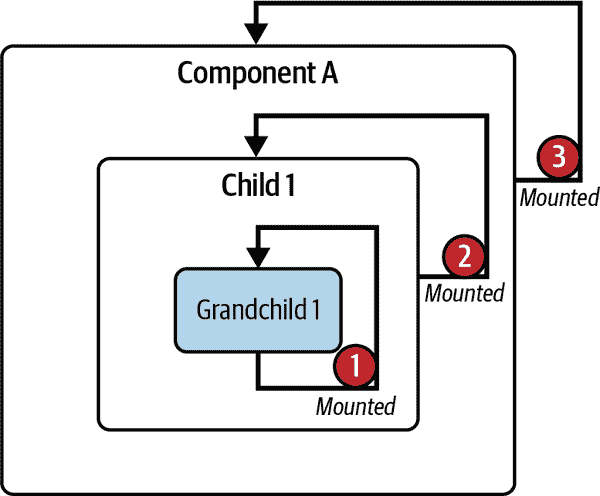

# 第三章：组合组件

在上一章中，您已经学习了 Vue 的基础知识，并使用 Options API 编写了具有常见指令的 Vue 组件。现在，您已经准备好深入探讨下一个层次：使用响应式和钩子组合更复杂的 Vue 组件。

本章介绍了 Vue 单文件组件（SFC）标准、组件生命周期钩子，以及其他高级响应式特性，如计算属性、监听器、方法和引用。您还将学习如何使用插槽来动态渲染组件的不同部分，并保持样式结构。通过本章的学习，您将能够在应用程序中编写复杂的 Vue 组件。

# Vue 单文件组件结构

Vue 引入了一种新的文件格式标准，Vue SFC，以`.vue`扩展名表示。使用 SFC，您可以在同一文件中为组件编写 HTML 模板代码、JavaScript 逻辑和 CSS 样式，每个部分都有专门的代码区域。Vue SFC 包含三个必要的代码部分：

模板

此 HTML 代码块渲染了组件的 UI 视图。它应该只在每个组件的最高级元素*一次*出现。

脚本

此 JavaScript 代码块包含组件的主要逻辑，每个组件文件最多出现*一次*。

样式

此 CSS 代码块包含组件的样式设置。它是可选的，可以根据需要出现*多次*。

示例 3-1 是名为`MyFirstComponent`的 Vue 组件的 SFC 文件结构示例。

##### 示例 3-1\. `MyFirstComponent` 组件的 SFC 结构

```
<template>
 <h2 class="heading">I am a a Vue component</h2>
</template>
<script lang="ts">
export default {
 name: 'MyFistComponent',
};
</script>
<style>
.heading {
  font-size: 16px;
}
</style>
```

我们还可以将非 SFC 组件代码重构为 SFC，如图 3-1 所示。


###### 图 3-1\. 从非 SFC 格式重构为 SFC 格式的组件

如图 3-1 所示，我们进行了以下重构：

+   将 HTML 代码作为`template`字段的字符串值移至单文件组件的`<template>`部分。

+   将`MyFirstComponent`的其余逻辑移至单文件组件的`<script>`部分，作为`export default {}`对象的一部分。

# 使用 TypeScript 的提示

您应该为 TypeScript 在`<script>`语法中添加`lang="ts"`属性，如`<script lang="ts">`，以便 Vue 引擎知道如何处理代码格式。

由于`.vue`文件格式是一种独特的扩展标准，您需要使用特殊的构建工具（编译器/转译器），如 Webpack、Rollup 等，将相关文件预编译为适合在浏览器端服务的 JavaScript 和 CSS。在使用 Vite 创建新项目时，Vite 已经将这些工具设置为脚手架过程的一部分。然后，您可以将组件作为 ES 模块导入，并声明为内部的`components`以在其他组件文件中使用。

以下是导入 `components` 目录中的 `MyFirstComponent` 并在 `App.vue` 组件中使用的示例：

```
<script lang="ts">
import MyFirstComponent from './components/MyFirstComponent.vue';

export default {
 components: {
  MyFirstComponent,
 }
}
</script>
```

如 示例 3-2 所示，您可以通过在 `template` 部分引用其名称（无论是驼峰还是蛇形命名法），来使用导入的组件：

##### 示例 3-2\. 如何使用导入的组件

```
<template>
 <my-first-component />
 <MyFirstComponent />
</template>
```

此代码将 `MyFirstComponent` 组件的内容呈现两次，如 图 3-2 所示。


###### 图 3-2\. `MyFirstComponent` 的输出

###### 注意

在 示例 3-2 中的组件 `template` 包含两个根元素。此分割能力仅在 Vue 3.x 及更高版本中可用。

我们学习了如何使用 SFC 格式创建和使用 Vue 组件。正如您所注意到的，我们在 `script` 标签中定义 `lang="ts"`，以告知 Vue 引擎我们使用了 TypeScript。因此，Vue 引擎将在组件的 `script` 和 `template` 部分对任何代码或表达式应用更严格的类型验证。

然而，为了充分享受 TypeScript 在 Vue 中的优势，我们需要在定义组件时使用 `defineComponent()` 方法，这将在下一节中学习。

# 用于 TypeScript 支持的 `defineComponent()` 方法

`defineComponent()` 方法是一个包装函数，接受一个配置对象并返回相同的东西，用于定义组件时进行类型推断。

###### 注意

`defineComponent()` 方法仅在 Vue 3.x 及更高版本中可用，并且只有在需要 TypeScript 时才相关。

示例 3-3 演示了使用 `defineComponent()` 来定义一个组件。

##### 示例 3-3\. 使用 `defineComponent()` 定义组件

```
<template>
  <h2 class="heading">{{ message }}</h2>
</template>
<script lang="ts">
import { defineComponent } from 'vue';

export default defineComponent({
  name: 'MyMessageComponent',
  data() {
    return {
      message: 'Welcome to Vue 3!'
    }
  }
});
</script>
```

如果您使用 VSCode 作为您的 IDE，并安装了 [Volar 扩展](https://oreil.ly/lmnvd)，当在 `template` 部分的 `message` 上悬停时，您将看到 `message` 的类型为 `string`，如 图 3-3 所示。


###### 图 3-3\. 在悬停时显示的 `MyMessageComponent` 的 `message` 属性的生成类型

对于复杂组件，如通过 `this` 实例访问组件属性时，应仅在需要 TypeScript 支持时使用 `defineComponent()`。否则，可以使用标准的 SFC 组件定义方法。

###### 注意

在本书中，您将看到传统组件定义方法与需要时使用 `defineComponent()` 方法的组合。您可以自由决定哪种方法更适合您。

接下来，我们将探讨组件的生命周期及其钩子函数。

# 组件生命周期钩子

Vue 组件的生命周期从 Vue 实例化组件开始，到销毁组件实例（或卸载）结束。

Vue 将组件的生命周期划分为不同阶段（图 3-4）。


###### 图 3-4\. Vue 组件生命周期流程图

初始化阶段

Vue 渲染器加载组件的选项配置，并准备创建组件实例。

创建阶段

Vue 渲染器创建组件实例。如果模板需要编译，将在继续下一个阶段之前进行额外的编译步骤。

第一次渲染阶段

Vue 渲染器在组件的 DOM 树中创建并插入组件的 DOM 节点。

挂载阶段

组件的嵌套元素已经挂载并附加到组件的 DOM 树中，如图 3-5 所示。然后 Vue 渲染器将组件附加到其父容器中。从此阶段开始，你可以访问组件的 `$el` 属性，表示其 DOM 节点。

更新阶段

仅当组件的响应式数据发生变化时才相关。在此阶段，Vue 渲染器使用新数据重新渲染组件的 DOM 节点，并执行修补更新。类似于挂载阶段，更新过程以子元素优先，然后是组件本身结束。

卸载阶段

Vue 渲染器从 DOM 中分离组件并销毁实例及其所有响应式数据效果。此阶段是生命周期的最后阶段，在应用程序中不再使用组件时发生。类似于更新和挂载阶段，组件只能在其所有子组件卸载后自行卸载。



###### 图 3-5\. 组件及其子组件的挂载顺序

Vue 允许你将一些事件附加到这些生命周期阶段之间的特定过渡，以更好地控制组件流程。我们称这些事件为生命周期钩子。Vue 中可用的生命周期钩子在以下章节中描述。

## setup

`setup` 是在组件生命周期开始前的第一个事件钩子。此钩子在 Vue 实例化组件之前运行 *一次*。在这个阶段，没有组件实例存在，因此 *无法访问* `this`：

```
export default {
  setup() {
    console.log('setup hook')
    console.log(this) // undefined
  }
}
```

###### 注意

`setup` 钩子的一个替代方案是将 `setup` 属性添加到组件的 `script` 标签部分（`<script setup>`）。

`setup` 钩子主要用于组合 API（我们将在第五章中详细学习）。其语法如下：

```
setup(props, context) {
  // ...
}
```

`setup()` 接受两个参数：

`props`

包含传递给组件的所有 props 的对象，使用组件选项对象的 `props` 字段声明。每个 `props` 的属性都是响应式数据。你不需要在 `setup()` 返回对象的一部分中返回 `props`。

`context`

包含组件上下文的非响应式对象，如 `attrs`、`slots`、`emit` 和 `expose`。

###### 注意

如果你使用 `<script setup>`，你需要使用 `defineProps()` 来定义和访问这些 props。参见 “使用 defineProps() 和 withDefaults() 声明 Props”。

`setup()` 返回一个包含组件内部响应式状态、方法和任何静态数据引用的对象。如果你使用 `<script setup>`，则不需要显式返回任何内容。Vue 在编译期间将声明在此语法内的所有变量和函数自动转换为适当的 `setup()` 返回对象。然后，你可以在模板或组件选项对象的其他部分使用 `this` 关键字访问它们。

示例 3-4 展示了使用 `setup()` 钩子来定义一个打印静态消息的组件。

##### 示例 3-4\. 使用 `setup()` 钩子定义组件

```
import { defineComponent } from 'vue';

export default defineComponent({
  setup() {
    const message = 'Welcome to Vue 3!'
    return {
      message
    }
  }
})
```

这里注意，`message` 不是响应式数据。要使其响应式，你必须使用 Composition API 中的 `ref()` 函数来包裹它。我们将在 “使用 ref() 和 reactive() 处理数据” 中详细了解这一点。此外，我们也不再需要将 `message` 定义为 `data()` 对象的一部分，从而减少了组件中不必要的响应式数据量。

或者，如同 示例 3-5 所示，你也可以使用 `<script setup>` 语法来编写前述组件。

##### 示例 3-5\. 使用 `<script setup>` 语法定义组件

```
<script setup lang='ts'>
const message = 'Welcome to Vue 3!'
</script>
```

使用 `<script setup>` 而不是 `setup()` 的一个很大的优点是它具有内置的 TypeScript 支持。因此，不再需要 `defineComponent()`，编写组件所需的代码更少。

当使用 `setup()` 钩子时，你还可以结合 `h()` 渲染函数来根据 `props` 和 `context` 参数返回组件的渲染器，就像 示例 3-6 所示的那样。

##### 示例 3-6\. 使用 `setup()` 钩子和 `h()` 渲染函数定义组件

```
import { defineComponent, h } from 'vue';

export default defineComponent({
  setup(props, context) {
    const message = 'Welcome to Vue 3!'
    return () => h('div', message)
  }
})
```

当你想要创建一个基于传递给它的 props 或无状态函数组件渲染不同静态 DOM 结构的组件时，使用 `setup()` 和 `h()` 是非常有帮助的（图 3-6 展示了在 Chrome Devtools 的 Vue 标签页中 示例 3-6 的输出）。


###### 图 3-6\. 使用 `h()` 渲染函数的无状态组件在 Vue Devtools 中的展示

###### 注意

从这一点开始，我们将使用 `<script setup>` 语法来展示组件的 `setup()` 钩子用法，因为它简单易用，在适用的情况下。

## beforeCreate

`beforeCreate` 在 Vue 渲染器创建组件实例之前运行。在这里，Vue 引擎已经初始化了组件，但还没有触发 `data()` 函数或计算任何 `computed` 属性，因此没有可用的响应式数据。

## 创建

这个钩子在 Vue 引擎创建组件实例之后运行。在这个阶段，组件实例存在具有响应式数据、观察者、计算属性和定义方法。但是，Vue 引擎尚未将其挂载到 DOM 上。

`created`钩子在组件的第一次渲染之前运行。它有助于执行需要`this`可用的任何任务，比如从外部资源加载数据到组件中。

## beforeMount

这个钩子在`created`之后运行。在这里，Vue 渲染器已经创建了组件实例并编译了其模板以在组件的第一次渲染之前进行渲染。

## mounted

这个钩子在组件第一次渲染后运行。在这个阶段，组件渲染的 DOM 节点通过++属性可以访问。您可以使用这个钩子来执行与组件 DOM 节点相关的额外副作用计算。

## beforeUpdate

当本地数据状态发生变化时，Vue 渲染器会更新组件的 DOM 树。这个钩子在更新过程开始之后运行，并且您仍然可以使用它来在内部修改组件的状态。

## updated

这个钩子在 Vue 渲染器更新组件的 DOM 树之后运行。

###### 注意

`updated`、`beforeUpdate`、`beforeMount`和`mounted`钩子在服务器端渲染（SSR）中不可用。

谨慎使用这个钩子，*因为它在组件发生任何 DOM 更新之后运行*。

# 在`updated`钩子中更新本地状态

在这个钩子中*不能*改变组件的本地数据状态。

## beforeUnmount

这个钩子在 Vue 渲染器开始卸载组件之前运行。此时，组件的 DOM 节点`$el`仍然可用。

## unmounted

这个钩子在卸载过程成功完成并且组件实例不再可用之后运行。这个钩子可以清理额外的观察者或效果，比如 DOM 事件监听器。

###### 注意

在 Vue 2.x 中，您应该分别使用`beforeDestroy`和`destroyed`来替代`beforeUnmount`和`mounted`。

`beforeUnmounted`和`unmounted`钩子在服务器端渲染（SSR）中不可用。

总之，我们可以使用生命周期钩子重新绘制组件的生命周期图，就像图 3-7 中所示。


###### 图 3-7\. Vue 组件生命周期的流程图

我们可以通过示例 3-7 中的组件来实验每个生命周期钩子的执行顺序。

##### 示例 3-7\. 生命周期钩子的控制台日志

```
<template>
    <h2 class="heading">I am {{message}}</h2>
    <input v-model="message" type="text" placeholder="Enter your name" />
</template>
<script lang="ts">
  import { defineComponent } from 'vue'

  export default defineComponent({
    name: 'MyFistComponent',
    data() {
      return {
        message: ''
      }
    },
    setup() {
      console.log('setup hook triggered!')
      return {}
    },
    beforeCreate() {
      console.log('beforeCreate hook triggered!')
    },
    created() {
      console.log('created hook triggered!')
    },
    beforeMount() {
      console.log('beforeMount hook triggered!')
    },
    mounted() {
      console.log('mounted hook triggered!')
    },
    beforeUpdate() {
      console.log('beforeUpdate hook triggered!')
    },
    updated() {
      console.log('updated hook triggered!')
    },
    beforeUnmount() {
      console.log('beforeUnmount hook triggered!')
    },
  });
</script>
```

当我们在浏览器的检查器控制台中运行此代码时，将会看到图 3-8 中显示的输出。


###### 图 3-8\. `MyFirstComponent`在第一次渲染时的控制台日志输出钩子顺序

当我们改变`message`属性的值时，组件将重新渲染，并且控制台输出如图 3-9 所示。


###### 图 3-9\. 第二次渲染仅触发`beforeUpdate`和`updated`钩子

我们还可以在 Vue Devtools 的 Timeline 标签页-性能部分中查看生命周期顺序，例如第一次渲染中的图 3-10。


###### 图 3-10\. `MyFirstComponent`在第一次渲染中的时间轴

当组件重新渲染时，Vue Devtools 标签页显示时间轴事件记录，就像图 3-11 中展示的那样。


###### 图 3-11\. `MyFirstComponent`在第二次渲染中的时间轴

每一个之前的生命周期钩子都可以提供帮助。在表 3-1 中，您将找到每个钩子的最常见用例。

表 3-1\. 为合适的目的使用合适的钩子

| 生命周期钩子 | 用例 |
| --- | --- |
| `beforeCreate` | 当需要加载外部逻辑而不修改组件数据时使用。 |
| `created` | 当需要将外部数据加载到组件中时使用。相较于`mounted`，这个钩子更适合从外部资源读取或写入数据。 |
| `mounted` | 当你需要执行任何 DOM 操作或者访问组件的 DOM 节点`this.$el`时。 |

到目前为止，我们已经了解了组件的生命周期顺序及其可用的钩子。接下来，我们将看看如何将常见的组件逻辑创建和组织成具有`method`属性的方法。

# 方法

方法是不依赖于组件数据的逻辑，尽管我们可以在方法中使用`this`实例访问组件的局部状态。组件的方法是在`methods`属性内定义的函数。正如示例 3-8 所示，我们可以定义一个方法来反转`message`属性。

##### 示例 3-8\. 定义一个方法来反转`message`属性

```
<script lang="ts">
import { defineComponent } from 'vue'

export default defineComponent({
  name: 'ReversedMessage',
  data() {
    return {
      message: '',
    };
  },
  methods: {
    reverseMessage():string {
      return this.message.split('').reverse().join('')
    },
  },
});
</script>
```

示例 3-9 展示了如何在组件的模板中使用`reverseMessage`方法。

##### 示例 3-9\. 在模板上输出反转的消息

```
<template>
  <h2 class="heading">I am {{reverseMessage()}}</h2>
  <input v-model="message" type="text" placeholder="Enter your message" />
</template>
```

当用户在浏览器中输入消息的值时，我们在图 3-12 中看到输出。


###### 图 3-12\. 基于`message`值的反转消息

您还可以修改`reverseMessage`方法，使其接受一个字符串参数，这样可以更具重用性，并减少对`this.message`的依赖，就像示例 3-10 中所示。

##### 示例 3-10\. 定义一个反转字符串的方法

```
<script lang="ts">
import { defineComponent } from 'vue'

export default defineComponent({
  name: 'MyFistComponent',
  data() {
    return {
      message: '',
    };
  },
  methods: {
    reverseMessage(message: string):string {
      return message.split('').reverse().join('')
    },
  },
});
</script>
```

在`template`部分，我们重构了示例 3-9，并将`message`作为`reverseMessage`方法的输入参数传递：

```
<template>
  <h2 class="heading">I am {{reverseMessage(message)}}</h2>
  <input v-model="message" type="text" placeholder="Enter your message" />
</template>
```

输出结果与图 3-12 中一致。

另外，我们可以在组件的其他属性或生命周期钩子中使用`this`实例触发组件的方法。例如，我们可以将`reverseMessage`拆分为两个更小的方法，`reverse()`和`arrToString()`，如下面的代码所示：

```
/**... */
  methods: {
    reverse(message: string):string[] {
      return message.split('').reverse()
    },
    arrToString(arr: string[]):string {
      return arr.join('')
    },
    reverseMessage(message: string):string {
      return this.arrToString(this.reverse(message))
    },
  },
```

方法有助于保持组件逻辑的组织性。Vue 仅在相关时触发方法（例如在模板中调用，如示例 3-9 中所示），允许我们动态地从本地数据计算新的数据值。然而，对于方法，Vue 不会缓存每次触发的结果，并且每次重新渲染时都会重新运行该方法。因此，在需要计算新数据的场景中，最好使用计算属性，接下来我们将进行探讨。

# 计算属性

计算属性是 Vue 的独特功能，允许您从组件的任何响应式数据中计算新的响应式数据属性。每个计算属性都是一个返回值的函数，并位于`computed`属性字段内。

示例 3-11 展示了我们如何定义一个新的计算属性`reversedMessage`，它以反向顺序返回组件的本地数据`message`。

##### 示例 3-11\. 返回组件本地消息的计算属性，以反向顺序返回

```
import { defineComponent } from 'vue'

export default defineComponent({
  name: 'ReversedMessage',
  data() {
    return {
      message: 'Hello Vue!'
    }
  },
  computed: {
    reversedMessage() {
      return this.message.split('').reverse().join('')
    }
  }
})
```

您可以像访问任何组件的本地数据一样访问`reversedMessage`计算属性。示例 3-12 展示了如何基于`message`的输入值输出计算得到的`reversed` `Message`。

##### 示例 3-12\. 计算属性示例

```
<template>
  <h2 class="heading">I am {{ reversedMessage }}</h2>
  <input v-model="message" type="text" placeholder="Enter your message" />
</template>
```

示例 3-12 的输出与图 3-12 相同。

您还可以在 Vue Devtools 的组件选项卡中跟踪计算属性（图 3-13）。


###### 图 3-13\. 组件选项卡中的计算属性`reversedMessage`

同样地，您可以通过`this`实例在组件逻辑中访问计算属性的值作为其本地数据属性。您还可以基于计算属性的值计算新的计算属性。如示例 3-13 所示，我们可以将`reversedMessage`属性值的长度添加到一个新的属性`reversedMessageLength`中。

##### 示例 3-13\. 添加`reversedMessageLength`计算属性

```
import { defineComponent } from 'vue'

export default defineComponent({
  /**... */
  computed: {
    reversedMessage() {
      return this.message.split('').reverse().join('')
    },
    reversedMessageLength() {
      return this.reversedMessage.length
    }
  }
})
```

Vue 引擎自动缓存计算属性的值，并仅在相关的响应式数据更改时重新计算该值。如示例 3-12 中所示，Vue 仅在`message`更改时更新`reversedMessage`计算属性的值。如果您希望在组件的其他位置显示或重用`reversedMessage`值，则 Vue 无需重新计算其值。

使用计算属性有助于将复杂数据修改组织为可重用的数据块。因此，它减少了所需的代码量并保持代码清晰，同时提高组件的性能。使用计算属性还允许您快速设置任何响应式数据属性的自动观察器，方法是将它们出现在计算属性函数的实现逻辑中。

然而，在某些情况下，此自动观察器机制可能会增加组件性能的开销。在这种情况下，我们可以考虑通过组件的`watch`属性字段使用观察器。

# **观察者**

观察者允许您以编程方式监视组件中任何响应式数据属性的变化并处理它们。每个观察器是一个函数，接收两个参数：观察数据的新值(`newValue`)和当前值(`oldValue`)。然后基于这两个输入参数执行任何逻辑。我们通过将观察器添加到组件选项的`watch`属性字段来定义响应式数据的观察器，遵循以下语法：

```
watch: {
  'reactiveDataPropertyName'(newValue, oldValue) {
    // do something
  }
}
```

您需要用目标组件的数据名称`reactiveDataPropertyName`替换它，以便观察我们想要观察的目标组件数据。

示例 3-14 展示了如何定义一个新的观察器来观察组件的本地数据`message`的变化。

##### 示例 3-14\. 一个观察器，观察组件的本地`message`的变化

```
export default {
  name: 'MyFirstComponent',
  data() {
    return {
      message: 'Hello Vue!'
    }
  },
  watch: {
    message(newValue: string, oldValue: string) {
      console.log(`new value: ${newValue}, old value: ${oldValue}`)
    }
  }
}
```

在本例中，我们定义了一个`message`观察器，它观察`message`属性的变化。当`message`的值发生变化时，Vue 引擎会触发该观察器。图 3-14 展示了此观察器的控制台日志输出。


###### 图 3-14\. 当`message`变化时的控制台日志输出

我们可以使用一个观察器在示例 3-11 中实现`reservedMessage`，观察`message`和`data()`字段，而不是使用计算属性，正如示例 3-15 中所见。

##### 示例 3-15\. 一个观察器，观察组件的本地`message`的变化，并更新`reversedMessage`的值

```
import { defineComponent } from 'vue'

export default defineComponent({
  name: 'MyFirstComponent',
  data() {
    return {
      message: 'Hello Vue!',
      reversedMessage: 'Hello Vue!'.split('').reverse().join('')
    }
  },
  watch: {
    message(newValue: string, oldValue: string) {
      this.reversedMessage = newValue.split('').reverse().join('')
    }
  }
})
```

输出结果与图 3-12 中的相同。然而，在这种特定情况下，不推荐使用此方法，因为它比使用计算属性效率低。

###### 注意

副作用是观察器或计算属性内触发的任何附加逻辑。副作用可能会影响组件的性能；您应谨慎处理它们。

您可以直接将处理程序函数分配给观察器名称。Vue 引擎将自动使用一组默认配置调用处理程序。但是，您也可以将对象传递给观察器的名称，以自定义观察器的行为，使用表 3-2 中的字段。

表 3-2\. 观察器对象的字段

| `Watcher's field` | 描述 | 接受的类型 | 默认值 | 是否必需？ |
| --- | --- | --- | --- | --- |
| `handler` | 当目标数据的值变化时触发的回调函数。 | 函数 | N/A | 是 |
| `deep` | 表示 Vue 是否应该观察目标数据（如果有）的嵌套属性的变化。 | 布尔值 | `false` | 否 |
| `immediate` | 指示是否在挂载组件后立即触发处理程序。 | 布尔值 | `false` | 否 |
| `flush` | 指示处理程序执行的时间顺序。默认情况下，Vue 在更新 Vue 组件之前触发处理程序。 | 预处理，后处理 | `pre` | 否 |

## 观察嵌套属性的变化

`deep`选项字段允许您观察所有嵌套属性的变化。例如，在一个`UserWatcherComponent`组件中有一个`user`对象数据，其中有两个嵌套属性：`name`和`age`。我们使用`deep`选项字段定义一个观察`user`对象嵌套属性变化的`user`观察器，如示例 3-16 所示。

##### 示例 3-16\. 监视器观察用户对象嵌套属性的变化

```
import { defineComponent } from 'vue'

type User = {
  name: string
  age: number
}

export default defineComponent({
  name: 'UserWatcherComponent',
  data(): { user: User } {
    return {
      user: {
        name: 'John',
        age: 30
      }
    }
  },
  watch: {
    user: {
      handler(newValue: User, oldValue: User) {
        console.log({ newValue, oldValue })
      },
      deep: true
    }
  }
})
```

正如示例 3-17 所示，在`UserWatcherComponent`组件的模板部分，我们接收`user`对象字段`name`和`age`的输入。

##### 示例 3-17\. `UserWatcherComponent`的模板部分

```
<template>
  <div>
    <div>
      <label for="name">Name:
        <input v-model="user.name" placeholder="Enter your name" id="name" />
      </label>
    </div>
    <div>
      <label for="age">Age:
        <input v-model="user.age" placeholder="Enter your age" id="age" />
      </label>
    </div>
  </div>
</template>
```

在这种情况下，当`user.name`或`user.age`的值更改时，Vue 引擎会触发`user`观察器。图 3-15 显示了当我们更改`user.name`的值时，此观察器的控制台日志输出。


###### 图 3-15\. 当用户对象的嵌套属性更改时，控制台日志输出

图 3-15 显示`user`的新值和旧值相同。这是因为`user`对象仍然是同一个实例，只有其`name`字段的值发生了变化。

此外，一旦打开`deep`标志，Vue 引擎将遍历`user`对象及其嵌套属性的所有属性，然后观察它们的变化。因此，当`user`对象结构包含更复杂的内部数据结构时，可能会导致性能问题。在这种情况下，最好指定您希望监视的哪些嵌套属性，如示例 3-18 所示。

##### 示例 3-18\. 监视用户名称变化的观察器

```
//...
export default defineComponent({
  //...
  watch: {
    'user.name': {
      handler(newValue: string, oldValue: string) {
        console.log({ newValue, oldValue })
      },
    },
  }
});
```

在这里，我们仅观察`user.name`属性的变化。图 3-16 显示了此观察器的控制台日志输出。


###### 图 3-16\. 仅当用户对象的名称更改时，控制台日志才会输出

使用点分隔路径方法，可以启用观察特定的子属性，无论其嵌套多深。例如，如果 `user` 有以下内容：

```
type User = {
  name: string;
  age: number;
  address: {
    street: string;
    city: string;
    country: string;
    zip: string;
  };
}
```

假设您需要观察 `user.address.city` 的更改；您可以通过使用 *`user.address.city`* 作为观察器名称来实现。通过采用这种方法，您可以避免深度观察带来的性能问题，并将观察器的范围缩小到仅限您需要的属性。

## 使用 `this.$watch()` 方法

在大多数情况下，`watch` 选项足以处理您的观察器需求。但是，有些情况下，当不必要时您不希望启用某些观察器。例如，您可能只想在 `user` 对象的 `address` 属性不为 `null` 时才启用 `user.address.city` 观察器。在这种情况下，您可以使用 `this.$watch()` 方法在创建组件时有条件地创建观察器。

`this.$watch()` 方法接受以下参数：

+   要观察的目标数据的名称作为字符串

+   回调函数作为观察器的处理程序，用于在目标数据的值发生变化时触发

`this.$watch()` 返回一个函数，您可以调用它来停止观察器。示例 3-19 中的代码展示了如何使用 `this.$watch()` 方法创建一个观察 `user.address.city` 的观察器。

##### 示例 3-19\. 观察 `user` 的地址中城市字段的更改的观察器

```
import { defineComponent } from "vue";
import type { WatchStopHandle } from "vue";

//... export default defineComponent({
  name: "UserWatcherComponent",
  data(): { user: User; stopWatchingAddressCity?: WatchStopHandle } {
    return {
      user: {
        name: "John",
        age: 30,
        address: {
          street: "123 Main St",
          city: "New York",
          country: "USA",
          zip: "10001",
        },
      },
      stopWatchingAddressCity: undefined, 
    };
  },
  created() {
    if (this.user.address) { 
      this.stopWatchingAddressCity = this.$watch(
        "user.address.city",
        (newValue: string, oldValue: string) => {
          console.log({ newValue, oldValue });
        }
      );
    }
  },
  beforeUnmount() {
    if (this.stopWatchingAddressCity) { 
      this.stopWatchingAddressCity();
    }
  },
});
```


定义一个 `stopWatchingAddressCity` 属性来存储观察器的返回函数。


仅当 `user` 对象的 `address` 对象属性可用时，才为 `user.address.city` 创建一个观察器。


在卸载组件之前，如果相关，则触发 `stopWatchingAddressCity` 函数以停止观察器。

采用这种方法，我们可以限制创建不必要观察器的数量，例如在 `user.address` 不存在时，对 `user.address.city` 的观察器。

接下来，我们将看一下 Vue 的另一个有趣功能，即 `slot` 组件。

# 插槽的强大之处

构建组件不仅涉及其数据和逻辑。我们经常希望保持当前组件的感觉和现有设计，但仍然允许用户修改 UI 模板的部分。在任何框架中构建可定制组件库时，这种灵活性至关重要。幸运的是，Vue 提供了 `<slot>` 组件，允许我们在需要时动态替换元素的默认 UI 设计。

例如，让我们构建一个布局组件 `ListLayout` 来渲染项目列表，每个项目的类型如下：

```
interface Item {
  id: number
  name: string
  description: string
  thumbnail?: string
}
```

对于列表中的每个项目，默认情况下，布局组件应该渲染其名称和描述，如 示例 3-20 所示。

##### 示例 3-20\. `ListLayout` 组件的第一个模板实现

```
<template>
  <ul class="list-layout">
    <li class="list-layout__item" v-for="item in items" :key="item.id">
      <div class="list-layout__item__name">{{ item.name }}</div>
      <div class="list-layout__item__description">{{ item.description }}</div>
    </li>
  </ul>
</template>
```

我们还在 `ListLayout` 的 `script` 部分定义了要渲染的项目示例列表（示例 3-21）。

##### 示例 3-21\. `ListLayout` 组件的脚本部分

```
import { defineComponent } from 'vue'

//...

export default defineComponent({
  name: 'ListLayout',
  data(): { items: Item[] } {
    return {
      items: [
        {
          id: 1,
          name: "Item 1",
          description: "This is item 1",
          thumbnail:
"https://res.cloudinary.com/mayashavin/image/upload/v1643005666/Demo/supreme_pizza",
        },
        {
          id: 2,
          name: "Item 2",
          description: "This is item 2",
          thumbnail:
"https://res.cloudinary.com/mayashavin/image/upload/v1643005666/Demo/hawaiian_pizza",
        },
        {
          id: 3,
          name: "Item 3",
          description: "This is item 3",
          thumbnail:
"https://res.cloudinary.com/mayashavin/image/upload/v1643005666/Demo/pina_colada_pizza",
        },
      ]
    }
  }
})
```

图 3-17 显示了使用之前模板（示例 3-20）和数据（示例 3-21）渲染的单个项目的默认界面。


###### 图 3-17\. `ListLayout` 组件中项目的示例界面布局

基于这个默认界面，我们可以为用户提供自定义每个项目界面的选项。为此，我们将代码块包装在一个带有 `slot` 元素的 `li` 元素中，如 示例 3-22 所示。

##### 示例 3-22\. 带有 `slot` 的 `ListLayout` 组件

```
<template>
  <ul class="list-layout">
    <li class="list-layout__item" v-for="item in items" :key="item.id">
      <slot :item="item">
        <div class="list-layout__item__name">{{ item.name }}</div>
        <div class="list-layout__item__description">{{ item.description }}</div>
      </slot>
    </li>
  </ul>
</template>
```

注意我们如何使用 `:` 语法将每次 `v-for` 迭代接收的 `item` 变量绑定到 `slot` 组件的同一 `item` prop 属性。通过这样做，我们确保 `slot` 将相同的 `item` 数据提供给其后代。

###### 注意

`slot` 组件不与其主机组件（如 `ListLayout`）共享相同的数据上下文。如果您想访问主机组件的任何数据属性，您需要使用 `v-bind` 语法将其作为 `slot` 的 prop 传递。我们将在 “Vue 中的嵌套组件和数据流” 中进一步学习如何向嵌套元素传递 props。

然而，仅仅拥有 `item` 可用于自定义模板内容并不足以使其工作。在 `ListLayout` 的父组件中，我们在 `<ListLayout>` 标签上添加 `v-slot` 指令，以获取传递给其 `slot` 组件的 `item`，以下是语法示例：

```
<ListLayout v-slot="{ item }">
  <!-- Custom template content -->
</ListLayout>
```

在这里，我们使用对象解构语法 `{ item }` 来创建对我们想要访问的数据属性的作用域插槽引用。然后，我们可以在自定义模板内容中直接使用 `item`，如 示例 3-23 中所示。

##### 示例 3-23\. 从 `ListLayout` 组合 `ProductItemList`

```
<!-- ProductItemList.vue -->
<template>
  <div id="app">
    <ListLayout v-slot="{ item }">
      
      <div class="list-layout__item__name">{{ item.name }}</div>
    </ListLayout>
  </div>
</template>
```

在 示例 3-23 中，我们改变了界面，只显示缩略图和项目名称。您可以在 图 3-21 中看到结果。

这个例子是 `slot` 组件的最简单的用例，当我们想要在元素的单个插槽中启用定制时。但是对于像包含缩略图、主要描述区域和行动区域的产品卡组件这样更复杂的情景，我们仍然可以利用 `slot` 的强大功能，带有命名能力。


###### 图 3-18\. `ProductItemList` 组件的界面布局

# 使用带有模板标签和 `v-slot` 属性的命名插槽

在示例 3-22 中，我们仅将项目名称和描述的 UI 自定义为单个插槽。为了将自定义拆分为缩略图、主要描述区域和操作页脚的多个插槽部分，我们使用具有属性名称的 `slot`，如示例 3-24。

##### 示例 3-24\. 带有命名插槽的 `ListLayout` 组件

```
<template>
  <ul class="list-layout">
    <li class="list-layout__item" v-for="item in items" :key="item.id">
      <slot name="thumbnail" :item="item" />
      <slot name="main" :item="item">
        <div class="list-layout__item__name">{{ item.name }}</div>
        <div class="list-layout__item__description">{{ item.description }}</div>
      </slot>
      <slot name="actions" :item="item" />
    </li>
  </ul>
```

我们分配了每个插槽名称为 `thumbnail`、`main` 和 `actions`。对于 `main` 插槽，我们添加了一个备用内容模板，以显示项目的名称和描述。

当我们想要将自定义内容传递给特定插槽时，我们使用 `template` 标签将内容包裹起来。然后，我们将声明所需插槽的名称（例如 `slot-name`）传递给 `template` 的 `v-slot` 指令，遵循以下语法：

```
<template v-slot:slot-name>
  <!-- Custom content -->
</template>
```

我们还可以使用简写语法 `#` 替代 `v-slot`：

```
<template #slot-name>
  <!-- Custom content -->
</template>
```

###### 注意

从现在开始，我们将使用 `#` 语法来表示 `template` 标签的 `v-slot`。

就像在组件标签上使用 `v-slot` 一样，我们也可以访问插槽的数据：

```
<template #slot-name="mySlotProps">
  <!--<div> Slot data: {{ mySlotProps }}</div>-->
</template>
```

# 使用多个插槽

对于多个插槽，*必须*对每个相关的 `template` 标签使用 `v-slot` 指令，而*不能*用于组件标签。否则，Vue 将抛出错误。

让我们回到我们的 `ProductItemList` 组件（示例 3-23）并重构组件以渲染以下产品项目的自定义内容部分：

+   一个缩略图图像

+   一个用于将产品添加到购物车的操作按钮

示例 3-25 展示了如何使用 `template` 和 `v-slot` 实现这一点。

##### 示例 3-25\. 使用命名插槽组合 `ProductItemList`

```
<!-- ProductItemList.vue -->
<template>
  <div id="app">
    <ListLayout>
      <template #thumbnail="{ item }">
        
      </template>
      <template #actions>
        <div class="list-layout__item__footer">
          <button class="list-layout__item__footer__button">Add to cart</button>
        </div>
      </template>
    </ListLayout>
  </div>
</template>
```

代码的输出如图 3-19 所示。


###### 图 3-19\. 使用自定义插槽内容的 `ProductItemList` 输出

这就是全部。现在您已经准备好使用插槽来自定义您的 UI 组件了。使用插槽，您现在可以为应用程序创建一些基本的标准可重复使用的布局，例如带有页眉和页脚的页面布局，侧边栏布局，或者可以是对话框或通知的模态组件。然后，您将发现插槽在保持代码组织和可重用性方面是多么方便。

###### 注意

使用 `slot` 也意味着浏览器不会应用组件中定义的所有相关作用域样式。要启用此功能，请参阅“将作用域样式应用于插槽内容”。

接下来，我们将学习如何使用 refs 访问已安装组件实例或 DOM 元素。

# 理解 Refs

虽然 Vue 通常会为您处理大部分 DOM 交互，但在某些场景中，您可能需要直接访问组件内的 DOM 元素以进行进一步操作。例如，当用户点击按钮时要打开模态对话框，或者在组件安装时聚焦特定输入字段。在这种情况下，您可以使用 `ref` 属性来访问目标 DOM 元素实例。

`ref` 是一个 Vue 内置属性，允许你直接引用一个 DOM 元素或已挂载的子实例。在 `template` 部分，你将 `ref` 属性的值分配给一个表示目标元素上引用名称的字符串。示例 3-26（#example_03_27_1）展示了如何创建 `messageRef`，它引用了 `input` DOM 元素。

##### 示例 3-26\. 具有分配给 `messageRef` 的 `ref` 属性的输入组件

```
<template>
  <div>
    <input type="text" ref="messageRef" placeholder="Enter a message" />
  </div>
</template>
```

然后你可以在 `script` 部分访问 `messageRef` 来操作 `input` 元素，通过 `this.$refs.messageRef` 实例。例如，你可以使用 `this.$refs.messageRef.focus()` 以编程方式聚焦 `input` 元素。

# 访问 `ref` 属性

只有在组件挂载后，`ref` 属性才能访问。

引用实例包含特定 DOM 元素或子组件实例的所有属性和方法，具体取决于目标元素类型。在使用 `v-for` 对循环元素使用 `ref` 属性的场景中，引用实例将是包含循环元素但无顺序的数组。

以任务列表为例。如 示例 3-27 所示，你可以使用 `ref` 属性访问任务列表。

##### 示例 3-27\. 具有分配给 `taskListRef` 的 `ref` 属性的任务列表

```
<template>
  <div>
    <ul>
      <li v-for="(task, index) in tasks" :key="task.id" ref="tasksRef">
        {{title}} {{index}}: {{task.description}}
      </li>
    </ul>
  </div>
</template>
<script lang="ts">
import { defineComponent } from "vue";

export default defineComponent({
  name: "TaskListComponent",
  data() {
    return {
      tasks: [{
        id: 'task01',
        description: 'Buy groceries',
      }, {
        id: 'task02',
        description: 'Do laundry',
      }, {
        id: 'task03',
        description: 'Watch Moonknight',
      }],
      title: 'Task',
    };
  }
});
</script>
```

一旦 Vue 挂载了 `TaskListComponent`，你可以看到 `tasksRef` 包含三个 `li` DOM 元素，并嵌套在组件实例的 `refs` 属性中，如 图 3-20 中 Vue Devtools 的截图所示。

现在你可以使用 `this.$refs.tasksRef` 访问任务元素列表，并在需要时进行进一步修改。

###### 注

`ref` 也可以接受函数作为其值，通过给它添加前缀 `:`（`:ref`）。该函数接受引用实例作为其输入参数。

我们已经学习了 `ref` 属性以及它如何在许多现实世界的挑战中提供帮助，例如构建可重用的模态系统（参见 “使用 Teleport 和 <dialog> 元素实现模态框”）。接下来的部分将探讨如何通过混入（mixins）创建和共享组件间的标准配置。


###### 图 3-20\. Vue Devtools 显示 `tasksRef` 引用实例

# 使用混入共享组件配置

实际上，某些组件共享类似的数据和行为并不罕见，比如咖啡馆和餐厅组件。这两个元素共享预订和接受付款的逻辑，但每个都有独特的特点。在这种情况下，你可以使用 `mixins` 属性来跨这两个组件共享标准功能。

例如，你可以创建一个包含两个组件 `DiningComponent` 和 `CafeComponent` 标准功能的 `restaurantMixin` 对象，如示例 3-28 所示。

##### 示例 3-28\. 一个 `restaurantMixin` 混入对象

```
/** mixins/restaurantMixin.ts */
import { defineComponent } from 'vue'

export const restaurantMixin = defineComponent({
  data() {
    return {
      menu: [],
      reservations: [],
      payments: [],
      title: 'Restaurant',
    };
  },
  methods: {
    makeReservation() {
      console.log("Reservation made");
    },
    acceptPayment() {
      console.log("Payment accepted");
    },
  },
  created() {
    console.log(`Welcome to ${this.title}`);
  }
});
```

然后，你可以在 `DiningComponent` 的 `mixins` 属性中使用 `restaurantMixin` 对象，如示例 3-29 所示。

##### 示例 3-29\. 使用 `DiningComponent` 的 `restaurantMixin` 混入属性

```
<template>
<!-- components/DiningComponent.vue -->
  <h1>{{title}}</h1>
  <button @click="getDressCode">getDressCode</button>
  <button @click="makeReservation">Make a reservation</button>
  <button @click="acceptPayment">Accept a payment</button>
</template>
<script lang='ts'>
import { defineComponent } from 'vue'
import { restaurantMixin } from '@/mixins/restaurantMixin'

export default defineComponent({
  name: 'DiningComponent',
  mixins: [restaurantMixin],
  data() {
    return {
      title: 'Dining',
      menu: [
        { id: 'menu01', name: 'Steak' },
        { id: 'menu02', name: 'Salad' },
        { id: 'menu03', name: 'Pizza' },
      ],
    };
  },
  methods: {
    getDressCode() {
      console.log("Dress code: Casual");
    },
  },
  created() {
    console.log('DiningComponent component created!');
  }
});
</script>
```

示例 3-30 显示类似的 `CafeComponent`。

##### 示例 3-30\. 使用 `CafeComponent` 的 `restaurantMixin` 混入属性

```
<template>
<!-- components/CafeComponent.vue -->
  <h1>{{title}}</h1>
  <p>Open time: 8am - 4pm</p>
  <ul>
    <li v-for="menuItem in menu" :key="menuItem.id">
      {{menuItem.name}}
    </li>
  </ul>
  <button @click="acceptPayment">Pay</button>
</template>
<script lang='ts'>
import { defineComponent } from 'vue'
import { restaurantMixin } from '@/mixins/restaurantMixin'

export default defineComponent({
  name: 'CafeComponent',
  mixins: [restaurantMixin],
  data() {
    return {
      title: 'Cafe',
      menu: [{
        id: 'menu01',
        name: 'Coffee',
        price: 5,
      }, {
        id: 'menu02',
        name: 'Tea',
        price: 3,
      }, {
        id: 'menu03',
        name: 'Cake',
        price: 7,
      }],
    };
  },
  created() {
    console.log('CafeComponent component created!');
  }
});
</script>
```

在创建组件时，Vue 引擎将混入逻辑合并到组件中，组件的数据声明优先。在示例 3-29 和 3-30 中，`DiningComponent` 和 `CafeComponent` 将拥有相同的属性 `menu`、`reservations`、`payments` 和 `title`，但具有不同的值。此外，`restaurantMixin` 中声明的方法和钩子将对两个组件都有效。这类似于继承模式，尽管组件不会覆盖混入钩子的行为。相反，Vue 引擎先调用混入的钩子，然后调用组件的钩子。

当 Vue 挂载 `DiningComponent` 时，你将在浏览器控制台中看到 Figure 3-21 的输出。


###### 图 3-21\. `DiningComponent` 控制台日志输出顺序

类似地，当 Vue 挂载 `CafeComponent` 时，你将在浏览器控制台中看到 Figure 3-22 的输出。


###### 图 3-22\. `CafeComponent` 控制台日志输出顺序

注意 `title` 的值在两个组件之间已更改，Vue 首先触发 `restaurantMixin` 的 `created` 钩子，然后是组件本身声明的钩子。

###### 注意

多个混入的合并和触发顺序根据混入数组的顺序。Vue *总是* 最后调用组件的钩子。当组合多个混入时，请考虑此顺序。

如果你打开 Vue Devtools，你会看到 `restaurantMixin` 是不可见的，而 `DiningComponent` 和 `CafeComponent` 则带有各自的数据属性，如图 3-23 和 3-24 所示。


###### 图 3-23\. Vue Devtools 显示 `DiningComponent`


###### 图 3-24\. Vue Devtools 显示 `CafeComponent`

Mixin 对于在组件之间共享常见逻辑并保持代码组织非常有用。但是，过多的 Mixin 可能会让其他开发人员在理解和调试时感到困惑，并且在大多数情况下被认为是不良实践。我们建议在选择 Mixin 而不是 Composition API（第 5 章）等替代方案之前，验证您的使用案例。

到目前为止，我们已经探讨了如何使用 `template` 和 `script` 部分的高级功能来组成组件的逻辑。接下来，让我们学习如何通过 Vue 内置的样式特性在 `style` 部分使您的组件更加美观。

# 带作用域的样式组件

就像常规的 HTML 页面结构一样，我们可以使用 `<style>` 标签为 SFC 组件定义 CSS 样式：

```
<style>
h1 {
  color: red;
}
</style>
```

`<style>` 部分通常在 Vue 单文件组件的顺序中位于最后，并且可以出现多次。将组件挂载到 DOM 后，Vue 引擎将应用 `<style>` 标签内定义的 CSS 样式到应用程序中所有元素或匹配的 DOM 选择器上。换句话说，组件中 `<style>` 中出现的所有 CSS 规则在挂载后会全局应用。以 示例 3-31 中展示的 `HeadingComponent` 为例，它渲染了一个带有一些样式的标题。

##### 示例 3-31\. 在 `HeadingComponent` 中使用 `<style>` 标签

```
<template>
  <h1 class="heading">{{title}}</h1>
  <p class="description">{{description}}</p>
</template>
<script lang='ts'>
export default {
  name: 'HeadingComponent',
  data() {
    return {
      title: 'Welcome to Vue Restaurant',
      description: 'A Vue.js project to learn Vue.js',
    };
  },
};
</script>
<style>
.heading {
  color: #178c0e;
  font-size: 2em;
}

.description {
  color: #b76210;
  font-size: 1em;
}
</style>
```

在 示例 3-31 中，我们为组件的 `h1` 元素和 `p` 元素创建了两个 CSS 类选择器：`heading` 和 `description`。当 Vue 挂载组件时，浏览器将使用适当的样式绘制这些元素，如 图 3-25 中所示。


###### 图 3-25\. 应用了样式的 `HeadingComponent`

示例 3-32 展示了在父组件 `App.vue` 中的 `HeadingComponent` 外部添加了一个带有相同 `heading` 类选择器的 `span` 元素。

##### 示例 3-32\. 在父组件 `App.vue` 中添加相同的类选择器

```
<!-- App.vue -->
<template>
  <section class="wrapper">
    <HeadingComponent />
    <span class="heading">This is a span element in App.vue component</span>
  </section>
</template>
```

然后浏览器仍然将相同的样式应用于 `span` 元素，如 图 3-26 所示。


###### 图 3-26\. `App.vue` 中的 `span` 元素具有与 `HeadingComponent` 中的 `h1` 元素相同的 CSS 样式

但如果我们不使用 `HeadingComponent`，或者在运行时应用程序中它尚不存在，`span` 元素将不会具有 `heading` 类选择器的 CSS 规则。

为了避免这种情况并更好地控制样式规则和选择器，Vue 提供了一个独特的特性，即 `scoped` 属性。通过 `<style scoped>` 标签，Vue 确保 CSS 规则仅适用于组件内相关的元素，而不会泄露到应用程序的其他部分。Vue 通过执行以下步骤实现了这一机制：

1.  在目标元素标记上添加随机生成的数据属性，使用前缀语法`data-v`。

1.  将在`<style scoped>`标签中定义的 CSS 选择器转换为包含生成的数据属性。

让我们看看这在实践中是如何工作的。在 Example 3-33 中，我们为`HeadingComponent`的`<style>`标签添加了`scoped`属性。

##### Example 3-33。为`HeadingComponent`的`<style>`标签添加 scoped 属性。

```
<!-- HeadingComponent.vue -->
<!--...-->
<style scoped>
.heading {
  color: #178c0e;
  font-size: 2em;
}

.description {
  color: #b76210;
  font-size: 1em;
}
</style>
```

在`App.vue`中定义的 span 元素（Example 3-32）将不会具有与`HeadingComponent`中的`h1`元素相同的 CSS 样式，如 Figure 3-27 所示。


###### Figure 3-27。现在，`App.vue`中的 span 元素具有默认的黑色。

当您在浏览器开发者工具的元素选项卡中打开时，您可以看到`h1`和`p`元素现在具有 data-v-xxxx 属性，如 Figure 3-28 所示。


###### Figure 3-28。`HeadingComponent`中的`h1`和`p`元素具有`data-v-xxxx`属性。

如果您选择`h1`元素并查看右侧面板上的样式，您会看到 CSS 选择器`.heading`已变成`.heading[data-v-xxxx]`，如 Figure 3-29 所示。

![CSS 选择器`.heading`被转换为`.heading[data-v-xxxx]`](assets/lvue_0329.png)

###### Figure 3-29。CSS 选择器`.heading`被转换为`.heading[data-v-xxxx]`

我强烈建议您在组件中使用`scoped`属性作为良好的编码习惯，以避免项目增长时出现不必要的 CSS 错误。

###### 注意

浏览器在决定应用样式的顺序时遵循[CSS 特异性](https://oreil.ly/x4iOg)。因为 Vue 的作用域机制使用属性选择器`[data-v-xxxx]`，仅使用`.heading`选择器是不足以覆盖父组件中的样式。

## 在作用域样式中应用 CSS 到子组件

从 Vue 3.x 开始，您可以使用`:deep()`伪类从父级覆盖或扩展子组件的作用域样式。例如，如 Example 3-34 所示，我们可以覆盖父级`App`中`HeadingComponent`中段落元素`p`的作用域样式。

##### 示例 3-34。覆盖父级`App`中`HeadingComponent`中段落元素`p`的作用域样式。

```
<!-- App.vue -->
<template>
  <section class="wrapper">
    <HeadingComponent />
    <span class="heading">This is a span element in App.vue component</span>
  </section>
</template>
<style scoped>
.wrapper :deep(p) {
  color: #000;
}
</style>
```

在`HeadingComponent`中，`p`元素的颜色将是黑色，而不是其作用域颜色`#b76210`，如 Figure 3-30 所示。


###### Figure 3-30。`HeadingComponent`中的 p 元素是黑色的。

###### 注意

浏览器将新定义的 CSS 规则应用于 `App` 的任何子组件中嵌套的任何 `p` 元素及其子级。

## 将作用域样式应用于 Slot 内容

根据设计，`<style scoped>` 标签中定义的任何样式仅与组件的默认 `template` 相关联。Vue 无法转换任何分发内容以包括 `data-v-xxxx` 属性。要为任何分发内容设置样式，您可以使用 `:slot([CSS selector])` 伪类，或在父级别创建专用的 `style` 部分，并保持代码整洁。

## 使用 `v-bind()` 伪类在 Style 标签中访问组件的数据值

我们经常需要访问组件的数据值，并将该值绑定到有效的 CSS 属性，例如根据用户偏好更改应用程序的暗模式或主题颜色。对于这类用例，我们使用 `v-bind()` 伪类。

`v-bind()` 接受组件的数据属性和 JavaScript 表达式作为其唯一参数的字符串。例如，我们可以根据 `titleColor` 数据属性的值更改 `HeadingComponent` 中 `h1` 元素的颜色，如 示例 3-35 所示。

##### 示例 3-35\. 根据 `titleColor` 数据属性的值更改 `h1` 元素的颜色

```
<!-- HeadingComponent.vue -->
<template>
  <h1 class="heading">{{title}}</h1>
  <p class="description">{{description}}</p>
</template>
<script lang='ts'>
export default {
  //...
  data() {
    return {
      //...
      titleColor: "#178c0e",
    };
  },
};
</script>
<style scoped>
.heading {
  color: v-bind(titleColor);
  font-size: 2em;
}
</style>
```

`v-bind()` 伪类然后将 `titleColor` 数据属性的值转换为内联哈希 CSS 变量，如 图 3-31 所示。


###### 图 3-31\. titleColor 数据属性的值现在是内联样式中的哈希 CSS 属性

让我们在浏览器的开发者工具中打开元素选项卡，查看元素的样式。您可以看到 `.heading` 选择器生成的颜色属性保持静态，并且具有与 `titleColor` 的开发哈希 CSS 属性相同的值（图 3-32，参见 #figure_03_27）。


###### 图 3-32\. .heading 选择器生成的颜色属性与 titleColor 的生成哈希 CSS 属性具有相同的值

`v-bind()` 帮助检索组件的数据值，然后将所需的 CSS 属性绑定到该动态值。然而，这只是单向绑定。如果您希望检索模板中定义的 CSS 样式以绑定到模板的元素上，您需要使用 CSS 模块，在下一节我们将介绍它。

# 使用 CSS 模块为组件设置样式

另一个用于按组件范围限定 CSS 样式的替代方法是使用 CSS 模块。[¹] CSS 模块是一种允许您正常编写 CSS 样式，然后在我们的 `template` 和 `script` 部分中以 JavaScript 对象（*模块*）的形式消耗它们的方法。

要在 Vue 的 SFC 组件中开始使用 CSS 模块，您需要在`style`标签中添加`module`属性，就像我们在示例 3-36 中的`HeadingComponent`中展示的那样。

##### 示例 3-36\. 在`HeadingComponent`中使用 CSS 模块

```
<!-- HeadingComponent.vue -->
<style module>
.heading {
  color: #178c0e;
  font-size: 2em;
}

.description {
  color: #b76210;
  font-size: 1em;
}
</style>
```

现在，您将作为组件的`$style`属性对象的字段访问这些 CSS 选择器。我们可以在`template`部分删除为`h1`和`p`元素分配的静态类名`heading`和`description`。而是将这些元素的类绑定到`$style`对象的相关字段，如示例 3-37 所示。

##### 示例 3-37\. 使用`$style`对象动态绑定类

```
<!-- HeadingComponent.vue -->
<template>
  <h1 :class="$style.heading">{{title}}</h1>
  <p :class="$style.description">{{description}}</p>
</template>
```

浏览器上的输出与图 3-27 相同。但是，当查看浏览器开发工具中的元素标签时，您会看到 Vue 已对生成的类名进行了哈希处理，以便在组件内部保持样式隔离，如图 3-33 所示。


###### 图 3-33\. 生成的类名`heading`和`description`现在已经被哈希化

此外，您可以通过为`module`属性赋予名称来重命名 CSS 样式对象`$style`，如示例 3-38 中所示。

##### 示例 3-38\. 将 CSS 样式对象`$style`重命名为`headerClasses`

```
<!-- HeadingComponent.vue -->
<style module="headerClasses">
.heading {
  color: #178c0e;
  font-size: 2em;
}

.description {
  color: #b76210;
  font-size: 1em;
}
</style>
```

在`template`部分，您可以将`h1`和`p`元素的类绑定到`headerClasses`对象，而不是示例 3-39 中所示的`template`部分。

##### 示例 3-39\. 使用`headerClasses`对象动态绑定类

```
<!-- HeadingComponent.vue -->
<template>
  <h1 :class="headerClasses.heading">{{title}}</h1>
  <p :class="headerClasses.description">{{description}}</p>
</template>
```

###### 注意

如果您在组件中使用了`<script setup>`或`setup()`函数（见第五章），则可以使用`useCssModule()`钩子来访问样式对象的实例。此函数仅接受样式对象的名称作为其唯一参数。

现在，该组件的设计比在`style`标签中使用`scoped`属性时更加隔离。代码看起来更有组织性，从外部覆盖该组件的样式更具挑战性，因为 Vue 会随机哈希相关的 CSS 选择器。然而，根据项目的需求，一种方法可能比另一种更好，或者结合使用`scoped`和`module`属性以实现所需的结果可能至关重要。

# 总结

在本章中，我们学习了如何按照 SFC 标准创建 Vue 组件，并使用`defineComponent()`全面支持 Vue 应用程序的 TypeScript。我们还学会了使用`slots`在不同上下文中创建具有隔离样式和共享混合配置的可重用组件。我们进一步探讨了使用组件生命周期钩子、`computed`、`methods`和`watch`选项 API 属性来组合组件。接下来，我们将在这些基础上构建，创建自定义事件，并使用提供/注入模式开发组件之间的交互。

^(1) [CSS 模块](https://oreil.ly/YQ6IJ) 最初是为 React 开发的一个开源项目。
