# 第四章：互动组件之间的交互

在 第三章 中，我们深入探讨了如何使用生命周期钩子、计算属性、观察器、方法及其他功能来组合组件。我们还学习了插槽的强大之处，以及如何使用 props 从其他组件接收外部数据。

基于这个基础，本章指导您如何使用自定义事件、provide/inject 模式构建组件之间的交互。还介绍了 Teleport API，允许您在 DOM 树中移动元素，同时保持它们在 Vue 组件中出现的顺序。

# Vue 中的嵌套组件和数据流

Vue 组件可以嵌套其他 Vue 组件。在复杂的 UI 项目中，这个特性非常有用，可以让用户将代码组织成更小、更可管理和可重用的片段。我们将嵌套的元素称为子组件，包含它们的组件称为父组件。

Vue 应用程序中的数据流默认是单向的，这意味着父组件可以向子组件传递数据，但反之则不行。父组件可以使用 `props` 将数据传递给子组件（在 “探索选项 API” 中简要讨论），而子组件可以通过自定义事件 `emits` 向父组件发出事件。图 4-1 展示了组件之间的数据流动。

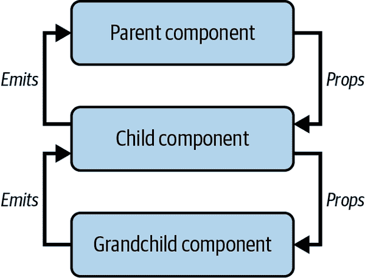

###### 图 4-1 Vue 组件中的单向数据流

# 将函数作为 props 传递

与其他框架不同，Vue 不允许将函数作为 prop 直接传递给子组件。相反，您可以将函数绑定为自定义事件发射器（参见 “使用自定义事件进行组件间通信”）。

## 使用 props 将数据传递给子组件

在对象或数组形式下，Vue 组件的 `props` 字段包含了组件可以从父组件接收的所有可用数据属性。每个 `props` 的属性都是目标组件的一个 prop。要开始从父组件接收数据，您需要在组件选项对象中声明 `props` 字段，如 示例 4-1 所示。

##### 示例 4-1 在组件中定义 props

```
export default {
  name: 'ChildComponent',
  props: {
    name: String
  }
}
```

在 示例 4-1 中，`ChildComponent` 组件接受一个类型为 `String` 的 `name` 属性。然后父组件可以使用这个 `name` 属性向子组件传递数据，如 示例 4-2 所示。

##### 示例 4-2 将静态数据作为 props 传递给子组件

```
<template>
  <ChildComponent name="Red Sweater" />
</template>
<script lang="ts">
import ChildComponent from './ChildComponent.vue'
export default {
  name: 'ParentComponent',
  components: {
    ChildComponent
  },
}
</script>
```

在前面的示例中，`ChildComponent` 收到了一个静态的“Red Sweater”作为 `name` 值。如果您想将动态数据变量（例如 `children` 列表中的第一个元素）传递和绑定到 `name`，您可以使用 `v-bind` 属性，即 `:`，如 示例 4-3 所示。

##### 示例 4-3 将动态变量作为 props 传递给子组件

```
<template>
  <ChildComponent :name="children[0]" />
</template>
<script lang="ts">
import ChildComponent from './ChildComponent.vue'
export default {
  //...
  data() {
    return {
      children: ['Red Sweater', 'Blue T-Shirt', 'Green Hat']
    }
  }
}
</script>
```

前述代码的输出与将静态字符串`Red Sweater`传递给`name`属性相同。

###### 注意

如果`name`属性不是`String`类型，则仍然需要使用`v-bind`属性（或`:`）将静态数据传递给子组件，例如对于`Boolean`类型使用`:name="true"`，或对于`Array`类型使用`:name="["hello", "world"]"`。

在 示例 4-3 中，每当`children[0]`的值变化时，Vue 也会更新`ChildComponent`中的`name`属性，并且如果需要，子组件将重新呈现其内容。

如果子组件中有多个属性，可以采用相同的方法将每个数据传递给相关的属性。例如，要将产品的`name`和`price`传递给`ProductComp`组件，可以执行此操作（示例 4-4）。

##### 示例 4-4\. 向子组件传递多个属性

```
/** components/ProductList.vue */
<template>
  <ProductComp :name="product.name" :price="product.price" />
</template>
<script lang="ts">
import ProductComp from './ProductComp.vue'
export default {
  name: 'ProductList',
  components: {
    ProductComp
  },
  data() {
    return {
      product: {
        name: 'Red Sweater',
        price: 19.99
      }
    }
  }
}
</script>
```

我们可以定义`ProductComp`组件如同 示例 4-5 中所示。

##### 示例 4-5\. 在`ProductComp`中定义多个属性

```
<template>
  <div>
    <p>Product: {{ name }}</p>
    <p>Price: {{ price }}</p>
  </div>
</template>
<script lang="ts">
export default {
  name: 'ProductComp',
  props: {
    name: String,
    price: Number
  }
}
</script>
```

输出如下所示：

```
Product: Red Sweater
Price: 19.99
```

或者，您可以使用`v-bind`（*不是* `:`）来传递整个对象`user`，并将其属性绑定到相关子组件的属性：

```
<template>
  <ProductComp v-bind="product" />
</template>
```

请注意，只有子组件将接收相关声明的属性。因此，如果在父组件中有另一个字段`product.description`，它将无法在子组件中访问。

###### 注意

另一种声明组件`props`的方法是使用一个字符串数组，每个字符串表示它接受的属性名称，例如`props: ["name", "price"]`。当您想快速原型化一个组件时，这种方法是实用的。然而，我强烈建议您使用`props`的对象形式，并为了代码可读性和错误预防的良好实践，声明所有的属性类型。

我们已经学习了如何声明带有类型的属性，但在需要时如何验证传递给子组件属性的数据？如何在未传递值时为属性设置回退值？让我们接着了解。

## 声明带有验证和默认值的属性类型

回到 示例 4-1，我们声明了`name`属性为`String`类型。在运行时，Vue 会警告如果父组件向`name`属性传递了非字符串值。然而，为了能够享受 Vue 的类型验证带来的好处，我们应该使用完整的声明语法：

```
{
  type: String | Number | Boolean | Array | Object | Date | Function | Symbol,
  default?: any,
  required?: boolean,
  validator?: (value: any) => boolean
}
```

在其中：

+   `type` 是属性的类型。它可以是一个构造函数（或自定义类），也可以是内置类型之一。

+   `default` 是属性的默认值，如果没有传递值则使用该值。对于`Object`、`Function`和`Array`类型，默认值必须是一个返回初始值的函数。

+   `required` 是一个布尔值，指示属性是否是必需的。如果`required`为`true`，则父组件必须向属性传递一个值。默认情况下，所有属性都是可选的。

+   `validator` 是一个验证传递给属性值的函数，主要用于开发调试。

我们可以声明更具体的`name`prop，包括一个默认值，如示例 4-6 所示。

##### 示例 4-6\. 将 prop 定义为具有默认值的字符串

```
export default {
  name: 'ChildComponent',
  props: {
    name: {
      type: String,
      default: 'Child component'
    }
  }
}
```

如果父组件没有传递值，则子组件将回退到默认值*“Child component”*。

我们还可以将`name`设置为子组件的必需 prop，并为其接收到的数据添加验证器，如示例 4-7 所示。

##### 示例 4-7\. 使用 prop 验证器将 name 定义为必需项

```
export default {
  name: 'ChildComponent',
  props: {
    name: {
      type: String,
      required: true,
      validator: value => value !== "Child component"
    }
  }
}
```

在这种情况下，如果父组件未向`name`prop 传递值，或者传递的值匹配*Child component*，Vue 将在开发模式下抛出警告（见图 4-2）。

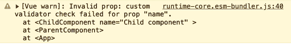

###### 图 4-2\. 开发环境下控制台警告未能验证 prop

###### 注意

对于`default`字段，`Function`类型是一个返回 prop 初始值的函数。您不能使用它将数据传回父组件或在父级上触发数据更改。

除了 Vue 提供的内置类型和验证之外，您还可以结合 JavaScript 的`Class`或函数构造函数和 TypeScript 来创建自定义的 prop 类型。我将在下一节中介绍它们。

## 声明带有自定义类型检查的 props

使用像`Array`、`String`或`Object`这样的原始类型非常适合基本用例。然而，随着您的应用程序的增长，原始类型可能过于通用，无法保证组件的类型安全性。以以下模板代码为例的`PizzaComponent`：

```
<template>
  <header>Title: {{ pizza.title }}</header>
  <div class="pizza--details-wrapper">
    
    <p>Description: {{ pizza.description }}</p>
    <div class="pizza--inventory">
      <div class="pizza--inventory-stock">Quantity: {{pizza.quantity}}</div>
      <div class="pizza--inventory-price">Price: {{pizza.price}}</div>
    </div>
  </div>
</template>
```

此组件接受一个强制的`pizza`prop，它是一个包含一些有关`pizza`的详细信息的`Object`：

```
export default {
  name: 'PizzaComponent',
  props: {
    pizza: {
      type: Object,
      required: true
    }
  }
}
```

直接了当。但是，通过将`pizza`声明为`Object`类型，我们假设父组件始终会传递适当的带有所需字段（`title`、`image`、`description`、`quantity`和`price`）的对象给`pizza`以渲染。

这种假设可能会导致问题。由于`pizza`接受`Object`类型的数据，任何使用`PizzaComponent`的组件都可以向`pizza`prop 传递任何对象数据，而不必是一个真正用于`pizza`的字段，如示例 4-8 所示。

##### 示例 4-8\. 使用错误数据的 Pizza 组件

```
<template>
  <div>
    <h2>Bad usage of Pizza component</h2>
    <pizza-component :pizza="{ name: 'Pinia', description: 'Hawaiian pizza' }" />
  </div>
</template>
```

上述代码导致`PizzaComponent`的 UI 渲染错误，只有一个`description`可用，其余字段为空（图像损坏），如图 4-3 所示。

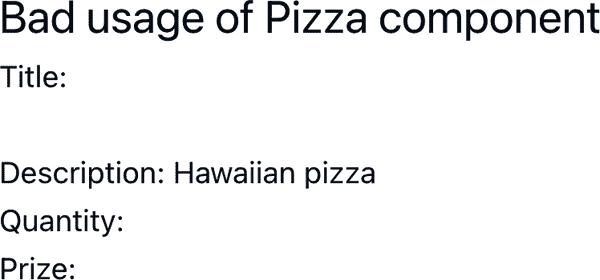

###### 图 4-3\. 没有图像链接和缺少披萨字段导致 UI 错误

在这里，TypeScript 也无法检测到数据类型不匹配，因为它根据`pizza`的声明类型，即通用的`Object`执行类型检查。另一个潜在的问题是，以错误的嵌套属性格式传递`pizza`可能导致应用程序崩溃。因此，为了避免此类事故，我们使用自定义类型声明。

我们可以定义`Pizza`类，并声明类型为`Pizza`的 prop `pizza`，如示例 4-9 所示。

##### 示例 4-9\. 声明 Pizza 自定义类型

```
class Pizza {
  title: string;
  description: string;
  image: string;
  quantity: number;
  price: number;

  constructor(
    title: string,
    description: string,
    image: string,
    quantity: number,
    price: number
  ) {
    this.title = title
    this.description = description
    this.image = image
    this.quantity = quantity
    this.price = price
  }
}

export default {
  name: 'PizzaComponent',
  props: {
    pizza: {
      type: Pizza, 
      required: true
    }
  }
}
```


直接将`pizza` props 的类型声明为`Pizza`

或者，您可以使用 TypeScript 的`interface`或`type`来定义自定义类型，而不是`Class`。然而，在这种情况下，您必须使用`vue`包中的`PropType`，并采用以下语法将声明的类型映射到目标 prop：

```
type: Object as PropType<Your-Custom-Type>
```

让我们将`Pizza`类重写为`interface`（见示例 4-10）。

##### 示例 4-10\. 使用 TypeScript 接口 API 声明 Pizza 自定义类型

```
import type { PropType } from 'vue'

interface Pizza {
  title: string;
  description: string;
  image: string;
  quantity: number;
  price: number;
}

export default {
  name: 'PizzaComponent',
  props: {
    pizza: {
      type: Object as PropType<Pizza>, 
      required: true
    }
  }
}
```


将`pizza` props 的类型声明为带有`PropType`帮助的`Pizza`接口。

当您使用错误的数据格式化`PizzaComponent`时，TypeScript 将检测并适当地突出显示错误。

###### 注意

Vue 在运行时执行类型验证，而 TypeScript 在编译时执行类型检查。因此，使用 Vue 的类型检查和 TypeScript 的类型检查结合起来，以确保您的代码没有错误是一个很好的实践。

## 使用`defineProps()`和`withDefaults()`声明 props

正如我们在“设置”中学到的，从 Vue 3.x 开始，Vue 提供了`<script setup>`语法，用于声明功能组件，而无需经典的 Options API。在这个`<script setup>`块内，你可以使用`defineProps()`来声明 props，如示例 4-11 所示。

##### 示例 4-11\. 使用`defineProps()`和`<script setup>`声明 props

```
<script setup>
import { defineProps } from 'vue'

const props = defineProps({
  name: {
    type: String,
    default: "Hello from the child component."
  }
})
</script>
```

多亏了 TypeScript，我们还可以声明每个组件接受的`defineProps()`类型，同时在编译时进行类型验证，如示例 4-12 所示。

##### 示例 4-12\. 使用`defineProps()`和`TypeScript type`声明 props

```
<script setup >
import { defineProps } from 'vue'

type ChildProps = {
  name?: string
}

const props = defineProps<ChildProps>()
</script>
```

在这种情况下，为了声明`message` prop 的默认值，我们需要使用`withDefaults()`来包装`defineProps()`调用，如示例 4-13 所示。

##### 示例 4-13\. 使用`defineProps()`和`withDefaults()`声明 props

```
import { defineProps, withDefaults } from 'vue'

type ChildProps = {
  name?: string
}

const props = withDefaults(defineProps<ChildProps>(), {
  name: 'Hello from the child component.'
})
```

# 使用`defineProps()`与 TypeScript 类型检查

当使用`defineProps()`时，我们不能同时结合运行时和编译时类型检查。我建议在示例 4-11 中采用`defineProps()`的方法，以获得更好的可读性和 Vue 与 TypeScript 类型检查的结合。

我们已经学习了如何声明 props 以传递 Vue 组件中的原始数据，进行类型检查和验证。接下来，我们将探讨如何将函数作为自定义事件发射器传递给子组件。

# 使用自定义事件在组件之间进行通信

Vue 将通过 props 将数据传递给子组件，视为只读和原始数据。单向数据流确保只有父组件可以更新数据 prop。我们经常希望更新特定的数据 prop 并将其与父组件同步。为此，我们使用组件选项中的`emits`字段声明自定义事件。

以待办事项列表或`ToDoList`组件为例。这个`ToDoList`将使用`ToDoItem`作为其子组件，使用示例中的代码渲染任务列表示例 4-14。

##### 示例 4-14\. `ToDoList`组件

```
<template>
  <ul style="list-style: none;">
    <li v-for="task in tasks" :key="task.id">
      <ToDoItem :task="task" />
    </li>
  </ul>
</template>
<script lang="ts">
import { defineComponent } from 'vue'
import ToDoItem from './ToDoItem.vue'
import type { Task } from './ToDoItem'

export default defineComponent({
  name: 'ToDoList',
  components: {
    ToDoItem
  },
  data() {
    return {
      tasks: [
        { id: 1, title: 'Learn Vue', completed: false },
        { id: 2, title: 'Learn TypeScript', completed: false },
        { id: 3, title: 'Learn Vite', completed: false },
      ] as Task[]
    }
  }
})
</script>
```

`ToDoItem`是一个组件，接收一个`task`属性，并渲染一个作为复选框的`input`，供用户标记任务是否完成。这个`input`元素将`task.completed`作为其`checked`属性的初始值。让我们看一下示例 4-15。

##### 示例 4-15\. `ToDoItem`组件

```
<template>
  <div>
    <input
      type="checkbox"
      :checked="task.completed"
    />
    <span>{{ task.title }}</span>
  </div>
</template>
<script lang="ts">
import { defineComponent, type PropType } from 'vue'

export interface Task {
  id: number;
  title: string;
  completed: boolean;
}

export default defineComponent({
  name: 'ToDoItem',
  props: {
    task: {
      type: Object as PropType<Task>,
      required: true,
    }
  },
})
</script>
```

当用户切换此`input`复选框时，我们希望触发名为`task-completed-toggle`的事件，以通知父组件有关特定任务的`task.completed`值。我们可以通过在组件选项的`emits`字段中首先声明事件来实现这一点（示例 4-16）。

##### 示例 4-16\. 带有 emits 的`ToDoItem`组件

```
/** ToDoItem.vue */
export default defineComponent({
  //...
  emits: ['task-completed-toggle']
})
```

然后，我们创建一个新的方法`onTaskCompleted`来发出`task-completed-toggle`事件，该事件包含复选框的新值`task.completed`和`task.id`作为事件的负载（示例 4-17）。

##### 示例 4-17\. 带有方法来发出`task-completed-toggle`事件的`ToDoItem`组件

```
/** ToDoItem.vue */
export default defineComponent({
  //...
  methods: {
    onTaskCompleted(event: Event) {
      this.$emit("task-completed-toggle", {
        ...this.task,
        completed: (event.target as HTMLInputElement)?.checked,
      });
    },
  }
})
```

###### 注意

我们使用`defineComponent`将组件选项包装起来，创建一个与 TypeScript 兼容的组件。对于简单的组件并不需要使用`defineComponent`，但是在组件的方法、钩子或计算属性中访问`this`的其他数据属性时需要使用它。否则，TypeScript 将会抛出错误。

然后，我们将`onTaskCompleted`方法绑定到`input`元素的`change`事件上，如示例 4-18 所示。

##### 示例 4-18\. `ToDoItem`组件更新后的模板

```
<div>
  <input
    type="checkbox"
    :checked="task.completed"
    @change="onTaskCompleted"
  />
  <span>{{ task.title }}</span>
</div>
```

现在，在`ToDoItem`的父组件`<ToDoList>`中，我们可以使用`@`符号将`task-completed-toggle`事件绑定到一个方法上，模板在示例 4-19 中。

##### 示例 4-19\. `ToDoList`组件更新后的模板

```
<template>
  <ul style="list-style: none;">
    <li v-for="task in tasks" :key="task.id">
      <ToDoItem
        :task="task"
        @task-completed-toggle="onTaskCompleted"
      />
    </li>
  </ul>
</template>
```

父组件`<ToDoList>`中的`onTaskCompleted`方法将接收`task-completed-toggle`事件的负载，并更新`tasks`数组中特定任务的`task.completed`值，就像示例 4-20 中那样。

##### Example 4-20\. `ToDoList` 组件的脚本，带有处理 `task-completed-toggle` 事件的方法

```
//...

export default {
  //...
  methods: {
    onTaskCompleted(payload: { id: number; completed: boolean }) {
      const index = this.tasks.findIndex(t => t.id === payload.id)

      if (index < 0) return

      this.tasks[index].completed = payload.completed
    }
  }
}
```

这些代码块将渲染出 Figure 4-4 中显示的页面。

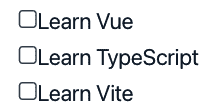

###### 图 4-4\. 带有三个项目的 `ToDoList` 组件

Vue 将更新 `ToDoList` 中的相关数据，并相应地渲染相关的 `ToDoItem` 组件实例。你可以切换复选框来标记待办事项为完成状态。Figure 4-5 显示了我们可以使用 Vue Devtools 检测组件的事件。

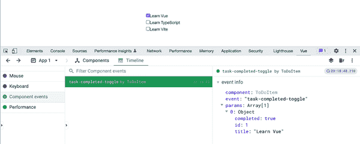

###### 图 4-5\. 将待办事项标记为完成，并使用 Vue Devtools 调试发出的事件

# 使用 defineEmits() 定义自定义事件

类似于 “使用 defineProps() 和 withDefaults() 声明 Props”，在 `<script setup>` 代码块中，你可以使用 `defineEmits()` 来定义自定义事件。`defineEmits()` 函数接受与 `emits` 相同的输入参数类型：

```
const emits = defineEmits(['component-event'])
```

然后它返回一个函数实例，我们可以用它来调用组件中的特定事件：

```
emits('component-event', [...arguments])
```

因此，我们可以像 Example 4-21 中那样编写 `ToDoItem` 的脚本部分。

##### Example 4-21\. 使用 `defineEmits()` 的 `ToDoItem` 组件，具有自定义事件

```
<script lang="ts" setup>
//...
const props = defineProps({
  task: {
    type: Object as PropType<Task>,
    required: true,
  }
});

const emits = defineEmits(['task-completed-toggle'])

const onTaskCompleted = (event: Event) => {
  emits("task-completed-toggle", {
    id: props.task.id,
    completed: (event.target as HTMLInputElement)?.checked,
  });
}
</script>
```

注意这里我们不需要使用 `defineComponent`，因为在 `<script setup>` 代码块中没有 `this` 实例可用。

为了更好的类型检查，你可以对 `task-completed-toggle` 事件使用仅类型声明，而不是单个字符串。让我们改进 Example 4-21 中的 `emits` 声明，使用类型 `EmitEvents`，如 Example 4-22 所示。

##### Example 4-22\. 使用 `defineEmits()` 和仅类型声明的自定义事件

```
// Declare the emit type
type EmitEvents = {
  (e: 'task-completed-toggle', task: Task): void;
}

const emits = defineEmits<EmitEvents>()
```

这种方法有助于确保你将正确的方法绑定到声明的事件上。正如对于 `task-complete-toggle` 事件所见，任何事件声明都应遵循相同的模式：

```
(e: 'component-event', [...arguments]): void
```

在上述语法中，`e` 是事件的名称，而 `arguments` 是传递给事件发射器的所有输入。在 `task-completed-toggle` 事件的情况下，其发射器的参数是类型为 `Task` 的 `task`。

`emits` 是一个强大的功能，允许你在不破坏 Vue 数据流机制的情况下，启用父子组件之间的双向通信。然而，`props` 和 `emits` 仅在需要直接数据通信时才有利。

你必须使用不同的方法来将数据从组件传递到其孙子或后代。在下一节中，我们将看到如何使用 `provide` 和 `inject` API 将数据从父组件传递到其子组件或孙子组件。

# 使用 provide/inject 模式在组件之间进行通信

要在祖先组件和其后代之间建立数据通信，`provide/inject` API 是一个合理的选择。`provide` 字段从祖先传递数据，而 `inject` 确保 Vue 将提供的数据注入到任何目标后代中。

## 使用 `provide` 传递数据

组件选项字段 `provide` 接受两种格式：数据对象或函数。

`provide` 可以是一个包含要注入的数据的对象，每个属性表示一个（键，值）数据类型。在下面的示例中，`ProductList` 提供了一个数据值 `selectedIds`，其值为 `[1]`，传递给其所有后代（示例 4-23）。

##### 示例 4-23\. 在 `ProductList` 组件中使用 `provide` 传递 `selectedIds`

```
export default {
  name: 'ProductList',
  //...
  provide: {
    selectedIds: [1]
  },
}
```

`provide` 的另一种格式类型是一个返回包含可供后代注入的数据的对象的函数。此格式类型的一个好处是可以访问 `this` 实例，并将动态数据或组件方法映射到返回对象的相关字段中。从 示例 4-23 开始，我们可以将 `provide` 字段重写为一个函数，如 示例 4-24 所示。

##### 示例 4-24\. 在 `ProductList` 组件中使用 `provide` 传递 `selectedIds` 作为一个函数

```
export default {
//...
  provide() {
    return {
      selectedIds: [1]
    }
  },
//...
}
</script>
```

###### 注意

与 `props` 不同，您可以传递一个函数，并让目标后代使用 `provide` 字段触发它。这样做可以使数据返回到父组件。然而，Vue 认为这种方法是一种反模式，您应该谨慎使用。

到此为止，我们的 `ProductList` 使用 `provide` 将一些数据值传递给其后代。接下来，我们必须注入提供的值以在后代中操作。

## 使用 `inject` 接收数据

与 `props` 类似，`inject` 字段可以接受一个字符串数组，每个字符串代表一个提供的数据键（`inject: [*selectedId*]`）或一个对象。

当作为对象字段使用 `inject` 时，其每个属性都是一个对象，键表示组件内部使用的本地数据键，并具有以下属性：

```
{
  from?: string;
  default: any
}
```

在这里，如果属性键与祖先提供的键相同，则 `from` 是可选的。例如，根据 示例 4-23，`ProductList` 向其后代提供的数据 `selectedIds`，我们可以计算一个 `ProductComp`，它从 `ProductList` 接收提供的数据 `selectedIds` 并将其重命名为 `currentSelectedIds` 以在本地使用，如 示例 4-25 所示。

##### 示例 4-25\. 在 `ProductComp` 中注入提供的数据

```
<script lang='ts'>
export default {
  //...
  inject: {
    currentSelectedIds: {
      from: 'selectedIds',
      default: []
    },
  },
}
</script>
```

在这段代码中，Vue 将注入的 `selectedIds` 的值赋给一个本地数据字段 `currentSelectedIds`，如果没有注入的值，则使用其默认值 `[]`。

在浏览器开发者工具中的 Vue 标签的组件部分中，当从组件树（左侧面板）选择 `ProductComp` 时，您可以调试注入数据的重命名指示（右侧面板），如 图 4-6 所示。

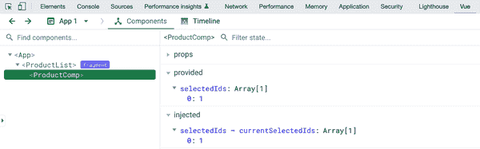

###### 图 4-6\. 使用 Vue Devtools 调试 `provide` 和 `inject` 提供和注入的数据

###### 注意

在 Composition API 中，`provide/inject` 的等效钩子分别为 `provide()` 和 `inject()`。

现在我们了解如何使用 `provide` 和 `inject` 在组件之间高效地传递数据，避免了 Props 钻取。让我们来探索如何使用 `<Teleport>` 组件将元素的特定内容区域渲染到 DOM 的另一个位置。

# Teleport API

由于样式限制，我们经常需要实现一个包含元素的组件，Vue 应该将其在实际 DOM 中的不同位置进行渲染，以达到完整的视觉效果。在这种情况下，我们通常需要通过开发复杂的解决方案来“传送”这些元素，从而导致性能影响、时间消耗等问题。为了解决这种“传送”挑战，Vue 提供了 `<Teleport>` 组件。

`<Teleport>` 组件接受一个 `to` 属性，该属性指示目标容器，可以是元素的查询选择器或所需的 HTML 元素。假设我们有一个 `House` 组件，其中包含需要 Vue 引擎将其传送到指定 `#sky` DOM 元素的 *天空和云* 部分，如 示例 4-26 中所示。

##### 示例 4-26\. `Teleport` 带有的房屋组件

```
<template>
  <div>
    This is a house
  </div>
  <Teleport to="#sky">
    <div>Sky and clouds</div>
  </Teleport>
</template>
```

在我们的 `App.vue` 中，我们在 `House` 组件上方添加了一个目标 id 为 `sky` 的 `section` 元素，如 示例 4-27 中所示。

##### 示例 4-27\. `App.vue` 模板，包含 `House` 组件

```
<template>
  <section id="sky" />
  <section class="wrapper">
      <House />
  </section>
</template>
```

图 4-7 显示了代码输出。


###### 图 4-7\. 使用 `Teleport` 组件时的实际显示顺序

当您使用浏览器开发者工具的元素选项卡检查 DOM 树时，“天空和云”显示为嵌套在 `<section id="sky">` 中，而不是 (图 4-8)。

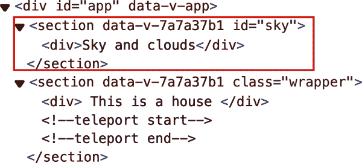

###### 图 4-8\. 使用 `Teleport` 组件时的实际 DOM 树

你也可以通过其布尔属性 `disabled` 暂时禁用 `<Teleport>` 组件实例内部的内容移动。这个组件在你希望保持 DOM 树结构的同时，只在需要时将指定内容移动到目标位置时非常有用。`Teleport` 的一个日常使用场景是模态框，接下来我们将实现它。

# 在一个父级下包装两个部分

在传送到 `<Teleport>` 前，目标组件必须在 DOM 中存在。在 示例 4-27 中，如果将两个 `section` 实例包裹在 `main` 元素中，`<Teleport>` 组件将无法按预期工作。有关更多细节，请参见“使用 Teleport 时的渲染问题”。

## 使用 Teleport 和 `<dialog>` 元素实现模态框

模态框是一个对话框窗口，出现在屏幕顶部，阻止用户与主页面的交互。用户必须与模态框交互以关闭它，然后返回主页面。

模态框非常方便地显示需要用户完全注意的重要通知，并且应该只出现一次。

让我们设计一个基本的模态框。与对话框类似，模态框应包含以下元素（图 4-9）：

+   背景覆盖整个屏幕，在其上出现模态框，阻止用户与当前页面的交互。

+   模态框窗口包含模态框的内容，包括具有标题和关闭按钮的 `header`，一个 `main` 内容部分，以及一个默认关闭按钮的 `footer` 部分。这三个部分可以使用插槽进行自定义。

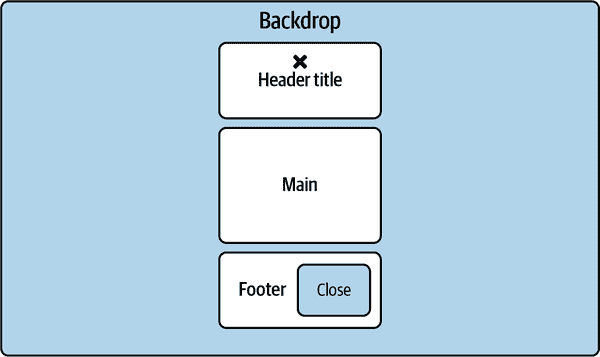

###### 图 4-9\. 基本模态框设计

基于上述设计，在 示例 4-28 中使用 `<dialog>` HTML 元素实现 `Modal` 组件模板。

##### 示例 4-28\. `Modal` 组件

```
<template>
  <dialog :open="open">
    <header>
      <slot name="m-header"> 
        <h2>{{ title }}</h2>
        <button>X</button>
      </slot>
    </header>
    <main>
      <slot name="m-main" /> 
    </main>
    <footer>
      <slot name="m-footer"> 
        <button>Close</button>
      </slot>
    </footer>
  </dialog>
</template>
```

在上述代码中，我们使用三个插槽部分，允许用户进行自定义：


模态框的标题 (`m-header`)


主内容 (`m-main`)


模态框的页脚 (`m-footer`)

我们还将 `<dialog>` 元素的 `open` 属性绑定到一个名为 `open` 的本地数据属性，用于控制模态框的可见性（显示/隐藏）。此外，我们将 `title` 属性渲染为模态框的默认标题。现在，让我们实现 `Modal` 组件的选项，它接收两个 props：`open` 和 `title`，就像 示例 4-29 中描述的那样。

##### 示例 4-29\. 为 `Modal` 组件添加 props

```
<script lang="ts">
import { defineComponent } from 'vue'

export default defineComponent({
  name: 'Modal',
  props: {
    open: {
      type: Boolean,
      default: false,
    },
    title: {
      type: String,
      default: 'Dialog',
    },
  },
})
</script>
```

当用户点击模态框的关闭按钮或标题栏上的“X”按钮时，模态框应关闭自身。由于我们使用 `open` prop 控制模态框的可见性，我们需要在 `Modal` 组件中声明 `emits` 和一个 `close` 方法，以发送带有新的 `open` 值的 `closeDialog` 事件，如 示例 4-30 中描述的那样。

##### 示例 4-30\. 声明 `Modal` 发出的事件 `closeDialog`

```
<script lang="ts">
/** Modal.vue */
import { defineComponent } from 'vue'

export default defineComponent({
  name: 'Modal',
  //...
  emits: ["closeDialog"], 
  methods: {
    close() { 
      this.$emit("closeDialog", false);
    },
  },
})
</script>
```


`emits` 一个事件，`closeDialog`


`close` 方法将以 `false` 作为新值发出 `closeDialog` 事件

然后，我们使用 `@` 符号将其绑定到 `<dialog>` 元素中的相关动作元素，如 示例 4-31 所示。

##### Example 4-31\. 绑定点击事件的事件监听器

```
<template>
  <dialog :open="open" >
    <header>
      <slot name="m-header" >
        <h2>{{ title }}</h2>
        <button @click="close" >X</button> 
      </slot>
    </header>
    <main>
      <slot name="m-main" />
    </main>
    <footer>
      <slot name="m-footer" >
        <button @click="close" >Close</button> 
      </slot>
    </footer>
  </dialog>
</template>
```


`@click` 事件处理器用于标题栏上的“X”按钮


`@click` 事件处理器用于页脚上的默认关闭按钮

接下来，我们需要使用 `<Teleport>` 组件将 `dialog` 元素包装起来，以将其移出父组件的 DOM 树。我们还向 `<Teleport>` 组件传递 `to` 属性，指定目标位置：一个带有 id 为 `modal` 的 HTML 元素。最后，我们将 `disabled` 属性绑定到组件的 `open` 值上，以确保 Vue 仅在可见时将模态组件内容移动到指定位置（示例 4-32）。

##### Example 4-32\. 使用 `<Teleport>` 组件

```
<template>
  <teleport 
    to="#modal" 
    :disabled="!open" 
  >
    <dialog ref="dialog" :open="open" >
      <header>
      <slot name="m-header">
        <h2>{{ title }}</h2>
        <button @click="close" >X</button>
      </slot>
      </header>
      <main>
        <slot name="m-main" />
      </main>
      <footer>
        <slot name="m-footer">
          <button @click="close" >Close</button>
        </slot>
      </footer>
    </dialog>
  </teleport>
</template>
```


`<Teleport>` 组件


`to` 属性与具有 id 选择器 `modal` 的目标位置


当组件的 `open` 值为假值时，带有 `disabled` 属性

现在让我们尝试在 `WithModalComponent` 中使用我们的 `Modal` 组件，通过在 示例 4-33 中添加以下代码。

##### Example 4-33\. 在 `WithModalComponent` 中使用模态组件

```
<template>
  <h2>With Modal component</h2>
  <button @click="openModal = true">Open modal</button>
  <Modal :open="openModal" title="Hello World" @closeDialog="toggleModal"/>
</template>
<script lang="ts">
import { defineComponent } from "vue";
import Modal from "./Modal.vue";

export default defineComponent({
  name: "WithModalComponent",
  components: {
    Modal,
  },
  data() {
    return {
      openModal: false,
    };
  },
  methods: {
    toggleModal(newValue: boolean) {
      this.openModal = newValue;
    },
  },
});
</script>
```

最后，在 `index.html` 文件的 `body` 元素中添加一个带有 id 为 `modal` 的 `<div>` 元素：

```
<body>
  <div id="app"></div>
  <div id="modal"></div> 
  <script type="module" src="/src/main.ts"></script>
</body>
```


带有 id `modal` 的 `div` 元素

这样做可以使 Vue 在 `open` 属性设置为 `true` 时，将 `Modal` 组件的内容呈现到带有 id 为 `modal` 的此 `div` 中（图 4-10）。

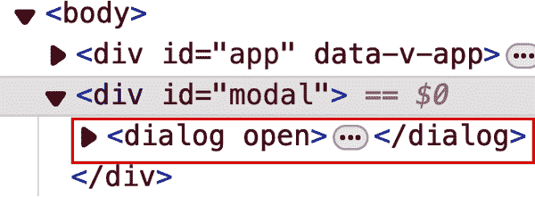

###### 图 4-10\. 当可见时，模态组件呈现到带有 id 为 `modal` 的 `div` 中

图 4-11 展示了它在屏幕上的样子：


###### 图 4-11\. `WithModalComponent` 在模态框可见时的输出

当 `open` 属性为 `false` 时，带有 id `modal` 的 `div` 是空的（图 4-12），并且模态框在屏幕上是不可见的（图 4-13）。

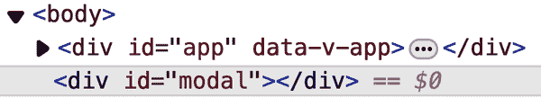

###### 图 4-12\. 当隐藏时，模态组件不呈现到带有 id 为 `modal` 的 `div` 中


###### 图 4-13\. 当隐藏时，模态组件不可见

到此时，您已经有一个工作的模态框组件。然而，模态框的视觉外观并不完全符合我们的预期；当模态框可见时，主页面内容应该有一个黑暗的遮罩层。让我们通过模态框元素的`<style>`部分中的`::backdrop`选择器来修复这个问题：

```
<style scoped>
  dialog::backdrop {
    background-color: rgba(0, 0, 0, 0.5);
  }
</style>
```

然而，这不会改变模态框背景的外观。这种行为是因为浏览器仅在我们使用`dialog.showModal()`方法打开对话框时，而不是通过更改`open`属性时，应用`::backdrop` CSS 选择器规则到对话框上。为了解决这个问题，我们需要在我们的`Modal`组件中执行以下修改：

+   通过将“dialog”值分配给`ref`属性，直接引用`<dialog>`元素：

    ```
    <dialog :open="open" ref="dialog">
      <!--...-->
    </dialog>
    ```

+   每当`open`属性变化时，在`dialog`元素上分别触发`$refs.dialog.showModal()`或`$refs.dialog.close()`，使用`watch`：

    ```
    watch: {
      open(newValue) {
        const element = this.$refs.dialog as HTMLDialogElement;
        if (newValue) {
          element.showModal();
        } else {
          element.close();
        }
      },
    },
    ```

+   移除`<dialog>`元素的原始绑定`open`属性：

    ```
    <dialog ref="dialog">
      <!--...-->
    </dialog>
    ```

+   移除`<teleport>`组件中`disabled`属性的使用：

    ```
    <teleport to="#modal">
      <!--...-->
    </teleport>
    ```

使用内置的`showModal()`方法打开模态框时，浏览器会在 DOM 中的实际`<dialog>`元素上添加一个`::backdrop`伪元素，并动态移动元素内容到目标位置会禁用此功能，导致模态框无法显示所需的背景。

我们还通过将以下 CSS 规则添加到`dialog`选择器中，将模态框重新定位到页面中心并置于其他元素之上：

```
dialog {
  position: fixed;
  z-index: 999;
  inset-block-start: 30%;
  inset-inline-start: 50%;
  width: 300px;
  margin-inline-start: -150px;
}
```

当模态框可见时，输出将如图 4-14 所示。

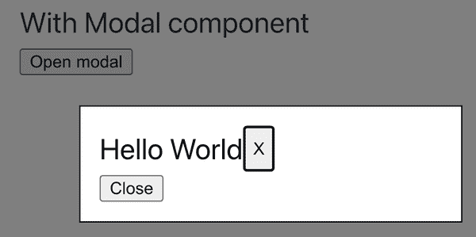

###### 图 4-14\. 具有背景和样式的模态框组件

我们已经学习了如何使用`Teleport`实现可重用的`Modal`组件，并探索了使用每个内置`<dialog>`元素功能的不同用例。我们还学习了如何使用`::backdrop` CSS 选择器为模态框的背景样式。

正如您注意到的那样，我们将模态框的目标位置`div`设置为`body`的直接子元素，而不是 Vue 应用程序入口元素`<div id="app">`之内。如果我们希望将模态框的目标`div`移动到 Vue 应用程序的入口组件`App.vue`内部会发生什么？让我们在下一节中找出答案。

## 使用 Teleport 渲染时的渲染问题

要理解在`App.vue`组件的子组件内使用`Teleport`渲染模态框的问题，请首先将`<div id="modal"></div>`从`index.html`移动到`App.vue`之后，位于`WithModalComponent`实例之后：

```
<template>
  <section class="wrapper">
    <WithModalComponent />
  </section>
  <div id="modal"></div>
</template>
```

在运行应用程序后，您会发现无论您多次点击“打开模态框”按钮，浏览器都不会渲染模态框。控制台显示以下错误：

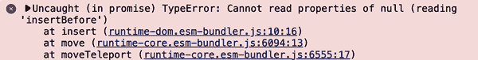

###### 图 4-15\. 在`App.vue`中渲染模态框时的控制台错误消息

由于 Vue 渲染顺序机制，父级在自身渲染之前会等待子级完成渲染。子级按照在父级`template`部分出现的顺序进行渲染。在这种情况下，`WithModalComponent`先渲染。因此，Vue 渲染`<dialog>`元素并开始将组件内容移动到目标位置，然后再渲染`ParentComponent`。然而，由于`ParentComponent`仍在等待`WithModalComponent`完成其渲染，因此`<div id="modal">`元素尚不存在于 DOM 中。因此，Vue 无法定位目标位置并执行正确的移动操作，也无法将`<dialog>`元素渲染到`<div id="modal">`元素内，从而导致错误。

绕过此限制的一种解决方法是在`WithModalComponent`之前将目标元素`<div id="modal">`放置出现：

```
<template>
  <div id="modal"></div>
  <section class="wrapper">
    <WithModalComponent />
  </section>
</template>
```

此解决方案确保在 Vue 渲染`Modal`元素并移动内容之前，目标`div`已经可用。另一种方法是在渲染期间使用`disabled`属性推迟`Modal`的内容移动过程，直到用户点击`打开模态框`按钮。这两种选择都有利有弊，您应选择最适合您需求的选项。

最常见的解决方案是将目标元素作为`body`元素的直接子元素插入，并使其与 Vue 渲染上下文隔离。

使用`<Teleport>`的一个显著优势是在保持代码层次结构、组件隔离和可读性的同时，实现最大的视觉显示效果（如全屏模式、模态框、侧边栏等）。

# 概述

本章探讨了使用内置的 Vue 特性（如`props`、`emits`和`provide/inject`）在组件通信中采用不同方法的概念。我们学习了如何利用这些特性在组件之间传递数据和事件，同时保持 Vue 的数据流机制完整。我们还学习了如何使用 Teleport API 将元素渲染到父组件的`<template>`中，但将其显示顺序保持在父组件中。 `<Teleport>`对于构建需要与主页面元素对齐显示的组件非常有益，例如弹出窗口、对话框、模态框等。

在下一章中，我们将进一步探讨组合 API 及其如何用于组合 Vue 组件。
