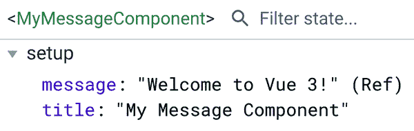
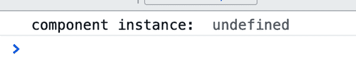
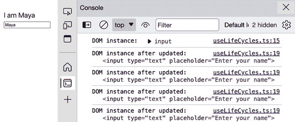
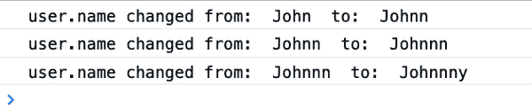
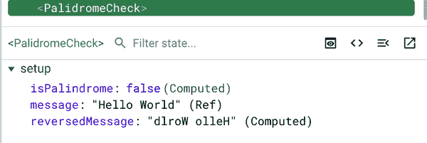
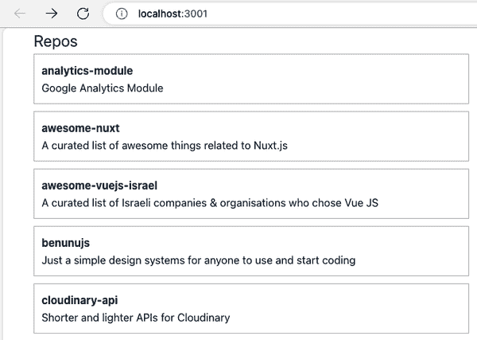

# 第五章：组合 API

在前一章中，您已经学习了如何使用经典的 Options API 组合 Vue 组件。尽管 Options API 自 Vue 2 以来一直是组合 Vue 组件最常见的 API，但使用 Options API 可能会导致不必要的代码复杂性、大型组件代码的不可读性以及它们之间逻辑重用的问题。针对这些用例，本章介绍了组合 Vue 组件的另一种方法，即组合 API。

在本章中，我们将探索不同的组合挂钩，以创建 Vue 中的功能状态元素。我们还将学习如何结合 Options API 和组合 API，以获得更好的响应控制，并为应用程序组合我们自己可重用的组合物。

# 使用组合 API 设置组件

在 Vue 中，使用 Options API 组合组件是一种常见的实践。然而，在许多情况下，我们希望重用部分组件逻辑，而不必担心数据和方法的重叠，如混入（见 第五章）。组合 API 在这种情况下非常有帮助。

组合 API 是在 Vue 3.0 中引入的，它提供了一种用 `setup()` 挂钩（“setup”）或 `<script setup>` 标记初始化和创建组件实例之前运行 *一次* 的替代方式，用于组合有状态和响应式组件。

您*只能*在此挂钩或其等效语法 `<script setup>` 标记中使用组合 API 函数或可组合物（“创建可重用的组合物”）。这种组合创建了一个有状态的功能性组件，并提供了一个绝佳的地方来定义组件的响应状态和方法，并初始化其他生命周期挂钩（参见 “使用生命周期挂钩”），使代码更易读。

让我们探索组合 API 的强大之处，从使用 `ref()` 和 `reactive()` 函数处理组件的响应数据开始。

# 使用 `ref()` 和 `reactive()` 处理数据

在 第二章 中，您学习了 Options API 中的 `data()` 函数属性，用于初始化组件的数据（“使用数据属性创建本地状态”）。从 `data()` 返回的所有数据属性都是响应式的，这意味着 Vue 引擎会自动监视每个声明的数据属性的更改。然而，默认功能可能会在组件中造成过多的开销，特别是当您有许多静态数据属性时。在这种情况下，Vue 引擎仍会为这些静态值启用观察器，这是不必要的。为了限制过多的数据观察器数量并更好地控制要观察的数据属性，Vue 在组合 API 中引入了 `ref()` 和 `reactive()` 函数。

## 使用 `ref()`

`ref()` 是一个接受单一参数并返回具有该参数作为初始值的响应式对象的函数。我们称这个返回的对象为 `ref` 对象：

```
import { ref } from 'vue'

export default {
  setup() {
    const message = ref("Hello World")
    return { message }
  }
}
```

或者在 `<script setup>` 中：

```
<script setup>
import { ref } from 'vue'

const message = ref("Hello World")
</script>
```

然后我们可以在 `script` 部分通过其单一的 `value` 属性访问返回对象的当前值。例如，示例 5-1 中的代码创建了一个初始值为 0 的响应式对象。

##### 示例 5-1\. 使用 `ref()` 创建一个具有初始值“Hello World”的响应式消息

```
import { ref } from 'vue'

const message = ref("Hello World")

console.log(message.value) //Hello World
```

###### 注意

如果你使用 Options API 和 `setup()` 钩子，你可以在组件的其他部分访问 `message` 而不需要 `.value`，即 `message` 就足够了。

然而，在 `template` 标签部分，你可以直接获取其值而不需要 `value` 属性。例如，示例 5-2 中的代码将会将同样的 `message` 输出到浏览器，就像 示例 5-1 一样。

##### 示例 5-2\. 在 `template` 部分访问 `message` 的值

```
<template>
    <div>{{ message }}</div>
</template>
<script lang="ts" setup>
import { ref } from 'vue'

const message = ref("Hello World")
</script>
```

###### 注意

`ref()` 函数根据传入的初始值推断返回对象的类型。如果你想显式定义返回对象的类型，可以使用 TypeScript 语法 `ref<type>()`，例如 `ref<string>()`。

由于 `ref` 对象是响应式且可变的，我们可以通过给其 `value` 属性赋新值来改变其值。Vue 引擎将会触发相关的 watcher 并更新组件。

在 示例 5-3 中，我们将重新创建 `MyMessageComponent`（从 示例 3-3 使用 Options API 创建），该组件接受用户输入并改变显示的 `message`。

##### 示例 5-3\. 使用 `ref()` 创建一个响应式的 `MyMessageComponent`

```
<template>
    <div>
        <h2 class="heading">{{ message }}</h2>
        <input type="text" v-model="message" />
    </div>
</template>
<script lang="ts" setup>
import { ref } from 'vue'

const message = ref("Welcome to Vue 3!")
</script>
```

当我们改变输入字段的值时，浏览器将相应地显示更新后的 `message` 值，如 图 5-1 所示。


###### 图 5-1\. 当我们改变输入字段的值时，显示的值也会随之改变。

在浏览器的 Vue 标签页中的开发者工具中，我们可以看到 `message` 被列在 `setup` 部分的 `ref` 对象下，带有 `Ref` 标识（见 图 5-2）。


###### 图 5-2\. `message` 的 `ref` 对象列在 `setup` 部分下

如果我们向组件添加另一个静态数据 `title`（示例 5-4），Vue 标签页将显示 `title` 数据属性而没有标识（见 图 5-3）。

##### 示例 5-4\. 向 `MyMessageComponent` 添加静态的 `title`

```
<template>
    <div>
        <h1>{{ title }}</h1>
        <h2 class="heading">{{ message }}</h2>
        <input type="text" v-model="message" />
    </div>
</template>
<script lang="ts" setup>
import { ref } from 'vue'

const title = "My Message Component"
const message = ref("Welcome to Vue 3!")
</script>
```



###### 图 5-3\. 列出了 `title` 数据属性而没有标识

前面的代码（示例 5-4）等同于使用 `setup()` 钩子的 示例 5-5。

##### 示例 5-5\. 使用 `setup()` 钩子创建一个响应式的 `MyMessageComponent`

```
<template>
    <div>
        <h2 class="heading">{{ message }}</h2>
        <input type="text" v-model="message" />
    </div>
</template>
<script lang="ts">
import { ref } from 'vue'

export default {
    setup() {
        const message = ref("Welcome to Vue 3!")
        return {
            message
        }
    }
}
</script>
```

您可以使用`ref()`函数为任何原始类型（如`string`、`number`、`boolean`、`null`、`undefined`等）和任何对象类型创建响应式对象。但是，对于数组和对象等对象类型，`ref()`返回一个强烈响应式对象，意味着`ref`对象及其嵌套属性均可变，如示例 5-6 所示。

##### 示例 5-6\. 使用`ref()`创建深度响应式对象

```
import { ref } from 'vue'

const user = ref({
    name: "Maya",
    age: 20
})

user.value.name = "Rachel"
user.value = {
    name: "Samuel",
    age: 20
}

console.log(user.value) // { name: "Samuel", age: 20 }
```

在示例 5-6 中，我们可以替换`user`的属性`name`和整个`user`对象的属性值。在 Vue 中，我们认为这种情况是*不良实践*，可能会导致大型数据结构的性能问题和意外行为。为了避免陷入这种情况，我建议您根据具体情况使用`shallowRef()`和`reactive()`函数：

+   如果您想创建一种响应式对象类型的数据，并*稍后用新值替换它*，请使用`shallowRef()`。一个很好的例子是将组件与异步数据获取集成到生命周期组合钩子中，如示例 5-7 所示。

+   如果您想创建一种仅*更新其属性*的响应式对象类型数据，请使用`reactive()`，我们将在下一节中介绍。

##### 示例 5-7\. 使用`shallowRef()`管理外部数据获取

```
<script lang="ts" setup>
import { shallowRef } from "vue";

type User = {
    name: string;
    bio: string;
    avatar_url: string;
    twitter_username: string;
    blog: string;
};

const user = shallowRef<User>({ 
    name: "",
    bio: "",
    avatar_url: "",
    twitter_username: "",
    blog: "",
});

const error = shallowRef<Error | undefined>(); 

const fetchData = async () => {
    try {
        const response = await fetch("https://api.github.com/users/mayashavin");

        if (response.ok) {
            user.value = (await response.json()) as User; 
        }
    } catch (e) {
        error.value = e as Error; 
    }
};

fetchData();
</script>
```


使用`shallowRef`创建一个初始数据为`User`类型的响应式`user`变量。


使用`shallowRef`创建一个可以是`undefined`或`Error`类型的响应式`error`变量。


用响应数据替换`user`的值，假设它是`User`类型。


当发生错误时，更新`error`的值。

## 使用`reactive()`

`reactive()`函数类似于`ref()`函数，除了：

+   它接受对象类型的数据作为其参数。

+   您可以直接访问不带`value`及其属性的响应式返回对象。

仅返回对象的嵌套属性可变，尝试直接修改返回对象的值或使用`value`属性将导致错误：

```
import { reactive } from 'vue'

const user = reactive({
    name: "Maya",
    age: 20
})

/*
TypeScript error - property 'value' does not exist
on type '{ name: string; age: number; }'
*/
user.value = {
    name: "Samuel",
    age: 20
}

/*
TypeScript error - cannot reassign a read-only variable
*/
user = {
    name: "Samuel",
    age: 20
}
```

但您可以修改`user`对象的属性，例如`name`和`age`：

```
import { reactive } from 'vue'

const user = reactive({
    name: "Maya",
    age: 20
})

user.name = "Rachel"
user.age = 30
```

###### 注意

在幕后，`ref()`触发`reactive()`。

一个重要的注意事项是，`reactive()`函数返回原始传递对象的响应式`proxy`版本。因此，如果我们对响应式返回对象进行任何更改，将反映在原始对象上，反之亦然，如示例 5-8 所示。

##### 示例 5-8\. 修改原始对象和响应式对象

```
import { reactive } from 'vue'

const defaultUser = {
    name: "Maya",
    age: 20
}

const user = reactive(defaultUser)

user.name = "Rachel"
user.age = 30

console.log(defaultUser) // { name: "Rachel", age: 30 }

defaultUser.name = "Samuel"

console.log(user) // { name: "Samuel", age: 30 }
```

在这个例子中，当`user`变化时，`defaultValue`和`user`的属性都会改变，反之亦然。因此，在使用`reactive()`函数时需要特别小心。在传递给`reactive()`之前，应使用展开语法（`…​`）创建一个新对象（见示例 5-9）。

##### 示例 5-9\. 使用带展开语法的`reactive()`

```
import { reactive } from 'vue'

const defaultUser = {
    name: "Maya",
    age: 20
}

const user = reactive({ ...defaultUser })

user.name = "Rachel"
user.age = 30

console.log(defaultUser) // { name: "Maya", age: 20 }

defaultUser.name = "Samuel"

console.log(user) // { name: "Rachel", age: 30 }
```

###### 注

`reactive()`函数能够深度转换初始对象的响应性。因此，对于大型数据结构可能导致不希望的性能问题。在只想观察根对象属性而不是它们的后代的情况下，应改用`shallowReactive()`函数。

您也可以结合使用`ref()`和`reactive()`，尽管我不建议这样做，因为其复杂性和响应性解包机制。如果需要从另一个响应式对象创建响应式对象，应改用`computed()`（参见“使用 computed()”）。

Table 5-1 总结了`ref()`、`reactive()`、`shallowRef()`和`shallow``Reactive()`的用例。

Table 5-1\. `ref()`、`reactive()`、`shallowRef()`和`shallowReactive()`函数的用例

| 钩子 | 使用时机 |
| --- | --- |
| `ref()` | 用于一般情况下的原始数据类型，或在需要重新分配对象及其属性时的对象类型。 |
| `shallowRef()` | 仅作为占位符的对象类型，稍后可重新分配且无属性观察。 |
| `reactive()` | 用于观察对象类型数据的属性，包括嵌套属性。 |
| `shallowReactive()` | 用于观察对象类型数据的属性，但不包括嵌套属性。 |

接下来，我们将查看生命周期组合钩子及其提供的功能。

# 使用生命周期钩子

在“组件生命周期钩子”中，我们了解了组件的生命周期钩子及其在经典 Vue 的 Options API 中作为组件选项对象的属性显示。使用 Composition API 时，生命周期钩子是我们需要从`vue`包导入的独立函数，然后在组件生命周期的特定点使用它们来执行逻辑。

Composition API 的生命周期钩子与 Options API 中的钩子类似，唯一区别是现在的语法包含前缀`on`（例如，在 Composition API 中，`mounted`变成了`onMounted`）。Table 5-2 展示了一些生命周期钩子从 Options API 到 Composition API 的映射。

Table 5-2\. 从 Options API 到 Composition API 的生命周期钩子

| Options API | Composition API | 描述 |
| --- | --- | --- |
| `beforeMount()` | `onBeforeMount()` | 在组件首次渲染之前调用。 |
| `mounted()` | `onMounted()` | 在 Vue 渲染并将组件挂载到 DOM 后调用。 |
| `beforeUpdate()` | `onBeforeUpdate()` | 在组件更新过程开始后调用。 |
| `updated()` | `onUpdated()` | 在 Vue 渲染更新后调用。 |
| `beforeUnmount()` | `onBeforeUnmount()` | 在卸载组件之前调用。 |
| `unmounted()` | `onUnmounted()` | 在 Vue 删除和销毁组件实例后调用。 |

您可能注意到，不像 Options API 中的 `beforeCreate()` 和 `created()` 钩子，Composition API 中并非所有生命周期钩子都有等价项。相反，我们使用 `setup()` 或 `<script setup>` 与其他 Composition API 钩子来实现相同的结果，甚至更有组织地定义组件的逻辑。

我们使用上述钩子注册回调函数，当适当时 Vue 将执行这些回调函数。例如，要注册一个回调函数到 `beforeMount()` 钩子，我们可以这样做：

```
<script setup lang="ts">
import { onBeforeMount } from 'vue'

onBeforeMount(() => {
    console.log('beforeMount triggered')
})
</script>
```

由于 Vue 在创建组件实例之前触发 `setup()`，因此在其中注册的钩子和 `setup()` 中都无法访问 `this` 实例。在使用时，以下代码将输出 `undefined`（Figure 5-4）：

```
import { onMounted } from 'vue'
onMounted(() => {
    console.log('component instance: ', this)
})
```



###### Figure 5-4\. 在 Composition 生命周期钩子中访问 `this` 返回 `undefined`

但是，通过使用 `ref()` 钩子和 `ref` 指令，我们可以像在本例中定义 `inputRef` 一样访问组件的 DOM 实例（类似于 Options API 中的 `this.$el`）：

```
import { ref } from 'vue'

const inputRef = ref(null)
```

然后在模板中将其绑定到 `ref` 指令：

```
<template>
    <input
        ref="inputRef"
        v-model="message" type="text" placeholder="Enter your name"
    />
</template>
```

最后，我们可以在 `onMounted()` 或 `onUpdated()` 钩子中访问 DOM 实例：

```
import { onUpdated, onMounted } from 'vue'

onMounted(() => {
    console.log('DOM instance: ', inputRef.value)
})

onUpdated(() => {
    console.log('DOM instance after updated: ', inputRef.value)
})
```

组件挂载后，`inputRef` 将引用输入元素的正确 DOM 实例。每当用户更改输入字段时，Vue 将触发 `onUpdated()` 钩子，并相应更新 DOM 实例。Figure 5-5 显示了挂载后控制台日志以及用户在输入字段中键入的情况。



###### Figure 5-5\. 组件挂载后控制台日志以及用户更改输入字段

Composition API 的生命周期钩子在许多情况下与 Options API 的生命周期钩子相比非常有帮助，特别是当您希望保持函数组件逻辑简洁和有组织时。您还可以将生命周期钩子与其他 Composition API 钩子结合使用，以实现更复杂的逻辑，并创建可重用的自定义钩子（参见 “创建您的可重用组合”）。在下一节中，我们将查看其他重要的 Composition API 钩子，首先是 `watch()`。

# 在 Composition API 中理解 Watchers

类似于 Options API 中的 `watch()`，Composition API 中的 `watch()` 钩子用于观察变化并在响应式数据中调用回调函数。`watch()` 接受三个参数，如下所示的语法：

```
watch(
    sources: WatchSource,
    cb: (newValue: T, oldValue: T, cleanup: (func) => void)) => any,
    options?: WatchOptions
): WatchStopHandle
```

+   `sources`是 Vue 观察的反应性数据。它可以是单个反应性数据、返回反应性数据的 getter 函数或这些的数组。

+   `cb`是 Vue 在`sources`任一变化时执行的回调函数。此函数接受两个主要参数：`newValue`和`oldValue`，以及一个可选的副作用清理函数，在下一次调用之前触发。

+   `options`是`watch()`钩子的选项，这是可选的，包含表 5-3 中描述的字段。

表 5-3\. `watch()`选项字段

| 属性 | 描述 | 接受的类型 | 默认值 | 是否必需？ |
| --- | --- | --- | --- | --- |
| `deep` | 指示 Vue 是否应观察目标数据（如果有）的嵌套属性的更改。 | 布尔值 | `false` | 否 |
| `immediate` | 指示在挂载组件后立即触发处理程序。 | 布尔值 | `false` | 否 |
| `flush` | 指示处理程序执行的时间顺序。默认情况下，Vue 在更新 Vue 组件之前触发处理程序。 | `pre`、`post`、`sync` | `pre` | 否 |
| `onTrack` | 用于调试时追踪反应性数据，*仅在开发模式下*。 | 函数 | `undefined` | 否 |
| `onTrigger` | 用于调试时触发回调，*仅在开发模式下*。 | 函数 | `undefined` | 否 |

并返回一个`WatchStopHandle`函数，我们可以随时用来停止观察器。

让我们来看看`UserWatcherComponent`组件，其模板与第三章的示例 3-17 相同，其中允许基于默认的`user`对象修改`user.name`和`user.age`。我们将重新编写其`<script>`，采用 Composition API，如示例 5-10 所示。

##### 示例 5-10\. 使用`setup()`和`ref()`的`UserWatcherComponent`组件

```
<script setup lang='ts'>
import { reactive } from 'vue'

//...

const user = reactive<User>({
  name: "John",
  age: 30,
});
</script>
```

然后，我们为`user`对象添加一个观察器，就像示例 5-11 中所示。

##### 示例 5-11\. 使用`watch()`钩子监视`user`数据

```
import { reactive, watch } from 'vue'

watch(user, (newValue, oldValue) => {
    console.log('user changed from: ', oldValue, ' to: ', newValue)
})
```

默认情况下，Vue 仅在`user`更改时触发回调函数。在前面的示例中，因为我们使用`reactive()`创建`user`，Vue 将自动启用`deep`以观察其属性的更改。如果您希望 Vue 仅观察`user`的特定属性，例如`user.name`，我们可以创建一个返回该属性的 getter 函数，并将其作为`sources`参数传递给`watch()`，如示例 5-12 所示。

##### 示例 5-12\. 使用`watch()`钩子监视`user`的特定属性

```
import { reactive, watch } from 'vue'

watch(
    () => user.name,
    (newValue, oldValue) => {
        console.log('user.name changed from: ', oldValue, ' to: ', newValue)
    }
)
```

当您更改`user.name`时，控制台日志将显示图 5-6 中显示的消息。



###### 图 5-6\. 更改`user.name`后的控制台日志

如果需要在挂载组件后立即触发观察器，可以将 `{ immediate: true }` 作为 `watch()` 的第三个参数传递，例如 Example 5-13。

##### Example 5-13\. 使用带有 `immediate` 选项的 `watch()` 钩子

```
import { reactive, watch } from 'vue'

watch(
    () => user.name,
    (newValue, oldValue) => {
        console.log(
            'user.name changed from: ',
            oldValue,
            ' to: ',
            newValue
        )
    },
    { immediate: true }
)
```

控制台日志将显示从 `undefined` 到 `John` 的 `user.name` 更改，就在挂载组件后立即。

您还可以将一个反应性数据数组 `sources` 传递给 `watch()`，Vue 将使用新旧值的两个集合触发回调函数，每个集合与 `sources` 数组中的反应性数据按相同顺序对应，如 Example 5-14 中所示。

##### Example 5-14\. 使用带有反应性数据数组的 `watch()` 钩子

```
import { reactive, watch } from 'vue'

watch(
    [() => user.name, () => user.age],
    ([newName, newAge], [oldName, oldAge]) => {
        console.log(
            'user changed from: ',
            { name: oldName, age: oldAge },
            ' to: ',
            { name: newName, age: newAge }
        )
    }
)
```

当 `user.name` 或 `user.age` 变化时，上述观察器将被触发，并且控制台日志将相应地显示差异。

###### 注意

如果您想要观察并触发多个数据更改的副作用操作，`watchEffect()` 可能是一个更好的选择。它将跟踪观察器函数中使用的反应性依赖项，立即在组件渲染后运行函数，并在任何依赖项更改其值时重新运行该函数。但是，使用此 API 时需要注意性能问题，特别是如果依赖项列表很长且它们之间的更新频率很高。

使用 `watch()` 钩子是在特定反应性数据或其属性上创建动态观察的好方法。但是，如果我们想要基于现有数据创建新的响应式数据，我们应该使用 `computed()`，接下来我们将看看它。

# 使用 computed()

类似于计算属性，我们使用 `computed()` 来创建一个从其他反应性数据派生的响应式和缓存的数据值。与 `ref()` 和 `reactive()` 不同，`computed()` 返回一个 *只读* 的引用对象，意味着我们不能手动重新分配其值。

让我们以 Example 3-11 中 Options API 中写的保留消息示例为例，并使用 `computed()` 钩子重写，如 Example 5-15 中所示。

##### Example 5-15\. 使用 `computed()` 创建 `PalindromeCheck` 组件

```
<script lang="ts" setup>
import { ref, computed } from 'vue'

const message = ref('Hello World')
const reversedMessage = computed<string>(
    () => message.value.split('').reverse().join('')
)
</script>
```

在 `script` 部分内，我们使用返回对象的 `value` 属性（`reversedMessage.value`）来访问其值，就像 `ref()` 和 `reactive()` 一样。

Example 5-16 中的代码展示了我们如何基于 `reversedMessage` 创建另一个 computed 数据点来检查消息是否为回文。

##### Example 5-16\. 使用 `computed()` 创建新的响应式 `isPalindrome` 数据

```
<script lang="ts" setup>
import { ref, computed } from 'vue'

//...
const isPalindrome = computed<boolean>(
    () => message.value === reversedMessage.value
)
</script>
```

在这里，我们明确声明了 `reservedMessage` 和 `isPalindrome` 的类型为 `string` 和 `boolean`，以避免类型推断错误。现在您可以在模板中使用这些 computed 数据（Example 5-17）。

##### Example 5-17\. 在模板中使用 `computed()` 创建的数据

```
<template>
  <div>
    <input v-model="message" placeholder="Enter your message"/>
    <p>Reversed message: {{ reversedMessage }}</p>
    <p>Is palindrome: {{ isPalindrome }}</p>
  </div>
</template>
```

当用户更改消息输入时，此代码将导致 Figure 5-7 中显示的输出。


###### 图 5-7\. 使用`computed()`进行消息的回文检查组件

当您在浏览器的开发者工具中打开 Vue 选项卡时，您可以在`PalindromeCheck`组件的`setup`部分下看到这些计算数据值（见图 5-8）。



###### 图 5-8\. 在`PalindromeCheck`组件的开发者工具中显示的计算和反应性数据

###### 注意

默认情况下，`computed()`返回一个*只读*的反应性数据引用。但是，您可以通过将一个`{ get, set }`对象作为第一个参数传递给`computed()`来故意将其声明为一个*可写*对象。此机制与 Options API 中的`computed`属性保持一致。不过，我不建议使用这个功能。您应该改用`ref()`或`reactive()`来结合使用。

我们已经学习了如何使用`computed()`和`watch()`来实现与经典的 Options API 中的`computed`和`watch`选项属性相同的结果。您可以根据自己的喜好选择使用其中的任何一个。您还可以使用这些钩子函数来创建自己的钩子，称为可组合函数，并在其他组件中重用它们，接下来我们将探讨这一点。

# 创建您的可重复使用的可组合函数

Vue 3 最令人兴奋的功能之一是能够从可用的 Composition API 函数中创建可重复使用和有状态的钩子，称为可组合函数^(2)。我们可以将常见逻辑分割和组合成可读的可组合函数，然后在不同的组件中使用它们来管理特定数据状态的变化。这种方法有助于分离状态管理逻辑和组件逻辑，从而减少组件的复杂性。

要开始编写，您可以创建一个新的 TypeScript（`.ts`）文件，并导出一个返回反应性数据对象作为您的可组合的函数，如示例 5-18 所示。

##### 示例 5-18\. 创建一个示例可组合函数`useMyComposable`

```
// src/composables/useMyComposable.ts
import { reactive } from 'vue'

export const useMyComposable = () => {
    const myComposableData = reactive({
        title: 'This is my composable data',
    })

    return myComposableData
}
```

在前面的代码中，我们在`src/composables`文件夹下创建了一个名为`useMyComposable.ts`的新 TypeScript 文件，并导出了一个名为`useMyComposable`的函数。该函数使用`reactive()`函数创建了一个名为`myComposableData`的反应性数据对象。

###### 注意

您可以将可组合文件放置在项目的任何位置，但我建议将其放在`src/composables`文件夹下以保持组织结构。另外，建议将可组合文件命名为`use`前缀，后跟简洁明了的名称。

然后，您可以像示例 5-19 中所示那样导入和使用`useMyComposable`在您的组件中。

##### 示例 5-19\. 在 Vue 组件中使用`useMyComposable`可组合函数

```
<script lang="ts" setup>
import { useMyComposable } from '@/composables/useMyComposable'

const myComposableData = useMyComposable()
</script>
```

现在您可以在组件模板及其它组件逻辑中访问`myComposableData`作为其本地反应性数据。

让我们创建一个`useFetch`可组合项，使用`fetch` API 从外部 API 查询数据，如示例 5-20 所示。

##### 示例 5-20\. 创建`useFetch`可组合项

```
import { ref, type Ref, type UnwrapRef } from "vue";

type FetchResponse<T> = {
    data: Ref<UnwrapRef<T> | null>;
    error: Ref<UnwrapRef<Error> | null>;
    loading: Ref<boolean>;
}

export function useFetch<T>(url: string): FetchResponse<T> {
    const data = ref<T | null>(null);
    const loading = ref<boolean>(false);
    const error = ref<Error | null>(null);

    const fetchData = async () => { 
        try {
            loading.value = true;
            const response = await fetch(url);

            if (!response.ok) {
                throw new Error(`Failed to fetch data for ${url}`);
            }

            data.value = await response.json();
        } catch (err) {
            error.value = (err as Error).message;
        } finally {
            loading.value = false;
        }
    };

    fetchData(); 

    return { 
        data,
        loading,
        error,
    };
};
```


声明获取数据的内部逻辑。


在组件创建期间触发数据获取并自动更新数据。


返回声明的响应式变量。

然后，您可以重用`useFetch`来组合另一个异步可组合项，例如`useGitHubRepos`，从 GitHub API 查询和管理用户的仓库数据（示例 5-21）。

##### 示例 5-21\. 创建`useGitHubRepos`可组合项

```
// src/composables/useGitHubRepos.ts
import { useFetch } from '@/composables/useFetch'
import { ref } from 'vue'

type Repo = { /**... */ }

export const useGitHubRepos = (username: string) => {
    return useFetch<Repo[]>(
        `https://api.github.com/users/${username}/repos`
    );
}
```

完成后，我们可以在`GitHubRepos.vue`组件中使用`useGitHubRepos`（示例 5-22）。

##### 示例 5-22\. 在`GitHubRepos`组件中使用`useGitHubRepos`

```
<script lang="ts" setup>
import { useGitHubRepos } from "@/composables/useGitHubRepos";
const { data: repos } = useGitHubRepos("mayashavin"); 
</script>
<template>
    <h2>Repos</h2>
    <ul>
    <li v-for="repo in repos" :key="repo.id"> 
      <article>
        <header>{{ repo.name }}</header>
        <p>{{ repo.description }}</p>
      </article>
    </li>
  </ul>
</template>
```


获取`data`并将其重命名为`repos`。


迭代`repos`并显示每个`repo`的信息。

并且在浏览器上，在获取完成后，我们将看到显示一系列仓库的列表（图 5-9）。



###### 图 5-9\. 使用`useGitHubRepos`可组合项检索并显示仓库列表

# 在可组合项之间映射数据

如果需要重新映射从另一个可组合项接收的任何响应式数据，请使用`computed()`或`watch()`以保留响应性。示例 5-23 演示了在`useGitHubRepos`内部错误使用`useFetch`的*不起作用*示例。

##### 示例 5-23\. 在`useGitHubRepos`内部错误使用`useFetch`

```
export const useGitHubRepos = (username: string) => {
  const response = useFetch<Repo[]>(
    `https://api.github.com/users/${username}/repos`
  );

  return {
    repos: response.data,
    loading: response.loading,
    error: response.error,
  };
};
```

通过可组合项，您可以以模块化和可组合的方式创建应用程序的状态管理逻辑。您甚至可以构建自己的可组合库，以便在其他 Vue 项目中重用，例如主题控制、数据获取、商店支付管理等。一个很好的可组合资源是[VueUse](https://oreil.ly/pKJmK)，您可以在那里找到许多有用、即用即用且经过测试的 Vue 组合实用程序，以满足您的需求。

由于所有响应式状态仅在使用钩子时初始化，我们可以避免像混入中那样的数据重叠问题。此外，测试组件变得更加简单，您可以分别测试元素中使用的每个可组合项，并保持组件逻辑的小型和可维护性。

在学习了 Composition API 和可组合项之后，您可以考虑创建自己的可组合项系统，并在组件中使用它们。

# 总结

本章探讨了如何从选项 API 重写组件，使用组合 API 的函数，如 setup 函数、响应性和生命周期钩子。我们还学习了如何基于现有的组合函数创建我们自己的自定义组合，增强代码的可重用性。基于这一基础，我们现在理解了每个 API 的优缺点，因此可以更好地理解它们的使用场景以便于开发。

你已经准备好进入下一章，学习如何将来自 API 或数据库资源的外部数据整合到你的 Vue 应用程序中。

^(1) 当你使用 mixin 时，你在编写一个新组件的配置。

^(2) 一般来说，可组合（composable）是一个自定义的钩子。
