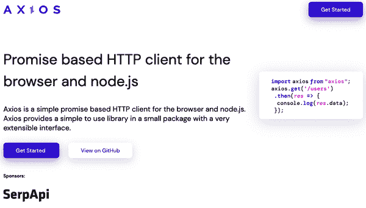
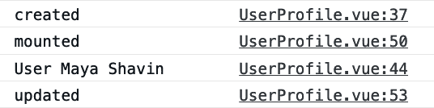

# 第六章：整合外部数据

前面的章节为你提供了与组件工作的基本要点，包括在组件之间传递数据以及处理组件内的数据变化和事件。现在你可以使用 Vue 组件将应用程序的数据展示在屏幕上，供用户使用了。

在大多数情况下，一个应用程序不会在其内部拥有所需的数据。相反，我们通常从外部服务器或数据库请求数据，然后将接收到的数据填充到我们应用程序的合适界面中。本章涵盖了开发强大的 Vue 应用程序的这一方面：如何使用 Axios 作为 HTTP 请求工具，与外部资源通信和处理外部数据。

# Axios 是什么？

对于向外部资源发出 HTTP 请求，Vue 开发者有多种选择，包括内置的 `fetch` 方法、经典的 `XMLHttpRequest` 和第三方库如 Axios。虽然内置的 `fetch` 适合仅用于获取数据的 HTTP 请求，但 Axios 在长期使用中提供了额外的功能，特别是在处理更复杂的外部资源 API 时非常实用。

Axios 是一个 JavaScript 开源轻量级库，用于发起 HTTP 请求。与 `fetch` 类似，它是基于 Promise 的 HTTP 客户端，在服务器端和浏览器端都能使用。

使用 Axios 的一些显著优势包括能拦截和取消 HTTP 请求以及在客户端提供内置的跨站请求伪造保护。另一个 Axios 的优点是它自动将响应数据转换为 JSON 格式，使你在处理数据时比使用内置的 `fetch` 更具开发者体验。

[Axios 官方网站](https://oreil.ly/WxSN3) 提供了 API 文档、安装说明以及主要用例参考（图 6-1）。



###### 图 6-1：Axios 官方网站

# 安装 Axios

要将 Axios 添加到你的 Vue 项目中，在项目的根目录下，可以使用以下命令：

```
yarn add axios
```

安装完 Axios 后，你可以在需要的组件中引入 Axios 库，使用以下代码：

```
import axios from 'axios';
```

然后，你可以使用 `axios` 开始查询应用程序的数据。让我们探讨如何结合 Axios 和生命周期钩子来加载和显示数据。

# 使用生命周期钩子和 Axios 加载数据

正如您在第三章中学到的那样，您可以使用`beforeCreate`、`created`和`beforeMounted`生命周期钩子执行诸如数据获取之类的副作用调用。然而，在需要加载外部数据并在组件内部使用且使用选项 API 的情况下，`beforeCreate`不是一个选择。Vue 在使用`beforeCreate`时会忽略任何数据赋值，因为它尚未初始化任何响应式数据。在这种情况下，使用`created`和`beforeMounted`更为合适。但是，`beforeMounted`在服务器端渲染中不可用，如果我们想使用组合 API（在第五章中介绍），则组合 API 中没有等效的生命周期函数来替代`created`钩子。

加载外部数据的更好选项是使用相关的响应式组合函数`setup()`或`<script setup>`。

让我们通过使用`axios.get()`方法向以下 URL 发出异步 GET 请求来获取有关我的 GitHub 公开信息：[*https://api.github.com/users/mayashavin*](https://api.github.com/users/mayashavin)，如下面的代码所示：

```
/**UserProfile.vue */
import axios from 'axios';
import { ref } from 'vue';

const user = ref(null);

axios.get('https://api.github.com/users/mayashavin')
    .then(response => {
        user.value = response.data;
    });
```

`axios.get()`返回一个 promise，可以使用 promise 链式方法`then()`来处理响应数据的解析。Axios 自动将 HTTP 响应体中的响应数据解析为适当的 JSON 格式。在这个例子中，我们将接收到的数据分配给组件的`user`数据属性。我们还可以重写此代码以使用`await/async`语法：

```
/**UserProfile.vue */
//...

async function getUser() {
    const response = await axios.get(
        'https://api.github.com/users/mayashavin'
    );
    user.value = response.data;
}

getUser();
```

我们还应该将代码包装在`try/catch`块中，以处理可能在请求期间发生的任何错误。因此，我们的代码变成：

```
/**UserProfile.vue */
import axios from 'axios';
import { ref } from 'vue';

const user = ref(null);
const error = ref(null); 

async function getUser() {
    try { 
        const response = await axios.get('https://api.github.com/users/mayashavin');

        user.value = response.data;
    } catch (error) {
        error.value = error; 
    }
}

getUser();
```


添加一个`error`数据属性来存储从请求中接收到的任何错误。


将代码包装在`try/catch`块中，以处理请求期间发生的任何错误。


将错误分配给`error`数据属性，以便在浏览器中向用户显示错误消息。

GitHub 通过一个包含在示例 6-1 中显示的主要字段的 JSON 对象响应我们的请求。

##### 示例 6-1\. `UserProfile` 类型

```
type User = {
  name: string;
  bio: string;
  avatar_url: string;
  twitter_username: string;
  blog: string;
  //...
};
```

使用这些响应数据，我们现在有了在屏幕上显示用户个人资料所需的必要信息。让我们将以下代码添加到我们组件的`template`部分：

```
<div class="user-profile" v-if="user">
    
    <div>
        <h1>{{ user.name }}</h1>
        <p>{{ user.bio }}</p>
        <p>Twitter: {{ user.twitter_username }}</p>
        <p>Blog: {{ user.blog }}</p>
    </div>
</div>
```

请注意，这里添加了`v-if="user"`以确保 Vue 仅在`user`可用时渲染用户资料。

最后，在示例 6-2 中，我们需要对组件的`script`部分进行一些修改，使代码完全兼容 TypeScript，包括将响应数据映射为`User`数据类型，然后将其分配给`user`属性，以及`error`。

##### 示例 6-2\. 用户资料组件

```
<template>
    <div class="user-profile" v-if="user">
        <!-- ... -->
    </div>
</template>
<script lang="ts" setup>
import axios from 'axios';
import { ref } from 'vue';

type User = { /**... */ }

const user = ref<User | null>(null) 
const error = ref<Error | null>(null)

async function getUser () {
    try {
        const response = await axios.get<User>(
            "https://api.github.com/users/mayashavin"
        )

        user.value = await response.data 
    } catch (err) {
        error.value = err as Error 
    }
}

getUser();
</script>
```


向`user`添加`User`类型声明。


将响应数据分配给`user`属性。


在分配给`error`属性之前将错误转换为`Error`类型。

当请求成功解析时，您将看到我的 GitHub 个人资料信息显示在屏幕上，如图 6-2 所示。


###### 图 6-2\. 成功获取 GitHub 个人资料请求的示例输出

类似地，您还可以添加一个带有`v-else-if="error"`条件的部分，以在请求失败时向用户显示错误消息：

```
<template>
<div class="user-profile" v-if="user">
    <!--...-->
</div>
<div class="error" v-else-if="error">
    {{ error.message }}
</div>
</template>
```

此时，当组件在创建过程中执行异步请求时，您可能想知道背后的实际操作。组件的生命周期操作是同步的，这意味着 Vue 仍然会继续创建组件，而不管异步请求的状态如何。这就带来了在运行时处理不同组件中的不同数据请求的挑战，我们将在接下来进行探讨。

# 运行时异步数据请求：挑战

类似于 JavaScript 引擎的工作方式，Vue 也是同步工作的。如果在途中有任何异步请求，Vue 不会等待请求完成再继续下一步骤。相反，Vue 完成组件的创建过程，然后根据执行顺序处理异步请求的解析或拒绝。

让我们退一步，在我们的组件中的`onBeforeMounted`、`onMounted`和`onUpdated`钩子中添加一些控制台日志，并查看执行顺序：

```
//<script setup> import { onBeforeMount, onMounted, onUpdated } from "vue";

//... async function getUser() {
  try {
    const response = await axios.get<User>(
        'https://api.github.com/users/mayashavin'
    );
    user.value = response.data;

    console.log('User', user.value.name) 
  } catch (err) {
    error.value = err;
  }
}

onBeforeMount(async () => {
    console.log('created') 
    getUser();
})

onMounted(() => {
    console.log("mounted"); 
});

onUpdated(() => {
    console.log("updated"); 
})
```


记录`user`完成获取后的详细信息到控制台。


记录生命周期状态：挂载前


记录生命周期状态：已挂载


记录生命周期状态：组件已更新

查看浏览器控制台日志，我们看到显示的顺序如图 6-3 中所示。



###### 图 6-3\. 异步请求的执行顺序

一旦异步请求解析或拒绝，并且有组件数据更改，Vue 渲染器将触发组件的更新过程。Vue 在将组件挂载到 DOM 之前，组件还未获取响应数据。因此，我们仍然需要处理组件在接收服务器数据之前的加载状态。

为此，我们可以向组件的数据添加另一个`loading`属性，并在请求解析/拒绝后禁用加载状态，如示例 6-3。

##### 示例 6-3\. 带有加载状态和错误状态的用户配置文件组件

```
//... const loading = ref<boolean>(false); 

async function getUser() {
    loading.value = true; 

    try {
        const response = await axios.get<User>(
            "https://api.github.com/users/mayashavin"
        )

        user.value = await response.data
    } catch (err) {
        error.value = err as Error
    } finally {
        loading.value = false; 
    }
}

getUser();
```


创建一个响应式的`loading`变量。


在获取数据之前将`loading`设置为`true`。


在请求解析/拒绝后将`loading`设置为`false`。

然后在组件的`template`部分添加`v-if="loading"`条件以显示加载消息，如示例 6-4。

##### 示例 6-4\. 带有加载状态和错误状态的用户配置文件组件模板

```
<template>
    <div v-if="loading">Loading...</div>
    <div class="user-profile" v-else-if="user">
        <!--...-->
    </div>
    <div class="error" v-else-if="error">
        {{ error.message }}
</div>
</template>
```

此代码在异步请求进行时呈现加载消息，并在请求解析时显示用户的配置文件信息或发送错误消息。

您还可以创建可重用的包装组件来处理组件的不同状态，例如在加载一组组件时使用骨架占位符组件（图 6-4）或者一个获取组件（接下来介绍）。


###### 图 6-4\. 用于加载状态的骨架组件

# 创建您的可重用获取组件

处理 Vue 组件的异步数据请求状态是一种常见的挑战。这些状态的 UI 通常遵循相同的模式：在加载状态下显示旋转器或加载消息，在出现错误时显示错误消息或更时尚的错误组件。因此，我们可以创建一个处理这些情况的通用组件，我们称之为`FetchComponent`。

`FetchComponent`的`template`部分使用`slot`和`v-if`划分为三个主要区域：

`#loading` slot 用于显示加载消息

此 slot 的渲染条件是组件处于`isLoading`状态。

`#error` slot 用于显示错误消息

我们还将`error`对象作为 slot props 传递，以便根据需要进行自定义，同时确保 Vue 仅在`error`可用时渲染此 slot。

`#default` slot 用于在接收到`data`时显示组件的内容

我们还将`data`作为 props 传递给 slot。

我们还使用命名的`slot`来允许自定义错误和加载组件，而不是使用默认消息：

```
<template>
  <slot name="loading" v-if="isLoading">
    <div class="loadin-message">Loading...</div>
  </slot>
  <slot :data="data" v-if="data"></slot>
  <slot name="error" :error="error" v-if="error">
    <div class="error">
      <p>Error: {{ error.message }}</p>
    </div>
  </slot>
</template>
```

在我们的`script setup`部分，我们需要声明我们的数据类型`FetchComponentData`，以便组件包含类型为泛型`Object`的`isLoading`、`error`和`data`属性：

```
const data = ref<Object | undefined>();
const error = ref<Error | undefined>();
const loading = ref<boolean>(false);
```

组件接收两个 props：`url`用于请求 URL，`method`用于请求方法，默认为`GET`：

```
//...

const props = defineProps({
    url: {
        type: String,
        required: true,
    },
    method: {
        type: String,
        default: "GET",
    },
});
//...
```

最后，当 Vue 创建组件时，我们进行异步请求并更新组件的状态：

```
async function fetchData () {
    try {
        loading.value = true;
        const response = await axios(props.url, {
            method: props.method,
            headers: {
                'Content-Type': 'application/json',
            },
        });
        data.value = response.data;
    } catch (error) {
        error.value = error as Error;
    } finally {
        loading.value = false;
    }
};

fetchData();
```

###### 注意

如果你提前知道`data`的类型，应该使用它们而不是`any`或`Object`来确保完整的 TypeScript 类型检查覆盖。除非没有其他方法，不要使用`any`。

现在我们可以重写示例 6-2 以使用新的`FetchComponent`组件，就像在示例 6-5 中一样。

##### 示例 6-5\. 使用`FetchComponent`的 UserProfile 组件

```
<template>
    <FetchComponent url="https://api.github.com/users/mayashavin"> 
        <template #default="defaultProps"> 
            <div class="user-profile"> 
                
                <div>
                    <h1>{{ (defaultProps.data as User).name }}</h1>
                    <p>{{ (defaultProps.data as User).bio }}</p>
                    <p>Twitter: {{(defaultProps.data as User).twitter_username }}</p>
                    <p>Blog: {{ (defaultProps.data as User).blog }}</p>
                </div>
            </div>
        </template>
    </FetchComponent>
</template>
<script lang="ts" setup> 
import FetchComponent from "./FetchComponent.vue";
import type { User } from "../types/User.type";
</script>
```


使用`FetchComponent`组件，并将`url`属性作为请求的目标 URL 传递给它（[*https://api.github.com/users/mayashavin*](https://api.github.com/users/mayashavin)）。


将组件的主要内容包装在`template`的主插槽`#default`中。我们还将此插槽接收的 props 绑定到`defaultProps`对象。由于`defaultProps.data`是`Object`类型，我们将其转换为`User`以通过 TypeScript 验证。


使用`defaultProps.data`来访问从请求接收到的数据并在 UI 上显示它。


移除所有相关的原始逻辑代码以进行获取。

在这里，我们从我们的`FetchComponent`实现将`data`传递到这个插槽，这在我们的原始`user`属性的情况下代表我们。因此，我们用`defaultProps.data`替换了以前实现中的`user`出现。输出保持不变。

# 使用 Composition API 实现 FetchComponent

你可以在`setup()`函数（或`<script setup>`标签）中使用`useFetch()`重写`FetchComponent`（参见示例 5-20)。

现在你理解如何创建一个简单的`FetchComponent`来在 Vue 组件的 UI 上获取和处理数据请求状态。你可能希望扩展它以处理更复杂的数据请求，如 POST 请求。通过在一个地方隔离数据请求和控制逻辑，你可以更快地减少复杂性并在其他组件中重用它。

# 将你的应用程序连接到外部数据库

此时，你可以在 Vue 组件的 UI 上处理外部数据请求和错误。然而，每次 Vue 创建组件时获取数据可能不是最佳实践，特别是如果组件的数据不太可能经常更改。

在 Web 应用程序中切换页面是一个完美的例子，我们只需要在首次加载视图时获取页面数据一次。在这种情况下，我们可以使用浏览器的本地存储作为外部本地数据库进行缓存数据，或者使用诸如 Vuex 和 Pinia 等状态管理服务（详见第 9 章）。

要使用本地存储，我们可以使用内置的浏览器`localStorage`API。例如，要将用户的 GitHub 配置文件数据保存到本地存储中，我们可以编写：

```
localStorage.setItem('user', JSON.stringify(user));
```

注意浏览器的 `localStorage` 将项目保存为字符串，因此在保存之前需要将对象转换为字符串。需要时，我们可以使用以下代码：

```
const user = JSON.parse(localStorage.getItem('user'));
```

您可以将上述代码添加到您的 `UserProfile` 组件中（示例 6-2），如下所示：

```
<script lang="ts">
import axios from 'axios';

//...

async function getUser() {
    try {
        const user = JSON.parse(localStorage.getItem('user'));
        if (user) return user.value = user;

        const response = await axios.get<User>(
            'https://api.github.com/users/mayashavin'
        );

        user.value = response.data;
        localStorage.setItem('user', JSON.stringify(user.value));
    } catch (error) {
        error.value = error as Error;
    }
}

getUser();
</script>
```

它将仅在第一次加载页面时触发异步调用。当再次加载页面时，如果我们已成功保存了数据，它将直接从本地存储中加载。

# 在实际应用中使用 `localStorage`

我不建议在实际应用中采用这种方法。它有几个限制，例如，浏览器会在私密/无痕会话中重置任何本地存储数据，或者用户可以禁用他们端上的本地存储。更好的方法是使用像 Vuex 或 Pinia 这样的状态管理工具（见 第九章）。

# 摘要

本章介绍了在 Vue 组件中处理异步数据的技术，借助 Axios 库和 Composition API 的帮助。我们学习了如何创建可重用的组件来获取和处理 UI 上的数据请求状态，以保持代码的整洁和可读性。我们还探讨了将应用连接到像本地存储这样的外部数据库服务。

下一章将介绍 Vue 的更高级渲染概念，包括使用函数式组件，在 Vue 应用程序中全局注册自定义插件，以及使用动态渲染条件和动态组合布局。
