# 第八章：路由

在前几章中，我们学习了 Vue 组件的基础知识以及组合 Vue 组件的不同方法。我们继续将可重用的组件逻辑作为独立的可组合部分使用 Composition API。我们还学习了有关渲染和自定义插件创建的更高级概念。

本章将通过向您介绍 Vue Router 的路由系统概念来探讨构建 Vue 应用程序的不同方面，Vue Router 是 Vue 应用程序的官方路由管理库，并介绍其核心 API。然后，我们学习如何配置应用程序的路由，通过路由守卫传递和处理数据，并为应用程序构建动态和嵌套路由。

# 什么是路由？

当用户在 Web 上导航时，他们在浏览器地址栏中输入统一资源定位符（URL）。URL 是 Web 中资源的地址。它包含许多部分，我们可以分为以下重要部分（图 8-1）：

位置

包括协议、应用程序的域名（或 Web 服务器的 IP 地址）和用于访问请求资源的端口。

路径

请求资源的路径。在 Web 开发中，我们使用它来根据预定义的路径模式在浏览器端确定要呈现的页面组件。

查询参数

一组用 `&` 符号分隔的键值对，用于向服务器传递附加信息。我们主要使用查询参数在页面之间传递数据。

锚点

`#` 符号后的任何文本。我们使用锚点在同一页面上导航到特定元素，通常与匹配的 `id` 值或媒体元素的时间间隔匹配。


###### 图 8-1\. URL 结构

当浏览器从用户接收到 URL 后，根据接收到的 URL 与服务器进行通信，返回请求的资源（如果有）。该资源可以是静态文件，如图像或视频，也可以是动态页面，如网页或 Web 应用程序。

在单页面应用程序（SPA）中，我们在浏览器端执行路由机制，从而实现平滑的页面导航而无需刷新浏览器。由于 URL 是页面的地址，我们使用路由系统将其路径模式连接到在应用程序中表示它的特定组件。

前端框架如 Vue 提供了构建单页面应用（SPA）组件的布局，但并未提供路由服务。为了创建完整的用户导航体验，我们必须自行设计和开发应用程序的路由，包括解决 SPA 的历史记录和书签等问题。

或者我们可以将 Vue Router 作为我们主要的路由引擎。

# 使用 Vue Router

作为 Vue 应用程序的官方路由服务，Vue Router 提供了一个控制机制，用于处理 Vue 应用程序中的页面导航。我们使用 Vue Router 来设置应用程序的路由系统，包括配置组件和页面之间的映射，为 SPA 的流程在客户端提供良好的用户体验。

###### 注意

官方 Vue Router 文档可在[Vue Router 网站](https://oreil.ly/AwUZo)找到，包含安装、API 和主要用例的相关信息供参考。

由于 Vue Router 是 Vue 框架中的独立包，因此我们需要执行额外的步骤来安装并准备在我们的应用程序中使用它，接下来我们将讨论这些步骤。

## 安装 Vue Router

使用 Vite 为新的 Vue 项目安装 Vue Router 的最简单方法是在设置期间选择“是”以安装 Vue Router（参见“创建新的 Vue 应用程序”）。然后，Vite 将负责安装 Vue Router 包，并用相关文件和文件夹（如图 8-2）搭建您的项目结构：

+   `router`文件夹中有一个名为`index.ts`的文件，其中包含应用程序的路由配置。

+   `views`文件夹中有两个示例 Vue 组件，`AboutView`和`HomeView`。每个组件是相关 URL 路径的视图，稍后我们将讨论它们。

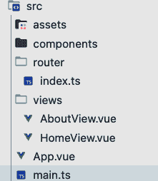

###### 图 8-2 在使用 Vite 启用 Vue Router 搭建后的项目结构

Vite 还会向`main.ts`文件中注入一些代码，以初始化 Vue Router。因此，创建的应用程序将启用主路由，并使其准备就绪。

然而，为了全面理解 Vue Router 的工作原理，我们将跳过搭建选项，并通过以下命令手动将 Vue Router 添加到我们现有的项目中：

```
yarn add -D vue-router@4
```

###### 注意

在本书中，我们使用的是 Vue Router 4.1.6 版本，这是撰写本文时的最新版本。您可以从[Vue Router NPM 页面](https://oreil.ly/h6Q0V)中使用`@`后的最新版本号替换它。

对于 Vue 3 项目，您应该使用 4 及以上版本。

为了展示 Vue Router 的功能，我们将构建一个 SPA，代表一个比萨订购系统。应用程序标题栏将包含以下页面链接：主页（Home）、关于（About）、比萨（Pizzas）、联系（Contact）和登录（Login）（参见图 8-3）。


###### 图 8-3 比萨之家应用程序带有导航标题

每个应用程序链接都指向一个由 Vue 组件表示的页面。对于每个应用程序页面，我们创建一个占位符组件，并将其保存在`views`文件夹中。我们的 Pizza House 代码库现在包含以下视图组件：

`HomeView`

我们应用程序的主页包含欢迎消息和比萨列表。

`AboutView`

关于页面将包含应用程序的简短描述。

`PizzasView`

显示用于订购的披萨列表。

`ContactView`

显示联系表单。

`LoginView`

显示用户登录表单。

我们需要将这些组件映射到适当的页面链接，示例见 第 8-1 表。

第 8-1 表。Pizza House 中可用路由及其对应组件和页面 URL 的表格

| 页面链接 | 组件 | 路由路径模式 |
| --- | --- | --- |
| *https://localhost:4000* | HomeView | `/` |
| *https://localhost:4000/about* | AboutView | `/about` |
| *https://localhost:4000/pizzas* | PizzasView | `/pizzas` |
| *https://localhost:4000/contact* | Contact | `/contact` |
| *https://localhost:4000/login* | LoginView | `/login` |

第 8-1 表 还显示了每个页面链接的相应路由模式。我们将使用这些模式来定义应用程序中的路由。

###### 注意

`localhost` 的 `4000` 端口是 Vite 的开发服务器的本地端口号。它可以根据您的 Vite 配置和本地运行项目时可用的端口而变化。

## 定义路由

路由是对页面 URL 的响应路径模式。我们在 Vue Router 中基于配置对象使用 `RouteRecordRaw` 接口定义路由。该配置对象包含以下在 第 8-2 表 中描述的属性。

第 8-2 表。路由配置对象的属性

| 属性 | 类型 | 描述 | 必须？ |
| --- | --- | --- | --- |
| `path` | `string` | 用于检查浏览器位置（浏览器 URL）的模式 | 是 |
| `component` | `Component` | 当浏览器位置匹配路由路径模式时要渲染的组件 | 否 |
| `name` | `string` | 路由的名称。我们可以使用它来避免在代码中硬编码 URL。 | 否 |
| `components` | `{ [name: string]: Component }` | 基于匹配路由名称渲染的组件集合 | 否 |
| `redirect` | `string` 或 `Location` 或 `Function` | 重定向路径 | 否 |
| `props` | `boolean` 或 `Object` 或 `Function` | 传递给组件的 props | 否 |
| `alias` | `string` 或 `Array<string>` | 别名路径 | 否 |
| `children` | `Array<RouteConfig>` | 子路由 | 否 |
| `beforeEnter` | `Function` | 导航守卫回调 | 否 |
| `meta` | `any` | 路由的元数据。我们可以使用它传递不在 URL 上可见的附加信息。 | 否 |
| `sensitive` | `Boolean` | 路由是否区分大小写。默认情况下，所有路由都是不区分大小写的；例如，`/pizzas` 和 `/Pizzas` 是同一个路由。 | 否 |
| `strict` | `Boolean` | 是否允许尾部斜杠（例如 `/about/` 或 `/about`） | 否 |

我们通常不使用所有可用字段来定义路由。例如，采取默认应用程序路径 (`/`)。仅需定义以下 `home` 路由对象即可，`path` 属性设置为 `/`，`component` 属性设置为 `HomeView`：

```
/**router/index.ts */
//import the required component modules

const homeRoute = {
  path: '/',
  name: 'home',
  component: HomeView
}
```

在上述代码中，Vue Router 将默认入口 URL（例如*https://localhost:4000*）映射到`/`情况，除非启用了`strict`模式。如果斜杠`/`后没有指示符，则 Vue Router 将`HomeView`组件渲染为默认视图。这种行为适用于以下两种情况：当用户访问*https://localhost:4000*或*https://localhost:4000/*时。

现在我们可以继续在`router`文件夹下的`index.ts`文件中配置我们应用的`routes`，将其配置为`RouteRecordRaw`配置对象的数组，如下所示的代码：

```
/**router/index.ts */
import { type RouteRecordRaw } from "vue-router";
//import the required component modules

const routes:RouteRecordRaw[]  = [
  {
    path: '/',
    name: 'home',
    component: HomeView
  },
  {
    path: '/about',
    name: 'about',
    component: AboutView
  },
  {
    path: '/pizzas',
    name: 'pizzas',
    component: PizzasView
  },
  {
    path: '/contact',
    name: 'contact',
    component: ContactView
  },
  {
    path: '/login',
    name: 'login',
    component: LoginView
  }
]
```

# 使用命名路由

本章节使用具有`name`属性的命名路由。我建议在您的应用程序中使用这种方法，使代码更具可读性和可维护性。

这已经很简单了。我们已经为我们的 Pizza House 定义了必要的路由。但是我们的路由系统需要更多东西才能工作。我们必须从给定的路由创建一个路由器实例，并在初始化时将其插入到我们的 Vue 应用程序中。接下来我们将这样做。

## 创建路由实例

我们可以使用`vue-router`包中的`createRouter`方法创建路由器实例。此方法接受一个`RouterOptions`类型的配置对象作为参数，其中包含以下主要属性：

`history`

历史模式对象可以基于哈希或基于 Web（HTML 历史模式）。基于 Web 的方法利用 HTML5 历史 API 使 URL 可读，允许我们在不重新加载页面的情况下导航。

`routes`

用于在路由器实例中使用的路由数组。

`linkActiveClass`

用于激活链接的类名。默认情况下是`router-link-active`。

`linkExactActiveClass`

用于精确激活链接的类名。默认情况下是`router-link-exact-active`。

###### 注意

`RouterOptions`接口的其他不太常见属性在[RouterOptions 文档](https://oreil.ly/pcSqw)中可用。

我们使用`vue-route`包中的`createWebHistory`方法来创建基于 web 的`history`对象。该方法接受一个可选参数，表示基本 URL 的字符串：

```
/**router/index.ts */
import {
  createRouter,
  createWebHistory,
  type RouteRecordRaw
} from 'vue-router';

const routes: RouteRecordRaw[] = [/**... */]

export const router = createRouter({
  history: createWebHistory("https://your-domain-name"),
  routes
})
```

但是，将基本 URL 作为静态字符串传递并不是一个好习惯。我们希望保持基本 URL 可配置并独立，适用于不同的环境，如开发和生产。为此，Vite 提供了环境对象`import.meta.env`，其中包含一个`BASE_URL`属性。您可以在专用的环境文件中设置`BASE_URL`值，通常以`.env`前缀表示，或者通过运行 Vite 服务器时的命令行设置。然后，Vite 会提取相关的`BASE_URL`值并将其注入到`import.meta.env`对象中，我们可以在我们的代码中使用它，如下所示：

```
/**router/index.ts */
import {
  createRouter,
  createWebHistory,
  type RouteRecordRaw
} from 'vue-router';

const routes: RouteRecordRaw[] = [/**... */]

export const router = createRouter({
  history: createWebHistory(import.meta.env.BASE_URL),
  routes
})
```

# 使用环境文件中的`BASE_URL`

您不必在开发中的`.env`文件中设置`BASE_URL`值。Vite 会自动将其映射到本地服务器 URL。

大多数现代托管平台（如 Netlify）在部署期间会为您设置`BASE_URL`值，通常为应用程序的域名。

我们已经从给定的 `routes` 和所需的 `history` 模式创建了路由实例。下一步是将这个实例插入到我们的 Vue 应用程序中。

## 将路由实例插入到 Vue 应用程序中

在 `main.ts` 文件中初始化应用程序实例 `app` 的地方，我们将导入创建的 `router` 实例，并将其作为参数传递给 `app.use()` 方法：

```
/**main.ts */
import { createApp } from 'vue'
import App from './App.vue'
import { router } from './router'

const app = createApp(App)

app.use(router)

app.mount('#app')
```

我们的应用程序现在具有了用于在页面之间导航的路由系统。但是，如果现在运行应用程序，您会看到在导航到 `/about` 路径时仍然没有渲染 `AboutView` 组件。我们必须修改我们的 `App.vue` 组件以显示适合路由路径的组件配置。接下来我们就来做这件事。

## 使用 RouterView 组件渲染当前页面

为了动态生成特定 URL 路径的所需视图，Vue Router 提供了 `RouterView`（或 `router-view`）作为占位符组件。在运行时，Vue Router 将根据提供的配置替换为与当前 URL 模式匹配的元素。我们可以在 `App.vue` 组件中使用此组件来渲染当前页面：

```
/**App.vue */
<script setup lang="ts">
import { RouterView } from 'vue-router'
</script>
<template>
  <RouterView />
</template>
```

在运行应用程序时，默认主页现在是 `HomeView`（参见 图 8-4）。当使用浏览器的位置栏导航到 `/about` 时，您会看到 `AboutView` 组件被渲染了（参见 图 8-5）。

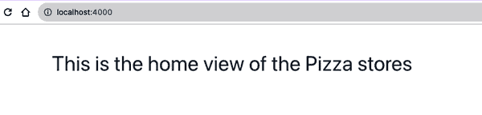

###### 图 8-4\. 应用程序显示了 `HomeView` 组件，对应路径为 `"/"`


###### 图 8-5\. 应用程序显示了 `AboutView` 组件，对应路径为 `"/about"`

由于 `RouterView` 是一个 Vue 组件，我们可以向其传递 props、attributes 和事件监听器。`RouterView` 将把它们传递给渲染的视图来处理。例如，我们可以使用 `RouterView` 添加一个类：

```
/**App.vue */
<template>
  <RouterView class="view" />
</template>
```

渲染的组件——例如 `AboutView`——将会接收 `class` 作为主要容器元素（参见 图 8-6），我们可以相应地用它来进行 CSS 样式设置。

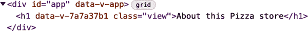

###### 图 8-6\. `AboutView` 组件从 `RouterView` 组件接收 `class` 属性

到目前为止，我们已经学习了如何设置应用程序的路由并使用 `RouterView` 组件渲染当前页面。然而，通过手动在浏览器地址栏设置 URL 路径来导航似乎对用户来说并不是很方便。为了增强我们应用程序的用户体验，我们可以组合一个包含导航链接的页眉，使用 `a` 元素和完整路径。或者，我们可以使用内置的 `RouterLink` 组件来构建到我们的路由的链接，接下来我们将讨论这个内容。

## 使用 RouterLink 组件构建导航栏

Vue Router 提供了 `RouterLink`（或 `router-link`）组件，用于根据给定的 `to` 属性生成交互和可导航的元素，用于特定路由路径。路由路径可以是字符串，其值与路由配置中的 `path` 相同，如以下示例用于导航到关于页面的链接：

```
  <router-link to="/about">About</router-link>
```

或者，我们可以传递一个代表路由位置对象的对象，包括路由参数的 `name` 和 `params`：

```
  <router-link :to="{ name: 'about' }">About</router-link>
```

默认情况下，该组件将使用带有 `href` 和类似于 `router-link-active` 和 `router-link-exact-active` 的类的锚元素 (`a`) 进行渲染。我们可以使用布尔型 `custom` 属性和 `v-slot` 将默认元素更改为任何其他元素，通常是另一个交互元素，如 `button`，如下例所示：

```
  <router-link custom to="/about" v-slot="{ navigate }" >
    <button @click="navigate">About</button>
  </router-link>
```

此代码将呈现一个 `button` 元素，而不是默认的 `a` 元素，绑定 `navigate` 函数以在点击时导航到给定的路由。

# 使用 `custom` 属性

如果您使用 `custom` 属性，必须将 `navigate` 函数绑定为点击处理程序或将 `href` 链接到自定义元素。否则，导航将无法正常工作。

当自定义元素激活时，不会添加类名如 `router-link-active` 或 `router-link-exact-active`。

让我们使用 `RouterLink` 构建我们的导航栏 `NavBar`，如 示例 8-1 所示。

##### 示例 8-1\. `NavBar` 组件

```
/**NavBar.vue */

<template>
  <nav>
    <router-link :to="{ name: 'home' }">Home</router-link>
    <router-link :to="{ name: 'about' }">About</router-link>
    <router-link :to="{ name: 'pizzas' }">Pizzas</router-link>
    <router-link :to="{ name: 'contact' }">Contact</router-link>
    <router-link :to="{ name: 'login' }">Login</router-link>
  </nav>
</template>
```

我们还向导航栏和活动链接添加了一些 CSS 样式：

```
/**NavBar.vue */

<style scoped>
nav {
  display: flex;
  gap: 30px;
  justify-content: center;
}

.router-link-active, .router-link-exact-active {
  text-decoration: underline;
}
</style>
```

# 使用 `activeClass` 和 `exactActiveClass` 属性

您可以使用 `RouterLink` 的 `activeClass` 和 `exactActiveClass` 属性来自定义活动链接的类名，而不是使用默认的类名。

一旦我们将 `NavBar` 添加到 `App` 组件中，我们将在页面顶部看到导航栏 (图 8-7)。


###### 图 8-7\. 应用程序的导航栏

现在，我们的用户可以使用导航栏在页面之间导航。但是，我们仍然需要处理页面之间的数据流。在接下来的几节中，我们将看到如何使用路由参数在路由之间传递数据。

# 在路由之间传递数据

要在路由之间传递数据，我们可以使用传递给 `to` 的路由器对象中的 `query` 字段：

```
<router-link :to="{ name: 'pizzas', query: { id: 1 } }">Pizza 1</router-link>
```

`query` 字段是一个对象，包含我们要传递给路由的查询参数。Vue Router 将其转换为带有查询参数的完整 `href` 路径，以 `?` 语法开始：

```
<a href="/pizzas?id=1">Pizza 1</a>
```

然后，我们可以使用 `useRoute()` 函数在路由组件 `PizzasView` 中访问查询参数。

```
<template>
  <div>
    <h1>Pizzas</h1>
    <p v-if="pizzaId">Pizza ID: {{ pizzaId }}</p>
  </div>
</template>
<script lang="ts" setup>
import { useRoute } from "vue-router";

const route = useRoute();
const pizzaId = route.query?.id;
</script>
```

此代码将呈现以下页面，其中浏览器的 URL 是 *http://localhost:4000/pizzas?id=1* (图 8-8)。

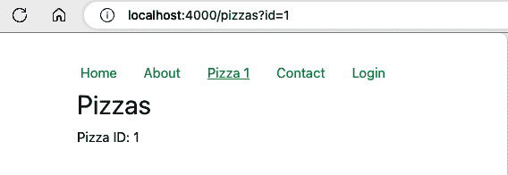

###### 图 8-8\. 带有查询参数的披萨页面

您还可以在浏览器地址栏中传递查询参数，路由器实例将相应地将其解耦为`route.query`对象。这种机制在许多情况下都很方便。例如，考虑我们的`PizzasView`页面。此页面显示了使用`usePizzas`钩子从中获取的披萨列表，使用`PizzaCard`组件，如示例 8-2 所示。

##### 示例 8-2\. `PizzasView`组件

```
<template>
  <div class="pizzas-view--container">
    <h1>Pizzas</h1>
    <ul>
      <li v-for="pizza in searchResults" :key="pizza.id">
        <PizzaCard :pizza="pizza" />
      </li>
    </ul>
  </div>
</template>
<script lang="ts" setup>
import PizzaCard from "@/components/PizzaCard.vue";
import { usePizzas } from "@/composables/usePizzas";

const { pizzas } = usePizzas();
</script>
```

现在我们想要添加一个搜索功能，用户可以通过标题使用查询参数`search`搜索披萨，并获取经过筛选的披萨列表。我们可以添加一个`useSearch`钩子，它接收`route.query.search`的值作为初始值，并返回经过筛选的披萨列表以及响应式的`search`值，如示例 8-3 所示。

##### 示例 8-3\. 实现`useSearch`钩子

```
import { computed, ref, type Ref } from "vue";

type UseSearchProps = {
  items: Ref<any[]>;
  filter?: string;
  defaultSearch?: string;
};

export const useSearch = ({
  items,
  filter = "title",
  defaultSearch = "",
}: UseSearchProps) => {
  const search = ref(defaultSearch);
  const searchResults = computed(() => {
    const searchTerm = search.value.toLowerCase();

    if (searchTerm === "") {
      return items.value;
    }

    return items.value.filter((item) => {
      const itemValue = item[filter]?.toLowerCase()
          return itemValue.includes(searchTerm);
        });
  });

  return { search, searchResults };
};
```

然后我们在`PizzasView`组件中使用`useSearch`钩子，并将迭代方式更改为遍历`searchResults`而不是`pizzas`：

```
<template>
  <!--...other code -->
    <li v-for="pizza in searchResults" :key="pizza.id">
      <PizzaCard :pizza="pizza" />
    </li>
  <!--...other code -->
</template>
<script lang="ts" setup>
/**...other imports */
import { useRoute } from "vue-router";
import { useSearch } from "@/composables/useSearch";
import type { Pizza } from "@/types/Pizza";

/**...other code */
const route = useRoute();

type PizzaSearch = {
  search: Ref<string>;
  searchResults: Ref<Pizza[]>;
};

const { search, searchResults }: PizzaSearch = useSearch({
  items: pizzas,
  defaultSearch: route.query?.search as string,
});
</script>
```

现在当您访问`/pizzas?search=hawaii`时，列表将仅显示标题为`Hawaii`的披萨（图 8-9）。

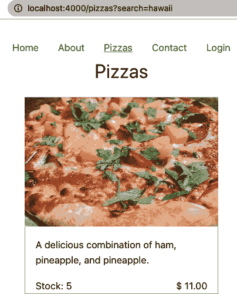

###### 图 8-9\. 具有查询参数中搜索词的披萨页面

考虑允许用户在页面上进行搜索，然后将更新后的搜索词与查询参数同步？为此，我们需要进行以下更改：

+   在`template`中添加一个输入字段，并将其绑定到`search`变量：

```
<template>
  <!--...other code -->
  <input v-model="search" placeholder="Search for a pizza" />
  <!--...other code -->
</template>
```

+   使用`useRouter()`方法获取`router`实例：

```
/**...other imports */
import { useRoute, useRouter } from "vue-router";

/**...other code */
const router = useRouter();
```

+   使用`watch`函数监听`search`值的变化，并使用`router.replace`更新查询参数。

```
/**...other imports */
import { watch } from 'vue';

/**...other code */
watch(search, (value, prevValue) => {
  if (value === prevValue) return;
  router.replace({ query: { search: value } });
});
```

当您在搜索栏中输入时，路由器实例将使用新的查询值更新 URL。

###### 注意

如果您使用的是 Vue 2.x 及以下版本或 Options API（没有使用`setup()`），可以分别使用`this.$router`和`this.$route`来访问`router`和`route`实例。

到目前为止，我们已经学会了如何使用`route`实例检索查询参数。在每个需要访问查询参数的组件中使用`route`实例可能会很麻烦。相反，我们可以使用 props 解耦查询参数，接下来我们将学习这一点。

# 使用 Props 解耦路由参数

在路由配置对象中，我们可以定义静态 props 以作为对象传递给视图组件的静态值或返回 props 的函数。例如，在以下代码中，我们改变了我们的`pizzas`路由配置以传递`searchTerm` prop，其值来自`route.query.search`，传递给`PizzaView`组件：

```
import {
  type RouteLocationNormalizedLoaded,
  type RouteRecordRaw,
} from "vue-router";

const routes: RouteRecordRaw = [
  /** other routes */
  {
    path: "/pizzas",
    name: "pizzas",
    component: PizzasView,
    props: (route: RouteLocationNormalizedLoaded) => ({
      searchTerm: route.query?.search || "",
    }),
  },
];
```

在`PizzasView`组件中，我们可以移除对`useRoute`的使用，并使用`props`对象访问`searchTerm` prop：

```
const props = defineProps({
  searchTerm: {
    type: String,
    required: false,
    default: "",
  },
});

const { search, searchResults }: PizzaSearch = useSearch({
  items: pizzas,
  defaultSearch: props.searchTerm,
});
```

应用程序的行为与以前相同。

你还可以使用`props: true`将`route.params`对象作为 props 传递给视图组件，而不需要关心任何特定的 props。当路由改变时，我们可以将这种方法与导航卫兵结合起来，以执行路由参数的副作用。关于导航卫兵的更多信息将在下一节中介绍。

# 理解导航卫兵

导航卫兵是帮助我们更好地控制导航流程的函数。我们还可以使用它们在路由改变或导航发生之前执行副作用。有三种类型的导航卫兵和钩子：全局、组件级别和路由级别。

## 全局导航卫兵

对于每个路由器实例，Vue Router 公开了一组全局级别的导航卫兵，包括：

`router.beforeEach`

在每次导航之前调用

`router.beforeResolve`

在 Vue Router 解析路由的所有异步组件和所有组件内卫兵（如果有的话）之后，但在确认导航之前调用

`router.afterEach`

在确认导航之后和 DOM 的下一次更新之前调用

全局卫兵帮助在导航到特定路由之前执行验证。例如，我们可以使用`router.beforeEach`来检查用户是否在导航到`/pizzas`路由之前进行了身份验证。如果没有，我们可以将用户重定向到`/login`页面：

```
const user = {
  isAuthenticated: false,
};

router.beforeEach((to, from, next) => {
  if (to.name === "pizzas" && !user.isAuthenticated) {
    next({ name: "login" });
  } else {
    next();
  }
});
```

在这段代码中，`to`是要导航到的目标路由对象，`from`是当前路由对象，`next`是一个函数，用于调用以解析钩子/卫兵。我们需要在最后触发`next()`，要么没有任何参数继续到原始目标，要么用新的路由对象作为其参数重定向用户到不同的路由。否则，Vue Router 将阻止导航流程。

###### 注意

或者，我们可以使用`router.beforeResolve`来执行相同的验证。`router.beforeEach`和`router.beforeResolve`之间的关键区别在于，Vue Router 在解析所有组件内卫兵后触发后者。然而，当你想要在确认导航之前避免加载适当的异步组件时，等待一切解决后再调用回调将不太有价值。

`router.afterEach`怎么样？我们可以利用这个钩子执行动作，如将某些页面数据保存为缓存，跟踪页面分析，或者在从登录页面导航时对用户进行身份验证：

```
router.afterEach((to, from) => {
  if (to.name === "login") {
    user.isAuthenticated = true;
  }
});
```

虽然全局卫兵帮助执行副作用并控制整个应用程序的重定向，但在某些情况下，我们只想为特定路由实现副作用。在这种情况下，使用路由级别卫兵是一个不错的选择。

## 路由级别导航卫兵

对于每个路由，我们可以定义 `beforeEnter` 守卫的回调函数，当从一个路径进入另一个路径时，Vue Router 将触发此守卫。例如我们的 `/pizzas` 路由。与其将 `props` 字段与函数映射，我们可以通过手动设置 `to.params.``searchTerm` 字段为 `to.query.search`，在进入路由之前将搜索查询映射为视图的一个 prop：

```
const routes: RouteRecordRaw = [
  /** other routes */
  {
    path: "/pizzas",
    name: "pizzas",
    component: PizzasView,
    props: true,
    beforeEnter: async (to, from, next) => {
      to.params.searchTerm = (to.query.search || "") as string;

      next()
    },
  },
];
```

注意，我们在比萨路由中设置了 `props: true`。UI 仍将显示与之前相同的比萨列表（见 图 8-10）。

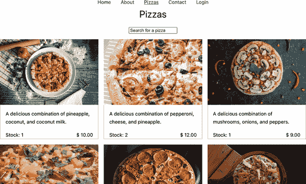

###### 图 8-10\. 比萨列表

我们可以在这个守卫内手动修改 `to.query.searchTerm`。然而，这些更改不会反映在浏览器地址栏中的 URL 路径上。如果我们想要更新 URL 路径，我们可以使用 `next` 函数将用户重定向到一个新的路由对象，并带有所需的查询参数。

# 将回调函数数组传递给 beforeEnter

`beforeEnter` 也接受一个回调函数数组，Vue Router 将按顺序触发这些回调。因此，我们可以为特定路由执行多个副作用，然后再进入它。

像其他全局守卫一样，`beforeEnter` 守卫在您想要执行认证到特定路由、在将路由参数传递给视图组件之前进行额外修改等情况时非常有用。接下来，我们将学习如何利用组件级别的守卫来为特定视图执行副作用。

## 组件级别的路由守卫

从 Vue 3.x 开始，Vue Router 在组件级别也提供了可组合的守卫，以帮助控制路由的离开和更新流程，例如 `onBeforeRouteLeave` 和 `onBeforeRouteUpdate`。当用户从当前路径视图导航离开时，Vue Router 触发 `onBeforeRouteLeave`，而用户在同一路径视图但参数不同的情况下导航时，则调用 `onBeforeRouteUpdate`。

我们可以使用 `onBeforeRouteLeave` 显示一个消息来确认用户是否导航离开联系页面，代码如下：

```
import { onBeforeRouteLeave } from "vue-router";

onBeforeRouteLeave((to, from, next) => {
  const answer = window.confirm("Are you sure you want to leave?");

  next(!!answer);
});
```

当您位于联系页面并尝试导航到另一页时，您将看到一个确认弹窗询问您确认导航，如图 8-11 所示。单击取消按钮将阻止导航，单击确定按钮将继续导航。

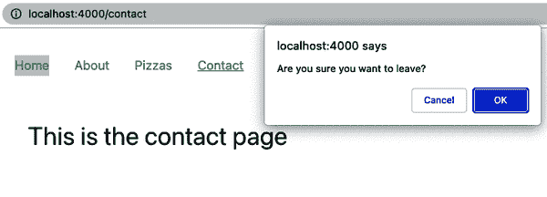

###### 图 8-11\. 确认弹窗

###### 注意

如果您的组件使用 Options API，那么 `beforeRouteLeave` 和 `beforeRouteUpdate` 守卫将在选项对象中可用，以实现相同的功能。

还有一个 `beforeRouteEnter` 钩子，在 Vue 初始化视图组件之前，路由器会触发这个守卫。此守卫类似于 `setup()` 钩子；因此，Vue Router 的 API 中没有等价的可组合函数。

我们已经探索了路由系统中不同级别的导航守卫及其执行顺序，如 图 8-12 所示。

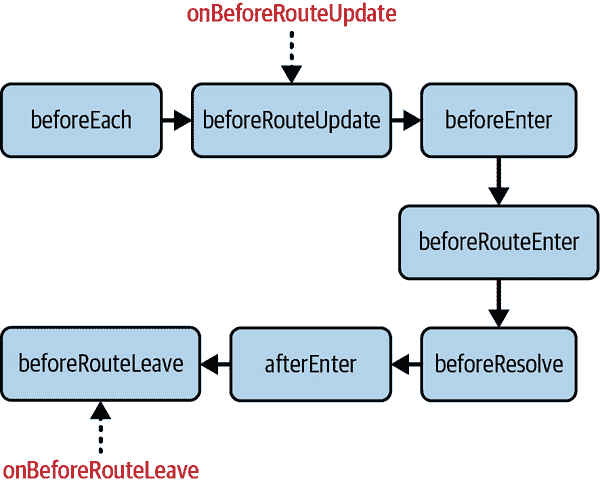

###### Figure 8-12\. 触发导航守卫及其等效组合的顺序

理解导航流程和守卫执行顺序对于构建强大的路由系统至关重要。接下来，我们将学习如何为我们的应用程序创建嵌套路由。

# 创建嵌套路由

到目前为止，我们已经为我们的应用程序构建了基本的单级路由系统。实际上，大多数路由系统都更复杂。有时，我们希望为特定页面创建子页面，例如常见问题解答（FAQ）页面和联系页面的表单页面：

```
  /contact/faq
  /contact/form
```

`/contact` 页面的默认 UI 将是 `ContactView` 页面，用户可以通过在此页面上显示的链接点击转到 Form 页面。在这种情况下，我们需要使用路由配置对象的 `children` 字段为 `/contact` 页面创建嵌套路由。

首先创建 `ContactFaqView` 和 `ContactFormView` 组件，以便路由匹配时渲染它们，然后修改我们的 `/contact` 路由：

```
const routes = [
  /**...other routes */
  {
    path: "/contact",
    name: "contact",
    component: ContactView,
    children: [
      {
        path: "faq",
        name: "contact-faq",
        component: ContactFaqView,
      },
      {
        path: "form",
        name: "contact-form",
        component: ContactFormView,
      },
    ],
  },
];
```

我们还必须在 `ContactView` 内部桩设占位符组件 `RouterView`，以渲染嵌套路由。例如，让我们向 `ContactView` 添加以下代码：

```
<template>
  <div class="contact-view--container">
    <h1>This is the contact page</h1>
    <nav>
      <router-link to="/contact/faq">FAQs</router-link>
      <router-link to="/contact/form">Contact Us</router-link>
    </nav>
    <router-view />
  </div>
</template>
```

现在，当用户分别导航到 *http://localhost:4000/contact/faq*（图 8-13）和 *http://localhost:4000/contact/form* 时，该 Contact 组件将渲染 `ContactFaqView` 和 `ContactFormView`。

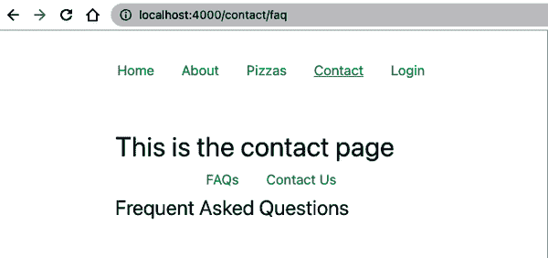

###### Figure 8-13\. 访问 http://localhost:4000/contact/faq 时的示例输出

当我们想要为包含嵌套视图及其嵌套路由的页面创建特定的 UI 布局时，这种方法非常有益。

我们已经看到如何在父布局中创建嵌套路由。然而，在某些情况下，我们希望在没有父布局的情况下创建嵌套方式，因此必须将父路由的默认路径声明为其嵌套路由对象的路径。例如，我们可以将父 `/contact` 路由的 `name` 和 `component` 移动到空路径模式的嵌套路径中。

```
const routes = [
  /**...other routes */
  {
    path: "/contact",
    children: [
      /**... other children */,
      {
        path: "",
        name: "contact",
        component: ContactView,
      }
    ],
  },
];
```

这样，当用户导航到 *http://localhost:4000/contact/faq* 时，只有 `ContactFaqView` 组件将作为单独的页面渲染，而不包含 `ContactView` 的内容（图 8-14）。

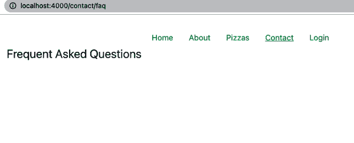

###### Figure 8-14\. 访问 http://localhost:4000/contact/faq 时的示例输出

###### 注意

正如您在屏幕截图中所看到的，导航栏中的联系人链接仍然处于活动状态。这种行为发生的原因是联系人页面的链接元素仍然具有`router-link-active`类，但不具有`router-link-exact-active`类。我们可以通过仅为确切活动的链接定义 CSS 规则来解决这个样式问题。

在现实世界的应用程序中，使用嵌套路由非常普遍；实际上，我们的`routes`数组已经作为应用程序路由器实例的嵌套子级。声明嵌套路由是组织路由结构和创建动态路由的一个很好的方法，我们将在下一节中探讨。

# 创建动态路由

Vue Router 最有用的功能之一是设置具有路由参数（路由参数）的动态路由，这些参数是从 URL 路径中提取的变量。当我们有一个动态数据驱动的路由结构时，路由参数非常有用。每个路由共享一个典型模式，只有唯一标识符（例如用户或产品 id）不同。

让我们修改 Pizza House 的路由并添加一个动态路径，以便每次显示一个 pizza。一种选项是定义一个新的路由`/pizza`，并将 pizza 的 id 作为其查询参数传递，如我们在“在路由之间传递数据”中学到的那样。然而，更好的选择是修改`/pizzas`路由，并向其添加一个新的嵌套路由，路径模式为`:id`，如下所示：

```
const routes = [
  /**...other routes */
  {
    path: "/pizzas",
    /**...other configurations */
    children: [{
        path: ':id',
        name: 'pizza',
        component: PizzaView,
    }, {
        path: '',
        name: 'pizzas',
        component: PizzasView,
    }]
  },
]
```

通过使用`:id`，Vue Router 将匹配任何具有类似格式的路径，例如*/pizzas/1234-pizza-id*，并将提取的 id（例如`1234-pizza-id`）保存为`route.params.id`字段。

由于我们已经了解了路由配置对象中的`props`字段，我们可以将其值设置为`true`，从而使路由参数自动映射到`PizzaView`的 props 中：

```
const routes = [
  /**...other routes */
  {
    path: "/pizzas",
    /**...other configurations */
    children: [{
        path: ':id',
        name: 'pizza',
        component: PizzaView,
        props: true,
    },
    /**...other nested routes */
    ],
  },
]
```

在绑定的`PizzaView`组件中，我们使用`defineProps()`将`id`声明为组件的 props，并使用`useRoute`钩子从`pizzas`数组中检索 pizza 的详细信息：

```
import { usePizzas } from "@/composables/usePizzas";

const props = defineProps({
  id: {
    type: String,
    required: true,
  },
});

const { pizzas } = usePizzas();

const pizza = pizzas.value.find((pizza) => pizza.id === props.id);
```

在`PizzaView`组件中，我们可以如下显示`pizza`的详细信息：

```
<template>
  <section v-if="pizza" class="pizza--container">
    
    <div class="pizza--details">
      <h1>{{ pizza.title }}</h1>
      <div>
        <p>{{ pizza.description }}</p>
        <div class="pizza-stock--section">
          <span>Stock: {{ pizza.quantity || 0 }}</span>
          <span>Price: ${{ pizza.price }}</span>
        </div>
      </div>
    </div>
  </section>
  <p v-else>No pizza found</p>
</template>
```

现在，当您导航到`/pizzas/1`时，其中`1`是列表中现有 pizza 的 id 时，`PizzaView`组件将显示 pizza 的详细信息，如图 8-15 所示。

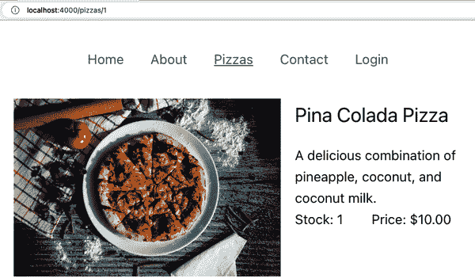

###### 图 8-15\. Pizza 详细页面

# 从服务器获取数据

理想情况下，您应该避免再次从服务器获取数据，例如在`PizzaView`组件中的`pizzas`。相反，您应该使用数据存储管理，如 Pinia（第 9 章），将获取的`pizzas`存储起来，并在需要时从存储中检索它们。

到目前为止，我们已经探讨了如何创建嵌套和动态路由，并将路由的参数解耦为 props。在下一节中，我们将学习如何使用 Vue Router 为我们的应用程序实现自定义后退和前进按钮。

# 使用路由实例进行前进和后退

在网页应用程序中实现自定义返回按钮是一个常见功能，除了使用浏览器的原生返回按钮外，我们还可以使用 `router.back()` 方法导航到历史堆栈中的前一页，其中 `router` 是从 `useRouter()` 接收到的应用程序路由器实例：

```
<template>
  <button @click="router.back()">Back</button>
</template>
<script setup lang="ts">
import { useRouter } from "vue-router";

const router = useRouter();
</script>
```

要在历史堆栈中前进，我们可以使用 `router.forward()` 方法：

```
<template>
  <button @click="router.forward()">Forward</button>
</template>
<script setup lang="ts">
import { useRouter } from "vue-router";

const router = useRouter();
</script>
```

# 使用 `router.go()` 导航到历史堆栈中的特定页面

您还可以使用 `router.go()` 方法，该方法接受历史堆栈中要向后或向前移动的步数作为参数。例如，`router.go(-2)` 将导航到两步之前的页面，而 `router.go(2)` 将向前跳两步（如果存在）。

我们已经探讨了 Vue Router 的基础知识，并为我们的应用程序创建了一个基本的路由系统，包含所有我们需要的页面。但有一件事情我们需要处理：如果尝试导航到不存在的路径，将会看到一个空白页面。这种情况发生是因为 Vue Router 无法找到匹配的组件来渲染，当用户尝试导航到不存在的路径时。这将是我们下一个话题。

# 处理未知路由

在大多数情况下，我们无法控制用户在使用我们的应用程序时尝试导航的所有路径。例如，用户可能尝试访问 *https://localhost:4000/pineapples*，对于这些路径，我们尚未定义路由。在这种情况下，我们可以使用正则表达式模式 `/:pathMatch(.**)**` 作为新 `error` 路由中的 `path` 来向用户显示 404 页面：

```
/**router/index.ts */

const routes = [
  /**... */
  {
    path: '/:pathMatch(.*)*',
    name: 'error',
    component: ErrorView
  }
]
```

Vue Router 将根据模式 `/:pathMatch(.**)**` 匹配未找到的路径，并将匹配的路径值存储在路由位置对象的 `pathMatch` 参数中。

# 使用正则表达式匹配未知路径

可以将`pathMatch`替换为任何其他你想要的名字。它的目的是让 Vue   可以将 `pathMatch` 替换为你想要的任何名称。其目的是让 Vue Router 知道要存储匹配路径的值。

在 `ErrorView` 组件中，我们可以向用户显示一条消息：

```
<!--ErrorView.vue -->

<template>
  <h1>404 - Page not found</h1>
</template>
```

现在，当我们尝试访问 *https://localhost:4000/pineapples* 或任何未知路径时，将会显示 404 页面。

此外，我们还可以使用 `vue-router` 包的 `useRoute()` 方法来访问当前路由位置并显示其路径的值：

```
<!--ErrorView.vue -->

<template>
  <h1>404 - Page not found</h1>
  <p>Path: {{ route.path }}</p>
</template>
<script lang="ts" setup>
import { useRoute } from 'vue-router'

const route = useRoute()
</script>
```

此代码将显示当前路由的路径，例如在本例中为 `/pineapples`（参见图 8-16](#figure_07_error)）。

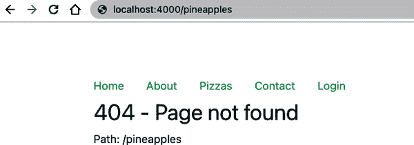

###### 图 8-16\. 404 页面

或者，我们可以在路由配置中使用 `redirect` 属性将用户重定向到特定路由，例如主页，当他们访问未知路径时。例如，我们可以重写我们的 `error` 路由如下：

```
/**router/index.ts */

const routes = [
  /**... */
  {
    path: '/:pathMatch(.*)*',
    redirect: { name: 'home' }
  }
]
```

当我们访问一个未知路径时，路由实例会自动将我们重定向到首页，我们不再需要 `ErrorView` 组件。

# 总结

在本章中，我们探讨了如何利用 Vue Router 在我们的应用程序中使用不同的 API 构建路由系统。

在路由之间移动需要数据流保持一致，就像处理不直接处于父子关系的组件之间的数据流一样。为了解决这个挑战，我们需要为我们的应用程序设计一个高效的数据管理系统。下一章介绍了 Pinia，Vue 官方的数据管理库，以及如何利用 Pinia 的 API 构建一个高效、可重复使用的数据管理系统。
