# 第九章：使用 Pinia 进行状态管理

前一章指导我们使用 Vue Router 构建应用程序的路由，包括嵌套路由、路由守卫和动态路由导航。

在本章中，我们将学习使用 Pinia 管理状态以及如何在 Vue 应用程序中管理数据流。Pinia 是 Vue 官方推荐的状态管理库，我们还将探讨如何构建应用程序的可重用和高效的数据状态管理系统。

# 理解 Vue 中的状态管理

数据使应用程序栩栩如生，并连接各个组件。组件通过数据状态与用户及其他组件进行交互。无论大小和复杂程度如何，状态管理对于构建能够使用实际数据的应用程序至关重要。例如，我们可以仅显示产品卡片画廊，包括比萨的列表及其详细信息。一旦用户在此画廊组件中将产品添加到购物车中，我们需要更新购物车的数据，并同时更新所选产品的剩余库存。

以我们的 Pizza House 应用为例。在主视图（`App.vue`）中，我们有一个标题组件（`HeaderView`）和一个比萨卡片画廊（`PizzasView`）。标题包含一个购物车图标，显示购物车中物品的数量，而画廊包括一系列比萨卡片，每张卡片都有一个按钮，允许用户将所选项添加到购物车中。图 9-1 展示了主视图中组件的层次结构。

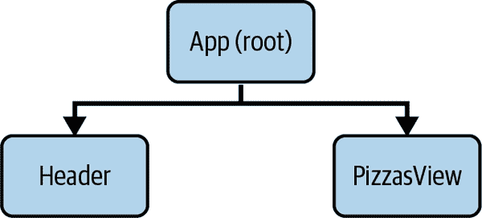

###### 图 9-1\. Pizza House 主视图组件的层次结构

当用户将比萨添加到购物车时，购物车图标将显示更新后的物品数量。为了实现标题组件与画廊组件之间的数据通信，我们可以让`App`管理`cart`数据，并将其作为 props 传递给标题，同时使用事件`updateCart`与画廊通信，如图 9-2 中所示。

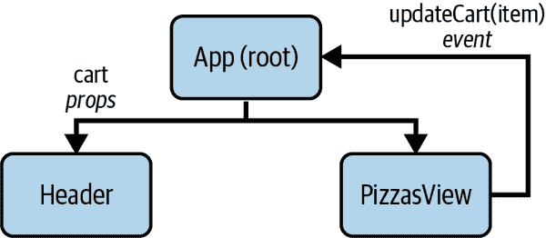

###### 图 9-2\. 画廊与标题之间的数据流，App 作为中间人

这种方法对于小型应用程序非常有效。然而，假设我们希望将`PizzasView`拆分为子组件，如`PizzasGallery`，并且让`PizzasGallery`为每个比萨渲染`PizzaCard`组件。对于每个新的父子层，我们需要传播`updateCart`事件，以确保在画廊和标题之间的数据流传播，就像图 9-3 中所示。

当应用程序增长时，我们会有更多组件和层次结构，这种方法可能会导致大量不必要的 props 和事件，从而降低可扩展性和可维护性。

为了减少这种开销并管理应用程序内的状态流动，我们需要一个全局状态管理系统，一个集中存储和管理应用程序数据状态的地方。该系统负责管理数据状态并将数据分发到必要的组件中。

为了为开发者提供顺畅的体验，其中一个最受欢迎的方法是使用状态管理库，例如 Pinia。

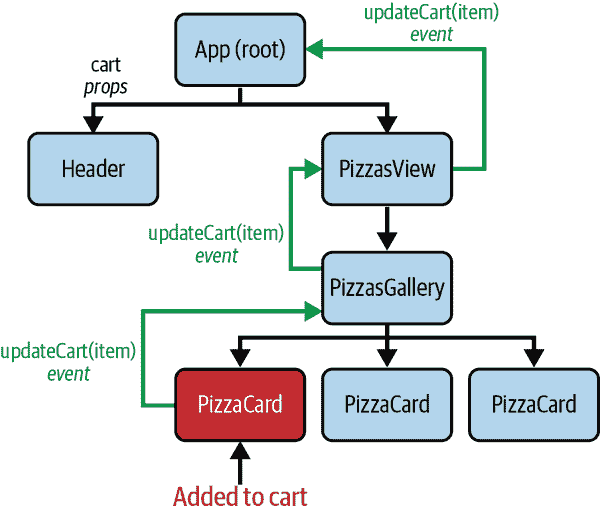

###### 图 9-3\. 在 gallery 和 header 之间的数据流动，App 充当中间人

# 理解 Pinia

受 Vuex^(1) 和 Vue 组合 API 的启发，Pinia 是 Vue 当前的官方状态管理库。尽管如此，你仍然可以使用其他支持 Vue 的状态管理 JavaScript 库，例如 Vuex、MobX 和 XState。

Pinia 遵循 Vuex 的存储模式，但采用更灵活和可扩展的方法。

###### 注意

官方 Pinia 文档可在 [Pinia 网站](https://oreil.ly/JoOwm) 上找到，提供安装、API 和主要用例的相关信息。

不同于在应用程序中使用所有数据集的单一系统，使用 Pinia，我们可以将每个数据集拆分为其状态模块（或存储）。然后，我们可以使用自定义的可组合方式，遵循组合 API 模式，从任何组件中访问存储中的相关数据。

在使用 Vite 从头开始创建 Vue 项目时，我们可以选择在脚手架过程中安装 Pinia 作为状态管理（参见“创建新的 Vue 应用程序”）。Vite 将会安装并配置 Pinia，并提供一个示例 `counter` 存储，通过 `src/stores/counter.ts` 暴露为 `useCounterStore`。

然而，要完全理解 Pinia 的工作原理，我们将跳过脚手架选项，并使用以下命令手动添加 Pinia：

```
yarn add pinia
```

###### 注意

在本书中，我们使用的是 Pinia 2.1.3，在撰写时是最新版本。你可以根据需要从 [Pinia NPM 页面](https://oreil.ly/zCUCg) 替换版本号。

安装 Pinia 后，导航到 `src/main.ts`，从 `pinia` 包中导入 `createPinia`，使用它创建一个新的 Pinia 实例，并将其插入应用程序中：

```
import { createApp } from 'vue'
import { createPinia } from 'pinia' 

import App from './App.vue'
import router from './router'

const app = createApp(App)
const pinia = createPinia() 

app.use(pinia) 

app.mount('#app')
```


从 `pinia` 包中导入 `createPinia`


创建一个新的 Pinia 实例


将 Pinia 实例插入应用程序以供使用

安装和插入 Pinia 后，我们将为我们的应用程序创建第一个存储：一个管理应用程序可用披萨的 `pizzas` 存储。

# 为 Pizza House 创建一个 Pizzas 存储

由于 Pinia 遵循 Vuex 的存储模式，Pinia 存储包含以下基本属性：

State

使用 `ref()` 或 `reactive()` 方法从 Composition API 创建的存储的响应式数据（状态）。

Getters

使用 `computed()` 方法创建的存储的计算属性和只读属性。

Actions

更新存储状态或在存储数据（状态）上执行自定义逻辑的方法。

Pinia 提供了一个 `defineStore` 函数来创建一个新的存储，接受两个参数：存储的名称和属性，以及其他组件中可用的方法。存储的属性和方法可以是一个对象，包含键字段 `state`、`getters`、`actions`，遵循 Options API（Example 9-1），或者是一个使用 Composable API 的函数，返回一个公开的字段对象（Example 9-2）。

##### 示例 9-1\. 使用对象配置定义一个存储

```
import { defineStore } from 'pinia'

export const useStore = defineStore('storeName', () => {
    return {
        state: () => ({
            // state properties
            myData: { /**... */}
        }),
        getters: {
            // getters properties
            computedData: () => { /**... */ }
        },
        actions: {
            // actions methods
            myAction(){ /**... */ }
        }
    }
})
```

##### 示例 9-2\. 使用函数定义一个存储

```
import { defineStore } from 'pinia'
import { reactive, computed } from 'vue'

export const useStore = defineStore('storeName', () => {
    //state properties
    const myData = reactive({ /**... */ })

    // getters properties
    const computedData = computed(() => { /**... */})

    // actions methods
    const myAction = () => { /**... */ }

    return {
        myData,
        computedData,
        myAction
    }
})
```

###### 注意

本章将重点介绍在 Vue 3.x Composition API 中使用 Pinia 存储，通常称为 *setup stores*。

让我们回到我们的 `pizzas` 存储。我们添加一个新文件，`src/stores/pizzas.ts`，其中包含 Example 9-3 中显示的代码。

##### 示例 9-3\. Pizzas 存储

```
/** src/stores/pizzas.ts */
import { defineStore } from 'pinia'
import type { Pizza } from '../types/Pizza';
import { ref } from 'vue'

export const usePizzasStore = defineStore('pizzas', () => { 
    const pizzas = ref<Pizza[]>([]); 

    const fetchPizzas = async () => { 
        const response = await fetch(
            'http://exploringvue.com/.netlify/functions/pizzas'
        );
        const data = await response.json();
        pizzas.value = data;
    }

    return {
        pizzas,
        fetchPizzas
    }
})
```

然后在 `PizzasView`（基于上一章的 Example 8-2 组件）中，我们将使用 `pizzas` 存储的 `pizzas` 和 `fetchPizzas` 属性来从我们的 API 获取并显示披萨列表，如 Example 9-4。

##### 示例 9-4\. `PizzasView` 组件使用 pizzas 存储

```
<template>
  <div class="pizzas-view--container">
    <h1>Pizzas</h1>
    <ul>
      <li v-for="pizza in pizzasStore.pizzas" :key="pizza.id"> 
        <PizzaCard :pizza="pizza" />
      </li>
    </ul>
  </div>
</template>
<script lang="ts" setup>
/**.... */
import { watch, type Ref } from "vue";
import { usePizzasStore } from "@/stores/pizzas";

//...
const pizzasStore = usePizzasStore(); 

pizzasStore.fetchPizzas(); 
</script>
```


使用 `pizzasStore.pizzas` 渲染披萨列表。


从 `pizzas` 存储导入 `usePizzasStore` 函数，并使用它获取 `pizzasStore` 实例。


异步在组件挂载时从 API 获取披萨。

使用前面的代码，我们的 `PizzasView` 组件现在使用 `pizzas` 存储从我们的 API 获取并显示披萨列表（Figure 9-4）。

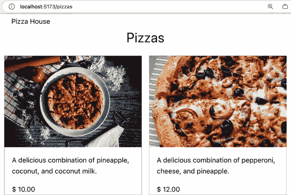

###### Figure 9-4\. `PizzasView` 组件使用 pizzas 存储

很好。然而，请注意，我们不再具有使用前一章节的`useSearch()`组合功能的搜索功能，它使用`pizzasStore.pizzas`作为`items`直接传递给`useSearch()`组合，将失去反应性，`searchResults`不会在`pizzasStore.fetchPizzas()`解析后重新计算。为了解决这个问题，我们使用`pinia`中的`storeToRefs()`从`pizzasStore`中提取`pizzas`并保持其反应性，然后传递给`useSearch()`（示例 9-5）。

##### 示例 9-5\. `useSearch()`组合工作与披萨存储

```
/** src/views/PizzasView.vue */
import { useSearch } from '@/composables/useSearch';
import { storeToRefs } from 'pinia';

//...
const pizzasStore = usePizzasStore();
const { pizzas } = storeToRefs(pizzasStore);
const { search, searchResults }: PizzaSearch = useSearch({
  items: pizzas,
  defaultSearch: props.searchTerm,
});

//...
```

现在我们的模板使用`searchResults`而不是`pizzasStore.pizzas`，我们可以重新引入搜索`input`字段（示例 9-6）。

##### 示例 9-6\. `PizzasView`组件使用披萨存储进行搜索

```
<template>
  <div class="pizzas-view--container">
    <h1>Pizzas</h1>
    <input v-model="search" placeholder="Search for a pizza" />
    <ul>
      <li v-for="pizza in searchResults" :key="pizza.id">
        <PizzaCard :pizza="pizza" />
      </li>
    </ul>
  </div>
</template>
```

接下来，我们将创建一个购物车存储来管理当前用户的购物车数据，包括添加的项目列表。

# 为披萨店创建一个购物车存储

要创建我们的`cart`存储，我们使用以下属性定义我们的`cart`存储：

+   一个已添加到购物车的`items`列表；每个项目包含披萨的`id`和`quantity`

+   购物车的`total`项目数

+   一个`add`方法用于从购物车中添加项目

要创建我们的`cart`存储，我们添加一个新文件，`src/stores/cart.ts`，其代码如示例 9-7 所示。

##### 示例 9-7\. 购物车存储

```
import { defineStore } from 'pinia'

type CartItem = { 
    id: string;
    quantity: number;
}

export const useCartStore = defineStore('cart', () => {
    const items = reactive<CartItem[]>([]); 
    const total = computed(() => { 
        return items.reduce((acc, item) => {
            return acc + item.quantity
        }, 0)
    })

    const add = (item: CartItem) => { 
        const index = items.findIndex(i => i.id === item.id)
        if (index > -1) {
            items[index].quantity += item.quantity
        } else {
            items.push(item)
        }
    }

    return {
        items,
        total,
        add
    }
})
```


定义购物车项目的类型


使用一个空数组来初始化`items`状态


创建一个`total` getter 来计算购物车中的总项目数


创建一个`add`动作来向购物车添加项目。如果项目已经在购物车中，则更新数量而不是添加新项目。

现在我们创建了`cart`存储，可以在我们的应用程序中使用它。

# 在组件中使用购物车存储

让我们创建一个新组件，`src/components/Cart.vue`，用于显示购物车的总项目数。在`<script setup()>`部分内，我们导入`useCartStore()`方法并调用它以获取`cart`实例。然后在模板中，通过使用`cart.total` getter 来显示购物车中的总项目数，正如示例 9-8 所示。

##### 示例 9-8\. 购物车组件

```
<template>
    <div class="cart">
        <span class="cart__total">Cart: {{ cart.total }}</span>
    </div>
</template>
<script setup lang="ts">
import { useCartStore } from '@/stores/cart'

const cart = useCartStore();
</script>
<style scoped>
.cart__total {
    cursor: pointer;
    text-decoration: underline;
}
</style>
```

然后，当我们在`App.vue`中使用`<Cart />`组件时，我们看到购物车显示初始值为`0`（图 9-5）。

```
<!-- App.vue -->
<template>
    <header>
        <div>Pizza House</div>
        <Cart />
    </header>
    <RouterView />
</template>
```

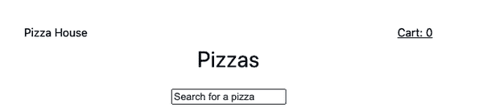

###### 图 9-5\. 在应用程序标题中显示的购物车组件

接下来，让我们允许从我们的披萨画廊向购物车添加项目，以每个由`PizzaCard`渲染的披萨。

# 从披萨画廊添加项目到购物车

在`PizzaCard`中，我们将添加一个按钮，并使用`click`事件处理程序调用`cart.add()`操作以将披萨添加到购物车中。`PizzaCard`组件将如示例 9-9 所示。

##### 示例 9-9\. `PizzaCard`组件

```
<template>
  <article class="pizza--details-wrapper">
    
    <p>{{ pizza.description }}</p>
    <div class="pizza--inventory">
      <div class="pizza--inventory-price">$ {{ pizza.price }}</div>
    </div>
    <button class="pizza--add" @click="addToCart">Add to cart</button> 
  </article>
</template>
<script setup lang="ts">
import { useCartStore } from "@/stores/cart";
import type { Pizza } from "@/types/Pizza";
import type { PropType } from "vue";

const props = defineProps({
  pizza: {
    type: Object as PropType<Pizza>,
    required: true,
  },
});

const cart = useCartStore(); 
const addToCart = () => {
  cart.add({ id: props.pizza.id, quantity: 1 }); 
};
</script>
```


添加一个按钮将披萨添加到购物车中。


使用`useCartStore()`方法从`cart`实例获取。


在`addToCart()`方法内调用`cart.add()`操作以将披萨添加到购物车。

通过上述代码，在浏览器中，我们可以通过点击“添加到购物车”按钮向购物车中添加披萨，并查看购物车的总商品数量更新（图 9-6）。

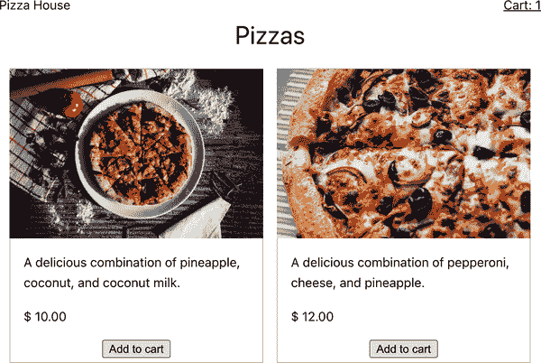

###### 图 9-6\. 带有添加选项和更新购物车总金额的披萨卡片

我们还可以使用`cart.items`来检测当前披萨是否已经在购物车中，并在披萨卡片上显示其状态，如示例 9-10 所示。

##### 示例 9-10\. 带有状态的`PizzaCard`组件

```
<template>
  <article class="pizza--details-wrapper">
    <!--...-->
    <div class="pizza--inventory">
      <!--...-->
      <span v-if="isInCart">In cart</span> 
    </div>
    <button class="pizza--add" @click="addToCart"> Add to cart </button>
  </article>
</template>
<script setup lang="ts">
//...

const isInCart = computed(():boolean => { 
  return !!cart.items.find((item) => item.id === props.pizza.id);
});
</script>
```

如果披萨已经在购物车中，则在披萨卡片上显示“在购物车中”的状态（图 9-7）。

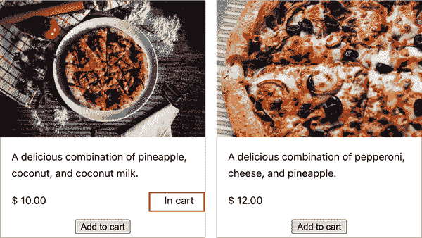

###### 图 9-7\. 带有状态的披萨卡片

我们已成功创建了一个购物车存储并在 Pizza House 中使用它。`Cart`和`PizzaCard`组件现在通过`cart`存储同步和通信。

此时，`Cart`组件当前仅显示购物车中的总商品数量，这通常不足以让用户了解他们已添加的内容。在接下来的部分中，我们将通过在用户点击购物车时显示购物车商品来改善这一体验。

# 显示带有操作的购物车商品

在`Cart.vue`中，我们将添加一个显示购物车商品列表和`showCartDetails`变量以控制列表可见性的部分。当用户点击购物车文本时，我们将切换列表的可见性，如示例 9-11 所示。

##### 示例 9-11\. 带有购物车商品的购物车组件

```
<template>
    <div class="cart">
        <span
            class="cart__total"
            @click="showCartDetails.value = !showCartDetails.value;" 
        > Cart: {{ cart.total }} </span>
        <ul class="cart__list" v-show="showCartDetails"> 
            <li v-for="item in cart.items" :key="item.id" class="cart__list-item"> 
                <span>Id: {{ item.id }}</span> | <span>Quantity: {{ item.quantity }}</span>
            </li>
        </ul>
    </div>
</template>
<script setup lang="ts">
import { useCartStore } from '@/stores/cart'
import { ref } from 'vue'

const cart = useCartStore();
const showCartDetails = ref(false); 
</script>
```


当用户点击购物车文本时，切换显示购物车商品列表的可见性。


当`showCartDetails`为`true`时显示购物车商品列表。


循环遍历购物车商品并显示商品 ID 和数量。


使用`ref()`方法初始化`showCartDetails`变量。

我们还向`Cart`组件添加了一些 CSS 样式，以使列表的位置看起来像下拉菜单：

```
.cart {
    position: relative; 
}

.cart__list {
    position: absolute; 
    list-style: none;
    border: 1px solid #e3e0e0;
    padding: 10px;
    inset-inline-end: 0; 
    box-shadow: 2px 2px 3px #e3e0e0; 
    background-color: white;
    min-width: 200px;
}
```


将`.cart`容器的位置设置为`relative`以使`absolute`列表容器在容器内浮动。


将列表容器的位置设置为 `absolute`，使其相对于 `.cart` 容器的 `relative` 位置浮动。


将 `inset-inline-end` 属性设置为 `0`，使列表容器浮动到 `.cart` 容器的右侧。


添加阴影和边框给列表容器，使其看起来像下拉框。

当我们点击购物车文本时，将显示购物车商品列表（图 9-8）。

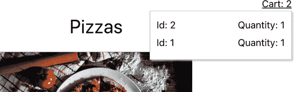

###### 图 9-8\. 点击购物车文本时显示的购物车商品列表

但等等，出现了问题。列表只显示了项目的 `id` 和 `quantity`，这对用户理解添加的项目以及总费用不够描述。我们还需要显示项目的名称和价格。为此，我们可以修改 `cart.items` 以保留项目的标题和价格，但这会使 `cart` 存储的结构复杂化，并且需要额外的逻辑修复。

可以创建一个计算的 `detailedItems` 列表，借助披萨存储的帮助。

在 `cart.ts` 存储中，我们将添加一个 `detailedItems` 计算属性，它将是从 `items` 和披萨存储中的 `pizzasStore.pizzas` 连接的数组，如 示例 9-12 所示。

##### 示例 9-12\. 带有 `detailedItems` 计算属性的购物车存储

```
import { defineStore } from 'pinia';
import { usePizzasStore } from './pizzas';

export const useCartStore = defineStore('cart', () => {
    //... 
    const detailedItems = computed(() => {
        const pizzasStore = usePizzasStore(); 

        return items.map(item => { 
            const pizza = pizzasStore.pizzas.find(
                pizza => pizza.id === item.id
            )

            const pizzaPrice = pizza?.price ? +(pizza?.price) : 0;

            return { 
                ...item,
                title: pizza?.title,
                price: pizza?.price,
                total: pizzaPrice * item.quantity
            }
        })
    })

    return {
        //...
        detailedItems 
    }
});
```


使用 `usePizzaStore` 从存储获取披萨的初始列表


过滤显示在购物车中的相关披萨


格式化购物车商品信息以返回


返回经过筛选和格式化的 `detailedItems` 数组

在 `Cart.vue` 中，我们将在 `v-for` 循环中使用 `cart.detailedItems` 替换 `cart.items`，如 示例 9-13 所示。

##### 示例 9-13\. 使用 `detailedItems` 显示更多信息

```
<ul class="cart__list" v-show="showCartDetails">
    <li
        v-for="(item, index) in cart.detailedItems" 
        :key="item.id"
        class="cart__list-item">
        <span>{{index + 1}}. {{ item.title }}</span>
        <span>${{ item.price }}</span> x <span>{{ item.quantity }}</span>
        <span>= ${{ item.total }}</span>
    </li>
</ul>
```


迭代 `cart.detailedItems` 数组以显示购物车商品

现在，当我们点击购物车文本时，购物车商品列表将显示项目的名称、价格、数量和每件商品的总费用（图 9-9）。

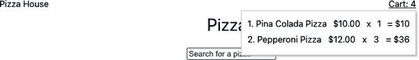

###### 图 9-9\. 显示更多信息的购物车商品列表

我们已成功显示了购物车商品的详细信息。接下来我们可以添加删除购物车商品的功能。

# 从购物车存储中移除商品

对于购物车列表中的每个项目，我们将添加一个 *Remove* 按钮以便从购物车中删除它。我们还将添加一个 *Remove all* 按钮以从购物车中移除所有项目。`Cart.vue` 的 `template` 部分看起来像 示例 9-14。

##### 示例 9-14\. 带有 Remove 和 Remove all 按钮的 Cart 组件

```
<div class="cart__list" v-show="showCartDetails">
    <div v-if="cart.total === 0">No items in cart</div>
    <div v-else>
        <ul>
            <li
                v-for="(item, index) in cart.detailedItems"
                :key="item.id" class="cart__list-item"
            >
                <span>{{index + 1}}. {{ item.title }}</span>
                <span>${{ item.price }}</span> x <span>{{ item.quantity }}</span>
                <span>= ${{ item.total }}</span>
                <button @click="cart.remove(item.id)">Remove</button> 
            </li>
        </ul>
        <button @click="cart.clear">Remove all</button> 
    </div>
</div>
```


*Remove* 按钮绑定到 `cart.remove` 方法，该方法以项目的 `id` 作为参数


*Remove all* 按钮绑定到 `cart.clear` 方法

在 `cart.ts` 文件中，我们将添加 `remove` 和 `clear` 方法，如示例 示例 9-15 所示。

##### 示例 9-15\. 带有 `remove` 和 `clear` 方法的 Cart store

```
//...

export const useCartStore = defineStore('cart', () => {
    //...
    const remove = (id: string) => {
        const index = items.findIndex(item => item.id === id)
        if (index > -1) {
            items.splice(index, 1)
        }
    }

    const clear = () => {
        items.length = 0
    }

    return {
        //...
        remove,
        clear
    }
})
```

就是这样！当我们点击 *Remove* 按钮时，Vue 会从购物车中移除该项目。当我们点击 *Remove all* 按钮时，它将清空购物车；参见 图 9-10。

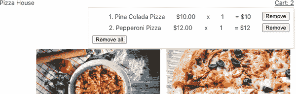

###### 图 9-10\. 带有 Remove 和 Remove all 按钮的购物车项目

###### 注意

如果您正在使用 Options API 构建 `cart` store，您可以使用 `cart.$reset()` 将 store 的状态重置为初始状态。否则，您必须手动重置 store 的状态，就像在 `clear` 方法中所做的那样。

我们还可以使用浏览器开发工具中的 Vue Devtool 选项卡（“Vue Developer Tools”）检查 `cart` store 的状态和 getters。`cart` 和 `pizzas` store 将在 `Pinia` 选项卡下列出（见 图 9-11）。

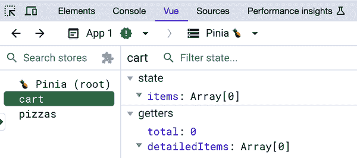

###### 图 9-11\. Vue Devtools 中的购物车和披萨 store

我们已经探讨了如何使用 Pinia 和 Composition API 构建 store。我们还探讨了不同的方法，如合并 store 和在外部可组合中使用 store 的状态。那么测试 Pinia stores 呢？让我们在下一节中探索这个问题。

# 单元测试 Pinia Stores

单元测试一个 store 类似于普通单元测试一个函数。对于 Pinia，在运行实际测试之前，我们需要使用 `pinia` 包中的 `createPinia` 方法创建一个 Pinia 实例，并使用 `setActivePinia()` 方法激活它。示例 9-16 展示了如何编写测试，将一个项目添加到我们的 `cart` store 中。

##### 示例 9-16\. 用于添加项目的 Cart store 测试套件

```
import { setActivePinia, createPinia } from 'pinia';
import { useCartStore } from '@/stores/cart';

describe('Cart store', () => {
    let cartStore;

    beforeEach(() => { 
        setActivePinia(createPinia());
        cartStore = useCartStore();
    });

    it('should add item to cart', () => {
        cartStore.add({ id: '1', quantity: 1 });
        expect(cartStore.items).toEqual([{ id: '1', quantity: 1 }]);
    });
});
```


在每次测试运行之前，我们会创建并激活一个新的 Pinia 实例。

此代码遵循 Jest 和 `Vitest` 测试框架支持的常见测试语法。我们将进一步探讨如何编写和运行单元测试的细节，在 “Vitest 作为单元测试工具” 中详细介绍。目前，我们将探讨如何订阅 store 的更改并为 store 操作添加副作用。

# 订阅 store 更改的副作用

Pinia 的一个重要优势是可以通过插件扩展存储的功能并实现副作用。借助此功能，我们可以轻松订阅所有存储或特定存储的变化，以执行诸如在需要时与服务器同步数据等其他操作。

以`cartPlugin`为例：

```
//main.ts
import { cartPlugin } from '@/plugins/cartPlugin'
//...

const pinia = createPinia()
pinia.use(cartPlugin)

app.use(pinia)
//...
```

`cartPlugin`是一个函数，接收一个包含对`app`实例、`pinia`实例、`store`实例和一个选项对象的引用的对象。Vue 将为我们应用程序中的每个存储触发此函数一次。为了确保我们仅订阅`cart`存储，我们可以检查存储的 id（见示例 9-17）。

##### 示例 9-17\. 购物车插件

```
//src/plugins/cartPlugin.ts
export const cartPlugin = ({ store}) => {
    if (store.$id === 'cart') {
        //...
    }
}
```

然后，我们可以使用`store.$subscribe`方法订阅购物车存储的变化，如示例 9-18。

##### 示例 9-18\. 购物车插件订阅存储变化

```
//src/plugins/cartPlugin.ts
export const cartPlugin = ({ store}) => {
    if (store.$id === 'cart') {
        store.$subscribe((options) => {
            console.log('cart changed', options)
        })
    }
}
```

当我们向购物车添加物品时，`cartPlugin`会在控制台记录消息（图 9-12）。

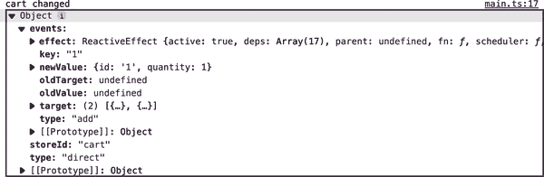

###### 图 9-12\. 使用插件记录存储变化

`$subscribe`方法接收的`options`对象包含`events`对象，其中包含当前事件类型（`add`）、前一个值（`oldValue`）、传递给事件的当前值（`newValue`）、`storeId`以及事件类型（`direct`）。

类似地，我们可以使用`store.$onAction`为`cart`存储的`add`操作添加副作用（见示例 9-19）。

##### 示例 9-19\. 购物车插件订阅存储的添加操作

```
//src/plugins/cartPlugin.ts

export const cartPlugin = ({ store}) => {
    if (store.$id === 'cart') {
        store.$onAction(({ name, args }) => {
            if (name === 'add') {
                console.log('item added to cart', args)
            }
        })
    }
}
```

当我们向购物车添加物品时，`cartPlugin`会记录添加到购物车的新物品（图 9-13）。

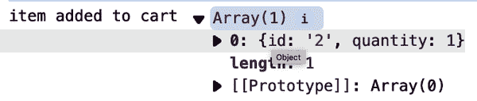

###### 图 9-13\. 购物车插件记录存储的添加操作

使用`$subscribe`和`$onAction`，我们可以添加诸如记录日志和与外部 API 服务通信（例如在服务器上更新用户购物车等）的副作用。此外，如果在同一个插件中同时使用`$onAction`和`$subscribe`，Vue 将首先触发`$onAction`，然后是相关的`$subscribe`。

# 使用副作用

需要注意的是，Vue 会触发我们添加到存储的每个副作用。例如，对于示例 9-19，Vue 将为存储中执行的每个操作激活副作用函数。因此，在向存储添加副作用时，我们必须非常谨慎，以避免性能问题。

# 摘要

在本章中，我们学习了如何使用 Pinia 构建存储，并在应用程序中利用组合 API 使用它们。我们还学习了如何解构和传递存储的状态给外部的可组合函数，利用响应性订阅存储的变化，并为存储操作添加副作用。现在，您已经准备好创建完整的数据流，从构建集中式数据存储，到在不同组件中使用它，并通过存储在组件之间建立连接。

下一章将探讨 Vue 的另一个方面，即如何通过添加动画和过渡来增强用户体验。

^(1) Vuex 曾是 Vue 应用程序的官方状态管理工具。
