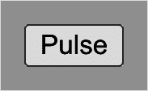
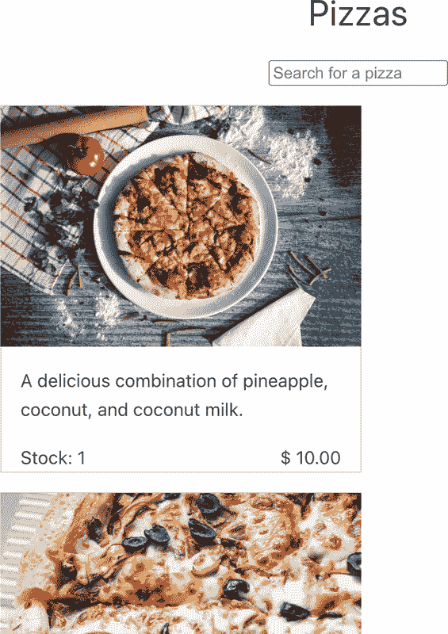
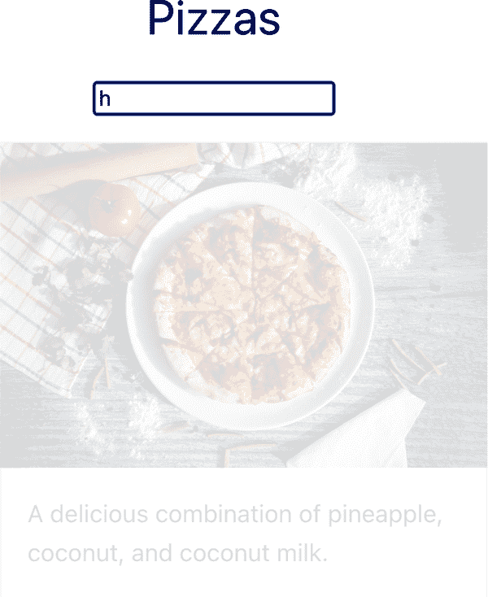

# 第十章：Vue 中的过渡和动画

我们已经探讨了构建工作中 Vue 应用的所有关键方面，包括使用适当的状态管理处理路由和数据流。本章将探讨增强用户体验的独特 Vue 功能：动画和过渡，使用过渡组件、钩子和 CSS。

# 理解 CSS 过渡和 CSS 动画

CSS 动画是在特定元素或组件状态变化时的视觉效果，状态数量不限。CSS 动画可以自动启动并循环播放，无需显式触发。相比之下，CSS 过渡是仅响应于两个状态之间的动画，例如按钮从普通状态到悬停状态或提示框从隐藏到可见状态。通常使用`@keyframes`规则定义 CSS 动画，然后通过`animation`属性将其应用于目标元素。例如，我们可以为按钮定义一个简单的动画效果：

```
@keyframes pulse {
  0% {
    box-shadow: 0 0 0 0px rgba(0, 0, 0, 0.5);
  }
  100% {
    box-shadow: 0 0 0 20px rgba(0, 0, 0, 0);
  }
}

.button {
  animation: pulse 2s infinite;
  box-shadow: 0px 0px 1px 1px #0000001a;
}
```

我们定义了一个简单的动画效果`pulse`，并将其应用于所有带有`button`类的元素，其中阴影框将在循环中扩展和收缩，持续两秒。如果元素存在于 DOM 中，此效果将无限循环运行。



###### 图 10-1\. 无限脉冲动画效果

与此同时，我们可以使用`transition`属性为用户悬停在特定元素上时定义一个过渡效果：

```
.button {
  transition: background-color 0.5s ease-in-out;
}

.button:hover {
  background-color: #ff0000;
}
```

在此代码中，我们为`button`元素创建了一个简单的过渡效果：背景颜色在悬停时从默认颜色变为红色，延迟`0.5`秒，平滑效果为`ease-in-out`。此外，我们还可以使用 JavaScript 和其他动画库通过 JavaScript 编程方式定义过渡和动画。

当使用应用程序时，过渡和动画可以显著提供用户更流畅的体验。然而，处理过渡和动画有时可能具有挑战性。作为专注于视图层的框架，Vue 提供了一组 API 来帮助我们更简单地为组件和路由创建平滑、美观的动画和过渡效果，无论是使用 CSS 还是 JavaScript。其中之一是`transition`组件，我们将在接下来的部分中讨论它。

# Vue.js 中的过渡组件

`transition`组件是一个包装组件，允许我们为单个元素创建过渡，具有两个可用的过渡状态：进入和离开。组件提供一个`name`作为所需过渡效果的名称属性。Vue 将计算相关的过渡类，`name`作为其前缀，过渡状态（`to`、`active`或`from`）作为其后缀，如下所示：

```
<name>-[enter | leave]-<transition-direction-state>
```

例如，我们可以在元素上使用`slidein`过渡效果：

```
<transition name="slidein">
    <ul class="pizza-list">
        /** code for rendering pizza's card... */
    </ul>
  </transition>
```

Vue 将生成一组类，这些类在表 10-1 中描述。

表 10-1\. 用于滑入过渡效果的生成过渡类

| 类 | 描述 |
| --- | --- |
| `.slidein-enter-from` | 定义进入过渡的起始状态的类选择器 |
| `.slidein-enter-active` | 定义元素在进入过渡期间的持续时间和延迟的类选择器 |
| `.slidein-enter-to` | 定义进入过渡的结束状态的类选择器 |
| `slidein-leave-from` | 定义离开过渡的起始状态的类选择器 |
| `slidein-leave-to` | 定义离开过渡的结束状态的类选择器 |
| `slidein-leave-active` | 定义元素在离开过渡期间的持续时间和延迟的类选择器 |

*进入状态* 表示元素开始过渡到浏览器显示的可见模式，而 *离开状态* 则表示相反。我们可以与 `v-show` 结合，它切换元素的 CSS `display` 属性，或者 `v-if` 属性，有条件地将片段插入到 DOM 中。我们将 `v-show` 添加到代码示例中 `ul` 组件：

```
<transition name="slidein">
    <ul class="pizza-list" v-show="showList">
        /** code for rendering pizza's card... */
    </ul>
</transition>
```

现在，我们可以使用先前的类来定义名为 `slidein` 的过渡，使用 CSS 的 `transition` 属性以及目标 CSS 属性或属性来执行效果。

下面是滑入过渡效果的示例实现：

```
.slidein-enter-to {
  transform: translateX(0);
}

.slidein-enter-from {
  transform: translateX(-100%);
}

.slidein-leave-to {
  transform: translateX(100%);
}

.slidein-leave-from {
  transform: translateX(0);
}

.slidein-enter-active,
.slidein-leave-active {
  transition: transform 0.5s;
}
```

在此代码中，在进入过渡之前，浏览器将通过 `slidein-enter-to` 将 `ul` 元素水平重新定位到视口的左侧，然后通过 `translateX(0)` 将其移回正确位置。离开过渡也是同样的过程，只是元素将向右侧的视口移动而不是左侧。这两个变化都将在 `transform` 属性上进行，持续时间为 0.5 秒，如 `slidein-enter-active` 和 `slidein-leave-active` 类所述。

要查看效果，请添加一个小的超时来改变 `searchResults` 数据属性的值：

```
import { ref } from "vue";

const showList = ref(false);

setTimeout(() => {
  showList.value = true;
}, 1000);
```

Vue 引擎会根据需要添加或删除每个类。我们再次添加一个超时来将 `showList` 的值改回 `false`，Vue 将再次触发过渡效果，但这次是离开状态（图 10-2）。

我们使用 `transition` 组件实现了一个简单的效果，只有一个 `slidein` 的影响。如何结合不同的效果，例如进入状态使用 `slidein`，离开状态使用 `rotate`？对于这种情况，我们使用自定义过渡类属性，在下一节将会讨论。



###### 图 10-2\. 当 `showList` 为 `true` 时，披萨列表的过渡效果

## 使用自定义过渡类属性

除了根据`name`属性自动生成类之外，Vue 还允许我们使用以下相关属性为每个过渡类指定自定义类名：`enter-class`、`enter-active-class`、`enter-to-class`、`leave-class`、`leave-active-class`和`leave-to-class`。例如，我们可以定义离开状态时`rotate`过渡效果的自定义类：

```
<transition name="slidein" leave-active-class="rotate">
    <ul class="pizza-list" v-show="showList">
        /** code for rendering pizza's card... */
    </ul>
</transition>
```

在`style`部分，我们使用`@keyframes`控制定义了`rotate`过渡的动画效果，关键帧偏移为 0%，50%，90%和 100%。

```
@keyframes rotate {
  0% {
    transform: rotate(0);
  }
  50% {
    transform: rotate(45deg);
  }
  90% {
    transform: rotate(90deg);
  }
  100% {
    transform: rotate(180deg);
  }
}
```

然后，我们可以将动画效果`rotate`分配给`rotate`类的`animation`属性，持续时间为 0.5 秒：

```
.rotate {
  animation: rotate 0.5s;
}
```

让我们将`showList`的初始值设置为`true`，并设置一个`1000`毫秒的超时将其更改为`false`。虽然`ul`元素的进入效果仍然是`slidein`，但离开时的效果现在是从 45 度开始旋转的动画，然后是 90 度，最后是 180 度。参见图 10-3 进行说明。

```
import { ref } from "vue";

const showList = ref(true);

setTimeout(() => {
  showList.value = false;
}, 1000);
```


###### 图 10-3\. 使用关键帧进行过渡的旋转效果

您可以将多个类分隔以单个空格的方式分配给这些属性，以应用于特定过渡状态的各种效果。当您希望将来自外部 CSS 库（如 Bootstrap、Tailwind CSS 或 Bulma）的动画集成到 Vue 中时，此功能非常有用。

我们的组件现在在切换`showList`值时具有过渡效果。然而，我们经常希望在页面加载后元素首次出现时进行动画处理，而不需要额外的交互。为此，我们可以使用`appear`属性。

## 在初始渲染时使用`appear`添加过渡效果

当我们在`transition`元素上将`appear`属性设置为`true`时，Vue 将在组件挂载到 DOM 时自动添加`enter-active`和`enter-to`类，触发过渡效果。例如，要在`ul`组件的初始渲染时应用`slidein`效果，我们只需在`transition`元素上添加`appear`属性即可：

```
<transition name="slidein" appear>
    <ul class="pizza-list">
        /** code for rendering pizza's card... */
    </ul>
</transition>
```

现在，浏览器将在 UI 的初始出现时应用`ul`元素的`slidein`效果。

我们已经学习了如何使用`transition`组件为单个元素创建平滑的过渡效果。然而，当我们希望同时和有序地对多个部分进行动画化时，这个组件就不够用了。为此，我们有`transition-group`，接下来我们将讨论它。

# 构建一组元素的过渡效果

`transition-group`组件是`transition`的特殊版本，旨在为一组元素提供动画支持。它接受与`transition`相同的 props，在我们想要为列表中的每个项（如披萨或用户列表）添加动画时非常有用。然而，与`transition`元素不同，`transition-group`支持使用`tag`属性渲染包装元素，并且所有子元素将接收相同的过渡类，但不包括包装器（如果存在）。

以披萨列表为例。我们可以使用`transition-group`为屏幕上出现的每个披萨卡片添加`fadein`效果，并将卡片包裹在`ul`元素下：

```
<transition-group name="fadein" tag="ul" appear>
    <li v-for="pizza in searchResults" :key="pizza.id">
        <PizzaCard :pizza="pizza" />
    </li>
</transition-group>
```

# 使用`key`属性

您必须在每个列表元素上使用`key`属性，以便 Vue 跟踪列表中的变化，并相应地应用过渡效果。

Vue 会为我们定义的每个`li`元素添加相关的类名`fadein-enter-active`、`fadein-enter-to`、`fadein-leave-active`、`fadein-leave-to`，这些类名是根据以下 CSS 规则定义的：

```
.fadein-enter-active,
.fadein-leave-active {
  transition: all 2s;
}

.fadein-enter-from,
.fadein-leave-to {
  opacity: 0;
  transform: translateX(20px);
}
```

现在，我们的列表中的每个披萨卡片都会在首次加载组件时以淡出效果和从右侧轻微滑入的过渡效果出现。每当我们使用搜索框筛选列表时，新卡片将以相同的效果出现，而旧卡片则会以相反的效果消失：淡出并向右滑出（参见图 10-4）。



###### 图 10-4\. 列表搜索时的淡出效果

# 添加更多移动效果

您还可以使用`<effect>-move`类（例如`fadein-move`）为移动的项目添加更多效果。在列表中物品移动时，这种解决方案可能更加平滑。

到目前为止，一切顺利。我们已经探讨了如何使用`transition`和`transition-group`组件。接下来的步骤是学习如何将这些组件与`router-view`元素结合起来，在路由之间导航时创建平滑的过渡效果。

# 创建路由过渡效果

从 Vue Router 4.0 开始，我们不再可以用`transition`元素包裹`router-view`组件。相反，我们结合了由`router-view`暴露的`Component`属性和动态`component`的使用，如下面的代码所示：

```
<router-view v-slot="{ Component }">
    <transition name="slidein">
        <component :is="Component" />
    </transition>
</router-view>
```

`Component`属性指的是 Vue 在`router-view`占位符所在位置渲染的目标组件。然后，我们可以使用`component`元素动态生成组件，并用`transition`元素包裹它以应用`slidein`效果。通过这样做，无论何时我们导航到不同的路由，都会有动画效果：页面进入时滑入，页面离开时滑出。

但这里有一个小问题。当我们导航到不同的路由时，请注意新页面的内容可能会在前一页的内容完成离开动画并消失之前出现。在这种情况下，我们可以使用`mode`属性，其值为`out-in`，以确保新内容只有在前一个内容完全从屏幕上消失后才进入并开始动画：

```
<router-view v-slot="{ Component }">
    <transition name="slidein" mode="out-in">
        <component :is="Component" />
    </transition>
</router-view>
```

现在，每当我们导航到不同的路由时，例如从`/`到`/about`，关于视图只有在主页视图消失后才会出现。

到目前为止，我们已经探讨了如何使用`name`和自定义过渡类来创建过渡效果。虽然这些在大多数情况下足以为我们的应用程序创建具有自定义动画类的平滑过渡效果，但在其他情况下，我们可能会发现需要使用第三方 JavaScript 动画库来获得更好的过渡效果。对于这种情况，我们需要一种不同的方法，允许我们使用 JavaScript 插入自定义动画控制。我们将在下一节中学习如何做到这一点。

# 使用过渡事件控制动画

与自定义类不同，Vue 为过渡组件提供了一些适当的过渡事件来发出。这些事件包括元素进入状态的`before-enter`、`enter`、`after-enter`和`enter-cancelled`，以及离开状态的`before-leave`、`leave`、`after-leave`和`leave-cancelled`。我们可以将这些事件绑定到所需的回调函数上，并使用 JavaScript 控制过渡效果。

例如，我们可以使用`before-enter`、`enter`、`afterEnter`事件来控制页面过渡中`slidein`效果的动画：

```
<router-view v-slot="{ Component }">
    <transition
    @before-enter="beforeEnter"
    @enter="enter"
    @after-enter="afterEnter"
    :css="false"
    >
        <component :is="Component" />
    </transition>
</router-view>
```

# 使用`css`属性

在使用回调函数方法时，我们可以使用`css`属性来禁用默认的 CSS 过渡类和任何可能的重叠。

在`script`部分，我们可以为每个事件定义回调函数：

```
import { gsap } from 'gsap'

const beforeEnter = (el: HTMLElement) => {
  el.style.transform = "translateX(20px)";
  el.style.opacity = "0";
};

const enter = (el: HTMLElement, done: gsap.Callback) => {
  gsap.to(el, {
    duration: 1,
    x: 0,
    opacity: 1,
    onComplete: done,
  });
};

const afterEnter = (el: HTMLElement) => {
  el.style.transform = "";
  el.style.opacity = "";
};
```

在此代码中，我们使用`gsap`（GreenSock 动画平台）库来在元素进入 DOM 时对其进行动画处理。我们定义如下：

`beforeEnter`

回调函数来设置元素的初始状态，包括将`opacity`设置为隐藏并将元素重新定位到原点 20px 处

`enter`

回调函数以使用`gsap.to`函数来动画元素^(1)

`afterEnter`

回调函数来设置元素的可见状态和动画完成后的位置

类似地，我们可以使用`before-leave`、`leave`和`after-leave`事件来在元素离开 DOM 时（如滑出效果）使用所选的动画库进行动画。

# 总结

在本章中，我们学习了如何使用过渡组件和可用的钩子来创建从一个路由到另一个路由的平滑过渡效果。我们还学习了如何创建组过渡，并使用过渡组件来在段落内动画化元素。

在下一章中，我们将探讨 Web 开发的另一个重要方面：测试。我们将学习如何使用 Vitest 测试组合组件，使用 Vue Test Utils 库测试组件，然后为我们的应用程序开发完整的端到端测试计划。

^(1) 此函数接收一个目标元素和可选的包含所有动画属性的对象。详见 [*https://oreil.ly/XNgFb*](https://oreil.ly/XNgFb)。
