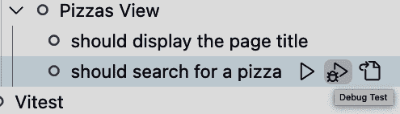

# 第十一章：Vue 中的测试

到目前为止，我们已经学习了如何从头开始开发完整的 Vue 应用程序，使用不同的 Vue API。我们的应用程序现在已准备部署，但在此之前，我们需要确保我们的应用程序没有 bug，并且可以投入生产。这就是测试发挥作用的地方。

测试对于任何应用程序开发都至关重要，因为它有助于在发布到生产环境之前增强代码的信心和质量。在本章中，我们将学习不同类型的测试以及如何在 Vue 应用程序中使用它们。我们还将探讨各种工具，如 Vitest 和 Vue Test Utils，用于单元测试，以及 PlaywrightJS 用于端到端（E2E）测试。

# 单元测试和端到端测试简介

软件开发中有手动和自动化测试实践和技术，以确保您的应用程序按预期工作。手动测试要求测试人员手动与软件交互，可能成本较高，而自动化测试主要是执行包含一组测试的预定义测试脚本的自动化方式。自动化测试集合可以验证从单个函数到不同部分的简单到复杂的应用程序场景。

自动化测试比手动测试更可靠和可扩展，假设我们正确编写了测试，并执行以下测试过程：

单元测试

软件开发中最常见且最低级别的测试。我们使用单元测试来验证执行特定操作的代码单元（或代码块），如函数、钩子和模块。我们可以将单元测试与测试驱动开发（TDD）^(1)结合使用作为标准开发实践。

集成测试

此测试类型验证不同代码单元块的集成。集成测试旨在断言逻辑功能、组件或模块的流程。组件测试将内部逻辑与单元测试集成测试。我们还会模拟大多数上游服务和测试范围外的其他函数，以确保测试质量。

端到端（E2E）测试

软件开发中的最高级别测试。我们使用端到端测试来验证整个应用程序流程，从客户端到后端，通常通过模拟实际用户行为来完成。在端到端测试中不会有任何模拟服务或函数，因为我们希望测试整个应用程序流程。

###### 注意

测试驱动开发（TDD）意味着你首先设计并编写测试用例（红色阶段），然后编写代码以通过测试（绿色阶段），最后改进代码实现（重构阶段）。这有助于在实际开发之前验证逻辑和设计。

这三种测试类型构成了一个测试金字塔，如 图 11-1 所示，其中重点应主要放在单元测试上，然后是集成测试，最后才是 E2E 测试，因为后者主要用于健全性检查，并且触发成本较高。由于我们从各种组件、服务和模块创建应用程序，因此对每个独立函数或特性进行单元测试足以以最低成本和工作量保持代码库的质量。

作为我们应用程序中测试系统的主要基础，我们从使用 Vitest 进行单元测试开始。


###### 图 11-1\. 测试金字塔

# Vitest 作为单元测试工具

[Vitest](https://oreil.ly/1upy0) 是基于 Vite 构建的用于 Vite 项目的单元测试运行器。其 API 类似于 Jest 和 Chai，同时提供更模块化的测试方法。Vitest 专注于速度和开发者体验，提供多线程工作器、支持 TypeScript 和 JSX，以及针对 Vue 和 React 等框架的组件测试等显著特性。

要使用 Vitest，我们需要将其安装为项目中的开发依赖项。

```
yarn add -D vitest
```

然后在 `package.json` 文件中，我们可以添加一个新的脚本命令以在观察模式下运行我们的测试：

```
"script": {
    "test": "vitest"
}
```

###### 注意

或者，在 Vue 项目初始化期间，我们可以选择将 Vitest 安装为单元测试工具（“创建新的 Vue 应用程序”），Vite 将处理其余内容，包括一些示例测试作为起始。

当我们在终端（或命令行）中运行 `yarn test` 命令时，Vitest 将自动检测项目目录中文件名包含 `.spec.` 或 `.test.` 模式的测试文件。例如，`useFetch` 钩子的测试文件可以是 `useFetch.spec.ts` 或 `useFetch.test.ts`。每当您更改任何测试文件时，Vitest 将在本地环境中重新运行测试。

# 使用 vitest 与额外命令

您可以指定 `vitest` 命令的模式，例如显式指定观察模式的 `vitest watch`，或一次性运行所有测试的 `vitest run`。在持续集成（CI）环境中，仅使用 `vitest` 命令时，Vite 将自动切换到单次运行模式。

在接下来的部分，我们可以通过命令参数或 Vite 配置文件 `vite.config.js` 进一步定制 Vitest 的设置。

# 使用参数和配置文件配置 Vitest

默认情况下，Vitest 将从项目文件夹作为当前目录开始扫描测试。我们可以通过将文件夹路径作为测试命令的参数传递，例如在源 `src` 目录中的 `tests` 文件夹：

```
"script": {
    "test": "vitest --root src/tests"
}
```

###### 注意

在本章中，我们将把我们的测试放在`tests`文件夹下，测试文件名采用`<test-file-name.test>.ts`的约定（例如`myComponent.test.ts`）。

我们还可以通过将文件路径作为`yarn test`命令的参数来指定要运行的测试文件：

```
yarn test src/tests/useFetch.test.ts
```

当您在文件上工作并希望为该测试文件启用独占的观察模式时，此命令非常方便。

我们还需要将`environment`参数设置为`jsdom`（JSDOM^(2）作为我们 Vue 项目的 DOM 环境运行器：

```
"script": {
    "test": "vitest --root src/tests --environment jsdom"
}
```

如果不设置环境，Vitest 将使用默认环境`node`，这对于测试 UI 组件和交互是不合适的。

与其使用命令参数，我们也可以修改`vite.config.js`文件来配置我们的 Vitest 运行器，使用字段`test`和相关属性`root`和`environment`：

```
export default defineConfig({
  /**other settings */
  test: {
    environment: 'jsdom',
    root: 'src/tests
  }
})
```

您还需要通过在`vite.config.ts`文件顶部添加以下行来使用`<reference>`标签将 Vitest 的引用添加到此文件中：

```
/// <reference types="vitest" />
```

因此，Vite 将知道我们正在使用 Vitest 作为测试运行器，并将为 TypeScript 类型检查配置文件中的`test`字段提供相关的类型定义。

我们还可以在整个项目中为 Vitest API 打开全局模式，因此我们不需要在测试文件中显式导入任何来自`vitest`包的函数。我们可以通过在`vite.config.ts`中的`test`对象的`globals`标志来实现这一点：

```
/// <reference types="vitest" />
/*...imports...*/

export default defineConfig({
  /**other settings */
  test: {
    environment: 'jsdom',
    root: 'src/tests
    globals: true,
  }
})
```

一旦启用了`globals`，为了使 TypeScript 能够检测到 Vitest API 作为全局的可用性，我们还需要执行一个步骤：将`vitest/globals`类型定义添加到`tsconfig.json`文件中的`types`数组中。

```
//tsconfig.json
"compilerOptions": {
  "types": ["vitest/globals"]
}
```

有了这些设置，我们现在可以开始编写我们的测试了。

# 编写您的第一个测试

遵循 TDD 方法，让我们从一个简单的测试开始，检查基于给定字符串和数组元素属性键来过滤数组的函数是否按预期工作。

我们将在`src/tests`文件夹中创建一个名为`filterArray.test.ts`的新文件，另一个文件`filterArray.ts`在`src/utils`文件夹中。`filterArray.ts`应该导出一个名为`filterArray`的函数，该函数接受三个参数（要过滤的原始数组类型为`ArrayObject`，一个`string`属性键，以及要过滤的`string`术语），并返回类型为`ArrayObject`的过滤元素：

```
type ArrayObject = { [key: string]: string };

export function filterArray(
  array: ArrayObject[],
  key: string,
  term: string
): ArrayObject[] {
  // code to filter the array
  return [];
}
```

###### 注意

`{ [key: string]: string }`是一个具有`string`键和`string`值的对象类型。指定使用类型而不是通用的`Object`（类似于使用`any`）来避免将错误的对象类型传递给函数的潜在错误。

在`filterArray.test.ts`文件中，我们将导入`filterArray`函数并对其功能进行建模。我们将使用`@vitest`包中的`it()`方法和`expect()`方法分别定义单个测试用例和断言预期结果：

```
import { it, expect } from '@vitest'
import { filterArray } from '../utils/filterArray'

it('should return a filtered array', () => {
  expect()
})
```

###### 注意

如果我们在`vite.config.ts`文件中的`globals`设置为`true`或使用命令行的`--globals`参数，则可以删除`import { it, expect } from *@vitest*`行。

`it()`方法接受一个字符串，表示测试用例的名称（`should return a filtered array`），一个包含要运行的测试逻辑的函数，以及一个可选的超时时间，用于等待测试完成。默认情况下，测试的超时时间为五秒。

现在我们可以为我们的第一个测试用例实现测试逻辑了。我们还假设我们有一个需要按包含`Hawaiian`的`title`来过滤的比萨列表：

```
import { it, expect } from '@vitest'
import { filterArray } from '../utils/filterArray'

const pizzas = [
  {
    id: "1",
    title: "Pina Colada Pizza",
    price: "10.00",
    description:
      "A delicious combination of pineapple, coconut, and coconut milk.",
    quantity: 1,
  },
  {
    id: "4",
    title: "Hawaiian Pizza",
    price: "11.00",
    description:
      "A delicious combination of ham, pineapple, and pineapple.",
    quantity: 5,
  },
  {
    id: "5",
    title: "Meat Lovers Pizza",
    price: "13.00",
    description:
      "A delicious combination of pepperoni, sausage, and bacon.",
    quantity: 3,
  },
]

it('should return a filtered array', () => {
  expect(filterArray(pizzas, 'title', 'Hawaiian'))
})
```

`expect()`返回一个测试实例，具有各种修改器，如`not`、`resolves`、`rejects`，以及匹配器函数如`toEqual`和`toBe`。而`toEqual`在目标对象上执行深度比较以验证相等性，`toBe`则额外检查目标值在内存中的实例引用。在大多数情况下，使用`toEqual`已经足够验证逻辑，比如检查返回的值是否与我们期望的数组匹配。我们将定义我们的目标`result`数组如下：

```
const result = [
  {
    id: "4",
    title: "Hawaiian Pizza",
    price: "11.00",
    description:
      "A delicious combination of ham, pineapple, and pineapple.",
    quantity: 5,
  },
]
```

让我们修改我们的`pizzas`，以确保在将其传递给`filterArray`函数之前包含`result`的元素：

```
const pizzas = [
  {
    id: "1",
    title: "Pina Colada Pizza",
    price: "10.00",
    description:
      "A delicious combination of pineapple, coconut, and coconut milk.",
    quantity: 1,
  },
  {
    id: "5",
    title: "Meat Lovers Pizza",
    price: "13.00",
    description:
      "A delicious combination of pepperoni, sausage, and bacon.",
    quantity: 3,
  },
  ...result
]
```

然后我们使用`.toEqual()`来断言预期结果：

```
it('should return a filtered array', () => {
  expect(filterArray(pizzas, 'title', 'Hawaiian')).toEqual(result)
})
```

让我们使用`yarn test`命令以观察模式运行测试。测试将失败，Vitest 将显示失败的详细信息，包括预期结果和实际结果，如图 11-2 所示。


###### 图 11-2\. 测试失败详细信息

TDD 方法的一部分是在实现实际代码之前定义测试并观察其失败。下一步是修改`filterArray`函数以使用最少的代码使测试通过。

这里是使用`filter()`和`toLowerCase()`实现`filterArray`的示例：

```
type ArrayObject = { [key: string]: string };

export function filterArray(
  array: ArrayObject[],
  key: string,
  term: string
): ArrayObject[] {
  const filterTerm = term.toLowerCase();

  return array.filter(
    (item) => item[key].toLowerCase().includes(filterTerm)
  );
}
```

使用这段代码，我们的测试应该通过（图 11-3）。


###### 图 11-3\. 测试通过

此时，您可以创建更多的测试来覆盖函数场景的其余部分。例如，当数组元素中的键不存在（`item[key]`为`undefined`）或`term`不区分大小写时：

```
it("should return a empty array when key doesn't exist", () => {
  expect(filterArray(pizzas, 'name', 'Hawaiian')).toEqual([])
})

it('should return matching array when term is upper-cased', () => {
  expect(filterArray(pizzas, 'name', 'HAWAIIAN')).toEqual(result)
})
```

在终端中，您将看到以扁平顺序显示的测试，带有相关名称（图 11-4）。


###### 图 11-4\. 以扁平顺序显示的测试

随着文件中的测试数量和测试文件数量的增加，扁平顺序可能会变得难以阅读和理解。为了使每个功能单元可读，可以使用`describe()`将测试分组到逻辑块中，每个块具有适当的块名称：

```
describe('filterArray', () => {
  it('should return a filtered array', () => {
    expect(filterArray(pizzas, 'title', 'Hawaiian')).toEqual(result)
  })
  it(`should return a empty array when key doesn't exist`, () => {
    expect(filterArray(pizzas, 'name', 'Hawaiian')).toEqual([])
  })

  it('should return matching array when term is upper-cased', () => {
    expect(filterArray(pizzas, 'name', 'HAWAIIAN')).toEqual(result)
  })
})
```

Vitest 将以更有组织的层次结构显示测试，如图 11-5 所示。


###### 图 11-5\. 每组测试的显示

###### 注意

我们可以将`pizzas`和`result`移至`describe`块内部。这样做可以确保这些变量的作用域仅在`filterArray`测试组内相关。否则，一旦这个测试套件运行，这两个变量将在全局测试作用域中可用，并且可能与具有相同名称的其他变量重叠，导致不希望的行为。

到目前为止，我们已经学会了如何使用 TDD 方法编写函数测试，使用`it()`，`expect()`编写测试用例，并使用`describe()`分组。虽然 TDD 在我们理解函数的所有期望场景时非常方便，但对于初学者来说，要适应和遵循这种方法可能有挑战性。考虑结合 TDD 和其他方法，而不是单一过程。

###### 注意

您还可以使用`test()`代替`it()`，`assert()`和`expect()`作为它们的替代品。虽然它的名称应以“should do something”开头，表示一个连贯的句子（例如“它应返回一个过滤后的数组”），但`test`可以是任何有意义的名称。

由于 Vue 中的组合式是使用 Vue 的组合 API 的 JavaScript 函数，因此使用 Vitest 测试它们非常简单。接下来，我们将探讨如何为组合式编写测试，从非生命周期函数开始。

# 测试非生命周期的组合函数

我们将从一个组合函数`useFilter`开始，该函数返回一个包含以下变量的对象：

`filterBy`

过滤的关键

`filterTerm`

用于过滤的术语

`filteredArray`

过滤后的数组

`order`

过滤数组的顺序，默认值为`asc`

它接受一个响应式数组`arr`，一个过滤键`key`和一个过滤术语`term`作为过滤数组、过滤键和过滤术语的初始值。

`useFilter`的实现如下：

```
/** composables/useFilter.ts */
import { ref, computed, type Ref } from 'vue'

type ArrayObject = { [key: string]: string };

export function useFilter(
  arr: Ref<ArrayObject[]>,
  key: string,
  term: string
) { 
  const filterBy = ref(key) 
  const filterTerm = ref(term)
  const order = ref('asc')

  const filteredArray = computed(() => 
    arr.value.filter((item) =>
      item[filterBy.value]?.toLowerCase().includes(
        filterTerm.value.toLowerCase())
    ).sort((a, b) => {
      if (order.value === 'asc') {
        return a[filterBy.value] > b[filterBy.value] ? 1 : -1
      } else {
        return a[filterBy.value] < b[filterBy.value] ? 1 : -1
      }
    })
  );

  return {
    filterBy,
    filterTerm,
    filteredArray,
    order,
  }
}
```


将`arr`声明为响应式`Ref`类型的`ArrayObject`，并将`key`和`term`声明为`string`类型


创建`filterBy`，`filterTerm`和`order`作为具有初始值的`ref()`


将`filteredArray`创建为`computed()`，以反应`filterBy`，`filterTerm`，`order`和`arr`的更改

在`tests/`文件夹中，我们创建一个名为`useFilter.test.ts`的文件来测试`useFilter`，具体设置如下：

```
import { useFilter } from '@/composables/useFilter'

const books = [
  {
    id: '1',
    title: 'Gone with the wind',
    author: 'Margaret Mitchell',
    description:
    'A novel set in the American South during the Civil War and Reconstruction',
  },
  {
    id: '2',
    title: 'The Great Gatsby',
    description:
      'The story primarily concerns the mysterious millionaire Jay Gatsby',
    author: 'F. Scott Fitzgerald',
  },
  {
    id: '3',
    title: 'Little women',
    description: 'The March sisters live and grow in post-Civil War America',
    author: 'Louisa May Alcott',
  },
]

describe('useFilter', () => {
})
```

由于`books`是一个常量数组，而不是 Vue 响应式对象，在我们的测试案例中，我们将在将其传递给函数进行测试之前，用`ref()`包装它以启用其响应性：

```
import { useFilter } from '@/composables/useFilter'
import { ref } from 'vue'

const books = ref([
  //...
]);

const result = [books.value[0]]
```

我们还根据`books`数组的值声明了预期的`result`。现在我们可以编写我们的第一个响应性测试用例，在更改`filterTerm`时，断言`useFilter`函数返回更新后的过滤数组：

```
it(
  'should reactively return the filtered array when filterTerm is changed',
  () => {
  const { filteredArray, filterTerm } = useFilter(books, 'title', '');

  filterTerm.value = books.value[0].title;
  expect(filteredArray.value).toEqual(result);
})
```

当我们运行测试时，输出应如 图 11-6 所示，测试应该通过。


###### 图 11-6。所有针对`useFilter`的测试都通过了。

我们可以继续编写针对`filterBy`和`order`的测试用例，并完全覆盖`useFilter`。在此`useFilter`示例中，我们断言了一个使用底层`ref`和`computed`的可组合体。我们可以将相同的断言实践应用于具有类似 API 的可组合体，如`watch`、`reactive`、`provide`等。然而，对于使用`onMounted`、`onUpdated`、`onUnmounted`等的组合件，我们使用不同的方法来测试它们，下面讨论。

# 使用生命周期钩子测试组合件

下面的可组合体`useFetch`使用`onMounted`从 API 中获取数据。

```
/** composables/useFetch.ts */
import { ref, onMounted } from 'vue'

export function useFetch(url: string) {
  const data = ref(null)
  const error = ref(null)
  const loading = ref(true)

  const fetchData = async () => {
    try {
      const response = await fetch(url);

      if (!response.ok) {
        throw new Error(`Failed to fetch data for ${url}`);
      }

      data.value = await response.json();
    } catch (err: any) {
      error.value = err.message;
    } finally {
      loading.value = false;
    }
  };

  onBeforeMount(fetchData);

  return { data, error, loading }
}
```

该函数接收一个`url`参数；在挂载组件之前从给定的`url`获取数据；根据情况更新数据、错误和加载值；然后返回它们。由于这个可组合依赖于组件生命周期的`onBeforeMount`来获取数据，我们必须创建一个 Vue 组件并模拟挂载过程来测试它。

我们可以通过使用`vue`包中的`createApp`并创建一个在其`setup`钩子中使用`useFetch`的组件/应用程序来实现这一点：

```
/** tests/useFetch.test.ts */
import { createApp, type App } from 'vue'

function withSetup(composable: Function): [any, App<Element>] {
    let result;

    const app = createApp({
        setup() {
            result = composable();
            return () => {};
        },
    });

    app.mount(document.createElement("div"));

    return [result, app];
}
```

`withSetup`函数接受一个`composable`并返回一个`result`的数组，其中包含可组合执行的结果和创建的`app`实例。然后，我们可以在所有测试案例中使用`withSetup`来模仿使用`useFetch`的组件的创建过程：

```
import { useFetch } from '@/composables/useFetch'

describe('useFetch', () => {
  it('should fetch data from the given url', async () => {
    const [result, app] = withSetup(() => useFetch('your-test-url'));

    expect();
  });
});
```

然而，这里有一个问题。`useFetch`正在使用`fetch` API 来获取数据；在测试中使用实际的 API 不是一个好的做法，原因如下：

+   如果 API 崩溃或 URL 无效，测试将失败。

+   如果 API 响应慢，测试将失败。

因此，我们需要模拟`fetch` API 以使用`vi.spyOn`方法模拟响应：

```
import { vi } from 'vitest'

const fetchSpy = vi.spyOn(global, 'fetch');
```

我们可以将`fetchSpy`声明放在`describe`部分中，以确保这个 spy 与其他测试套件隔离开来。并且在`beforeEach`钩子中，我们需要在运行测试用例之前重置每个模拟的实现和值，使用`mockClear()`方法：

```
describe('useFetch', () => {
  const fetchSpy = vi.spyOn(global, 'fetch');

  beforeEach(() => {
    fetchSpy.mockClear();
  });

  it('should fetch data from the given url', async () => {
    //...
  });
});
```

让我们写我们的测试。我们将首先模拟`fetch` API 以使用`mockResolvedValueOnce`方法返回成功的响应：

```
it('should fetch data from the given url', async () => {
  fetchSpy.mockResolvedValueOnce({
    ok: true,
    json: () => Promise.resolve({ data: 'test' }),
  } as any);

  const [result, app] = withSetup(() => useFetch('your-test-url'));
});
```

在那之后，我们可以断言`result`的`data`值等于模拟数据：

```
it('should fetch data from the given url', async () => {
  //...

  const [result, app] = withSetup(() => useFetch('your-test-url'));

  expect(result?.data.value).toEqual({ data: 'test' });
});
```

我们还可以期望使用`toHaveBeenCalledWith`方法调用给定`url`的`fetch`：

```
it('should fetch data from the given url', async () => {
  //...

  expect(fetchSpy).toHaveBeenCalledWith('your-test-url');
});
```

最后，我们需要卸载应用程序以清理测试环境：

```
it('should fetch data from the given url', async () => {
  //...
  await app.unmount();
});
```

此时，我们期望测试能够成功通过。不幸的是，测试仍然会失败。原因是，虽然`fetch` API 是异步的，但组件的生命周期钩子`beforeMount`不是。在`fetch` API 解析之前，钩子执行可能完成，导致`data`值保持不变（图 11-7）。


###### 图 11-7\. `useFetch` 测试未通过

要解决此问题，我们需要另一个包的帮助，Vue Test Utils（`@vue/test-utils`），[Vue 的官方测试实用工具库](https://oreil.ly/dZILU)。此包提供了一组实用方法来帮助测试 Vue 组件。我们将从该包中导入并使用 `flushPromises` 来等待 `fetch` API 解析完成后再断言 `data` 值：

```
import { flushPromises } from '@vue/test-utils'

it('should fetch data from the given url', async () => {
  //...

  await flushPromises();

  expect(result.data.value).toEqual({ data: 'test' });
});
```

测试应该成功通过（图 11-8）。


###### 图 11-8\. `useFetch` 通过测试

您还可以通过在调用 `flush Promises` 之前放置断言来断言 `loading` 值：

```
it('should change loading value', async () => {
  //...

  expect(result.loading.value).toBe(true);

  await flushPromises();

  expect(result.loading.value).toBe(false);
});
```

使用 `mockRejectedValueOnce` 方法模拟 `fetch` API 的失败响应还有一个好处，即我们可以测试我们组合函数的错误处理逻辑：

```
it('should change error value', async () => {
  fetchSpy.mockRejectedValueOnce(new Error('test error'));

  const [result, app] = withSetup(() => useFetch('your-test-url'));

  expect(result.error.value).toBe(null);

  await flushPromises();

  expect(result.error.value).toEqual(new Error('test error'));
});
```

就这样。您可以将相同的模拟方法应用于应用程序中的外部测试 API，或者模拟已经测试过的任何依赖函数，并减少测试套件的复杂性。我们已成功使用 Vitest 和 Vue Test Utils 测试了我们的 `useFetch` 方法。

接下来，我们将探讨如何使用 Vitest 和 Vue Test Utils 测试 Vue 组件。

# 使用 Vue Test Utils 进行组件测试

Vue 引擎使用 Vue 组件的配置来创建和管理浏览器 DOM 上组件实例的更新。测试组件意味着我们将测试组件渲染到 DOM 上的结果。我们在 `vite.config.ts` 中将 `test.environment` 设置为 `jsdom`，用于模拟浏览器环境，这在运行测试的 Node.js 环境中是不存在的。我们还使用 `@vue/test-utils` 包中的 `mount`、`shallowMount` 等方法来帮助挂载组件，并断言从虚拟 Vue 节点到 DOM 元素的渲染结果。

让我们看看我们的 `PizzaCard.vue` 组件，如 示例 11-1 所示。

##### 示例 11-1\. `PizzaCard` 组件

```
<template>
  <article class="pizza--details-wrapper">
    
    <p>{{ pizza.description }}</p>
    <div class="pizza--inventory">
      <div class="pizza--inventory-stock">Stock: {{ pizza.quantity || 0 }}</div>
      <div class="pizza--inventory-price">$ {{ pizza.price }}</div>
    </div>
  </article>
</template>
<script setup lang="ts">
import type { Pizza } from "@/types/Pizza";
import type { PropType } from "vue";

const props = defineProps({
  pizza: {
    type: Object as PropType<Pizza>,
    required: true,
  },
});
</script>
```

我们将创建一个名为 `tests/PizzaCard.test.ts` 的测试文件来测试该组件。我们将从 `@vue/test-utils` 中导入 `shallowMount` 方法来在文件中进行挂载。`shallowMount` 函数接收两个主要参数：要挂载的 Vue 组件，以及包含用于挂载组件的额外数据的对象，如 props 的值、stub 等。以下代码展示了测试文件的外观，包括 `pizza` prop 的初始值：

```
/** tests/PizzaCard.test.ts */
import { shallowMount } from '@vue/test-utils';
import PizzaCard from '@/components/PizzaCard.vue';

describe('PizzaCard', () => {
  it('should render the pizza details', () => {
    const pizza = {
      id: 1,
      title: 'Test Pizza',
      description: 'Test Pizza Description',
      image: 'test-pizza.jpg',
      price: 10,
      quantity: 10,
    };

    const wrapper = shallowMount(PizzaCard, {
      props: {
        pizza,
      },
    });

    expect();
  });
});
```

# 使用 `shallowMount` vs `mount`

`shallowMount` 方法是 `mount` 方法的一个包装，其 `shallow` 标志处于激活状态。最好使用 `shallowMount` 渲染和测试组件，而不必关心其子组件。如果您想测试子组件，请改用 `mount` 方法。

`shallowMount`方法返回一个 Vue 实例`wrapper`，具有一些辅助方法，允许我们模拟与组件的 UI 交互。一旦我们有了包装器实例，我们可以编写我们的断言。例如，我们可以使用`find`方法来查找具有类选择器`pizza- -details-wrapper`的 DOM 元素并断言其存在：

```
/** tests/PizzaCard.test.ts */
//...

expect(wrapper.find('.pizza--details-wrapper')).toBeTruthy();
```

类似地，我们可以使用`text()`方法断言`.pizza- -inventory-stock`和`.pizza- -inventory-price`元素的文本内容：

```
/** tests/PizzaCard.test.ts */
//...

expect(
  wrapper.find('.pizza--inventory-stock').text()
).toBe(`Stock: ${pizza.quantity}`);
expect(wrapper.find('.pizza--inventory-price').text()).toBe(`$ ${pizza.price}`);
```

`shallowMount`方法还提供`html`属性来断言组件的渲染 HTML。然后，我们可以使用`toMatchSnapshot`来测试元素的 HTML 快照：

```
/** tests/PizzaCard.test.ts */

expect(wrapper.html()).toMatchSnapshot();
```

在运行测试时，测试引擎将创建一个快照文件`PizzaCard.test.ts.snap`，并存储组件的 HTML 快照。在下一次测试运行时，Vitest 将根据现有快照验证组件的 HTML 渲染，确保组件在复杂应用开发中的稳定性。

# 使用快照

如果更改组件的模板，快照测试将失败。要解决此问题，您必须通过带有`-u`标志运行测试来更新快照，例如`yarn test -u`。

由于快照测试的限制，您应仅在不太可能更改的组件上使用它。更推荐的方法是使用 PlaywrightJS 在 E2E 测试中测试 HTML 渲染。

从`find()`方法获取的实例是 DOM 元素周围的包装器，具有各种方法来断言元素的属性和属性。我们将添加另一个测试案例，其中我们将使用`attributes()`方法来断言`img`元素的`src`和`alt`属性：

```
/** tests/PizzaCard.test.ts */

describe('PizzaCard', () => {
  it('should render the pizza image and alt text', () => {
    //...

    const wrapper = shallowMount(PizzaCard, {
      props: {
        pizza,
      },
    });

    const img = wrapper.find('img')

    expect(img.attributes().alt).toEqual(pizza.title);
    expect(img.attributes().src).toEqual(pizza.image);
  });
});
```

让我们通过将`pizza.title`更改为`Pineapple pizza`的文本来使测试失败。如图 11-9 所示，测试将失败并显示此消息。


###### 图 11-9\. 图像 alt 文本断言失败

正如此屏幕截图所示，接收到的值为`Test Pizza`，突出显示为红色，而预期值为绿色。我们也知道失败的原因：“预期`Test Pizza`与`Pineapple pizza`深度相等”，并指向测试失败的行。这些信息让我们可以快速修复测试或检查我们的实现，以确保预期行为的正确性。

断言组件的交互和数据通信的其他实用方法包括 DOM 包装器实例的`trigger()`方法和包装器实例的`emitted()`方法。我们将修改`PizzaCard`组件的实现，以添加一个“加入购物车”按钮并测试按钮的行为。

# 测试组件的交互和事件

我们将在`PizzaCard`组件中添加以下代码，以新增一个“加入购物车”按钮：

```
/** src/components/PizzaCard.vue */

<template>
  <section v-if="pizza" class="pizza--container">
    <!-- ... -->
    <button @click="addCart">Add to cart</button>
  </section>
</template>
<script lang="ts" setup>
//...
const emits = defineEmits(['add-to-cart'])

const addCart = () => {
  emits('add-to-cart', { id: props.pizza.id, quantity: 1 })
}
</script>
```

按钮接受 `click` 事件，触发 `addCart` 方法。`addCart` 方法将以 `add-to-cart` 事件的形式发出，其中包含 `pizza.id` 和新数量作为负载。我们可以通过断言发出的事件及其负载来测试 `addCart` 方法。首先，我们将使用 `find()` 方法查找按钮，然后使用 `trigger()` 方法触发 `click` 事件：

```
/** tests/PizzaCard.test.ts */

describe('PizzaCard', () => {
  it('should emit add-to-cart event when add to cart button is clicked', () => {
    //...

    const wrapper = shallowMount(PizzaCard, {
      props: {
        pizza,
      },
    });

    const button = wrapper.find('button');
    button.trigger('click');
  });
});
```

我们将执行 `wrapper.emitted()` 函数以接收发出事件的映射，键为事件名称，值为接收的负载数组。每个负载是传递给 `emits()` 函数的参数数组，除了事件名称。例如，当我们使用负载 `{ id: 1, quantity: 1 }` 发出 `add-to-cart` 事件时，发出的事件将为 `{ *add-to-cart*: [[{ id: 1, quantity: 1 }]] }`。

现在，我们可以使用以下代码断言发出的事件及其负载：

```
/** tests/PizzaCard.test.ts */

describe('PizzaCard', () => {
  it('should emit add-to-cart event when add to cart button is clicked', () => {
    //...

    expect(wrapper.emitted()['add-to-cart']).toBeTruthy();
    expect(wrapper.emitted()['add-to-cart'][0]).toEqual([
      { id: pizza.id, quantity: 1 }
    ]);
  });
});
```

# 测试使用 Pinia 存储的组件

你可以使用 `@pinia/testing` 包中的 `createTestingPinia()` 方法来创建一个测试 Pinia 实例，并在组件挂载时将其作为全局插件引入。这样可以在不模拟存储或使用真实存储实例的情况下测试组件。

如预期地，测试通过。此时，我们已经涵盖了使用 Vitest 和 Vue Test Utils 进行组件和组合的基本测试。接下来的部分将介绍如何在带有 GUI 的 Vitest 中使用。

# 使用带有 GUI 的 Vitest

在某些场景下，查看终端（或命令行）输出可能会很复杂，使用图形用户界面 (GUI) 可能更为方便。对于这种情况，Vitest 提供了 `@vitest/ui` 作为其额外的依赖项，并通过命令参数 `--ui` 使用。要开始使用 Vitest UI，您需要在终端中使用以下命令安装 `@vitest/ui`：

```
yarn add -D @vitest/ui
```

运行命令 `yarn test --ui` 后，Vite 将启动一个本地服务器用于其 UI 应用，并在浏览器中打开，如 图 11-10 所示。


###### 图 11-10\. Vitest UI

在左侧窗格中，我们可以看到测试文件列表及其状态，状态通过相关的颜色和图标表示。主仪表板上显示了测试结果的快速摘要，包括测试总数、通过测试数和失败测试数。我们可以使用左侧窗格选择单个测试，并查看每个测试用例报告、模块图和测试代码的实现。图 11-11 显示了 `PizzaCard` 组件的测试报告。


###### 图 11-11\. `PizzaCard` 组件的 Vitest UI 测试报告

您还可以通过单击图 11-12\. 的“运行（或重新运行所有）测试”图标来使用 GUI 运行测试。


###### 图 11-12\. 使用 GUI 运行测试

在某些情况下，使用 GUI 可能会很有益，但在项目开发过程中需要观看测试时，它也可能会分散注意力。在这种情况下，使用终端可能是一个更好的选择，要查看测试结果，可以选择 GUI 或测试覆盖运行器，接下来我们将讨论这一点。

# 使用 Vitest 与覆盖运行器

编写测试很简单，但要知道我们是否编写了足够的测试来覆盖我们测试目标的所有场景是不容易的。为了为我们的应用程序创建一个足够的测试系统，我们使用*代码覆盖*实践，它可以衡量我们用测试覆盖的代码量。

有各种工具用于测量代码覆盖率并生成易于理解的报告。其中一个最常见的工具是 Istanbul，一个 JavaScript 测试覆盖工具。通过 Vitest，我们可以使用`@vitest/coverage-istanbul`包将 Istanbul 集成到我们的测试系统中。要安装该包，请在终端中运行以下命令：

```
yarn add -D @vitest/coverage-istanbul
```

安装完包之后，我们可以在`vite.config.ts`文件中配置`test.coverage`部分，提供者为`istanbul`：

```
/** vite.config.ts */
export default defineConfig({
  //...
  test: {
    //...
    coverage: {
      provider: 'istanbul'
    }
  }
})
```

我们还在`package.json`中添加了一个新的脚本命令来运行带覆盖报告的测试：

```
{
  //...
  "scripts": {
    //...
    "test:coverage": "vite test --coverage"
  }
}
```

当我们使用命令`yarn test:coverage`运行测试时，将在终端中看到覆盖报告，如图 11-13 所示。


###### 图 11-13\. 终端中的覆盖报告

Istanbul 报告工具将在测试执行过程中显示您的代码在每个文件中被测试覆盖的百分比，将其分为四个类别：语句、分支、函数和行。它还将在最后一列中告知您未覆盖代码的行号。例如，在图 11-13 中，对于`composables/useFetch.ts`，我们看到*未覆盖行*列中的`13,18`，表明我们对该文件的测试未覆盖第 13 行和第 18 行的代码。

然而，终端报告并不总是易读的。出于这样的目的，Istanbul 还将在定义的`vite.config.ts`中的`test.root`目录或项目根目录中生成一个`coverage`文件夹。该文件夹包含 HTML 覆盖率报告，用`index.html`表示。您可以在浏览器中打开此文件以查看更漂亮和更可读的覆盖报告，如图 11-14 所示。


###### 图 11-14\. HTML 中的覆盖报告

###### 注意

如果将`root`设置为指向`src/tests`文件夹，则应将其更改为`src`。否则，Istanbul 将无法定位和分析源文件的覆盖率。

HTML 版本显示了按文件夹和文件显示的测试覆盖率，第一列显示它们的名称，*File*。第二列是进度条，显示每个文件的覆盖百分比，以颜色表示（绿色表示完全覆盖，黄色表示部分覆盖，红色表示未达到接受的覆盖水平）。其他列显示语句、分支、函数和行的覆盖率详细信息。

我们可以点击每个文件夹名称来查看此文件夹内每个文件的详细报告，比如在 */composables* 中的 Figure 11-15。


###### Figure 11-15\. composables 的覆盖报告

您可以点击每个文件名以查看未测试代码行的突出显示（红色）以及覆盖的次数（例如 `3x`），如 Figure 11-16 所示。


###### Figure 11-16\. useFetch 的覆盖报告

HTML 报告版本在监视模式下也是交互式的，这意味着当您更改代码或测试时，它将自动更新覆盖报告。这种机制在开发过程中非常方便，因为您可以实时查看覆盖报告的变化。

我们还可以在 `vite.config.ts` 的 `test.coverage` 部分设置每个类别的覆盖率阈值：

```
/** vite.config.ts */

export default defineConfig({
  //...
  test: {
    //...
    coverage: {
      provider: 'istanbul',
      statements: 80,
      branches: 80,
      functions: 80,
      lines: 80
    }
  }
})
```

在这段代码中，我们将每个类别的覆盖率阈值设置为 80%。如果任何类型的覆盖率低于阈值，测试将失败并显示错误消息，如 Figure 11-17 所示。


###### Figure 11-17\. 当测试未达到覆盖率阈值时出现的错误

代码覆盖对于测试非常重要，因为它提供了帮助您保护代码免受错误和确保应用程序质量的基准。但是，它只是帮助您管理测试的工具，您仍然需要编写良好的测试来确保代码质量和标准。

# 设置阈值数

尝试将您的覆盖阈值保持在 80% 到 85% 之间。如果设置超过 85%，可能会过度，如果低于 80%，可能会过低，因为您可能会错过一些会导致应用程序中出现错误的边缘情况。

我们已经探索了使用 Vitest 进行单元测试以及像 Vue Test Utils（用于 Vue 特定测试）和 Istanbul（用于代码覆盖）等其他工具。接下来，我们将进入下一个测试级别，学习如何使用 PlaywrightJS 编写应用程序的端到端测试。

# 使用 PlaywrightJS 进行端到端测试

[PlaywrightJS](https://oreil.ly/sIUKp)，或称 Playwright，是一个快速、可靠的跨浏览器端到端测试框架。除了 JavaScript，它还支持其他编程语言，如 Python、Java 和 C#。它还支持多个浏览器渲染引擎，如 WebKit、Firefox 和 Chromium，允许我们在同一代码库中的跨浏览器环境中进行测试。

要开始使用 Playwright，请运行以下命令：

```
yarn create Playwright
```

当 Yarn 运行 Playwright 创建脚本时，会提示询问测试位置（`e2e`）、是否要将 GitHub Actions 安装为 CI/CD 管道工具以及是否应安装 Playwright 浏览器。图 11-18 展示了初始化 Playwright 在我们应用中的配置示例。


###### 图 11-18\. 使用提示初始化 Playwright

初始化过程完成后，我们将在项目根目录下看到一个新的`e2e`文件夹，并包含一个名为`example.spec.ts`的单个文件。此外，Playwright 将为我们的项目生成一个名为`playwright.config.ts`的配置文件，并通过相关包修改`package.json`，另外还会生成一个名为`test-examples`的文件夹，其中包含一个使用 Playwright 测试待办事项组件的工作测试示例。

现在我们可以在`package.json`中添加一个新的脚本命令来使用 Playwright 运行我们的 E2E 测试：

```
"scripts": {
  //...
  "test:e2e": "npx playwright test"
}
```

类似地，我们可以添加以下命令来在我们的测试上运行覆盖率报告生成器：

```
"scripts": {
  //...
  "test:e2e-report": "npx playwright show-report"
}
```

默认情况下，Playwright 带有 HTML 覆盖率报告生成器，并且此报告生成器在测试运行期间任何测试失败时运行。我们可以尝试使用这些命令运行测试并查看示例测试是否通过。

让我们看看`playwright.config.ts`并查看其内容：

```
import { defineConfig, devices } from '@playwright/test';

/** playwright.config.ts */
export default defineConfig({
  testDir: './e2e',
  fullyParallel: true,
  forbidOnly: !!process.env.CI,
  retries: process.env.CI ? 2 : 0,
  workers: process.env.CI ? 1 : undefined,
  reporter: 'html',
  use: {
    trace: 'on-first-retry',
  },
  projects: [
    {
      name: 'chromium',
      use: { ...devices['Desktop Chrome'] },
    },
    {
      name: 'webkit',
      use: { ...devices['Desktop Safari'] },
    },
  ]
})
```

配置文件通过`defineConfig()`方法导出一个实例，基于一组配置选项，主要包括以下主要属性：

`testDir`

存储测试的目录。通常我们在初始化过程中定义它（在我们的情况下为`e2e`）。

`projects`

运行测试的浏览器项目列表。我们可以从同一`@playwright/test`包中导入`devices`并选择相关设置，以定义 Playwright 使用的浏览器配置，如`devices[*Desktop Chrome*]`用于 Chromium 浏览器。

`worker`

并行运行测试的工作线程数。当我们有许多测试需要并行运行以加快测试过程时，此功能非常有用。

`use`

测试运行程序的配置对象，包括可选的`baseURL`作为基础 URL 和`trace`以在重试时启用失败测试的跟踪记录。

其他属性可以根据需要自定义我们的 Playwright 测试运行程序。请参阅[Playwright 文档](https://oreil.ly/nXapE)获取完整的配置选项列表。

我们将保留文件的现状并为我们的应用编写第一个 E2E 测试。让我们转到`vite.config.ts`并确保我们有以下本地服务器配置：

```
//...
export default defineConfig({
  //...
  server: {
    port: 3000
  }
})
```

通过将端口设置为 3000，我们确保我们的本地 URL 始终是*http://localhost:3000*。接下来，我们将在`e2e`文件夹中创建名为`PizzasView.spec.ts`的新 E2E 测试文件，专门用于测试*“/pizzas”*页面。*“/pizzas”* 页面使用`PizzasView`视图组件以以下模板显示 pizza 列表：

```
<template>
  <div class="pizzas-view--container">
    <h1>Pizzas</h1>
    <input v-model="search" placeholder="Search for a pizza" />
    <ul>
      <li v-for="pizza in searchResults" :key="pizza.id">
        <PizzaCard :pizza="pizza" />
      </li>
    </ul>
  </div>
</template>
<script lang="ts" setup>
import { usePizzas } from "@/composables/usePizzas";
import PizzaCard from "@/components/PizzaCard.vue";
import { useSearch } from "@/composables/useSearch";

const { pizzas } = usePizzas();
const { search, searchResults }: PizzaSearch = useSearch({
  items: pizzas,
  defaultSearch: '',
});
</script>
```

我们希望为此页面编写测试。与 Vitest 类似，我们首先使用来自`@playwright/test`包的`test`导入，将测试文件包装在`test.describe()`块中。然后，我们确保测试运行器在测试页面内容之前始终导航到我们的目标页面，使用`test.beforeEach()`钩子：

```
/** e2e/PizzasView.spec.ts */
import { expect, test } from '@playwright/test';

test.describe('Pizzas View', () => {
  test.beforeEach(async ({ page }) => {
    await page.goto('http://localhost:3000/pizzas');
  });
});
```

我们还确保在完成测试后使用`test.afterEach()`钩子关闭页面：

```
/** e2e/PizzasView.spec.ts */

test.describe('Pizzas View', () => {
  //...

  test.afterEach(async ({ page }) => {
    await page.close();
  });
});
```

我们可以开始编写页面的第一个测试，例如检查页面标题。我们可以使用`page.locator()`方法定位页面元素。在本例中，它是`h1`元素，并断言其内容为文本`Pizzas`：

```
/** e2e/PizzasView.spec.ts */

test.describe('Pizzas View', () => {
  //...

  test('should display the page title', async ({ page }) => {
    const title = await page.locator('h1');
    expect(await title.textContent()).toBe('Pizzas');
  });
});
```

我们可以使用`yarn test:e2e`命令运行测试，并查看测试是否通过（图 11-19）。


###### 图 11-19\. 使用 Playwright 通过 E2E 测试的测试报告

太棒了！我们可以向文件添加更多测试，例如检查搜索功能。我们可以使用标签名称或`data-testid`属性定位搜索`input`元素作为更好的方法。要使用`data-testid`属性，我们需要在`PizzasView`组件模板中的`input`中添加它：

```
<input
  v-model="search"
  placeholder="Search for a pizza"
  data-testid="search-input"
/>
```

然后，我们可以在我们的新测试中使用`data-testid`属性定位元素，并使用搜索词`Hawaiian`进行`fill`：

```
/** e2e/PizzasView.spec.ts */

test.describe('Pizzas View', () => {
  //...

  test('should search for a pizza', async ({ page }) => {
    const searchInput = await page.locator('[data-testid="search-input"]');

    await searchInput.fill('Hawaiian');
  });
});
```

要断言搜索结果，请前往`PizzaCard`实现，并将`data-testid`属性添加到包含值`pizza.title`的容器元素中：

```
<!-- src/components/PizzaCard.vue -->
<template>
  <article class="pizza--details-wrapper" :data-testid="pizza.title">
    <!--...-->
  </article>
</template>
```

回到我们的`PizzasView.spec.ts`文件，我们可以使用包含搜索词的`data-testid`属性断言页面上 pizza 卡片的可见性：

```
/** e2e/PizzasView.spec.ts */

test.describe('Pizzas View', () => {
  //...
  test('should search for a pizza', async ({ page }) => {
    const searchInput = await page.locator('[data-testid="search-input"]');

    await searchInput.fill('Hawaiian');

    expect(await page.isVisible('[data-testid*="Hawaiian"]')).toBeTruthy();
  });
});
```

我们可以重新运行测试套件，并查看测试是否通过（图 11-20）。


###### 图 11-20\. 显示搜索测试通过的测试报告

我们还可以点击报告中显示的每个测试，以查看测试详细信息，包括测试步骤、执行时间以及在目标浏览器环境中执行测试时发生的任何错误（图 11-21）。


###### 图 11-21\. Chromium 上单次测试运行的详细报告

###### 注

对于`page.isVisible()`方法，您必须使用`await`，因为它返回一个`Promise`。否则，由于 Playwright 在`isVisible()`进程返回结果之前执行断言，测试将失败。

让我们编辑我们的搜索测试，将搜索词从`Hawaiian`更改为`Cheese`，使其失败：

```
/** e2e/PizzasView.spec.ts */

test.describe('Pizzas View', () => {
  //...
  test('should search for a pizza', async ({ page }) => {
    const searchInput = await page.locator('[data-testid="search-input"]');

    await searchInput.fill('Cheese');

    expect(await page.isVisible('[data-testid*="Hawaiian"]')).toBeTruthy();
  });
});
```

我们可以重新运行测试套件，查看测试是否失败（参见 图 11-22）。


###### 图 11-22\. 显示搜索测试失败的测试报告

报告显示测试在哪一步骤失败了。让我们来调试一下。

# 使用 Playwright 测试扩展进行 E2E 测试调试

我们可以安装 [VSCode 的 Playwright 测试扩展](https://oreil.ly/9zlFB) 来调试一个失败的测试。该扩展将在 VSCode 的测试选项卡上添加另一个部分，并自动检测项目中的相关 Playwright 测试，如 图 11-23 所示。


###### 图 11-23\. 测试选项卡显示项目中的 Playwright 测试

我们可以使用此视图上可用的操作来运行测试或单个测试。我们还可以添加断点（由红点表示），以调试目标测试（参见 图 11-24）。


###### 图 11-24\. 添加断点以调试测试

要开始调试，请导航到测试资源管理器窗格中的搜索测试，并单击“调试”图标（参见 图 11-25）。将鼠标悬停在“调试”图标上将显示文本“调试文本”。



###### 图 11-25\. 以调试模式运行测试

运行时，Playwright 将打开一个浏览器窗口（如 Chromium）并执行测试步骤。一旦测试运行器达到断点，它将停止并等待我们手动继续执行。然后我们可以悬停在变量上查看它们的值，或者前往测试浏览器检查元素（参见 图 11-26）。


###### 图 11-26\. 调试搜索测试

剩下的工作是修复测试并继续调试过程，直到测试通过。

我们学习了如何使用 Playwright 创建基本的 E2E 测试，并如何借助外部工具进行调试。Playwright 还提供许多其他功能，例如根据与应用程序的实际交互生成测试，或使用 `@axe-core/playwright` 包执行辅助功能测试。了解其他功能，看看 Playwright 如何帮助您为应用程序创建更好的 E2E 测试。

# 总结

本章介绍了测试的概念以及如何在 Vue 应用程序中使用 Vitest 作为单元测试工具。我们学习了如何使用 Vitest 和 Vue Test Utils 为组件和可组合项编写基本测试，以及如何使用覆盖率运行器和 Vitest UI 等外部包提供更好的用户界面体验。我们还探讨了如何使用 PlaywrightJS 创建 E2E 测试，确保在整个应用程序中的代码可信度。

^(1) 如果你对 TDD 还不熟悉，可以从[*《学习测试驱动开发》 by Saleem Siddiqui (O’Reilly)*](https://oreil.ly/TqUwM) 开始。

^(2) JSDOM 是一个开源库，充当无头浏览器，实现了 Web 标准，为测试任何与 Web 相关的代码提供了模拟环境。
