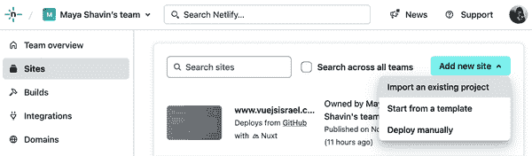

# 第十二章：Vue.Js 应用的持续集成/持续部署

上一章向我们展示了如何为我们的 Vue 应用程序设置测试，从使用 Vite 的单元测试到使用 Playwright 的 E2E 测试。通过为我们的应用程序覆盖适当的测试，我们可以继续进行下一步：部署。

本章将介绍 CI/CD 的概念，以及如何使用 GitHub Actions 为您的 Vue 应用程序设置 CI/CD 流水线。我们还将学习如何使用 Netlify 作为我们的应用程序的部署和托管平台。

# 软件开发中的 CI/CD

持续集成（CI）和持续交付（CD）是结合的软件开发实践，旨在加快和稳定软件开发和交付过程。CI/CD 包括通过自动化集成、测试和持续软件部署到生产的过程，有效监控软件生命周期。

CI/CD 为软件开发带来了许多好处，包括：

+   通过自动化部署实现更快的软件交付

+   不同团队之间更强的协作

+   通过自动化测试提高软件质量

+   更加敏捷的方法响应错误和软件问题

简而言之，CI/CD 包含三个主要概念：持续集成、持续交付和持续部署，当它们结合在一起时，就形成了一个强大的软件开发流程，称为 CI/CD 流水线（图 12-1）。


###### 图 12-1. CI/CD 流水线

## 持续集成

持续集成使开发人员能够在独立工作的同时频繁且同时地将代码集成到共享仓库中。通过每次代码集成（或合并），我们使用应用程序的自动构建和不同级别测试的自动化系统进行验证。如果新旧代码版本之间存在冲突或新代码存在任何问题，我们可以迅速检测并修复它们。持续集成的标准工具包括 Jenkins、CircleCI 和 GitHub Actions，我们将在“使用 GitHub Actions 的 CI/CD 流水线”中讨论它们。

## 持续交付

成功的持续集成之后的下一步是持续交付。持续交付将验证的应用程序代码自动发布到共享仓库，使其为生产部署做好准备。持续交付需要持续集成，因为它假设代码始终是经过验证的。它还包括另一系列的自动化测试和发布自动化。

## 持续部署

连续部署是 CI/CD 流水线的最后一步，自动将经过验证的代码部署到生产环境。它在很大程度上依赖于对代码库进行了充分测试的自动化系统。连续部署是 CI/CD 流水线的最高级阶段，对某些项目尤其重要，特别是在需要在生产部署之前进行手动批准的情况下。

CI/CD 流水线的三个阶段形成了更安全和灵活的应用程序开发和部署流程。在下一节中，我们将学习如何为我们的 Vue 应用程序使用 GitHub Actions 设置 CI/CD 流水线。

# 使用 GitHub Actions 的 CI/CD 流水线

GitHub Actions 由 GitHub 提供，是一个与平台无关、语言无关和云无关的 CI/CD 平台。它易于使用，并且对于托管在 GitHub 平台上的项目是免费的。GitHub Actions 中的每个 CI/CD 流水线包含一个或多个工作流，以 YAML 文件表示。每个工作流包括一系列作业，可以并行或顺序执行。每个作业都有一系列步骤，其中包含许多顺序执行的操作。每个操作都是在指定的运行环境中执行的独立命令或脚本（见示例 12-1）。

##### 示例 12-1。示例 GitHub 工作流文件

```
name: Example workflow
on: [push, pull_request]
jobs:
    first-job:
        steps:
        - name: First step
            run: echo "Hello world"
        - name: Second step
            run: echo "Second step"
    second-job:
        steps:
        - name: First step
            run: echo "Do something in second job."
```

###### 注意

工作流文件遵循 YAML 语法。您可以在[GitHub Actions 文档的工作流语法](https://oreil.ly/uIIkh)中学习如何使用 YAML 语法。

要开始使用 GitHub Actions，在我们的 Vue 项目目录中，我们将创建一个名为`.github/workflows`的新目录，其中包含一个名为`ci.yml`的工作流文件。这个文件将包含我们的 CI/CD 流水线的配置。例如，以下是一个简单的工作流文件，用于运行我们的单元测试：

```
name: CI for Unit tests
on:
    push:
        branches: [ main ] 
    pull_request:
        branches: [ main ] 
jobs:
    unit-tests:
      timeout-minutes: 60
      runs-on: ubuntu-latest
      steps:
      - uses: actions/checkout@v3   
      - uses: actions/setup-node@v3 
        with:
          node-version: 18
      - name: Install dependencies 
        run: npm i
      - name: Execute unit tests
        run: npm run test:coverage 
      - name: Uploading artifacts 
        uses: actions/upload-artifact@v3
        with:
          name: test-results
          path: test-results/
          retention-days: 30
```


当`main`分支有推送时，工作流将被触发。


当有合并请求要合并到`main`时


使用内置的 GitHub Actions，通过`actions/checkout`将测试分支检出到运行环境


使用内置的 GitHub Actions，使用 Node.js 版本 18.x 设置节点环境，`actions/setup-node`


安装依赖项


运行带有覆盖率报告的单元测试


将测试报告作为工件上传到 GitHub Actions

###### 注意

每个作业都是独立的进程，并且不共享相同的环境。因此，在其步骤中，我们需要分别为每个作业安装依赖项。

在 GitHub 上，我们可以进入 *Actions* 标签页查看工作流的状态（参见图 12-2）。


###### 图 12-2\. 正在运行的 GitHub Actions 页面

GitHub 根据提交显示工作流，包括其状态和目标分支（`main`）。我们可以通过点击作业名称查看工作流中每个作业的状态，例如我们可以查看单元测试作业的状态在图 12-3 中。


###### 图 12-3\. 作业运行状态下的单元测试步骤

一旦工作流运行完成，我们可以看到测试报告上传到 Artifacts 部分（参见图 12-4）。


###### 图 12-4\. 带有测试报告的 Artifacts 部分

我们还可以通过点击工作流名称（如图 12-5）检查工作流的状态结果，按作业拆分。


###### 图 12-5\. 工作流状态页面

GitHub Actions 将标记任何失败的作业，并提供失败的摘要注释。我们也可以通过点击 *Re-run jobs* 按钮重新运行失败的作业。

通过这样，我们为我们的 Vue 应用程序创建了第一个 CI/CD 管道。或者，您可以使用官方的[GitHub Actions 市场](https://oreil.ly/ch9V2)中提供的模板来创建您的工作流，该市场内置支持不同的编程语言、框架、服务和云提供商（参见图 12-6）。


###### 图 12-6\. GitHub Actions 市场

根据我们的工作流示例，如果需要，可以为应用程序创建更多工作流，或者扩展当前工作流以包括更多步骤，例如部署。在下一节中，我们将学习如何使用 Netlify 为我们的应用程序设置持续部署。

# 使用 Netlify 进行持续部署

Netlify 是一个云平台，为托管现代 Web 应用程序提供广泛的服务，包括托管、无服务器函数 API 和 CI/CD 集成。个人项目免费，商业项目提供慷慨的免费层级。^(1)

要在 Netlify 上部署我们的 Vue 项目，我们需要[创建一个 Netlify 账户](https://oreil.ly/uLHpQ)并登录。一旦登录到仪表板，我们可以转到 *Sites* 标签，并点击 *Add new site* 按钮，从 GitHub 提供者导入我们的项目进行自动部署，或者手动部署（参见图 12-7）。



###### 图 12-7\. Netlify 仪表板

接下来，我们选择我们项目的 Git 提供者（GitHub），并授权 Netlify 访问我们的 GitHub 帐户。确认后，我们可以选择项目的存储库，然后点击`部署站点`按钮开始部署过程。完成部署后，我们可以在仪表板的*站点概述*选项卡上查看我们站点部署的状态及其他详细信息，例如 PR 预览（图 12-8）。


###### 图 12-8\. Netlify 站点概述

成功部署后，Netlify 将提供一个临时 URL 用于访问应用程序。实际上，您可以通过导航到*域管理*部分（图 12-9）配置您站点的自定义域名。


###### 图 12-9\. Netlify 域设置

默认情况下，一旦集成，Netlify 将在每次将新提交合并到`main`分支时自动部署您的应用程序。此外，它将为每个拉取请求生成预览构建。在此视图中，您还可以配置其他设置，如构建命令、用于持续部署的部署上下文以及应用程序的环境变量。Netlify 还提供构建钩子作为唯一 URL，可通过 HTTP 请求触发与 GitHub Actions 工作流等第三方服务的构建和部署（图 12-10）。


###### 图 12-10\. 站点设置中的构建钩子部分

###### 注意

您可以在本地使用命令`yarn build`手动构建您的应用程序，然后将`dist`文件夹拖放到[Netlify 应用程序](https://oreil.ly/LInwT)，以部署您的应用程序到 Netlify 提供的临时 URL。

# 使用 Netlify CLI 部署

或者，我们可以将 Netlify CLI 作为全局工具安装在我们的本地机器上，使用命令`npm install -g netlify-cli`。安装了此 CLI 后，我们可以使用命令`netlify init`初始化我们的项目以用于 Netlify。此命令将提示我们登录相关帐户（GitHub）并准备我们的项目进行部署。初始化并准备就绪后，我们可以运行命令`netlify deploy`将项目部署到临时 URL 进行预览，或者运行`netlify deploy --prod`直接部署到生产环境。

我们已成功将第一个 Vue 应用程序部署到 Netlify。Netlify 提供的其他高级功能包括无服务器函数、表单处理和分割测试。您可以根据项目要求使用[Netlify 官方文档](https://oreil.ly/6X9F6)来探索这些功能。

# 概要

在本章中，我们学习了关于 CI/CD 的概念，以及如何利用 GitHub Actions 为我们的 Vue 应用程序建立一个简单的 CI/CD 流程。我们还了解了 Netlify，并学习了如何自动将我们的应用程序部署到 Netlify 托管平台。在下一章中，我们将探讨 Vue 生态系统的最后几个方面，即使用 Nuxt.js 进行服务器端渲染（SSR）和静态站点生成（SSG）。

^(1) 其他选择包括 Azure 静态 Web 应用和 Vercel。
