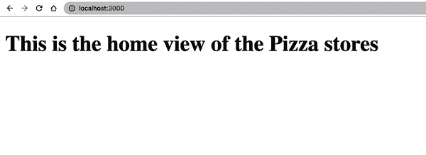

# 第十三章：使用 Vue 进行服务器端渲染

在前一章中，我们学习了如何设置 Vue 应用程序的完整 CI/CD 管道。我们还学习了如何使用 Netlify 进行生产部署。我们的应用程序现在已准备好供用户通过网络访问。因此，我们几乎完成了使用 Vue 学习的旅程。本章将探讨 Vue 的另一个方面，即使用 Nuxt.js 进行服务器端渲染和静态站点生成。

# Vue 中的客户端渲染

默认情况下，Vue 应用程序用于客户端渲染，具有占位符`index.html`文件、JavaScript 文件（通常由 Vite 编译为优化的代码块）、以及其他文件如 CSS、图标、图像等，以提供完整的 UI 体验。在初始加载时，浏览器向服务器发送请求获取`index.html`文件。服务器将返回原始的占位符文件（通常包含一个带有唯一 id 选择器`app`的单个元素，用于 Vue 引擎挂载应用程序实例，以及一个指向包含主要代码的`script`标签）。一旦浏览器接收到 HTML 文件，它将开始解析并请求其他资源，如所需的`main.js`文件，然后执行它以相应地渲染其余内容（参见图 13-1）。


###### 图 13-1\. 客户端 Vue 应用程序渲染流程

从这一点开始，应用程序完成初始化，用户可以开始与其进行交互。Vue 将通过内置的路由系统动态处理用户的视图更改请求。但是，如果您右键单击页面并选择*查看页面源代码*，您将只看到原始根`index.html`文件的代码，而不是当前的 UI 视图。这种行为可能会有问题，特别是在构建需要良好搜索引擎优化（SEO）的网站或应用程序时^(1)。

另外，加载和执行 JavaScript 代码以在向用户显示任何内容之前可能导致用户等待时间较长，原因包括需要下载的重量级 JavaScript 文件、慢速网络、浏览器绘制内容所需的时间（首次绘制）等因素。因此，整个过程可能导致较长的交互时间^(2)和较慢的首次内容绘制^(3)。所有这些因素影响了整体应用程序的性能和用户体验，并且通常难以解决。

在这种情况下，可能有比客户端渲染应用程序更好的选择，例如我们将在下一节中探讨的服务器端渲染。

# 服务器端渲染（SSR）

正如其名称所示，服务器端渲染（SSR）是一种在服务器端将所有内容编译为完全工作的 HTML 页面，然后根据需要（而不是在浏览器上执行）将其提供给客户端（浏览器）的方法。

要开发本地 SSR Vue 应用程序，我们需要一个本地服务器来与浏览器通信并处理所有数据请求。我们可以通过以下命令安装 Express.js^(4)作为我们项目的依赖项：

```
yarn add express
```

安装完成后，我们可以在项目的根目录中创建一个名为`server.js`的文件，并使用示例 13-1 中的代码来设置我们的本地服务器。

##### 示例 13-1\. 本地服务器的`server.js`文件

```
import express from 'express'

const server = express() 

server.get('/', (req, res) => { 
    res.send(`   <!DOCTYPE html>
        <html>
        <head>
            <title>Vue SSR Example</title>
        </head>
        <body>
            <main id="app">Vue SSR Demo</main>
        </body>
        </html> `)
})

server.listen(3000, () => { console.log('We are ready to go') }) 
```


创建一个`server`实例


为入口 URL“/”定义处理程序


处理程序将返回一个字符串，作为在浏览器上显示*Vue SSR Demo*的 HTML 页面。


我们设置本地服务器以在端口 3000 上运行和侦听。

在项目的根目录中，我们可以使用`node server.js`命令启动本地服务器。一旦服务器准备好，我们必须使用`vue`包中的`createSSRApp`方法在服务器上创建我们的应用程序。例如，让我们编写一个 Vue 应用程序，在`app.js`文件中显示当前日期和时间的数字时钟，代码在示例 13-2 中。

##### 示例 13-2\. 数字时钟应用程序的`app.js`文件

```
import { createSSRApp, ref } from 'vue'

const App = { 
    template: ` <h1>Digital Clock</h1>
        <p class="date">{{ date }}</p>
        <p class="time">{{ time }}</p> `,
    setup() {
        const date = ref('');
        const time = ref('');

        setInterval(() => {
            const WEEKDAYS = ['SUN', 'MON', 'TUE', 'WED', 'THU', 'FRI', 'SAT'];
            const MONTHS = [
                'Jan', 'Feb', 'Mar',
                'Apr', 'May', 'Jun',
                'Jul', 'Aug', 'Sep',
                'Oct', 'Nov', 'Dev'
            ];

            const currDate = new Date();
            const minutes = currDate.getMinutes();
            const seconds = currDate.getSeconds();
            const day = WEEKDAYS[currDate.getDay()];
            const month = MONTHS[currDate.getMonth()].toUpperCase();

            const formatTime = (time) => {
                return time < 10 ? `0${time}` : time;
            }

            date.value =
              `${day}, ${currDate.getDate()} ${month} ${currDate.getFullYear()}`
            time.value =
              `${currDate.getHours()}:${formatTime(minutes)}:${formatTime(seconds)}`
        }, 1000)

        return {
            date,
            time
        }
    }
}

export function createApp() {
  return createSSRApp(App) 
}
```


我们为主应用程序组件 App 定义选项。


我们使用`createSSRApp()`和`App`选项在服务器端构建应用程序。

此文件暴露了一个方法`createApp()`，可用于服务器端和客户端，返回一个准备好用于挂载的 Vue 实例。

在我们的`server.js`文件中，我们将使用`app.js`中的`createApp()`创建服务器端应用程序实例，并使用`vue/server-renderer`包中的`renderToString()`方法将其渲染为 HTML 格式的字符串。一旦`renderToString()`返回带有内容字符串的响应，我们将用它替换返回的响应中的内容，如示例 13-3 所示。

##### 示例 13-3\. 更新`server.js`以将应用实例渲染为 HTML 字符串

```
import { createApp } from './app.js'
import express from 'express'
import { renderToString } from 'vue/server-renderer';

const server = express()

server.get('/', (req, res) => {
  const app = createApp(); 

  renderToString(app).then((html) => {
    res.send(` <!DOCTYPE html>
    <html>
      <head>
        <title>Vue SSR Demo - Digital Clock</title>
      </head>
      <body>
        <div id="app">${html}</div>  </body>
    </html> `);
  });
});

server.listen(3000, () => { console.log('We are ready to go') })
```


使用`createApp()`创建应用实例


将`renderToString()`生成的 HTML 字符串放置在具有`#app`作为其 id 的`div`中。

当我们访问 [*http://locahost:3000/*](http://locahost:3000/) 时，我们将只看到浏览器仅显示标题 *数字时钟*（图 13-2），字段 `date` 和 `time` 为空。


###### 图 13-2\. 空数字时钟

这种行为发生是因为我们只生成了返回客户端的 HTML 静态代码，但在浏览器中没有 Vue 可用。同样的情况也适用于任何交互行为，例如 `onClick` 事件处理程序。为了解决这个交互问题，我们需要在水合模式下挂载我们的应用程序，允许 Vue 接管静态 HTML，并在 HTML 在浏览器端可用时使其变得交互和动态。我们可以通过定义一个 `entry-client.js` 来做到这一点，该文件将使用 `app.js` 中的 `createApp()` 获取应用程序实例。浏览器将执行此文件并将 Vue 实例挂载到 DOM 中的正确元素上（示例 13-4）。

##### 示例 13-4\. `entry-client.js` 文件，用于在水合模式下挂载应用实例

```
import { createApp } from './app.js';

createApp().mount('#app');
```

我们还将更新 `server.js` 文件，以使用 `<script>` 标签在浏览器中加载 `entry-client.js` 文件，并启用在浏览器中提供客户端文件（示例 13-5）。

##### 示例 13-5\. 更新 `server.js` 以在浏览器中加载 `entry-client.js`

```
//... 
server.get('/', (req, res) => {
  const app = createApp();

  renderToString(app).then((html) => {
    res.send(` <!DOCTYPE html>
    <html>
      <head>
        <title>Vue SSR Demo - Digital Clock</title>
        <script type="importmap">  {
            "imports": {
              "vue": "https://unpkg.com/vue@3/dist/vue.esm-browser.js"
            }
          }
        </script>
        <script type="module" src="/entry-client.js"></script>  </head>
      <body>
        <div id="app">${html}</div>
      </body>
    </html> `);
  });
});

server.use(express.static('.')); 
```


使用 `importmap` 加载 `vue` 包的源代码


使用 `<script>` 标签在浏览器中加载 `entry-client.js` 文件


在浏览器中启用提供客户端文件

当我们重新启动服务器并刷新浏览器时，将会看到以更新的日期和时间显示的时钟。


###### 图 13-3\. 数字时钟

# 在 SSR 中使用 DOM API 和 Node API

你不能在 SSR 中使用 DOM API 和 Web API，因为这些只是浏览器的 API。你也不能仅使用 Node API，例如文件读取中的 `fs`，用于客户端组件。

我们已经学习了如何创建一个简单的 SSR Vue 应用程序。然而，当我们需要处理更复杂的应用程序时，例如使用 Vue 单文件组件、代码分割、Vue Router，可能需要使用 `window` API 等时，我们可能需要构建一个引擎来处理应用程序代码捆绑、使用正确捆绑代码进行渲染、包装 Vue Router 等等，这可能是一个繁琐的任务。

相反，我们可以使用已经提供此引擎的框架，例如下一节讨论的 Nuxt.js。

# 使用 Nuxt.Js 进行服务器端渲染

Nuxt.js（Nuxt）是一个基于 Vue 构建的开源模块化 SSR 框架。它提供了许多开箱即用的功能，如基于文件的路由系统、性能优化、不同的构建模式等，同时专注于开发者的体验（图 13-4）。


###### 图 13-4\. Nuxt.js 官方网站

作为基于模块的框架，Nuxt 包充当核心，我们可以向应用程序中插入其他 Nuxt 支持的模块以扩展核心功能。您可以在[Nuxt 模块官方文档](https://oreil.ly/hkdnj)中找到可用的 Nuxt 模块列表，包括 SEO、PWA、i18n 等模块。

###### 注意

访问[Nuxt 官方文档](https://oreil.ly/1B2vg)以了解其 API 文档、安装方法以及主要用途的参考资料。截至撰写时，Nuxt 3.4.2 是最新版本。

在本节中，我们将使用 Nuxt 创建我们在第八章中介绍的 Pizza House 应用程序。我们将从以下命令开始创建新的 Nuxt 应用程序：

```
npx nuxi init pizza-house
```

`pizza-house`是我们的项目名称，而`nuxi`是 Nuxt CLI，将使用以下主要文件搭建 Nuxt 应用程序：

`app.vue`

应用程序的根组件。

`nuxt.config.ts`

Nuxt 的配置文件，包括设置插件、CSS 路径、应用程序元数据等。

###### 注意

Nuxt 默认支持 TypeScript 的应用程序创建。

Nuxt 还将在`package.json`中创建用于构建和本地运行应用程序的脚本命令，如示例 13-6 所示。

##### 示例 13-6\. Nuxt 应用程序的`package.json`文件

```
"scripts": {
    "build": "nuxt build",
    "dev": "nuxt dev",
    "generate": "nuxt generate",
    "preview": "nuxt preview",
    "postinstall": "nuxt prepare"
},
```

在运行`yarn`命令安装依赖后，可以运行`yarn dev`命令在本地启动应用程序，并访问*http://localhost:3000*查看默认的 Nuxt 登陆页面。

由于 Nuxt 支持使用`pages`文件夹进行基于文件的路由，现在我们将在此文件夹下定义我们的路由系统：

index.vue

应用程序的主页。Nuxt 将自动将此页面映射到根路径（*/*）。

pizzas/index.vue

显示披萨列表的页面，路径为*/pizzas*。

pizzas/[id].vue

这是一个动态嵌套页面，其中`[id]`是显示披萨详细信息的占位符。Nuxt 将自动将此页面映射到路径*/pizzas/:id*，如*/pizza/1*、*/pizza/2*等。

接下来，我们需要用示例 13-7 中的代码替换`app.vue`的内容，以使路由系统正常工作。

##### 示例 13-7\. 更新`app.vue`以使用 Nuxt 的布局和页面组件

```
<template>
  <div>
    <NuxtLayout>
      <NuxtPage/>
    </NuxtLayout>
  </div>
</template>
```

`NuxtLayout`是应用程序的布局组件，`NuxtPage`是页面组件。Nuxt 将自动用定义的页面和布局组件替换这些组件。

让我们将示例 13-8 中的代码添加到`pages/index.vue`中，以显示首页。

##### 示例 13-8\. Pizza House 应用程序的首页

```
<template>
    <h1>This is the home view of the Pizza stores</h1>
</template>
```

以及从示例 13-9 到`pages/pizzas/index.vue`的代码，用于显示披萨列表。

##### 示例 13-9\. Pizza House 应用程序的 Pizzas 页面

```
<template>
  <div class="pizzas-view--container">
    <h1>Pizzas</h1>
    <ul>
      <li v-for="pizza in pizzas" :key="pizza.id">
        <PizzaCard :pizza="pizza" />
      </li>
    </ul>
  </div>
</template>
<script lang="ts" setup>
import { usePizzas } from "@/composables/usePizzas";
import PizzaCard from "@/components/PizzaCard.vue";

const { pizzas } = usePizzas();
</script>
```

此页面使用来自 示例 11-1 的 `PizzaCard` 组件和来自 `composables/usePizzas.ts` 的 `usePizzas` 组合式，以获取要显示的披萨列表，使用了 示例 13-10 中的代码。

##### 示例 13-10\. Pizza House 应用程序的组合式

```
import type { Pizza } from "@/types/Pizza";
import { ref, type Ref } from "vue";

export function usePizzas(): { pizzas: Ref<Pizza[]> } {
  return {
    pizzas: ref([
      {
        id: "1",
        title: "Pina Colada Pizza",
        price: "10.00",
        description:
          "A delicious combination of pineapple, coconut, and coconut milk.",
        image:
      "https://res.cloudinary.com/mayashavin/image/upload/Demo/pina_colada_pizza.jpg",
        quantity: 1,
      },
      {
        id: "2",
        title: "Pepperoni Pizza",
        price: "12.00",
        description:
          "A delicious combination of pepperoni, cheese, and pineapple.",
        image:
      "https://res.cloudinary.com/mayashavin/image/upload/Demo/pepperoni_pizza.jpg",
        quantity: 2,
      },
      {
        id: "3",
        title: "Veggie Pizza",
        price: "9.00",
        description:
          "A delicious combination of mushrooms, onions, and peppers.",
        image:
      "https://res.cloudinary.com/mayashavin/image/upload/Demo/veggie_pizza.jpg",
        quantity: 1,
        },
    ]),
  };
}
```

当我们使用 `yarn dev` 运行应用程序时，将分别在浏览器中看到首页（图 13-5）和披萨页面（图 13-6）。



###### 图 13-5\. Pizza House 应用程序的首页


###### 图 13-6\. Pizza House 应用程序的披萨页面

现在，我们将通过将代码从 示例 13-11 添加到 `pages/pizzas/[id].vue` 来实现披萨详情页面。

##### 示例 13-11\. 披萨详情组件

```
<template>
  <section v-if="pizza" class="pizza--container">
    
    <div class="pizza--details">
      <h1>{{ pizza.title }}</h1>
      <div>
        <p>{{ pizza.description }}</p>
        <div class="pizza-stock--section">
          <span>Stock: {{ pizza.quantity || 0 }}</span>
          <span>Price: ${{ pizza.price }}</span>
        </div>
      </div>
    </div>
  </section>
  <p v-else>No pizza found</p>
</template>
<script setup lang="ts">
import { usePizzas } from "@/composables/usePizzas";

const route = useRoute(); 

const { pizzas } = usePizzas();

const pizza = pizzas.value.find(
    (pizza) => pizza.id === route.params.id 
);
</script>
```


使用 `useRoute`，Vue Router 的全局组合式，获取当前路由的信息。


`route.params.id` 是 URL 中披萨的 id。

当我们访问 */pizzas/1* 时，将在浏览器中看到披萨详情页面（图 13-7）。


###### 图 13-7\. id 为 1 的披萨详情页面

###### 注

与常规的 Vue 应用程序不同，我们不能将路由参数 `id` 映射到 `PizzaDetails` 组件的 `id` 属性。相反，我们需要使用 `useRoute` 组合式获取当前路由的信息，包括其参数。

接下来，我们将通过将代码从 示例 13-12 添加到 `layouts/default.vue` 文件来实现应用程序的默认布局。

##### 示例 13-12\. Pizza House 应用程序的默认布局

```
<template>
    <nav>
        <NuxtLink to="/">Home</NuxtLink> 
        <NuxtLink to="/pizzas">Pizzas</NuxtLink>
    </nav>
    <main>
        <slot /> 
    </main>
</template>
<style scoped>
nav {
    display: flex;
    gap: 20px;
    justify-content: center;
}
  </style>
```


`NuxtLink` 是 Nuxt 组件，用于渲染链接元素，类似于 Vue Router 中的 `RouterLink`。


`<slot />` 是用于渲染页面内容的插槽元素。

Nuxt 将使用默认布局替换 `NuxtLayout`，我们将在浏览器中看到导航栏显示（图 13-8）。


###### 图 13-8\. Pizza House 应用程序的默认布局

我们还可以在 `layouts` 中创建不同的布局文件，并将所需的布局文件名传递给 `NuxtLayout` 的 `name` 属性。Nuxt 将根据其值选择适当的布局组件进行渲染。例如，我们可以创建一个名为 `layouts/pizzas.vue` 的新布局文件，并使用 示例 13-13 中的代码。

##### 示例 13-13\. Pizza House 应用程序的披萨布局

```
<template>
    <h1>Pizzas Layout</h1>
    <main>
        <slot />
    </main>
</template>
```

在`app.vue`中，我们将布局名称有条件地传递给`NuxtLayout`的`name` props（示例 13-14）。

##### 示例 13-14\. 使用 pizzas 布局的 PizzaDetails 组件

```
<template>
    <NuxtLayout :name="customLayout">
        <NuxtPage />
    </NuxtLayout>
</template>
<script setup lang="ts">
import { computed } from "vue";

const customLayout = computed(
    () => {
      const isPizzaLayout = useRoute().path.startsWith("/pizzas/");
      return isPizzaLayout ? 'pizzas' : 'default';
    }
);
</script>
```

当我们转到*/pizzas/1*时，我们将看到使用`layouts/pizzas`布局呈现的披萨详情页面（图 13-9）。

###### 注意

除了`pages`结构外，其余应用结构与常规 Vue 应用相同。因此，将 Vue 应用转换为 Nuxt 应用非常简单。

通过 SSR，我们可以实现更快的初始页面加载和更好的 SEO，因为浏览器接收到我们应用的完全填充的 HTML 文件。然而，SSR 的缺点是，每次浏览器刷新时，与单页面应用程序相比，应用需要完全重新加载。^(5)


###### 图 13-9\. 使用自定义布局呈现的披萨详情页面

此外，由于 SSR 需要在服务器上动态填充页面内容后再将页面内容文件返回给浏览器，这可能导致页面渲染延迟，并且任何需要页面内容更改的交互都可能导致多个服务器请求，从而影响整体应用性能。我们可以使用静态页面生成器（SSG）方法来解决这个问题。

# 静态页面生成器（SSG）

静态页面生成器（SSG）是一种服务器端渲染的类型。与常规服务器端渲染不同，SSG 将在构建时生成并索引应用程序中的所有页面，并根据需要将这些页面提供给浏览器。通过这种方式，它确保了客户端的初始加载和性能。

###### 注意

这种方法适用于不需要动态内容的应用，例如博客、文档等。但是，如果您的应用包含用户生成的内容（认证等），请考虑使用 SSR 或者[混合方法](https://oreil.ly/zqTn1)。

在 Nuxt 中使用 SSG 非常简单。我们可以在同一个代码库中使用`yarn generate`命令。该命令将生成应用的静态文件，存储在`dist`目录中，准备部署。

`generate`命令将生成应用的静态文件，存储在`.output/public`目录中，准备部署（图 13-10）。


###### 图 13-10\. 运行`yarn generate`后的`.output`目录

就是这样了。最后一步是将`dist`目录部署到静态托管服务，例如 Netlify、Vercel 等。这些托管平台将使用带缓存的内容交付网络（CDN）将静态文件按需提供给浏览器。

# 最后一点

在本章中，我们学习了如何使用 Nuxt 构建 SSR 和 SSG 应用程序。通过这一点，我们在本书中的旅程也告一段落。

我们已经涵盖了 Vue 的所有基础知识，包括核心概念、Options API、Vue 组件的生命周期，以及如何有效地使用 Composition API 在 Vue 应用中创建强大和可重用的组件系统。我们还学习了如何集成 Vue Router 和 Pinia，以创建具有路由和数据状态管理的完全可工作的 Vue 应用程序。我们探索了开发 Vue 应用程序流程的不同方面，从使用 Vitest 进行单元测试和使用 Playwright 进行端到端测试，到使用 GitHub workflows 创建部署流水线并使用 Netlify 进行托管。

现在你已经准备好探索更高级的 Vue 主题，并且具备了构建自己的 Vue 项目所需的技能。那么，接下来应该怎么做呢？有许多可能性等待着你。开始构建你的 Vue 应用程序并进一步探索 Vue 生态系统。如果你想开发基于内容的网站，请考虑深入了解 Nuxt。如果你对为 Vue 制作 UI 库感兴趣，请查看 Vite 和像原子设计这样的设计系统概念。

无论你的选择是什么，你在 Vue 中学到的技能将始终在你成为优秀的前端工程师和 Vue 开发者的旅程中派上用场。希望这本书能成为你在这条路上的参考和基础。

开发 Web 应用程序，特别是使用 Vue，是一件有趣而令人兴奋的事情。开始创造并分享你所实现的成就吧！

^(1) SEO 是使你的应用程序更适合搜索引擎在搜索结果中索引的过程。

^(2) 用户可以与页面进行交互的时间点。

^(3) 用户第一次看到内容的时间点。

^(4) Express.js 是一个 Node.js Web 应用程序框架。

^(5) 单页面应用程序是一种方法，可以动态地用新数据替换当前视图，而无需重新加载整个页面。
