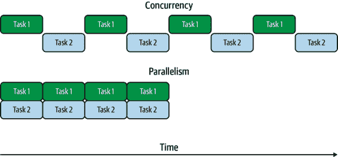

# 第一章：引言

计算机过去要简单得多。这并不是说它们易于使用或编写代码，但从概念上讲，可用的东西要少得多。20 世纪 80 年代的个人电脑通常只有一个 8 位 CPU 核心，而且内存并不多。通常情况下，你只能一次运行一个程序。如今我们所认识的操作系统甚至不会与用户交互的程序同时运行。

最终，人们希望能够同时运行多个程序，于是多任务处理诞生了。这使得操作系统能够通过在程序之间切换执行来同时运行多个程序。程序可以通过让出执行权给操作系统来决定何时适当地让另一个程序运行。这种方法被称为*协作式多任务*。

在协作式多任务环境中，如果程序由于任何原因未能让出执行权，则没有其他程序可以继续执行。这种打断其他程序的行为是不可取的，因此操作系统最终向*抢占式多任务*靠拢。在这种模型中，操作系统会确定在何时将哪个程序运行在 CPU 上，使用自己的调度概念，而不是依赖于程序自身决定何时切换执行。直到今天，几乎每个操作系统都使用这种方法，即使在多核系统上也是如此，因为通常我们运行的程序比 CPU 核心要多。

同时运行多个任务对程序员和用户来说都非常有用。在引入线程之前，单个程序（即单个*进程*）无法同时运行多个任务。相反，希望并发执行任务的程序员要么将任务分割成较小的部分并在进程内部进行调度，要么在不同的进程中运行独立的任务并通过彼此通信。

即使在今天，某些高级语言中运行多个任务的适当方式仍然是运行额外的进程。在一些语言中，如 Ruby 和 Python，存在*全局解释器锁（GIL）*，意味着一次只能执行一个线程。虽然这使得内存管理更加实际，但使得多线程编程对程序员来说并不那么有吸引力，而是采用多进程的方式。

直到不久前，JavaScript 是一种仅支持将任务分割并安排其后续执行的语言，在 Node.js 的情况下则运行额外的进程。我们通常会使用回调函数或 Promise 将代码分割成异步单元。用这种方式编写的典型代码块可能看起来像是示例 1-1，通过回调或`await`来分割操作。

##### 示例 1-1\. 使用两种不同模式编写的典型异步 JavaScript 代码块的示例

```
readFile(filename, (data) => {
  doSomethingWithData(data, (modifiedData) => {
    writeFile(modifiedData, () => {
      console.log('done');
    });
  });
});

// or

const data = await readFile(filename);
const modifiedData = await doSomethingWithData(data);
await writeFile(filename);
console.log('done');
```

如今，在所有主要的 JavaScript 环境中，我们都可以访问线程，与 Ruby 和 Python 不同的是，我们没有全局解释器锁（GIL），使它们在执行 CPU 密集型任务时变得无效。相反，会做出其他权衡，比如不直接在线程之间共享 JavaScript 对象。尽管如此，线程对 JavaScript 开发人员来说仍然是有用的，用于隔离 CPU 密集型任务。在浏览器中，还有专用线程，它们具有与主线程不同的功能集。我们可以做到这一点的详细内容是后续章节的主题，但是为了给您一个概念，例如在浏览器中生成一个新线程并处理消息，可以像示例 1-2 那样简单。

##### 示例 1-2\. 生成浏览器线程

```
const worker = new Worker('worker.js');
worker.postMessage('Hello, world');

// worker.js
self.onmessage = (msg) => console.log(msg.data);
```

本书的目的是探索和解释 JavaScript 线程作为一种编程概念和工具。您将学习如何使用它们，更重要的是，何时使用它们。并非每个问题都需要用线程来解决。即使是每个 CPU 密集型问题也不需要用线程来解决。软件开发人员的工作是评估问题和工具，以确定最合适的解决方案。这里的目标是为您提供另一种工具，并提供足够的知识，使您知道何时以及如何使用它。

# 什么是线程？

在所有现代操作系统中，除了内核外，所有执行单元都被组织成进程和线程。开发人员可以使用进程和线程及它们之间的通信，为项目添加并发性。在具有多个 CPU 核心的系统上，这也意味着增加并行性。

当您执行一个程序，例如 Node.js 或代码编辑器时，您正在启动一个进程。这意味着代码被加载到该进程独有的内存空间中，没有其他内存空间可以被程序直接访问，除非向内核请求更多内存或映射到不同的内存空间。如果不添加线程或额外的进程，只有一个*指令*会按程序代码规定的适当顺序依次执行。如果您不熟悉，您可以将指令看作是代码的单个单元，如一行代码。（事实上，指令通常对应于处理器汇编代码中的一行！）

程序可能会生成额外的进程，这些进程有它们自己的内存空间。这些进程不共享内存（除非通过额外的系统调用映射），并且有它们自己的指令指针，这意味着每个进程可以同时执行不同的指令。如果这些进程在同一个核心上执行，处理器可能会在这些进程之间来回切换，暂时停止一个进程的执行，然后执行另一个进程。

一个进程也可以生成线程，而不是完整的进程。线程与它所属的进程共享内存空间，除了共享内存空间外，线程就像进程一样，每个线程都有自己的指令指针。关于进程执行的所有属性同样适用于线程。因为它们共享内存空间，所以在线程之间共享程序代码和其他值很容易。这使得它们比进程更有价值，用于向程序添加并发性，但也增加了编程的一些复杂性，我们将在本书后面讨论。

利用线程的典型方法是将 CPU 密集型工作（如数学运算）转移到额外的线程或线程池，而主线程则可以通过检查内部的新交互来与用户或其他程序进行外部交互。许多经典的 Web 服务器程序，如 Apache，使用这样的系统来处理大量的 HTTP 请求负载。这可能看起来类似于图 1-1。在这种模型中，HTTP 请求数据传递给工作线程进行处理，当响应准备就绪时，将其返回给主线程，以返回给用户代理。

###### 图 1-1\. HTTP 服务器中可能使用的工作线程

要使线程有用，它们需要能够相互协调。这意味着它们必须能够做一些像等待其他线程上的事件发生和从它们那里获取数据的事情。正如讨论的那样，我们在线程之间有一个共享的内存空间，并且通过一些其他基本的原语，可以构建传递消息的系统。在许多情况下，这些构造在语言或平台级别是可用的。

# 并发与并行比较

区分并发和并行非常重要，因为在多线程编程中经常会遇到它们。这些术语密切相关，根据情况可能意味着非常相似的事物。让我们从一些定义开始。

并发

任务在重叠的时间内运行。

并行

任务在完全相同的时间内运行。

虽然它们看起来可能意味着相同的事情，但请考虑任务可能会被分解成较小的部分，然后交错执行。在这种情况下，并发可以在没有并行的情况下实现，因为任务运行的时间框架可以重叠。要使任务并行运行，它们必须在*完全相同的时间*内运行。一般来说，这意味着它们必须在不同的 CPU 核心上完全同时运行。

考虑图 1-2。在图中，我们有两个并行和并发运行的任务。在并发的情况下，任何时刻只有一个任务在执行，但在整个时间段内，执行会在这两个任务之间切换。这意味着它们在重叠的时间内运行，因此符合并发的定义。在并行的情况下，两个任务同时执行，因此它们是并行运行的。由于它们也在重叠的时间段内运行，它们也同时在并发运行。并行是并发的一个子集。



###### 图 1-2\. 并发与并行比较

线程不会自动提供并行性。系统硬件必须通过具有多个 CPU 核心来允许此操作，并且操作系统调度程序必须决定在单独的 CPU 核心上运行线程。在单核系统或运行线程多于 CPU 核心的系统中，多个线程可以通过在适当时刻之间切换在单个 CPU 上同时运行。此外，在具有像 Ruby 和 Python 中的 GIL 的语言中，线程明确地被阻止提供并行性，因为整个运行时只能同时执行一个指令。

在时间上也要考虑这一点很重要，因为线程通常被添加到程序中以提高性能。如果您的系统只允许由于只有一个 CPU 核心可用或已经加载了其他任务而导致并发，则使用额外的线程可能没有任何感知上的好处。事实上，线程之间的同步和上下文切换的开销可能会导致程序表现更差。始终在预期运行的条件下测量应用程序的性能。这样，您可以验证多线程编程模型是否真正对您有益。

# 单线程 JavaScript

历史上，JavaScript 运行的平台不提供任何线程支持，因此这门语言被认为是单线程的。无论何时听到有人说 JavaScript 是单线程的，他们指的是这种历史背景以及它自然倾向的编程风格。事实上，尽管本书的标题如此，但语言本身没有任何内建功能来创建线程。这并不会让人太惊讶，因为它也没有任何内建功能来与网络、设备或文件系统交互，或者进行任何系统调用。确实，即使像 `setTimeout()` 这样的基础功能实际上也不是 JavaScript 的特性。相反，虚拟机（VM）嵌入的环境，如 Node.js 或浏览器，通过特定于环境的 API 提供这些功能。

大多数 JavaScript 代码不使用线程作为并发原语，而是以事件驱动的方式在单个执行线程上操作。各种事件如用户交互或 I/O 发生时，它们会触发事先设置为在这些事件上运行的函数的执行。这些函数通常称为*回调函数*，是 Node.js 和浏览器中异步编程的核心。即使在承诺或`async`/`await`语法中，回调函数也是底层原语。重要的是要认识到回调函数不是并行运行或与任何其他代码并行运行。当回调函数中的代码正在运行时，这是当前唯一正在运行的代码。换句话说，任何给定时间只有一个调用堆栈是活动的。

通常很容易认为操作是并行进行的，实际上它们是同时进行的。例如，想象一下你想要打开包含数字的三个文件，分别命名为*1.txt*、*2.txt*和*3.txt*，然后将结果相加并打印出来。在 Node.js 中，你可以像这样做示例 1-3。

##### 示例 1-3\. 在 Node.js 中并发读取文件

```
import fs from 'fs/promises';

async function getNum(filename) {
  return parseInt(await fs.readFile(filename, 'utf8'), 10);
}

try {
  const numberPromises = [1, 2, 3].map(i => getNum(`${i}.txt`));
  const numbers = await Promise.all(numberPromises);
  console.log(numbers[0] + numbers[1] + numbers[2]);
} catch (err) {
  console.error('Something went wrong:');
  console.error(err);
}
```

要运行此代码，请将其保存在名为*reader.js*的文件中。确保你有名为*1.txt*、*2.txt*和*3.txt*的文本文件，每个文件包含整数，然后使用`node reader.js`运行程序。

由于我们正在使用`Promise.all()`，我们正在等待所有三个文件被读取和解析。如果你仔细看，这甚至可能看起来与本章后面的 C 示例中的`pthread_join()`类似。然而，仅仅因为承诺是一起创建和等待的，并不意味着解析它们的代码同时运行，只是它们的时间框架是重叠的。仍然只有一个指令指针，并且一次只执行一个指令。

在没有线程的情况下，只有一个 JavaScript 环境可供使用。这意味着一个 VM 实例，一个指令指针和一个垃圾收集器实例。所谓的一个指令指针，意味着 JavaScript 解释器在任何给定时间只执行一个指令。这并不意味着我们受限于一个全局对象。在浏览器和 Node.js 中，我们都可以使用[realms](https://oreil.ly/uy7E2)。

可以将 realms 视为 JavaScript 环境的实例，如提供给 JavaScript 代码的。这意味着每个 realm 都有自己的全局对象，以及全局对象的所有相关属性，例如内置类如`Date`和其他对象如`Math`。在 Node.js 中全局对象被称为`global`，在浏览器中被称为`window`，但在现代版本中，你可以使用`globalThis`来引用全局对象。

在浏览器中，网页中的每个框架都有一个用于其中所有 JavaScript 的领域。因为每个框架都有自己的 `Object` 和其他原语的副本，您会注意到它们有自己的继承树，当在不同领域的对象上操作时，`instanceof` 可能不会按您期望的方式工作。这在 示例 1-4 中有所展示。

##### 示例 1-4\. 浏览器中来自不同框架的对象

```
const iframe = document.createElement('iframe');
document.body.appendChild(iframe);
const FrameObject = iframe.contentWindow.Object; 

console.log(Object === FrameObject); 
console.log(new Object() instanceof FrameObject); 
console.log(FrameObject.name); 
```


`iframe` 内部的全局对象可通过 `contentWindow` 属性访问。


这将返回 `false`，因此帧内的 `Object` 与主帧中的不同。 


`instanceof` 求值为 `false`，预料之中，因为它们不是同一个 `Object`。


尽管如此，构造函数具有相同的 `name` 属性。

在 Node.js 中，可以使用 `vm.createContext()` 函数构建领域，如 示例 1-5 中所示。在 Node.js 的术语中，领域被称为上下文。适用于浏览器框架的所有相同规则和属性也适用于上下文，但在上下文中，您无法访问任何全局属性或在 Node.js 文件中可能在范围内的任何其他内容。如果要使用这些功能，必须手动传递到上下文中。

##### 示例 1-5\. Node.js 中来自新上下文的对象

```
const vm = require('vm');
const ContextObject = vm.runInNewContext('Object'); 

console.log(Object === ContextObject); 
console.log(new Object() instanceof ContextObject); 
console.log(ContextObject.name); 
```


我们可以使用 `runInNewContext` 从新的上下文获取对象。


这将返回 `false`，因此与浏览器中的 iframe 一样，上下文中的 `Object` 与主上下文中的不同。


类似地，`instanceof` 求值为 `false`。


构造函数再次具有相同的 `name` 属性。

在任何这些领域情况下，重要的是注意，我们仍然只有一个指令指针，并且一次只有一个领域的代码在运行，因为我们仍然只谈论单线程执行。

# 隐藏线程

尽管您的 JavaScript 代码可能默认情况下在单线程环境中运行，但这并不意味着运行代码的进程是单线程的。事实上，可能会使用许多线程来使代码平稳高效地运行。许多人错误地认为 Node.js 是单线程进程。

现代 JavaScript 引擎如 V8 使用单独的线程处理垃圾回收和其他不需要与 JavaScript 执行同步发生的功能。此外，平台运行时本身可能使用额外的线程提供其他功能。

在 Node.js 中，`libuv` 被用作操作系统无关的异步 I/O 接口。由于并非所有系统提供的 I/O 接口都是异步的，它使用一个工作线程池来避免在使用阻塞 API（如文件系统 API）时阻塞程序代码。默认情况下，会生成四个这样的线程，但可以通过 `UV_THREADPOOL_SIZE` 环境变量进行配置，最多可达 1,024 个。

在 Linux 系统上，您可以使用 `top -H` 命令查看给定进程的额外线程。在 示例 1-6 中，启动了一个简单的 Node.js Web 服务器，并记录了 PID，然后传递给 `top` 命令。您可以看到各种 V8 和 `libuv` 线程总共达到七个线程，包括 JavaScript 代码运行的线程。您可以尝试在自己的 Node.js 程序中进行这些操作，甚至尝试更改 `UV_THREADPOOL_SIZE` 环境变量以查看线程数的变化。

##### 示例 1-6\. `top` 命令的输出，显示 Node.js 进程中的线程

```
$ top -H -p 81862
top - 14:18:49 up 1 day, 23:18,  1 user,  load average: 0.59, 0.82, 0.83
Threads:   7 total,   0 running,   7 sleeping,   0 stopped,   0 zombie
%Cpu(s):  2.2 us,  0.0 sy,  0.0 ni, 97.8 id,  0.0 wa,  0.0 hi,  0.0 si,  0.0 st
MiB Mem :  15455.1 total,   2727.9 free,   5520.4 used,   7206.8 buff/cache
MiB Swap:   2048.0 total,   2048.0 free,      0.0 used.   8717.3 avail Mem

    PID USER      PR  NI    VIRT    RES    SHR S  %CPU  %MEM     TIME+ COMMAND
  81862 bengl     20   0  577084  29272  25064 S   0.0   0.2   0:00.03 node
  81863 bengl     20   0  577084  29272  25064 S   0.0   0.2   0:00.00 node
  81864 bengl     20   0  577084  29272  25064 S   0.0   0.2   0:00.00 node
  81865 bengl     20   0  577084  29272  25064 S   0.0   0.2   0:00.00 node
  81866 bengl     20   0  577084  29272  25064 S   0.0   0.2   0:00.00 node
  81867 bengl     20   0  577084  29272  25064 S   0.0   0.2   0:00.00 node
  81868 bengl     20   0  577084  29272  25064 S   0.0   0.2   0:00.00 node
```

浏览器同样会在执行文档对象模型（DOM）渲染等许多任务时使用与 JavaScript 执行线程不同的线程。像我们在 Node.js 中使用 `top -H` 进行的实验，现代浏览器也会产生类似的几个线程。现代浏览器通过使用多个进程甚至进一步加强了安全性，通过隔离层增加了安全性。

在进行应用程序资源规划时，考虑这些额外的线程非常重要。您不应该假设仅因为 JavaScript 是单线程的，您的 JavaScript 应用程序只会使用一个线程。例如，在生产环境中的 Node.js 应用程序中，应该测量应用程序使用的线程数并据此进行规划。还要注意，Node.js 生态系统中许多本地附加组件也会生成自己的线程，因此在逐个应用程序基础上进行这些操作非常重要。

# C 语言中的线程：与 Happycoin 一起致富

显然，线程不仅限于 JavaScript。它们是操作系统层面上长期存在的概念，独立于语言。让我们探讨一个使用 C 语言编写的多线程程序是如何看待的。在这里选择 C 语言是显而易见的，因为 C 语言的线程接口是大多数高级语言中线程实现的基础，即使可能有不同的语义。

让我们从一个例子开始。想象一个用于一个简单而不切实际的加密货币 Happycoin 的工作证明算法，如下所示：

1.  生成一个随机的无符号 64 位整数。

1.  判断整数是否是快乐数。

1.  如果它不快乐，那它就不是 Happycoin。

1.  如果不能被 10,000 整除，那就不是 Happycoin。

1.  否则，它就不是 Happycoin。

如果一个数字最终变成 1，当将其替换为其数字平方的和并循环，或者之前看到的数字出现时，它是快乐的。[维基百科清晰地定义了它](https://oreil.ly/vRr3P)，并指出如果出现任何以前看到的数字，那么 4 将出现，反之亦然。您可能会注意到，我们的算法过于昂贵，因为在检查快乐之前我们可以检查可分性。这是有意为之，因为我们试图展示一个繁重的工作负载。

让我们构建一个简单的 C 程序，运行 10,000,000 次工作量证明算法，打印找到的任何 Happycoin，以及它们的数量。

###### 注意

这里的编译步骤中的`cc`可以替换为`gcc`或`clang`，具体取决于您可用哪个。在大多数系统上，`cc`是`gcc`或`clang`的别名，因此我们将在这里使用它。

Windows 用户可能需要在 Visual Studio 中做一些额外的工作，因为线程示例默认情况下在 Windows 上无法正常工作，这是因为它使用了与 Windows 线程不同的可移植操作系统接口（POSIX）线程。为了简化在 Windows 上尝试此操作，建议使用 Windows 子系统来获取一个与 POSIX 兼容的环境。

## 仅使用主线程

创建一个名为*happycoin.c*的文件，在名为*ch1-c-threads/*的目录中。我们将在本节中逐步构建这个文件。要开始，按照示例 1-7 中显示的代码添加。

##### 示例 1-7\. *ch1-c-threads/happycoin.c*

```
#include <inttypes.h>
#include <stdbool.h>
#include <stdio.h>
#include <stdlib.h>
#include <time.h>

uint64_t random64(uint32_t * seed) {
  uint64_t result;
  uint8_t * result8 = (uint8_t *)&result; 
  for (size_t i = 0; i < sizeof(result); i++) {
    result8[i] = rand_r(seed);
  }
  return result;
}
```


如果您主要使用 JavaScript，这一行可能会让您感到陌生，因为它使用了指针。简短地说，这里发生的事情是，`result8`是一个包含八个 8 位无符号整数的数组，支持与`result`相同的内存，后者是一个 64 位无符号整数。

我们添加了一堆`includes`，这些`includes`提供了方便的类型、I/O 函数以及我们需要的时间和随机数函数。由于算法需要生成一个随机的 64 位无符号整数（即`uint64_t`），我们需要八个随机字节，`random64()`通过调用`rand_r()`来获取这些字节，直到我们有足够的字节。由于`rand_r()`还需要一个种子的引用，我们将它作为参数传递给`random64()`。

现在让我们按照示例 1-8 中显示的方式添加我们的快乐数字计算。

##### 示例 1-8\. *ch1-c-threads/happycoin.c*

```
uint64_t sum_digits_squared(uint64_t num) {
  uint64_t total = 0;
  while (num > 0) {
    uint64_t num_mod_base = num % 10;
    total += num_mod_base * num_mod_base;
    num = num / 10;
  }
  return total;
}

bool is_happy(uint64_t num) {
  while (num != 1 && num != 4) {
    num = sum_digits_squared(num);
  }
  return num == 1;
}

bool is_happycoin(uint64_t num) {
  return is_happy(num) && num % 10000 == 0;
}
```

要获取`sum_digits_squared`中数字的平方和，我们使用模运算符`%`，从右到左获取每个数字，平方它，并将其添加到我们的运行总数中。然后我们在`is_happy`中使用这个函数，在数字为 1 或 4 时停止循环。我们停止在 1，因为这表示数字是快乐的。我们还在 4 时停止，因为这表明一个无限循环，我们永远不会结束在 1。最后，在`is_happycoin()`中，我们做的是检查一个数字是否快乐并且是否可被 10000 整除。

让我们将所有这些内容都包含在我们的`main()`函数中，如示例 1-9 所示。

##### 示例 1-9\. *ch1-c-threads/happycoin.c*

```
int main() {
  uint32_t seed = time(NULL);
  int count = 0;
  for (int i = 1; i < 10000000; i++) {
    uint64_t random_num = random64(&seed);
    if (is_happycoin(random_num)) {
      printf("%" PRIu64 " ", random_num);
      count++;
    }
  }
  printf("\ncount %d\n", count);
  return 0;
}
```

首先，我们需要一个随机数生成器的种子。当前时间是一个合适的种子，所以我们将通过`time()`来使用它。然后，我们将循环 1000 万次，首先从`random64()`获取一个随机数，然后检查它是否是一个 Happycoin。如果是，我们将增加计数并打印出该数字。在`printf()`调用中奇怪的`PRIu64`语法是为了正确打印 64 位无符号整数。循环完成后，我们打印出计数并退出程序。

要编译和运行此程序，请在您的*ch1-c-threads*目录中使用以下命令。

```
$ cc -o happycoin happycoin.c
$ ./happycoin
```

您将在一行上得到一个找到的 Happycoin 列表，下一行上是它们的计数。对于程序的一次运行，它可能看起来像这样：

```
11023541197304510000 ...  [ 167 more entries ] ... 770541398378840000
count 169
```

运行这个程序需要相当长的时间；在普通计算机上大约需要 2 秒。这是一个适合使用线程加速的情况，因为多次运行同样的大部分是数学运算的操作。

让我们继续将这个示例转换为一个多线程程序。

## 使用四个工作线程

我们将设置四个线程，每个线程将运行一个四分之一的迭代循环，生成一个随机数并测试它是否是 Happycoin。

在 POSIX C 中，线程通过`pthread_*`系列函数进行管理。`pthread_create()`函数用于创建一个线程。传入一个将在该线程上执行的函数。程序流在主线程上继续。程序可以通过在其上调用`pthread_join()`来等待线程的完成。您可以通过`pthread_create()`向在线程上运行的函数传递参数，并从`pthread_join()`获取返回值。

在我们的程序中，我们将 Happycoin 的生成隔离在一个名为`get_happycoins()`的函数中，这将在我们的线程中运行。我们将创建四个线程，然后立即等待它们完成。每当我们从一个线程那里得到结果时，我们将输出它们并存储计数，以便在最后打印总数。为了帮助传递结果回来，我们将创建一个简单的名为`happy_result`的`struct`。

复制现有的*happycoin.c*并将其命名为*happycoin-threads.c*。然后在新文件中，在文件中的最后一个`#include`之后插入示例 1-10 中的代码。

##### 示例 1-10\. *ch1-c-threads/happycoin-threads.c*

```
#include <pthread.h>

struct happy_result {
  size_t count;
  uint64_t * nums;
};
```

第一行包括`pthread.h`，它给了我们访问各种线程函数所需的权限。接着定义了`struct happy_result`，这将作为我们后面线程函数`get_happycoins()`的返回值。它存储了一个表示找到的 happycoins 的数组（这里用指针表示），以及它们的数量。

现在，继续删除整个`main()`函数，因为我们将要替换它。首先，让我们在示例 1-11 中添加我们的`get_happycoins()`函数，这是将在我们的工作线程上运行的代码。

##### 示例 1-11\. *ch1-c-threads/happycoin-threads.c*

```
void * get_happycoins(void * arg) {
  int attempts = *(int *)arg; 
  int limit = attempts/10000;
  uint32_t seed = time(NULL);
  uint64_t * nums = malloc(limit * sizeof(uint64_t));
  struct happy_result * result = malloc(sizeof(struct happy_result));
  result->nums = nums;
  result->count = 0;
  for (int i = 1; i < attempts; i++) {
    if (result->count == limit) {
      break;
    }
    uint64_t random_num = random64(&seed);
    if (is_happycoin(random_num)) {
      result->nums[result->count++] = random_num;
    }
  }
  return (void *)result;
}
```


这个奇怪的指针强制转换实际上是说：“把这个任意指针视为`int`的指针，然后获取该`int`的值。”

你会注意到，这个函数接受一个`void *`并返回一个`void *`。这是`pthread_create()`期望的函数签名，所以我们在这里没有选择。这意味着我们必须将我们的参数转换为我们想要的类型。我们将传入尝试的次数，所以我们将参数转换为`int`。然后，我们设置种子，就像在之前的示例中所做的那样，但这次是在我们的线程函数中进行的，所以我们为每个线程得到一个不同的种子。

分配足够的空间给我们的数组和`struct happy_result`后，我们继续进入与单线程示例中`main()`相同的循环，只是这次我们将结果放入`struct`而不是打印它们。一旦循环完成，我们将`struct`作为指针返回，然后将其强制转换为`void *`以满足函数签名。这就是信息如何传递回主线程，并且这是有意义的。

这展示了线程的一个关键特性，这是我们从进程中无法获得的，即共享内存空间。例如，如果我们使用进程而不是线程，并且使用某种*进程间通信（IPC）*机制来传输结果回来，我们将无法简单地将内存地址返回给主进程，因为主进程无法访问工作进程的内存。由于虚拟内存的原因，内存地址可能在主进程中指代完全不同的东西。而不是传递指针，我们将不得不通过 IPC 通道传递整个值回来，这可能会引入性能开销。由于我们使用线程而不是进程，我们可以直接使用指针，这样主线程可以同样使用它。

然而，共享内存并非没有其权衡之处。在我们的情况下，工作线程无需使用它现在传递给主线程的内存。但这并非所有情况下都如此。在许多情况下，必须通过同步正确管理线程访问共享内存；否则，可能会出现一些不可预测的结果。我们将在第四章 4 和第五章 5 中详细介绍 JavaScript 中如何处理这些情况。

现在，让我们在示例 1-12 中的`main()`函数中结束这一切。

##### 示例 1-12。*ch1-c-threads/happycoin-threads.c*

```
#define THREAD_COUNT 4

int main() {
  pthread_t thread [THREAD_COUNT];

  int attempts = 10000000/THREAD_COUNT;
  int count = 0;
  for (int i = 0; i < THREAD_COUNT; i++) {
    pthread_create(&thread[i], NULL, get_happycoins, &attempts);
  }
  for (int j = 0; j < THREAD_COUNT; j++) {
    struct happy_result * result;
    pthread_join(thread[j], (void **)&result);
    count += result->count;
    for (int k = 0; k < result->count; k++) {
      printf("%" PRIu64 " ", result->nums[k]);
    }
  }
  printf("\ncount %d\n", count);
  return 0;
}
```

首先，我们将把四个线程声明为堆栈上的数组。然后，我们将我们想要的尝试次数（10,000,000）除以线程数。这将作为参数传递给`get_happycoins()`，我们在第一个循环内看到，在该循环内，使用`pthread_create()`创建每个线程，并将每个线程的尝试次数作为参数传递。在下一个循环中，我们使用`pthread_join()`等待每个线程完成执行。然后，我们可以打印结果以及所有线程的总和，就像在单线程示例中那样。

###### 注意

本程序存在内存泄漏问题。在 C 语言和其他一些语言中，多线程编程的一个难点是很容易丢失内存分配和释放的位置和时间。请尝试修改此处的代码，以确保程序在退出时释放所有堆分配的内存。

完成更改后，您可以在您的*ch1-c-threads*目录下使用以下命令编译和运行此程序。

```
$ cc -pthread -o happycoin-threads happycoin-threads.c
$ ./happycoin-threads
```

输出应该看起来像这样：

```
2466431682927540000 ... [ 154 more entries ] ... 15764177621931310000
count 156
```

您将会注意到类似于单线程示例的输出。^(1) 您还会注意到它稍微快一些。在普通计算机上，它大约在 0.8 秒内完成。这并不完全是四倍速度快，因为主线程有一些初始开销，并且还有打印结果的成本。我们可以在执行工作的线程上尽快打印结果，但如果这样做，结果可能会互相覆盖，因为两个线程可以同时向输出流打印。通过将结果发送到主线程，我们可以协调在那里打印结果，以避免互相覆盖。

这说明了线程代码的主要优势和一个缺点。一方面，它有助于将计算昂贵的任务分割开来，以便可以并行运行。另一方面，我们需要确保某些事件得到适当的同步，以防止出现奇怪的错误。在任何语言中为您的代码添加线程时，值得确保使用是合适的。此外，与尝试使程序更快的任何练习一样，始终要进行测量。如果没有给您带来实际好处，您就不希望在应用程序中使用线程代码的复杂性。

任何支持线程的编程语言都将提供一些机制来创建和销毁线程，在线程之间传递消息，并与线程间共享的数据进行交互。这在每种语言中可能看起来都不一样，因为语言及其编程模型在不同情况下是不同的。既然我们已经探索了在像 C 这样的低级语言中线程程序的外观，让我们深入了解 JavaScript。事情看起来会有所不同，但正如你将看到的那样，原则仍然是相同的。

^(1) 多线程示例中的总计数与单线程示例不同的事实并不重要，因为计数取决于随机数中有多少是 Happycoins。在两次不同运行中，结果将完全不同。
