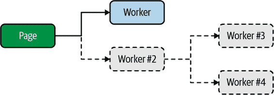

# 第二章：浏览器

JavaScript 并不像大多数其他编程语言那样有一个独特的、定制的实现。例如，使用 Python 时，你可能会运行语言维护者提供的 Python 二进制文件。而 JavaScript 则有许多不同的实现。这包括随不同网络浏览器一起提供的 JavaScript 引擎，如 Chrome 中的 V8，Firefox 中的 SpiderMonkey，以及 Safari 中的 JavaScriptCore。V8 引擎也被 Node.js 在服务器端使用。

这些独立的实现每个都从实现 ECMAScript 规范的某种近似开始。正如我们经常需要参考的兼容性表所示，不是每个引擎都以相同的方式实现 JavaScript。当然，浏览器供应商尝试以相同的方式实现 JavaScript 功能，但是错误确实会发生。在语言层面上，已经提供了一些并发原语，详细内容请参见第四章和第五章。

在每种实现中还添加了其他 API，以使可运行的 JavaScript 更加强大。本章完全侧重于现代网络浏览器提供的多线程 API，其中最易于使用的是 Web Worker。

使用这些工作者线程有许多好处，特别适用于浏览器的一个好处是，通过将 CPU 密集型工作分配到单独的线程中，主线程可以更多地专注于渲染 UI。这有助于实现比传统方式更流畅、更用户友好的体验。

# 专用工作者

Web Worker 允许你生成一个新的执行 JavaScript 的环境。以这种方式执行的 JavaScript 可以在与生成它的 JavaScript 不同的线程中运行。这两个环境之间通过称为*消息传递*的模式进行通信。请记住，JavaScript 是单线程的。Web Worker 与这种特性很好地协作，并通过事件循环触发函数运行。

JavaScript 环境有可能生成多个 Web Worker，并且给定的 Web Worker 可以自由生成更多的 Web Worker。不过，如果你发现自己在生成大量 Web Worker 层次结构时，可能需要重新评估你的应用程序。

Web Worker 有多种类型，其中最简单的是专用工作者。

## 专用工作者 Hello World

学习新技术的最佳方法是实际应用它。你正在构建的页面与工作者之间的关系显示在图 2-1 中。在这种情况下，你将只创建一个工作者，但也可以实现工作者层次结构。



###### 图 2-1 专用工作者关系

首先，创建一个名为 *ch2-web-workers/* 的目录。你将在其中保留这个项目所需的三个示例文件。接下来，在该目录中创建一个 *index.html* 文件。在浏览器中运行的 JavaScript 需要先被网页加载，而这个文件代表了该网页的基础。将 Example 2-1 的内容添加到此文件以启动项目。

##### 示例 2-1\. *ch2-web-workers/index.html*

```
<html>
  <head>
    <title>Web Workers Hello World</title>
    <script src="main.js"></script>
  </head>
</html>
```

如您所见，这个文件非常基础。它所做的只是设置一个标题并加载一个名为 *main.js* 的单个 JavaScript 文件。本章的其余部分遵循类似的模式。更有趣的部分在于 *main.js* 文件的内容。

实际上，现在创建 *main.js* 文件，并将 Example 2-2 的内容添加到其中。

##### 示例 2-2\. *ch2-web-workers/main.js*

```
console.log('hello from main.js');

const worker = new Worker('worker.js'); 

worker.onmessage = (msg) => { 
  console.log('message received from worker', msg.data);
};

worker.postMessage('message sent to worker'); 

console.log('hello from end of main.js');
```


实例化一个新的专用 worker。


为 worker 附加一个消息处理程序。


向 worker 传递消息。

此文件的第一步是调用`console.log()`。这是为了明确文件执行的顺序。接下来要做的是实例化一个新的专用 worker。通过调用`new Worker(*filename*)`来完成。一旦调用，JavaScript 引擎将在后台开始下载（或缓存查找）适当的文件。

接下来，为 worker 的 `message` 事件附加一个处理程序。通过将函数分配给专用 worker 的 `.onmessage` 属性来完成。当接收到消息时，该函数将被调用。提供给函数的参数是 `MessageEvent` 的一个实例。它带有许多属性，但最有趣的是 `.data` 属性。这代表了从专用 worker 返回的对象。

最后，调用专用 worker 的 `.postMessage()` 方法。这是实例化专用 worker 的 JavaScript 环境与专用 worker 通信的方式。在本例中，传递了一个基本字符串到专用 worker。对于可以传递到此方法的数据类型有所限制；请参阅附录（app01.xhtml#app_sca）获取更多详情。

现在，您的主 JavaScript 文件已经完成，可以创建在专用 worker 内执行的文件。创建一个名为 *worker.js* 的新文件，并将 Example 2-3 的内容添加到其中。

##### 示例 2-3\. *ch2-web-workers/worker.js*

```
console.log('hello from worker.js');

self.onmessage = (msg) => {
  console.log('message from main', msg.data);

  postMessage('message sent from worker');
};
```

在这个文件中，定义了一个名为`onmessage`的全局函数，并将一个函数分配给它。在专用 worker 内部，当从专用 worker 外部调用`worker.postMessage()`方法时，会调用此`onmessage`函数。此赋值也可以写为`onmessage =`或甚至`var onmessage =`，但使用`const onmessage =`或`let onmessage =`，甚至声明`function onmessage`都不起作用。`self`标识符是在专用 worker 内部的`globalThis`的别名，在那里通常的`window`不可用。

在`onmessage`函数内部，代码首先打印从专用 worker 外部接收到的消息。之后，它调用`postMessage()`全局函数。此方法接受一个参数，然后通过触发专用 worker 的`onmessage()`方法将参数提供给调用环境。关于消息传递和对象克隆的规则在这里也适用。同样，示例现在只是使用一个简单的字符串。

当加载专用 worker 脚本文件时还有一些额外的规则。加载的文件必须与主 JavaScript 环境运行的同一起源。此外，浏览器不允许在使用`file://`协议运行 JavaScript 时运行专用 worker，这是一种说法，简单地说，你不能简单地双击*index.html*文件查看应用程序运行。相反，你需要从 Web 服务器运行你的应用程序。幸运的是，如果你安装了最新的 Node.js，你可以运行以下命令在本地启动一个非常基本的 Web 服务器：

```
$ npx serve .
```

执行此命令后，将启动一个服务器，用于托管来自本地文件系统的文件。它还显示服务器可用的 URL。通常情况下，该命令输出以下 URL，假设端口是空闲的：

```
http://localhost:5000
```

将提供给你的任何 URL 复制并在 Web 浏览器中打开。当页面首次打开时，你可能会看到一个普通的白屏。但这并不是问题，因为所有的输出都显示在 Web 开发者控制台中。不同的浏览器以不同的方式提供控制台，但通常你可以右键点击背景的某个地方并选择检查菜单选项，或者按下 Ctrl+Shift+I（或 Cmd-Shift-I）打开检查器。一旦进入检查器，点击控制台选项卡，然后刷新页面，以防万一未捕获到任何控制台消息。完成这些步骤后，你应该看到显示在 Table 2-1 中的消息。

Table 2-1\. 示例控制台输出

| 日志 | 位置 |
| --- | --- |
| 来自 main.js 的 hello | main.js:1:9 |
| 来自 main.js 末尾的 hello | main.js:11:9 |
| 来自 worker.js 的 hello | worker.js:1:9 |
| 来自主程序的消息，发送给 worker 的消息 | worker.js:4:11 |
| 来自 worker 的消息，发送给 worker 的消息 | main.js:6:11 |

这个输出确认了消息执行的顺序，尽管它并不完全是确定性的。首先，加载*main.js*文件，并打印其输出。然后实例化和配置工作者，调用其`postMessage()`方法，最后打印最后一条消息。接下来，运行*worker.js*文件，并调用其消息处理程序，打印一条消息。然后调用`postMessage()`将消息发送回*main.js*。最后，在*main.js*中调用专用工作者的`onmessage`处理程序，并打印最后的消息。

## 高级专用工作者用法

现在您已经熟悉专用工作者的基础知识，可以开始使用一些更复杂的功能了。

当您处理不涉及专用工作者的 JavaScript 时，您最终加载的所有代码都可在同一领域中使用。加载新的 JavaScript 代码可以通过使用`<script>`标签加载脚本，或通过发出 XHR 请求并使用带有表示代码的字符串的`eval()`函数来完成。在涉及专用工作者时，您无法将`<script>`标签注入 DOM，因为与工作者关联的 DOM 不存在。

相反，您可以使用`importScripts()`函数，该函数仅在 Web 工作者中可用。此函数接受一个或多个参数，表示要加载的脚本路径。这些脚本将从与网页相同的源加载。这些脚本以同步方式加载，因此在函数调用后运行的代码将在脚本加载后运行。

`Worker`的实例继承自`EventTarget`，并具有一些用于处理事件的通用方法。但是，`Worker`类提供了实例上最重要的方法。以下是这些方法的列表，其中一些您已经使用过，一些是新的：

`worker.postMessage(msg)`

这会向工作者发送一条消息，在调用`self.onmessage`函数之前由事件循环处理，传递`msg`参数。

`worker.onmessage`

如果分配了，它将在工作者内部调用`self.postMessage`函数时调用。

`worker.onerror`

如果分配了，当工作者内部抛出错误时将调用它。将提供一个单一的`ErrorEvent`参数，具有`.colno`、`.lineno`、`.filename`和`.message`属性。此错误将冒泡，除非您调用`err.preventDefault()`。

`worker.onmessageerror`

如果分配了，当工作者接收到无法反序列化的消息时将调用此函数。

`worker.terminate()`

如果被调用，工作者将立即终止。将来对`worker.postMessage()`的调用将静默失败。

在专用工作线程内部，全局变量`self`是`WorkerGlobalScope`的一个实例。最显著的新增功能是`importScripts()`函数，用于注入新的 JavaScript 文件。一些高级通信 API，如`XMLHttpRequest`、`WebSocket`和`fetch()`可用。一些有用的函数，虽然不一定是 JavaScript 的一部分，但由每个主要引擎重新构建，如`setTimeout()`、`setInterval()`、`atob()`和`btoa()`，也是可用的。两个数据存储 API，`localStorage`和`indexedDB`，同样可用。

至于缺失的 API，您需要实验并查看您能访问的内容。通常情况下，修改全局状态的 API 在专用工作线程中是不可用的。在主 JavaScript 领域中，全局的`location`可用，是`Location`的一个实例。在专用工作线程内部，`location`也是可用的，但是是`WorkerLocation`的一个实例，有些不同，显著缺少了可以引发页面刷新的`.reload()`方法。全局的`document`也是不可用的，这是访问页面 DOM 的 API。

在实例化专用工作线程时，可以选择性地使用第二个参数来指定工作线程的选项。实例化的签名如下：

```
const worker = new Worker(filename, options);
```

`options`参数是一个对象，可以包含以下列出的属性：

`type`

可以是`classic`（默认），表示经典的 JavaScript 文件，或者`module`，表示 ECMAScript 模块（ESM）。

`credentials`

这个值确定了是否将 HTTP 凭据发送到获取工作线程文件的请求中。该值可以是`omit`（排除凭据），`same-origin`（发送凭据，但仅当来源匹配时），或`include`（始终发送凭据）。

`name`

这个名称是指一个专用的工作线程，通常用于调试。在工作线程中作为全局命名的值为`name`。

# 共享工作线程

*共享工作线程*是另一种 Web 工作线程类型，但其特殊之处在于可以被不同的浏览器环境访问，例如不同的窗口（标签页）、跨 iframe 甚至来自不同 Web 工作线程。它们在工作线程内部还有一个不同的`self`，是`SharedWorkerGlobalScope`的一个实例。共享工作线程只能被同源的 JavaScript 访问。例如，运行在*http://localhost:5000*上的窗口无法访问运行在*http://google.com:80*上的共享工作线程。

###### 警告

Safari 当前已禁用共享工作线程，至少从 2013 年起如此，这无疑会影响该技术的采用。

在深入编码之前，考虑几个要点是很重要的。一个让共享工作者有些难以理解的因素是，它们并不一定附属于特定的窗口（环境）。当然，它们最初是由特定窗口生成的，但之后它们可能“属于”多个窗口。这意味着当第一个窗口关闭时，共享工作者仍然存在。

###### 提示

由于共享工作者不属于特定的窗口，一个有趣的问题是`console.log`输出应该去哪里？截至 Firefox v85，输出与生成共享工作者的第一个窗口关联。打开另一个窗口，第一个窗口仍然接收日志。关闭第一个窗口，日志现在不可见。打开另一个窗口，历史日志将显示在最新的窗口中。另一方面，Chrome v87 不显示共享工作者的日志。调试时请记住这一点。

共享工作者可用于保存半持久状态，在其他窗口连接到它时保持状态。例如，如果 Window 1 告诉共享工作者写入一个值，那么 Window 2 可以要求共享工作者将该值读回。刷新 Window 1，该值仍然保持。刷新 Window 2，它也保持不变。关闭 Window 1，它仍然保持。然而，一旦关闭或刷新仍在使用共享工作者的最后一个窗口，状态将丢失，并且共享工作者脚本将再次被评估。

###### 警告

一个共享工作者的 JavaScript 文件在多个窗口使用时会被缓存；刷新页面不一定会重新加载您的更改。相反，您需要关闭其他打开的浏览器窗口，然后刷新剩余的窗口，以便让浏览器运行您的新代码。

记住这些注意事项后，您现在可以构建一个使用共享工作者的简单应用程序了。

## 共享工作者你好世界

一个共享工作者基于其在当前源中的位置进行“键控”。例如，在本示例中，您将使用的共享工作者位于类似*http://localhost:5000/shared-worker.js*的某个位置。无论工作者是从位于*/red.html*、*/blue.html*或甚至*/foo/index.html*的 HTML 文件加载，共享工作者实例始终保持不变。有一种方法可以使用相同的 JavaScript 文件创建不同的共享工作者实例，这在“高级共享工作者用法”中有所介绍。

您正在构建的页面与工作者之间的关系显示在 Figure 2-2 中。


###### Figure 2-2\. 共享工作者关系

现在，是时候创建一些文件了。例如，创建一个名为*ch2-shared-workers/*的目录，并且所有必需的文件都将驻留在这个目录中。完成这些步骤后，创建一个包含内容的 HTML 文件，内容在 Example 2-4 中。

##### Example 2-4\. *ch2-shared-workers/red.html*

```
<html>
  <head>
    <title>Shared Workers Red</title>
    <script src="red.js"></script>
  </head>
</html>
```

与您在前一节中创建的 HTML 文件非常类似，这个文件只设置了一个标题并加载了一个 JavaScript 文件。完成后，创建另一个 HTML 文件，其中包含示例 2-5 中的内容。

##### 示例 2-5\. *ch2-shared-workers/blue.html*

```
<html>
  <head>
    <title>Shared Workers Blue</title>
    <script src="blue.js"></script>
  </head>
</html>
```

对于本例子，您将使用两个单独的 HTML 文件进行操作，每个文件代表一个新的 JavaScript 环境，这些环境将在同一个源上可用。从技术上讲，您可以在两个窗口中重复使用同一个 HTML 文件，但我们希望非常明确地指出，状态不会与 HTML 文件或*red*/*blue* JavaScript 文件相关联。

接下来，您准备好创建第一个 JavaScript 文件，直接由 HTML 文件加载。创建一个包含示例 2-6 内容的文件。

##### 示例 2-6\. *ch2-shared-workers/red.js*

```
console.log('red.js');

const worker = new SharedWorker('shared-worker.js'); 

worker.port.onmessage = (event) => { 
  console.log('EVENT', event.data);
};
```


实例化共享工作者。


注意通信的`worker.port`属性。

这个 JavaScript 文件相当基础。它的作用是通过调用`new SharedWorker()`来实例化一个共享工作者实例。然后，它添加了一个处理来自共享工作者发出的消息事件的处理程序。当接收到消息时，它简单地将其打印到控制台上。

与调用`.onmessage`直接与`Worker`实例不同，您将利用`.port`属性与`SharedWorker`实例进行通信。

接下来，复制粘贴您在示例 2-6 中创建的*red.js*文件，并将其命名为*blue.js*。更新`console.log()`调用以打印*blue.js*；否则，内容将保持不变。

最后，创建一个*shared-worker.js*文件，其中包含示例 2-7 中的内容。这是大部分魔法发生的地方。

##### 示例 2-7\. *ch2-shared-workers/shared-worker.js*

```
const ID = Math.floor(Math.random() * 999999); 
console.log('shared-worker.js', ID);

const ports = new Set(); 

self.onconnect = (event) => { 
  const port = event.ports[0];
  ports.add(port);
  console.log('CONN', ID, ports.size);

  port.onmessage = (event) => { 
    console.log('MESSAGE', ID, event.data);

    for (let p of ports) { 
      p.postMessage([ID, event.data]);
    }
  };
};
```


用于调试的随机 ID。


端口的单例列表。


连接事件处理程序。


收到新消息时的回调。


消息被分派到每个窗口。

该文件中的第一件事是生成一个随机的 ID 值。这个值被打印在控制台上，稍后传递给调用 JavaScript 环境。在实际应用中，这并不特别有用，但它很好地证明了状态的保留和处理共享工作者时状态的丢失。

接下来，创建一个名为`ports`的单例`Set`。^(1) 这将包含所有向工作者提供的端口的列表。窗口中可用的`worker.port`和服务工作者中提供的`port`都是`MessagePort`类的实例。

最终发生在这个共享工作者文件的外部作用域的事情是建立了一个`connect`事件的监听器。每当 JavaScript 环境创建一个引用这个共享工作者的`SharedWorker`实例时，就会调用这个函数。当这个监听器被调用时，会传入一个`MessageEvent`实例作为参数。

`connect`事件有几个可用的属性，但最重要的是`ports`属性。这个属性是一个包含一个元素的数组，这个元素是一个引用了允许与调用 JavaScript 环境通信的`MessagePort`实例。这个特定的端口然后被添加到`ports`集合中。

也会为端口附加一个`message`事件的事件监听器。就像你之前在`Worker`实例中使用的`onmessage`方法一样，当外部 JavaScript 环境之一调用适用的`.postMessage()`方法时，会调用这个方法。当接收到消息时，代码会打印出 ID 值和接收到的数据。

事件监听器还会将消息分发回调用环境。它通过迭代`ports`集合来实现这一点，对遇到的每个端口调用`.postMessage()`方法。由于这个方法只接受一个参数，因此传入一个数组以模拟多个参数。这个数组的第一个元素再次是 ID 值，第二个元素是传入的数据。

如果你之前使用过 Node.js 来处理 WebSocket，那么这种代码模式可能会感觉很熟悉。在大多数流行的 WebSocket 包中，当建立连接时会触发一个事件，然后可以给连接参数附加一个消息监听器。

此时，你已经准备好再次测试你的应用程序了。首先，在你的*ch2-shared-workers/*目录下运行以下命令，然后复制粘贴显示的 URL：

```
$ npx serve .
```

再次，在我们的情况下，我们得到的 URL 是*http://localhost:5000*。不过这次，你不会直接打开这个 URL，而是首先打开浏览器中的 Web 检查器，然后打开修改过的 URL 版本。

切换到你的浏览器并打开一个新标签页。如果这会打开你的主页、空白标签页或者你的默认页面，都没关系。然后再次打开 Web 检查器并导航到控制台选项卡。完成这些操作后，粘贴给你的 URL，但修改它以打开*/red.html*页面。你输入的 URL 可能看起来像这样：

```
http://localhost:5000/red.html
```

按 Enter 键打开页面。`serve`包可能会将你的浏览器从*/red.html*重定向到*/red*，但这没关系。

页面加载完成后，你应该会看到 Table 2-2 中列出的消息显示在你的控制台中。如果在加载页面后打开检查器，可能看不到任何日志，不过这样做后刷新页面应该可以显示日志。请注意，目前只有 Firefox 能显示 *shared-worker.js* 生成的消息。

Table 2-2\. 第一个窗口控制台输出

| 日志 | 位置 |
| --- | --- |
| red.js | red.js:1:9 |
| shared-worker.js 278794 | shared-worker.js:2:9 |
| CONN 278794 1 | shared-worker.js:9:11 |

在我们的情况下，我们可以看到 *red.js* 文件已执行，此特定 *shared-worker.js* 实例生成了 ID 278794，并且当前只有一个窗口连接到该共享 Worker。

接下来，打开另一个浏览器窗口。同样，先打开 Web 检查器，切换到控制台选项卡，粘贴由 `serve` 命令提供的基本 URL，然后在 URL 的末尾添加 */blue.html*。在我们的情况下，URL 看起来是这样的：

```
http://localhost:5000/blue.html
```

按 Enter 键打开该网址。页面加载后，你应该只会在控制台输出中看到一条消息，说明 *blue.js* 文件已执行。此时还不太有趣。但是切换回你之前打开的 *red.html* 页面的窗口，你应该会看到 Table 2-3 中新增加的日志。

Table 2-3\. 第一个窗口控制台输出，继续

| 日志 | 位置 |
| --- | --- |
| CONN 278794 2 | shared-worker.js:9:11 |

现在事情开始变得有些令人兴奋。共享 Worker 环境现在有两个指向两个独立窗口的 `MessagePort` 实例的引用。同时，两个窗口都有指向同一个共享 Worker 的 `MessagePort` 实例的引用。

现在你已准备好从一个窗口向共享 Worker 发送消息了。切换到控制台窗口，并输入以下命令：

```
worker.port.postMessage('hello, world');
```

按 Enter 键执行该行 JavaScript。你应该会在第一个控制台中看到来自共享 Worker 的消息，来自 *red.js* 的第一个控制台消息，以及第二个窗口控制台中来自 *blue.js* 的消息。在我们的情况下，我们看到的输出列在 Table 2-4 中。

Table 2-4\. 第一个和第二个窗口控制台输出

| 日志 | 位置 | 控制台 |
| --- | --- | --- |
| MESSAGE 278794 你好，世界 | shared-worker.js:12:13 | 1 |
| EVENT Array [ 278794, “你好，世界” ] | red.js:6:11 | 1 |
| EVENT Array [ 278794, “你好，世界” ] | blue.js:6:11 | 2 |

在此时，你已成功地从一个窗口中的 JavaScript 环境发送了一条消息到共享 Worker 中的 JavaScript 环境，并且从 Worker 中传递了一条消息到两个单独的窗口。

## 高级共享 Worker 使用

共享工作器遵循与附录中描述的相同对象克隆规则。而且，与专用工作器类似，共享工作器也可以使用`importScripts()`函数来加载外部 JavaScript 文件。截至 Firefox v85/Chrome v87 版本，你可能会发现 Firefox 更方便调试共享工作器，因为共享工作器中的`console.log()`输出是可用的。

共享工作器实例确实可以访问`connect`事件，可以使用`self.onconnect()`方法处理。值得注意的是，如果你熟悉 WebSocket，可能会错过`disconnect`或`close`事件。

当涉及创建`port`实例的单例集合时，就像本节示例代码中的情况一样，很容易造成内存泄漏。在这种情况下，只需不断刷新其中一个窗口，每次刷新都会向集合添加一个新条目。

这远非理想。为了解决这个问题，你可以在主要的 JavaScript 环境（例如，*red.js* 和 *blue.js*）中添加事件监听器，当页面被卸载时触发。让这个事件监听器向共享工作器传递特殊消息。在共享工作器内部，当接收到消息时，将端口从端口列表中移除。以下是如何实现的示例：

```
// main JavaScript file
window.addEventListener('beforeunload', () => {
  worker.port.postMessage('close');
});

// shared worker
port.onmessage = (event) => {
  if (event.data === 'close') {
    ports.delete(port);
    return;
  }
};
```

不幸的是，仍然存在端口仍然保留的情况。如果`beforeunload`事件未触发，或者在触发时发生错误，或者页面以意外方式崩溃，这可能导致共享工作器中的过期端口引用保留。

更健壮的系统还需要共享工作器定期“ping”调用环境，通过`port.postMessage()`发送特殊消息，并让调用环境回复。通过这种方法，如果在一定时间内未收到回复，共享工作器可以删除端口实例。但即使是这种方法也不完美，因为慢速的 JavaScript 环境可能导致长时间的响应时间。幸运的是，与不再具有有效 JavaScript 关联的端口交互没有太多副作用。

`SharedWorker`类的完整构造函数如下所示：

```
const worker = new SharedWorker(filename, nameOrOptions);
```

签名与实例化`Worker`实例时略有不同，特别是第二个参数可以是一个选项对象，也可以是工作器的名称。与`Worker`实例类似，工作器的名称在工作器内部作为`self.name`可用。

此时你可能想知道它是如何工作的。例如，可以在*red.js*中声明共享工作器，命名为“红色工作器”，在*blue.js*中命名为“蓝色工作器”？在这种情况下，将创建两个*独立*的工作器，每个都有不同的全局环境、不同的 ID 值和适当的`self.name`。

你可以将这些共享的工作实例视为不仅仅由它们的 URL，还由它们的名称“键控”的。这可能是为什么在 `Worker` 和 `SharedWorker` 之间签名变化如此大的原因。

除了能够用字符串名称替换选项参数之外，`SharedWorker` 的选项参数与 `Worker` 完全相同。

在这个例子中，你只创建了一个 `SharedWorker` 实例并分配给 `worker`，但是并没有阻止你创建多个实例。事实上，你甚至可以创建多个指向同一实例的共享工作者，只要 URL 和名称匹配。当发生这种情况时，两个 `SharedWorker` 实例的 `.port` 属性都能接收消息。

这些 `SharedWorker` 实例确实能够在页面加载之间保持状态。你已经这样做了，`ID` 变量保存了一个唯一的数字，`ports` 包含了一个端口列表。即使通过刷新，只要一个窗口保持打开，这种状态也会持续存在，就像你先刷新 *blue.html* 页面，然后再刷新 *red.html* 页面一样。但是，如果同时刷新两个页面，关闭一个并刷新另一个，或者两个页面都关闭，这种状态将会丢失。在下一节中，你将使用一种技术，即使连接的窗口关闭，也能继续保持状态和运行代码。

# Service Workers

*Service worker* 作为一种类似代理的功能存在于运行在浏览器中的一个或多个网页和服务器之间。因为一个服务工作者不仅与单个网页关联，而是可能与多个页面相关，它更类似于共享工作者而不是专用工作者。它们甚至以与共享工作者相同的方式“键控”。但是，服务工作者可以存在并在后台运行，即使页面并不一定还在打开状态。因此，你可以将专用工作者视为与一个页面关联，将共享工作者视为与一个或多个页面关联，但将服务工作者视为与零个或多个页面关联。但共享工作者并不会奇迹般地自动生成。相反，它确实需要首先打开一个网页来安装共享工作者。

服务工作者主要用于执行网站或单页面应用程序的缓存管理。 当网络请求发送到服务器时，它们最常被调用，其中服务工作者内的事件处理程序拦截网络请求。 服务工作者的闻名之处在于，当浏览器显示网页但运行它的计算机无法访问网络时，它可以用于返回缓存的资产。 当服务工作者接收到请求时，它可能会查询缓存以找到缓存的资源，向服务器发出请求以检索资源的某种形式，甚至执行重型计算并返回结果。 尽管最后一种选项使其类似于您查看过的其他网络工作者，但您确实不应仅仅为了将 CPU 密集型工作转移到另一个线程而使用服务工作者。

Service workers 暴露的 API 比其他网络工作者更多，尽管它们的主要用例不是为了从主线程卸载重型计算。 Service workers 绝对足够复杂，以至于有专门讲述它们的整本书籍。 话虽如此，因为本书的主要目标是教你关于 JavaScript 多线程能力的知识，我们不会完全覆盖它们。 例如，有一个完整的 Push API 可用于接收从服务器推送到浏览器的消息，但这完全不会被覆盖。

与其他网络工作者类似，服务工作者无法访问 DOM。 它们也不能发出阻塞请求。 例如，将 `XMLHttpRequest#open()` 的第三个参数设置为 `false`，这将阻止代码执行直到请求成功或超时，是不允许的。 浏览器只允许在使用 HTTPS 协议提供的网页上运行服务工作者。 幸运的是，对我们来说有一个显著的例外，即 `localhost` 可以使用 HTTP 加载服务工作者，这样可以简化本地开发。 Firefox 在使用其私密浏览功能时不允许服务工作者。 然而，Chrome 在使用其隐身功能时允许服务工作者。 也就是说，服务工作者实例无法在普通窗口和隐身窗口之间通信。

Firefox 和 Chrome 的检查器中都有一个包含 Service Workers 部分的应用程序面板。 您可以使用此功能查看与当前页面关联的任何服务工作者，并执行一个非常重要的开发操作：取消注册它们，这基本上允许您将浏览器状态重置到注册工作者之前的状态。 不幸的是，到目前为止的浏览器版本，这些浏览器面板并不提供进入服务工作者的 JavaScript 检查器的方式。

现在您已经了解了一些服务工作者的要点，您可以准备好开始构建一个了。

## 服务工作者 Hello World

在本节中，您将构建一个非常基本的服务工作者，该工作者拦截从基本网页发送的所有 HTTP 请求。大多数请求将不经过修改地传递到服务器。但是，对特定资源的请求将返回由服务工作者自身计算的值。大多数服务工作者将进行大量的缓存查找，但是再次强调，目标是展示多线程角度的服务工作者。

你将再次需要的第一个文件是 HTML 文件。创建一个名为*ch2-service-workers/*的新目录。然后，在这个目录中，创建一个文件，其内容来自示例 2-8。

##### 示例 2-8\. *ch2-service-workers/index.html*

```
<html>
  <head>
    <title>Service Workers Example</title>
    <script src="main.js"></script>
  </head>
</html>
```

这是一个非常基本的文件，只是加载应用程序的 JavaScript 文件，接下来是它。创建一个名为*main.js*的文件，并将内容添加到示例 2-9 中。

##### 示例 2-9\. *ch2-service-workers/main.js*

```
navigator.serviceWorker.register('/sw.js', { 
  scope: '/'
});

navigator.serviceWorker.oncontrollerchange = () => { 
  console.log('controller change');
};

async function makeRequest() { 
  const result = await fetch('/data.json');
  const payload = await result.json();
  console.log(payload);
}
```


注册服务工作者并定义范围。


监听`controllerchange`事件。


初始化请求的功能。

现在事情开始变得有趣起来了。在这个文件中，首先创建了服务工作者。与你之前接触的其他网络工作者不同，你没有使用构造函数的`new`关键字。相反，这段代码依赖于`navigator.serviceWorker`对象来创建工作者。第一个参数是作为服务工作者的 JavaScript 文件的路径。第二个参数是一个可选的配置对象，支持一个名为`scope`的属性。

`scope`表示当前起源目录的目录，在其中加载的任何 HTML 页面都将通过服务工作者的请求传递。默认情况下，`scope`值与加载服务工作者的目录相同。在这种情况下，*/ *值相对于* index.html *目录，并且因为* sw.js *位于相同目录中，我们可以省略范围，并且它将表现得完全相同。

一旦服务工作者已安装到页面上，所有外发的 HTTP 请求都将通过服务工作者发送。这包括发送到不同源的请求。由于此页面的范围设置为起始目录，此起源中打开的任何 HTML 页面都必须通过服务工作者来获取资源。如果`scope`设置为*/foo*，那么在*/bar.html*打开的页面将不受服务工作者的影响，但在*/foo/baz.html*打开的页面将受到影响。

接下来发生的事情是将一个监听器添加到`navigator.serviceWorker`对象的`controllerchange`事件上。当此监听器触发时，将在控制台打印一条消息。这条消息仅用于调试，用于当服务工作者控制已加载的页面并且该页面在工作者的范围内时。

最后，定义了一个名为`makeRequest()`的函数。此函数向*/data.json*路径发出`GET`请求，将响应解码为 JavaScript 对象表示法（JSON），并打印结果。正如你可能已经注意到的，这个函数没有任何引用。相反，稍后您将手动在控制台中运行它以测试功能性。

有了这个文件，现在你可以准备创建服务工作者本身了。创建第三个名为*sw.js*的文件，并将 Example 2-10 中的内容添加到其中。

##### 示例 2-10\. *ch2-service-workers/sw.js*

```
let counter = 0;

self.oninstall = (event) => {
  console.log('service worker install');
};

self.onactivate = (event) => {
  console.log('service worker activate');
  event.waitUntil(self.clients.claim()); 
};

self.onfetch = (event) => {
  console.log('fetch', event.request.url);

  if (event.request.url.endsWith('/data.json')) {
    counter++;
    event.respondWith( 
      new Response(JSON.stringify({counter}), {
        headers: {
          'Content-Type': 'application/json'
        }
      })
    );
    return;
  }

  // fallback to normal HTTP request
  event.respondWith(fetch(event.request)); 
};
```


允许服务工作者声明已打开的*index.html*页面。


重写了对*/data.json*请求的处理。


其他的 URL 将回退到正常的网络请求。

在这个文件中发生的第一件事是将一个全局变量`counter`初始化为零。稍后，当拦截某些类型的请求时，该数字将增加。这只是一个示例，证明服务工作者正在运行；在真实的应用程序中，您永远不应该以这种方式存储旨在持久存在的状态。事实上，预期任何服务工作者会以难以预测且因浏览器实现而异的方式频繁启动和停止。

之后，我们通过将函数分配给`self.oninstall`来创建`install`事件的处理程序。当这个版本的服务工作者在浏览器中第一次安装时，此函数将运行。大多数实际应用程序将在此阶段执行实例化工作。例如，`self.caches`中有一个可用于配置存储网络请求结果的缓存的对象。但是，由于这个基本应用程序在实例化方面没有太多要做的事情，它只是打印一条消息并完成。

接下来是处理`activate`事件的函数。当引入服务工作者的新版本时，此事件非常有用，用于执行清理工作。对于真实世界的应用程序，它可能会执行类似于拆除旧缓存版本的工作。

在这种情况下，`activate` 处理程序函数正在调用 `self.clients.claim()` 方法。调用这个方法允许最初创建 service worker 的页面实例（即首次打开的 *index.html* 页面）受 service worker 控制。如果没有这行代码，第一次加载页面时页面将不受 service worker 控制。然而，刷新页面或在另一个标签中打开 *index.html* 将允许该页面受到控制。

调用 `self.clients.claim()` 的返回一个 promise。遗憾的是，在 service worker 中使用的事件处理函数不是异步函数，无法 `await` promise。然而，`event` 参数是一个带有 `.waitUntil()` 方法的对象，它可以与 promise 一起使用。一旦提供给该方法的 promise 解析完成，它将允许 `oninstall` 和 `onactivate`（以及后来的 `onfetch`）处理程序完成。如果不调用该方法，就像在 `oninstall` 处理程序中一样，一旦函数退出，这一步被认为已经完成。

最后一个事件处理程序是 `onfetch` 函数。这是最复杂的处理程序，也是 service worker 生命周期中被调用最频繁的一个。每当由 service worker 控制的网页进行网络请求时，都会调用该处理程序。它被称为 `onfetch` 是为了表明它与浏览器中的 `fetch()` 函数相关，尽管这几乎是一个误称，因为任何网络请求都将通过它。例如，如果稍后向页面添加图像标签，则该请求也会触发 `onfetch`。

这个函数首先记录一条消息以确认它正在运行，并打印正在请求的 URL。还可以获取有关请求资源的其他信息，例如标头和 HTTP 方法。在实际应用程序中，这些信息可以用于与缓存进行查询，看看资源是否已经存在。例如，可以从缓存中提供当前源内资源的 `GET` 请求，但如果不存在，可以使用 `fetch()` 函数请求，然后将其插入到缓存中，最后返回给浏览器。

这个基本示例只是获取 URL 并检查它是否为以 */data.json* 结尾的 URL。如果不是，将跳过 `if` 语句体，并调用函数的最后一行。这行代码只是将请求对象（即 `Request` 的一个实例）传递给 `fetch()` 方法，该方法返回一个 promise，并将该 promise 传递给 `event.respondWith()`。`fetch()` 方法将解析一个对象，该对象将用于表示响应，并提供给浏览器。这本质上是一个非常基本的 HTTP 代理。

然而，回到*/data.json* URL 检查，如果通过了，那么会发生更复杂的情况。在这种情况下，`counter`变量递增，并且从头开始生成新的响应（这是`Response`的一个实例）。在这种情况下，构造了包含`counter`值的 JSON 字符串。这作为`Response`的第一个参数提供，表示响应主体。第二个参数包含有关响应的元信息。在这种情况下，`Content-Type`头部设置为`application/json`，这表明响应是 JSON 负载。

现在，您的文件已经创建，请使用控制台导航到创建它们的目录，并运行以下命令以启动另一个 Web 服务器：

```
$ npx serve .
```

然后，复制提供的网址，在新的网页浏览器窗口中打开检查器，然后粘贴网址以访问页面。您应该在控制台中看到此消息打印出来（可能还有其他消息）：

```
controller change              main.js:6:11
```

接下来，使用上述技术浏览到您的浏览器中安装的服务工作者列表。在检查器中，您应该看到先前记录的消息；具体来说，您应该看到以下两条消息：

```
service worker install         sw.js:4:11
service worker activate        sw.js:8:11
```

接下来，切换回浏览器窗口。在检查器的控制台选项卡中，运行以下代码行：

```
makeRequest();
```

这将运行`makeRequest()`函数，该函数触发当前起源的 HTTP `GET`请求到*/data.json*。完成后，您应该在控制台中看到消息`Object { counter: 1 }`显示出来。该消息是使用服务工作者生成的，并且该请求从未发送到 Web 服务器。如果您切换到检查器的网络选项卡，您应该看到看似正常的请求以获取资源。如果您单击请求，您应该看到它以 200 状态代码回复，并且`Content-Type`头部应设置为`application/json`。就网页而言，它确实执行了一个正常的 HTTP 请求。但您知道更多。

切换回服务工作者检查器控制台。在这里，您应该看到已打印出包含请求详细信息的第三条消息。在我们的机器上，我们得到以下内容：

```
fetch http://localhost:5000/data.json   sw.js:13:11
```

到目前为止，您已成功拦截了来自一个 JavaScript 环境的 HTTP 请求，在另一个环境中执行了一些计算，并将结果返回到主环境。就像其他网络工作者一样，此计算是在单独的线程中完成的，可以并行运行代码。如果服务工作者进行了一些非常耗时和缓慢的计算，那么在等待响应时，网页将可以执行其他操作。

###### 提示

在您的第一个浏览器窗口中，您可能注意到尝试下载*favicon.ico*文件但失败的错误。您可能还想知道为什么共享工作者控制台没有提到此文件。这是因为在窗口首次打开时，它尚未受到服务工作者的控制，因此请求直接通过网络进行，绕过了工作者。调试服务工作者可能会令人困惑，这是需要记住的一个注意事项之一。

现在您已经建立了一个可工作的服务工作者，可以学习一些更高级的功能。

## 高级服务工作者概念

服务工作者只用于执行异步操作。因此，技术上会阻塞读写的`localStorage` API 不可用。然而，异步的`indexedDB` API 是可用的。服务工作者中也禁用了顶层`await`。

在跟踪状态方面，您将主要使用`self.caches`和`indexedDB`。再次强调，将数据存储在全局变量中不会可靠。事实上，在调试服务工作者时，您可能会发现它们偶尔停止运行，此时您无法进入检查器。浏览器有一个按钮允许您重新启动工作者，使您可以再次进入检查器。这种停止和启动会清除全局状态。

浏览器会非常积极地缓存服务工作者脚本。当重新加载页面时，浏览器可能会请求脚本，但除非脚本已更改，否则不会被视为需要替换。Chrome 浏览器确实提供了在重新加载页面时触发脚本更新的功能；要做到这一点，请导航到检查器中的应用程序选项卡，然后点击“服务工作者”，然后点击“重新加载时更新”复选框。

每个服务工作者从其创建之时到可以使用之时都会经历状态变化。通过读取`self.serviceWorker.state`属性，在服务工作者内部可以获得此状态。以下是它经历的各个阶段的列表：

已解析

这是服务工作者的第一个状态。此时文件的 JavaScript 内容已被解析。这更像是一个您在应用程序中可能永远不会遇到的内部状态。

正在安装

安装已经开始但尚未完成。每个工作者版本只会发生一次。这种状态在调用`oninstall`之后，在`event.respondWith()`承诺解决之前处于活动状态。

安装中

此时安装已完成。接下来将调用`onactivate`处理程序。在我的测试中，我发现服务工作者从`安装中`状态跳转到`激活中`状态如此之快，以至于我从未看到`已安装`状态。

激活中

当调用`onactivate`但`event.respondWith()`承诺尚未解决时，会发生这种状态。

已激活

激活已完成，工作者已准备就绪，此时`fetch`事件将被拦截。

冗余

现在，已加载了脚本的更新版本，先前的脚本不再需要。如果工作脚本下载失败、包含语法错误或抛出错误，也会触发这种情况。

从哲学上讲，Service Worker 应被视为一种渐进增强的形式。这意味着如果根本不使用 Service Worker，任何使用它们的网页应仍然正常工作。这一点很重要，因为你可能会遇到不支持 Service Worker 的浏览器，或者安装阶段可能会失败，或者注重隐私的用户可能会完全禁用它们。换句话说，如果你只是想在应用程序中添加多线程功能，则选择其他 Web Worker 之一。

Service Worker 内部使用的全局`self`对象是`ServiceWorkerGlobalScope`的一个实例。其他 Web Worker 中可用的`importScripts()`函数在这个环境中也是可用的。像其他工作者一样，还可以将消息传递到 Service Worker 中，并从中接收消息。同样的`self.onmessage`处理程序可以被分配。也许可以用这种方式向 Service Worker 发出信号，告诉它应执行某种缓存失效操作。再次提醒，通过这种方式传递的消息也受到我们在附录中讨论的相同克隆算法的约束。

在调试 Service Worker 及从浏览器发出的请求时，需要牢记缓存。Service Worker 不仅可以通过编程方式实现你控制的缓存，而且浏览器本身仍然必须处理常规的网络缓存。这意味着从 Service Worker 发送到服务器的请求可能并不总是被服务器接收。因此，请记住`Cache-Control`和`Expires`头，并确保设置有意义的值。

Service Worker 具有比本节介绍的更多功能。Mozilla，Firefox 背后的公司，很友好地建立了一个充满常见策略的菜谱网站，用于构建 Service Worker。如果你考虑在下一个 Web 应用程序中实现 Service Worker，我们建议你查看该网站，地址为[*https://serviceworke.rs*](https://serviceworke.rs)。

Service Worker 以及你看过的其他 Web Worker，确实带来了一些复杂性。幸运的是，有一些方便的库可用，并且可以实现通信模式，使它们的管理变得更加容易。

# 消息传递抽象

本章涵盖的每个 Web Worker 都公开了一个接口，用于将消息传递到另一个 JavaScript 环境，并从中接收消息。这使你能够构建能够在多个核心上同时运行 JavaScript 的应用程序。

然而，到目前为止，你只使用了简单的、刻意构造的示例，传递简单字符串并调用简单函数。当涉及构建更大型应用程序时，传递可扩展的消息并在能够扩展的 Worker 中运行代码将变得至关重要，并简化与 Worker 一起工作时的接口也会减少潜在的错误。

## RPC 模式

到目前为止，你只传递了基本的字符串给 Worker。虽然这对于了解 Web Worker 的功能是可以的，但对于完整的应用程序来说，这并不是一个良好的扩展方式。

例如，假设你有一个 Web Worker，它执行一项单一任务，比如计算从 1 到 1,000,000 的所有平方根的总和。那么，你可以仅调用`postMessage()`给 Worker，不传递参数，然后在`onmessage`处理程序中运行慢速逻辑，并使用 Worker 的`postMessage()`函数发送消息回来。但是如果 Worker 还需要计算斐波那契数列呢？在这种情况下，你可以传入一个字符串，一个是`square_sum`，一个是`fibonacci`。但是如果你需要参数呢？那么，你可以传入`square_sum|1000000`。但如果需要参数类型呢？也许你会得到类似`square_sum|num:1000000`的内容。你可能已经看出我们要说什么了。

RPC（远程过程调用）模式是一种将函数及其参数的表示形式序列化并传递到远程目的地以执行的方法。字符串`square_sum|num:1000000`实际上是我们意外重现的一种 RPC 形式。也许它最终可以转换为类似`squareNum(1000000)`的函数调用，这在[“命令调度器模式”](https://wiki.example.org/ch_browser_sec_libs_sub_cmd)中有所考虑。

还有另一个复杂性，应用程序还需要担心。如果主线程一次只向 Web Worker 发送一个消息，那么当从 Web Worker 返回消息时，你知道它是该消息的响应。但如果同时向 Web Worker 发送多条消息，则很难将响应与消息对应起来。例如，想象一个应用程序同时向 Web Worker 发送两条消息并收到两条响应：

```
worker.postMessage('square_sum|num:4');
worker.postMessage('fibonacci|num:33');

worker.onmessage = (result) => {
  // Which result belongs to which message?
  // '3524578'
  // 4.1462643
};
```

幸运的是，存在一种标准用于传递消息并实现 RPC 模式的方式，可以从中获得灵感。这个标准称为[JSON-RPC](https://jsonrpc.org)，实现起来相当简单。该标准定义了请求和响应对象的 JSON 表示形式作为“通知”对象，一种定义请求中调用方法和参数以及响应中结果的方式，以及关联请求和响应的机制。它甚至支持错误值和请求的批处理。在这个例子中，您将只使用请求和响应。

从我们的示例中获取的两个函数调用，JSON-RPC 版本的请求和响应可能如下所示：

```
// worker.postMessage
{"jsonrpc": "2.0", "method": "square_sum", "params": [4], "id": 1}
{"jsonrpc": "2.0", "method": "fibonacci", "params": [33], "id": 2}

// worker.onmessage
{"jsonrpc": "2.0", "result": "3524578", "id": 2}
{"jsonrpc": "2.0", "result": 4.1462643, "id": 1}
```

在这种情况下，响应消息现在与其请求之间有了明确的关联。

JSON-RPC 旨在使用 JSON 作为消息序列化时的编码，特别是在通过网络发送消息时。事实上，这些`jsonrpc`字段定义了消息所遵循的 JSON-RPC 版本，在网络设置中非常重要。然而，由于 Web 工作者使用结构化克隆算法（在附录中介绍），允许直接传递兼容 JSON 的对象，应用程序可以直接传递对象，而不必支付 JSON 序列化和反序列化的成本。此外，在浏览器中，通信通道的两端都有更严格的控制，因此`jsonrpc`字段可能不那么重要。

有了这些`id`属性，可以关联请求和响应对象，从而可以关联哪个消息与哪个消息相关联。您将在“将所有内容放在一起”中构建一个解决方案来关联这两者。但是，现在，您需要首先确定在收到消息时要调用哪个函数。

## 命令调度模式

虽然 RPC 模式在定义协议方面很有用，但并不一定提供确定接收端执行代码路径的机制。命令调度模式解决了这个问题，提供了一种方式来接收序列化命令，找到适当的函数，然后执行它，可选择传递参数。

这种模式实现起来非常直接，不需要太多的魔法。首先，我们可以假设有两个包含有关代码需要运行的方法或*命令*的相关信息的变量。第一个变量称为`method`，是一个字符串。第二个变量称为`args`，是一个要传递给方法的值数组。假设这些信息已从应用程序的 RPC 层中提取出来。

最终需要运行的代码可能存在于应用程序的不同部分。例如，可能求平方和的代码存放在第三方库中，而斐波那契数列的代码则更为本地化声明。无论代码存放在何处，都希望建立一个单一的存储库，将这些命令映射到需要运行的代码。有几种方法可以实现这一点，例如使用`Map`对象，但由于命令可能相对静态，一个简单的 JavaScript 对象就足够了。

另一个重要概念是，只有已定义的命令才能被执行。如果调用者想要调用一个不存在的方法，应该优雅地生成一个错误，并将其返回给调用者，而不会使 Web Worker 崩溃。虽然参数可以作为数组传递到方法中，但如果参数数组展开为普通函数参数，则接口会更友好。

示例 2-11 展示了一个命令调度器的示例实现，你可以在自己的应用程序中使用。

##### 示例 2-11\. 示例命令调度器

```
const commands = { 
  square_sum(max) {
    let sum = 0;
    for (let i = 0; i < max; i++) sum += Math.sqrt(i);
    return sum;
  },
  fibonacci(limit) {
    let prev = 1n, next = 0n, swap;
    while (limit) {
      swap = prev; prev = prev + next;
      next = swap; limit--;
    }
    return String(next);
  }
};
function dispatch(method, args) {
  if (commands.hasOwnProperty(method)) { 
    return commandsmethod; 
  }
  throw new TypeError(`Command ${method} not defined!`);
}
```


所有支持命令的定义。


检查命令是否存在。


参数展开并调用方法。

此代码定义了一个名为`commands`的对象，其中包含命令调度器支持的全部命令集合。在本例中，代码是内联的，但可以完全正常地（甚至是鼓励地）访问其他地方的代码。

`dispatch()`函数接受两个参数，第一个是方法名，第二个是参数数组。当 Web Worker 接收到代表命令的 RPC 消息时，可以调用此函数。在此函数中，第一步是检查方法是否存在。可以使用`commands.hasOwnProperty()`来实现此目的。这比调用`method in commands`或甚至`commands[method]`更安全，因为你不希望调用非命令属性如`__proto__`。

如果确定命令存在，则将命令参数展开，第一个数组元素为第一个参数，依此类推。然后调用函数并返回调用结果。但如果命令不存在，则会抛出`TypeError`。

这就是你可以创建的最基本的命令调度器。更高级的调度器可能会进行诸如类型检查之类的操作，验证参数是否符合某种基本类型或对象是否符合适当的形状，并在命令方法代码无需执行此类操作时，以通用方式抛出错误。

这两种模式肯定会帮助优化你的应用程序，但接口还可以进一步简化。

## 将所有内容整合在一起

在 JavaScript 应用程序中，我们经常考虑与外部服务进行工作。例如，可能我们会调用数据库或进行 HTTP 请求。当这些操作发生时，我们需要等待响应。理想情况下，我们可以提供回调函数或将此查找视为一个 promise。尽管 Web Worker 消息传递接口并不直接支持这一点，但我们绝对可以手动构建它。

在 Web Worker 内部也希望有一个更对称的接口，或许可以利用异步函数，其中解析的值会自动发送回调用环境，无需在代码中手动调用 `postMessage()`。

在这一节中，您将做到这一点。您将结合 RPC 模式和命令调度模式，最终得到一个界面，使得与 Web Workers 的工作方式与您可能更熟悉的其他外部库类似。这个示例使用了专用 worker，但是同样的事情也可以使用共享 worker 或 service worker 来构建。

首先，在此处创建一个名为 *ch2-patterns/* 的新目录，用于存放您即将创建的文件。在这里，首先创建另一个基本的 HTML 文件，命名为 *index.html*，其中包含 Example 2-12 的内容。

##### Example 2-12\. *ch2-patterns/index.html*

```
<html>
  <head>
    <title>Worker Patterns</title>
    <script src="rpc-worker.js"></script>
    <script src="main.js"></script>
  </head>
</html>
```

这次文件加载了两个 JavaScript 文件。第一个是一个新的库，第二个是主 JavaScript 文件，您现在将创建它。创建一个名为 *main.js* 的文件，并将 Example 2-13 的内容添加到其中。

##### Example 2-13\. *ch2-patterns/main.js*

```
const worker = new RpcWorker('worker.js');

Promise.allSettled([
  worker.exec('square_sum', 1_000_000),
  worker.exec('fibonacci', 1_000),
  worker.exec('fake_method'),
  worker.exec('bad'),
]).then(([square_sum, fibonacci, fake, bad]) => {
  console.log('square sum', square_sum);
  console.log('fibonacci', fibonacci);
  console.log('fake', fake);
  console.log('bad', bad);
});
```

这个文件代表使用这些新设计模式的应用程序代码。首先创建了一个 worker 实例，但不是通过调用到目前为止您一直在使用的 Web Worker 类之一。相反，代码实例化了一个新的 `RpcWorker` 类。这个类即将定义。

之后，通过调用 `worker.exec` 进行四个不同的 RPC 方法调用。第一个是调用 `square_sum` 方法，第二个是调用 `fibonacci` 方法，第三个是调用一个不存在的方法 `fake_method`，第四个是调用一个失败的方法 `bad`。第一个参数是方法的名称，所有后续的参数最终都将作为传递给方法的参数。

`exec` 方法返回一个 promise，如果操作成功则解析，如果操作失败则拒绝。考虑到这一点，每个 promise 都被包装在单独的 `Promise.allSettled()` 调用中。这将运行它们所有，并且一旦每个操作完成（无论成功与否）就继续执行。之后打印每个操作的结果。`allSettled()` 的结果包括一个带有 `status` 字符串属性的对象数组，以及根据成功或失败而有的 `value` 或 `reason` 属性。

接下来，创建一个名为 *rpc-worker.js* 的文件，并将 Example 2-14 的内容添加到其中。

##### 示例 2-14\. *ch2-patterns/rpc-worker.js*（第一部分）

```
class RpcWorker {
  constructor(path) {
    this.next_command_id = 0;
    this.in_flight_commands = new Map();
    this.worker = new Worker(path);
    this.worker.onmessage = this.onMessageHandler.bind(this);
  }
```

文件的第一部分开始了`RpcWorker`类并定义了构造函数。在构造函数中初始化了一些属性。首先，`next_command_id`设置为零。这个值被用作 JSON-RPC 风格的递增消息标识符。这用于关联请求和响应对象。

接下来，一个名为`in_flight_commands`的属性被初始化为一个空的`Map`。这包含以命令 ID 为键的条目，其值包含一个 promise 的 resolve 和 reject 函数。这个映射的大小随着发送到工作线程的并行消息数量的增加而增长，并随着它们对应的消息返回而缩小。

然后，一个专用的工作线程被实例化并分配给`worker`属性。这个类有效地封装了一个`Worker`实例。之后，配置工作线程的`onmessage`处理程序，以调用该类的`onMessageHandler`（在下一段代码中定义）。`RpcWorker`类不扩展`Worker`，因为它实际上不想暴露底层 web worker 的功能，而是创建一个全新的接口。

继续修改文件，将内容从示例 2-15 添加到其中。

##### 示例 2-15\. *ch2-patterns/rpc-worker.js*（第二部分）

```
  onMessageHandler(msg) {
    const { result, error, id } = msg.data;
    const { resolve, reject } = this.in_flight_commands.get(id);
    this.in_flight_commands.delete(id);
    if (error) reject(error);
    else resolve(result);
  }
```

该文件的这一部分定义了`onMessageHandler`方法，当专用工作线程发布消息时运行。这段代码假定从 web worker 传递了类似 JSON-RPC 的消息到调用环境，因此，它首先从响应中提取`result`、`error`和`id`值。

接下来，它查询`in_flight_commands`映射以找到匹配的`id`值，检索适当的拒绝和解析函数，并在此过程中从列表中删除条目。如果提供了`error`值，则认为操作失败，并调用带有错误值的`reject()`函数。否则，使用操作的结果调用`resolve()`函数。请注意，这不支持抛出假值。

对于这个库的生产版本，您还希望为这些操作支持一个超时值。从理论上讲，错误可能以这种方式抛出，或者承诺永远不会在工作线程中解决，调用环境将希望拒绝承诺并清除地图中的数据。否则，应用程序可能会出现内存泄漏。

最后，通过将剩余内容从示例 2-16 添加到其中来完成这个文件。

##### 示例 2-16\. *ch2-patterns/rpc-worker.js*（第三部分）

```
  exec(method, ...args) {
    const id = ++this.next_command_id;
    let resolve, reject;
    const promise = new Promise((res, rej) => {
      resolve = res;
      reject = rej;
    });
    this.in_flight_commands.set(id, { resolve, reject });
    this.worker.postMessage({ method, params: args, id });
    return promise;
  }
}
```

这个文件的最后一部分定义了`exec()`方法，当应用程序想要在 Web Worker 中执行方法时调用该方法。首先发生的是生成一个新的`id`值。接下来，创建了一个 promise，稍后该方法将返回该 promise。将 promise 的`reject`和`resolve`函数从中提取出来，并将它们与`id`值关联添加到`in_flight_commands`映射中。

之后，向 worker 发送了一条消息。传递给 worker 的对象大致遵循 JSON-RPC 的形状。它包含`method`属性，一个`params`属性，该属性是数组中剩余的参数，并包含为此特定命令执行生成的`id`值。

这是一种相当常见的模式，用于将出站异步消息与入站异步消息关联起来。如果需要的话，您可能会发现自己实现类似的模式，比如将消息放入网络队列并稍后接收消息。但是，它确实会有内存影响。

将 RPC 工作文件放在一边后，您可以准备创建最后一个文件。创建一个名为*worker.js*的文件，并将 Example 2-17 的内容添加到其中。

##### 示例 2-17\. *ch2-patterns/worker.js*

```
const sleep = (ms) => new Promise((res) => setTimeout(res, ms)); 

function asyncOnMessageWrap(fn) { 
  return async function(msg) {
    postMessage(await fn(msg.data));
  }
}

const commands = {
  async square_sum(max) {
    await sleep(Math.random() * 100); 
    let sum = 0; for (let i = 0; i < max; i++) sum += Math.sqrt(i);
    return sum;
  },
  async fibonacci(limit) {
    await sleep(Math.random() * 100);
    let prev = 1n, next = 0n, swap;
    while (limit) { swap = prev; prev = prev + next; next = swap; limit--; }
    return String(next); 
  },
  async bad() {
    await sleep(Math.random() * 10);
    throw new Error('oh no');
  }
};

self.onmessage = asyncOnMessageWrap(async (rpc) => { 
  const { method, params, id } = rpc;

  if (commands.hasOwnProperty(method)) {
    try {
      const result = await commandsmethod;
      return { id, result }; 
    } catch (err) {
      return { id, error: { code: -32000, message: err.message }};
    }
  } else {
    return { 
      id, error: {
        code: -32601,
        message: `method ${method} not found`
      }
    };
  }
});
```


向方法添加人为减速。


一个基本的包装器，将`onmessage`转换为异步函数。


人为随机减速添加到命令中。


`BigInt`结果被强制转换为 JSON 友好的字符串值。


注入了`onmessage`包装器。


一个成功的类 JSON-RPC 消息在成功时被解析。


如果方法不存在，则会拒绝错误的类 JSON-RPC 消息。

这个文件有很多内容。首先，`sleep`函数只是`setTimeout()`的一个等价的 promise 版本。`asyncOnMessageWrap()`是一个函数，可以包装一个`async`函数并分配`onmessage`处理程序。这是一个便利的功能，可以提取传入消息的数据属性，将其传递给函数，等待结果，然后将结果传递给`postMessage()`。

之后，之前的`commands`对象已经回来了。不过，这一次添加了人为的超时，并且将函数改为了`async`函数。这使得这些方法能够模拟一个否则缓慢的异步过程。

最后，使用包装函数分配 `onmessage` 处理程序。其中的代码获取传入的类似 JSON-RPC 的消息，并提取 `method`、`params` 和 `id` 属性。与之前类似，会查阅命令集合以查看是否存在该方法。如果不存在，则返回类似 JSON-RPC 的错误。值 `-32601` 是 JSON-RPC 定义的魔数，表示不存在的方法。当命令存在时，执行命令方法，然后将解析的值强制转换为类似 JSON-RPC 的成功消息并返回。如果命令抛出异常，则返回不同的错误，使用另一个 JSON-RPC 魔数 `-32000`。

创建文件后，切换到浏览器并打开检查器。然后，从 *ch2-patterns/* 目录中使用以下命令再次启动 Web 服务器：

```
$ npx serve .
```

接下来，切换回浏览器并粘贴来自输出的 URL。页面上看不到有趣的内容，但在控制台中，您应该看到以下消息：

```
square sum    { status: "fulfilled", value: 666666166.4588418 }
fibonacci     { status: "fulfilled", value: "4346655768..." }
fake          { status: "rejected", reason: { code: -32601,
                message: "method fake_method not found" } }
bad           { status: "rejected", reason: { code: -32000,
                message: "oh no" } }
```

在此示例中，可以看到 `square_sum` 和 `fibonacci` 调用均成功完成，而 `fake_method` 命令导致失败。更重要的是，在内部，方法调用由于增加的 `id` 值而总是与其请求正确关联。

^(1) 从 Firefox v85 开始，无论 `ports` 集合中有多少条目，调用 `console.log(ports)` 都将始终显示单个条目。目前，要调试集合大小，请改为调用 `console.log(ports.size)`。
