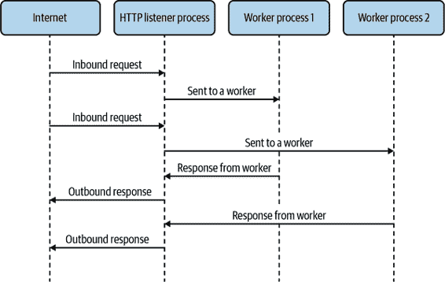

# 第三章：Node.js

在浏览器之外，只有一个值得注意的 JavaScript 运行时，那就是 *Node.js*。^(1) 虽然它起初是一个强调单线程并发的平台，使用 continuation-passing style 回调在服务器中，但也投入了大量精力使其成为通用编程平台。

许多由 Node.js 程序执行的任务不适合其传统用例，如提供 Web 请求或处理网络连接。相反，许多较新的 Node.js 程序是作为构建系统的命令行工具，或其部分，用于 JavaScript。这些程序通常在 I/O 操作上很重，就像服务器一样，但它们也通常做大量的数据处理。

例如，像[Babel](https://babeljs.io)和[TypeScript](https://typescriptlang.org)这样的工具将把您的代码从一种语言（或语言版本）转换为另一种。像[Webpack](https://webpack.js.org)、[Rollup](https://rollupjs.org)和[Parcel](https://parceljs.org)这样的工具将捆绑和缩小您的代码，以分发到您的 Web 前端或其他负载时间至关重要的环境，如无服务器环境。在这些情况下，虽然会进行大量的文件系统 I/O，但也会进行大量的数据处理，通常是同步进行的。这些都是并行性非常方便且可能更快完成任务的情况。

并行性在 Node.js 的原始用例中也可能很有用，即服务器。数据处理可能会频繁发生，这取决于您的应用程序。例如，*服务器端渲染（SSR）*涉及大量的字符串操作，其中源数据已知。这是我们可能希望在解决方案中添加并行性的众多示例之一。“何时使用”探讨了并行性提高模板渲染时间的情况。

今天，我们拥有`worker_threads`用于并行化我们的代码。这并不总是这样，但这并不意味着我们局限于单线程并发。

# 在拥有线程之前

在 Node.js 中可用线程之前，如果想利用 CPU 核心，就需要使用进程。正如在第一章中讨论的那样，如果使用进程，我们无法从线程中获得一些好处。话虽如此，如果共享内存不重要（在许多情况下确实如此！），那么进程完全能够解决这些问题。

参考第一章中的图 1-1。在这种情况下，我们有线程响应从主线程发送到它们的 HTTP 请求，而主线程则监听端口。虽然这个概念对于处理来自几个 CPU 核心的流量很有用，但我们也可以使用进程来实现类似的效果。这可能看起来像图 3-1。



###### 图 3-1. 进程在 HTTP 服务器中的使用示意图

虽然我们可以使用 Node.js 中的`child_process` API 来做类似的事情，但最好使用`cluster`，因为它专门为这种用例构建。这个模块的目的是将网络流量分散到几个工作进程中。让我们在一个简单的“Hello, World”示例中使用它。

示例 3-1 中的代码是 Node.js 中的标准 HTTP 服务器。它只是响应任何请求，无论路径或方法如何，都会返回“Hello, World!”后跟一个换行符。

##### 示例 3-1. Node.js 中的“Hello, World”服务器

```
const http = require('http');

http.createServer((req, res) => {
  res.end('Hello, World!\n');
}).listen(3000);
```

现在，让我们使用`cluster`添加四个进程。使用`cluster`模块时，常见的方法是使用`if`块来检测我们是在主监听进程还是工作进程之一。如果我们在主进程中，那么我们必须执行生成工作进程的工作。否则，在每个工作进程中，我们只需像以前一样设置普通的 Web 服务器。这应该看起来像是示例 3-2。

##### 示例 3-2. 使用`cluster`的 Node.js 中的“Hello, World”服务器

```
const http = require('http');
const cluster = require('cluster'); 

if (cluster.isPrimary) { 
  cluster.fork(); 
  cluster.fork();
  cluster.fork();
  cluster.fork();
} else {
  http.createServer((req, res) => {
    res.end('Hello, World!\n');
  }).listen(3000); 
}
```


需要引入`cluster`模块。


根据我们是否在主进程中，更改代码路径。


在主进程中，创建四个工作进程。


在工作进程中，创建一个 Web 服务器并进行监听，就像示例 3-1 中一样。

您可能注意到我们在四个不同的进程中创建监听同一端口的 Web 服务器。这看起来像是一个错误。毕竟，如果我们尝试绑定到已经使用的端口，通常会收到错误。不要担心！我们实际上并没有四次监听同一个端口。事实上，Node.js 在`cluster`中为我们做了一些魔法。

当工作进程在集群中设置时，对`listen()`的任何调用实际上会导致 Node.js 在主进程上而不是在工作进程上进行监听。然后，一旦主进程接收到连接，它会通过 IPC 传递给工作进程。在大多数系统上，这是按照循环轮询的方式进行的。这种有些复杂的系统是每个工作进程可以*看起来*在同一个端口上监听，但实际上只是主进程在那个端口上监听，并将连接传递给所有工作进程。

###### 注意

从历史上看，`cluster`中的`isPrimary`属性曾被称为`isMaster`，出于兼容性的考虑，在撰写本文时它仍然作为别名存在。这个更改是在 Node.js v16.0.0 中引入的。

这一变更旨在减少 Node.js 中潜在有害语言的使用。该项目旨在建立一个友好的社区，具有一定历史背景的特定用词与这一目标背道而驰。

进程比线程多一些额外的开销，并且我们也没有共享内存，这有助于更快地传输数据。为此，我们需要 `worker_threads` 模块。

# worker_threads 模块

Node.js 对线程的支持是通过内置模块 `worker_threads` 实现的。它提供了一种接口，模仿了在 Web 浏览器中为 Web Worker 找到的许多内容。由于 Node.js 不是一个 Web 浏览器，因此并非所有的 API 都相同，而这些工作线程内部的环境也不同于 Web Worker 内部的环境。

在 Node.js 工作线程内部，您会发现通过 `require` 可用的常规 Node.js API，或者如果您使用 ESM，则通过 `import`。不过，与主线程相比，API 中存在一些差异：

+   你不能用 `process.exit()` 退出程序。相反，这将仅退出线程。

+   你不能用 `process.chdir()` 改变工作目录。事实上，这个函数甚至不可用。

+   你不能用 `process.on()` 处理信号。

还有一件重要的事情需要注意，即 `libuv` 工作线程池在工作线程之间是共享的。回顾“隐藏线程”一节，可以注意到 `libuv` 线程池由默认的四个线程组成，用于创建对低级阻塞 API 的非阻塞接口。如果发现自己受制于该线程池的大小（例如，大量的文件系统 I/O），您会发现通过 `worker_threads` 添加更多线程并不会减轻负载。相反，除了考虑各种缓存解决方案和其他优化之外，考虑增加 `UV_THREADPOOL_SIZE`。同样，当通过 `worker_threads` 模块添加 JavaScript 线程时，您可能发现没有其他选择，只能增加这一大小，因为它们使用 `libuv` 线程池。

还有其他注意事项，请参阅[Node.js 文档](https://oreil.ly/CYxtz)以获取特定版本 Node.js 的完整差异列表。

您可以通过使用 `Worker` 构造函数来创建一个新的工作线程，就像在 示例 3-3 中一样。

##### 示例 3-3\. 在 Node.js 中生成一个新的工作线程

```
const { Worker } = require('worker_threads');

const worker = new Worker('/path/to/worker-file-name.js'); 
```


此处的文件名是我们希望在工作线程内运行的入口文件。这类似于在主文件中指定作为 `node` 命令行参数的入口点。

## workerData

仅仅创建工作线程是不够的，我们需要与其进行交互！`Worker` 构造函数接受第二个参数，即一个 `options` 对象，其中允许我们立即指定一组数据传递给工作线程。`options` 对象的属性称为 `workerData`，其内容将通过附录中描述的方式复制到工作线程中。在线程内部，我们可以通过 `worker_threads` 模块的 `workerData` 属性访问克隆的数据。你可以在示例 3-4 中看到其工作原理。

##### 示例 3-4\. 通过 `workerData` 向工作线程传递数据

```
const {
  Worker,
  isMainThread,
  workerData
} = require('worker_threads');
const assert = require('assert');

if (isMainThread) { 
  const worker = new Worker(__filename, { workerData: { num: 42 } });
} else {
  assert.strictEqual(workerData.num, 42);
}
```


不必为工作线程使用单独的文件，我们可以使用当前文件的 `__filename` 并根据 `isMainThread` 切换行为。

需要注意的是，`workerData` 对象的属性是*克隆*而不是在线程之间共享的。与 C 语言不同，在 JavaScript 线程中的共享内存并不意味着所有变量都是可见的。这意味着你对该对象所做的任何更改在另一个线程中是不可见的。它们是独立的对象。话虽如此，你可以通过 `SharedArrayBuffer` 实现线程之间的共享内存。这些可以通过 `workerData` 或通过 `MessagePort` 发送，下一节将介绍这部分内容。此外，`SharedArrayBuffer` 在第四章中有详细介绍。

## MessagePort

`MessagePort` 是双向数据流的一端。默认情况下，每个工作线程都提供一个 `MessagePort`，用于与主线程之间的通信通道。在工作线程中，它作为 `worker_threads` 模块的 `parentPort` 属性而可用。

要通过端口发送消息，需要调用 `postMessage()` 方法。第一个参数可以是任何可以传递的对象，如附录所述，它最终将成为传递到端口另一端的消息数据。当在端口上接收到消息时，将触发 `message` 事件，消息数据将作为事件处理函数的第一个参数。在主线程中，事件和 `postMessage()` 方法都在工作实例本身上，而不是必须从 `MessagePort` 实例中获取。示例 3-5 展示了一个简单的例子，其中将消息发送到主线程并被回送到工作线程。

##### 示例 3-5\. 通过默认的 `MessagePort` 进行双向通信

```
const {
  Worker,
  isMainThread,
  parentPort
} = require('worker_threads');

if (isMainThread) {
  const worker = new Worker(__filename);
  worker.on('message', msg => {
    worker.postMessage(msg);
  });
} else {
  parentPort.on('message', msg => {
    console.log('We got a message from the main thread:', msg);
  });
  parentPort.postMessage('Hello, World!');
}
```

您还可以创建一对通过 `MessageChannel` 构造函数连接的 `MessagePort` 实例。然后可以通过现有的消息端口（例如默认的消息端口）或通过 `workerData` 传递其中一个端口。在两个需要通信的线程都不是主线程，或者仅仅是为了组织目的时，您可能会这样做。示例 3-6 与前一个示例相同，只是使用了通过 `MessageChannel` 创建并通过 `workerData` 传递的端口。

##### 示例 3-6\. 通过 `MessageChannel` 创建的双向通信的 `MessagePort`

```
const {
  Worker,
  isMainThread,
  MessageChannel,
  workerData
} = require('worker_threads');

if (isMainThread) {
  const { port1, port2 } = new MessageChannel();
  const worker = new Worker(__filename, {
    workerData: {
      port: port2
    },
    transferList: [port2]
  });
  port1.on('message', msg => {
    port1.postMessage(msg);
  });
} else {
  const { port } = workerData;
  port.on('message', msg => {
    console.log('We got a message from the main thread:', msg);
  });
  port.postMessage('Hello, World!');
}
```

您会注意到我们在实例化 `Worker` 时使用了 `transferList` 选项。这是将对象从一个线程传递到另一个线程的一种方式。当通过 `workerData` 或 `postMessage` 发送任何 `MessagePort`、`ArrayBuffer` 或 `FileHandle` 对象时，这是必需的。一旦这些对象被传输，它们就不能在发送方使用了。

###### 提示

在 Node.js 的更新版本中，Web Hypertext Application Technology Working Group (WHATWG) 的 `ReadableStream` 和 `WritableStream` 可用。您可以在 [Node.js 文档](https://oreil.ly/TRJf0) 中了解更多信息，并在某些 API 中使用它们。它们可以通过 `MessagePort` 上的 `transferList` 被转移，以启用跨线程的另一种通信方式。在底层，这些是使用 `MessagePort` 实现的，用于跨线程发送数据。

# Happycoin：重访

现在我们已经了解了在 Node.js 中生成线程并使它们互相通信的基础知识，我们有足够的内容来在 Node.js 中重建我们的示例，来自于 “在 C 语言中使用线程：用 Happycoin 致富”。

记住，Happycoin 是我们想象中的加密货币，其完全荒谬的工作证明算法如下：

1.  生成一个随机的无符号 64 位整数。

1.  确定整数是否为快乐数。

1.  如果不快乐，那就不是 Happycoin。

1.  如果不能被 10,000 整除，那就不是 Happycoin。

1.  否则，它就是一个 Happycoin。

就像我们在 C 语言中做的那样，我们首先创建一个单线程版本，然后再将代码适配为多线程运行。

## 仅使用主线程

让我们从生成随机数开始。首先，创建一个名为 *happycoin.js* 的文件，在名为 *ch3-happycoin/* 的目录中。将其填充为 示例 3-7 的内容。

##### 示例 3-7\. *ch3-happycoin/happycoin.js*

```
const crypto = require('crypto');

const big64arr = new BigUint64Array(1)
function random64() {
  crypto.randomFillSync(big64arr);
  return big64arr[0];
}
```

Node.js 中的 `crypto` 模块为我们提供了一些便捷的函数，用于获取加密安全的随机数。毕竟我们正在构建一个加密货币，这些函数对我们来说非常重要！幸运的是，在 Node.js 中这比在 C 语言中要简单。

`randomFillSync` 函数会用随机数据填充给定的 `TypedArray`。因为我们只需要一个 64 位无符号整数，我们可以使用 `BigUint64Array`。这个特定的 `TypedArray` 和它的兄弟 `BigInt64Array`，是 JavaScript 的最新补充，依赖于新的 `bigint` 类型，用于存储任意大的整数。在用随机数据填充完毕后，返回这个数组的第一个（也是唯一的）元素，即得到了我们要找的随机 64 位无符号整数。

现在让我们添加我们的 Happycoin 计算。将 示例 3-8 的内容添加到您的文件中。

##### 示例 3-8\. *ch3-happycoin/happycoin.js*

```
function sumDigitsSquared(num) {
  let total = 0n;
  while (num > 0) {
    const numModBase = num % 10n;
    total += numModBase ** 2n;
    num = num / 10n;
  }
  return total;
}

function isHappy(num) {
  while (num != 1n && num != 4n) {
    num = sumDigitsSquared(num);
  }
  return num === 1n;
}

function isHappycoin(num) {
  return isHappy(num) && num % 10000n === 0n;
}
```

这三个函数，`sumDigitsSquared`、`isHappy` 和 `isHappycoin`，是直接从其 C 语言对应物翻译而来，见于 “C 语言中的线程：用 Happycoin 致富”。如果你对 `bigint` 不熟悉，你可能会注意到代码中所有数字文字都带有 `n` 后缀。这个后缀告诉 JavaScript 这些数字应该被视为 `bigint` 值，而不是 `number` 类型的值。这一点很重要，因为虽然这两种类型都支持像 `+`、`-`、`**` 等数学运算符，但它们不能互操作，除非进行显式转换。例如，`1 + 1n` 是无效的，因为它试图将 `number` 1 和 `bigint` 1 相加。

最后，让我们通过实现我们的 Happycoin 挖掘循环并输出找到的 Happycoin 数量来完成文件。将 示例 3-9 添加到您的文件中。

##### 示例 3-9\. *ch3-happycoin/happycoin.js*

```
let count = 0;
for (let i = 1; i < 10_000_000; i++) {
  const randomNum = random64();
  if (isHappycoin(randomNum)) {
    process.stdout.write(randomNum.toString() + ' ');
    count++;
  }
}

process.stdout.write('\ncount ' + count + '\n');
```

这里的代码与我们在 C 语言中做的非常相似。我们循环 10,000,000 次，获取一个随机数并检查它是否是 Happycoin。如果是，我们将其输出。请注意，这里我们不使用 `console.log()`，因为我们不希望在每个找到的数字后插入换行符。相反，我们想要空格，所以我们直接写入输出流。在循环结束后输出计数时，我们需要在输出的开头加一个额外的换行符，以便与上面的数字分隔开来。

要运行此程序，请在您的 *ch3-happycoin* 目录中使用以下命令：

```
$ node happycoin.js
```

输出结果应该与 C 语言示例完全一致。也就是说，输出应该看起来像这样：

```
5503819098300300000 ...  [ 125 more entries ] ... 5273033273820010000
count 127
```

这比 C 语言示例要慢得多。在一台普通机器上，使用 Node.js v16.0.0 大约需要 1 分钟 45 秒。

有许多原因导致这个过程耗时如此之长。在构建应用程序并优化性能时，重要的是找出性能开销的来源。是的，一般来说，JavaScript 往往比 C 语言“慢”，但这种巨大的差距不仅仅可以用这个来解释。是的，在下一节中，当我们将其拆分为多个工作线程时，性能会得到改善，但正如你所看到的，与 C 语言示例相比，这种实现远非引人注目。

说到这一点，让我们看看当我们使用 `worker_threads` 来分担负载时会发生什么。

## 使用四个工作线程

要添加工作线程，我们将从原有的代码开始。将 *happycoin.js* 的内容复制到 *happycoin-threads.js*。然后在文件的开头插入 示例 3-10 的内容，放在现有内容之前。

##### 示例 3-10\. *ch3-happycoin/happycoin-threads.js*

```
const {
  Worker,
  isMainThread,
  parentPort
} = require('worker_threads');
```

我们需要 `worker_threads` 模块的这些部分，所以我们在开头进行 `require`。现在，将从 `let count = 0;` 到文件末尾的所有内容替换为 示例 3-11。

##### 示例 3-11\. *ch3-happycoin/happycoin-threads.js*

```
const THREAD_COUNT = 4;

if (isMainThread) {
  let inFlight = THREAD_COUNT;
  let count = 0;
  for (let i = 0; i < THREAD_COUNT; i++) {
    const worker = new Worker(__filename);
    worker.on('message', msg => {
      if (msg === 'done') {
        if (--inFlight === 0) {
          process.stdout.write('\ncount ' + count + '\n');
        }
      } else if (typeof msg === 'bigint') {
        process.stdout.write(msg.toString() + ' ');
        count++;
      }
    })
  }
} else {
  for (let i = 1; i < 10_000_000/THREAD_COUNT; i++) {
    const randomNum = random64();
    if (isHappycoin(randomNum)) {
      parentPort.postMessage(randomNum);
    }
  }
  parentPort.postMessage('done');
}
```

我们在这里通过一个 `if` 块来分割行为。如果我们在主线程上，我们使用当前文件启动四个工作线程。请记住，`__filename` 是一个包含当前文件路径和名称的字符串。然后我们为该工作线程添加一个消息处理程序。在消息处理程序中，如果消息仅为 `done`，则表示工作线程已完成其工作；如果所有其他工作线程都完成了，我们将输出计数。如果消息是一个数字，或者更确切地说是一个 `bigint`，则假定它是一个 Happycoin，并将其打印出来并添加到计数中，就像在单线程示例中所做的那样。

在 `if` 块的 `else` 部分，我们在其中一个工作线程中运行。在这里，我们将执行与单线程示例中相同类型的循环，但是我们只循环之前的 1/4 次，因为我们正在四个线程间共享同样的工作。此外，我们不直接向输出流写入，而是通过给予我们的 `parentPort` 发送找到的 Happycoins 返回主线程。我们已经为此在主线程上设置了处理程序。当循环退出时，我们在 `parentPort` 上发送 `done`，以指示主线程在此线程上将不再发现任何更多的 Happycoins。

我们本可以立即将 Happycoins 打印到输出中，但与 C 示例一样，我们不希望不同的线程在输出中互相干扰，因此我们需要*同步*。章节 4 和 5 讨论了更高级的同步技术，但目前只需将数据通过 `parentPort` 发送回主线程，让主线程处理输出就足够了。

现在我们已经添加了线程到这个例子中，您可以在您的 *ch3-happycoin* 目录下使用以下命令运行它：

```
$ node happycoin-threads.js
```

您应该看到类似以下的输出：

```
17241719184686550000 ... [ 137 more entries ] ... 17618203841507830000
count 139

```

就像 C 示例一样，这段代码运行速度相当快。在与单线程示例相同的计算机和 Node.js 版本上进行的测试中，运行时间约为 33 秒。这比单线程示例有了显著改进，线程再次大获成功！

###### 注意

这并不是将这种类型的问题拆分为基于线程的计算的唯一方法。例如，可以使用其他同步技术来避免在线程之间传递数据，或者可以对消息进行批处理。一定要进行测试和比较，以确定线程是否是理想的解决方案，以及哪些线程技术最适合您的问题，以及最有效的方法。

# 使用 Piscina 的工作池

许多类型的工作负载自然倾向于使用线程。在 Node.js 中，大多数工作负载涉及处理 HTTP 请求。如果在该代码中发现自己正在进行大量的数学或同步数据处理，将这些工作分配给一个或多个线程可能是有意义的。这些类型的操作涉及将单个任务提交给一个线程，并等待其结果。与多线程 Web 服务器工作方式类似，维护一个可以从主线程发送各种任务的工作线程池是有道理的。

本节仅对线程池进行浅显的讨论，使用熟悉的 Happycoins 应用程序，并通过一个包抽象出池化机制。“线程池”广泛涵盖了线程池的内容，并从头开始实现一个实现。

###### 注意

池化资源的概念并不局限于线程。例如，Web 浏览器通常会创建到 Web 服务器的套接字连接池，以便可以通过这些连接复用渲染网页所需的各种 HTTP 请求。数据库客户端库通常也会对连接到数据库服务器的套接字执行类似操作。

Node.js 中有一个方便的模块称为[*generic-pool*](https://oreil.ly/2a6ua)，它是一个处理任意池化资源的辅助模块。这些资源可以是任何东西，比如数据库连接、其他套接字、本地缓存、线程或几乎任何需要多个实例但一次只访问一个实例的东西。

对于将离散任务发送到一组工作线程的用例，我们可以利用[*piscina*](https://oreil.ly/0p8zi)模块。该模块封装了设置一堆工作线程并将任务分配给它们的工作。该模块的名称源自意大利语中“pool”的词。

基本用法很简单。您创建一个`Piscina`类的实例，传入一个`filename`，这将在工作线程中使用。在幕后，创建了一个工作线程池，并设置了一个队列来处理传入的任务。您可以通过调用`.run()`来排入任务，传入包含完成此任务所需数据的值，并注意这些值将被克隆，就像使用`postMessage()`一样。这将返回一个承诺，一旦任务由工作线程完成，就会解析出结果值。在要在工作线程中运行的文件中，必须导出一个函数，该函数接受传递给`.run()`的任何内容，并返回结果值。这个函数也可以是一个`async`函数，这样您就可以在工作线程中执行异步任务（如果需要的话）。在示例 3-12 中找到了一个在工作线程中计算平方根的基本示例。

##### 示例 3-12。使用`piscina`计算平方根

```
const Piscina = require('piscina');

if (!Piscina.isWorkerThread) { 
  const piscina = new Piscina({ filename: __filename }); 
  piscina.run(9).then(squareRootOfNine => { 
    console.log('The square root of nine is', squareRootOfNine);
  });
}

module.exports = num => Math.sqrt(num); 
```


就像`cluster`和`worker_threads`一样，`piscina`提供了一个方便的布尔值，用于确定我们是否在主线程还是工作线程中。


我们将使用与 Happycoin 示例相同的文件使用相同的技术。


由于`.run()`返回一个承诺，因此我们可以直接在其上调用`.then()`。


导出的函数在工作线程中用于执行实际工作。在这种情况下，它只是计算一个平方根。

尽管在池中运行一个任务很好，但我们需要能够在池中运行*多个*任务。假设我们想计算小于一千万的每个数字的平方根。让我们继续循环一千万次。我们还将用一个断言替换日志记录，以确保我们得到了一个数值结果，因为日志记录会非常嘈杂。请看示例 3-13。

##### 示例 3-13。使用`piscina`计算一千万个平方根

```
const Piscina = require('piscina');
const assert = require('assert');

if (!Piscina.isWorkerThread) {
  const piscina = new Piscina({ filename: __filename });
  for (let i = 0; i < 10_000_000; i++) {
    piscina.run(i).then(squareRootOfI => {
      assert.ok(typeof squareRootOfI === 'number');
    });
  }
}

module.exports = num => Math.sqrt(num);
```

看起来这应该可以工作。我们将提交一千万个数字供工作线程池处理。然而，如果您运行此代码，您将得到一个不可恢复的 JavaScript 内存分配错误。在使用 Node.js v16.0.0 的一个试验中，观察到了以下输出。

```
FATAL ERROR: Reached heap limit Allocation failed
    - JavaScript heap out of memory
 1: 0xb12b00 node::Abort() [node]
 2: 0xa2fe25 node::FatalError(char const*, char const*) [node]
 3: 0xcf8a9e v8::Utils::ReportOOMFailure(v8::internal::Isolate*,
    char const*, bool) [node]
 4: 0xcf8e17 v8::internal::V8::FatalProcessOutOfMemory(v8::internal::Isolate*,
    char const*, bool) [node]
 5: 0xee2d65  [node]
[ ... 13 more lines of a not-particularly-useful C++ stacktrace ... ]
Aborted (core dumped)
```

这里发生了什么？原来底层任务队列不是无限的。默认情况下，任务队列将继续增长，直到我们遇到类似这样的分配错误。为了避免发生这种情况，我们需要设置一个合理的限制。`piscina`模块允许您通过在其构造函数中使用`maxQueue`选项来设置限制，该选项可以设置为任何正整数。通过实验，`piscina`的维护者们发现，一个理想的`maxQueue`值是它使用的工作线程数量的平方。方便的是，您可以通过将`maxQueue`设置为`auto`来使用此数字，而无需知道它是多少。

一旦我们为队列大小建立了一个限制，我们需要能够处理队列已满的情况。检测队列已满有两种方法：

1.  比较`piscina.queueSize`和`piscina.options.maxQueue`的值。如果它们相等，则队列已满。在调用`piscina.run()`之前进行此检查可以避免在队列已满时尝试入队操作。这是推荐的检查方法。

1.  如果在队列已满时调用`piscina.run()`，返回的 Promise 将会因队列已满而被拒绝，显示队列已满的错误。这并不理想，因为在此时我们已经进入事件循环的更进一步刻度，并且可能已经尝试了许多其他入队操作。

当我们知道队列已满时，我们需要一种方法来知道何时它会准备好接收新任务。幸运的是，`piscina`池在队列为空时会触发`drain`事件，这绝对是开始添加新任务的理想时机。在示例 3-14 中，我们围绕提交任务的循环放置了一个`async`函数。

##### 示例 3-14\. 使用`piscina`计算一千万个平方根，无崩溃

```
const Piscina = require('piscina');
const assert = require('assert');
const { once } = require('events');

if (!Piscina.isWorkerThread) {
  const piscina = new Piscina({
    filename: __filename,
    maxQueue: 'auto' 
  });
  (async () => { 
    for (let i = 0; i < 10_000_000; i++) {
      if (piscina.queueSize === piscina.options.maxQueue) { 
        await once(piscina, 'drain'); 
      }
      piscina.run(i).then(squareRootOfI => {
        assert.ok(typeof squareRootOfI === 'number');
      });
    }
  })();
}

module.exports = num => Math.sqrt(num);
```


`maxQueue`选项设置为`auto`，将队列大小限制为`piscina`使用线程数的平方。


`for`循环包装在一个立即调用的`async`函数表达式（IIFE）中，以便在其中使用`await`。


当此检查为真时，队列已满。


然后，我们等待`drain`事件，在提交任何新任务到队列之前。

运行此代码不会像以前一样导致内存不足崩溃。它需要相当长的时间才能完成，但最终会顺利退出。

如下所示，很容易陷入陷阱，使用工具看似是最明智的方式，但并不是最佳方法。在构建多线程应用程序时，充分理解像`piscina`这样的工具是非常重要的。

顺便说一句，让我们看看当我们尝试使用`piscina`来挖掘 Happycoins 时会发生什么。

# 一池满的 Happycoins

要使用`piscina`来生成 Happycoins，我们将使用与原始`worker_threads`实现略有不同的方法。我们不再在每次获得 Happycoin 时都返回一个消息，而是在完成时将它们批量发送。这种折衷方案节省了我们设置`MessageChannel`来将数据发送回主线程的工作；副作用是我们只能批量获取结果，而不是在准备好时立即获取。主线程仍将负责生成适当的线程并检索所有结果。

首先，将您的*happycoin-threads.js*文件复制到一个名为*happycoin-piscina.js*的新文件中。我们将在之前的`worker_threads`示例的基础上构建。现在用示例 3-15 替换`require('crypto')`行之前的所有内容。

##### 示例 3-15\. *ch3-happycoin/happycoin-piscina.js*

```
const Piscina = require('piscina');
```

是的，就是这样！现在我们将进入更实质性的内容。用示例 3-16 中`isHappycoin()`函数声明后的内容替换一切。

##### 示例 3-16\. *ch3-happycoin/happycoin-piscina.js*

```
const THREAD_COUNT = 4;

if (!Piscina.isWorkerThread) { 
  const piscina = new Piscina({
    filename: __filename, 
    minThreads: THREAD_COUNT, 
    maxThreads: THREAD_COUNT
  });
  let done = 0;
  let count = 0;
  for (let i = 0; i < THREAD_COUNT; i++) { 
    (async () => {
      const { total, happycoins } = await piscina.run(); 
      process.stdout.write(happycoins);
      count += total;
      if (++done === THREAD_COUNT) { 
        console.log('\ncount', count);
      }
    })();
  }
}
```


我们将使用`isWorkerThread`属性来检查我们是否在主线程中。


我们正在使用与之前相同的技术来创建使用同一文件的工作线程。


我们希望将线程数限制为恰好四个，以匹配我们之前的示例。我们将计时并查看发生了什么，因此保持四个线程可以减少这里的变量数量。


我们知道有四个线程，因此我们将任务排队四次。每个线程在检查其随机数块是否有 Happycoin 后会完成任务。


我们将任务提交到队列中的这个`async` IIFE 中，以便它们都在同一事件循环迭代中排队。不用担心，我们不会像以前那样因为内存不足而出错，因为我们知道我们确实有四个线程，并且只排队了四个任务。后面我们会看到，任务会返回输出字符串和线程找到的 Happycoin 的总数。


就像我们在之前的 Happycoin 实现中所做的那样，我们将检查所有线程是否完成其任务，然后输出我们找到的 Happycoin 的总数。

接下来我们将添加来自示例 3-17 的代码，该示例添加了在`piscina`的工作线程中使用的导出函数。

##### 示例 3-17\. *ch3-happycoin/happycoin-piscina.js*

```
module.exports = () => {
  let happycoins = '';
  let total = 0;
  for (let i = 0; i < 10_000_000/THREAD_COUNT; i++) { 
    const randomNum = random64();
    if (isHappycoin(randomNum)) {
      happycoins += randomNum.toString() + ' ';
      total++;
    }
  }
  return { total, happycoins }; 
}
```


在这里我们正在进行典型的 Happycoin 搜索循环，但与其他并行性示例一样，我们将总搜索空间分割成几个线程。


我们通过从此函数返回一个值来将找到的 Happycoin 的字符串和它们的总数传回主线程。

要运行这个示例，如果你之前还没有安装`piscina`，你需要在你的*ch3-happycoin*目录中使用以下两个命令设置 Node.js 项目并添加`piscina`依赖项。然后可以使用第三行命令来运行代码：

```
$ npm init -y
$ npm install piscina
$ node happycoin-piscina.js
```

你应该看到与先前示例相同的输出，但有一点小变化。与其看到每个 Happycoin 一个接一个地到来，你将看到它们大致同时到达，或者以四个大组的形式到达。这是我们通过返回整个字符串而不是一个接一个地返回 Happycoins 所做的权衡。这段代码应该在大致相同的时间内运行，就像 *happycoin-threads.js* 一样，因为它使用了`piscina`提供的相同原理的抽象层。

你可以看到，我们并没有按照典型的方式使用`piscina`。我们没有传递大量的独立任务，最终需要仔细排队。这样做的主要原因是性能。

例如，如果在主线程中进行了一千万次迭代的循环，每次都向队列添加另一个任务并等待其响应，那么最终速度将和同步运行所有代码在主线程上一样慢。我们也可以不等待回复，尽快将事物添加到队列中，但事实证明，传递消息两千万次的开销比仅仅传递八个消息要大得多。

当处理原始数据，如数字或字节流时，通常可以使用`SharedArrayBuffers`在线程之间更快地传输数据，我们将在下一章节详细了解这些内容。

^(1) 是的，其他非浏览器 JavaScript 运行时也存在，比如 Deno，但截至撰写本文时，Node.js 的流行度和市场份额如此之大，以至于在这里只值得讨论它。希望在您阅读本文时情况可能已有所改变，这对 JavaScript 的世界来说是件好事！希望本书的新版本覆盖了您所选择的非浏览器 JavaScript 运行时。
