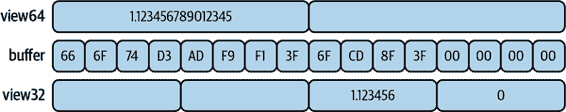
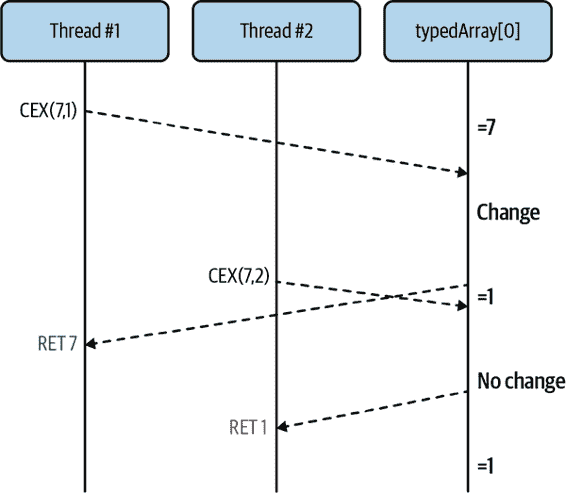
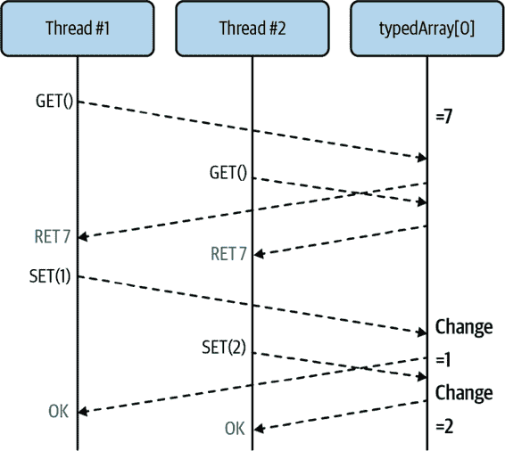
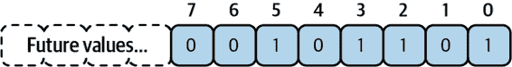

# 第四章：共享内存

到目前为止，您已经接触过用于浏览器的 Web Workers API，这在第二章中有所涵盖，并且 Node.js 的工作线程模块，在“worker_threads 模块”中有所涵盖。这两个工具对于在 JavaScript 中处理并发非常有用，使开发人员能够以以前无法实现的方式并行运行代码。

然而，您迄今为止与它们的互动还相当浅显。虽然它们确实允许您并行运行代码，但您只是使用了消息传递 API，最终仍依赖于熟悉的事件循环来处理消息的接收。这比您在“C 语言中的线程：与 Happycoin 一起致富”中使用的线程代码要低效得多，那里这些不同的线程能够访问相同的共享内存。

本章介绍了 JavaScript 应用程序可用的两个强大工具：`Atomics`对象和`SharedArrayBuffer`类。这些工具允许您在两个线程之间共享内存，而无需依赖消息传递。但在深入讨论这些对象的完整技术说明之前，我们先来看一个快速的介绍性示例。

这些工具如果被滥用可能会很危险，在开发过程中引入逻辑上的错误到您的应用程序中，这些错误在生产环境中可能会显露出来。但如果经过磨练并正确使用，这些工具可以让您的应用程序在硬件上表现出前所未见的高性能水平。

# 共享内存介绍

对于这个示例，您将构建一个非常基本的应用程序，能够在两个 Web Worker 之间进行通信。虽然这需要一些初始的样板代码使用`postMessage()`和`onmessage`，但后续的更新将不依赖于这样的功能。

此共享内存示例将在浏览器以及 Node.js 中运行，尽管两者所需的设置工作有些不同。现在，您将构建一个在浏览器中工作的示例，并提供了大量的描述。稍后，一旦您更加熟悉，您将构建一个使用 Node.js 的示例。

## 浏览器中的共享内存

要开始，请创建另一个目录以存放名为*ch4-web-workers/*的项目，然后创建一个名为*index.html*的 HTML 文件，并将内容从示例 4-1 添加到其中。

##### 示例 4-1\. *ch4-web-workers/index.html*

```
<html>
  <head>
    <title>Shared Memory Hello World</title>
    <script src="main.js"></script>
  </head>
</html>
```

完成文件后，您可以开始应用程序的更复杂部分。创建一个名为*main.js*的文件，其中包含来自示例 4-2 的内容。

##### 示例 4-2\. *ch4-web-workers/main.js*

```
if (!crossOriginIsolated) { 
  throw new Error('Cannot use SharedArrayBuffer');
}

const worker = new Worker('worker.js');

const buffer = new SharedArrayBuffer(1024); 
const view = new Uint8Array(buffer); 

console.log('now', view[0]);

worker.postMessage(buffer);

setTimeout(() => {
  console.log('later', view[0]);
  console.log('prop', buffer.foo); 
}, 500);
```


当`crossOriginIsolated`为 true 时，可以使用`SharedArrayBuffer`。


实例化一个 1 KB 缓冲区。


创建了一个对缓冲区的视图。


读取了修改后的属性。

此文件类似于您之前创建的文件。实际上，它仍在使用专用工作者。但是增加了一些复杂性。第一件新事是检查`crossOriginIsolated`值，这是现代浏览器中可用的全局变量之一。此值告诉您当前运行的 JavaScript 代码是否能够实例化`SharedArrayBuffer`实例。

出于与 Spectre CPU 攻击相关的安全原因，`SharedArrayBuffer`对象并非始终可用于实例化。事实上，几年前浏览器完全禁用了这个功能。现在，Chrome 和 Firefox 都支持该对象，并要求在文档服务之前设置额外的 HTTP 标头，才能允许实例化`SharedArrayBuffer`。Node.js 没有相同的限制。以下是所需的标头：

```
Cross-Origin-Opener-Policy: same-origin
Cross-Origin-Embedder-Policy: require-corp
```

您将自动运行的测试服务器设置这些标头。任何时候构建一个使用`SharedArrayBuffer`实例的生产就绪应用程序，都需要记住设置这些标头。

实例化专用工作者后，还会实例化一个`SharedArrayBuffer`的实例。此处的参数 1,024 是分配给缓冲区的字节数。与您熟悉的其他数组或缓冲对象不同，这些缓冲区在创建后无法收缩或增长。^(1)

还创建了一个用于处理名为`view`的缓冲区的视图。此类视图在“SharedArrayBuffer and TypedArrays”中有详细介绍，但现在，请将其视为一种读取和写入缓冲区的方法。

通过这个对缓冲区的视图，我们可以使用数组索引语法从中读取。在本例中，我们通过记录调用`view[0]`来检查缓冲区中的第 0 字节。之后，使用`worker.postMessage()`方法将缓冲区实例传递给工作者。在这种情况下，传递的唯一内容是缓冲区。然而，也可以传递更复杂的对象，其中缓冲区是其中一个属性。虽然附录中讨论的算法主要破坏复杂对象，但`SharedArrayBuffer`的实例是一个明确的例外。

一旦脚本完成设置工作，它会安排一个函数在 500 毫秒后运行。此脚本再次打印缓冲区的第 0 字节，并尝试打印一个名为`.foo`的附加到缓冲区的属性。请注意，此文件中否则没有定义`worker.onmessage`处理程序。

现在，您已经完成了主 JavaScript 文件，准备好创建工作者。创建一个名为*worker.js*的文件，并将内容从示例 4-3 添加到其中。

##### 示例 4-3\. *ch4-web-workers/worker.js*

```
self.onmessage = ({data: buffer}) => {
  buffer.foo = 42; 
  const view = new Uint8Array(buffer);
  view[0] = 2; 
  console.log('updated in worker');
};
```


缓冲对象上的一个属性已被写入。


第 0 索引被设置为数字 2。

此文件附加了一个处理程序，用于在 *main.js* 中的 `.postMessage()` 方法触发后运行的 `onmessage` 事件。一旦调用，将获取缓冲区参数。处理程序中的第一件事就是将 `.foo` 属性附加到 `SharedArrayBuffer` 实例上。接下来，为缓冲区创建了另一个视图。之后，通过视图更新了缓冲区。完成这些后，将打印一条消息，以便你可以看到发生了什么。

现在，你的文件已经完成，可以准备运行新的应用程序了。打开一个终端窗口并运行以下命令。它与之前运行的 `serve` 命令有些不同，因为它需要提供安全头信息：

```
$ npx MultithreadedJSBook/serve .
```

与之前一样，在你的终端中打开显示的链接。接下来，打开网页检查器并访问“控制台”选项卡。你可能看不到任何输出；如果是这样，请刷新页面以重新执行代码。你应该能看到应用程序打印的日志。输出的示例已在 表 4-1 中重现。

表 4-1\. 示例控制台输出

| 日志 | 位置 |
| --- | --- |
| 现在 0 | main.js:10:9 |
| 更新于 worker | worker.js:5:11 |
| 稍后 2 | main.js:15:11 |
| 属性未定义 | main.js:16:11 |

第一行打印的是在 *main.js* 中看到的缓冲区的初始值。在本例中，该值为 `0`。接下来，运行 *worker.js* 中的代码，不过其具体时序大多是不确定的。大约半秒钟后，再次打印在 *main.js* 中看到的值，并且该值现在设置为 `2`。再次注意，除了初始设置工作外，没有在运行 *main.js* 文件的线程与运行 *worker.js* 文件的线程之间进行消息传递。

###### 注

这是一个非常简单的示例，虽然它能运行，但并不是你通常编写多线程代码的方式。不能保证在 *worker.js* 中更新的值会在 *main.js* 中可见。例如，聪明的 JavaScript 引擎可能会将该值视为常量，尽管你很难找到一个不会这样处理的浏览器。

在打印缓冲区值之后，也会打印 `.foo` 属性，并显示值 `undefined`。这可能是为什么呢？好吧，虽然确实存在一个引用内存位置的引用，该内存位置存储在缓冲区中的二进制数据，但实际对象本身并没有被共享。如果共享了，这将违反结构化克隆算法的约束，该算法规定对象引用不能在线程之间共享。

## Node.js 中的共享内存

这个应用程序的 Node.js 等效版本大部分是相似的；然而，浏览器提供的`Worker`全局变量不可用，并且工作线程不会使用`self.onmessage`。相反，必须要求工作线程模块以获取这个功能。由于 Node.js 不是浏览器，因此*index.html*文件不适用。

要创建一个 Node.js 等效版本，你只需要两个文件，它们可以放在相同的*ch4-web-workers/*文件夹中。首先，创建一个*main-node.js*脚本，并将内容从示例 4-4 添加到其中。

##### 示例 4-4\. *ch4-web-workers/main-node.js*

```
#!/usr/bin/env node

const { Worker } = require('worker_threads');
const worker = new Worker(__dirname + '/worker-node.js');

const buffer = new SharedArrayBuffer(1024);
const view = new Uint8Array(buffer);

console.log('now', view[0]);

worker.postMessage(buffer);

setTimeout(() => {
  console.log('later', view[0]);
  console.log('prop', buffer.foo);
  worker.unref();
}, 500);
```

代码有些许不同，但大体上应该感觉上是熟悉的。因为全局的`Worker`不可用，所以必须从需要的`worker_threads`模块中获取`.Worker`属性来访问它。在实例化工作线程时，必须提供比浏览器接受的更明确的工作线程路径。在这种情况下，尽管浏览器只需*worker.js*，但需要提供更明确的路径*./worker-node.js*。除此之外，与浏览器等效的主 JavaScript 文件在这个 Node.js 示例中基本保持不变。最后的`worker.unref()`调用是为了防止工作线程永远保持进程运行状态。

接下来，创建一个名为*worker-node.js*的文件，其中包含与浏览器工作线程示例 4-5 相对应的 Node.js 版本。将内容添加到这个文件中。

##### 示例 4-5\. *ch4-web-workers/worker-node.js*

```
const { parentPort } = require('worker_threads');

parentPort.on('message', (buffer) => {
  buffer.foo = 42;
  const view = new Uint8Array(buffer);
  view[0] = 2;
  console.log('updated in worker');
});
```

在这种情况下，`self.onmessage`值对于工作线程是不可用的。相反，再次需要`worker_threads`模块，并使用模块中的`.parentPort`属性。这用于表示与调用 JavaScript 环境的端口的连接。

`.onmessage`处理程序可以分配给`parentPort`对象，并调用`.on('message', cb)`方法。如果同时使用这两种方法，它们将按照它们被使用的顺序调用。`message`事件的回调函数直接作为参数接收传入的对象（在这种情况下是`buffer`），而`onmessage`处理程序则提供一个包含`buffer`的`.data`属性的`MessageEvent`实例。大多数情况下，使用哪种方法取决于个人偏好。

除此之外，Node.js 和浏览器之间的代码完全相同，像`SharedArrayBuffer`这样的全局变量仍然可用，并且在这个示例中仍然起作用。

现在这些文件已经完整，你可以使用以下命令来运行它们：

```
$ node main-node.js
```

这个命令的输出应当等同于浏览器中显示的表 4-1 中的输出。同样，相同的结构克隆算法允许`SharedArrayBuffer`的实例被传递，但只传递底层的二进制缓冲区数据，而不是对象本身的直接引用。

# SharedArrayBuffer 和 TypedArrays

传统上，JavaScript 语言并不真正支持与二进制数据的交互。当然，有字符串，但它们实际上抽象了底层数据存储机制。还有数组，但这些数组可以包含任何类型的值，并不适合表示二进制缓冲区。多年来，这种状态差不多算是“够用了”，尤其是在 Node.js 出现之前和在不涉及网页上下文的情况下运行 JavaScript 受欢迎之前。

Node.js 运行时除了其他功能外，还能读写文件系统、在网络中进行数据流传输等。这些交互不仅限于基于 ASCII 的文本文件，还可以包括管道传输二进制数据。由于没有现成的便捷缓冲数据结构，作者们创建了自己的。因此，Node.js 的 `Buffer` 诞生了。

随着 JavaScript 语言本身边界的推动，API 和语言与浏览器窗口外部互动的能力也得到了增强。最终创建了 `ArrayBuffer` 对象，稍后又创建了 `SharedArrayBuffer` 对象，它们现在是语言的核心组成部分。很可能，如果今天创建 Node.js，它就不会创建自己的 `Buffer` 实现了。

`ArrayBuffer` 和 `SharedArrayBuffer` 的实例表示固定长度且不能调整大小的二进制数据缓冲区。虽然两者相似，但后者将是本节的重点，因为它允许应用程序在线程之间共享内存。二进制数据在许多传统编程语言（如 C 语言）中是一个普遍存在且重要的概念，但对于使用高级语言如 JavaScript 的开发人员来说，理解起来可能并不容易。

如果你还没有使用过，*二进制* 是一种基于 2 的计数系统，最低级别上表示为 1 和 0。每个数字称为一个 *位*。*十进制* 是人类主要用于计数的系统，基数为 10，用数字 0 到 9 表示。8 个位的组合称为一个字节，通常是内存中最小可寻址的值，因为与单个位相比处理起来更容易。基本上，这意味着 CPU（和程序员）处理字节而不是单个位。

这些字节通常以两个 *十六进制* 字符表示，这是一种基于 16 的计数系统，使用数字 0–9 和字母 A–F。实际上，在 Node.js 中记录 `ArrayBuffer` 的实例时，结果输出显示的是用十六进制表示的缓冲区值。

假设存储在磁盘上或甚至计算机内存中的一组任意字节，数据意义有点模糊。例如，十六进制值`0x54`（JavaScript 中的`0x`前缀表示值是十六进制的）代表什么？如果它是字符串的一部分，可能表示大写字母*T*。但如果它代表一个整数，可能是十进制数 84。它甚至可能是指内存位置，JPEG 图像中的像素的一部分，或者其他任意数量的事物。这里的上下文非常重要。相同的数字，在二进制中表示为`0b01010100`（`0b`前缀表示二进制）。

要记住这种模糊性，还要提到，无法直接修改`ArrayBuffer`（和`SharedArrayBuffer`）的内容。相反，必须先创建对缓冲区的“视图”。此外，不同于其他语言可能提供对废弃内存的访问，JavaScript 中实例化`ArrayBuffer`时缓冲区的内容被初始化为 0。考虑到这些缓冲区对象仅存储数值数据，它们确实是数据存储的非常基础的工具，通常用于构建更复杂的系统。

`ArrayBuffer`和`SharedArrayBuffer`都继承自`Object`，并具有相关的方法。除此之外，它们各自还有两个属性。第一个是只读的值`.byteLength`，表示缓冲区的字节长度；第二个是`.slice(begin, end)`方法，根据提供的范围返回缓冲区的副本。

`.slice()`的`begin`值是包含的，而`end`值是排除的，这显然与`String#substr(begin, length)`不同，后者的第二个参数是长度。如果省略了`begin`值，则默认为第一个元素；如果省略了`end`值，则默认为最后一个元素。负数表示从缓冲区末尾计数。

下面是与`ArrayBuffer`基本交互的示例：

```
const ab = new ArrayBuffer(8);
const view = new Uint8Array(ab)
for (i = 0; i < 8; i++) view[i] = i;
console.log(view);
// Uint8Array(8) [
//   0, 1, 2, 3,
//   4, 5, 6, 7
// ]
ab.byteLength; // 8
ab.slice(); // 0, 1, 2, 3, 4, 5, 6, 7
ab.slice(4, 6); // 4, 5
ab.slice(-3, -2); // 5
```

不同的 JavaScript 环境以不同方式显示`ArrayBuffer`实例的内容。Node.js 显示一列十六进制对，就像数据将被视为`Uint8Array`。Chrome v88 显示一个可展开的对象，具有几种不同的视图。然而，Firefox 不会显示数据，需要首先通过视图传递。

术语*视图*已经在几个地方提到过，现在是定义它的好时机。由于二进制数据的含义可能存在歧义，我们需要使用视图来读取和写入底层缓冲区。在 JavaScript 中有几种这样的视图可用。每个视图都是从名为`TypedArray`的基类扩展而来。这个类不能直接实例化，也不作为全局变量提供，但可以通过从实例化的子类中获取`.prototype`属性来访问。

表 4-2 包含一组扩展自`TypedArray`的视图类列表。

表 4-2。扩展了`TypedArray`的类

| Class | Bytes | Minimum Value | Maximum Value |
| --- | --- | --- | --- |
| `Int8Array` | 1 | –128 | 127 |
| `Uint8Array` | 1 | 0 | 255 |
| `Uint8ClampedArray` | 1 | 0 | 255 |
| `Int16Array` | 2 | –32,768 | 32,767 |
| `Uint16Array` | 2 | 0 | 65,535 |
| `Int32Array` | 4 | –2,147,483,648 | 2,147,483,647 |
| `Uint32Array` | 4 | 0 | 4294967295 |
| `Float32Array` | 4 | 1.4012984643e-45 | 3.4028235e38 |
| `Float64Array` | 8 | 5e–324 | 1.7976931348623157e308 |
| `BigInt64Array` | 8 | –9,223,372,036,854,775,808 | 9,223,372,036,854,775,807 |
| `BigUint64Array` | 8 | 0 | 18,446,744,073,709,551,615 |

类（Class）列是可用于实例化的类名称。这些类是全局的，在任何现代 JavaScript 引擎中都可以访问。字节（Bytes）列是用于表示每个单独元素的字节数。最小值（Minimum Value）和最大值（Maximum Value）列显示了可以用来表示缓冲区中元素的有效数值范围。

创建其中一个视图时，`ArrayBuffer`实例被传递到视图的构造函数中。缓冲区的字节长度必须是特定视图使用的元素字节长度的倍数。例如，如果创建了一个由 6 个字节组成的`ArrayBuffer`，则可以将其传递给`Int16Array`（字节长度为 2），因为这将表示三个`Int16`元素。然而，相同的 6 字节缓冲区不能传递给`Int32Array`，因为这将表示一个半元素，这是无效的。

如果您曾使用过低级语言如 C 或 Rust，这些视图的名称可能会很熟悉。

`U`前缀用于这些类的一半，表示只能表示正数。没有`U`前缀的类是有符号的，因此可以表示负数和正数，尽管最大值只有一半。这是因为有符号数使用第一位表示“符号”，传达数字是正数还是负数。

数值范围的限制来自于可以存储在单个字节中的数据量，以唯一标识一个数字。就像十进制一样，数字从零开始计数，直到基数，然后转到左边的数字。因此，对于`Uint8`数，或称为“由 8 位表示的无符号整数”，最大值（`0b11111111`）等于 255。

JavaScript 没有整数数据类型，只有其`Number`类型，这是[IEEE 754 浮点数](https://oreil.ly/gOSK8)的实现。它相当于`Float64`数据类型。否则，任何时候将 JavaScript`Number`写入其中一个视图时，都需要进行某种转换过程。

当值被写入`Float64Array`时，它几乎可以保持不变。最小允许值与`Number.MIN_VALUE`相同，而最大值是`Number.MAX_VALUE`。当值被写入`Float32Array`时，不仅最小和最大值范围缩小，而且小数精度也会被截断。

例如，考虑以下代码：

```
const buffer = new ArrayBuffer(16);

const view64 = new Float64Array(buffer);
view64[0] = 1.1234567890123456789; // bytes 0 - 7
console.log(view64[0]); // 1.1234567890123457

const view32 = new Float32Array(buffer);
view32[2] = 1.1234567890123456789; // bytes 8 - 11
console.log(view32[2]); // 1.1234568357467651
```

在这种情况下，`float64`数的小数精度精确到第 15 位小数，而`float32`数的精度仅精确到第 6 位小数。

此代码展示了另一个有趣的事情。在这种情况下，有一个名为`buffer`的单个`ArrayBuffer`实例，但是有两个不同的`TypedArray`实例指向此缓冲区数据。你能想到其中有什么奇怪的地方吗？图 4-1 可能会给你一些提示。



###### 图 4-1\. 单个`ArrayBuffer`和多个`TypeArray`视图

如果你读取`view64[1]`、`view32[0]`或`view32[1]`，你认为会返回什么？在这种情况下，用于存储一种类型数据的内存的截断版本将被组合或分割，以表示另一种类型的数据。返回的值被错误地解释，是不合理的，尽管它们应该是确定性和一致性的。

当超出`TypedArray`非浮点数支持范围的数值被写入时，它们需要经过某种转换过程以适应目标数据类型。首先，该数字必须被转换为整数，就像传递给`Math.trunc()`一样。如果值超出可接受范围，则像使用模运算符（`%`）一样环绕并重置为`0`。以下是使用`Uint8Array`（最大元素值为 255 的`TypedArray`）时的一些示例：

```
const buffer = new ArrayBuffer(8);
const view = new Uint8Array(buffer);
view[0] = 255;    view[1] = 256;
view[2] = 257;    view[3] = -1;
view[4] = 1.1;    view[5] = 1.999;
view[6] = -1.1;   view[7] = -1.9;
console.log(view);
```

表 4-3 包含第二行输出的值及其对应的第一行值的列表。

表 4-3\. `TypedArray`转换

| 输入 | 255 | 256 | 257 | –1 | 1.1 | 1.999 | –1.1 | –1.9 |
| --- | --- | --- | --- | --- | --- | --- | --- | --- |
| 输出 | 255 | 0 | 1 | 255 | 1 | 1 | 255 | 255 |

这种行为对于`Uint8ClampedArray`有些不同。当写入负值时，它转换为`0`。当写入大于 255 的值时，它转换为 255。当提供非整数值时，它会被传递给`Math.round()`。根据你的使用情况，使用这个视图可能更合适。

最后，`BigInt64Array` 和 `BigUint64Array` 条目也值得特别关注。与其他`TypedArray`视图不同，这两个变体使用`BigInt`类型工作（`1` 是 `Number` 而 `1n` 是 `BigInt`）。这是因为可以使用 64 字节表示的数值超出了 JavaScript 的 `Number` 可表示的范围。因此，使用这些视图设置值必须使用 `BigInt`，检索的值也将是 `BigInt` 类型。

一般来说，使用多个`TypedArray`视图，尤其是不同大小的视图来查看同一缓冲区实例是一件危险的事情，应尽可能避免。在执行不同操作时，可能会意外覆盖一些数据。可以在线程之间传递多个`SharedArrayBuffer`，因此，如果发现自己需要混合类型，则可能会受益于拥有多个缓冲区。

现在，您已经熟悉了`ArrayBuffer` 和 `SharedArrayBuffer`的基础知识，可以使用更复杂的 API 与它们进行交互了。

# 数据操作的原子方法

*原子性* 这个术语你可能之前听过，特别是在数据库方面，它是 ACID（原子性、一致性、隔离性、持久性）首字母缩略词中的第一个词。基本上，如果一个操作是*原子的*，那么虽然整体操作可能由多个较小的步骤组成，但整体操作保证要么完全成功，要么完全失败。例如，发送到数据库的单个查询是原子的，但三个单独的查询不是原子的。

另一方面，如果这三个查询包含在数据库事务中，则整个事务变得原子化；要么所有三个查询成功运行，要么一个也不成功运行。此外，重要的是操作按特定顺序执行，假设它们操作相同状态或以其他方式具有可能相互影响的副作用。*隔离性* 部分意味着其他操作不能在中间运行；例如，当只应用了一些操作时，不能进行读取。

原子操作在计算机领域非常重要，特别是在分布式计算方面。数据库可能有许多客户端连接，需要支持原子操作。分布式系统中，网络上的多个节点进行通信，同样需要支持原子操作。稍微推广一下，即使在单个计算机上，数据访问在多个线程之间共享时，原子性也很重要。

JavaScript 提供了一个名为`Atomics`的全局对象，其中包含几个静态方法。这个全局对象遵循与熟悉的`Math`全局对象相同的模式。在任何情况下，都不能使用`new`操作符创建新实例，并且这些方法是无状态的，不影响全局对象本身。而是通过传递要修改的数据的引用来使用`Atomics`中的方法。

此部分剩余的方法列出了`Atomics`对象上除了三个方法之外的所有方法。剩余的方法在“协调用的原子方法”中有介绍。除了`Atomics.isLockFree()`之外，所有这些方法都将`TypedArray`实例作为第一个参数，并将要操作的索引作为第二个参数。

## `Atomics.add()`

```
old = Atomics.add(typedArray, index, value)
```

这个方法将提供的`value`添加到位于`index`的`typedArray`中的现有值中。返回旧值。这里是非原子版本可能看起来像这样：

```
const old = typedArray[index];
typedArray[index] = old + value;
return old;
```

## `Atomics.and()`

```
old = Atomics.and(typedArray, index, value)
```

这个方法使用`value`与位于`index`的`typedArray`中的现有值执行位与操作，并返回旧值。这里是非原子版本可能看起来像这样：

```
const old = typedArray[index];
typedArray[index] = old & value;
return old;
```

## `Atomics.compareExchange()`

```
old = Atomics.compareExchange(typedArray, index, oldExpectedValue, value)
```

这个方法检查`typedArray`，看看`oldExpectedValue`是否位于`index`。如果是，则用`value`替换该值。如果不是，则不会发生任何事情。始终返回旧值，因此您可以通过比较`oldExpectedValue === old`来确定交换是否成功。这里是非原子版本可能看起来像这样：

```
const old = typedArray[index];
if (old === oldExpectedValue) {
  typedArray[index] = value;
}
return old;
```

## `Atomics.exchange()`

```
old = Atomics.exchange(typedArray, index, value)
```

这个方法将位于`index`的`typedArray`中的值设置为`value`。返回旧值。这里是非原子版本可能看起来像这样：

```
const old = typedArray[index];
typedArray[index] = value;
return old;
```

## `Atomics.isLockFree()`

```
free = Atomics.isLockFree(size)
```

这个方法在`size`作为任何`TypedArray`子类的`BYTES_PER_ELEMENT`值（通常为 1、2、4、8）出现时返回`true`，否则返回`false`^(2)。如果返回`true`，那么使用`Atomics`方法在当前系统硬件上将非常快速。如果返回`false`，则应用程序可能希望使用类似“Mutex: A Basic Lock”中介绍的手动锁定机制，特别是在性能是主要关注点时。

## `Atomics.load()`

```
value = Atomics.load(typedArray, index)
```

这个方法返回位于`index`的`typedArray`中的值。这里是非原子版本可能看起来像这样：

```
const old = typedArray[index];
return old;
```

## `Atomics.or()`

```
old = Atomics.or(typedArray, index, value)
```

这个方法使用`value`与位于`index`的`typedArray`中的现有值执行位或操作。返回旧值。这里是非原子版本可能看起来像这样：

```
const old = typedArray[index];
typedArray[index] = old | value;
return old;
```

## `Atomics.store()`

```
value = Atomics.store(typedArray, index, value)
```

这个方法将提供的`value`存储在位于`index`的`typedArray`中。然后返回传入的`value`。这里是非原子版本可能看起来像这样：

```
typedArray[index] = value;
return value;
```

## `Atomics.sub()`

```
old = Atomics.sub(typedArray, index, value)
```

此方法从位于`index`位置的`typedArray`中的现有值中减去提供的`value`。返回旧值。以下是非原子版本可能的样子：

```
const old = typedArray[index];
typedArray[index] = old - value;
return old;
```

## Atomics.xor()

```
old = Atomics.xor(typedArray, index, value)
```

此方法使用`value`对`typedArray`中位于`index`位置的现有值执行位异或操作。返回旧值。以下是非原子版本可能的样子：

```
const old = typedArray[index];
typedArray[index] = old ^ value;
return old;
```

# 原子性问题

“数据操作的原子方法”中介绍的方法都保证原子执行。例如，考虑`Atomics.compareExchange()`方法。该方法接受一个`oldExpectedValue`和一个新的`value`，仅当现有值等于`oldExpectedValue`时用新的`value`替换它。虽然用 JavaScript 表示这个操作需要多个单独的语句，但是保证整个操作总是完全执行。

为了说明这一点，想象一下你有一个名为`typedArray`的`Uint8Array`，第 0 个元素设置为 7。然后，想象多个线程都可以访问同一个`typedArray`，并且每个线程执行以下代码的某个变体：

```
let old1 = Atomics.compareExchange(typedArray, 0, 7, 1); // Thread #1
let old2 = Atomics.compareExchange(typedArray, 0, 7, 2); // Thread #2
```

完全不确定这三种方法的调用顺序，甚至它们的调用时间。实际上，它们可能同时被调用！然而，通过`Atomics`对象的原子性保证，确保只有一个线程会得到初始值`7`的返回，而另一个线程将得到更新后的值`1`或`2`的返回。这些操作的时间线可以在图 4-2 中看到，其中`CEX(oldExpectedValue, value)`是`Atomics.compareExchange()`的简写。



###### 图 4-2\. `Atomics.compareExchange()`的原子形式

另一方面，如果使用类似`compareExchange()`的非原子等效方法，比如直接读取和写入`typedArray[0]`，则完全可能程序会意外破坏一个值。在这种情况下，两个线程几乎同时读取现有值，然后都看到原始值存在，然后它们几乎同时写入。以下是`compareExchange()`非原子版本的注释版本：

```
const old = typedArray[0]; // GET()
if (old === oldExpectedValue) {
  typedArray[0] = value;   // SET(value)
}
```

此代码与共享数据进行多次交互，特别是在检索数据的地方（标记为`GET()`）和稍后设置数据的地方（标记为`SET(value)`）。为了使此代码正常工作，需要确保其他线程在代码运行时无法读取或写入该值。这种保证只允许一个线程独占共享资源的情况称为*临界区*。

图 4-3 展示了在没有独占访问保证的情况下，此代码可能如何运行的时间线。



###### 图 4-3\. `Atomics.compareExchange()` 的非原子形式

在这种情况下，两个线程都认为它们已成功设置了值，但期望的结果仅对第二个线程持续存在。这种错误类型被称为*竞争条件*，即两个或更多线程竞争执行某些操作。^(3) 这类错误最糟糕的地方在于，它们不会一致发生，极难复现，并且可能仅在一个环境（例如生产服务器）中发生，而在另一个环境（如开发笔记本电脑）中却不会发生。

当与数组缓冲区交互时，如果希望利用`Atomics`对象的原子属性，则在混合使用`Atomics`调用和直接数组缓冲区访问时需要小心。如果应用程序的一个线程使用`compareExchange()`方法，而另一个线程直接读取和写入同一缓冲区位置，则安全机制将被打破，您的应用程序将具有非确定性行为。基本上，使用`Atomics`调用时，存在一个隐含的锁定机制，以使交互变得方便。

遗憾的是，并非所有需要使用`Atomics`方法执行的操作都可以表示。当这种情况发生时，您需要设计更多手动锁定机制，允许您自由读写并阻止其他线程这样做。稍后的 “Mutex: A Basic Lock” 将介绍这个概念。

# 数据序列化

缓冲区是非常强大的工具。尽管如此，从完全数值角度处理它们可能开始变得有些困难。有时，您需要使用缓冲区存储表示非数值数据的内容。当这种情况发生时，您需要以某种方式对数据进行序列化，然后在从缓冲区读取时进行反序列化。

根据您希望表示的数据类型，将有不同的工具可供您用来序列化它。一些工具适用于不同的情况，但每种工具在存储大小和序列化性能方面都有不同的权衡。

## 布尔值

布尔值易于表示，因为它们只需一个位来存储数据，而位数小于一个字节。因此，您可以创建最小的视图之一，例如`Uint8Array`，然后将其指向一个字节长度为 1 的`ArrayBuffer`，然后设置它。当然，这里有趣的是，您可以使用单个字节存储多达八个这些布尔值。实际上，如果您处理大量布尔值，通过将它们存储在缓冲区中，您可能会超越 JavaScript 引擎，因为每个布尔值实例都有额外的元数据开销。图 4-4 显示了以字节表示的布尔值列表。



###### 图 4-4. 存储在字节中的布尔值

当像这样存储数据在单独的位中时，最好从最低有效位开始，例如，最右侧标记为 0 的位，然后如果您发现需要将更多的布尔值添加到存储它们的字节中，则转移到更重要的位。这样做的原因很简单：随着您需要存储的布尔值数量的增加，缓冲区的大小也会增加，而现有的位位置应该保持正确。虽然缓冲区本身无法动态增长，但您的应用程序的新版本可能需要实例化更大的缓冲区。

如果存储布尔值的缓冲区今天是 1 字节，明天是 2 字节，通过首先使用最低有效位，数据的十进制表示将始终是 0 或 1。然而，如果使用最高有效位，则今天的值可能是 0 和 128，而明天可能是 32,768 和 0。如果你在版本之间持久化这些值并在它们之间使用，可能会引发问题。

以下是如何存储和检索这些布尔值的示例，以便它们在 `ArrayBuffer` 中得到支持：

```
const buffer = new ArrayBuffer(1);
const view = new Uint8Array(buffer);
function setBool(slot, value) {
  view[0] = (view[0] & ~(1 << slot)) | ((value|0) << slot);
}
function getBool(slot) {
  return !((view[0] & (1 << slot)) === 0);
}
```

此代码创建一个一字节缓冲区 (`0b00000000` 以二进制表示)，然后创建一个指向该缓冲区的视图。要将最低有效位中的值设置为 true，您可以使用调用 `setBool(0, true)`。要将第二低有效位设置为 false，您将调用 `setBool(1, false)`。然后，要检索存储在第三低有效位的值，您将调用 `getBool(2)`。

`setBool()` 函数的工作方式是将布尔值 `value` 转换为整数 (`value|0` 将 `false` 转换为 0，`true` 转换为 1)。然后根据要存储的 `slot`，通过“左移值”来添加右侧的零位 (`0b1<<0` 保持 `0b1`，`0b1<<1` 变为 `0b10`，依此类推)。它还获取数字 1 并根据 `slot` 进行移位（如果 `slot` 是 3，则为 `0b1000`），然后反转位（使用 `~`），并通过与这个新值进行 AND 操作 (`&`)，将现有值与新移位值进行 AND 操作 (`view[0] & ~(1 << slot)`）。最后，修改后的旧值和新移位值通过 OR 操作 (`|`) 进行合并，并赋值给 `view[0]`。基本上，它读取现有的位，替换相应的位，然后将位重新写入。

`getBool()` 函数的工作方式是取数字 1，根据 slot 进行移位，然后使用 `&` 与现有值进行比较。修改后的值（在 `&` 的右侧）仅包含一个 1 和七个 0。这个修改后的值与现有值之间的 AND 操作返回一个数字，表示假设位于 `view[0]` 的 `slot` 位置的值为真。否则，它返回 0。然后检查此值是否恰好等于 0 (`===0`)，并对其进行否定 (`!`)。基本上，它返回 `slot` 处位的值。

这段代码存在一些缺陷，并不一定适用于生产环境。例如，它不适用于处理大于单个字节的缓冲区，并且在读取或写入超过 7 的条目时会遇到未定义行为。一个适用于生产的版本会考虑存储的大小并进行边界检查，但这是留给读者的练习。

## 字符串

字符串并不像乍看起来那么容易编码。很容易假设字符串中的每个字符可以用单个字节表示，并且字符串的`.length`属性足以选择存储它的缓冲区的大小。虽然这有时可能有效，特别是对于简单的字符串，但在处理更复杂的数据时很快就会遇到错误。

这将适用于简单字符串的原因是，使用 ASCII 表示的数据确实允许单个字符适合单个字节。实际上，在 C 编程语言中，表示单个数据字节的数据存储类型被称为`char`。

有许多方法可以使用字符串编码单个字符。使用 ASCII，整个字符范围可以用一个字节表示，但在一个拥有许多文化、语言和表情符号的世界中，绝对不可能以这种方式表示所有这些字符。相反，我们使用编码系统，其中可以使用可变数量的字节来表示单个字符。在内部，JavaScript 引擎根据情况使用各种编码格式来表示字符串，这种复杂性对我们的应用程序是隐藏的。一个可能的内部格式是 UTF-16，它使用 2 或 4 个字节来表示一个字符，甚至最多使用 14 个字节来表示某些表情符号。一个更通用的标准是 UTF-8，它使用 1 到 4 个字节的存储空间来表示每个字符，并且与 ASCII 兼容。

以下是一个示例，展示了当使用其`.length`属性迭代字符串并将结果值映射到`Uint8Array`实例时会发生什么：

```
// Warning: Antipattern!
function stringToArrayBuffer(str) {
  const buffer = new ArrayBuffer(str.length);
  const view = new Uint8Array(buffer);
  for (let i = 0; i < str.length; i++) {
    view[i] = str.charCodeAt(i);
  }
  return view;
}

stringToArrayBuffer('foo'); // Uint8Array(3) [ 102, 111, 111 ]
stringToArrayBuffer('€');   // Uint8Array(1) [ 172 ]
```

在这种情况下，存储基本字符串`foo`是可以的。然而，`€`字符，实际上代表的值为 8,364，大于`Uint8Array`支持的最大值 255，因此被截断为 172。将该数字转换回字符会得到错误的值。

现代 JavaScript 提供了一个 API，可以直接将字符串编码和解码为`ArrayBuffer`实例。这个 API 由全局变量`TextEncoder`和`TextDecoder`提供，它们都是构造函数，并在现代 JavaScript 环境中（包括浏览器和 Node.js）全局可用。这些 API 使用 UTF-8 编码进行编码和解码，因为它的普遍性。

这是如何使用这个 API 安全地将字符串编码为 UTF-8 编码的示例：

```
const enc = new TextEncoder();
enc.encode('foo'); // Uint8Array(3) [ 102, 111, 111 ]
enc.encode('€');   // Uint8Array(3) [ 226, 130, 172 ]
```

这里是如何解码这样的值：

```
const ab = new ArrayBuffer(3);
const view = new Uint8Array(ab);
view[0] = 226; view[1] = 130; view[2] = 172;
const dec = new TextDecoder();
dec.decode(view); // '€'
dec.decode(ab);   // '€'
```

注意，`TextDecoder#decode()`可以与`Uint8Array`视图或底层的`ArrayBuffer`实例一起使用。这使得在不需要先将数据包装在视图中的情况下解码可能从网络调用中获取的数据变得方便。

## 对象

考虑到可以使用 JSON 将对象表示为字符串，您可以选择将要在两个线程之间使用的对象序列化为 JSON 字符串，并使用相同的`TextEncoder` API 将该字符串写入数组缓冲区。这基本上可以通过运行以下代码来完成：

```
const enc = new TextEncoder();
return enc.encode(JSON.stringify(obj));
```

JSON 将 JavaScript 对象转换为字符串表示形式。在这种情况下，输出格式中存在许多冗余。如果您希望进一步减少有效负载的大小，可以使用像[MessagePack](https://msgpack.org)这样的格式，它能够通过使用二进制数据表示对象元数据来进一步减少序列化对象的大小。这使得像 MessagePack 这样的工具在像电子邮件这样适合使用纯文本的情况下可能不是一个好选择，但在传递二进制缓冲区的情况下可能效果不会太差。`msgpack5` npm 包是一个既适用于浏览器又适用于 Node.js 的包，用于执行此操作。

也就是说，在线程间通信时的性能权衡通常不是由传输的有效负载大小决定的，而更有可能是由于序列化和反序列化有效负载的成本。因此，通常最好在线程之间传递更简单的数据表示。即使在传递对象到线程之间时，您可能会发现结构化克隆算法与`.onmessage`和`.postMessage`方法结合使用比将对象序列化并写入缓冲区更快速且更安全。

如果您发现自己构建了一个将对象序列化并反序列化并将其写入`SharedArrayBuffer`的应用程序，您可能需要重新考虑应用程序的某些架构。通常最好找到一种方式，使用较低级别的类型对传递的对象进行序列化，并传递这些对象。

^(1) 这种限制可能在未来会改变；请参阅[“原地可调整大小和可增长的 ArrayBuffer”](https://oreil.ly/im1CV)的提案。

^(2) 如果在罕见的硬件上运行 JavaScript，可能会导致此方法返回`false`，对于 1、2 或 8，则可能会返回。也就是说，对于 4，将始终返回`true`。

^(3) 根据代码编译、排序和执行方式，可能会出现一个充满竞争的程序以一种无法通过交错步骤图解释的方式失败。当发生这种情况时，您可能会得到一个超出所有预期的值。
