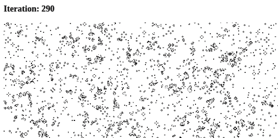

# 第五章：高级共享内存

第四章介绍了使用`SharedArrayBuffer`对象直接从不同线程读取和写入共享数据的方法。但这样做是有风险的，因为一个线程可能会破坏另一个线程写入的数据。然而，由于`Atomics`对象的存在，您可以以一种方式对数据执行非常基本的操作，以防止数据被破坏。

尽管`Atomics`提供的基本操作非常方便，但通常您会发现自己需要执行更复杂的数据交互。例如，一旦您按照“数据序列化”中描述的方法对数据进行了序列化，如 1 千字节字符串，然后需要将该数据写入`SharedArrayBuffer`实例中，而现有的`Atomics`方法均不能一次性设置整个值。

本章介绍了用于协调跨线程共享数据的额外功能，适用于先前讨论的`Atomics`方法不足以满足需求的情况。

# 协调的原子方法

这些方法与之前讨论过的方法有些不同，之前讨论的方法可以使用任何类型的`TypedArray`，并且可以操作`SharedArrayBuffer`和`ArrayBuffer`实例。然而，这里列出的方法只适用于`Int32Array`和`BigInt64Array`实例，并且只在与`SharedArrayBuffer`实例一起使用时才有意义。

如果您尝试在错误类型的`TypedArray`上使用这些方法，将会收到以下错误之一：

```
# Firefox v88
Uncaught TypeError: invalid array type for the operation

# Chrome v90 / Node.js v16
Uncaught TypeError: [object Int8Array] is not an int32 or BigInt64 typed array.
```

至于先前的技术，这些方法是基于 Linux 内核中称为*futex*的功能设计的。*Futex*是*fast userspace mutex*的缩写。*Mutex*本身是*mutual exclusion*的缩写，即单个执行线程对特定数据的独占访问。Mutex 也可以称为*lock*，其中一个线程锁定数据访问，执行操作，然后解锁访问，允许另一个线程接触数据。Futex 建立在两种基本操作上，一种是“等待”，另一种是“唤醒”。

## Atomics.wait()

```
status = Atomics.wait(typedArray, index, value, timeout = Infinity)
```

此方法首先检查`typedArray`中索引为`index`的值是否等于`value`。如果不等，则函数返回值为`not-equal`。如果相等，则会冻结线程最多`timeout`毫秒。如果在此期间没有发生任何事情，则函数返回值为`timed-out`。另一方面，如果另一个线程在此时间段内为相同的`index`调用`Atomics.notify()`，则函数将返回值为`ok`。表 5-1 列出了这些返回值。

表 5-1\. `Atomics.wait()`的返回值

| 值 | 含义 |
| --- | --- |
| `not-equal` | 提供的`value`与缓冲区中的值不相等。 |
| `timed-out` | 另一个线程在指定的`timeout`内没有调用`Atomics.notify()`。 |
| `ok` | 另一个线程在规定时间内调用了`Atomics.notify()`。 |

你可能会想为什么这种方法在前两个条件下不会抛出错误，而是悄悄地成功而不是返回`ok`。因为多线程编程是为了性能而使用的，因此合理推断调用这些`Atomics`方法将在应用程序的*热路径*中完成，这些路径是应用程序花费大部分时间的地方。在 JavaScript 中，实例化`Error`对象并生成堆栈跟踪比返回简单字符串的性能要差，因此这种方法的性能非常高。另一个原因是`not-equal`情况实际上并不代表错误情况，而是你正在等待的事情已经发生了。

这种阻塞行为可能一开始会有点震惊。锁定整个线程听起来有点强烈，在许多情况下确实如此。导致整个 JavaScript 线程锁定的另一个例子是浏览器中的`alert()`函数。调用该函数时，浏览器会显示对话框，直到对话框关闭后，没有任何背景任务（包括使用事件循环的任何后台任务）都不能运行。类似地，`Atomics.wait()`方法会冻结线程。

事实上，这种行为非常极端，即“主”线程——在运行 JavaScript 时默认可用的线程，在 Web Worker 之外——至少在浏览器中不允许调用此方法。原因是锁定主线程会导致非常糟糕的用户体验，因此 API 的作者甚至不想允许这样做。如果你试图在浏览器的主线程中调用此方法，你将会收到以下错误之一：

```
# Firefox
Uncaught TypeError: waiting is not allowed on this thread

# Chrome v90
Uncaught TypeError: Atomics.wait cannot be called in this context
```

另一方面，Node.js 允许在主线程中调用`Atomics.wait()`。由于 Node.js 没有 UI，这并不一定是一件坏事。实际上，在编写允许调用`fs.readFileSync()`的脚本时，这可能会很有用。

如果你是一名 JavaScript 开发人员，曾在一个有移动或桌面开发人员的公司工作过，你可能听到他们谈论“将工作从主线程转移”或“锁定主线程”。这些关注点传统上属于本机应用程序的开发人员，随着语言的进步，我们 JavaScript 工程师将会越来越多地享受到这些好处。在浏览器方面，这个问题通常被称为*滚动卡顿*，即在滚动时 CPU 太忙无法绘制 UI。

## `Atomics.notify()`

```
awaken = Atomics.notify(typedArray, index, count = Infinity)
```

`Atomics.notify()`^(1) 方法尝试唤醒那些在相同的 `typedArray` 和相同 `index` 上调用了 `Atomics.wait()` 的其他线程。如果有其他线程当前处于冻结状态，它们将被唤醒。多个线程可以同时处于冻结状态，每个线程等待被通知。然后 `count` 值决定唤醒多少个线程。`count` 值默认为 `Infinity`，意味着每个线程都将被唤醒。然而，如果有四个线程在等待并且将值设置为三，则除了一个线程外，其他所有线程都将被唤醒。“时序和非确定性” 探讨了这些唤醒线程的顺序问题。

方法完成后的返回值是已唤醒的线程数。如果传入指向非共享 `ArrayBuffer` 实例的 `TypedArray` 实例，则始终返回 `0`。如果此时没有任何线程在监听，它也会返回 `0`。由于此方法不会阻塞线程，因此可以始终从主 JavaScript 线程中调用。

## Atomics.waitAsync()

```
promise = Atomics.waitAsync(typedArray, index, value, timeout = Infinity)
```

这本质上是 `Atomics` 家族中 `Atomics.wait()` 的基于 promise 的版本。截至撰写本文时，它在 Node.js v16 和 Chrome v87 中可用，但尚未在 Firefox 或 Safari 中可用。

此方法本质上是 `Atomics.wait()` 的性能较差的非阻塞版本，它返回一个解析等待操作状态的 promise。由于性能下降（解析的 promise 比暂停线程并返回字符串的开销更大），它并不一定适用于 CPU 密集型算法的热路径。另一方面，在锁定更改更便于通过信号另一个线程而不是通过 `postMessage()` 执行消息传递操作的情况下，它可能会更有用。由于此方法不会阻塞线程，因此可以在应用程序的主线程中使用。

添加此方法的主要驱动因素之一是，使用 Emscripten 编译的代码（在 “使用 Emscripten 将 C 程序编译为 WebAssembly” 中介绍）可以利用线程而不仅限于工作线程中执行。

# 时序和非确定性

为了确保应用程序的正确性，通常需要它以确定性方式运行。`Atomics.notify()` 函数接受一个名为 `count` 的参数，其中包含要唤醒的线程数。在这种情况下显而易见的问题是哪些线程会被唤醒，以及它们的唤醒顺序是什么？

## 非确定性示例

线程按 *FIFO*（先进先出）顺序被唤醒，这意味着调用 `Atomics.wait()` 的第一个线程将第一个被唤醒，第二个调用的线程将第二个被唤醒，依此类推。然而，测量这一点可能很困难，因为来自不同工作者的日志消息不能保证以真实的执行顺序显示在终端中。理想情况下，您应该构建您的应用程序，使其继续正常工作，而不受唤醒线程的顺序影响。

想要亲自测试这个，你可以创建一个新的应用程序。首先，创建一个名为 *ch5-notify-order/* 的新目录。在其中，通过使用来自 示例 5-1 的内容，创建另一个基本的 *index.html* 文件。

##### 示例 5-1\. *ch5-notify-order/index.html*

```
<html>
  <head>
    <title>Shared Memory for Coordination</title>
    <script src="main.js"></script>
  </head>
</html>
```

接下来，创建另一个 *main.js* 文件，其中包含来自 示例 5-2 的内容。

##### 示例 5-2\. *ch5-notify-order/main.js*

```
if (!crossOriginIsolated) throw new Error('Cannot use SharedArrayBuffer');

const buffer = new SharedArrayBuffer(4);
const view = new Int32Array(buffer);

for (let i = 0; i < 4; i++) { 
  const worker = new Worker('worker.js');
  worker.postMessage({buffer, name: i});
}

setTimeout(() => {
  Atomics.notify(view, 0, 3); 
}, 500); 
```


四个专用工作者被实例化。


共享缓冲器在索引 0 处被通知。


通知每半秒发送一次。

此文件首先创建一个 4 字节的缓冲区，这是支持所需 `Int32Array` 视图的最小缓冲区。接下来，它使用 `for` 循环创建四个不同的专用工作者。对于每个工作者，它立即调用适当的 `postMessage()` 调用，传递缓冲区以及线程的标识符。这导致我们关心的五个不同的线程；即主线程和我们命名为 0、1、2 和 3 的线程。

JavaScript 创建这些线程，底层引擎开始组装资源，分配内存，以及在幕后为我们做很多魔法。执行这些任务所需的时间是不确定的，这很不幸。我们无法知道，例如，完成准备工作是否总是需要 100 毫秒。事实上，这个数字将根据机器的核心数量以及代码运行时机器的繁忙程度而大幅变化。幸运的是，`postMessage()` 调用基本上已经为我们排队了；JavaScript 引擎会在准备好后调用工作者的 `onmessage` 函数。

之后，主线程完成其工作，然后使用`setTimeout`等待半秒钟（500 毫秒），最后调用`Atomics.notify()`。如果`setTimeout`值过低，比如 10 毫秒，会发生什么？或者甚至在同一堆栈外调用？在这种情况下，线程尚未初始化，工作者没有时间调用`Atomics.wait()`，调用将立即返回`0`。如果时间值太高会发生什么？那么应用程序可能会非常缓慢，或者`Atomics.wait()`使用的任何`timeout`值可能已超过。

在 Thomas 的笔记本电脑上，就绪阈值似乎在约 120 毫秒左右。此时一些线程已准备好，一些则没有。通常在大约 100 毫秒时，没有任何线程准备好，在 180 毫秒时，通常所有线程都准备好了。但是“通常”是我们在编程中不喜欢使用的词语。确切地知道线程准备好之前的时间很难。通常这只是在首次启动应用程序时出现的问题，而不是应用程序整个生命周期中的问题。

要完成应用程序，创建一个名为*worker.js*的文件，并将示例 5-3 中的内容添加到其中。

##### 示例 5-3。*ch5-notify-order/worker.js*

```
self.onmessage = ({data: {buffer, name}}) => {
  const view = new Int32Array(buffer);
  console.log(`Worker ${name} started`);
  const result = Atomics.wait(view, 0, 0, 1000); 
  console.log(`Worker ${name} awoken with ${result}`);
};
```


在缓冲区的第 0 条目上等待，假定初始值为`0`，最多等待 1 秒钟。

工作者接受共享缓冲区和工作者线程的名称，并存储这些值，并打印线程已初始化的消息。然后，它调用`Atomics.wait()`，使用缓冲区的第 0 索引。它假设缓冲区中存在初始值`0`（因为我们尚未修改该值）。该方法调用还使用了`timeout`值为一秒（1,000 毫秒）。最后，一旦方法调用完成，值将在终端上打印出来。

创建完这些文件后，切换到终端并运行另一个 Web 服务器以查看内容。同样，您可以通过运行以下命令来执行此操作：

```
$ npx MultithreadedJSBook/serve .
```

如往常一样，导航到终端中打印的 URL 并打开控制台。如果看不到任何输出，可能需要刷新页面以再次运行应用程序。表 5-2 包含测试运行的输出。

表 5-2。示例非确定性输出

| 记录 | 位置 |
| --- | --- |
| Worker 1 已启动 | worker.js:4:11 |
| Worker 0 已启动 | worker.js:4:11 |
| Worker 3 已启动 | worker.js:4:11 |
| Worker 2 已启动 | worker.js:4:11 |
| Worker 0 因成功唤醒 | worker.js:7:11 |
| Worker 3 因成功唤醒 | worker.js:7:11 |
| Worker 1 因成功唤醒 | worker.js:7:11 |
| Worker 2 因超时唤醒 | worker.js:7:11 |

你很可能会得到不同的输出。事实上，如果你再次刷新页面，你可能会再次得到不同的输出。或者，即使在多次运行中，你可能会得到一致的输出。但理想情况下，与“启动”消息一起打印的最后一个工作者名称也将是失败并显示“超时”消息的工作者。

这个输出可能会有些混乱。早些时候我们说过，顺序似乎是先进先出的，但这里的数字并不是从 0 到 3。原因在于顺序并不取决于线程的创建顺序（0, 1, 2, 3），而是取决于线程执行`Atomics.wait()`调用的顺序（在这种情况下是 1, 0, 3, 2）。即使有了这个认识，被“唤醒”的消息的顺序也很混乱（在这种情况下是 0, 3, 1, 2）。这很可能是 JavaScript 引擎中的竞态条件导致的，不同线程几乎在完全相同的时刻打印消息。

打印后，消息不会直接显示在屏幕上。如果可能的话，这些消息可能会互相覆盖，导致像素出现视觉撕裂。相反，引擎会将消息排队等待打印，并且浏览器内部的某种机制（但我们开发者看不到）决定了从队列中取出和打印消息的顺序。因此，两组消息的顺序不一定会相关联。但是唯一确定任何顺序的方法是超时消息恰好来自最后启动的线程。实际上，在这种情况下，“超时”消息总是来自最后启动的工作者。

## 检测线程准备就绪

这个实验引发了一个问题：一个应用程序如何确定一个线程何时完成了初始设置并准备好承担工作？

一个简单的方法是在工作者线程中从`onmessage()`处理程序的某个时间点开始调用`postMessage()`返回给父线程。这是有效的，因为一旦调用了`onmessage()`处理程序，工作者线程就完成了初始设置，现在正在运行 JavaScript 代码。

这里有一个快速完成这个任务的例子。首先，复制你创建的*ch5-notify-order/*目录，粘贴为一个新的*ch5-notify-when-ready/*目录。在这个目录中，*index.html*文件保持不变，但是两个 JavaScript 文件将被更新。首先，更新*main.js*以包含示例 5-4 中的内容。

##### 示例 5-4\. *ch5-notify-when-ready/main.js*

```
if (!crossOriginIsolated) throw new Error('Cannot use SharedArrayBuffer');

const buffer = new SharedArrayBuffer(4);
const view = new Int32Array(buffer);
const now = Date.now();
let count = 4;

for (let i = 0; i < 4; i++) { 
  const worker = new Worker('worker.js');
  worker.postMessage({buffer, name: i}); 
  worker.onmessage = () => {
    console.log(`Ready; id=${i}, count=${--count}, time=${Date.now() - now}ms`);
    if (count === 0) { 
      Atomics.notify(view, 0);
    }
  };
}
```


实例化四个工作者。


立即向工作者发送消息。


一旦所有四个工作者回复，就在第 0 个条目上发出通知。

脚本已经修改，以便在四个工作线程中的每个都向主线程发送消息后调用 `Atomics.notify()`。一旦第四个也是最后一个工作线程发送了消息，就会发送通知。这允许应用程序在准备就绪时立即发送消息，在最好的情况下可能节省数百毫秒，在最坏的情况下（例如在非常慢的单核计算机上运行代码时）则防止失败。

`Atomics.notify()` 调用也已更新为仅唤醒所有线程，而不仅仅是三个，并且超时已恢复为默认的 `Infinity`。这样做是为了显示每个线程都将及时接收到消息。

接下来，更新 *worker.js* 以包含来自 示例 5-5 的内容。

##### 示例 5-5\. *ch5-notify-when-ready/worker.js*

```
self.onmessage = ({data: {buffer, name}}) => {
  postMessage('ready'); 
  const view = new Int32Array(buffer);
  console.log(`Worker ${name} started`);
  const result = Atomics.wait(view, 0, 0); 
  console.log(`Worker ${name} awoken with ${result}`);
};
```


向父线程发送消息以表明准备就绪。


等待第 0 个条目的通知。

这次 `onmessage` 处理程序立即调用 `postMessage()` 向父线程发送消息。然后不久之后发生等待调用。从技术上讲，如果父线程在 `Atomics.wait()` 调用之前某种方式接收到消息，则应用程序可能会崩溃。但代码依赖于消息传递比在同步 JavaScript 函数中迭代代码行要慢得多的事实。

有一点需要记住，调用 `Atomics.wait()` 将暂停线程。这意味着之后不能再调用 `postMessage()`。

运行此代码时，新的日志将输出三条信息：线程名称、倒计时（始终为 3、2、1、0 的顺序）以及线程自脚本启动以来的准备时间。运行与之前相同的命令，并在浏览器中打开生成的 URL。表 5-3 包含了一些示例运行的日志输出。

表 5-3\. 线程启动时间

| Firefox v88 | Chrome v90 |
| --- | --- |
| T1, 86ms | T0, 21ms |
| T0, 99ms | T1, 24ms |
| T2, 101ms | T2, 26ms |
| T3, 108ms | T3, 29ms |

在这种情况下，使用 16 核笔记本电脑，Firefox 初始化工作线程似乎要比 Chrome 慢四倍左右。此外，Firefox 给出的线程顺序比 Chrome 更随机。每次刷新页面时，Firefox 的线程顺序都会改变，但 Chrome 的顺序不会。这表明 Chrome 使用的 V8 引擎在启动新的 JavaScript 环境或实例化浏览器 API 方面比 Firefox 使用的 SpiderMonkey 引擎更加优化。

请务必在多个浏览器中测试此代码，以比较所得到的结果。另一件需要注意的事情是，初始化线程所需的速度很可能取决于计算机上可用的核心数。事实上，要通过此程序增添些乐趣，将分配给`count`变量和`for`循环的值从`4`改为更高的数字，然后运行代码并观察结果。将值增加到`128`后，两个浏览器初始化线程所花费的时间显著增加。这也会在 Chrome 上一贯地破坏线程准备的顺序。通常情况下，使用过多线程会降低性能，这在“低核心计数”中有更详细的分析。

# 示例应用：康威生命游戏（Conway's Game of Life）

现在我们已经看过`Atomics.wait()`和`Atomics.notify()`，是时候看一个具体的例子了。我们将使用康威生命游戏，这是一个自然适合并行编程的成熟概念。这个“游戏”实际上是人口增长和衰退的模拟。这个模拟存在于一个网格中，网格中的细胞处于两种状态之一：存活或死亡。模拟是迭代进行的，每次迭代对每个细胞执行以下算法。

1.  如果细胞死亡：

    1.  如果有 2 或 3 个邻居存活，则细胞保持存活。

    1.  如果有 0 个或 1 个邻居存活，则细胞死亡（这模拟了由于生育不足而导致的死亡）。

    1.  如果有 4 个或更多邻居存活，则细胞死亡（这模拟了由于过度生育而导致的死亡）。

1.  如果细胞死亡：

    1.  如果恰好有 3 个邻居存活，则细胞变为存活（这模拟了繁殖）。

    1.  在任何其他情况下，细胞保持死亡状态。

当谈到“邻居存活”时，我们指的是任何距离当前细胞至多一单元的细胞，包括对角线方向，并且我们指的是当前迭代之前的状态。我们可以将这些规则简化为以下形式。

1.  如果恰好有 3 个邻居存活，新细胞状态为存活（无论其起始状态如何）。

1.  如果细胞存活且恰好有 2 个邻居存活，则细胞保持存活。

1.  在所有其他情况下，新细胞状态为死亡。

对于我们的实现，我们将做出以下假设：

+   网格是一个正方形。这是一个轻微的简化，因此少了一个维度的担忧。

+   网格像一个环面一样环绕自身。这意味着当我们处于边缘时，需要评估超出边界的邻居细胞时，我们会看到另一端的细胞。

我们将编写我们的代码用于 Web 浏览器，因为它们为我们提供了一个便捷的画布元素来绘制生命游戏世界的状态。话虽如此，在其他具有某种图像渲染的环境中适应这个示例也是相对简单的。在 Node.js 中，甚至可以使用 ANSI 转义码向终端写入。

## 单线程生命游戏

首先，我们将构建一个`Grid`类，它将我们的生命游戏世界作为一个数组，并处理每次迭代。我们将以一种与前端无关的方式构建它，甚至在多线程示例中也可以使用它而无需进行任何更改。为了正确模拟生命游戏，我们需要一个多维数组来表示我们的单元格网格。我们可以使用数组的数组，但为了稍后简化事务，我们将其存储在一个一维数组中（实际上是`Uint8Array`），然后对于任何具有坐标`x`和`y`的单元格，我们将其存储在数组中的位置`cells[size * x + y]`。我们还需要两个这样的数组，因为一个将用于当前状态，另一个用于先前状态。为了稍后更轻松地简化事务，我们将它们顺序存储在同一个`ArrayBuffer`中。

创建一个名为*ch5-game-of-life/*的目录，并将示例 5-6 的内容添加到该目录下的*gol.js*中。

##### 示例 5-6\. *ch5-game-of-life/gol.js*（第一部分）

```
class Grid {
  constructor(size, buffer, paint = () => {}) {
    const sizeSquared = size * size;
    this.buffer = buffer;
    this.size = size;
    this.cells = new Uint8Array(this.buffer, 0, sizeSquared);
    this.nextCells = new Uint8Array(this.buffer, sizeSquared, sizeSquared);
    this.paint = paint;
  }
```

这里我们用构造函数开始了`Grid`类。它接受一个`size`，这是我们正方形的宽度，一个名为`buffer`的`ArrayBuffer`，以及一个稍后将要使用的`paint`函数。然后我们将我们的`cells`和`nextCells`作为`Uint8Array`的实例存储在`buffer`中的相邻位置。

接下来，当执行迭代时，我们可以添加后面需要的单元格检索方法。将代码添加到示例 5-7 中。

##### 示例 5-7\. *ch5-game-of-life/gol.js*（第二部分）

```
  getCell(x, y) {
    const size = this.size;
    const sizeM1 = size - 1;
    x = x < 0 ? sizeM1 : x > sizeM1 ? 0 : x;
    y = y < 0 ? sizeM1 : y > sizeM1 ? 0 : y;
    return this.cells[size * x + y];
  }
```

要根据给定的坐标集检索单元格，我们需要对索引进行规范化。回想一下，我们说过网格是环绕的。我们在这里进行的规范化确保，如果超出范围的上下单位，我们将检索到范围另一端的单元格。

现在，我们将添加在每次迭代时运行的实际算法。将代码添加到示例 5-8 中。

##### 示例 5-8\. *ch5-game-of-life/gol.js*（第三部分）

```
  static NEIGHBORS =  ![1
    [-1, -1], [-1, 0], [-1, 1], [0, -1], [0, 1], [1, -1], [1, 0], [1, 1]
  ];

  iterate(minX, minY, maxX, maxY) { 
    const size = this.size;

    for (let x = minX; x < maxX; x++) {
      for (let y = minY; y < maxY; y++) {
        const cell = this.cells[size * x + y];
        let alive = 0;
        for (const [i, j] of Grid.NEIGHBORS) {
          alive += this.getCell(x + i, y + j);
        }
        const newCell = alive === 3 || (cell && alive === 2) ? 1 : 0;
        this.nextCells[size * x + y] = newCell;
        this.paint(newCell, x, y);
      }
    }

    const cells = this.nextCells;
    this.nextCells = this.cells;
    this.cells = cells;
  }
}
```


算法中使用的邻居坐标集用于查看八个方向上的相邻单元格。我们会将这个数组放在手边，因为每个单元格都需要使用它。


`iterate()`方法接受一个操作范围，以最小 X 和 Y 值（包含）和最大 X 和 Y 值（不包含）的形式。对于我们的单线程示例，它将始终是`(0, 0, size, size)`，但在我们转移到多线程实现时，将在这里放置一个范围将使其更容易分割整个网格，以便每个线程可以处理的部分。

我们遍历网格中的每个单元格，并计算每个单元格周围存活的邻居数量。我们使用数字 `1` 表示存活的单元格，使用 `0` 表示死亡的单元格，因此可以通过累加来计算周围存活的邻居数量。一旦计算出来，我们就可以应用简化的生命游戏算法。我们将新的单元格状态存储在 `nextCells` 数组中，并将新的单元格状态和坐标提供给 `paint` 回调函数以进行可视化。然后我们交换 `cells` 和 `nextCells` 数组，以便在后续迭代中使用。这样，在每次迭代中，`cells` 始终代表前一次迭代的结果，而 `newCells` 始终代表当前迭代的结果。

到目前为止的所有代码将与我们的多线程实现共享。完成 `Grid` 类后，我们现在可以继续创建和初始化一个 `Grid` 实例，并将其与我们的用户界面绑定。添加来自 示例 5-9 的代码。

##### 示例 5-9\. *ch5-game-of-life/gol.js*（第四部分）

```
const BLACK = 0xFF000000; 
const WHITE = 0xFFFFFFFF;
const SIZE = 1000;

const iterationCounter = document.getElementById('iteration'); 
const gridCanvas = document.getElementById('gridcanvas');
gridCanvas.height = SIZE;
gridCanvas.width = SIZE;
const ctx = gridCanvas.getContext('2d');
const data = ctx.createImageData(SIZE, SIZE); 
const buf = new Uint32Array(data.data.buffer);

function paint(cell, x, y) { 
  buf[SIZE * x + y] = cell ? BLACK : WHITE;
}

const grid = new Grid(SIZE, new ArrayBuffer(2 * SIZE * SIZE), paint); 
for (let x = 0; x < SIZE; x++) { 
  for (let y = 0; y < SIZE; y++) {
    const cell = Math.random() < 0.5 ? 0 : 1;
    grid.cells[SIZE * x + y] = cell;
    paint(cell, x, y);
  }
}

ctx.putImageData(data, 0, 0); 
```


我们为将绘制到屏幕上的黑白像素分配一些常量，并设置我们使用的网格的大小（实际上是宽度）。可以随意调整大小，以查看不同规模下生命游戏的表现。


我们从 HTML 中获取迭代计数器和画布元素（稍后将进行编写）。我们将设置画布的宽度和高度为 `SIZE`，并从中获取一个 2D 上下文来进行操作。


我们将使用一个 `ImageData` 实例直接修改画布上的像素，通过 `Uint32Array`。


这个 `paint()` 函数将用于初始化网格和在每次迭代中修改支持 `ImageData` 实例的缓冲区。如果单元格是活着的，它将绘制为黑色；否则，绘制为白色。


现在我们创建网格实例，传入大小、足够大以容纳 `cells` 和 `nextCells` 的 `ArrayBuffer`，以及我们的 `paint()` 函数。


为了初始化网格，我们将遍历所有单元格，并为每个分配一个随机的生死状态。同时，我们将结果传递给我们的 `paint()` 函数，以确保图像得到更新。


每当修改 `ImageData` 后，我们都需要将其添加回画布中，所以我们现在在这里执行初始化完成后的操作。

最后，我们准备开始运行迭代。添加来自 示例 5-10 的代码。

##### 示例 5-10\. *ch5-game-of-life/gol.js*（第五部分）

```
let iteration = 0;
function iterate(...args) {
  grid.iterate(...args);
  ctx.putImageData(data, 0, 0);
  iterationCounter.innerHTML = ++iteration;
  window.requestAnimationFrame(() => iterate(...args));
}

iterate(0, 0, SIZE, SIZE);
```

每次迭代，我们都会调用 `grid.iterate()` 方法，根据需要修改单元格。请注意，它为每个单元格调用 `paint()` 函数，一旦发生这种情况，我们的图像数据就已经设置好了，所以我们只需用 `putImageData()` 将其添加到画布上下文中。然后，我们将在页面上更新迭代计数器，并安排在 `requestAnimationFrame()` 回调中进行另一次迭代。最后，我们通过初始调用 `iterate()` 来启动一切。

我们已经完成了 JavaScript 的部分，但现在我们需要支持 HTML。幸运的是，这很简短。将 Example 5-11 的内容添加到同一目录下名为 *gol.html* 的文件中，然后在浏览器中打开该文件。

##### Example 5-11\. *ch5-game-of-life/gol.html*

```
<h3>Iteration: <span id="iteration">0</span></h3>
<canvas id="gridcanvas"></canvas>
<script src="gol.js"></script>
```

现在，您应该能够看到一个 1,000 x 1,000 的图像，显示康威生命游戏，尽可能快地进行迭代。它应该看起来类似于 Figure 5-1。

根据您的计算机性能，您可能会发现它稍微有些延迟，而不是清晰流畅。在所有这些单元格上进行迭代并对其进行计算需要大量的计算能力。为了加快速度，让我们利用您机器上更多的 CPU 核心，使用 Web Worker 线程。



###### Figure 5-1\. 290 次迭代后的康威生命游戏

## 多线程生命游戏

对于我们的多线程生命游戏实现版本，我们可以重用大部分代码。特别是 HTML 不会更改，`Grid` 类也不会更改。我们将设置一些工作线程和一个额外的协调线程来修改图像数据。我们需要额外的线程，因为我们不能在主浏览器线程上使用 `Atomics.wait()`。我们将使用 `SharedArrayBuffer`，而不是单线程示例中使用的常规 `ArrayBuffer`。为了协调线程，我们需要 8 字节来进行协调，具体来说是每个方向 4 个字节，因为 `Atomics.wait()` 至少需要一个 `Int32Array`。由于我们的协调线程还将生成图像数据，因此我们还需要足够的共享内存来保存这些数据。对于边长为 `SIZE` 的网格，这意味着一个 `SharedArrayBuffer`，其内存布局如 Table 5-4 所示。

Table 5-4\. 四个工作线程的内存布局

| Purpose | # of Bytes |
| --- | --- |
| Cells (or next cells) | `SIZE * SIZE` |
| Cells (or next cells) | `SIZE * SIZE` |
| Image data | `4 * SIZE * SIZE` |
| Worker thread wait | `4` |
| Coordination thread wait | `4` |

要开始，请将上一个示例中的 *.html* 和 *.js* 文件复制到名为 *thread-gol.html* 和 *thread-gol.js* 的新文件中。分别编辑 *thread-gol.html*，引用这个新的 JavaScript 文件。

删除 `Grid` 类定义之后的所有内容。接下来，我们将设置一些常量。在 *thread-gol.js* 中添加 Example 5-12。

##### 示例 5-12。*ch5-game-of-life/thread-gol.js*（第一部分）

```
const BLACK = 0xFF000000;
const WHITE = 0xFFFFFFFF;
const SIZE = 1000;
const THREADS = 5; // must be a divisor of SIZE

const imageOffset = 2 * SIZE * SIZE
const syncOffset = imageOffset + 4 * SIZE * SIZE;

const isMainThread = !!self.window;
```

`BLACK`、`WHITE`和`SIZE`常量与单线程示例中的目的相同。我们将这个`THREADS`常量设置为`SIZE`的任何可以整除的数字，它将代表我们为执行生命游戏计算而生成的工作线程数。我们将网格划分为每个线程可以处理的块。可以随意调整`THREADS`和`SIZE`变量，只要`THREADS`能够整除`SIZE`。我们需要处理图像数据和同步字节存储位置的偏移量，因此在此处处理它们。最后，我们将使用相同的文件在主线程和任何工作线程上运行，因此我们需要一种方法来知道我们当前是否在主线程上。

接下来，我们将开始编写主线程的代码。添加示例 5-13 的内容。

##### 示例 5-13。*ch5-game-of-life/thread-gol.js*（第二部分）

```
if (isMainThread) {
  const gridCanvas = document.getElementById('gridcanvas');
  gridCanvas.height = SIZE;
  gridCanvas.width = SIZE;
  const ctx = gridCanvas.getContext('2d');
  const iterationCounter = document.getElementById('iteration');

  const sharedMemory = new SharedArrayBuffer( 
    syncOffset + // data + imageData
    THREADS * 4 // synchronization
  );
  const imageData = new ImageData(SIZE, SIZE);
  const cells = new Uint8Array(sharedMemory, 0, imageOffset);
  const sharedImageBuf = new Uint32Array(sharedMemory, imageOffset);
  const sharedImageBuf8 =
    new Uint8ClampedArray(sharedMemory, imageOffset, 4 * SIZE * SIZE);

  for (let x = 0; x < SIZE; x++) {
    for (let y = 0; y < SIZE; y++) {
      // 50% chance of cell being alive
      const cell = Math.random() < 0.5 ? 0 : 1;
      cells[SIZE * x + y] = cell;
      sharedImageBuf[SIZE * x + y] = cell ? BLACK : WHITE;
    }
  }

  imageData.data.set(sharedImageBuf8);
  ctx.putImageData(imageData, 0, 0);
```


`SharedArrayBuffer`的结束比`syncOffset`晚了 16 个字节，因为我们需要为每个线程的同步分配 4 个字节。

这部分的第一部分与单线程示例中的大致相同。我们只是获取 DOM 元素并设置网格大小。接下来，我们设置了`SharedArrayBuffer`，我们称之为`sharedMemory`，并为其`cells`（我们很快将为其分配值）放置了视图，并获取了图像数据。我们将使用`Uint32Array`和`Uint8ClampedArray`两种方式处理图像数据，用于修改和分配到`ImageData`实例。

然后，我们将随机初始化网格，并同时相应地修改图像数据并将该图像数据填充到画布上下文中。这为网格设置了初始状态。此时，我们可以开始生成工作线程。添加示例 5-14 的内容。

##### 示例 5-14。*ch5-game-of-life/thread-gol.js*（第三部分）

```
  const chunkSize = SIZE / THREADS;
  for (let i = 0; i < THREADS; i++) {
    const worker = new Worker('thread-gol.js', { name: `gol-worker-${i}` });
    worker.postMessage({
      range: [0, chunkSize * i, SIZE, chunkSize * (i + 1)],
      sharedMemory,
      i
    });
  }

  const coordWorker = new Worker('thread-gol.js', { name: 'gol-coordination' });
  coordWorker.postMessage({ coord: true, sharedMemory });

  let iteration = 0;
  coordWorker.addEventListener('message', () => {
    imageData.data.set(sharedImageBuf8);
    ctx.putImageData(imageData, 0, 0);
    iterationCounter.innerHTML = ++iteration;
    window.requestAnimationFrame(() => coordWorker.postMessage({}));
  });
```

我们使用循环设置了一些工作线程。对于每个线程，我们为调试目的给它分配了一个唯一的名称，向其发送了一条消息，告诉它我们希望它操作网格的哪个范围（即边界`minX`、`minY`、`maxX`和`maxY`），并发送了`sharedMemory`。然后，我们添加了一个协调工作线程，传递了`sharedMemory`，并通过消息告知它是协调工作线程。

从主浏览器线程开始，我们只与这个协调工作线程交互。我们将设置它，使其在接收到消息后每次都会发出一条消息，但仅在从`SharedMemory`获取图像数据，进行适当的 UI 更新并请求动画帧之后才这样做。

代码的其余部分在其他线程中运行。添加示例 5-15 的内容。

##### 示例 5-15。*ch5-game-of-life/thread-gol.js*（第四部分）

```
} else {
  let sharedMemory;
  let sync;
  let sharedImageBuf;
  let cells;
  let nextCells;

  self.addEventListener('message', initListener);

  function initListener(msg) {
    const opts = msg.data;
    sharedMemory = opts.sharedMemory;
    sync = new Int32Array(sharedMemory, syncOffset);
    self.removeEventListener('message', initListener);
    if (opts.coord) {
      self.addEventListener('message', runCoord);
      cells = new Uint8Array(sharedMemory);
      nextCells = new Uint8Array(sharedMemory, SIZE * SIZE);
      sharedImageBuf = new Uint32Array(sharedMemory, imageOffset);
      runCoord();
    } else {
      runWorker(opts);
    }
  }
```

我们现在在 `isMainThread` 条件的另一侧，因此我们知道我们在工作线程或协调线程中。在这里，我们声明一些变量，然后向 `message` 事件添加一个初始监听器。无论这是协调线程还是工作线程，我们都需要填充 `sharedMemory` 和 `sync` 变量，因此我们在监听器中进行分配。然后我们移除初始化监听器，因为我们不再需要它。工作线程根本不依赖消息传递，协调线程将有一个不同的监听器，稍后我们将看到。

如果我们初始化了协调线程，我们将添加一个新的 `message` 监听器；一个稍后我们将定义的 `runCoord` 函数。然后我们将获取 `cells` 和 `nextCells` 的引用，因为我们需要将协调线程中正在进行的 `Grid` 实例与工作线程中的不同步。由于我们在协调线程上生成图像，所以我们也需要它。然后我们运行 `runCoord` 的第一次迭代。如果我们初始化了工作线程，我们只需将包含操作范围的选项传递给 `runWorker()`。

现在让我们定义 `runWorker()`。现在就添加 Example 5-16 的内容。

##### 示例 5-16\. *ch5-game-of-life/thread-gol.js*（第五部分）

```
  function runWorker({ range, i }) {
    const grid = new Grid(SIZE, sharedMemory);
    while (true) {
      Atomics.wait(sync, i, 0);
      grid.iterate(...range);
      Atomics.store(sync, i, 0);
      Atomics.notify(sync, i);
    }
  }
```

工作线程是唯一需要 `Grid` 类实例的线程，所以我们首先实例化它，并将 `sharedMemory` 作为后备缓冲传递进去。这样做的原因是因为我们决定 `sharedMemory` 的第一部分将是 `cells` 和 `nextCells`，就像单线程示例中一样。

然后我们启动一个无限循环。循环执行以下操作：

1.  在 `sync` 数组的第 `i` 个元素上执行 `Atomics.wait()`。在协调线程中，我们将执行适当的 `Atomics.notify()` 来允许这一过程继续。我们在这里等待协调线程，因为否则我们可能在其他线程准备好并且数据已经传递到主浏览器线程之前开始改变数据并交换对 `cells` 和 `nextCells` 的引用。

    然后在 `Grid` 实例上执行迭代。请记住，我们仅在协调线程通过 `range` 属性指定的范围上操作。

1.  完成后，通知主线程已完成此任务。通过使用 `Atomics.store()` 将 `sync` 数组的第 `i` 个元素设置为 `1`，然后通过 `Atomics.notify()` 唤醒等待的线程。我们使用从 `0` 状态转移作为应该执行一些工作的指示器，并在转移回 `0` 状态时通知我们已完成工作。

我们正在使用`Atomics.wait()`来阻止协调线程在工作线程修改数据时执行，然后使用`Atomics.wait()`来阻止工作线程在协调线程执行其工作时执行。在两端，我们使用`Atomics.notify()`唤醒另一个线程，并立即进入等待状态，等待另一个线程再次通知。因为我们使用原子操作来修改数据并控制何时修改它，所以我们知道所有的数据访问都是*顺序一致*的。在跨线程的交错程序流中，死锁不会发生，因为我们总是在协调线程和工作线程之间来回切换执行。工作线程永远不会在内存的相同部分执行，因此我们不必单独从工作线程的角度担心这个概念。

工作线程可以无限地运行。我们不必担心那个无限循环，因为它只会在`Atomics.wait()`返回时继续进行，而这需要另一个线程为相同的数组元素调用`Atomics.notify()`。

让我们通过`runCoord()`函数来结束这里的代码，该函数是在主浏览器线程初始化消息后通过消息触发的。添加示例 5-17 的内容。

##### 示例 5-17\. *ch5-game-of-life/thread-gol.js*（第六部分）

```
  function runCoord() {
    for (let i = 0; i < THREADS; i++) {
      Atomics.store(sync, i, 1);
      Atomics.notify(sync, i);
    }
    for (let i = 0; i < THREADS; i++) {
      Atomics.wait(sync, i, 1);
    }
    const oldCells = cells;
    cells = nextCells;
    nextCells = oldCells;
    for (let x = 0; x < SIZE; x++) {
      for (let y = 0; y < SIZE; y++) {
        sharedImageBuf[SIZE * x + y] = cells[SIZE * x + y] ? BLACK : WHITE;
      }
    }
    self.postMessage({});
  }
}
```

这里发生的第一件事是协调线程通过每个工作线程的`sync`数组的第`i`个元素通知工作线程，唤醒它们执行迭代。当它们完成时，它们将通过`sync`数组的相同元素进行通知，所以我们将在这些元素上等待。每个对`Atomics.wait()`的调用阻塞线程执行的事实正是我们需要这个协调线程的原因，而不只是在主浏览器线程上执行所有操作。

接下来，我们交换`cells`和`nextCells`的引用。工作线程已经在其`iterate()`方法中为自己完成了这一点，所以我们需要在这里跟随。然后，我们准备遍历所有`cells`并将它们的值转换为图像数据中的像素。最后，我们向主浏览器线程发送一条消息，表明数据已准备好在 UI 中显示。协调线程在接收到下一条消息之前没有任何操作，此时再次运行`runCoord`。该方法完成了示例 5-14 中开始的概念循环。

现在我们完成了！要查看 HTML 文件，请记住，为了使用`SharedArrayBuffer`，我们需要运行一个设置了特定头文件的服务器。要做到这一点，请在您的*ch5-game-of-life*目录中运行以下内容：

```
$ npx MultithreadedJSBook/serve .
```

然后，在提供的 URL 后面添加*/thread-gol.html*，即可看到我们实现的康威生命游戏的多线程实现运行情况。由于我们没有改变任何 UI 代码，所以它看起来应该与图 5-1 中的单线程示例完全相同。你唯一能看到的区别应该在性能上。迭代之间的过渡可能会显得更加流畅和快速。你没有幻觉！我们已经将计算细胞状态和绘制像素的工作移动到单独的线程中，因此主线程现在可以更流畅地进行动画化，并且由于我们并行使用更多 CPU 核心来进行工作，迭代速度更快。

最重要的是，我们通过仅使用`Atomics.notify()`来避免大部分线程协调的消息传递开销，让其他线程知道它们可以在使用`Atomics.wait()`暂停之后继续执行。

# Atomics 和事件

JavaScript 的核心在于事件循环，它允许语言创建新的调用栈并处理事件。它一直存在，我们 JavaScript 工程师一直依赖它。无论是运行在浏览器中的 JavaScript，例如在 DOM 中监听点击事件的 jQuery，还是运行在服务器上的 JavaScript，例如等待建立传入 TCP 连接的 Fastify 服务器，这都是真实存在的。

新来的新宠:`Atomics.wait()`和共享内存。这种模式现在允许应用程序停止执行 JavaScript，从而完全停止事件循环。因此，你不能简单地开始在你的应用程序中随意调用多线程使用的调用，并期望它能够在没有问题的情况下工作。相反，必须遵循某些限制，以使应用程序表现良好。

当涉及到浏览器时，存在这样一种限制：应用程序的主线程不应调用`Atomics.wait()`。虽然在简单的 Node.js 脚本中可以这样做，但在更大的应用程序中，你确实应该避免这样做。例如，如果你的主 Node.js 线程正在处理传入的 HTTP 请求，或者有一个处理接收操作系统信号的处理程序，当事件循环开始等待操作时会发生什么？示例 5-18 就是这样一个程序的示例。

##### 示例 5-18\. *ch5-node-block/main.js*

```
#!/usr/bin/env node 
const http = require('http');

const view = new Int32Array(new SharedArrayBuffer(4));
setInterval(() => Atomics.wait(view, 0, 0, 1900), 2000); 

const server = http.createServer((req, res) => {
  res.end('Hello World');
});

server.listen(1337, (err, addr) => {
  if (err) throw err;
  console.log('http://localhost:1337/');
});
```


每 2 秒应用程序暂停 1.9 秒

如果你感兴趣，可以为此文件创建一个目录，并通过运行以下命令来执行服务器：

```
$ node main.js
```

一旦程序运行起来，在终端中多次执行以下命令，每次调用之间等待随机时间：

```
$ time curl http://localhost:1337
```

该应用程序首先创建 HTTP 服务器并监听请求。然后，每两秒钟调用一次`Atomics.wait()`。它被配置为应用程序冻结 1.9 秒，以夸大长暂停的效果。你正在运行的`curl`命令前面带有`time`命令，显示以下命令运行所需的时间。你的输出将在 0 到 1.9 秒之间随机变化，这对于 Web 请求来说是巨大的暂停时间。即使将该超时值减小到接近 0，你仍会遇到全局影响所有传入请求的微小卡顿。如果 Web 浏览器允许在主线程中调用`Atomics.wait()`，那么你今天访问的网站肯定会遇到微小卡顿。

另一个问题仍然存在：应用程序生成的每个额外线程都应该施加什么样的限制，考虑到每个线程都有自己的事件循环？

我们建议事先确定每个生成线程的主要目的。每个线程要么成为一个 CPU 密集型线程，大量使用`Atomics`调用，要么成为一个事件密集型线程，最小限度使用`Atomics`调用。采用这样的方法，你可能会有一个真正的工作线程，不断执行复杂的计算并将结果写入共享数组缓冲区。你也会有你的主线程，主要通过消息传递进行通信，并进行基于事件循环的工作。因此，拥有简单的中介线程调用`Atomics.wait()`等待另一个线程完成工作，然后调用`postMessage()`发送生成的数据回主线程，以便在更高层次处理结果，这样做可能是有意义的。

总结本节中的概念：

+   不要在主线程中使用`Atomics.wait()`。

+   指定哪些线程是 CPU 密集型的，并且大量使用`Atomics`调用，哪些线程是事件驱动的。

+   考虑在适当的地方使用简单的“桥接”线程来等待和发布消息。

这些是你在设计应用程序时可以遵循的一些非常高级的指南。但有时候一些更具体的模式确实有助于更好地理解。第六章包含一些这样的模式，你可能会发现有益。

^(1) `Atomics.notify()`最初被称为`Atomics.wake()`，就像它的 Linux futex 等效物一样，但后来改名以防止“wake”和“wait”方法之间的视觉混淆。
