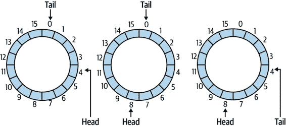
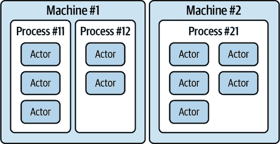
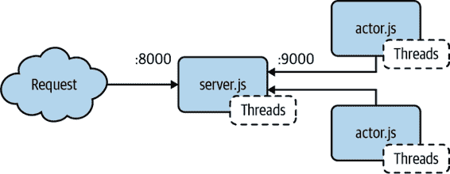

# 第六章：多线程模式

JavaScript API 本身在提供功能方面确实非常基础。正如你在第四章看到的那样，`SharedArrayBuffer`的目的是存储数据的原始二进制表示。甚至第五章继续使用`Atomics`对象，暴露出一些用于协调或逐个修改少量字节的相对原始的方法。

只看这些抽象和低级别的 API 可能会让人难以看清全局，或者这些 API 真正可以用于什么。诚然，将这些概念转化为对应用程序真正有用的东西是困难的。这就是本章的目的所在。

本章包含在应用程序内部实现多线程功能的流行设计模式。这些设计模式灵感来自过去，每一个都在 JavaScript 发明之前就存在。尽管它们的工作示例可能以多种形式存在，比如 C++教科书，但将它们转换用于 JavaScript 并非总是直截了当的。

通过研究这些模式，你将更好地理解你开发的应用程序如何从多线程中受益。

# 线程池

线程池是一个非常流行的模式，在某种形式上几乎用于大多数多线程应用程序中。本质上，*线程池*是一组同质的工作线程，每个线程都能执行应用程序可能依赖的 CPU 密集型任务。这与你到目前为止通常使用的单个工作线程或有限数量工作线程的方法有些不同。例如，Node.js 依赖的`libuv`库提供了一个线程池，默认为四个线程，用于执行低级别的 I/O 操作。

这种模式可能与您过去使用过的分布式系统相似。例如，在容器编排平台上，通常会有一组可以运行应用程序容器的机器。在这样的系统中，每台机器可能具有不同的能力，例如运行不同的操作系统或具有不同的内存和 CPU 资源。当发生这种情况时，编排器可能会根据资源和应用程序为每台机器分配点数，然后消耗这些点数。另一方面，线程池要简单得多，因为每个工作线程都能执行相同的工作，每个线程都和其他线程一样能干，因为它们都在同一台机器上运行。

创建线程池时的第一个问题是池中应有多少线程？

## 池大小

从本质上讲，有两种类型的程序：那些在后台运行的程序，如系统守护进程，理想情况下不应消耗太多资源，以及那些运行在前台的程序，任何给定用户更有可能意识到的，如桌面应用程序或 Web 服务器。浏览器应用程序通常被限制为前台应用程序运行，而 Node.js 应用程序可以自由地在后台运行——尽管 Node.js 最常用于构建服务器，通常作为容器内唯一的进程。无论哪种情况，JavaScript 应用程序的意图通常是在特定时间点成为主要关注的焦点，并且为实现程序目的所需的任何计算应尽可能快地执行。

为了尽快执行指令，将它们分解并并行运行是有意义的。为了最大化 CPU 使用率，理应尽可能均匀地使用给定 CPU 中的每个核心。因此，机器上可用的 CPU 核心数量应成为决定应用程序应使用的线程（又称工作者）数量的因素。

通常情况下，线程池的大小在应用程序的整个生命周期中不需要动态变化。通常选择工作线程数是有原因的，而且这个原因通常不会改变。这就是为什么在应用程序启动时会使用一个固定大小的线程池。

下面是获取当前运行的 JavaScript 应用程序可用线程数的成语化方法，具体取决于代码是在浏览器中运行还是在 Node.js 进程中运行：

```
// browser
cores = navigator.hardwareConcurrency;

// Node.js
cores = require('os').cpus().length;
```

需要记住的一件事是，大多数操作系统中线程与 CPU 核心之间没有直接的对应关系。例如，在具有四个核心的 CPU 上运行一个具有四个线程的应用程序时，并不是第一个核心总是处理第一个线程，第二个核心处理第二个线程，依此类推。相反，操作系统会不断地移动任务，偶尔中断正在运行的程序以处理另一个应用程序的工作。在现代操作系统中，通常有数百个后台进程需要偶尔进行检查。这通常意味着单个 CPU 核心将处理多个线程的工作。

每次 CPU 核心在程序或程序的线程之间切换焦点时，都会产生一些小的上下文切换开销。因此，与 CPU 核心数量相比有太多线程可能会导致性能损失。不断的上下文切换实际上会使应用程序变慢，因此应用程序应尽量减少请求操作系统注意的线程数量。然而，线程太少可能意味着应用程序执行任务的时间太长，从而导致用户体验不佳或浪费硬件资源。

还要记住的一件事是，如果一个应用程序创建了一个有四个工作线程的线程池，那么该应用程序使用的线程的最小数量是五，因为应用程序的主线程也参与其中。还有需要考虑的后台线程，如`libuv`线程池，如果 JavaScript 引擎使用垃圾回收线程，用于渲染浏览器界面的线程等等。所有这些都会影响应用程序的性能。

###### 提示

应用程序本身的特性也会影响线程池的理想大小。你是在编写一个加密货币挖矿程序，在每个线程中 99.9%的工作都在进行，几乎没有 I/O，主线程也没有工作吗？在这种情况下，使用可用核心数作为线程池的大小可能是可以接受的。或者你正在编写一个视频流和转码服务，需要大量 CPU 和 I/O 吗？在这种情况下，你可能想要使用可用核心数减去两个。你需要对你的应用程序进行基准测试，找到最佳数量，但一个合理的起点可能是使用可用核心数减去一个，然后根据需要进行调整。

一旦确定了要使用的线程数量，就可以确定如何将工作分派给工作线程了。

## 调度策略

因为线程池的目标是最大化并行处理的工作量，因此理所当然地，没有一个单独的工作线程应该承担太多的工作量，也不应该有线程闲置而没有工作可做。一个天真的方法可能是只是收集待完成的任务，然后一旦待执行任务的数量达到工作线程的数量，就将它们传递进去，并在它们全部完成后继续。然而，并不保证每个任务完成所需的时间相同。有些可能非常快，花费毫秒级的时间，而其他可能很慢，需要几秒甚至更长时间。因此，必须构建一个更加健壮的解决方案。

应用程序通常会采用几种策略来将任务分派给工作线程池中的工作线程。这些策略与反向代理用于将请求发送到后端服务的策略类似。以下是最常见的几种策略的列表：

循环调度

每个任务被分配给池中的下一个工作线程，一旦到达末尾，就会重新从开头开始。因此，对于一个大小为三的线程池，第一个任务分配给工作线程 1，然后是工作线程 2，然后是工作线程 3，然后回到工作线程 1，依此类推。这样做的好处是每个线程获得完全相同数量的任务来执行，但缺点是如果每个任务的复杂性是线程数的倍数（例如每六个任务中的一个需要很长时间才能完成），那么工作分配就不公平。HAProxy 反向代理将此称为`roundrobin`。

随机

每个任务都分配给池中的一个随机工作线程。尽管这是最简单的建立方式，完全无状态，但也可能意味着有些工作线程有时会被分配太多的工作，而其他工作线程有时则会被分配太少的工作。

最空闲

维护每个工作线程执行任务的计数，并在新任务到来时将其分配给最空闲的工作线程。甚至可以推广到每个工作线程一次只执行一个任务。当两个工作线程的工作量相同时，可以随机选择一个。这可能是最健壮的方法，特别是如果每个任务消耗的 CPU 量相同，但实现起来需要更多的努力。如果一些任务使用较少的资源，例如调用`setTimeout()`，则可能会导致工作线程工作负载的偏差。HAProxy 将其称为`leastconn`。

反向代理使用的其他策略可能具有不明显的实现方式，你也可以在你的应用程序中实现。例如，HAProxy 具有称为`source`的负载均衡策略，它使用客户端 IP 地址的哈希来一致地将请求路由到单个后端。在工作线程维护数据和路由相关任务的内存缓存时，将路由到同一工作线程可能会导致更多的缓存命中，但这种方法稍微难以泛化。

###### 提示

根据应用程序的性质，你可能会发现其中一种策略比其他策略具有更好的性能。再次强调，针对特定应用程序的性能测量是非常重要的。

## 示例实现

此示例重新利用了*ch2-patterns/*中你在“将所有内容整合在一起”中创建的现有文件，但为了简洁起见，已经删除了大部分错误处理，并使代码与 Node.js 兼容。在此部分创建一个名为*ch6-thread-pool/*的新目录，用于存放你将在其中创建的文件。

首先要创建的文件是*main.js*。这是应用程序的入口点。之前版本的代码只是使用了一个`Promise.allSettled()`调用来向池中添加任务，但这并不是很有趣，因为它同时添加了所有任务。相反，该应用程序公开了一个 Web 服务器，每个请求都会为线程池创建一个新任务。通过这种方式，之前的任务可能在查询池时已经完成，这样会产生更有趣的模式，就像一个真实的应用程序一样。

将示例 6-1 的内容添加到*main.js*，以启动你的应用程序。

##### 示例 6-1\. *ch6-thread-pool/main.js*

```
#!/usr/bin/env node const http = require('http');
const RpcWorkerPool = require('./rpc-worker.js');
const worker = new RpcWorkerPool('./worker.js',
  Number(process.env.THREADS), 
  process.env.STRATEGY); 

const server = http.createServer(async (req, res) => {
  const value = Math.floor(Math.random() * 100_000_000);
  const sum = await worker.exec('square_sum', value);
  res.end(JSON.stringify({ sum, value }));
});

server.listen(1337, (err) => {
  if (err) throw err;
  console.log('http://localhost:1337/');
});
```


`THREADS`环境变量控制池的大小。


`STRATEGY`环境变量设置了调度策略。

该应用程序使用了两个环境变量，以便进行实验。第一个命名为`THREADS`，用于设置线程池中的线程数。第二个环境变量是`STRATEGY`，可用于设置线程池调度策略。否则，服务器并不太令人兴奋，因为它只使用内置的`http`模块。服务器监听 1337 端口，无论路径如何，都会触发处理程序。每个请求都调用工作线程中定义的`square_sum`命令，同时传入一个介于 0 和 1 亿之间的值。

接下来，创建一个名为*worker.js*的文件，并将内容从示例 6-2 添加到其中。

##### 示例 6-2\. *ch6-thread-pool/worker.js*

```
const { parentPort } = require('worker_threads');

function asyncOnMessageWrap(fn) {
  return async function(msg) {
    parentPort.postMessage(await fn(msg));
  }
}

const commands = {
  async square_sum(max) {
    await new Promise((res) => setTimeout(res, 100));
    let sum = 0; for (let i = 0; i < max; i++) sum += Math.sqrt(i);
    return sum;
  }
};

parentPort.on('message', asyncOnMessageWrap(async ({ method, params, id }) => ({
  result: await commandsmethod, id
})));
```

这个文件并不太有趣，因为它本质上是您之前创建的*worker.js*文件的简化版本。为了缩短代码长度（如果愿意，可以添加回来），删除了大部分错误处理，并且代码也已修改为与 Node.js API 兼容。在这个示例中，只剩下一个命令，即`square_sum`。

接下来，创建一个名为*rpc-worker.js*的文件。这个文件将会非常庞大，并已分成较小的部分。首先，将内容从示例 6-3 添加到其中。

##### 示例 6-3\. *ch6-thread-pool/rpc-worker.js*（第一部分）

```
const { Worker } = require('worker_threads');
const CORES = require('os').cpus().length;
const STRATEGIES = new Set([ 'roundrobin', 'random', 'leastbusy' ]);

module.exports = class RpcWorkerPool {
  constructor(path, size = 0, strategy = 'roundrobin') {
    if (size === 0)     this.size = CORES; 
    else if (size < 0)  this.size = Math.max(CORES + size, 1);
    else                this.size = size;

    if (!STRATEGIES.has(strategy)) throw new TypeError('invalid strategy');
    this.strategy = strategy; 
    this.rr_index = -1;

    this.next_command_id = 0;
    this.workers = []; 
    for (let i = 0; i < this.size; i++) {
      const worker = new Worker(path);
      this.workers.push({ worker, in_flight_commands: new Map() }); 
      worker.on('message', (msg) => {
        this.onMessageHandler(msg, i);
      });
    }
  }
```


线程池大小可高度配置。


策略已验证并存储。


维护一个工作线程数组而不是仅一个。


`in_flight_commands`列表现在针对每个工作线程进行维护。

该文件首先通过要求`worker_threads`核心模块来创建工作线程，以及`os`模块来获取可用 CPU 核心数来启动。之后定义并导出`RpcWorkerPool`类。接下来提供了该类的构造函数。构造函数有三个参数，第一个是工作文件的路径，第二个是池的大小，第三个是要使用的策略。

池大小可高度配置，允许调用者提供一个数字。如果数字为正数，则用作池大小。默认值为零，如果提供了数字，则使用 CPU 核心数作为池大小。如果提供了负数，则从可用核心数中减去该数字，然后使用该数字。因此，在一个 8 核机器上，传入池大小为-2 将导致池大小为 6。

策略参数可以是`roundrobin`（默认值）、`random`或`leastbusy`之一。在分配给类之前，该值经过验证。`rr_index`值用作循环遍历的轮询索引，是一个循环遍历下一个可用工作线程 ID 的数字。

`next_command_id`仍然是全局的，跨所有线程，因此第一个命令将是`1`，下一个将是`2`，无论这两个命令是否由同一个工作线程处理。

最后，`workers`类属性是一个工作线程的数组，而不是以前的单个`worker`属性。处理它的代码基本相同，但`in_flight_commands`列表现在是局部的，属于各个工作线程，并且工作线程的 ID 作为额外参数传递给`onMessageHandler()`方法。这是因为当消息发送回主进程时，需要稍后查找各个工作线程。

继续编辑文件，将内容从示例 6-4 添加到其中。

##### 示例 6-4。*ch6-thread-pool/rpc-worker.js*（第二部分）

```
  onMessageHandler(msg, worker_id) {
    const worker = this.workers[worker_id];
    const { result, error, id } = msg;
    const { resolve, reject } = worker.in_flight_commands.get(id);
    worker.in_flight_commands.delete(id);
    if (error) reject(error);
    else resolve(result);
  }
```

文件的这部分定义了`onMessageHandler()`方法，当工作线程向主线程发送消息时调用该方法。这与之前大致相同，只是这次它接受了一个额外的参数`worker_id`，用于查找发送消息的工作线程。一旦查找到工作线程，它处理承诺的拒绝/解决，并从待处理命令列表中移除条目。

继续编辑文件，将内容从示例 6-5 添加到其中。

##### 示例 6-5。*ch6-thread-pool/rpc-worker.js*（第三部分）

```
  exec(method, ...args) {
    const id = ++this.next_command_id;
    let resolve, reject;
    const promise = new Promise((res, rej) => { resolve = res; reject = rej; });
    const worker = this.getWorker(); 
    worker.in_flight_commands.set(id, { resolve, reject });
    worker.worker.postMessage({ method, params: args, id });
    return promise;
  }
```


应用的工作线程被查找。

文件的这部分定义了`exec()`方法，当应用程序想要在其中一个工作线程中执行命令时调用该方法。再次强调，这基本上没有改变，但这次它调用`getWorker()`方法来获取适当的工作线程来处理下一个命令，而不是与单个默认工作线程一起工作。该方法在下一节中定义。

继续编辑文件，将内容从示例 6-6 添加到其中。

##### 示例 6-6。*ch6-thread-pool/rpc-worker.js*（第四部分）

```
  getWorker() {
    let id;
    if (this.strategy === 'random') {
      id = Math.floor(Math.random() * this.size);
    } else if (this.strategy === 'roundrobin') {
      this.rr_index++;
      if (this.rr_index >= this.size) this.rr_index = 0;
      id = this.rr_index;
    } else if (this.strategy === 'leastbusy') {
      let min = Infinity;
      for (let i = 0; i < this.size; i++) {
        let worker = this.workers[i];
        if (worker.in_flight_commands.size < min) {
          min = worker.in_flight_commands.size;
          id = i;
        }
      }
    }
    console.log('Selected Worker:', id);
    return this.workers[id];
  }
};
```

文件的最后一部分定义了一个名为`getWorker()`的新方法。该方法在确定下一个要使用的工作线程时考虑了为类实例定义的策略。函数的主体是一个大型的`if`语句，其中每个分支对应一个策略。

第一个方法，`random`，不需要任何额外的状态，使其成为最简单的方法。该函数的作用仅仅是随机选择池中的一个条目，然后将其选为候选项。

第二个分支，对于`roundrobin`，稍微复杂一些。这个分支利用了一个名为`rr_index`的类属性，增加其值然后返回位于新索引处的工作线程。一旦索引超过工作线程的数量，它会回到零。

最后一个分支，对于`leastbusy`，具有最复杂性。它通过循环遍历每一个工作线程，通过查看`in_flight_commands`映射的大小来注意它当前正在进行的命令数量，并确定是否是迄今为止遇到的最小值。如果是，则决定下一个要使用的工作线程。请注意，该实现将停止在具有最低正在进行中命令数量的第一个匹配工作线程；因此，第一次运行时它将总是选择工作线程 0。一个更健壮的实现可能会查看所有具有最低、相等命令的候选者，并随机选择一个。所选择的工作线程 ID 被记录下来，以便您可以知道发生了什么。

现在您的应用程序已经准备就绪，可以执行它了。在两个终端窗口中打开，并在第一个窗口中导航到*ch6-thread-pool/*目录。在这个终端窗口中执行以下命令：

```
$ THREADS=3 STRATEGY=leastbusy node main.js
```

这将启动一个进程，其中包含三个工作线程，使用`leastbusy`策略。

接下来，在第二个终端窗口中运行以下命令：

```
$ npx autocannon -c 5 -a 20 http://localhost:1337
```

这将执行`autocannon`命令，这是一个用于执行基准测试的 npm 包。在这种情况下，您并不真正运行基准测试，而是只运行了一堆查询。该命令配置为每次打开五个连接并发送总共 20 个请求。基本上，这将使得 5 个请求看似并行，然后在关闭请求时进行剩余的 15 个请求。这类似于您可能构建的生产 Web 服务器。

由于应用程序正在使用`leastbusy`策略，并且代码编写为选择具有最少命令的第一个进程，则前五个请求应该基本上被视为轮询。在三个工作线程的池大小中，当应用程序首次运行时，每个工作线程都没有任务。所以代码首先选择使用 Worker 0。对于第二个请求，第一个工作线程有一个任务，而第二和第三个工作线程都没有，因此选择第二个工作线程。然后是第三个工作线程。对于第四个请求，每个三个工作线程都会被查询，每个工作线程都有一个任务，因此再次选择第一个工作线程。

分配了前五项任务后，剩余的工作分配基本上是随机的，因为每个命令成功所需的时间基本上是随机的。

接下来，使用 Ctrl+C 来停止服务器，然后使用`roundrobin`策略再次运行它：

```
$ THREADS=3 STRATEGY=roundrobin node main.js
```

在第二个终端中再次运行与之前相同的`autocannon`命令。这次您应该看到任务总是按照 0、1、2、0 的顺序执行。

最后，再次使用 Ctrl+C 终止服务器，并使用随机策略重新运行：

```
$ THREADS=3 STRATEGY=random node main.js
```

最后再次运行 `autocannon` 命令并注意结果。这次应该完全是随机的。如果注意到同一个工作线程被连续选择多次，那很可能是该工作线程过载了。

表 6-1 显示了此实验之前运行的示例输出。每列对应一个新请求，表中的数字是选择用于服务请求的工作线程的 ID。

表 6-1\. 示例线程池策略输出

| 策略 | R1 | R2 | R3 | R4 | R5 | R6 | R7 | R8 | R9 | R10 |
| --- | --- | --- | --- | --- | --- | --- | --- | --- | --- | --- |
| 最少繁忙 | 0 | 1 | 2 | 0 | 1 | 0 | 1 | 2 | 1 | 0 |
| 轮询 | 0 | 1 | 2 | 0 | 1 | 2 | 0 | 1 | 2 | 0 |
| 随机 | 2 | 0 | 1 | 1 | 0 | 0 | 0 | 1 | 1 | 0 |

在这次特定的运行中，随机方法几乎没有使用 ID 为 2 的工作线程。

# 互斥锁：基本锁

互斥锁，或称 *mutex*，是控制对某些共享数据访问的机制。它确保在任何给定时间只有一个任务可以使用该资源。这里，任务可以是任何类型的并发任务，但通常是在使用多个线程时使用该概念，以避免竞态条件。任务在运行访问共享数据的代码之前 *获取* 锁，并在完成后 *释放* 锁。在获取和释放之间的代码称为 *临界区*。如果一个任务尝试在另一个任务持有锁时获取锁，那么该任务将被阻塞，直到另一个任务释放锁。

当我们通过 `Atomics` 对象拥有原子操作时，可能不明显为什么我们还需要使用互斥锁（mutex）。毕竟，使用原子操作修改和读取数据更有效率，因为我们仅在较短时间内阻塞其他操作，对吧？然而，事实是代码经常要求数据跨多个操作不被外部修改。换句话说，原子操作提供的原子性单位对于许多算法的关键部分来说太小了。例如，可以从共享内存的几个部分读取两个整数，然后将它们相加以写入另一个部分。如果在两次检索之间更改了值，则总和将反映来自两个不同任务的值，这可能导致程序后续的逻辑错误。

让我们看一个示例程序，它初始化一个包含一堆数字的缓冲区，并在几个线程中对它们进行一些基本数学操作。我们将使每个线程获取唯一索引处的值，然后获取共享索引处的值，将它们相乘，并将结果写入共享索引。然后，我们将从该共享索引读取并检查它是否等于前两次读取的乘积。在两次读取之间，我们将执行一个繁忙循环以模拟执行一些需要一定时间的其他工作。

创建一个名为*ch6-mutex*的目录，并将 Example 6-7 的内容放入名为*thread_product.js*的文件中。

##### Example 6-7\. *ch6-mutex/thread-product.js*

```
const {
  Worker, isMainThread, workerData
} = require('worker_threads');
const assert = require('assert');

if (isMainThread) {
  const shared = new SharedArrayBuffer(4 * 4); 
  const sharedInts = new Int32Array(shared);
  sharedInts.set([2, 3, 5, 7]);
  for (let i = 0; i < 3; i++) {
    new Worker(__filename, { workerData: { i, shared } });
  }
} else {
  const { i, shared } = workerData;
  const sharedInts = new Int32Array(shared);
  const a = Atomics.load(sharedInts, i);
  for (let j = 0; j < 1_000_000; j++) {}
  const b = Atomics.load(sharedInts, 3);
  Atomics.store(sharedInts, 3, a * b);
  assert.strictEqual(Atomics.load(sharedInts, 3), a * b); 
}
```


我们将使用三个线程和一个`Int32Array`来存储数据，因此我们需要足够大的空间来容纳三个 32 位整数，再加上第四个用作共享的乘法器/结果。


在这里，我们正在检查我们的工作。在真实的应用程序中，可能不会在这里进行检查，但这模拟了依赖结果以执行其他可能在程序后续阶段发生的操作。

您可以按如下方式运行此示例：

```
$ node thread-product.js
```

您可能会发现，在第一次尝试或者甚至在一系列尝试中，这个程序都能正常工作，但请继续运行它。或者您可能会发现断言立即失败。在前 20 次尝试中的某个时刻，您应该能够看到断言失败。虽然我们使用了原子操作，但在这些操作之间可能会对这些值进行更改。这是典型的竞态条件的例子。所有线程都在并发读写（尽管操作本身是原子的），因此对于给定的输入值，结果并不是确定性的。

为了解决这个问题，我们将使用现有的原语实现一个`Mutex`类。我们将使用`Atomics.wait()`等待直到可以获取锁，并使用`Atomics.notify()`通知线程锁已释放。我们将使用`Atomics.compareExchange()`交换锁定/解锁状态，并确定是否需要等待以获取锁定。在同一目录中创建一个名为*mutex.js*的文件，并添加 Example 6-8 的内容，以开始编写`Mutex`类。

##### Example 6-8\. *ch6-mutex/mutex.js*（第一部分）

```
const UNLOCKED = 0;
const LOCKED = 1;

const {
  compareExchange, wait, notify
} = Atomics;

class Mutex {
  constructor(shared, index) {
    this.shared = shared;
    this.index = index;
  }
```

在这里，我们将我们的`LOCKED`和`UNLOCKED`状态定义为 1 和 0。实际上，它们可以是任何适合我们传递给`Mutex`构造函数的`TypedArray`中的值，但将它们设为 1 和 0 使得将其视为布尔值更容易理解。我们已经设置了构造函数，以接受两个值分配给属性：我们将操作的`TypedArray`，以及我们将用作锁定状态的数组中的索引。现在，我们准备开始使用`Atomics`来添加`acquire()`方法，该方法使用解构的`Atomics`。从 Example 6-9 添加`acquire()`方法。

##### Example 6-9\. *ch6-mutex/mutex.js*（第二部分）

```
  acquire() {
    if (compareExchange(this.shared, this.index, UNLOCKED, LOCKED) === UNLOCKED) {
      return;
    }
    wait(this.shared, this.index, LOCKED);
    this.acquire();
  }
```

要获取锁定，我们尝试使用`Atomics.compareExchange()`将互斥锁数组索引处的`UNLOCKED`状态与`LOCKED`状态进行交换。如果交换成功，则无需其他操作，我们已经获取了锁定，因此可以直接返回。否则，我们需要等待解锁，这种情况下意味着等待值从`LOCKED`变为其他任何值的通知。然后我们再次尝试获取锁定。我们在这里通过递归来执行这个操作以说明“重试”的性质，但也可以很容易地使用循环。由于我们专门等待它变为解锁状态，因此在第二次尝试中应该可以成功，但在`wait()`和`compareExchange()`之间，值可能已经发生了变化，因此我们需要再次检查。在实际实现中，您可能希望在`wait()`上添加超时并限制可以尝试的次数。

###### 注意

在许多生产互斥锁实现中，除了“解锁”和“锁定”状态之外，您通常会找到表示“锁定并有争议”的状态。当一个线程试图获取已被另一个线程持有的锁时，就会出现*争用*。通过跟踪这种状态，互斥锁代码可以避免多余的`notify()`调用，从而提高性能。

现在我们将看看如何释放锁定。添加在示例 6-10 中显示的`release()`方法。

##### 示例 6-10\. *ch6-mutex/mutex.js*（第三部分）

```
  release() {
    if (compareExchange(this.shared, this.index, LOCKED, UNLOCKED) !== LOCKED) {
      throw new Error('was not acquired');
    }
    notify(this.shared, this.index, 1);
  }
```

我们在这里再次使用`Atomics.compareExchange()`来交换锁定状态，这与我们获取锁时的操作类似。这次，我们希望确保原始状态确实是`LOCKED`，因为如果我们未获取锁，我们不想释放它。此时唯一剩下的事情就是调用`notify()`，启用等待的线程（如果有的话）来获取锁定。我们将`notify()`的计数设置为 1，因为唤醒多于一个正在睡眠的线程是没有必要的，因为在任何时候只有一个线程能持有锁定。

现在我们已经有足够的内容作为一个可用的互斥锁。然而，很容易在获取锁定后忘记释放它，或者以某种方式有一个意外的临界区。对于许多用例，临界区是明确定义和预知的。在这些情况下，通过在`Mutex`类上添加`exec()`方法来包装临界区是有意义的。让我们通过在示例 6-11 中添加`exec()`方法来做到这一点，这也将完成该类。

##### 示例 6-11\. *ch6-mutex/mutex.js*（第四部分）

```
  exec(fn) {
    this.acquire();
    try {
      return fn();
    } finally {
      this.release();
    }
  }
}

module.exports = Mutex;
```

这里我们所做的只是调用传入的函数并返回其值，但在此之前用 `acquire()` 包装，之后用 `release()` 包装。这样传入的函数就包含了我们关键部分的所有代码。请注意，我们在 `try` 块中调用传入的函数，并在相应的 `finally` 中进行 `release()`。由于传入的函数可能会抛出异常，我们希望确保即使在这种情况下也释放锁。这完成了我们的 `Mutex` 类，现在我们可以继续在示例中使用它。

在同一目录中复制 *thread-product.js*，并命名为 *thread-product-mutex.js*。在该文件中 `require` *mutex.js* 文件，并将其赋值给名为 `Mutex` 的 `const`。为了让我们的锁使用，将 *SharedArrayBuffer* 添加另外 4 个字节（例如，`new SharedArrayBuffer(4 * 5)`），然后用 Example 6-12 的内容替换 `else` 块中的所有内容。

##### Example 6-12\. *ch6-mutex/thread-product-mutex.js*

```
  const { i, shared } = workerData;
  const sharedInts = new Int32Array(shared);
  const mutex = new Mutex(sharedInts, 4); 
  mutex.exec(() => {
    const a = sharedInts[i]; 
    for (let j = 0; j < 1_000_000; j++) {}
    const b = sharedInts[3];
    sharedInts[3] = a * b;
    assert.strictEqual(sharedInts[3], a * b);
  });
```


在此行之前，一切与未使用互斥锁时完全相同。现在，我们将初始化一个，使用我们 `Int32Array` 的第五个元素作为我们的锁数据。


在传递给 `exec()` 的函数内部，我们处于由锁保护的关键部分。这意味着我们不需要原子操作来读取或操作数组。相反，我们可以像操作任何其他 `TypedArray` 一样操作它。

除了启用普通的数组访问技术外，互斥锁还允许我们确保在查看这些数据时没有其他线程能够修改它们。因此，我们的断言永远不会失败。试一试吧！运行以下命令来运行此示例，甚至运行数十次、数百次或甚至数千次。它永远不会像仅使用原子操作的版本那样使断言失败：

```
$ node thread-product-mutex.js
```

###### 注意

互斥锁是锁定访问资源的简单工具。它们允许关键部分在没有其他线程干扰的情况下运行。它们是如何利用原子操作的组合来为多线程编程创建新的构建块的一个例子。在下一节 “使用环形缓冲区流数据” 中，我们将把这个构建块用于一些实际用途。

# 使用环形缓冲区流数据

许多应用涉及流数据。例如，HTTP 请求和响应通常通过 HTTP API 以字节数据序列形式呈现，随着它们接收到的数据块而来。在网络应用中，数据块受包大小的限制。在文件系统应用中，数据块可以受内核缓冲区大小的限制。即使我们将数据输出到这些资源而不考虑流式传输，内核也会将数据分成块，以便以缓冲的方式发送到目的地。

流式数据在用户应用程序中也经常发生，并且可以用作在计算单元（如进程或线程）之间传输大量数据的一种方式。即使没有分离的计算单元，您可能也希望或需要在处理数据之前将数据保存在某种缓冲区中。这就是环形缓冲区，也被称为循环缓冲区的便利之处。

环形缓冲区是使用一对索引来实现的先进先出（FIFO）队列，这对索引指向内存中数据数组的位置。关键是，当数据插入队列时，它不会移动到内存中的其他位置。相反，我们会随着数据的添加或移除而移动这些索引。数组被视为一个端点连接到另一个端点，形成一个数据环。这意味着如果这些索引增加超过数组的末尾，它们将返回到开始。

在物理世界中，餐馆点单轮类似于北美餐馆中常见的点单轮。在使用这种系统的餐馆中，点单轮通常放置在将顾客区域与厨房分隔开的地方。服务员会将顾客的点单纸条按顺序插入轮中。然后，在厨房一侧，厨师按照同样的顺序从轮中取出订单，以便按照适当的顺序烹饪食物，确保没有顾客等待时间过长。这就是一个有界的^(1) FIFO 队列，就像我们的环形缓冲区一样。事实上，它也是字面上的循环！

要实现环形缓冲区，我们需要两个索引，`head` 和 `tail`。`head` 索引指向下一个要添加数据到队列中的位置，而 `tail` 索引指向从队列中读取数据的下一个位置。当向队列写入或从队列读取数据时，我们会分别增加 `head` 或 `tail` 索引，模上缓冲区的大小。

图 6-1 展示了使用 16 字节缓冲区的环形缓冲区的工作原理。第一幅图示了包含 4 字节数据的环，从字节 0 开始（尾部位置），到字节 3 结束（头部在字节 4 前一字节）。一旦向缓冲区添加了四字节的数据，头部标记会向前移动四字节到字节 8，如第二幅图所示。在最后一幅图中，前四个字节已经被读取，所以尾部移动到字节 4 处。



###### 图 6-1\. 写入数据会使头部向前移动，而读取数据会使尾部向前移动。

让我们实现一个环形缓冲区。起初，我们不用担心线程问题，但为了稍后更容易处理，我们将在一个`TypedArray`中存储`head`、`tail`以及队列的当前`length`。我们可以尝试仅使用`head`和`tail`之间的差异作为长度，但这样会留下一个模棱两可的情况，即当`head`和`tail`相同时，我们无法判断队列是空还是满，因此我们将单独使用一个`length`值。我们将从设置构造函数和访问器开始，通过将示例 6-13 的内容添加到名为*ch6-ring-buffer/ring-buffer.js*的文件中来完成。

##### 示例 6-13\. *ch6-ring-buffer/ring-buffer.js*（第一部分）

```
class RingBuffer {
  constructor(meta/*: Uint32Array[3]*/, buffer /*: Uint8Array */) {
    this.meta = meta;
    this.buffer = buffer;
  }

  get head() {
    return this.meta[0];
  }

  set head(n) {
    this.meta[0] = n;
  }

  get tail() {
    return this.meta[1];
  }

  set tail(n) {
    this.meta[1] = n;
  }

  get length() {
    return this.meta[2];
  }

  set length(n) {
    this.meta[2] = n;
  }
```

构造函数接受一个名为`meta`的三元素`Uint32Array`，我们将用它来存储`head`、`tail`和`length`。为了方便起见，我们还添加了这些属性作为获取器和设置器，内部只是访问这些数组元素。它还接受一个`Uint8Array`，将作为环形缓冲区的后备存储。接下来，我们将添加`write()`方法。按照示例 6-14 中定义的方法进行添加。

##### 示例 6-14\. *ch6-ring-buffer/ring-buffer.js*（第二部分）

```
  write(data /*: Uint8Array */) { 
    let bytesWritten = data.length;
    if (bytesWritten > this.buffer.length - this.length) { 
      bytesWritten = this.buffer.length - this.length;
      data = data.subarray(0, bytesWritten);
    }
    if (bytesWritten === 0) {
      return bytesWritten;
    }
    if (
      (this.head >= this.tail && this.buffer.length - this.head >= bytesWritten) ||
      (this.head < this.tail && bytesWritten <= this.tail - this.head) 
    ) {
      // Enough space after the head. Just write it in and increase the head.
      this.buffer.set(data, this.head);
      this.head += bytesWritten;
    } else { 
      // We need to split the chunk into two.
      const endSpaceAvailable = this.buffer.length - this.head;
      const endChunk = data.subarray(0, endSpaceAvailable);
      const beginChunk = data.subarray(endSpaceAvailable);
      this.buffer.set(endChunk, this.head);
      this.buffer.set(beginChunk, 0);
      this.head = beginChunk.length;
    }
    this.length += bytesWritten;
    return bytesWritten;
  }
```


为了使此代码能够正常工作，`data`需要是与`this.buffer`相同的`TypedArray`的实例。可以通过静态类型检查或断言来检查这一点，或者两者都可以。


如果缓冲区中没有足够的空间来写入所有数据，则将尽可能多的字节写入以填充缓冲区，并返回写入的字节数。这通知正在写入数据的人，他们需要等待一些数据被读出后才能继续写入。


此条件表示当我们有足够的*连续*空间来写入数据时。这种情况发生在数组中头部在尾部之后且头部后面的空间大于要写入的数据时，*或者*当头部在尾部之前且尾部和头部之间有足够的空间时。对于这些条件中的任何一种，我们只需将数据写入数组，并增加头部索引的长度。


在`if`块的另一侧，我们需要写入数据直到数组的末尾，然后将其环绕以写入数组的开头。这意味着将数据分割为在末尾写入的块和在开头写入的块，并相应地写入它们。我们使用`subarray()`而不是`slice()`来切割数据，以避免不必要的第二次复制操作。

写入实际上只是将字节复制过来并使用`set()`更改`head`索引，对于数据跨越数组边界的特殊情况，需要适当调整。阅读非常类似，如示例 6-15 中的`read()`方法所示。

##### 示例 6-15\. *ch6-ring-buffer/ring-buffer.js*（第三部分）

```
  read(bytes) {
    if (bytes > this.length) { 
      bytes = this.length;
    }
    if (bytes === 0) {
      return new Uint8Array(0);
    }
    let readData;
    if (
      this.head > this.tail || this.buffer.length - this.tail >= bytes 
    ) {
      // The data is in a contiguous chunk.
      readData = this.buffer.slice(this.tail, bytes)
      this.tail += bytes;
    } else { 
      // Read from the end and the beginning.
      readData = new Uint8Array(bytes);
      const endBytesToRead = this.buffer.length - this.tail;
      readData.set(this.buffer.subarray(this.tail, this.buffer.length));
      readData.set(this.buffer.subarray(0, bytes - endBytesToRead), endBytesToRead);
      this.tail = bytes - endBytesToRead;
    }
    this.length -= bytes;
    return readData;
  }
}
```


`read()`的输入是请求的字节数。如果队列中没有足够的字节，它将返回当前队列中的所有字节。


如果请求的数据在从`tail`读取的连续块中，我们将直接使用`slice()`将其传递给调用者以获取这些字节的副本。我们将尾部移动到返回字节的末尾。


在`else`情况下，数据跨越数组的边界，因此我们需要获取两个块并以相反顺序将它们拼接在一起。为此，我们将分配一个足够大的`Uint8Array`，然后将数据从数组的开头和结尾复制过来。新的尾部设置为数组开头的块的末尾。

从队列中读取字节时，重要的是*复制*它们出来，而不仅仅是引用相同的内存。如果不这样做，那么以后写入队列的其他数据可能会出现在这些数组中，这是我们不希望看到的。这就是为什么我们使用`slice()`或一个新的`Uint8Array`来返回数据。

此时，我们有一个可工作的单线程有界队列，实现为环形缓冲区。如果我们想要将其与一个线程写入（*生产者*）和一个线程读取（*消费者*）一起使用，我们可以使用`SharedArrayBuffer`作为构造函数输入的后备存储，将其传递给另一个线程，并在那里实例化。不幸的是，我们尚未使用任何原子操作或识别和隔离使用锁的关键部分，因此如果多个线程使用缓冲区，可能会出现竞争条件和错误数据。我们需要纠正这一点。

读取和写入操作假定在整个操作过程中，`head`、`tail`或`length`都不会被其他线程更改。我们以后可能会更具体，但起初这样一般性至少会给我们所需的线程安全性，以避免竞争条件。我们可以使用来自“Mutex：基本锁”的`Mutex`类来识别关键部分，并确保它们一次只执行一次。

让我们引入`Mutex`类，并将包装类添加到将使用我们现有的`RingBuffer`类的文件中，这样可以使用示例 6-16。

##### 示例 6-16\. *ch6-ring-buffer/ring-buffer.js*（第四部分）

```
const Mutex = require('../ch6-mutex/mutex.js');

class SharedRingBuffer {
  constructor(shared/*: number | SharedArrayBuffer*/) {
    this.shared = typeof shared === 'number' ?
      new SharedArrayBuffer(shared + 16) : shared;
    this.ringBuffer = new RingBuffer(
      new Uint32Array(this.shared, 4, 3),
      new Uint8Array(this.shared, 16)
    );
    this.lock = new Mutex(new Int32Array(this.shared, 0, 1));
  }

  write(data) {
    return this.lock.exec(() => this.ringBuffer.write(data));
  }

  read(bytes) {
    return this.lock.exec(() => this.ringBuffer.read(bytes));
  }
}
```

为了开始，构造函数接受或创建 `SharedArrayBuffer`。注意，我们将缓冲区的大小增加了 16 字节，以处理 `Mutex`（需要一个元素的 `Int32Array`）和 `RingBuffer` 元数据（需要一个三元素的 `Uint32Array`）。我们将按照 Table 6-2 中的布局设置内存。

表 6-2\. `SharedRingBuffer` 内存布局

| 数据 | 类型[大小] | SharedArrayBuffer 索引 |
| --- | --- | --- |
| 互斥锁 | Int32Array[1] | 0 |
| RingBuffer 元数据 | Uint32Array[3] | 4 |
| RingBuffer 缓冲区 | Uint32Array[size] | 16 |

`read()` 和 `write()` 操作都被 `Mutex` 的 `exec()` 方法包装起来。回想一下，这可以防止同一个互斥锁保护的其他关键部分同时运行。通过包装它们，我们确保即使有多个线程同时从同一个队列读取和写入，我们也不会因为 `head` 或 `tail` 在这些关键部分中间被外部修改而出现竞态条件。

要看到这个数据结构的实际应用，让我们创建一些 *生产者* 和 *消费者* 线程。我们将设置一个带有 100 字节的 `SharedRingBuffer` 进行操作。生产者线程将重复尝试获取锁并向 `SharedRingBuffer` 写入字符串 `"Hello, World!\n"`。消费者线程将尝试每次读取 20 字节，并记录他们能够读取多少字节。完成这些操作的代码都在 Example 6-17 中，你可以将其添加到 *ch6-ring-buffer/ring-buffer.js* 的末尾。

##### Example 6-17\. *ch6-ring-buffer/ring-buffer.js*（第五部分）

```
const { isMainThread, Worker, workerData } = require('worker_threads');
const fs = require('fs');

if (isMainThread) {
  const shared = new SharedArrayBuffer(116);
  const threads = [
    new Worker(__filename, { workerData: { shared, isProducer: true } }),
    new Worker(__filename, { workerData: { shared, isProducer: true } }),
    new Worker(__filename, { workerData: { shared, isProducer: false } }),
    new Worker(__filename, { workerData: { shared, isProducer: false } })
  ];
} else {
  const { shared, isProducer } = workerData;
  const ringBuffer = new SharedRingBuffer(shared);

  if (isProducer) {
    const buffer = Buffer.from('Hello, World!\n');
    while (true) {
      ringBuffer.write(buffer);
    }
  } else {
    while (true) {
      const readBytes = ringBuffer.read(20);
      fs.writeSync(1, `Read ${readBytes.length} bytes\n`); 
    }
  }
}
```


你可能注意到，我们没有使用 `console.log()` 将字节计数写入 `stdout`，而是直接使用同步写入到与 `stdout` 对应的文件描述符。这是因为我们在没有任何 `await` 的情况下使用了无限循环。我们正在饿死 Node.js 事件循环，因此使用 `console.log` 或任何其他异步记录器，我们实际上永远不会看到任何输出。

你可以使用 Node.js 运行这个示例：

```
$ node ring-buffer.js
```

此脚本生成的输出将显示每个消费者线程在每次迭代中读取的字节数。因为我们每次要求 20 字节，所以你会看到这是最大可读取的数字。当队列为空时，有时你会看到全部为零。当队列部分填满时，你会看到其他数字。

在我们的示例中，有许多地方可以调整。`SharedRingBuffer` 的大小，生产者和消费者线程的数量，写入消息的大小，以及尝试读取的字节数，所有这些都会影响数据的吞吐量。和其他任何东西一样，值得测量和调整这些值，以找到适合你的应用程序的最佳状态。随便试试调整一些示例代码中的这些值，看看输出如何改变。

# Actor Model

*演员模型*是一种用于执行并发计算的编程模式，最早是在 1970 年代设计的。使用这种模型，*演员*是一个允许执行代码的原始容器。演员能够运行逻辑，创建更多演员，向其他演员发送消息并接收消息。

这些演员通过消息传递与外部世界进行通信；否则，它们具有自己独立的内存访问权限。在 Erlang 编程语言中，演员是一等公民，^(2) 但可以使用 JavaScript 模拟它们。

演员模型旨在允许计算以高度并行化的方式运行，而不必担心代码运行的位置或甚至实现通信所使用的协议。实际上，编程代码不应关心一个演员是否本地或远程与另一个演员通信。图 6-2 显示了演员如何分布在多个进程和机器上。



###### 图 6-2\. 演员可以分布在多个进程和机器上

## 模式细微差别

演员可以逐个处理接收到的每条消息或任务。当这些消息首次接收时，它们会放置在消息队列中，有时也称为邮箱。使用队列很方便，因为如果同时接收到两条消息，则不应同时处理它们。如果没有队列，一个演员可能需要在发送消息之前检查另一个演员是否准备就绪，这将是一个非常繁琐的过程。

虽然没有两个演员能够写入同一块共享内存，但它们可以自由地改变自己的内存。这包括随时间维护状态修改。例如，一个演员可以跟踪它已处理的消息数量，然后在以后输出的消息中传递这些数据。

由于没有涉及共享内存，因此演员模型能够避免一些早期讨论的多线程陷阱，如竞态条件和死锁。在许多方面，演员就像函数式语言中的函数，接受输入并避免访问全局状态。

由于演员一次只能处理一个任务，它们通常可以以单线程方式实现。而且，虽然单个演员一次只能处理一个任务，但不同的演员可以自由地并行运行代码。

使用演员的系统不应期望消息以 FIFO 方式有序传递。相反，它应对延迟和无序交付具有弹性，特别是因为演员可以分布在网络中。

单个角色也可以有地址的概念，这是唯一标识单个角色的一种方式。表示此值的一种方式可能是使用 URI。例如，`tcp://127.0.0.1:1234/3` 可能指的是在本地计算机上监听端口 1234 的程序中运行的第三个角色。此处介绍的实现不使用这样的地址。

## 关于 JavaScript

在像 Erlang 这样的语言中作为一等公民存在的角色无法完全使用 JavaScript 来完美复制，但我们当然可以尝试。可能有几十种方法可以进行类比和实现角色，本节为您介绍其中一种方法。

角色模型的一个优点是，角色不需要局限于单台计算机。这意味着进程可以在多台计算机上运行并通过网络进行通信。我们可以使用 Node.js 进程来实现这一点，每个进程使用 TCP 协议通过 JSON 进行通信。

因为单个角色应该能够与其他角色并行运行代码，并且每个角色一次只处理一个任务，所以角色很可能应该在不同的线程上运行以最大化系统使用率。一种方法是实例化新的工作线程。另一种方法是为每个角色设置专用进程，但这样会使用更多资源。

因为不需要处理不同角色之间的共享内存，因此可以基本忽略 `SharedArrayBuffer` 和 `Atomics` 对象（尽管更健壮的系统可能会依赖它们进行协调）。

角色需要一个消息队列，以便在处理一个消息时，另一个消息可以等待，直到角色准备好。JavaScript 的工作线程通过 `postMessage()` 方法在某种程度上帮助我们处理这个问题。通过这种方式传递的消息会等到当前 JavaScript 栈完成后再抓取下一个消息。如果每个角色只运行同步代码，那么可以使用这个内置队列。另一方面，如果角色可以执行异步工作，那么就需要手动构建一个队列。

到目前为止，角色模型可能听起来与 “线程池” 中介绍的线程池模式很相似。事实上，它们有很多相似之处，你几乎可以将角色模型看作是一个线程池的池。但是两个概念之间有足够的差异值得区分。事实上，角色模型为计算提供了一种独特的编程范式，真正是一种可以改变编写代码方式的高级编程模式。在实践中，角色模型涉及的程序通常依赖于线程池。

## 示例实现

创建一个名为*ch6-actors/*的新目录来实现这个示例。在此目录中，从示例 6-3 复制并粘贴现有的*ch6-thread-pool/rpc-worker.js*文件以及从示例 6-2 复制*ch6-thread-pool/worker.js*文件。这些文件将作为本示例中线程池的基础，并且可以保持不变。

接下来，创建一个名为*ch6-actors/server.js*的文件，并将内容从示例 6-18 添加到其中。

##### 示例 6-18\. *ch6-actors/server.js*（第一部分）

```
#!/usr/bin/env node

const http = require('http');
const net = require('net');

const [,, web_host, actor_host] = process.argv;
const [web_hostname, web_port] = web_host.split(':');
const [actor_hostname, actor_port] = actor_host.split(':');

let message_id = 0;
let actors = new Set(); // collection of actor handlers
let messages = new Map(); // message ID -> HTTP response
```

此文件创建两个服务器实例。第一个是 TCP 服务器，一个相对基础的协议，而第二个是 HTTP 服务器，它是基于 TCP 的高级协议，尽管这两个服务器实例不会相互依赖。此文件的前半部分包含了用于接受命令行参数以配置这两个服务器的样板代码。

`message_id`变量包含一个数字，该数字将在每次新的 HTTP 请求时递增。`messages`变量包含了消息 ID 到响应处理程序的映射，这些处理程序将用于回复消息。这与你在“线程池”中使用的模式相同。最后，`actors`变量包含了一系列处理函数，用于向外部演员进程发送消息。

接下来，将内容从示例 6-19 添加到文件中。

##### 示例 6-19\. *ch6-actors/server.js*（第二部分）

```
net.createServer((client) => {
  const handler = data => client.write(JSON.stringify(data) + '\0'); 
  actors.add(handler);
  console.log('actor pool connected', actors.size);
  client.on('end', () => {
    actors.delete(handler); 
    console.log('actor pool disconnected', actors.size);
  }).on('data', (raw_data) => {
    const chunks = String(raw_data).split('\0'); 
    chunks.pop(); 
    for (let chunk of chunks) {
      const data = JSON.parse(chunk);
      const res = messages.get(data.id);
      res.end(JSON.stringify(data) + '\0');
      messages.delete(data.id);
    }
  });
}).listen(actor_port, actor_hostname, () => {
  console.log(`actor: tcp://${actor_hostname}:${actor_port}`);
});
```


在消息之间插入空字节`'\0'`。


当客户端连接关闭时，它将从`actors`集合中移除。


`data`事件可能包含多个消息，并且以空字节分割。


最后一个字节是空字节，因此`chunks`中的最后一个条目是空字符串。

此文件创建了 TCP 服务器。这是专用的演员进程连接到主服务器进程的方式。每当演员进程连接时，`net.createServer()`回调函数都会被调用。`client`参数表示 TCP 客户端，实质上是与演员进程的连接。每次建立连接时都会记录一条消息，并且为方便地向演员发送消息添加了一个处理函数到`actors`集合中。

当客户端从服务器断开连接时，该客户端的处理函数将从`actors`集合中删除。演员通过 TCP 发送消息与服务器进行通信，这将触发`data`事件。³它们发送的消息是 JSON 编码数据。该数据包含一个`id`字段，该字段与消息 ID 相关联。当回调函数运行时，将从`messages`映射中检索相应的处理函数。最后，响应消息将发送回 HTTP 请求，消息将从`messages`映射中删除，并且服务器将监听指定的接口和端口。

###### 注意

服务器与演员池客户端之间的连接是长连接。因此，需要设置事件处理程序来处理诸如`data`和`end`等事件。

这个文件显著缺少客户端连接的错误处理程序。由于缺少这部分内容，连接错误将导致服务器进程终止。一个更健壮的解决方案是从`actors`集合中删除客户端。

由于一方发送消息时并不能保证另一方会在单个`data`事件中接收到它，所以会在消息之间插入`'\0'`空字节。特别是在快速连续发送多个消息时，它们将会在一个`data`事件中到达。这是一个你使用`curl`进行单一请求时不会遇到的 bug，但是当使用`autocannon`进行多次请求时会遇到。这将导致多个 JSON 文档被串联在一起，例如：`{"id":1…}{"id":2…}`。将这样的值传递给`JSON.parse()`将会导致错误。空字节使得事件看起来像这样：`{"id":1…}\0{"id":2…}\0`。然后字符串会被空字节分割，并且每个片段将被分别解析。如果空字节出现在 JSON 对象中，它会被转义，这意味着在分隔 JSON 文档时可以安全使用空字节。

紧接着，将示例 6-20 的内容添加到文件中。

##### 示例 6-20\. *ch6-actors/server.js*（第三部分）

```
http.createServer(async (req, res) => {
  message_id++;
  if (actors.size === 0) return res.end('ERROR: EMPTY ACTOR POOL');
  const actor = randomActor();
  messages.set(message_id, res);
  actor({
    id: message_id,
    method: 'square_sum',
    args: [Number(req.url.substr(1))]
  });
}).listen(web_port, web_hostname, () => {
  console.log(`web:   http://${web_hostname}:${web_port}`);
});
```

这部分文件创建了一个 HTTP 服务器。与 TCP 服务器不同，每个请求表示一个短暂的连接。`http.createServer()`回调函数将在接收到每个 HTTP 请求时被调用。

在这个回调函数内部，当前消息 ID 会递增，并且会查询演员列表。如果列表为空，这可能发生在服务器启动时，但是尚未加入演员时，将返回错误消息“ERROR: EMPTY ACTOR POOL”。否则，如果有演员存在，则会随机选择一个。不过，这不是最佳的解决方案，一个更健壮的解决方案在本节末尾讨论。

接下来，向执行者发送一个 JSON 消息。该消息包含一个`id`字段，表示消息 ID，一个`method`字段，表示要调用的函数（在本例中始终是`square_sum`），以及参数列表。在这种情况下，HTTP 请求路径包含斜杠和一个数字，如`/42`，并提取该数字以用作参数。最后，服务器侦听提供的接口和端口。

接下来，将示例 6-21 中的内容添加到文件中。

##### 示例 6-21\. *ch6-actors/server.js*（第四部分）

```
function randomActor() {
  const pool = Array.from(actors);
  return pool[Math.floor(Math.random() * pool.length)];
}
```

文件的这一部分只是从`actors`列表中随机获取一个执行者处理程序。

这个文件完成后（目前为止），创建一个名为*ch6-actors/actor.js*的新文件。从示例 6-22 中添加内容到该文件。

##### 示例 6-22\. *ch6-actors/actor.js*（第一部分）

```
#!/usr/bin/env node

const net = require('net');
const RpcWorkerPool = require('./rpc-worker.js');

const [,, host] = process.argv;
const [hostname, port] = host.split(':');
const worker = new RpcWorkerPool('./worker.js', 4, 'leastbusy');
```

再次，这个文件从一些样板代码开始，用于提取服务器进程的主机名和端口信息。它还使用`RpcWorkerPool`类初始化了一个线程池。该池有严格的四个线程大小，可以看作是四个执行者，并使用`leastbusy`算法。

接下来，将示例 6-23 中的内容添加到文件中。

##### 示例 6-23\. *ch6-actors/actor.js*（第二部分）

```
const upstream = net.connect(port, hostname, () => {
  console.log('connected to server');
}).on('data', async (raw_data) => {
  const chunks = String(raw_data).split('\0'); 
  chunks.pop();
  for (let chunk of chunks) {
    const data = JSON.parse(chunk);
    const value = await worker.exec(data.method, ...data.args);
    upstream.write(JSON.stringify({
      id: data.id,
      value,
      pid: process.pid
    }) + '\0');
  }
}).on('end', () => {
  console.log('disconnect from server');
});
```


执行者还需要处理空字节块的分离。

`net.connect()`方法创建与上游端口和主机名的连接，表示服务器进程，一旦连接成功就记录一条消息。当服务器向该执行者发送消息时，它触发`data`事件，并传递缓冲实例作为`raw_data`参数。然后解析包含 JSON 负载的数据。

然后执行者进程调用其工作者之一，调用请求的方法并传递参数。一旦工作者/执行者完成，数据就会被发送回服务器实例。使用`id`属性保留了相同的消息 ID。必须提供此值，因为给定的执行者进程可以同时接收多个消息请求，主服务器进程需要知道哪个回复与哪个请求相关联。返回的`value`也在消息中提供。进程 ID 也作为分配给`pid`的响应元数据提供，以便您可以可视化哪个程序在计算什么数据。

再次明显缺失的是正确的错误处理。如果发生连接错误，你会看到整个进程终止。

图 6-3 是你刚刚构建的实现的可视化。



###### 图 6-3\. 本节中执行者模型实现的可视化

现在你的文件已经完成，你可以运行你的程序了。首先，运行服务器，提供用于 HTTP 服务器的主机名和端口，然后是用于 TCP 服务器的主机名和端口。你可以通过运行以下命令来完成：

```
$ node server.js 127.0.0.1:8000 127.0.0.1:9000
# web:   http://127.0.0.1:8000
# actor: tcp://127.0.0.1:9000
```

在这种情况下，进程显示了两个服务器地址。

接下来，在一个新的终端窗口中向服务器发送一个请求：

```
$ curl http://localhost:8000/9999
# ERROR: EMPTY ACTOR POOL
```

糟糕！在这种情况下，服务器以错误回复。由于没有运行的演员进程，因此没有东西可以执行这项工作。

接下来，运行一个演员进程，并为其提供服务器实例的主机名和端口。你可以通过运行以下命令来完成：

```
$ node actor.js 127.0.0.1:9000
```

你应该能看到从服务器和工作进程打印出的连接建立消息。接下来，在一个单独的终端窗口中再次运行`curl`命令：

```
$ curl http://localhost:8000/99999
# {"id":4,"value":21081376.519967034,"pid":160004}
```

你应该得到与先前打印的值类似的返回值。通过附加新的演员进程，程序从没有可用于执行工作的演员转变为有四个演员可用。但你不需要停在这里。在另一个终端窗口中运行另一个使用相同命令的工作进程实例，并发出另一个 `curl` 命令：

```
$ node actor.js 127.0.0.1:9000

$ curl http://localhost:8000/8888888
# {"id":4,"value":21081376.519967034,"pid":160005}
```

当您多次运行命令时，应该看到响应中的 `pid` 值发生变化。恭喜，您现在动态增加了应用程序可用演员的数量。这是在运行时完成的，有效地提高了您的应用程序性能，而无需停机。

现在，演员模式的一个好处是代码运行的具体位置并不重要。在这种情况下，演员们存在于外部进程中。这使得在服务器首次执行时就发生了错误：发出了 HTTP 请求，但演员进程尚未连接。解决此问题的一种方法是在服务器进程中添加一些演员。

修改第一个 *ch6-actors/server.js* 文件，并将内容从 示例 6-24 添加到其中。

##### 示例 6-24\. *ch6-actors/server.js*（第五部分，奖励）

```
const RpcWorkerPool = require('./rpc-worker.js');
const worker = new RpcWorkerPool('./worker.js', 4, 'leastbusy');
actors.add(async (data) => {
  const value = await worker.exec(data.method, ...data.args);
  messages.get(data.id).end(JSON.stringify({
    id: data.id,
    value,
    pid: 'server'
  }) + '\0');
  messages.delete(data.id);
});
```

文件的这一部分在服务器进程中创建了一个工作线程池，有效地向池中添加了四个额外的演员。使用 Ctrl+C 杀死您创建的现有服务器和演员进程。然后，运行您的新服务器代码并发送一个 `curl` 请求：

```
$ node server.js 127.0.0.1:8000 127.0.0.1:9000
$ curl http://localhost:8000/8888888
# {"id":8,"value":17667693458.923462,"pid":"server"}
```

在这种情况下，`pid` 值已经硬编码为 `server`，表示执行计算的进程是服务器进程。与之前类似，你可以运行更多的演员进程，让它们连接到服务器，并运行更多的 `curl` 命令向服务器发送请求。当发生这种情况时，你应该看到请求被专用演员进程或服务器处理。

使用演员模式时，您不应该将加入的演员视为外部 API，而应该将它们视为程序本身的扩展。这种模式非常强大，并且带有一个有趣的用例。*热代码加载*是指当应用程序的新版本替换旧版本时，应用程序仍在运行。通过您构建的演员模式，您可以修改*actor.js* / *worker.js*文件，修改现有的`square_sum()`方法，甚至添加新的方法。然后，您可以启动新的演员程序并终止旧的演员程序，主服务器将开始使用新的演员。

此外，值得注意的是，本节介绍的演员模型版本确实存在几个缺点，在实施类似内容于生产环境之前应该考虑到这些。首先，尽管演员进程内的各个演员是根据最不忙碌的来选择的，但演员进程本身是随机选择的。这可能会导致工作负载不均衡。为了解决这个问题，您需要一些协调机制来跟踪哪些演员是空闲的。

另一个缺点是，个别演员无法被其他演员寻址；事实上，一个演员不能从另一个演员调用代码。在架构上，这些进程类似于星形拓扑结构，其中演员进程严格连接到服务器进程。理想情况下，所有演员都可以相互连接，并且演员可以单独寻址彼此。

这种方法的一个重要优点是其弹性。采用本节介绍的方法，只有一个单一的 HTTP 服务器。如果服务器进程停止，整个应用程序也会停止运行。一个更具弹性的系统可能会使每个进程既是 HTTP 服务器又是 TCP 服务器，并且有一个反向代理将请求路由到所有进程。一旦进行了这些更改，您就接近于更健壮平台提供的演员模型实现。

^(1) 在实际操作中，餐馆可能会比订单轮处理的要忙。餐馆通常会通过一些诸如在同一个轮槽中插入多张订单纸，并在每个槽中达成某种约定顺序的技巧来解决这个问题。在我们的环形缓冲区中，我们不能将多个数据片段推送到一个数组槽中，因此无法使用同样的技巧。相反，一个更完整的系统应该有一种方法来指示队列已满，目前无法处理更多数据。正如您将看到的那样，我们将会正好做到这一点。

^(2) 演员模式的另一个值得注意的实现是在 Scala 语言中。

^(3) 大型消息，例如如果传递的是字符串而不是几个小数字，则可能会跨 TCP 消息边界分割，并以多个`data`事件到达。如果将此代码用于生产环境，请牢记这一点。
