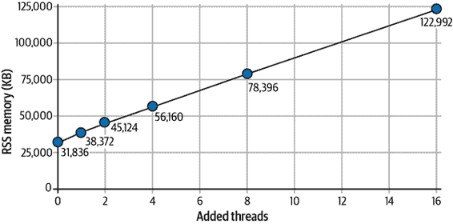
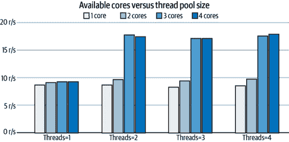
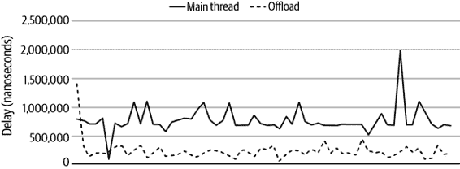

# 第八章：分析

到目前为止，您应该对使用 JavaScript 构建多线程应用程序非常熟悉，无论是在用户的浏览器中运行的代码，还是在您的服务器上运行的代码，甚至是同时使用两者的应用程序。尽管本书提供了许多用例和参考资料，但从未提到“你应该在应用程序中添加多线程”，这其中有一个重要的原因。

总体而言，向应用程序添加工作线程的主要原因是提高性能。但这种权衡是伴随着增加复杂性的代价而来的。*KISS 原则*，即“保持简单，愚蠢”，建议您的应用程序应该非常简单，以至于任何人都可以快速查看代码并理解它。在编写代码后能够阅读代码至关重要，而毫无目的地向程序添加线程则绝对违反了 KISS 原则。

有绝对充分的理由向应用程序添加线程，只要您在测量性能并确认速度提升超过增加的维护成本时，那么您就找到了值得添加线程的情况。但如何识别出线程是否有助于帮助而不需要实现它们的所有工作？又如何衡量性能影响？

# 不适合使用多线程的情况

多线程不是解决应用程序性能问题的万能药。在性能方面，它通常不是最低果实。因此，通常应作为最后的尝试。这在 JavaScript 中尤为真实，因为多线程并没有像其他语言那样被社区广泛理解。添加线程支持可能需要对应用程序进行大幅更改，这意味着如果您首先解决其他代码效率低下的问题，您的工作投入与性能收益可能会更高。

一旦完成了这些，并且你的应用在其他方面表现良好，你就会面临这样一个问题：“现在是添加多线程的好时机吗？”本节剩余部分列举了一些情况，其中添加线程很可能不会提供任何性能优势。这可以帮助你避免进行一些发现工作。

## 低内存约束

在 JavaScript 中实例化多个线程时会产生一些额外的内存开销。这是因为浏览器需要为新的 JavaScript 环境分配额外的内存——包括全局变量和您的代码可用的 API，以及引擎本身使用的底层内存。在 Node.js 正常服务器环境或者浏览器运行在强大的笔记本电脑环境下，这种开销可能是很小的。但如果您在 512 MB RAM 的嵌入式 ARM 设备上运行代码，或者在 K-12 教室捐赠的网络书籍上运行代码，则可能会成为一种阻碍。

额外线程的内存影响是多少？这有点难以量化，并且取决于 JavaScript 引擎和平台。安全的答案是，像大多数性能方面一样，应该在真实环境中进行测量。但我们当然可以尝试得到一些具体的数字。

首先，让我们考虑一个非常简单的 Node.js 程序，它只启动一个计时器，不引入任何第三方模块。该程序如下所示：

```
#!/usr/bin/env node

const { Worker } = require('worker_threads');
const count = Number(process.argv[2]) || 0;

for (let i = 0; i < count; i++) {
  new Worker(__dirname + '/worker.js');
}

console.log(`PID: ${process.pid}, ADD THREADS: ${count}`);
setTimeout(() => {}, 1 * 60 * 60 * 1000);
```

运行程序并测量内存使用如下所示：

```
# Terminal 1
$ node leader.js 0
# PID 10000

# Terminal 2
$ pstree 10000 -pa # Linux only
$ ps -p 10000 -o pid,vsz,rss,pmem,comm,args
```

`pstree` 命令显示程序使用的线程。它显示主要的 V8 JavaScript 线程，以及一些在 “隐藏线程” 中涵盖的后台线程。以下是该命令的输出示例：

```
node,10000 ./leader.js
  ├─{node},10001
  ├─{node},10002
  ├─{node},10003
  ├─{node},10004
  ├─{node},10005
  └─{node},10006
```

`ps` 命令显示有关进程的信息，特别是进程的内存使用情况。以下是该命令的输出示例：

```
  PID    VSZ   RSS  %MEM COMMAND    COMMAND
66766 1409260 48212   0.1 node      node ./leader.js
```

在这里用于测量程序内存使用的两个重要变量，均以千字节为单位。首先是 `VSZ`，或称*虚拟内存大小*，这是进程可以访问的内存，包括交换内存、分配内存，甚至由共享库（如 TLS）使用的内存，大约为 1.4 GB。接下来是 `RSS`，或称*驻留集大小*，即当前进程正在使用的物理内存量，大约为 48 MB。

测量内存可能有些主观，估算进程实际上可以容纳多少也有些棘手。在这种情况下，我们主要关注 RSS 值。

现在，让我们考虑程序的更复杂版本，使用线程。同样，将使用相同的简单计时器，但这次将创建总共四个线程。在这种情况下需要一个新的 *worker.js* 文件：

```
console.log(`WPID: ${process.pid}`);
setTimeout(() => {}, 1 * 60 * 60 * 1000);
```

运行 *leader.js* 程序时，如果输入一个大于 0 的数值参数，程序将创建额外的工作线程。表 8-1 列出了不同额外线程迭代的内存使用输出。

表 8-1\. 使用 Node.js v16.5 时的线程内存开销

| 添加线程 | VSZ | RSS | 大小 |
| --- | --- | --- | --- |
| 0 | 318,124 KB | 31,836 KB | 47,876 KB |
| 1 | 787,880 KB | 38,372 KB | 57,772 KB |
| 2 | 990,884 KB | 45,124 KB | 68,228 KB |
| 4 | 1,401,500 KB | 56,160 KB | 87,708 KB |
| 8 | 2,222,732 KB | 78,396 KB | 126,672 KB |
| 16 | 3,866,220 KB | 122,992 KB | 205,420 KB |

图 8-1 显示了 RSS 内存与线程数量之间的相关性。



###### 图 8-1\. 随着每个额外线程的内存使用增加

根据这些信息，在使用 Node.js 16.5 和 x86 处理器时，每个新线程实例化的 RSS 内存开销约为 6 MB。再次强调，这个数字有些粗略，并且您需要在特定情况下进行测量。当线程引入更多模块时，内存开销会增加。如果在每个线程中实例化重型框架和 Web 服务器，可能会增加数百兆字节的内存开销。

###### 警告

尽管越来越难以找到它们，但在 32 位计算机或智能手机上运行的程序具有最大可寻址内存空间为 4 GB 的限制。此限制适用于程序中的任何线程。

## 低核心数

在核心数较少的情况下，您的应用程序运行速度会变慢。如果机器只有一个核心，这一点尤其明显，如果有两个核心也可能如此。即使在应用程序中使用线程池并根据核心数扩展池，如果创建一个单工作线程，应用程序也会变慢。当创建额外的线程时，应用程序现在至少有两个线程（主线程和工作线程），这两个线程将竞争资源。

另一个导致您的应用程序变慢的原因是在线程之间进行通信时会增加额外开销。即使在单核和两个线程的情况下，即使两者不竞争资源，即主线程没有工作要做而工作线程在运行，反之亦然，在这两个线程之间进行消息传递时仍会存在开销。

这可能并不是什么大问题。例如，如果您创建了一个可在多个环境中运行的可分发应用程序，通常在多核系统上运行，很少在单核系统上运行，则此开销可能是可以接受的。但是，如果您正在构建一个几乎完全在单核环境中运行的应用程序，那么最好根本不添加线程。换句话说，您可能不应该构建一个利用您强大的多核开发笔记本电脑的应用程序，然后将其部署到只允许单核的生产环境中。

我们在谈论多少性能损失？在 Linux 操作系统上，向操作系统指示程序及其所有线程应仅在 CPU 核心的子集上运行非常直接。使用此命令可以让开发人员测试在低核心环境中运行多线程应用程序的效果。如果您使用的是基于 Linux 的计算机，请随意运行这些示例；否则，将提供摘要。

首先，返回到您在“线程池”中创建的*ch6-thread-pool/*示例。执行应用程序以创建包含两个工作线程的工作池：

```
$ THREADS=2 STRATEGY=leastbusy node main.js
```

注意，当线程池为 2 时，应用程序有三个可用的 JavaScript 环境，而`libuv`应该有一个默认的池大小为 5，因此 Node.js v16 版本会有大约 8 个线程。程序正在运行并且可以访问机器上的所有核心时，您可以准备运行快速基准测试。执行以下命令向服务器发送一连串的请求：

```
$ npx autocannon http://localhost:1337/
```

在这种情况下，我们只关注平均请求率，在输出的最后一个表格中，标识为 Req/Sec 行和 Avg 列。在一个样本运行中，返回了 17.5 的值。

使用 Ctrl+C 终止服务器并重新运行它。但是这次使用`taskset`命令来强制进程（及其所有子线程）使用相同的 CPU 核心：

```
# Linux only command
$ THREADS=2 STRATEGY=leastbusy taskset -c 0 node main.js
```

在这种情况下，设置了两个环境变量`THREADS`和`STRATEGY`，然后运行了`taskset`命令。`-c 0`标志告诉命令只允许程序使用第 0 个 CPU。随后跟随的参数被视为要运行的命令。请注意，`taskset`命令还可以用于修改已经运行的进程。当这种情况发生时，命令会显示一些有用的输出来告诉您发生了什么。当在具有 16 个核心的计算机上使用该命令时，以下是该输出的一份副本：

```
pid 211154's current affinity list: 0-15
pid 211154's new affinity list: 0
```

在这种情况下，程序曾经可以访问所有 16 个核心（0-15），但现在只能访问一个核心（0）。

程序运行并锁定到单个 CPU 核心以模拟可用核心较少的环境后，再次运行相同的基准测试命令：

```
$ npx autocannon http://localhost:1337/
```

在一个这样的运行中，平均每秒请求减少到了 8.32。这意味着，当尝试在单核心环境中使用三个 JavaScript 线程时，该特定程序的吞吐量与访问所有核心时相比，性能下降了 48%！

一个自然的问题可能是：为了最大化*ch6-thread-pool*应用程序的吞吐量，线程池应该有多大，应用程序应该提供多少个核心？为了找到答案，应用程序的基准测试被应用了 16 种排列，并且测量了性能。为了帮助减少任何异常请求，测试的长度增加到了两分钟。此数据的表格版本在表 8-2 中提供。

表 8-2\. 可用核心与线程池大小及其对吞吐量的影响

|  | 1 核心 | 2 核心 | 3 核心 | 4 核心 |
| --- | --- | --- | --- | --- |
| 1 个线程 | 8.46 | 9.08 | 9.21 | 9.19 |
| 2 个线程 | 8.69 | 9.60 | 17.61 | 17.28 |
| 3 个线程 | 8.23 | 9.38 | 16.92 | 16.91 |
| 4 个线程 | 8.47 | 9.57 | 17.44 | 17.75 |

数据的图表已在图 8-2 中重新生成。

在这种情况下，当线程池中专用于的线程数至少为两个，而应用程序可用的核心数至少为三个时，显然会带来性能上的显著好处。除此之外，数据中并没有太多有趣的内容。在实际应用程序中测量核心与线程的影响时，您可能会看到更多有趣的性能权衡。

这些数据提出的一个问题是：为什么添加超过两个或三个线程不会使应用程序运行更快？要回答这类问题需要假设、尝试应用程序代码，并试图消除任何瓶颈。在这种情况下，可能是主线程忙于协调、处理请求和与线程通信，导致工作线程无法有效完成工作。



###### 图 8-2\. 可用核心与线程池大小的关系及其对吞吐量的影响

## 容器与线程

在编写服务器软件时，比如使用 Node.js，一个经验法则是进程应该进行水平扩展。这是一个复杂的术语，意味着您应该以隔离的方式运行多个程序的冗余版本，例如在 Docker 容器中。水平扩展有助于性能，使开发人员可以对整个应用程序群体的性能进行微调。当缩放基元以线程池的形式发生在程序内部时，这种调优并不容易执行。

编排器（如 Kubernetes）是跨多台服务器运行容器的工具。它们使得根据需求轻松扩展应用程序；在假期季节期间，工程师可以手动增加运行实例的数量。编排器还可以根据 CPU 使用率、流量吞吐量甚至工作队列的大小等启发式动态调整规模。

如果在运行时在应用程序内执行动态缩放，会是什么样子？显然，可用的线程池需要重新调整大小。还需要一些通信机制，允许工程师发送消息给进程来调整池大小；也许需要一个额外的服务器监听端口以接收此类管理命令。这种功能需要在应用程序代码中增加额外的复杂性。

虽然增加进程而不是增加线程数会增加整体资源消耗，更不用说将进程封装在容器中的开销了，但更大的公司通常更喜欢这种方法的缩放灵活性。

# 使用时机

有时候，您可能会走运，会遇到从多线程解决方案中获益良多的问题。以下是一些此类问题的最直接特征，需要特别留意：

令人尴尬的并行

这是一个问题类别，一个大任务可以分解为较小的任务，并且几乎不需要或根本不需要共享状态。其中一个这样的问题是“示例应用：康威生命游戏”中涉及的生命游戏模拟。对于这个问题，游戏网格可以被细分为较小的网格，每个网格可以分配给一个单独的线程。

大量数学

另一个适合线程的问题的特征是那些涉及大量使用数学，也就是 CPU 密集型工作的问题。可以说计算机所做的一切都是数学，但是一个数学密集型应用的反面是 I/O 重型应用，或者主要处理网络操作的应用。考虑一个密码哈希破解工具，该工具有一个弱 SHA1 密码的摘要。这样的工具可能通过对每个可能的 10 个字符密码组合运行安全哈希算法 1 (SHA1) 来工作，这确实需要大量的数学计算。

MapReduce 友好的问题

MapReduce 是受函数式编程启发的编程模型。这种模型通常用于跨多台不同机器分布的大规模数据处理。MapReduce 被分成两部分。第一部分是 Map，它接受一组值并生成一组值。第二部分是 Reduce，在这里再次迭代值列表，并生成一个单一的值。可以使用 JavaScript 中的 `Array#map()` 和 `Array#reduce()` 创建单线程版本，但多线程版本需要不同的线程处理数据列表的子集。搜索引擎使用 Map 扫描数百万篇文档中的关键字，然后使用 Reduce 对其进行评分和排名，为用户提供相关结果页面。像 Hadoop 和 MongoDB 这样的数据库系统受益于 MapReduce。

图形处理

许多图形处理任务也受益于多线程。就像“生命游戏”问题一样，该问题在一个细胞网格上运行，图像也被表示为像素网格。在这两种情况下，每个坐标的值可以表示为一个数字，尽管“生命游戏”使用单个 1 位数字，而图像更可能使用 3 或 4 个字节（红色、绿色、蓝色和可选的 alpha 透明度）。图像过滤变成了将图像细分为更小的图像，使用线程池中的线程并行处理这些小图像，然后在更改完成后更新界面。

这并不是您应该使用多线程的所有情况的完整列表；这只是一些最明显的用例列表。

一个重复的主题是不需要共享数据，或者至少不需要协调读写共享数据的问题更容易使用多线程建模。虽然编写没有太多副作用的代码通常是有益的，但在编写多线程代码时，这种好处会加倍。

JavaScript 应用程序特别有益的另一个用例是模板渲染。根据所使用的库，模板的渲染可能是使用表示原始模板的字符串和包含变量以修改模板的对象来完成的。在这种用例中，通常没有太多全局状态需要考虑，只有两个输入，而返回一个单个字符串输出。这是流行的模板渲染包`mustache`和`handlebars`的情况。将模板渲染从 Node.js 应用程序的主线程中转移似乎是获得性能的一个合理地方。

让我们测试这个假设。创建一个名为*ch8-template-render/*的新目录。在这个目录中，从示例 6-3 中复制并粘贴现有的*ch6-thread-pool/rpc-worker.js*文件。虽然文件不经修改也能正常工作，但您应该注释掉`console.log()`语句，以免减慢基准测试的速度。

您还需要初始化一个 npm 项目并安装一些基本包。您可以通过运行以下命令来实现这一点：

```
$ npm init -y
$ npm install fastify@3 mustache@4
```

接下来，创建一个名为*server.js*的文件。这代表一个 HTTP 应用程序，当收到请求时执行基本的 HTML 渲染。这个基准测试将使用一些真实世界的包，而不是加载所有内置模块。从示例 8-1 的内容开始编写文件。

##### 示例 8-1。*ch8-template-render/server.js*（第一部分）

```
#!/usr/bin/env node
// npm install fastify@3 mustache@4

const Fastify = require('fastify');
const RpcWorkerPool = require('./rpc-worker.js');
const worker = new RpcWorkerPool('./worker.js', 4, 'leastbusy');
const template = require('./template.js');
const server = Fastify();
```

文件首先实例化了 Fastify Web 框架，以及一个具有四个工作线程的工作池。该应用程序还加载了一个名为*template.js*的模块，该模块将用于渲染 Web 应用程序使用的模板。

现在，您已经准备好声明一些路由，并告诉服务器监听请求。继续编辑文件，将示例 8-2 中的内容添加到其中。

##### 示例 8-2。*ch8-template-render/server.js*（第二部分）

```
server.get('/main', async (request, reply) =>
  template.renderLove({ me: 'Thomas', you: 'Katelyn' }));

server.get('/offload', async (request, reply) =>
  worker.exec('renderLove', { me: 'Thomas', you: 'Katelyn' }));

server.listen(3000, (err, address) => {
  if (err) throw err;
  console.log(`listening on: ${address}`);
});
```

应用程序引入了两条路由。第一条是`GET /main`，将在主线程中执行请求的渲染。这代表了一个单线程应用程序。第二条路由是`GET /offload`，其中渲染工作将被转移到一个单独的工作线程。最后，服务器被指示监听端口 3000。

此时，应用程序在功能上已经完成。但作为额外的奖励，能够量化服务器正在忙碌处理的工作量将是很好的。虽然我们主要可以通过使用 HTTP 请求基准测试来测试此应用程序的效率，但有时也很好看看其他数字。添加示例 8-3 中的内容来完成文件。

##### 示例 8-3。*ch8-template-render/server.js*（第三部分）

```
const timer = process.hrtime.bigint;
setInterval(() => {
  const start = timer();
  setImmediate(() => {
    console.log(`delay: ${(timer() - start).toLocaleString()}ns`);
  });
}, 1000);
```

此代码使用 `setInterval` 调用，每秒运行一次。它包装了一个 `setImmediate()` 调用，在调用前后测量当前时间的纳秒数。这并非完美，但这是一种近似当前进程负载的方法。随着进程事件循环变得更加繁忙，报告的数字也会更高。事件循环的繁忙程度还会影响整个过程中异步操作的延迟。因此，保持这个数字较低与应用程序的性能更加相关。

接下来，创建一个名为 *worker.js* 的文件。将内容从 示例 8-4 添加到其中。

##### 示例 8-4\. *ch8-template-render/worker.js*

```
const { parentPort } = require('worker_threads');
const template = require('./template.js');

function asyncOnMessageWrap(fn) {
  return async function(msg) {
    parentPort.postMessage(await fn(msg));
  }
}

const commands = {
  renderLove: (data) => template.renderLove(data)
};

parentPort.on('message', asyncOnMessageWrap(async ({ method, params, id }) => ({
  result: await commandsmethod, id
})));
```

这是您之前创建的工作文件的修改版本。在这种情况下，只使用一个命令 `renderLove()`，它接受一个包含键值对的对象，供模板渲染函数使用。

最后，创建一个名为 *template.js* 的文件，并将内容从 示例 8-5 添加到其中。

##### 示例 8-5\. *ch8-template-render/template.js*

```
const Mustache = require('mustache');
const love_template = "<em>{{me}} loves {{you}}</em> ".repeat(80);

module.exports.renderLove = (data) => {
  const result = Mustache.render(love_template, data);
  // Mustache.clearCache();
  return result;
};
```

在实际应用中，该文件可能用于从磁盘读取模板文件并替换值，暴露出完整的模板列表。对于这个简单示例，只导出一个单一模板渲染器并使用一个硬编码模板。此模板使用两个变量 `me` 和 `you`。字符串多次重复以接近实际应用可能使用的模板长度。模板越长，渲染时间越长。

现在文件已创建好，可以准备运行应用程序了。运行以下命令启动服务器，然后对其进行基准测试：

```
# Terminal 1
$ node server.js

# Terminal 2
$ npx autocannon -d 60 http://localhost:3000/main
$ npx autocannon -d 60 http://localhost:3000/offload
```

在一台强大的 16 核笔记本上进行的测试中，当完全在主线程中渲染模板时，应用程序的平均吞吐量为每秒 13,285 个请求。然而，当将模板渲染任务转移到工作线程时，同样的测试的平均吞吐量达到每秒 18,981 个请求。在这种情况下，吞吐量增加了约 43%。

事件循环延迟也显著减少。在进程空闲时调用 `setImmediate()` 的平均时间约为 87 μs。当在主线程执行模板渲染时，延迟平均为 769 μs。将渲染任务转移到工作线程后，同样的样本平均值为 232 μs。从这两个值中减去空闲状态的时间意味着使用线程时的性能提升约为 4.7 倍。图 8-3 在 60 秒基准测试期间比较了这些样本。



###### 图 8-3\. 在单线程与多线程使用时的事件循环延迟

这是否意味着您应该立即重构应用程序，将渲染工作移交给另一个线程？未必。通过这个假设的例子，应用程序在增加线程后变得更快，但这是在一台 16 核的机器上完成的。您的生产应用程序很可能只能访问更少的核心。

尽管如此，在测试过程中性能差异最大的是模板的大小。当它们较小，如不重复字符串时，使用单个线程渲染模板会更快。之所以会变慢，是因为在线程之间传递模板数据的开销要比渲染微小模板所需的时间大得多。

就像所有基准测试一样，需要以一颗谷物的心态看待这个。您需要在生产环境中测试这些更改，以确保是否从额外的线程中受益。

# 注意事项总结

这是在 JavaScript 中使用线程时需注意的几个注意事项的综合列表：

复杂性

使用共享内存时，应用程序往往更加复杂。如果您手动使用 `Atomics` 进行调用并手动处理 `SharedBufferArray` 实例，则特别如此。诚然，通过使用第三方模块，可以隐藏应用程序的大部分复杂性。在这种情况下，可以以清晰的方式表示您的工作线程，与主线程通信，并将所有的互通和协调抽象化处理。

存储器开销

每增加一个线程都会增加程序的额外内存开销。如果在每个线程中加载了大量模块，则会使内存开销进一步增加。虽然在现代计算机上内存开销可能不是一个大问题，但最终运行代码的硬件上进行测试仍然是值得的。帮助缓解此问题的一种方法是审查在单独线程中加载的代码。确保您不会不必要地加载太多内容！

无共享对象

不能在线程之间共享对象可能会导致将单线程应用程序轻松转换为多线程应用程序变得困难。相反，当涉及到对象变异时，您需要传递消息，以便最终变异一个存在于单一位置的对象。

不进行 DOM 访问

仅浏览器应用程序的主线程可以访问 DOM。这可能会使将 UI 渲染任务转移到另一个线程变得困难。尽管如此，主线程可以负责 DOM 变化，而其他线程可以进行大量的计算工作，并将数据变化返回给主线程以更新 UI 是完全可能的。

修改后的 API

与缺乏 DOM 访问的情况类似，可用的线程 API 有一些细微的变化。在浏览器中，这意味着不能调用 `alert()`，而且各个工作线程类型还有更多的规则，比如不允许阻塞 `XMLHttpRequest#open()` 请求、`localStorage` 限制、顶级 `await` 等。虽然有些问题看起来比较边缘，但这意味着并不是所有代码都能在所有可能的 JavaScript 环境中未经修改地运行。当处理这些问题时，文档是你的朋友。

结构化克隆算法的限制。

结构化克隆算法有一些限制，可能会使得在不同线程之间传递某些类实例变得困难。目前，即使两个线程访问的是相同的类定义，传递给线程的类实例也会变成普通的 `Object` 实例。虽然可以将数据重新恢复为类实例，但这确实需要手动操作。

浏览器需要特殊的头信息。

在浏览器中通过 `SharedArrayBuffer` 操作共享内存时，服务器必须在页面使用的 HTML 文档请求中提供两个额外的头信息。如果你完全控制服务器，那么这些头信息可能很容易添加。然而，在某些托管环境中，可能很难或不可能提供这些头信息。即使是这本书中用来托管本地服务器的包也需要修改才能启用这些头信息。

线程准备就绪检测。

没有内置功能来知道一个被创建的线程何时准备好与共享内存工作。相反，必须首先构建一个解决方案，基本上是向线程发送 ping，然后等待收到响应。
