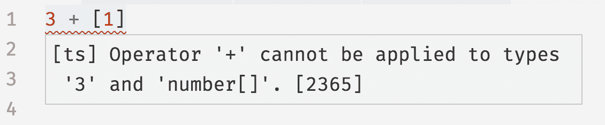

# 第二章：TypeScript：一个 10_000 英尺视角

在接下来的几章中，我将介绍 TypeScript 语言，向你概述 TypeScript 编译器（TSC）的工作原理，并带你游览 TypeScript 的特性及你可以开发的模式。我们将从编译器开始。

# 编译器

根据你过去使用的编程语言（也就是，在你决定购买这本书并致力于类型安全生活之前），你对程序如何工作有不同的理解。TypeScript 的工作方式与其他主流语言（如 JavaScript 或 Java）相比是不同寻常的，因此在我们继续深入之前，我们达成共识是很重要的。

让我们从广义上开始：程序是由你，程序员，编写的一堆文本组成的文件。这些文本被一个称为*编译器*的特殊程序解析，将其转换为*抽象语法树（AST）*，这是一种数据结构，忽略像空格、注释以及你在制表符与空格之争中站在哪一边这样的事物。编译器然后将该 AST 转换为称为*字节码*的低级表示。你可以将该字节码提供给另一个称为*运行时*的程序来评估它并获得结果。因此，当你运行一个程序时，你实际上是告诉运行时评估由编译器从你的源代码解析的 AST 生成的字节码。细节有所不同，但对于大多数语言来说，这是一个准确的高层视图。

再次，这些步骤是：

1.  程序被解析成一个 AST。

1.  AST 被编译成字节码。

1.  字节码由运行时评估。

TypeScript 的特殊之处在于，它不是直接编译成字节码，而是编译成…… JavaScript 代码！然后你像平常一样运行那些 JavaScript 代码——在你的浏览器里，或者用 NodeJS，或者用纸和笔手动输入（针对那些在机器起义后阅读本文的人）。

在这一点上，你可能会想：“等等！在上一章中你说 TypeScript 让我的代码更安全！那是什么时候发生的？”

很好的问题。我实际上跳过了一个关键步骤：在 TypeScript 编译器为你的程序生成 AST 之后——但在它发出代码之前——它会*类型检查*你的代码。

这种类型检查是 TypeScript 背后的魔力。这是 TypeScript 确保你的程序按照你的期望工作的方式，没有明显错误，并且当街对面可爱的咖啡师确实会在约定时间打电话给你的方式。（别担心，他们可能只是忙着。）

因此，如果我们包括类型检查和 JavaScript 生成，现在编译 TypeScript 的过程大致如 Figure 2-1 所示：


###### 图 2-1\. 编译和运行 TypeScript

步骤 1–3 由 TSC 完成，步骤 4–6 由你的浏览器、NodeJS，或者你使用的任何 JavaScript 引擎中的 JavaScript 运行时完成。

###### 注意

JavaScript 的编译器和运行时通常被整合成一个称为*引擎*的单一程序；作为程序员，这是你通常会交互的东西。这是 V8（驱动 NodeJS、Chrome 和 Opera 的引擎）、SpiderMonkey（Firefox）、JSCore（Safari）和 Chakra（Edge）的工作方式，它也是 JavaScript 看起来像是*解释*语言的原因。

在这个过程中，步骤 1–2 使用了你程序的类型；步骤 3 则没有。这值得重申：*当 TSC 将你的 TypeScript 代码编译成 JavaScript 时，它不会查看你的类型*。这意味着你程序的类型永远不会影响到生成的输出，并且只用于类型检查。这个特性使得可以轻松地玩耍、更新和改进你的程序类型，而不会危及到你的应用程序。

# 类型系统

现代语言有各种不同的*类型系统*。

通常有两种类型系统：一种需要使用显式语法告诉编译器每个东西的类型，另一种则会自动为你推断东西的类型。这两种方法都有权衡之处。^(1)

TypeScript 同时受到这两种类型系统的启发：你可以显式注释你的类型，也可以让 TypeScript 大部分时间为你推断类型。

要明确告诉 TypeScript 你的类型是什么，请使用注释。注释的形式是*值: 类型*，并告诉类型检查器，“嘿！你看见这里的*值*吗？它的类型是*类型*。”让我们看几个例子（每行后面的注释是 TypeScript 推断的实际类型）：

```
let a: number = 1                // a is a number
let b: string = 'hello'          // b is a string
let c: boolean[] = [true, false] // c is an array of booleans
```

如果你希望 TypeScript 为你推断类型，只需省略它们，让 TypeScript 自动处理即可：

```
let a = 1                        // a is a number
let b = 'hello'                  // b is a string
let c = [true, false]            // c is an array of booleans
```

立即你就会注意到 TypeScript 在为你推断类型方面的出色表现。如果你省略了注释，类型是相同的！在本书中，我们将仅在必要时使用注释，并尽可能让 TypeScript 发挥其推断的魔力。

###### 注意

一般来说，让 TypeScript 尽可能多地为你推断类型是一种良好的风格，将显式类型代码保持到最小。

## TypeScript 与 JavaScript 比较

让我们深入了解 TypeScript 的类型系统，以及它与 JavaScript 的类型系统的比较。表 2-1 提供了一个概述。了解这些差异对于建立 TypeScript 工作方式的心理模型至关重要。

表 2-1\. 比较 JavaScript 和 TypeScript 的类型系统

| 类型系统特性 | JavaScript | TypeScript |
| --- | --- | --- |
| **类型如何绑定？** | 动态地 | 静态地 |
| **类型是否自动转换？** | 是 | 否（大多数情况下） |
| **类型何时检查？** | 在运行时 | 在编译时 |
| **错误何时暴露？** | 在运行时（大多数情况下） | 在编译时（大多数情况下） |

### 类型如何绑定？

动态类型绑定意味着 JavaScript 需要实际运行你的程序才能知道其中的各种类型。JavaScript 在运行你的程序之前并不知道你的类型。

TypeScript 是一种*逐渐类型化*的语言。这意味着在编译时，TypeScript 最擅长于了解程序中所有内容的类型，但并不需要了解所有类型就能编译你的程序。即使在未类型化的程序中，TypeScript 也可以为你推断一些类型并捕捉一些错误，但如果不了解程序中所有内容的类型，它将让许多错误传递给用户。

这种逐渐类型化对于将未类型化的 JavaScript 遗留代码库迁移到类型化的 TypeScript 中非常有用（详见“逐步从 JavaScript 迁移到 TypeScript”），但除非你正在迁移代码库，否则应该力求 100%的类型覆盖率。这本书的方法是如此，除非特别注明。

### 类型是否会自动转换？

JavaScript 是弱类型语言，这意味着如果你做了一些无效的事情，比如将一个数字和一个数组相加（就像我们在第一章中做的那样），它会应用一系列规则来弄清楚你的真实意图，以便尽可能有效地处理你给它的内容。让我们通过具体的例子来解释 JavaScript 如何评估`3 + [1]`：

1.  JavaScript 注意到`3`是一个数字，`[1]`是一个数组。

1.  因为我们使用了`+`，它假设我们想要连接这两个值。

1.  它将`3`隐式转换为字符串，得到`"3"`。

1.  它将`[1]`隐式转换为字符串，得到`"1"`。

1.  它连接这些结果，得到`"31"`。

我们也可以更加显式地做这件事情（这样 JavaScript 就避免了步骤 1、3 和 4）：

```
3 + [1];                         // evaluates to "31"

(3).toString() + [1].toString()  // evaluates to "31"
```

尽管 JavaScript 试图通过为你进行巧妙的类型转换来帮助你，但 TypeScript 会在你做出无效操作时立即抱怨。当你通过 TSC 运行同样的 JavaScript 代码时，你会得到一个错误：

```
3 + [1];                         // Error TS2365: Operator '+' cannot be applied to
                                 // types '3' and 'number[]'.

(3).toString() + [1].toString()  // evaluates to "31"
```

如果你做了什么看起来不对的事情，TypeScript 会抱怨；如果你对自己的意图表达明确，TypeScript 会离开你的道路。这种行为是有道理的：在正常情况下，除了 JavaScript 女巫 Bavmorda 之外（她在你创业公司的地下室里点蜡烛编程），谁会试图将一个数字和一个数组相加，期望结果是一个字符串呢？

JavaScript 进行的这种隐式转换可能是错误的一个难以追踪的来源，也是许多 JavaScript 程序员的噩梦。它让单个工程师难以完成工作，也让整个团队更难以扩展代码，因为每个工程师都需要理解你的代码所做的隐含假设。

简而言之，如果必须进行类型转换，请显式地进行。

### 什么时候检查类型？

在大多数情况下，JavaScript 并不关心你给它什么类型，而是尽量将你给它的内容转换为它期望的内容。

另一方面，TypeScript 在编译时检查你的代码（记住本章开头的步骤 2），因此你无需实际运行代码就能看到前面示例中的`Error`。TypeScript *静态分析* 你的代码以检测此类错误，并在运行之前展示给你。如果你的代码无法编译，那很可能是你犯了错误，应该在运行代码之前修复它。

图 2-2 展示了当我将最后一个代码示例输入到 VSCode（我首选的代码编辑器）时会发生什么。



###### 图 2-2\. VSCode 报告的 TypeError

使用你喜欢的代码编辑器安装好 TypeScript 扩展后，当你**输入代码**时，错误将以红色的波浪线显示出来。这显著加快了编写代码、意识到错误并更新代码以修复错误之间的反馈循环。

### 错误会在何时显示？

当 JavaScript 抛出异常或执行隐式类型转换时，这是在运行时进行的。^(2) 这意味着你必须实际运行程序才能得到一个有用的信号，表明你做了一些无效操作。在最好的情况下，这意味着作为单元测试的一部分；在最坏的情况下，这意味着用户的一封愤怒的电子邮件。

TypeScript 在编译时抛出与语法相关的错误和类型相关的错误。在实际操作中，这意味着这些类型的错误将在你输入代码时立即在代码编辑器中显示出来——如果你以前从未使用过增量编译的静态类型语言，这将是一种令人惊叹的体验。^(3)

尽管如此，TypeScript 仍无法在编译时捕获许多错误，比如堆栈溢出、网络连接中断和用户输入格式错误等，在这些情况下仍会导致运行时异常。TypeScript 的作用是将在纯 JavaScript 环境中本来会是运行时错误的大多数错误变成编译时错误。

# 代码编辑器设置

现在你对 TypeScript 编译器和类型系统的工作有了一些直觉，让我们设置你的代码编辑器，开始深入到一些真实的代码中去。

首先下载一个代码编辑器来编写你的代码。我喜欢使用 VSCode，因为它提供了非常好的 TypeScript 编辑体验，但你也可以选择 Sublime Text、Atom、Vim、WebStorm 或者其他你喜欢的编辑器。工程师们对于集成开发环境非常挑剔，所以选择权留给你来决定。如果你选择使用 VSCode，请按照 [网站](https://code.visualstudio.com/) 上的说明进行设置。

TSC 本身是一个用 TypeScript 编写的命令行应用程序，^(4) 这意味着你需要 NodeJS 来运行它。请访问官方 NodeJS [网站](https://nodejs.org) 按照指南安装 NodeJS 到你的计算机上。

NodeJS 附带了 NPM，一个包管理器，您将使用它来管理项目的依赖项并编排构建过程。我们将从使用它来安装 TSC 和 TSLint（TypeScript 的代码检查工具）开始。首先打开您的终端，创建一个新文件夹，然后在其中初始化一个新的 NPM 项目：

```
# Create a new folder
mkdir chapter-2
cd chapter-2

# Initialize a new NPM project (follow the prompts)
npm init

# Install TSC, TSLint, and type declarations for NodeJS
npm install --save-dev typescript tslint @types/node
```

## tsconfig.json

每个 TypeScript 项目都应该在其根目录中包含一个名为*tsconfig.json*的文件。*tsconfig.json*文件用于定义诸如应编译哪些文件、将它们编译到哪个目录以及应生成哪个版本的 JavaScript 等内容。

在根目录中创建一个名为*tsconfig.json*的新文件（`touch tsconfig.json`），然后在代码编辑器中打开它，并给它以下内容：

```
{
  "compilerOptions": {
    "lib": ["es2015"],
    "module": "commonjs",
    "outDir": "dist",
    "sourceMap": true,
    "strict": true,
    "target": "es2015"
  },
  "include": [
    "src"
  ]
}
```

让我们简要介绍一下其中一些选项及其含义（参见表 2-2）：

表 2-2\. *tsconfig.json*选项

| Option | Description |
| --- | --- |
| `include` | TypeScript 编译器（TSC）应查找哪些文件夹以找到您的 TypeScript 文件？ |
| `lib` | TSC 应假定在您运行代码的环境中存在哪些 API？这包括 ES5 的`Function.prototype.bind`、ES2015 的`Object.assign`以及 DOM 的`document.querySelector`等内容。 |
| `module` | TSC 应将您的代码编译到哪种模块系统（CommonJS、SystemJS、ES2015 等）？ |
| `outDir` | TSC 应将生成的 JavaScript 代码放在哪个文件夹中？ |
| `strict` | 在检查无效代码时尽可能严格。此选项强制要求所有代码都经过正确类型化。我们将在本书的所有示例中使用它，您在自己的 TypeScript 项目中也应该使用它。 |
| `target` | TSC 应将您的代码编译到哪个 JavaScript 版本（ES3、ES5、ES2015、ES2016 等）？ |

这些只是可用选项中的一小部分—*tsconfig.json*支持数十个选项，并且新选项会不断添加。在实际应用中，您通常不会经常更改这些选项，除非在切换到新的模块打包工具时调整`module`和`target`设置，或者在编写面向浏览器的 TypeScript 时（您将在第十二章中学到更多相关知识），将`"dom"`添加到`lib`时，或者在将现有 JavaScript 代码逐步迁移到 TypeScript 时调整`strict`性级别（参见“逐步从 JavaScript 迁移到 TypeScript”）。有关完整和最新支持的选项列表，请访问[TypeScript 官方文档](http://bit.ly/2JWfsgY)。

注意，虽然使用*tsconfig.json*文件配置 TSC 很方便，因为它允许我们将配置纳入源代码控制，但您也可以通过命令行设置大多数 TSC 选项。运行`./node_modules/.bin/tsc --help`以获取可用命令行选项列表。

## tslint.json

您的项目还应包含一个 *tslint.json* 文件，其中包含您的 TSLint 配置，用于定义您代码的风格约定（制表符与空格等）。

###### 注意

使用 TSLint 是可选的，但强烈建议所有 TypeScript 项目都使用它来强制执行一致的编码风格。最重要的是，它将在代码审查期间为您节省与同事争论代码风格的时间。

以下命令将生成一个包含默认 TSLint 配置的 *tslint.json* 文件：

```
./node_modules/.bin/tslint --init
```

然后，您可以添加覆盖以符合自己的编码风格。例如，我的 *tslint.json* 如下所示：

```
{
  "defaultSeverity": "error",
  "extends": [
    "tslint:recommended"
  ],
  "rules": {
    "semicolon": false,
    "trailing-comma": false
  }
}
```

要获取可用规则的完整列表，请转到[TSLint 文档](https://palantir.github.io/tslint/rules/)。您还可以添加自定义规则，或安装额外的预设（比如[ReactJS](https://www.npmjs.com/package/tslint-react)）。

# `index.ts`

现在您已经设置好了 *tsconfig.json* 和 *tslint.json*，创建一个包含您的第一个 TypeScript 文件的 *src* 文件夹：

```
mkdir src
touch src/index.ts
```

您项目的文件夹结构现在应该看起来像这样：

```
chapter-2/
├──node_modules/
├──src/
│ └──index.ts
├──package.json
├──tsconfig.json
└──tslint.json
```

在代码编辑器中打开 *src/index.ts*，并输入以下 TypeScript 代码：

```
console.log('Hello TypeScript!')
```

接下来，编译并运行您的 TypeScript 代码：

```
# Compile your TypeScript with TSC
./node_modules/.bin/tsc

# Run your code with NodeJS
node ./dist/index.js
```

如果您按照这里的所有步骤操作，您的代码应该能够运行，并且您应该在控制台中看到一个单独的日志：

```
Hello TypeScript!
```

就这样——您刚刚从头开始设置并运行了您的第一个 TypeScript 项目。干得好！

###### 提示

由于这可能是您第一次从头开始设置 TypeScript 项目，我想逐步介绍每个步骤，以便您对所有组成部分有所了解。有几个快捷方式可以帮助您更快地完成这些步骤：

+   安装 [`ts-node`](https://npmjs.org/package/ts-node)，并使用它来编译并运行您的 TypeScript，只需一个命令即可。

+   使用像 [`typescript-node-starter`](https://github.com/Microsoft/TypeScript-Node-Starter) 这样的脚手架工具，快速为您生成文件夹结构。

# 练习

现在您的环境已设置好，请在代码编辑器中打开 *src/index.ts*。输入以下代码：

```
let a = 1 + 2
let b = a + 3
let c = {
  apple: a,
  banana: b
}
let d = c.apple * 4
```

现在将鼠标悬停在 `a`、`b`、`c` 和 `d` 上，并注意 TypeScript 如何为您推断所有变量的类型：`a` 是一个 `number`，`b` 是一个 `number`，`c` 是具有特定形状的对象，`d` 也是一个 `number`（参见 图 2-3）。


###### 图 2-3\. TypeScript 为您推断类型

玩弄一下您的代码。看看您是否可以：

+   当您执行无效操作时，让 TypeScript 显示红色波浪线（我们称之为“抛出 `TypeError`”）。

+   阅读 `TypeError`，并尝试理解其含义。

+   修复 `TypeError`，并看到红色波浪线消失。

如果您雄心勃勃，尝试编写一段 TypeScript 无法推断类型的代码片段。

^(1) 这个谱系上有各种语言：JavaScript、Python 和 Ruby 在运行时推断类型；Haskell 和 OCaml 在编译时推断并检查缺失的类型；Scala 和 TypeScript 需要一些显式类型，并在编译时推断和检查其余部分；而 Java 和 C 几乎需要为所有事情都做显式注解，它们在编译时进行检查。

^(2) 要确定，JavaScript 在解析你的程序后但在运行前能检测到语法错误和一些特定的错误（例如在相同作用域内多次声明相同名称的 `const`）。如果在构建过程中解析 JavaScript（例如使用 Babel），你可以在构建时检测到这些错误。

^(3) 增量编译的语言可以在你进行小改动时快速重新编译，而不需要重新编译整个程序（包括你没有触及的部分）。

^(4) 这使得 TSC 属于神秘的编译器类别，称为 *自托管编译器*，或者能够自我编译的编译器。

^(5) 对于这个练习，我们手动创建了一个 *tsconfig.json*。在未来设置 TypeScript 项目时，你可以使用 TSC 内置的初始化命令为你生成一个：`./node_modules/.bin/tsc --init`。
